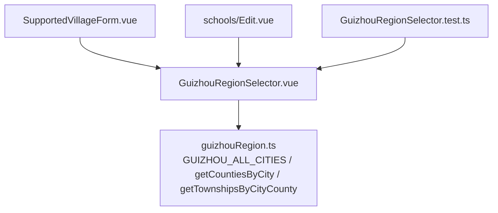
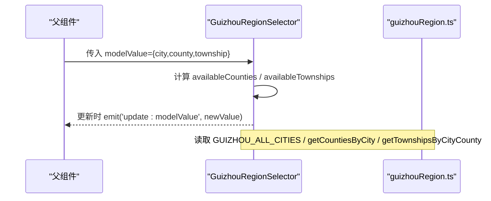
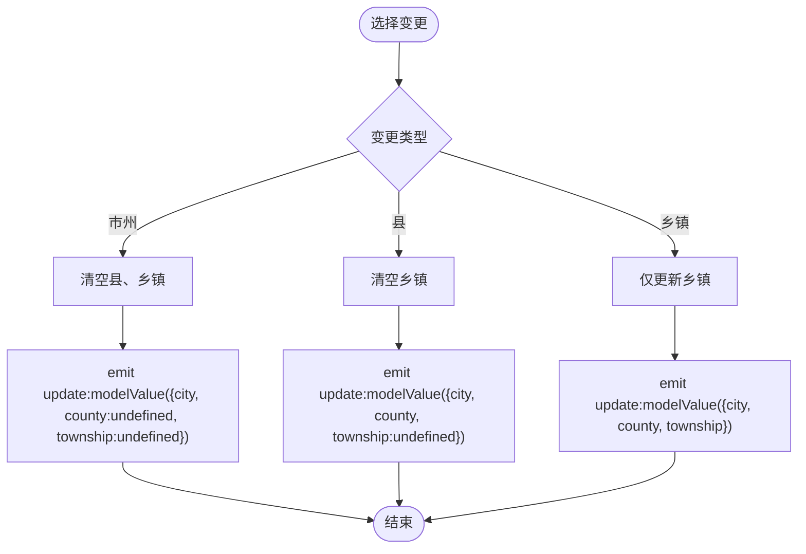
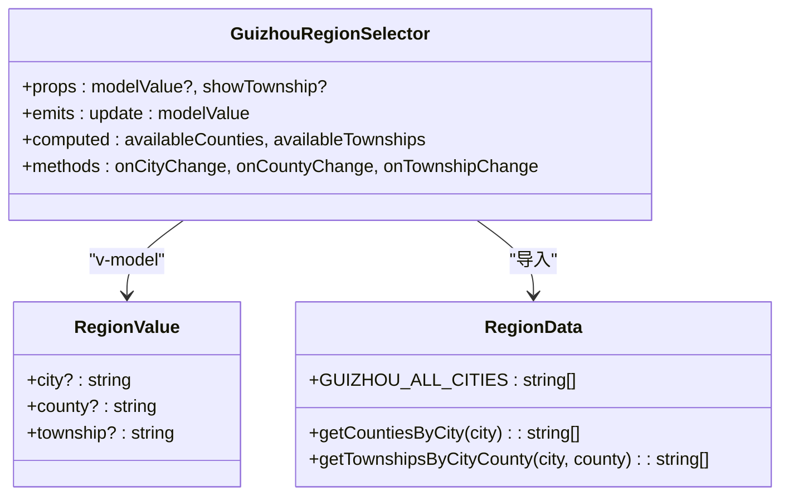

# 贵州地区选择器组件

<cite>
**本文引用的文件**
- [GuizhouRegionSelector.vue](file://frontend/src/components/common/GuizhouRegionSelector.vue)
- [guizhouRegion.ts](file://frontend/src/data/guizhouRegion.ts)
- [GuizhouRegionSelector.test.ts](file://frontend/tests/unit/components/common/GuizhouRegionSelector.test.ts)
- [SupportedVillageForm.vue](file://frontend/src/views/analytics/supported-villages/components/SupportedVillageForm.vue)
- [Edit.vue（学校编辑）](file://frontend/src/views/schools/Edit.vue)
</cite>

## 目录
1. [简介](#简介)
2. [项目结构](#项目结构)
3. [核心组件与数据结构](#核心组件与数据结构)
4. [架构总览](#架构总览)
5. [详细组件分析](#详细组件分析)
6. [依赖关系分析](#依赖关系分析)
7. [性能考虑](#性能考虑)
8. [故障排查指南](#故障排查指南)
9. [结论](#结论)
10. [附录：API 参考与使用示例](#附录api-参考与使用示例)

## 简介
本技术文档围绕“贵州地区选择器”组件 GuizhouRegionSelector，系统化说明其数据模型、级联选择逻辑、事件与属性接口、在表单中的集成方式，以及性能优化建议。该组件提供省市区（市州-县-乡镇）三级联动能力，基于本地静态数据实现快速响应，并通过计算属性驱动选项的可用性，确保用户交互的一致性与可预期性。

## 项目结构
- 组件位置：frontend/src/components/common/GuizhouRegionSelector.vue
- 数据源：frontend/src/data/guizhouRegion.ts
- 测试用例：frontend/tests/unit/components/common/GuizhouRegionSelector.test.ts
- 使用示例：
  - 支持村表单：frontend/src/views/analytics/supported-villages/components/SupportedVillageForm.vue
  - 学校编辑页：frontend/src/views/schools/Edit.vue

图表来源
- [GuizhouRegionSelector.vue:1-99](file://frontend/src/components/common/GuizhouRegionSelector.vue#L1-L99)
- [guizhouRegion.ts:1545-1557](file://frontend/src/data/guizhouRegion.ts#L1545-L1557)
- [SupportedVillageForm.vue:40-50](file://frontend/src/views/analytics/supported-villages/components/SupportedVillageForm.vue#L40-L50)
- [Edit.vue:48-56](file://frontend/src/views/schools/Edit.vue#L48-L56)

章节来源
- [GuizhouRegionSelector.vue:1-99](file://frontend/src/components/common/GuizhouRegionSelector.vue#L1-L99)
- [guizhouRegion.ts:1545-1557](file://frontend/src/data/guizhouRegion.ts#L1545-L1557)
- [SupportedVillageForm.vue:40-50](file://frontend/src/views/analytics/supported-villages/components/SupportedVillageForm.vue#L40-L50)
- [Edit.vue:48-56](file://frontend/src/views/schools/Edit.vue#L48-L56)

## 核心组件与数据结构
- 组件职责
  - 渲染市州、县市、乡镇三个下拉框，并实现级联联动
  - 通过 v-model 双向绑定 RegionValue
  - 根据当前选择动态启用/禁用下级选择器
  - 在上级变更时自动清理下级已选项，保证数据一致性

- 数据模型
  - RegionValue：包含 city、county、township 三个可选字段
  - 数据源导出：
    - GUIZHOU_ALL_CITIES：所有市州名称列表
    - getCountiesByCity(cityName)：返回某市州下的县市区列表
    - getTownshipsByCityCounty(cityName, countyName)：返回某市州+县下的乡镇列表
    - DEFAULT_PROVINCE：默认省份常量

- 计算属性
  - availableCounties：当选择了市州时，返回对应县列表；否则为空数组
  - availableTownships：当同时选择了市州和县时，返回对应乡镇列表；否则为空数组

章节来源
- [GuizhouRegionSelector.vue:47-73](file://frontend/src/components/common/GuizhouRegionSelector.vue#L47-L73)
- [guizhouRegion.ts:1542-1557](file://frontend/src/data/guizhouRegion.ts#L1542-L1557)

## 架构总览
组件采用“单向数据流 + 计算属性”的模式：
- 父组件通过 v-model 传入 RegionValue
- 组件内部监听各下拉框变化，发出 update:modelValue 事件回写父组件状态
- 计算属性根据 modelValue 派生出可用的下级选项
- 数据来源于本地静态模块，无网络请求，响应即时

图表来源
- [GuizhouRegionSelector.vue:65-97](file://frontend/src/components/common/GuizhouRegionSelector.vue#L65-L97)
- [guizhouRegion.ts:1545-1557](file://frontend/src/data/guizhouRegion.ts#L1545-L1557)

## 详细组件分析

### 级联选择逻辑
- 市州变更
  - 清空县和乡镇，避免无效数据残留
  - 重新计算可用县列表
- 县变更
  - 清空乡镇，避免无效数据残留
  - 重新计算可用乡镇列表
- 乡镇变更
  - 仅更新 township 字段

图表来源
- [GuizhouRegionSelector.vue:75-97](file://frontend/src/components/common/GuizhouRegionSelector.vue#L75-L97)

章节来源
- [GuizhouRegionSelector.vue:75-97](file://frontend/src/components/common/GuizhouRegionSelector.vue#L75-L97)

### 数据懒加载与搜索过滤
- 数据懒加载
  - 组件未实现异步懒加载，所有数据来自本地静态模块
  - 通过计算属性按需派生下级选项，避免一次性渲染大量 DOM
- 搜索过滤
  - 乡镇下拉框启用了 filterable，支持前端文本过滤
  - 市州与县下拉框未启用过滤，保持简洁

章节来源
- [GuizhouRegionSelector.vue:24-35](file://frontend/src/components/common/GuizhouRegionSelector.vue#L24-L35)

### 国际化与自定义渲染
- 国际化
  - 组件内文案为中文硬编码（如“所在市州”“先选市州”等），未暴露 i18n 键或语言包注入点
  - 如需国际化，可在父组件层封装或使用插槽替换标签文案
- 自定义渲染
  - 组件未提供插槽用于自定义每个下拉项的渲染
  - 可通过外层包裹样式或替换为自定义 Select 组件进行扩展

章节来源
- [GuizhouRegionSelector.vue:3-35](file://frontend/src/components/common/GuizhouRegionSelector.vue#L3-L35)

### 错误处理与边界情况
- 空值处理
  - 当未选择市州时，县下拉框禁用，避免误操作
  - 当未选择县时，乡镇下拉框禁用
- 清除行为
  - 清空任意层级会触发 update:modelValue，并将下游层级置为 undefined，保证数据一致性
- 缺失 modelValue
  - 组件对未传入 modelValue 的情况做了兼容，仍正常渲染并禁用下级

章节来源
- [GuizhouRegionSelector.vue:13-35](file://frontend/src/components/common/GuizhouRegionSelector.vue#L13-L35)
- [GuizhouRegionSelector.test.ts:152-166](file://frontend/tests/unit/components/common/GuizhouRegionSelector.test.ts#L152-L166)

## 依赖关系分析
- 组件依赖
  - Vue 组合式 API：computed、defineProps、defineEmits
  - Element Plus：el-form-item、el-select、el-option
  - 数据模块：@/data/guizhouRegion
- 外部耦合
  - 强依赖 guizhouRegion.ts 导出的函数与常量
  - 与父组件通过 v-model 解耦，便于复用

图表来源
- [GuizhouRegionSelector.vue:47-97](file://frontend/src/components/common/GuizhouRegionSelector.vue#L47-L97)
- [guizhouRegion.ts:1542-1557](file://frontend/src/data/guizhouRegion.ts#L1542-L1557)

章节来源
- [GuizhouRegionSelector.vue:47-97](file://frontend/src/components/common/GuizhouRegionSelector.vue#L47-L97)
- [guizhouRegion.ts:1542-1557](file://frontend/src/data/guizhouRegion.ts#L1542-L1557)

## 性能考虑
- 计算属性缓存
  - availableCounties 与 availableTownships 基于 modelValue 计算，仅在依赖变化时重算，减少不必要的渲染
- 前端过滤
  - 乡镇下拉启用 filterable，适合中小规模数据；若未来数据量增长，可考虑分页或虚拟滚动
- 无网络开销
  - 数据全部本地化，首屏即得，无额外请求延迟
- 建议
  - 若需扩展至全国范围，可将数据拆分为分片并按需加载
  - 对频繁切换场景，可引入防抖以控制事件频率（当前实现已足够轻量）

[本节为通用性能建议，不直接分析具体代码]

## 故障排查指南
- 现象：县下拉始终禁用
  - 检查是否传入了有效的 city 到 modelValue
  - 确认 GUIZHOU_ALL_CITIES 中是否存在该城市名
- 现象：乡镇无法选择或为空
  - 检查是否同时设置了 city 与 county
  - 确认 getTownshipsByCityCounty 返回非空
- 现象：切换市州后县/乡镇未清空
  - 检查 onCityChange 是否正确 emit 了包含 undefined 的新值
  - 验证父组件是否正确接收并更新 v-model
- 现象：点击清空后状态异常
  - 检查 clearable 行为与 update:modelValue 的联动
  - 确认父组件对空值的处理逻辑

章节来源
- [GuizhouRegionSelector.vue:65-97](file://frontend/src/components/common/GuizhouRegionSelector.vue#L65-L97)
- [GuizhouRegionSelector.test.ts:67-150](file://frontend/tests/unit/components/common/GuizhouRegionSelector.test.ts#L67-L150)

## 结论
GuizhouRegionSelector 是一个轻量、高内聚的地区选择组件，通过本地数据与计算属性实现了稳定的三级联动体验。其 API 简洁清晰，易于在各类表单中集成。对于大规模数据或更复杂的交互需求，可在现有基础上扩展懒加载、搜索增强与国际化能力。

[本节为总结性内容，不直接分析具体代码]

## 附录：API 参考与使用示例

### 组件属性与事件
- 属性
  - modelValue?: RegionValue
  - showTownship?: boolean（默认 true）
- 事件
  - update:modelValue(value: RegionValue)

章节来源
- [GuizhouRegionSelector.vue:53-63](file://frontend/src/components/common/GuizhouRegionSelector.vue#L53-L63)

### 数据源配置
- 市州列表：GUIZHOU_ALL_CITIES
- 获取县：getCountiesByCity(cityName)
- 获取乡镇：getTownshipsByCityCounty(cityName, countyName)
- 默认省份：DEFAULT_PROVINCE

章节来源
- [guizhouRegion.ts:1542-1560](file://frontend/src/data/guizhouRegion.ts#L1542-L1560)

### 在表单中的集成示例
- 支持村表单中使用
  - 通过 v-model 绑定 regionValue，并设置 show-township 为 true
- 学校编辑页中使用
  - 通过 v-model 绑定 regionValue，并设置 show-township 为 false（仅需市州-县）

章节来源
- [SupportedVillageForm.vue:40-50](file://frontend/src/views/analytics/supported-villages/components/SupportedVillageForm.vue#L40-L50)
- [Edit.vue:48-56](file://frontend/src/views/schools/Edit.vue#L48-L56)

### 数据同步与最佳实践
- 父组件应维护完整的 RegionValue，并在每次 update:modelValue 时合并旧值与新值
- 在视图模式下禁用组件以避免误改
- 对需要只读展示的场景，可结合 disabled 或只读模式

章节来源
- [SupportedVillageForm.vue:40-50](file://frontend/src/views/analytics/supported-villages/components/SupportedVillageForm.vue#L40-L50)
- [Edit.vue:48-56](file://frontend/src/views/schools/Edit.vue#L48-L56)