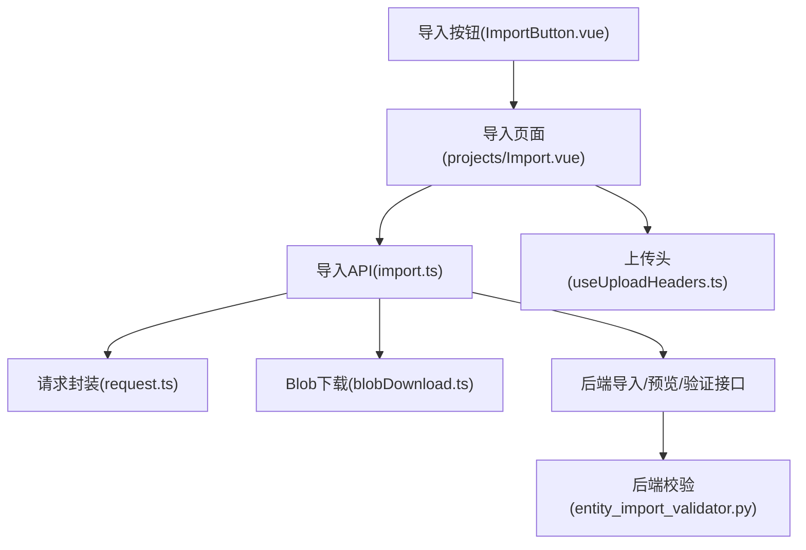
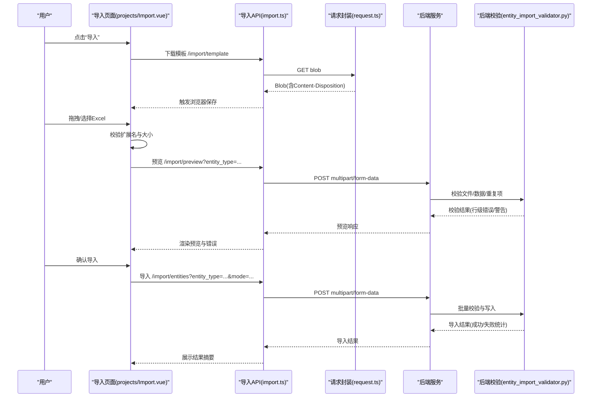
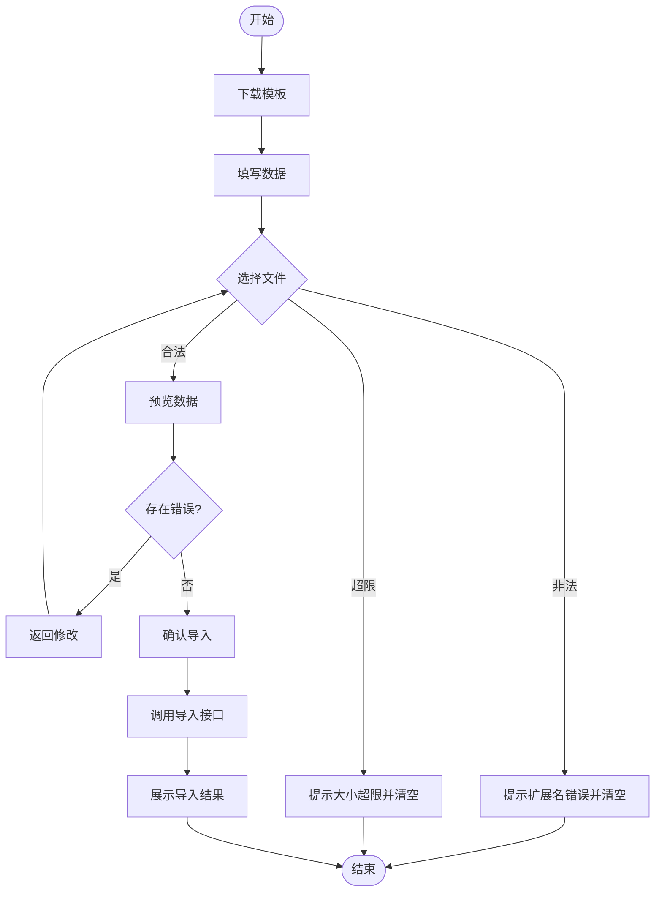
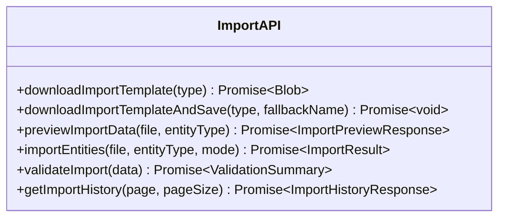
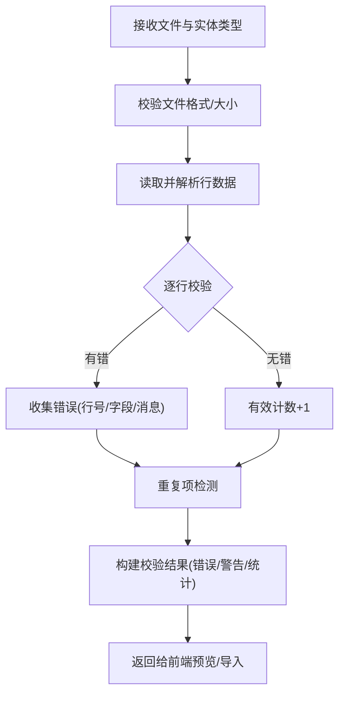
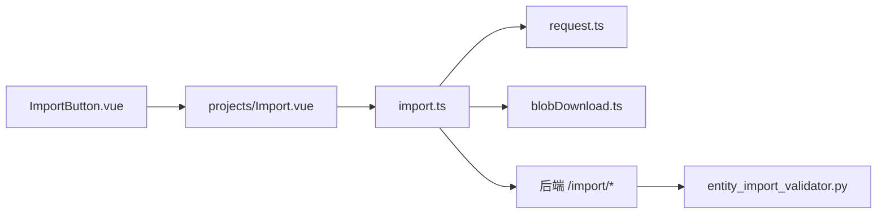

# ImportButton组件

<cite>
**本文引用的文件**
- [ImportButton.vue](file://frontend/src/components/common/ImportButton.vue)
- [projects/Import.vue](file://frontend/src/views/projects/Import.vue)
- [import.ts](file://frontend/src/api/import.ts)
- [request.ts](file://frontend/src/api/request.ts)
- [blobDownload.ts](file://frontend/src/api/helpers/blobDownload.ts)
- [useUploadHeaders.ts](file://frontend/src/composables/useUploadHeaders.ts)
- [entity_import_validator.py](file://backend/app/services/entity_import_validator.py)
- [test_import_data_a24.py](file://backend/tests/unit/test_import_data_a24.py)
</cite>

## 目录
1. [简介](#简介)
2. [项目结构](#项目结构)
3. [核心组件](#核心组件)
4. [架构总览](#架构总览)
5. [详细组件分析](#详细组件分析)
6. [依赖关系分析](#依赖关系分析)
7. [性能考虑](#性能考虑)
8. [故障排查指南](#故障排查指南)
9. [结论](#结论)
10. [附录：使用示例与最佳实践](#附录：使用示例与最佳实践)

## 简介
本技术文档围绕“导入按钮”能力进行系统化说明。尽管基础按钮组件本身仅负责触发导入流程，但项目中已提供完整的导入工作流封装，包括模板下载、拖拽上传、格式校验、大小限制、预览校验、错误提示、进度展示以及批量导入等高级功能。本文将以该工作流为核心，结合前端组件、API层与后端校验服务，给出端到端的技术解析与集成指南。

## 项目结构
- 前端基础按钮：位于通用组件目录，职责单一，仅暴露 loading 状态与 import 事件。
- 导入页面：实现多步骤向导（下载模板→填写数据→上传文件→预览→确认导入），并集成拖拽上传、校验与结果反馈。
- API 层：统一封装模板下载、预览、导入、验证、历史查询等接口，处理 Blob 下载与文件名解析。
- 后端校验：对文件格式、大小、行数、重复项等进行严格校验，返回结构化错误与警告信息。

图表来源
- [ImportButton.vue:1-8](file://frontend/src/components/common/ImportButton.vue#L1-L8)
- [projects/Import.vue:1-200](file://frontend/src/views/projects/Import.vue#L1-L200)
- [import.ts:75-157](file://frontend/src/api/import.ts#L75-L157)
- [entity_import_validator.py:377-419](file://backend/app/services/entity_import_validator.py#L377-L419)

章节来源
- [ImportButton.vue:1-8](file://frontend/src/components/common/ImportButton.vue#L1-L8)
- [projects/Import.vue:1-200](file://frontend/src/views/projects/Import.vue#L1-L200)
- [import.ts:75-157](file://frontend/src/api/import.ts#L75-L157)

## 核心组件
- 导入按钮（ImportButton.vue）
  - 属性：loading（可选），用于显示加载态。
  - 事件：import，点击时由父级监听并驱动导入流程。
  - 设计原则：最小化UI逻辑，将业务编排交由页面或组合式函数处理。

- 导入页面（projects/Import.vue）
  - 步骤化引导：模板下载、填写说明、文件上传、数据预览、确认导入。
  - 拖拽上传：基于 el-upload 的 drag 模式，限制单文件、指定扩展名。
  - 校验策略：扩展名白名单、文件大小上限、必填字段与格式校验（由后端返回）。
  - 预览与错误：调用 /import/preview 获取行级错误与警告，表格展示并支持回退修改。
  - 导入执行：调用 /import/entities 完成增量或全量导入，展示结果摘要。

章节来源
- [ImportButton.vue:1-8](file://frontend/src/components/common/ImportButton.vue#L1-L8)
- [projects/Import.vue:120-200](file://frontend/src/views/projects/Import.vue#L120-L200)

## 架构总览
导入流程采用“前端步骤化 + API 分层 + 后端强校验”的分层架构：
- 前端：通过步骤条组织交互，集中管理文件选择、校验与状态。
- API：统一封装模板下载、预览、导入、验证与历史查询；处理 Blob 下载与文件名解析。
- 后端：对文件、数据行、重复项等进行校验，返回结构化结果供前端渲染。

图表来源
- [projects/Import.vue:354-411](file://frontend/src/views/projects/Import.vue#L354-L411)
- [import.ts:84-157](file://frontend/src/api/import.ts#L84-L157)
- [entity_import_validator.py:377-419](file://backend/app/services/entity_import_validator.py#L377-L419)

## 详细组件分析

### 导入按钮（ImportButton.vue）
- 职责：提供轻量级“导入”入口，承载 loading 状态并通过事件通知上层。
- 优点：解耦UI与业务，便于在多处复用。
- 建议：可在上层封装为“带校验与向导的导入按钮”，内部自动打开步骤化导入页。

章节来源
- [ImportButton.vue:1-8](file://frontend/src/components/common/ImportButton.vue#L1-L8)

### 导入页面（projects/Import.vue）
- 模板下载：调用 /import/template，解析 RFC 5987 文件名并触发浏览器保存。
- 文件选择与校验：
  - 仅允许 .xlsx/.xls。
  - 限制最大文件大小（例如 10MB）。
  - 单文件限制，超出时提示。
- 预览与校验：
  - 调用 /import/preview，携带 entity_type。
  - 根据返回的行级 errors/warnings 展示问题，支持回退修改。
- 导入执行：
  - 调用 /import/entities，携带 entity_type 与 mode（incremental/full）。
  - 展示成功/失败计数与错误摘要。

图表来源
- [projects/Import.vue:375-411](file://frontend/src/views/projects/Import.vue#L375-L411)

章节来源
- [projects/Import.vue:354-411](file://frontend/src/views/projects/Import.vue#L354-L411)

### 导入API（import.ts）
- 模板下载：downloadImportTemplate/downloadImportTemplateAndSave，处理 Blob 与文件名解析。
- 预览：previewImportData，POST multipart/form-data，Query 参数 entity_type。
- 导入：importEntities，支持 incremental/full 模式。
- 验证：validateImport，不执行导入，仅返回校验摘要。
- 历史：getImportHistory，分页查询导入历史。

图表来源
- [import.ts:84-157](file://frontend/src/api/import.ts#L84-L157)
- [import.ts:165-223](file://frontend/src/api/import.ts#L165-L223)

章节来源
- [import.ts:84-157](file://frontend/src/api/import.ts#L84-L157)
- [import.ts:165-223](file://frontend/src/api/import.ts#L165-L223)

### 请求封装与Blob下载
- request.ts：统一发起HTTP请求，支持超时、headers、params 等配置。
- blobDownload.ts：封装 Blob 下载与文件名解析，兼容不同浏览器行为。

章节来源
- [request.ts](file://frontend/src/api/request.ts)
- [blobDownload.ts](file://frontend/src/api/helpers/blobDownload.ts)

### 上传头与会话安全
- useUploadHeaders：提供统一的上传请求头生成，可用于修复 CSRF 等场景。
- 建议在 el-upload 自定义 http-request 中注入该工具，确保鉴权与安全头一致。

章节来源
- [useUploadHeaders.ts:11-...](file://frontend/src/composables/useUploadHeaders.ts#L11-L...)

### 后端校验（entity_import_validator.py）
- 校验维度：
  - 文件格式与大小。
  - 数据行数限制。
  - 逐行字段校验与类型转换。
  - 数据库重复检测。
- 输出：
  - 结构化错误列表（行号、字段、消息）。
  - 警告列表（非阻断性提示）。
  - 汇总统计（total_rows、valid_rows、invalid_rows 等）。

图表来源
- [entity_import_validator.py:377-419](file://backend/app/services/entity_import_validator.py#L377-L419)

章节来源
- [entity_import_validator.py:377-419](file://backend/app/services/entity_import_validator.py#L377-L419)
- [test_import_data_a24.py:69-103](file://backend/tests/unit/test_import_data_a24.py#L69-L103)

## 依赖关系分析
- ImportButton.vue 依赖上层页面实现导入流程。
- projects/Import.vue 依赖 import.ts 提供的API，间接依赖 request.ts 与 blobDownload.ts。
- import.ts 依赖后端 /import/* 系列接口。
- 后端校验服务 entity_import_validator.py 被导入/预览/验证接口调用，提供强一致性校验。

图表来源
- [ImportButton.vue:1-8](file://frontend/src/components/common/ImportButton.vue#L1-L8)
- [projects/Import.vue:354-411](file://frontend/src/views/projects/Import.vue#L354-L411)
- [import.ts:84-157](file://frontend/src/api/import.ts#L84-L157)
- [entity_import_validator.py:377-419](file://backend/app/services/entity_import_validator.py#L377-L419)

章节来源
- [ImportButton.vue:1-8](file://frontend/src/components/common/ImportButton.vue#L1-L8)
- [projects/Import.vue:354-411](file://frontend/src/views/projects/Import.vue#L354-L411)
- [import.ts:84-157](file://frontend/src/api/import.ts#L84-L157)
- [entity_import_validator.py:377-419](file://backend/app/services/entity_import_validator.py#L377-L419)

## 性能考虑
- 大文件上传：
  - 前端限制文件大小（如 10MB），避免阻塞与内存压力。
  - 可结合分片上传方案（参考 ChunkedUploadManager 测试用例中的初始化、上传、合并流程）提升稳定性与用户体验。
- 预览与校验：
  - 预览接口设置合理超时（如 60s/120s），避免长时间等待导致超时。
  - 后端按行校验并尽早返回错误，减少无效数据传输。
- 网络与并发：
  - 使用统一的请求封装，集中管理超时与重试策略。
  - 避免同时发起过多导入任务，必要时引入队列或限流。

[本节为通用指导，不直接分析具体文件]

## 故障排查指南
- 模板下载失败：
  - 检查 Content-Disposition 是否包含正确文件名；若解析失败，使用兜底文件名。
  - 确认后端 /import/template 返回 Blob 且未受网关拦截。
- 文件校验失败：
  - 扩展名不在白名单：提示并清空文件列表。
  - 文件大小超限：提示并清空文件列表。
  - 单文件限制：超过时提示。
- 预览阶段错误：
  - 根据行级错误定位问题字段，提示用户修正后重新上传。
  - 关注 warnings（非阻断）与 errors（阻断）的区别。
- 导入失败：
  - 查看导入结果中的失败计数与错误明细，定位具体行与字段。
  - 检查 entity_type 与 mode 是否正确传递（Query 参数而非 FormData）。
- 后端校验异常：
  - 空文件名会被拒绝（400）。
  - 行数超限、重复项、字段缺失等会返回结构化错误。

章节来源
- [projects/Import.vue:375-411](file://frontend/src/views/projects/Import.vue#L375-L411)
- [import.ts:84-157](file://frontend/src/api/import.ts#L84-L157)
- [test_import_data_a24.py:69-103](file://backend/tests/unit/test_import_data_a24.py#L69-L103)

## 结论
ImportButton 作为轻量入口，配合项目中的导入页面与API层，提供了完整、健壮的文件导入能力。通过模板下载、拖拽上传、严格的前后端校验、预览与结果反馈，能够满足多业务场景的数据导入需求。建议在复杂场景中结合分片上传与队列机制，进一步提升大文件与高并发下的稳定性与体验。

[本节为总结，不直接分析具体文件]

## 附录：使用示例与最佳实践

### 基本用法（在任意页面中嵌入导入按钮）
- 在模板中引入 ImportButton，监听 import 事件以打开导入向导或跳转到导入页面。
- 通过 loading 属性控制按钮加载态，提升交互反馈。

章节来源
- [ImportButton.vue:1-8](file://frontend/src/components/common/ImportButton.vue#L1-L8)

### 模板下载与保存
- 使用 downloadImportTemplateAndSave(type, fallbackName) 自动解析文件名并触发保存。
- 如需自定义文件名解析，可使用 downloadImportTemplate 并自行处理 Blob。

章节来源
- [import.ts:84-111](file://frontend/src/api/import.ts#L84-L111)

### 拖拽上传与校验
- 使用 el-upload 的 drag 模式，设置 accept 与 limit。
- 在 on-change 中校验扩展名与大小，非法则提示并清空。

章节来源
- [projects/Import.vue:120-152](file://frontend/src/views/projects/Import.vue#L120-L152)
- [projects/Import.vue:375-395](file://frontend/src/views/projects/Import.vue#L375-L395)

### 预览与错误处理
- 调用 previewImportData(file, entityType)，根据返回的 rows/errors/warnings 渲染预览与错误。
- 对于 has_error 的行，展示具体错误信息并允许用户修正。

章节来源
- [import.ts:142-157](file://frontend/src/api/import.ts#L142-L157)
- [projects/Import.vue:155-200](file://frontend/src/views/projects/Import.vue#L155-L200)

### 批量导入与模式选择
- 调用 importEntities(file, entityType, mode)，mode 支持 incremental 与 full。
- 注意 entity_type 与 mode 必须通过 Query 参数传递，避免被放入 FormData 导致失效。

章节来源
- [import.ts:113-136](file://frontend/src/api/import.ts#L113-L136)

### 安全与性能最佳实践
- 安全：
  - 始终在后端进行文件类型、大小、内容校验，前端校验仅作体验优化。
  - 使用统一的上传头生成工具（useUploadHeaders）确保鉴权与安全头一致。
- 性能：
  - 合理设置超时与分页/分片策略，避免长连接阻塞。
  - 对大文件采用分片上传与断点续传，降低失败重传成本。

章节来源
- [useUploadHeaders.ts:11-...](file://frontend/src/composables/useUploadHeaders.ts#L11-L...)
- [entity_import_validator.py:377-419](file://backend/app/services/entity_import_validator.py#L377-L419)