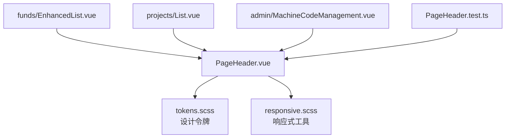
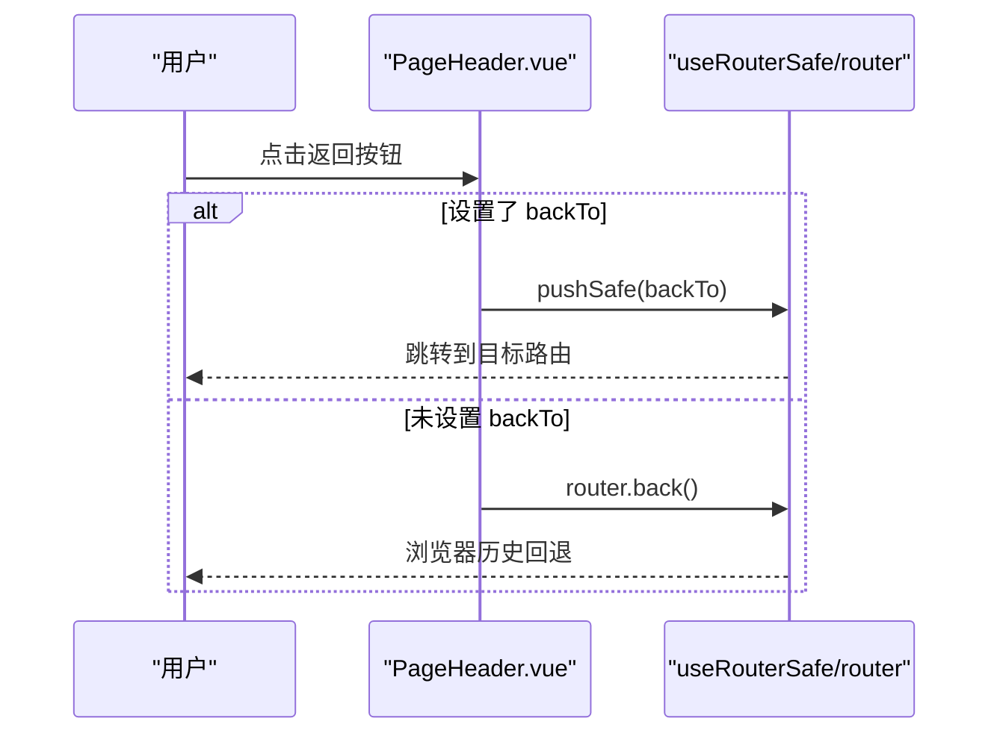
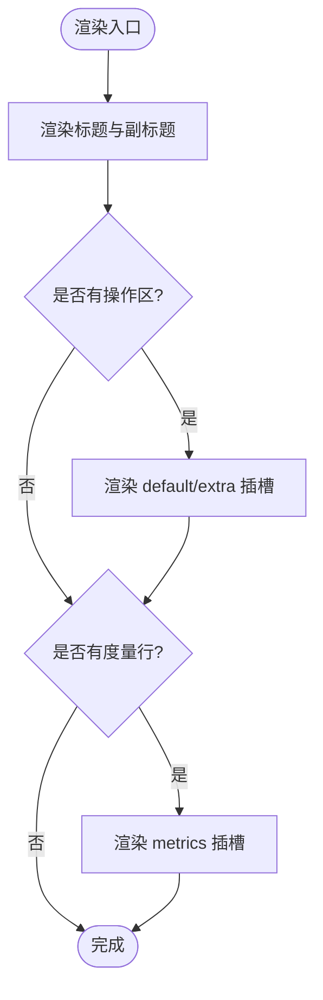
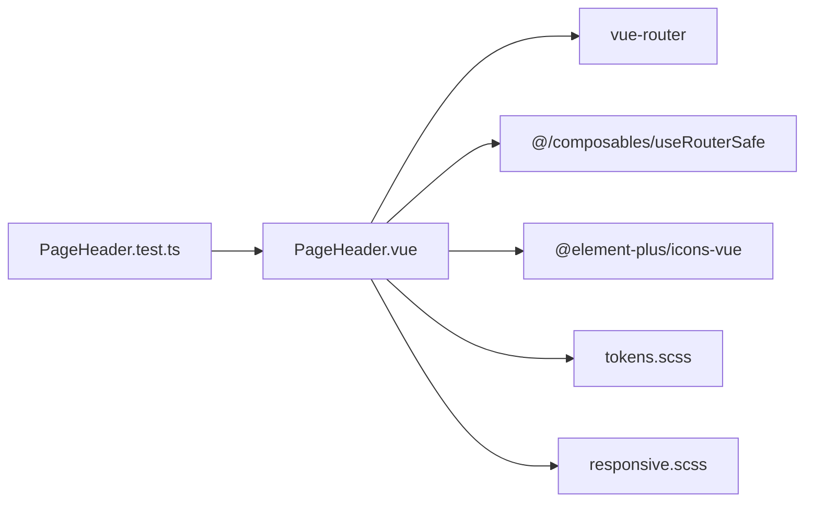

# PageHeader组件

<cite>
**本文引用的文件**
- [frontend/src/components/common/PageHeader.vue](file://frontend/src/components/common/PageHeader.vue)
- [frontend/tests/unit/components/common/PageHeader.test.ts](file://frontend/tests/unit/components/common/PageHeader.test.ts)
- [frontend/src/views/funds/EnhancedList.vue](file://frontend/src/views/funds/EnhancedList.vue)
- [frontend/src/views/projects/List.vue](file://frontend/src/views/projects/List.vue)
- [frontend/src/views/admin/MachineCodeManagement.vue](file://frontend/src/views/admin/MachineCodeManagement.vue)
- [frontend/src/styles/tokens.scss](file://frontend/src/styles/tokens.scss)
- [frontend/src/styles/responsive.scss](file://frontend/src/styles/responsive.scss)
- [frontend/docs/design/tokens.md](file://frontend/docs/design/tokens.md)
</cite>

## 目录
1. [简介](#简介)
2. [项目结构](#项目结构)
3. [核心组件](#核心组件)
4. [架构总览](#架构总览)
5. [详细组件分析](#详细组件分析)
6. [依赖分析](#依赖分析)
7. [性能考虑](#性能考虑)
8. [故障排查指南](#故障排查指南)
9. [结论](#结论)
10. [附录](#附录)

## 简介
PageHeader 是页面头部标准件，用于统一列表页与详情页的页面标题、副标题、返回行为与右侧操作区。它通过属性控制标题与返回按钮，通过插槽扩展操作按钮与度量行，配合设计令牌（Design Tokens）实现主题与响应式一致性。该组件遵循“T1 列表页 / T2 详情页模板头部”契约：标题必填、副标题可选、返回可配置、操作区唯一且右置。

## 项目结构
- 组件位置：frontend/src/components/common/PageHeader.vue
- 使用示例：
  - 列表页：frontend/src/views/funds/EnhancedList.vue、frontend/src/views/projects/List.vue
  - 管理页：frontend/admin/MachineCodeManagement.vue
- 样式与主题：frontend/src/styles/tokens.scss（颜色、字体、间距、断点、主题）、frontend/src/styles/responsive.scss（响应式工具）
- 单元测试：frontend/tests/unit/components/common/PageHeader.test.ts

图表来源
- [frontend/src/components/common/PageHeader.vue:1-116](file://frontend/src/components/common/PageHeader.vue#L1-L116)
- [frontend/src/styles/tokens.scss:12-249](file://frontend/src/styles/tokens.scss#L12-L249)
- [frontend/src/styles/responsive.scss:225-305](file://frontend/src/styles/responsive.scss#L225-L305)
- [frontend/src/views/funds/EnhancedList.vue:1-20](file://frontend/src/views/funds/EnhancedList.vue#L1-L20)
- [frontend/src/views/projects/List.vue:1-20](file://frontend/src/views/projects/List.vue#L1-L20)
- [frontend/src/views/admin/MachineCodeManagement.vue:1-13](file://frontend/src/views/admin/MachineCodeManagement.vue#L1-L13)
- [frontend/tests/unit/components/common/PageHeader.test.ts:1-68](file://frontend/tests/unit/components/common/PageHeader.test.ts#L1-L68)

章节来源
- [frontend/src/components/common/PageHeader.vue:1-116](file://frontend/src/components/common/PageHeader.vue#L1-L116)
- [frontend/src/styles/tokens.scss:12-249](file://frontend/src/styles/tokens.scss#L12-L249)
- [frontend/src/styles/responsive.scss:225-305](file://frontend/src/styles/responsive.scss#L225-L305)
- [frontend/src/views/funds/EnhancedList.vue:1-20](file://frontend/src/views/funds/EnhancedList.vue#L1-L20)
- [frontend/src/views/projects/List.vue:1-20](file://frontend/src/views/projects/List.vue#L1-L20)
- [frontend/src/views/admin/MachineCodeManagement.vue:1-13](file://frontend/src/views/admin/MachineCodeManagement.vue#L1-L13)
- [frontend/tests/unit/components/common/PageHeader.test.ts:1-68](file://frontend/tests/unit/components/common/PageHeader.test.ts#L1-L68)

## 核心组件
- 功能职责
  - 展示页面主标题与副标题
  - 提供返回按钮（详情/编辑场景），支持优先跳转指定路由或回退
  - 右侧操作区（默认插槽与 extra 插槽）
  - 可选度量行（metrics 插槽）
- 关键属性
  - title：必填，页面主标题
  - subtitle：可选，副标题
  - showBack：可选，是否显示返回按钮
  - backTo：可选，点击返回时优先跳转的路由路径
- 插槽
  - default/extra：右侧操作区（推荐将主操作放在此处）
  - metrics：标题下方的度量信息行
- 无障碍
  - 返回按钮提供 aria-label，便于屏幕阅读器识别

章节来源
- [frontend/src/components/common/PageHeader.vue:1-62](file://frontend/src/components/common/PageHeader.vue#L1-L62)
- [frontend/tests/unit/components/common/PageHeader.test.ts:15-66](file://frontend/tests/unit/components/common/PageHeader.test.ts#L15-L66)

## 架构总览
PageHeader 作为通用头部组件，被多个业务页面复用。其样式完全基于设计令牌，确保多主题与响应式一致；导航逻辑通过路由组合安全跳转。

图表来源
- [frontend/src/components/common/PageHeader.vue:37-61](file://frontend/src/components/common/PageHeader.vue#L37-L61)

章节来源
- [frontend/src/components/common/PageHeader.vue:37-61](file://frontend/src/components/common/PageHeader.vue#L37-L61)

## 详细组件分析

### API 接口与使用方式
- 属性
  - title：字符串，必填
  - subtitle：字符串，可选
  - showBack：布尔，可选，默认 false
  - backTo：字符串，可选，优先级高于 history.back()
- 插槽
  - default/extra：右侧操作区，放置按钮等交互元素
  - metrics：度量行，放置统计数字或标签
- 事件
  - 无对外事件；内部处理返回逻辑

使用示例（来自真实页面）
- 列表页带操作区：在 #extra 中放置新增、导入、导出、数据分析等按钮
- 详情页带返回：开启 showBack，并可通过 backTo 指定回退目标
- 度量行：通过 #metrics 插入统计文案

章节来源
- [frontend/src/components/common/PageHeader.vue:26-62](file://frontend/src/components/common/PageHeader.vue#L26-L62)
- [frontend/src/views/funds/EnhancedList.vue:1-20](file://frontend/src/views/funds/EnhancedList.vue#L1-L20)
- [frontend/src/views/projects/List.vue:1-20](file://frontend/src/views/projects/List.vue#L1-L20)
- [frontend/src/views/admin/MachineCodeManagement.vue:1-13](file://frontend/src/views/admin/MachineCodeManagement.vue#L1-L13)

### 布局结构与视觉规范
- 布局
  - 顶部区域：返回按钮（可选）+ 标题文本 + 右侧操作区
  - 度量行：可选，位于标题下方，支持换行与间距
- 排版
  - 标题使用设计令牌中的大字号与强调字重
  - 副标题使用较小字号与次要文字色
  - 操作区采用弹性布局，保证对齐与紧凑间距
- 主题
  - 所有颜色、字号、间距均来自 tokens.scss，支持浅色/深色/户外高对比度/军事主题切换

图表来源
- [frontend/src/components/common/PageHeader.vue:1-23](file://frontend/src/components/common/PageHeader.vue#L1-L23)
- [frontend/src/styles/tokens.scss:12-249](file://frontend/src/styles/tokens.scss#L12-L249)

章节来源
- [frontend/src/components/common/PageHeader.vue:1-23](file://frontend/src/components/common/PageHeader.vue#L1-L23)
- [frontend/src/styles/tokens.scss:12-249](file://frontend/src/styles/tokens.scss#L12-L249)

### 响应式设计
- 组件自身使用弹性布局与 token 驱动的间距/字号，天然适配不同视口
- 结合全局响应式工具类（如 text-responsive、heading-responsive）可在父级进一步微调
- 在窄屏下，建议将复杂操作区折叠为下拉菜单或隐藏次要按钮，保持标题清晰可读

章节来源
- [frontend/src/styles/responsive.scss:225-305](file://frontend/src/styles/responsive.scss#L225-L305)
- [frontend/src/styles/tokens.scss:202-249](file://frontend/src/styles/tokens.scss#L202-L249)

### 可访问性特性
- 返回按钮提供 aria-label，提升屏幕阅读器体验
- 标题语义化（h2），有助于文档结构树构建
- 建议在使用处为操作按钮补充 aria-label 或可见文本，确保键盘可达与可理解

章节来源
- [frontend/src/components/common/PageHeader.vue:4-6](file://frontend/src/components/common/PageHeader.vue#L4-L6)

### 使用场景示例
- 简单页面头部：仅传入 title，不显示返回与操作区
- 带操作的头部：通过 #extra 添加新增、导入、导出等按钮
- 带搜索的头部：在 #extra 中嵌入搜索框或全局搜索组件
- 详情页头部：开启 showBack，并通过 backTo 指定回退目标

章节来源
- [frontend/src/views/funds/EnhancedList.vue:1-20](file://frontend/src/views/funds/EnhancedList.vue#L1-L20)
- [frontend/src/views/projects/List.vue:1-20](file://frontend/src/views/projects/List.vue#L1-L20)
- [frontend/src/views/admin/MachineCodeManagement.vue:1-13](file://frontend/src/views/admin/MachineCodeManagement.vue#L1-L13)

### 样式定制与主题适配
- 样式定制原则
  - 禁止硬编码颜色与字号，全部使用 tokens.scss 中的变量
  - 通过调整父容器宽度、间距与对齐方式，适配不同页面密度
- 主题适配
  - 通过 data-theme 切换主题（light/dark/military/outdoor），组件自动继承对应颜色与尺寸
  - 标题与副标题的颜色、字号、行高均由 token 驱动，无需额外覆盖

章节来源
- [frontend/src/styles/tokens.scss:12-249](file://frontend/src/styles/tokens.scss#L12-L249)
- [frontend/docs/design/tokens.md:1-70](file://frontend/docs/design/tokens.md#L1-L70)

## 依赖分析
- 运行时依赖
  - Vue Router：用于返回与路由跳转
  - useRouterSafe：安全跳转封装
  - Element Plus Icons：返回箭头图标
- 样式依赖
  - tokens.scss：颜色、字体、间距、断点、主题
  - responsive.scss：响应式工具类
- 测试依赖
  - Vitest + @vue/test-utils：验证渲染与交互行为

图表来源
- [frontend/src/components/common/PageHeader.vue:37-62](file://frontend/src/components/common/PageHeader.vue#L37-L62)
- [frontend/tests/unit/components/common/PageHeader.test.ts:1-13](file://frontend/tests/unit/components/common/PageHeader.test.ts#L1-L13)
- [frontend/src/styles/tokens.scss:12-249](file://frontend/src/styles/tokens.scss#L12-L249)
- [frontend/src/styles/responsive.scss:225-305](file://frontend/src/styles/responsive.scss#L225-L305)

章节来源
- [frontend/src/components/common/PageHeader.vue:37-62](file://frontend/src/components/common/PageHeader.vue#L37-L62)
- [frontend/tests/unit/components/common/PageHeader.test.ts:1-13](file://frontend/tests/unit/components/common/PageHeader.test.ts#L1-L13)
- [frontend/src/styles/tokens.scss:12-249](file://frontend/src/styles/tokens.scss#L12-L249)
- [frontend/src/styles/responsive.scss:225-305](file://frontend/src/styles/responsive.scss#L225-L305)

## 性能考虑
- 组件结构简单，渲染开销低
- 插槽内容按需渲染，避免不必要的 DOM 节点
- 建议使用轻量级按钮与图标，减少首屏资源体积
- 在大量操作按钮场景下，考虑分组或折叠，降低布局复杂度

[本节为通用指导，不直接分析具体文件]

## 故障排查指南
- 返回按钮无效
  - 检查是否设置了 backTo；若未设置，需确保浏览器历史长度大于 1
  - 确认 useRouterSafe 与 vue-router 已正确注入
- 副标题未显示
  - 确认传入了 subtitle；否则不会渲染副标题节点
- 操作区未渲染
  - 确认使用了 default 或 extra 插槽，并在父组件中提供了插槽内容
- 度量行未渲染
  - 确认使用了 metrics 插槽，并在父组件中提供了插槽内容
- 主题颜色异常
  - 检查根节点 data-theme 是否正确设置
  - 确认未硬编码颜色，应使用 tokens.scss 中的变量

章节来源
- [frontend/src/components/common/PageHeader.vue:4-22](file://frontend/src/components/common/PageHeader.vue#L4-L22)
- [frontend/tests/unit/components/common/PageHeader.test.ts:15-66](file://frontend/tests/unit/components/common/PageHeader.test.ts#L15-L66)
- [frontend/src/styles/tokens.scss:12-249](file://frontend/src/styles/tokens.scss#L12-L249)

## 结论
PageHeader 以简洁的属性与插槽机制，统一了页面头部的标题、副标题、返回与操作区呈现。通过设计令牌与响应式工具，组件在不同主题与屏幕尺寸下保持一致的视觉与交互体验。建议在项目中广泛复用该组件，以提升界面一致性与开发效率。

[本节为总结性内容，不直接分析具体文件]

## 附录
- 设计令牌参考
  - 颜色、字体、间距、断点、主题定义见 tokens.scss
  - 设计规范说明见 docs/design/tokens.md
- 相关页面示例
  - 经费管理列表：frontend/src/views/funds/EnhancedList.vue
  - 项目管理列表：frontend/src/views/projects/List.vue
  - 机器码管理：frontend/src/views/admin/MachineCodeManagement.vue

章节来源
- [frontend/src/styles/tokens.scss:12-249](file://frontend/src/styles/tokens.scss#L12-L249)
- [frontend/docs/design/tokens.md:1-70](file://frontend/docs/design/tokens.md#L1-L70)
- [frontend/src/views/funds/EnhancedList.vue:1-20](file://frontend/src/views/funds/EnhancedList.vue#L1-L20)
- [frontend/src/views/projects/List.vue:1-20](file://frontend/src/views/projects/List.vue#L1-L20)
- [frontend/src/views/admin/MachineCodeManagement.vue:1-13](file://frontend/src/views/admin/MachineCodeManagement.vue#L1-L13)