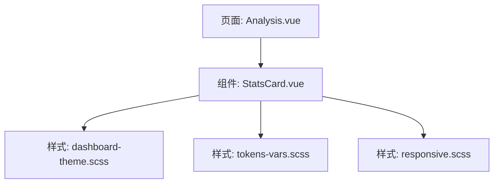
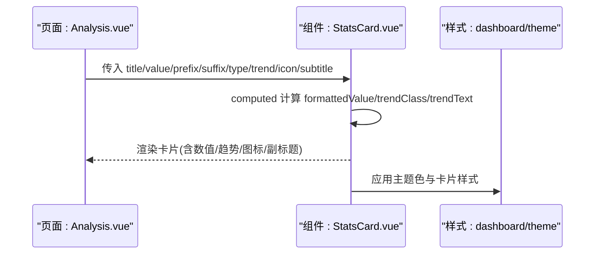
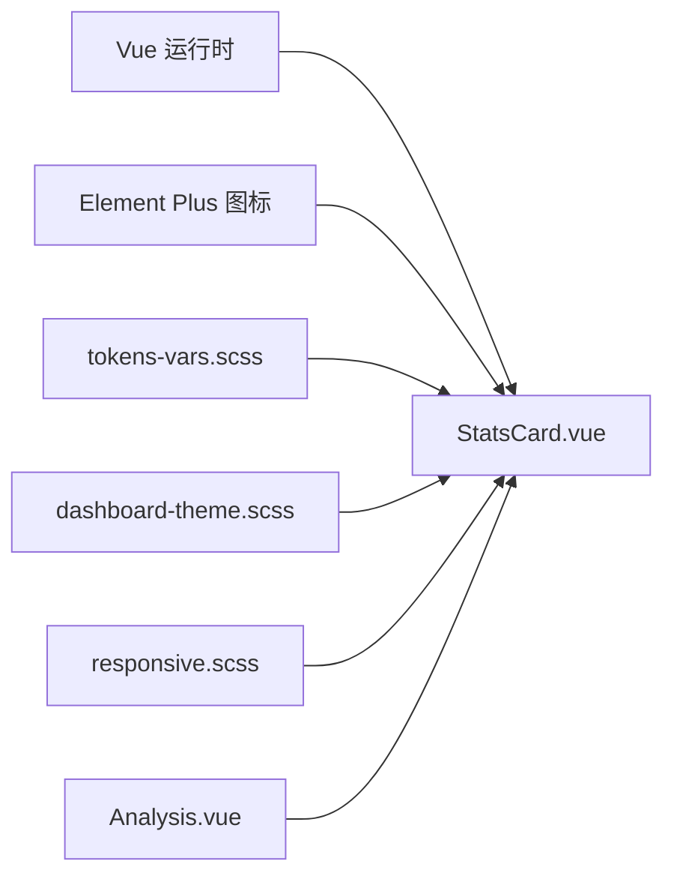
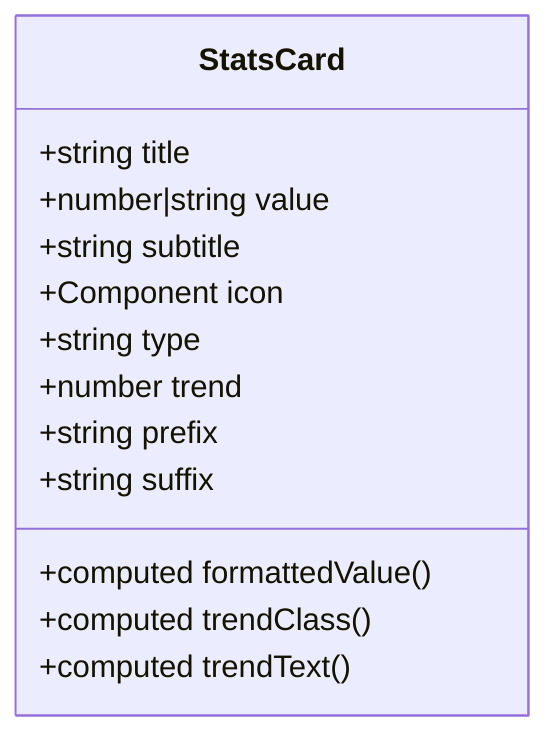
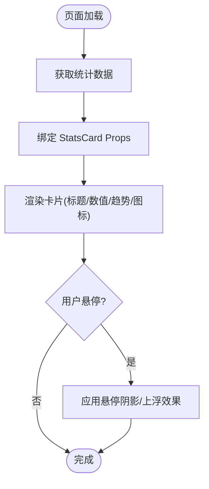

# StatsCard组件

<cite>
**本文引用的文件**
- [StatsCard.vue](file://frontend/src/components/common/StatsCard.vue)
- [StatsCard.test.ts](file://frontend/tests/unit/components/common/StatsCard.test.ts)
- [Analysis.vue](file://frontend/src/views/schools/Analysis.vue)
- [dashboard-theme.scss](file://frontend/src/styles/dashboard-theme.scss)
- [tokens-vars.scss](file://frontend/src/styles/tokens-vars.scss)
- [responsive.scss](file://frontend/src/styles/responsive.scss)
</cite>

## 目录
1. [简介](#简介)
2. [项目结构](#项目结构)
3. [核心组件](#核心组件)
4. [架构总览](#架构总览)
5. [详细组件分析](#详细组件分析)
6. [依赖关系分析](#依赖关系分析)
7. [性能考量](#性能考量)
8. [故障排查指南](#故障排查指南)
9. [结论](#结论)
10. [附录](#附录)

## 简介
StatsCard 是一个用于展示关键指标（KPI）的统计卡片组件，支持数值显示、趋势指示、图标装饰与主题色切换。它通过简洁的 Props API 绑定数据，提供前缀/后缀格式化、可选副标题与百分比趋势标签，并配合全局样式变量实现一致的主题与响应式体验。该组件已在“学校分析”页面中作为 KPI 指标卡使用，便于快速构建数据概览面板。

## 项目结构
- 组件位置：frontend/src/components/common/StatsCard.vue
- 单元测试：frontend/tests/unit/components/common/StatsCard.test.ts
- 使用示例：frontend/src/views/schools/Analysis.vue
- 主题与样式：frontend/src/styles/dashboard-theme.scss、frontend/src/styles/tokens-vars.scss、frontend/src/styles/responsive.scss

图表来源
- [Analysis.vue:1-147](file://frontend/src/views/schools/Analysis.vue#L1-L147)
- [StatsCard.vue:1-126](file://frontend/src/components/common/StatsCard.vue#L1-L126)
- [dashboard-theme.scss:1-614](file://frontend/src/styles/dashboard-theme.scss#L1-L614)
- [tokens-vars.scss:1-149](file://frontend/src/styles/tokens-vars.scss#L1-L149)
- [responsive.scss:1-439](file://frontend/src/styles/responsive.scss#L1-L439)

章节来源
- [StatsCard.vue:1-126](file://frontend/src/components/common/StatsCard.vue#L1-L126)
- [Analysis.vue:1-147](file://frontend/src/views/schools/Analysis.vue#L1-L147)

## 核心组件
- 功能职责
  - 展示标题、主数值、可选副标题与趋势标签
  - 支持图标装饰与主题色变体
  - 对数值进行本地化千分位格式化，支持前缀/后缀
  - 根据趋势值渲染上升/下降样式与文本
- 设计要点
  - 卡片圆角、阴影与悬停过渡，提升交互质感
  - 通过 CSS 变量与主题样式统一视觉风格
  - 基于 Element Plus 图标组件进行图标注入

章节来源
- [StatsCard.vue:1-126](file://frontend/src/components/common/StatsCard.vue#L1-L126)

## 架构总览
StatsCard 以 Vue 单文件组件形式存在，通过 props 接收数据与配置，内部使用 computed 计算格式化后的数值与趋势样式类名。样式层依赖全局 CSS 变量与主题样式，确保在不同主题下保持一致的视觉效果。页面层通过栅格布局将多个 StatsCard 组合为仪表盘风格的指标行。

图表来源
- [Analysis.vue:1-147](file://frontend/src/views/schools/Analysis.vue#L1-L147)
- [StatsCard.vue:17-54](file://frontend/src/components/common/StatsCard.vue#L17-L54)
- [dashboard-theme.scss:22-72](file://frontend/src/styles/dashboard-theme.scss#L22-L72)

## 详细组件分析

### 组件 API（Props）
- title: string — 卡片标题
- value: number | string — 主数值；字符串直接显示，数字自动千分位格式化
- subtitle?: string — 可选副标题
- icon?: Component — 可注入的图标组件
- type?: 'primary' | 'success' | 'warning' | 'danger' | 'info' — 主题色变体
- trend?: number — 百分比趋势；undefined 时不渲染趋势区域
- prefix?: string — 数值前缀（如货币符号）
- suffix?: string — 数值后缀（如单位）

说明
- 当 value 为数字时，会调用本地化千分位格式化并拼接前后缀
- 当 trend 未定义时，不渲染趋势区域；否则根据正负渲染上升/下降样式与文本（带 +/- 号）

章节来源
- [StatsCard.vue:20-53](file://frontend/src/components/common/StatsCard.vue#L20-L53)

### 数据展示模式与视觉设计
- 数值显示
  - 数字：自动添加千分位分隔符，支持前缀/后缀
  - 字符串：原样输出，便于外部预格式化
- 趋势指示
  - 正值显示“+X%”，负值显示“-X%”
  - 通过不同类名控制颜色（上升/下降）
- 图标装饰
  - 通过 el-icon 动态渲染传入的图标组件
  - 图标颜色受 type 主题影响
- 主题与样式
  - 卡片背景、文字、阴影等通过 CSS 变量与主题样式统一管理
  - 悬停时增强阴影，提升层次感

章节来源
- [StatsCard.vue:37-53](file://frontend/src/components/common/StatsCard.vue#L37-L53)
- [StatsCard.vue:56-125](file://frontend/src/components/common/StatsCard.vue#L56-L125)
- [dashboard-theme.scss:22-72](file://frontend/src/styles/dashboard-theme.scss#L22-L72)

### 动画与交互
- 卡片悬停阴影加深与轻微上浮
- 数值变化时的过渡由主题样式中的过渡变量控制
- 图标在悬停时可放大（在 Dashboard 主题中）

章节来源
- [StatsCard.vue:56-67](file://frontend/src/components/common/StatsCard.vue#L56-L67)
- [dashboard-theme.scss:49-52](file://frontend/src/styles/dashboard-theme.scss#L49-L52)
- [dashboard-theme.scss:333-348](file://frontend/src/styles/dashboard-theme.scss#L333-L348)

### 响应式行为
- 组件本身无内置媒体查询，依赖外层容器（如栅格列）进行布局适配
- 全局响应式工具类与断点可在页面层组合使用，使多张卡片在不同屏幕宽度下合理排列

章节来源
- [responsive.scss:14-21](file://frontend/src/styles/responsive.scss#L14-L21)
- [responsive.scss:157-179](file://frontend/src/styles/responsive.scss#L157-L179)

### 可访问性支持
- 语义化结构：标题、数值、副标题与趋势信息分层清晰
- 建议为图标元素提供 aria-hidden 或替代文本（由上层页面负责）
- 颜色对比度遵循主题变量，保证可读性

章节来源
- [StatsCard.vue:1-14](file://frontend/src/components/common/StatsCard.vue#L1-L14)
- [dashboard-theme.scss:22-72](file://frontend/src/styles/dashboard-theme.scss#L22-L72)

### 使用示例（来自实际页面）
- 基础 KPI：学校总数、学生总数、教师总数
- 状态统计：帮扶中、已完成（通过 type 区分主题）
- 金额统计：项目预算（万元）、助学金总额（元），结合页面层的格式化逻辑

章节来源
- [Analysis.vue:8-27](file://frontend/src/views/schools/Analysis.vue#L8-L27)
- [Analysis.vue:72-75](file://frontend/src/views/schools/Analysis.vue#L72-L75)

### 自定义样式与主题配置
- 主题色：通过 type 选择 primary/success/warning/danger/info，影响图标颜色
- 全局变量：通过 tokens-vars.scss 映射到 CSS 变量，集中管理颜色、间距、圆角、阴影与字体
- Dashboard 主题：dashboard-theme.scss 提供现代化卡片、数据字体、趋势标签与暗色主题覆盖
- 扩展建议
  - 新增主题：在 tokens 中定义新变量，并在组件样式中引用
  - 调整数值字体：使用数据专属字体变量，提升数字可读性与科技感
  - 微交互：利用过渡变量统一卡片与数值的动画节奏

章节来源
- [tokens-vars.scss:12-149](file://frontend/src/styles/tokens-vars.scss#L12-L149)
- [dashboard-theme.scss:22-72](file://frontend/src/styles/dashboard-theme.scss#L22-L72)
- [dashboard-theme.scss:195-233](file://frontend/src/styles/dashboard-theme.scss#L195-L233)
- [dashboard-theme.scss:575-613](file://frontend/src/styles/dashboard-theme.scss#L575-L613)

## 依赖关系分析
- 组件依赖
  - Vue 运行时：computed、Component 类型
  - Element Plus：el-icon 图标组件
- 样式依赖
  - 全局 CSS 变量与主题变量（tokens-vars.scss）
  - Dashboard 主题样式（dashboard-theme.scss）
  - 响应式工具（responsive.scss）
- 页面集成
  - 在 Analysis.vue 中以栅格列组合多张卡片，形成指标行

图表来源
- [StatsCard.vue:17-18](file://frontend/src/components/common/StatsCard.vue#L17-L18)
- [StatsCard.vue:5-7](file://frontend/src/components/common/StatsCard.vue#L5-L7)
- [tokens-vars.scss:12-149](file://frontend/src/styles/tokens-vars.scss#L12-L149)
- [dashboard-theme.scss:22-72](file://frontend/src/styles/dashboard-theme.scss#L22-L72)
- [responsive.scss:14-21](file://frontend/src/styles/responsive.scss#L14-L21)
- [Analysis.vue:53](file://frontend/src/views/schools/Analysis.vue#L53)

章节来源
- [StatsCard.vue:17-18](file://frontend/src/components/common/StatsCard.vue#L17-L18)
- [Analysis.vue:53](file://frontend/src/views/schools/Analysis.vue#L53)

## 性能考量
- 计算属性优化：formattedValue、trendClass、trendText 均为 computed，避免重复计算
- 条件渲染：trend 未定义时不渲染趋势区域，减少 DOM 节点
- 样式性能：使用 CSS 变量与 scoped 样式，减少重绘与回流
- 大数据量场景：建议在页面层对数值进行预格式化（如金额、百分比），降低组件内计算负担

[本节为通用指导，无需具体文件引用]

## 故障排查指南
- 趋势不显示
  - 检查是否传入了 trend；未定义时将不渲染趋势区域
  - 参考测试用例验证行为
- 数值格式异常
  - 若传入字符串，不会进行千分位格式化；如需格式化请传入数字或使用页面层预处理
  - 确认 prefix/suffix 是否正确拼接
- 主题色不生效
  - 确认 type 值是否为允许的五种之一
  - 检查全局主题样式是否已引入
- 图标不显示
  - 确认传入的是有效的 Vue 组件；在测试环境中需 stub el-icon

章节来源
- [StatsCard.test.ts:10-49](file://frontend/tests/unit/components/common/StatsCard.test.ts#L10-L49)
- [StatsCard.vue:37-53](file://frontend/src/components/common/StatsCard.vue#L37-L53)
- [StatsCard.vue:5-7](file://frontend/src/components/common/StatsCard.vue#L5-L7)

## 结论
StatsCard 提供了轻量、灵活且可定制的统计卡片能力，适用于 KPI 指标、进度统计与对比分析等多种场景。通过统一的 API、完善的主题与响应式支持，能够快速构建一致的仪表盘体验。建议在复杂场景中结合页面层的数据格式化与布局工具，以获得最佳的可维护性与性能表现。

[本节为总结性内容，无需具体文件引用]

## 附录

### 组件类图（代码级）

图表来源
- [StatsCard.vue:20-53](file://frontend/src/components/common/StatsCard.vue#L20-L53)

### 使用流程图（页面到组件）

图表来源
- [Analysis.vue:114-139](file://frontend/src/views/schools/Analysis.vue#L114-L139)
- [StatsCard.vue:56-67](file://frontend/src/components/common/StatsCard.vue#L56-L67)