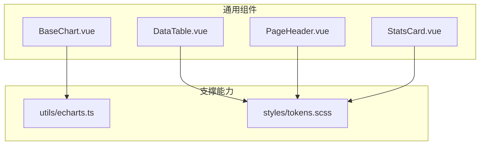
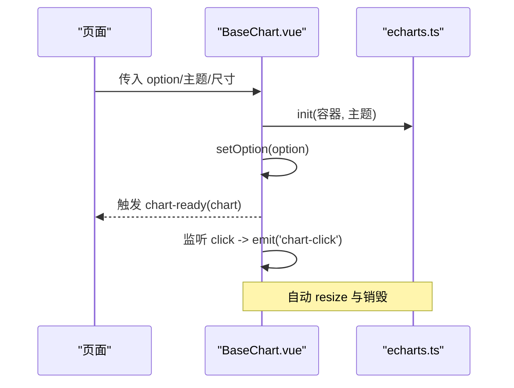
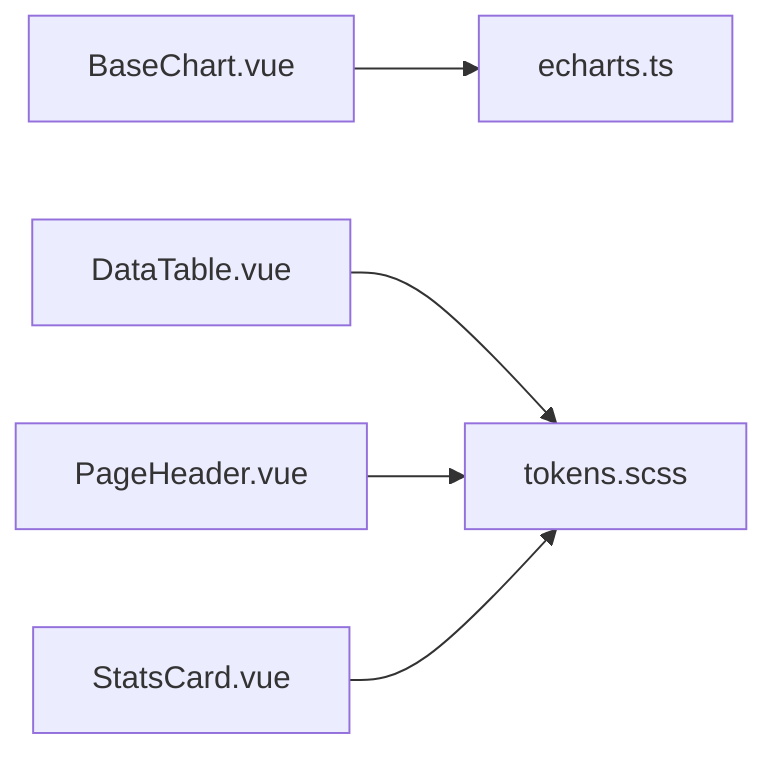

# 通用组件

<cite>
**本文引用的文件**
- [BaseChart.vue](file://frontend/src/components/common/BaseChart.vue)
- [DataTable.vue](file://frontend/src/components/common/DataTable.vue)
- [PageHeader.vue](file://frontend/src/components/common/PageHeader.vue)
- [StatsCard.vue](file://frontend/src/components/common/StatsCard.vue)
- [echarts.ts](file://frontend/src/utils/echarts.ts)
- [tokens.scss](file://frontend/src/styles/tokens.scss)
</cite>

## 目录
1. [简介](#简介)
2. [项目结构](#项目结构)
3. [核心组件](#核心组件)
4. [架构总览](#架构总览)
5. [详细组件分析](#详细组件分析)
6. [依赖关系分析](#依赖关系分析)
7. [性能考虑](#性能考虑)
8. [故障排查指南](#故障排查指南)
9. [结论](#结论)
10. [附录](#附录)

## 简介
本技术文档聚焦于前端通用组件库，覆盖 BaseChart、DataTable、PageHeader、StatsCard 四个基础 UI 组件。文档从设计理念、API 接口、属性配置、事件处理与插槽机制入手，详细说明样式定制选项与主题支持（含响应式与可访问性），并提供使用示例、最佳实践、测试方法与性能优化建议，帮助在不同业务场景中正确复用这些通用组件。

## 项目结构
通用组件位于前端 src/components/common 目录下，图表能力通过统一封装的 ECharts 工具模块提供，样式与主题由设计 Token 系统统一管理。

**图示来源**
- [BaseChart.vue:1-89](file://frontend/src/components/common/BaseChart.vue#L1-L89)
- [DataTable.vue:1-20](file://frontend/src/components/common/DataTable.vue#L1-L20)
- [PageHeader.vue:1-116](file://frontend/src/components/common/PageHeader.vue#L1-L116)
- [StatsCard.vue:1-126](file://frontend/src/components/common/StatsCard.vue#L1-L126)
- [echarts.ts:1-37](file://frontend/src/utils/echarts.ts#L1-L37)
- [tokens.scss:1-660](file://frontend/src/styles/tokens.scss#L1-L660)

**章节来源**
- [BaseChart.vue:1-89](file://frontend/src/components/common/BaseChart.vue#L1-L89)
- [DataTable.vue:1-20](file://frontend/src/components/common/DataTable.vue#L1-L20)
- [PageHeader.vue:1-116](file://frontend/src/components/common/PageHeader.vue#L1-L116)
- [StatsCard.vue:1-126](file://frontend/src/components/common/StatsCard.vue#L1-L126)
- [echarts.ts:1-37](file://frontend/src/utils/echarts.ts#L1-L37)
- [tokens.scss:1-660](file://frontend/src/styles/tokens.scss#L1-L660)

## 核心组件
- BaseChart：基于 ECharts 的轻量图表容器，负责实例化、生命周期管理、尺寸自适应与事件透传。
- DataTable：基于 Element Plus Table 的极简数据表格封装，声明式列定义，支持加载态。
- PageHeader：页面级头部标准件，包含标题、副标题、返回按钮、操作区与度量行插槽。
- StatsCard：指标卡片，展示标题、数值、可选图标、副标题与趋势信息，支持多类型主题色。

**章节来源**
- [BaseChart.vue:1-89](file://frontend/src/components/common/BaseChart.vue#L1-L89)
- [DataTable.vue:1-20](file://frontend/src/components/common/DataTable.vue#L1-L20)
- [PageHeader.vue:1-116](file://frontend/src/components/common/PageHeader.vue#L1-L116)
- [StatsCard.vue:1-126](file://frontend/src/components/common/StatsCard.vue#L1-L126)

## 架构总览
组件间职责清晰、耦合度低，遵循“单一职责 + 组合式 API”的设计原则：
- BaseChart 将 ECharts 初始化、销毁、resize 监听与事件转发封装为稳定契约，上层只需传入 option 与回调。
- DataTable 仅承担数据绑定与列渲染，复杂交互由父组件或扩展实现。
- PageHeader 提供一致的页面入口体验，路由跳转逻辑内聚且安全。
- StatsCard 以纯展示为主，计算属性驱动视觉反馈（如趋势）。

**图示来源**
- [BaseChart.vue:32-76](file://frontend/src/components/common/BaseChart.vue#L32-L76)
- [echarts.ts:15-34](file://frontend/src/utils/echarts.ts#L15-L34)

## 详细组件分析

### BaseChart 组件
- 设计理念
  - 最小化图表样板代码，统一生命周期管理与资源释放。
  - 通过 props 暴露配置项，通过 emits 暴露事件，保持单向数据流。
  - 支持主题注入与按需注册，避免全量引入带来的体积膨胀。
- API 接口
  - Props
    - option: 图表配置对象（ECharts 核心配置）
    - width?: 宽度，默认 100%
    - height?: 高度，默认 400px
    - theme?: 主题名或主题对象
    - autoResize?: 是否监听窗口 resize，默认 true
  - Events
    - chart-ready: 图表实例就绪时触发，附带 ECharts 实例
    - chart-click: 点击图表元素时触发，附带点击参数
  - Expose
    - getChart(): 获取底层 ECharts 实例
    - resize(): 手动触发图表重绘
- 事件处理
  - 内部监听 click 并向上抛出 chart-click，便于上层业务解耦。
- 插槽机制
  - 无插槽；如需自定义内容，可在外层包裹容器或使用扩展组件。
- 样式定制与主题
  - 通过 theme 传入主题；默认已注册项目主题。
  - 容器类 base-chart 提供最小高度保障，可通过 CSS 变量或外部样式覆盖。
- 响应式与可访问性
  - 自动监听窗口尺寸变化进行 resize。
  - 建议在业务层为图表区域提供合适的语义标签与键盘导航策略。
- 使用示例（路径引用）
  - 在页面中引入并传入 option 与回调即可渲染图表。参考路径：[BaseChart.vue:1-89](file://frontend/src/components/common/BaseChart.vue#L1-L89)
- 最佳实践
  - 大数据量场景下，合理设置 series 采样与 dataZoom。
  - 频繁更新 option 时使用 setOption 合并模式以减少重绘开销。
  - 在组件卸载时确保 dispose 释放内存。
- 测试方法
  - 单元测试：模拟 DOM 挂载后验证 chart-ready 触发与实例可用。
  - 集成测试：断言 chart-click 事件携带的参数结构与业务期望一致。
  - 快照测试：对比不同 option 下的渲染结果（结合 ECharts 导出图片）。
- 性能优化建议
  - 使用按需注册的 echarts 工具模块，减少打包体积。
  - 对大型数据集启用 dataZoom、抽样或虚拟滚动（配合分页）。
  - 避免在高频事件中执行重型计算，必要时节流/防抖。

**章节来源**
- [BaseChart.vue:1-89](file://frontend/src/components/common/BaseChart.vue#L1-L89)
- [echarts.ts:1-37](file://frontend/src/utils/echarts.ts#L1-L37)

### DataTable 组件
- 设计理念
  - 以声明式列配置驱动表格渲染，降低重复模板代码。
  - 保持最小实现，复杂功能（排序、筛选、分页）由父组件组合实现。
- API 接口
  - Props
    - data: 表格数据数组
    - columns: 列配置数组，每项包含 key、label、可选 width
    - loading?: 加载状态布尔值
- 事件处理
  - 未暴露事件；如需行点击等交互，可在父组件中使用 el-table 的事件或通过插槽扩展。
- 插槽机制
  - 当前版本无插槽；可扩展为支持自定义列模板与操作列。
- 样式定制与主题
  - 继承 Element Plus 表格样式；可通过 CSS 变量与主题切换适配。
- 响应式与可访问性
  - 建议使用响应式布局包裹表格，在小屏设备上启用横向滚动或列显隐。
  - 为关键列添加 aria-label 或在业务层增强可访问性。
- 使用示例（路径引用）
  - 传入 data 与 columns 即可快速渲染列表。参考路径：[DataTable.vue:1-20](file://frontend/src/components/common/DataTable.vue#L1-L20)
- 最佳实践
  - 列宽尽量固定或采用 min-width，避免抖动。
  - 大数据集建议分页或虚拟滚动，减少首屏渲染压力。
  - 将复杂列渲染下沉到子组件，提升可读性与复用性。
- 测试方法
  - 单元测试：校验 columns 映射是否正确渲染表头与数据行。
  - 行为测试：验证 loading 状态下禁用交互或显示骨架屏。
- 性能优化建议
  - 使用 v-memo 或虚拟列表（如 vue-virtual-scroller）优化长列表。
  - 避免在列渲染中进行昂贵计算，必要时缓存计算结果。

**章节来源**
- [DataTable.vue:1-20](file://frontend/src/components/common/DataTable.vue#L1-L20)

### PageHeader 组件
- 设计理念
  - 标准化页面头部结构：标题、副标题、返回按钮、右侧操作区与度量行。
  - 内聚路由回退逻辑，提供安全的返回行为。
- API 接口
  - Props
    - title: 必填，页面主标题
    - subtitle?: 副标题，用于说明页面用途
    - showBack?: 是否显示返回按钮
    - backTo?: 指定返回目标路由（不传则尝试 history.back）
  - Slots
    - default/extra: 右侧操作区（推荐唯一主操作右置）
    - metrics: 标题下方的度量行（统计数字/标签等）
- 事件处理
  - 返回按钮点击：优先跳转到 backTo 指定的路由，否则回退历史。
- 样式定制与主题
  - 使用设计 Token 控制间距、字号、颜色与阴影，保证一致性。
  - 可通过 CSS 变量覆盖局部样式（如标题大小、行高）。
- 响应式与可访问性
  - 使用 flex 布局与 gap 控制间距，适配不同屏幕宽度。
  - 返回按钮提供 aria-label，提升屏幕阅读器体验。
- 使用示例（路径引用）
  - 在页面顶部引入并传入 title、subtitle 与插槽内容。参考路径：[PageHeader.vue:1-116](file://frontend/src/components/common/PageHeader.vue#L1-L116)
- 最佳实践
  - 主操作按钮置于右侧，保持视觉动线一致。
  - 度量行用于展示关键指标，避免信息过载。
- 测试方法
  - 单元测试：验证 showBack 控制返回按钮显隐。
  - 行为测试：点击返回按钮时，根据 backTo 与历史栈执行相应路由跳转。
- 性能优化建议
  - 组件本身轻量，注意父组件避免不必要的重新渲染。

**章节来源**
- [PageHeader.vue:1-116](file://frontend/src/components/common/PageHeader.vue#L1-L116)
- [tokens.scss:1-660](file://frontend/src/styles/tokens.scss#L1-L660)

### StatsCard 组件
- 设计理念
  - 以简洁卡片呈现关键指标，支持趋势指示与多种主题色。
  - 通过计算属性格式化数值与趋势文本，保持模板简洁。
- API 接口
  - Props
    - title: 标题
    - value: 数值或字符串
    - subtitle?: 副标题
    - icon?: 图标组件
    - type?: 主题类型（primary/success/warning/danger/info）
    - trend?: 百分比趋势（可选）
    - prefix?: 前缀（如货币符号）
    - suffix?: 后缀（如单位）
- 事件处理
  - 无事件；如需点击跳转，可在外层包裹容器。
- 插槽机制
  - 无插槽；如需更灵活布局，可在外层自定义。
- 样式定制与主题
  - 通过 type 切换图标与强调色；使用设计 Token 控制背景、阴影与文字色。
  - 趋势方向通过 class 区分上升/下降，语义明确。
- 响应式与可访问性
  - 卡片尺寸与字体使用 Token 控制，易于适配不同设备。
  - 可为数值区域增加 aria-live 提示动态变化。
- 使用示例（路径引用）
  - 传入 title、value 与可选 trend/prefix/suffix 即可展示指标。参考路径：[StatsCard.vue:1-126](file://frontend/src/components/common/StatsCard.vue#L1-L126)
- 最佳实践
  - 数值较大时使用千分位分隔，提升可读性。
  - 趋势为正数时显示正号，保持一致性。
- 测试方法
  - 单元测试：校验 formattedValue 与 trendText 的计算结果。
  - 视觉回归：对比不同 type 与 trend 下的样式输出。
- 性能优化建议
  - 组件计算开销极低，无需特殊优化；注意父组件避免频繁重建实例。

**章节来源**
- [StatsCard.vue:1-126](file://frontend/src/components/common/StatsCard.vue#L1-L126)
- [tokens.scss:1-660](file://frontend/src/styles/tokens.scss#L1-L660)

## 依赖关系分析
- BaseChart 依赖 echarts 工具模块进行按需注册与主题注入，确保图表能力与体积平衡。
- DataTable、PageHeader、StatsCard 均依赖设计 Token 系统进行样式与主题管理，保证视觉一致性。
- 组件之间相互独立，通过父组件组合形成页面级视图。

**图示来源**
- [BaseChart.vue:1-89](file://frontend/src/components/common/BaseChart.vue#L1-L89)
- [DataTable.vue:1-20](file://frontend/src/components/common/DataTable.vue#L1-L20)
- [PageHeader.vue:1-116](file://frontend/src/components/common/PageHeader.vue#L1-L116)
- [StatsCard.vue:1-126](file://frontend/src/components/common/StatsCard.vue#L1-L126)
- [echarts.ts:1-37](file://frontend/src/utils/echarts.ts#L1-L37)
- [tokens.scss:1-660](file://frontend/src/styles/tokens.scss#L1-L660)

**章节来源**
- [echarts.ts:1-37](file://frontend/src/utils/echarts.ts#L1-L37)
- [tokens.scss:1-660](file://frontend/src/styles/tokens.scss#L1-L660)

## 性能考虑
- 图表渲染
  - 使用按需注册的 ECharts 模块，减少包体与初始化开销。
  - 大数据集启用 dataZoom、抽样、懒加载与增量更新。
  - 避免在 chart-click 等高频率事件中执行重型计算。
- 表格渲染
  - 长列表使用分页或虚拟滚动，减少 DOM 节点数量。
  - 列渲染函数应幂等且缓存中间结果。
- 主题与样式
  - 通过 CSS 变量集中管理主题，避免硬编码颜色。
  - 合理使用阴影与过渡，避免过度动画影响性能。
- 内存管理
  - 图表组件卸载时调用 dispose 释放实例。
  - 及时移除全局事件监听（如 window resize）。

[本节为通用指导，不直接分析具体文件]

## 故障排查指南
- BaseChart 图表不显示
  - 检查容器是否有宽高；确认 mounted 后 nextTick 初始化。
  - 确认 echarts 工具模块已按需注册所需图表与组件。
  - 查看控制台是否有主题注册错误或配置异常。
- 图表点击事件未触发
  - 确认 option 中启用了必要的交互组件（如 tooltip、dataZoom）。
  - 检查是否在父组件正确监听 chart-click 事件。
- 表格加载态异常
  - 确认 loading 属性与后端请求状态同步。
  - 检查 columns 的 key 是否与数据字段一致。
- 返回按钮行为不符合预期
  - 若设置了 backTo，将优先跳转该路由；否则回退历史。
  - 检查路由栈长度与 pushSafe 的实现细节。
- 主题样式不生效
  - 确认根节点 data-theme 设置正确。
  - 检查 CSS 变量是否被覆盖或优先级问题。

**章节来源**
- [BaseChart.vue:32-76](file://frontend/src/components/common/BaseChart.vue#L32-L76)
- [PageHeader.vue:55-61](file://frontend/src/components/common/PageHeader.vue#L55-L61)
- [echarts.ts:15-34](file://frontend/src/utils/echarts.ts#L15-L34)
- [tokens.scss:12-129](file://frontend/src/styles/tokens.scss#L12-L129)

## 结论
通用组件以清晰的 API、稳定的生命周期管理与统一的主题体系为基础，提供了高复用性的基础能力。BaseChart 简化了图表开发流程，DataTable 降低了表格样板代码，PageHeader 规范了页面头部体验，StatsCard 提供了直观的指标展示。结合设计 Token 与按需 ECharts 注册，组件在保证可维护性的同时兼顾了性能与可访问性。建议在实际项目中按本文的最佳实践与测试方法进行集成与验证。

[本节为总结性内容，不直接分析具体文件]

## 附录
- 主题与 Token
  - 颜色、间距、圆角、阴影、字体、断点、布局与密度等 Token 均在 tokens.scss 中统一定义，支持浅色、深色、军事风与户外高对比度主题。
  - 通过 data-theme 切换主题，组件样式自动适配。
- 图表主题
  - 通过 echarts.ts 统一注册项目主题，BaseChart 可直接使用 theme 参数应用。
- 可访问性建议
  - 为交互元素提供语义化标签与键盘支持。
  - 动态内容变更时使用 aria-live 或角色提示。
- 测试建议
  - 单元与集成测试覆盖关键路径（初始化、事件、主题切换）。
  - 使用可视化回归测试保障样式稳定性。

**章节来源**
- [tokens.scss:12-129](file://frontend/src/styles/tokens.scss#L12-L129)
- [tokens.scss:331-501](file://frontend/src/styles/tokens.scss#L331-L501)
- [echarts.ts:32-34](file://frontend/src/utils/echarts.ts#L32-L34)