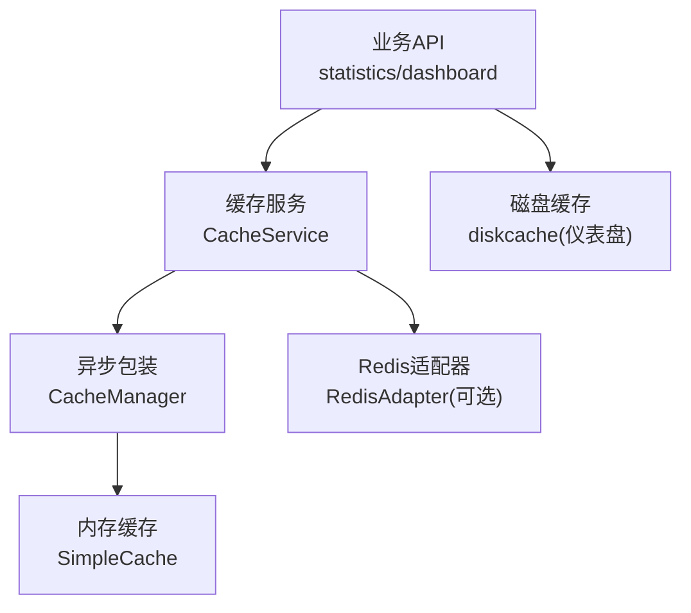
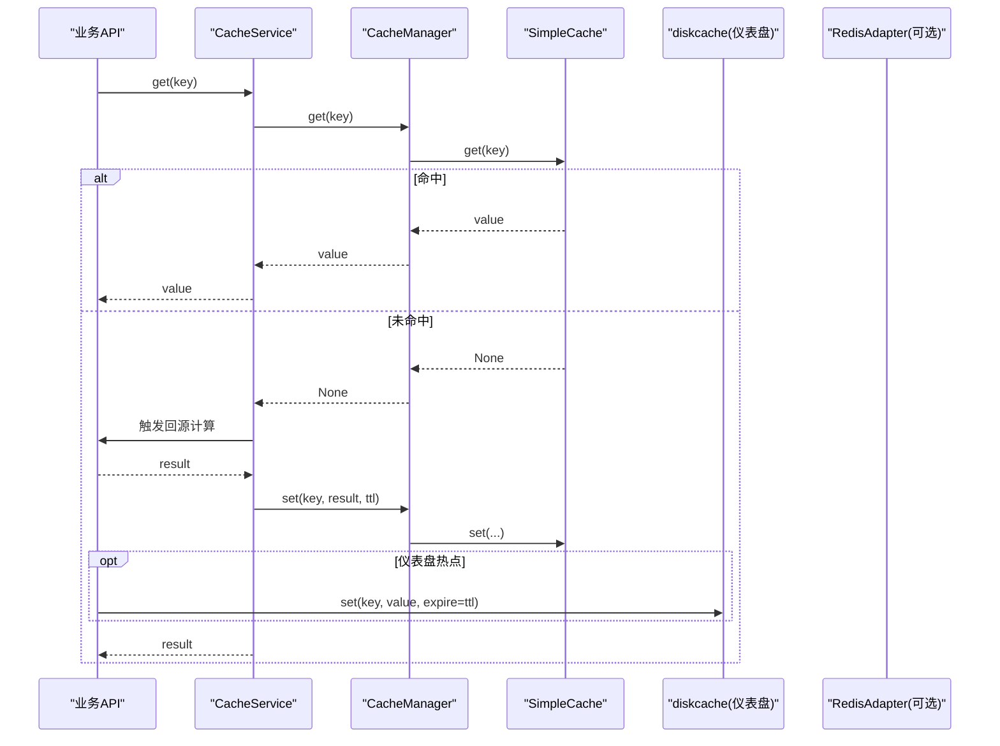
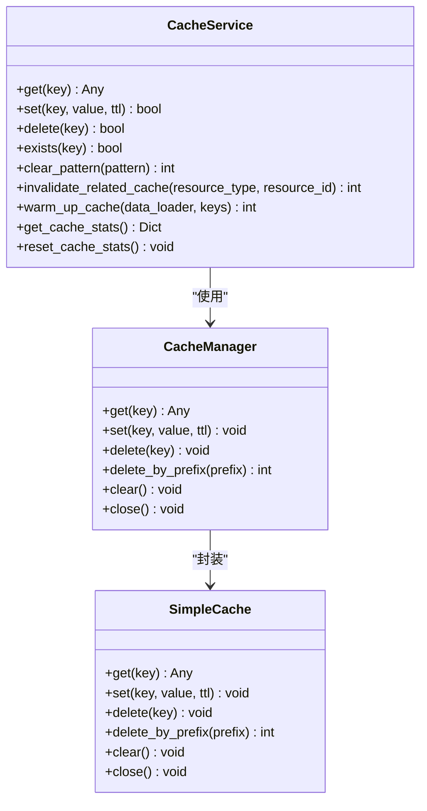
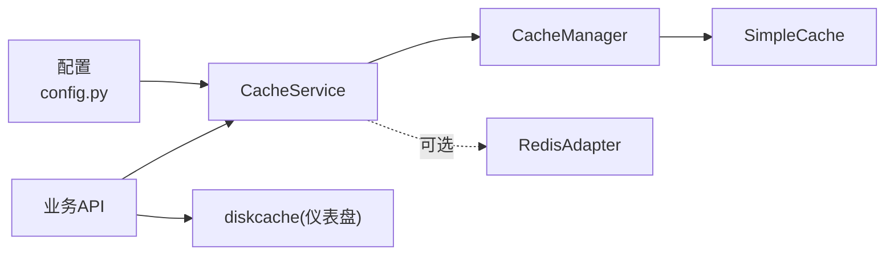
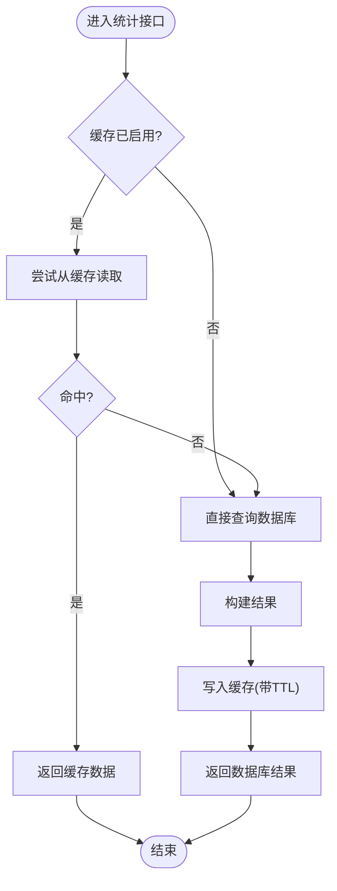
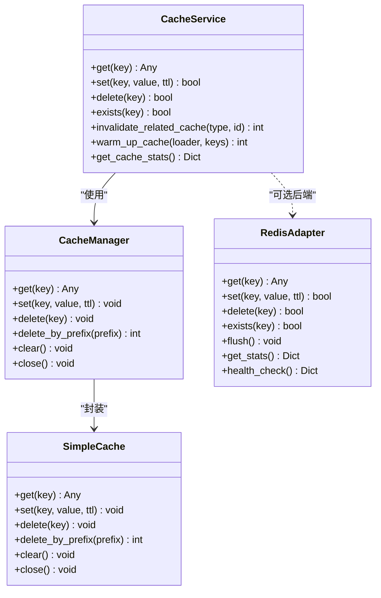

# 缓存机制

<cite>
**本文引用的文件**
- [backend/app/core/cache.py](file://backend/app/core/cache.py)
- [backend/app/services/cache_service.py](file://backend/app/services/cache_service.py)
- [backend/app/api/v1/system/cache.py](file://backend/app/api/v1/system/cache.py)
- [backend/app/core/redis_adapter.py](file://backend/app/core/redis_adapter.py)
- [backend/app/core/config.py](file://backend/app/core/config.py)
- [backend/app/api/v1/data/data/statistics.py](file://backend/app/api/v1/data/data/statistics.py)
- [backend/app/api/v1/data/data/dashboard.py](file://backend/app/api/v1/data/data/dashboard.py)
</cite>

## 目录
1. [简介](#简介)
2. [项目结构](#项目结构)
3. [核心组件](#核心组件)
4. [架构总览](#架构总览)
5. [详细组件分析](#详细组件分析)
6. [依赖关系分析](#依赖关系分析)
7. [性能与调优](#性能与调优)
8. [故障排查指南](#故障排查指南)
9. [结论](#结论)
10. [附录](#附录)

## 简介
本技术文档围绕后端缓存机制展开，重点说明多级缓存架构设计（内存缓存、Redis适配器、浏览器本地存储的协同模式）、缓存策略选择原则、缓存键生成规则与过期时间管理、缓存服务核心接口（存取/更新/删除）、一致性保证与穿透/雪崩防护、以及监控与调优实践。

## 项目结构
- 内存缓存：基于线程安全的 SimpleCache，提供 per-key TTL、容量淘汰、命中/未命中统计。
- Redis 适配：提供离线/单机场景下的无操作适配器，便于统一接入与扩展。
- 磁盘缓存：仪表盘模块使用 diskcache 做进程内持久化缓存，用于热点仪表数据。
- 业务层封装：CacheService 提供统一的 get/set/delete/失效/预热/统计能力，并暴露装饰器简化使用。
- 系统 API：提供缓存统计查询与清理接口，便于运维观测与干预。
- 配置中心：集中管理缓存开关、默认TTL、最大容量等参数。

图表来源
- [backend/app/core/cache.py:14-95](file://backend/app/core/cache.py#L14-L95)
- [backend/app/services/cache_service.py:37-110](file://backend/app/services/cache_service.py#L37-L110)
- [backend/app/core/redis_adapter.py:7-43](file://backend/app/core/redis_adapter.py#L7-L43)
- [backend/app/api/v1/data/data/dashboard.py:45-90](file://backend/app/api/v1/data/data/dashboard.py#L45-L90)

章节来源
- [backend/app/core/cache.py:14-95](file://backend/app/core/cache.py#L14-L95)
- [backend/app/services/cache_service.py:37-110](file://backend/app/services/cache_service.py#L37-L110)
- [backend/app/core/redis_adapter.py:7-43](file://backend/app/core/redis_adapter.py#L7-L43)
- [backend/app/api/v1/data/data/dashboard.py:45-90](file://backend/app/api/v1/data/data/dashboard.py#L45-L90)

## 核心组件
- SimpleCache：线程安全内存缓存，支持 per-key TTL、容量淘汰、命中/未命中计数。
- CacheManager：为 SimpleCache 提供 async 风格访问接口。
- CacheService：统一缓存服务，封装统计、失效、预热、装饰器等能力。
- RedisAdapter：离线/单机场景的内存型适配器，屏蔽外部依赖。
- 仪表盘磁盘缓存：基于 diskcache 的进程内持久化缓存，用于仪表聚合结果。
- 系统缓存API：提供统计查询与清理接口。

章节来源
- [backend/app/core/cache.py:14-95](file://backend/app/core/cache.py#L14-L95)
- [backend/app/services/cache_service.py:37-227](file://backend/app/services/cache_service.py#L37-L227)
- [backend/app/core/redis_adapter.py:7-43](file://backend/app/core/redis_adapter.py#L7-L43)
- [backend/app/api/v1/data/data/dashboard.py:45-90](file://backend/app/api/v1/data/data/dashboard.py#L45-L90)
- [backend/app/api/v1/system/cache.py:23-99](file://backend/app/api/v1/system/cache.py#L23-L99)

## 架构总览
下图展示请求在读取路径上的缓存层级与交互顺序：优先从内存缓存读取，未命中时回源计算并写入；仪表盘热点数据额外通过磁盘缓存加速；Redis适配器作为可插拔后端存在。

图表来源
- [backend/app/core/cache.py:72-95](file://backend/app/core/cache.py#L72-L95)
- [backend/app/services/cache_service.py:44-90](file://backend/app/services/cache_service.py#L44-L90)
- [backend/app/api/v1/data/data/dashboard.py:61-90](file://backend/app/api/v1/data/data/dashboard.py#L61-L90)

## 详细组件分析

### 内存缓存 SimpleCache
- 功能要点
  - 线程安全：内部使用锁保护读写。
  - Per-key TTL：写入时记录过期时间，读取时检查并清理过期项。
  - 容量淘汰：达到上限时按插入顺序淘汰最旧条目。
  - 统计指标：维护命中/未命中计数，便于命中率评估。
- 复杂度
  - get/set/delete 均为 O(1)。
  - delete_by_prefix 为 O(n)，n 为匹配前缀的键数。
- 适用场景
  - 进程内高频读、写不频繁或允许最终一致性的数据。
  - 单机部署、无外部依赖场景的首选。

章节来源
- [backend/app/core/cache.py:14-70](file://backend/app/core/cache.py#L14-L70)
- [backend/app/core/cache.py:72-95](file://backend/app/core/cache.py#L72-L95)

### 异步包装 CacheManager
- 作用：将同步 SimpleCache 暴露为 awaitable 接口，方便在异步上下文中使用。
- 方法：get/set/delete/delete_by_prefix/clear/close。

章节来源
- [backend/app/core/cache.py:72-95](file://backend/app/core/cache.py#L72-L95)

### 缓存服务 CacheService
- 统一接口
  - get/set/delete/exists：对外提供一致的缓存操作。
  - clear_pattern：当前实现为占位（提示不支持模式匹配）。
  - invalidate_related_cache：按资源类型和ID批量失效相关缓存。
  - warm_up_cache：批量预热指定键。
  - 统计：维护 hits/misses/sets/deletes 计数。
- 装饰器
  - cached：异步函数缓存装饰器，支持自定义 key 生成与前缀。
  - cache_result：同步/异步兼容的结果缓存装饰器。
  - cache_invalidate：写操作后自动失效相关缓存。
- 实体缓存 EntityCacheManager：为“list/stats/detail”三类常见后缀提供统一键管理与失效。

图表来源
- [backend/app/services/cache_service.py:37-227](file://backend/app/services/cache_service.py#L37-L227)
- [backend/app/core/cache.py:72-95](file://backend/app/core/cache.py#L72-L95)
- [backend/app/core/cache.py:14-70](file://backend/app/core/cache.py#L14-L70)

章节来源
- [backend/app/services/cache_service.py:37-227](file://backend/app/services/cache_service.py#L37-L227)
- [backend/app/services/cache_service.py:229-477](file://backend/app/services/cache_service.py#L229-L477)

### Redis 适配器（可选）
- 定位：在离线/单机模式下提供内存型适配器，屏蔽外部依赖；便于未来切换到真实 Redis。
- 能力：get/set/delete/exists/flush/get_stats/health_check。
- 注意：当前实现不统计命中率，仅返回基础指标。

章节来源
- [backend/app/core/redis_adapter.py:7-43](file://backend/app/core/redis_adapter.py#L7-L43)

### 仪表盘磁盘缓存
- 使用 diskcache 对仪表盘聚合结果进行进程内持久化缓存，设置大小限制与 TTL。
- 提供 _get_cached/_set_cached/invalidate_dashboard_cache 等工具函数。
- 当 diskcache 不可用时自动降级为禁用状态。

章节来源
- [backend/app/api/v1/data/data/dashboard.py:45-90](file://backend/app/api/v1/data/data/dashboard.py#L45-L90)

### 系统缓存 API
- GET /api/v1/cache/stats：返回内存缓存的键数量、命中率、估算大小、后端类型等。
- POST /api/v1/cache/clear：管理员权限下清空全部缓存并重置统计。

章节来源
- [backend/app/api/v1/system/cache.py:23-99](file://backend/app/api/v1/system/cache.py#L23-L99)

## 依赖关系分析
- 配置依赖
  - CACHE_ENABLED/CACHE_DEFAULT_TTL/CACHE_MAX_SIZE：控制缓存开关、默认TTL、内存缓存容量。
  - REDIS_*：预留 Redis 连接参数，当前默认关闭。
  - CACHE_DIR：磁盘缓存目录（仪表盘）。
- 模块耦合
  - CacheService 依赖 CacheManager -> SimpleCache。
  - 业务模块（如 statistics、dashboard）直接调用缓存服务或磁盘缓存。
  - RedisAdapter 作为可选后端，当前未被主流程强依赖。

图表来源
- [backend/app/core/config.py:114-183](file://backend/app/core/config.py#L114-L183)
- [backend/app/services/cache_service.py:37-110](file://backend/app/services/cache_service.py#L37-L110)
- [backend/app/api/v1/data/data/dashboard.py:45-90](file://backend/app/api/v1/data/data/dashboard.py#L45-L90)

章节来源
- [backend/app/core/config.py:114-183](file://backend/app/core/config.py#L114-L183)
- [backend/app/services/cache_service.py:37-110](file://backend/app/services/cache_service.py#L37-L110)

## 性能与调优

### 缓存策略选择原则
- 读多写少、计算昂贵、数据时效性要求不高：优先使用内存缓存（SimpleCache），配合合理 TTL。
- 跨进程/多实例共享：启用 Redis 适配器（当前为可选），实现分布式一致性。
- 热点仪表数据：结合 diskcache 降低重复计算开销。
- 前端本地存储：浏览器端可使用 localStorage/sessionStorage 缓存静态或半静态配置，减少请求；注意与后端缓存键保持一致以避免不一致。

### 缓存键生成规则
- 通用规则
  - 使用“前缀:资源标识:维度”的结构，例如 stats:summary、user:{id}、village:list。
  - 复杂参数通过哈希生成稳定键，避免长键与冲突。
- 具体实现
  - cache_key：将位置参数与关键字参数规范化为字符串，复杂对象使用 MD5 摘要。
  - 装饰器 cached/cache_result：支持 key_func/key_generator 自定义键生成。
  - EntityCacheManager：统一 entity:list/stats/detail 三态键。

章节来源
- [backend/app/services/cache_service.py:229-358](file://backend/app/services/cache_service.py#L229-L358)
- [backend/app/services/cache_service.py:427-473](file://backend/app/services/cache_service.py#L427-L473)

### 过期时间管理
- 默认 TTL：由配置项 CACHE_DEFAULT_TTL 决定，可按业务调整。
- 业务级 TTL：如统计数据 STATS_CACHE_TTL=300s，仪表盘缓存 _CACHE_TTL=120s。
- 行为：SimpleCache 在读取时检测过期并删除，避免脏读。

章节来源
- [backend/app/core/config.py:180-183](file://backend/app/core/config.py#L180-L183)
- [backend/app/api/v1/data/data/statistics.py:21-24](file://backend/app/api/v1/data/data/statistics.py#L21-L24)
- [backend/app/api/v1/data/data/dashboard.py:54-57](file://backend/app/api/v1/data/data/dashboard.py#L54-L57)
- [backend/app/core/cache.py:24-42](file://backend/app/core/cache.py#L24-L42)

### 一致性保证
- 单进程一致性：SimpleCache 通过锁保证并发安全；TTL 保证过期一致性。
- 写后失效：通过 invalidate_related_cache 或 cache_invalidate 装饰器，在写操作后主动失效相关缓存。
- 多实例一致性：可通过 Redis 适配器实现共享缓存（当前为可选）。

章节来源
- [backend/app/services/cache_service.py:150-186](file://backend/app/services/cache_service.py#L150-L186)
- [backend/app/services/cache_service.py:361-403](file://backend/app/services/cache_service.py#L361-L403)
- [backend/app/core/redis_adapter.py:7-43](file://backend/app/core/redis_adapter.py#L7-L43)

### 穿透、雪崩防护
- 穿透防护
  - 空值缓存：对查询结果为空的场景也可设置短 TTL 的占位值，防止恶意探测。
  - 限流与鉴权：结合全局速率限制与权限校验，减少异常流量。
- 雪崩防护
  - 随机化 TTL：在默认 TTL 基础上加入抖动，避免大量键同时过期。
  - 降级与熔断：缓存异常时快速失败，回退到直连数据库。
  - 热点键保护：对热点键采用独立缓存或分片策略。

[本节为通用指导，无需特定文件引用]

### 监控与统计
- 命中统计：SimpleCache 维护 _hits/_misses；CacheService 维护 hits/misses/sets/deletes。
- 系统 API：/api/v1/cache/stats 提供命中率、键数量、估算大小等。
- 建议
  - 定期采集命中率与延迟指标，设定告警阈值。
  - 针对低命中率场景优化键粒度或 TTL。
  - 对高 QPS 接口增加缓存层，减少数据库压力。

章节来源
- [backend/app/core/cache.py:17-36](file://backend/app/core/cache.py#L17-L36)
- [backend/app/services/cache_service.py:44-90](file://backend/app/services/cache_service.py#L44-L90)
- [backend/app/api/v1/system/cache.py:23-63](file://backend/app/api/v1/system/cache.py#L23-L63)

## 故障排查指南
- 常见问题
  - 缓存未生效：检查 CACHE_ENABLED 与业务模块是否正确使用缓存服务。
  - 命中率低：检查键粒度是否过细/过粗，TTL 是否合理。
  - 数据不一致：确认写操作后是否调用失效逻辑。
  - 磁盘缓存不可用：仪表盘模块在导入失败时会降级为禁用，需安装依赖。
- 处理步骤
  - 使用 /api/v1/cache/stats 查看当前缓存状态。
  - 必要时调用 /api/v1/cache/clear 清理缓存并观察恢复情况。
  - 检查日志中关于缓存读取/写入失败的警告信息。

章节来源
- [backend/app/api/v1/system/cache.py:23-99](file://backend/app/api/v1/system/cache.py#L23-L99)
- [backend/app/api/v1/data/data/dashboard.py:45-90](file://backend/app/api/v1/data/data/dashboard.py#L45-L90)

## 结论
本项目实现了以内存缓存为核心的多级缓存体系，并通过 CacheService 提供统一的存取、失效、预热与统计能力。仪表盘模块引入磁盘缓存提升热点数据性能。Redis 适配器为未来分布式扩展预留空间。通过合理的键设计、TTL 管理与失效策略，系统在单机环境下具备良好性能与稳定性。建议在生产环境逐步引入 Redis 以实现跨实例一致性，并结合监控告警持续优化命中率与延迟。

## 附录

### 关键流程图：统计数据读取与缓存

图表来源
- [backend/app/api/v1/data/data/statistics.py:27-56](file://backend/app/api/v1/data/data/statistics.py#L27-L56)

### 类图：缓存核心类关系

图表来源
- [backend/app/core/cache.py:14-95](file://backend/app/core/cache.py#L14-L95)
- [backend/app/services/cache_service.py:37-227](file://backend/app/services/cache_service.py#L37-L227)
- [backend/app/core/redis_adapter.py:7-43](file://backend/app/core/redis_adapter.py#L7-L43)