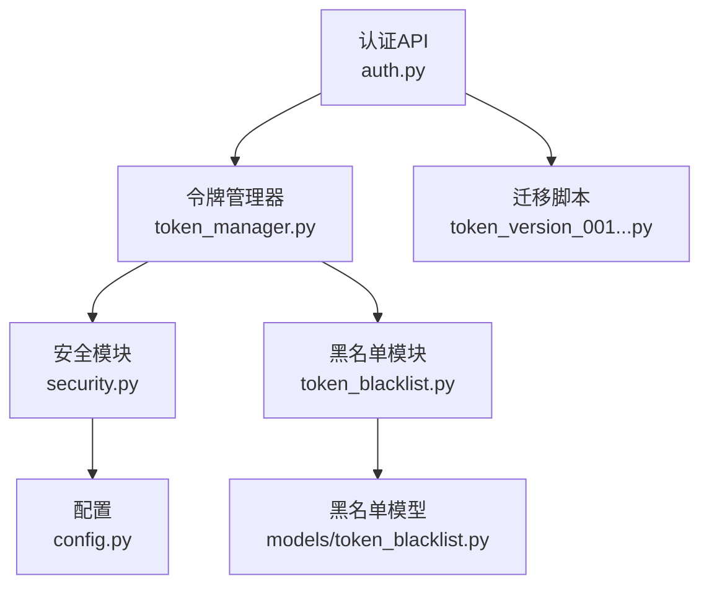
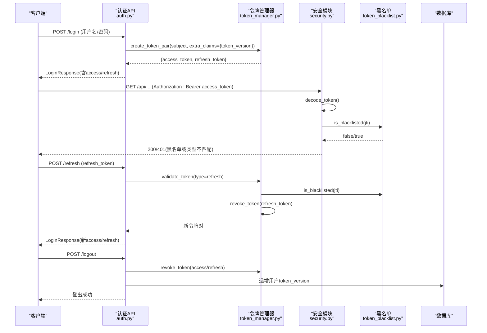
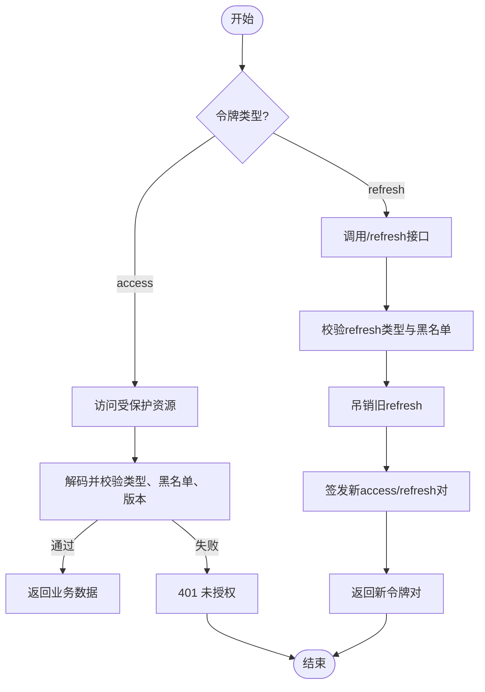
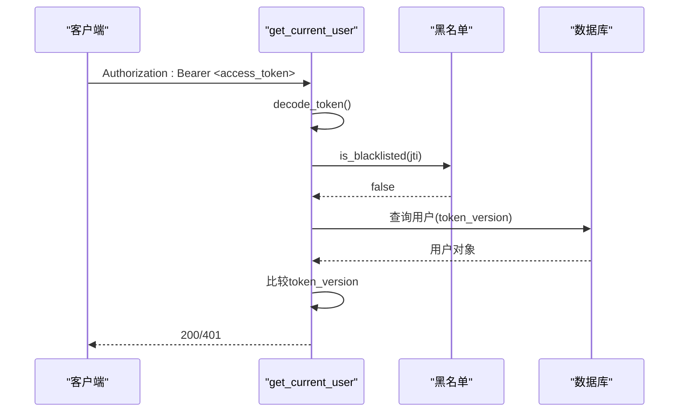
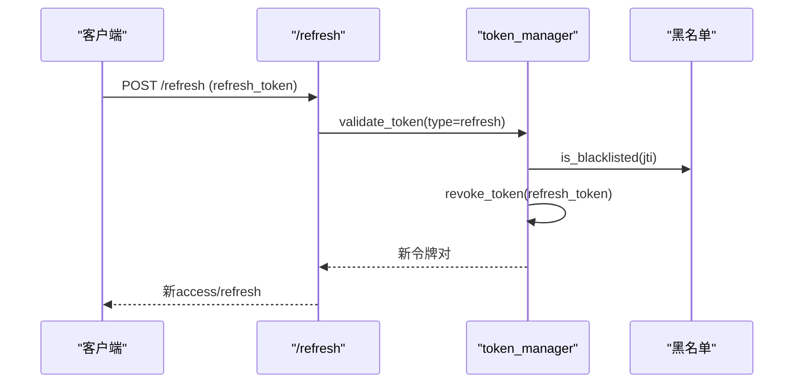
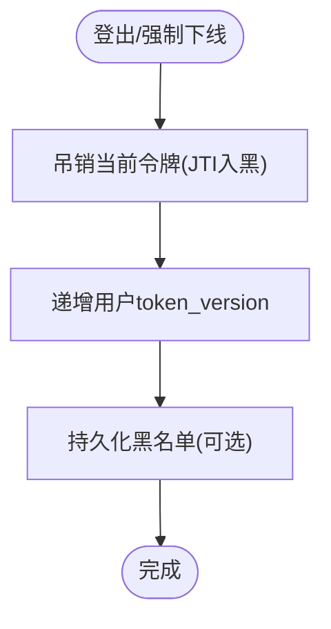
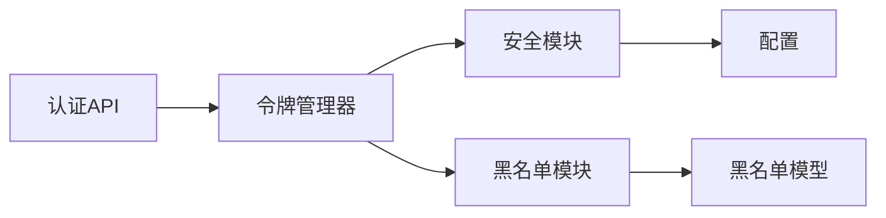

# JWT令牌管理

<cite>
**本文引用的文件**
- [security.py](file://backend/app/core/security.py)
- [token_manager.py](file://backend/app/core/token_manager.py)
- [token_blacklist.py](file://backend/app/core/token_blacklist.py)
- [token_blacklist模型](file://backend/app/models/token_blacklist.py)
- [认证API](file://backend/app/api/v1/auth/auth.py)
- [配置](file://backend/app/core/config.py)
- [迁移：添加token_version字段](file://backend/alembic/versions/token_version_001_add_token_version.py)
</cite>

## 目录
1. [简介](#简介)
2. [项目结构](#项目结构)
3. [核心组件](#核心组件)
4. [架构总览](#架构总览)
5. [详细组件分析](#详细组件分析)
6. [依赖关系分析](#依赖关系分析)
7. [性能考虑](#性能考虑)
8. [故障排查指南](#故障排查指南)
9. [结论](#结论)
10. [附录](#附录)

## 简介
本技术文档围绕JWT令牌管理功能，系统阐述访问令牌（access token）与刷新令牌（refresh token）的生成、验证、刷新与撤销机制；说明令牌生命周期管理（过期时间、自动刷新策略、黑名单机制）、安全特性（签名验证、算法与密钥管理），以及基于令牌版本控制的强制下线能力。文档同时提供面向开发者的操作指引与流程图示，帮助读者快速理解并正确使用该模块。

## 项目结构
JWT相关代码主要分布在以下位置：
- 安全与认证核心：security.py（JWT基础函数、FastAPI依赖、速率限制等）
- 令牌高层封装：token_manager.py（创建、验证、刷新、吊销的统一接口）
- 令牌黑名单：token_blacklist.py（内存+数据库持久化）
- 数据模型：models/token_blacklist.py（黑名单表结构）
- 认证API：api/v1/auth/auth.py（登录、刷新、登出、CSRF等）
- 配置：core/config.py（令牌有效期、算法、密钥来源等）
- 迁移：alembic/versions/token_version_001_add_token_version.py（用户表增加token_version字段）

**图表来源**
- [认证API:101-287](file://backend/app/api/v1/auth/auth.py#L101-L287)
- [token_manager.py:64-127](file://backend/app/core/token_manager.py#L64-L127)
- [security.py:210-235](file://backend/app/core/security.py#L210-L235)
- [token_blacklist.py:27-70](file://backend/app/core/token_blacklist.py#L27-L70)
- [token_blacklist模型:13-57](file://backend/app/models/token_blacklist.py#L13-L57)
- [配置:126-134](file://backend/app/core/config.py#L126-L134)
- [迁移:19-33](file://backend/alembic/versions/token_version_001_add_token_version.py#L19-L33)

**章节来源**
- [认证API:101-287](file://backend/app/api/v1/auth/auth.py#L101-L287)
- [token_manager.py:64-127](file://backend/app/core/token_manager.py#L64-L127)
- [security.py:210-235](file://backend/app/core/security.py#L210-L235)
- [token_blacklist.py:27-70](file://backend/app/core/token_blacklist.py#L27-L70)
- [token_blacklist模型:13-57](file://backend/app/models/token_blacklist.py#L13-L57)
- [配置:126-134](file://backend/app/core/config.py#L126-L134)
- [迁移:19-33](file://backend/alembic/versions/token_version_001_add_token_version.py#L19-L33)

## 核心组件
- 安全模块（security.py）
  - 提供create_access_token、create_refresh_token、decode_token等基础JWT操作
  - 提供get_current_user依赖，统一进行黑名单检查、类型校验、版本校验
  - 提供速率限制、客户端IP获取、敏感信息脱敏等安全工具
- 令牌管理器（token_manager.py）
  - create_token_pair：签发成对的access与refresh令牌，携带jti、type、exp等声明
  - validate_token：解码并校验类型、黑名单
  - revoke_token：将令牌加入黑名单（内存+数据库持久化）
  - refresh_access_token：使用refresh token换取新令牌对，并轮换旧refresh token
  - TokenManager单例：向后兼容旧调用方式
- 黑名单模块（token_blacklist.py）
  - 内存集合存储JTI及过期时间，周期性清理过期条目
  - 支持从数据库加载未过期记录到内存，保证重启后仍有效
  - add_to_db：将吊销记录写入token_blacklist表
- 黑名单模型（models/token_blacklist.py）
  - 定义token_jti、user_id、blacklisted_at、expires_at、reason等字段与索引
- 认证API（auth.py）
  - /login：登录成功后签发双令牌，附带token_version
  - /refresh：仅接受refresh token，校验后吊销旧refresh并签发新对
  - /logout：吊销请求中的access/refresh，并递增用户token_version实现强制下线
  - /two-factor/verify-login：2FA流程中签发临时令牌并随后替换为正式令牌
  - /csrf-token：获取CSRF令牌，配合中间件防护状态变更请求
- 配置（config.py）
  - ACCESS_TOKEN_EXPIRE_MINUTES、REFRESH_TOKEN_EXPIRE_DAYS、ALGORITHM、SECRET_KEY等
- 迁移（token_version_001_add_token_version.py）
  - 在users表新增token_version整数列，用于强制下线所有会话

**章节来源**
- [security.py:210-336](file://backend/app/core/security.py#L210-L336)
- [token_manager.py:64-283](file://backend/app/core/token_manager.py#L64-L283)
- [token_blacklist.py:27-163](file://backend/app/core/token_blacklist.py#L27-L163)
- [token_blacklist模型:13-57](file://backend/app/models/token_blacklist.py#L13-L57)
- [认证API:101-690](file://backend/app/api/v1/auth/auth.py#L101-L690)
- [配置:126-134](file://backend/app/core/config.py#L126-L134)
- [迁移:19-33](file://backend/alembic/versions/token_version_001_add_token_version.py#L19-L33)

## 架构总览
下图展示了JWT令牌在系统中的关键交互：认证API通过令牌管理器签发令牌，安全模块负责解码与鉴权，黑名单模块确保已吊销或过期的令牌不可用，配置集中管理算法与密钥。

**图表来源**
- [认证API:101-287](file://backend/app/api/v1/auth/auth.py#L101-L287)
- [认证API:594-690](file://backend/app/api/v1/auth/auth.py#L594-L690)
- [认证API:570-591](file://backend/app/api/v1/auth/auth.py#L570-L591)
- [token_manager.py:64-127](file://backend/app/core/token_manager.py#L64-L127)
- [token_manager.py:135-240](file://backend/app/core/token_manager.py#L135-L240)
- [security.py:243-336](file://backend/app/core/security.py#L243-L336)
- [token_blacklist.py:27-70](file://backend/app/core/token_blacklist.py#L27-L70)

## 详细组件分析

### 令牌生成与生命周期
- 访问令牌（access token）
  - 用途：短期凭证，用于调用受保护资源
  - 生命周期：默认ACCESS_TOKEN_EXPIRE_MINUTES分钟（配置项）
  - 载荷：包含sub、jti、type="access"、iat、exp，以及token_version
- 刷新令牌（refresh token）
  - 用途：长期凭证，用于换取新的access token
  - 生命周期：默认REFRESH_TOKEN_EXPIRE_DAYS天（配置项）
  - 载荷：包含sub、jti、type="refresh"、iat、exp
- 签发流程
  - 登录成功后调用create_token_pair，返回双令牌
  - 2FA流程中先签发短期临时access token，验证通过后吊销临时令牌并签发正式双令牌
- 自动刷新策略
  - 前端在access即将过期时，使用refresh token调用/refresh接口
  - 服务端校验refresh token有效性，吊销旧refresh并签发新对，防止重放攻击

**图表来源**
- [token_manager.py:64-127](file://backend/app/core/token_manager.py#L64-L127)
- [token_manager.py:135-240](file://backend/app/core/token_manager.py#L135-L240)
- [security.py:243-336](file://backend/app/core/security.py#L243-L336)
- [认证API:594-690](file://backend/app/api/v1/auth/auth.py#L594-L690)

**章节来源**
- [token_manager.py:64-127](file://backend/app/core/token_manager.py#L64-L127)
- [token_manager.py:135-240](file://backend/app/core/token_manager.py#L135-L240)
- [security.py:243-336](file://backend/app/core/security.py#L243-L336)
- [认证API:101-287](file://backend/app/api/v1/auth/auth.py#L101-L287)
- [认证API:594-690](file://backend/app/api/v1/auth/auth.py#L594-L690)

### 令牌验证与鉴权
- get_current_user依赖
  - 从Authorization头提取Bearer token
  - 解码token，校验类型必须为access
  - 检查黑名单（按jti）
  - 校验token_version与用户当前版本一致，否则拒绝
  - 查询用户并设置审计上下文
- 其他端点可通过token_manager.decode_token进行轻量校验（如2FA临时令牌）

**图表来源**
- [security.py:243-336](file://backend/app/core/security.py#L243-L336)
- [token_blacklist.py:60-70](file://backend/app/core/token_blacklist.py#L60-L70)

**章节来源**
- [security.py:243-336](file://backend/app/core/security.py#L243-L336)

### 令牌刷新与轮换
- 刷新流程
  - 仅接受refresh token，校验类型与黑名单
  - 吊销旧refresh token（加入黑名单）
  - 签发新access/refresh对，携带最新token_version
- 防重放
  - 每次刷新都吊销旧refresh，避免重用
- 速率限制
  - /refresh接口实施频率限制，防止滥用

**图表来源**
- [认证API:594-690](file://backend/app/api/v1/auth/auth.py#L594-L690)
- [token_manager.py:135-240](file://backend/app/core/token_manager.py#L135-L240)

**章节来源**
- [认证API:594-690](file://backend/app/api/v1/auth/auth.py#L594-L690)
- [token_manager.py:135-240](file://backend/app/core/token_manager.py#L135-L240)

### 令牌撤销与强制下线
- 黑名单机制
  - 内存集合存储JTI与过期时间，周期性清理
  - 启动时从数据库加载未过期记录，保证重启后仍有效
  - 吊销时尝试持久化到数据库，失败不影响主流程
- 登出流程
  - 吊销请求携带的access/refresh
  - 递增用户token_version，使该用户所有现存JWT立即失效
- 强制下线原理
  - 用户token_version与令牌中token_version不一致即拒绝访问
  - 无需逐个吊销历史令牌，降低运维复杂度

**图表来源**
- [认证API:570-591](file://backend/app/api/v1/auth/auth.py#L570-L591)
- [token_blacklist.py:27-163](file://backend/app/core/token_blacklist.py#L27-L163)
- [迁移:19-33](file://backend/alembic/versions/token_version_001_add_token_version.py#L19-L33)

**章节来源**
- [认证API:570-591](file://backend/app/api/v1/auth/auth.py#L570-L591)
- [token_blacklist.py:27-163](file://backend/app/core/token_blacklist.py#L27-L163)
- [迁移:19-33](file://backend/alembic/versions/token_version_001_add_token_version.py#L19-L33)

### 安全特性与密钥管理
- 签名与算法
  - 使用PyJWT进行签名与验签，算法由配置ALGORITHM决定（默认HS256）
  - 密钥来源：优先从配置读取，若为空则回退环境变量或生成临时密钥并记录严重日志
- 安全校验
  - 类型校验：access不得被用作refresh，反之亦然
  - 黑名单校验：任何已吊销令牌立即失效
  - 版本校验：token_version不匹配即拒绝，支持强制下线
- 速率限制与防暴力破解
  - 登录、注册、刷新等接口均有限流保护
  - 账户锁定服务结合失败次数与锁定时长

**章节来源**
- [security.py:61-89](file://backend/app/core/security.py#L61-L89)
- [security.py:210-235](file://backend/app/core/security.py#L210-L235)
- [security.py:243-336](file://backend/app/core/security.py#L243-L336)
- [配置:126-134](file://backend/app/core/config.py#L126-L134)

### 代码示例路径（不含具体代码）
- 创建令牌对（登录成功后）
  - 参考路径：[认证API:228-234](file://backend/app/api/v1/auth/auth.py#L228-L234)
- 验证令牌（受保护接口）
  - 参考路径：[security.py:243-336](file://backend/app/core/security.py#L243-L336)
- 刷新令牌
  - 参考路径：[认证API:594-690](file://backend/app/api/v1/auth/auth.py#L594-L690)
- 撤销令牌（登出）
  - 参考路径：[认证API:570-591](file://backend/app/api/v1/auth/auth.py#L570-L591)
- 处理令牌失效（版本不匹配/黑名单）
  - 参考路径：[security.py:266-323](file://backend/app/core/security.py#L266-L323)

## 依赖关系分析
- 模块耦合
  - 认证API依赖令牌管理器与安全模块
  - 令牌管理器依赖安全模块（密钥与算法）与黑名单模块
  - 黑名单模块依赖数据库模型，支持内存与持久化双写
- 外部依赖
  - PyJWT用于签名与验签
  - SQLAlchemy用于数据库操作
  - FastAPI依赖注入用于认证流程

**图表来源**
- [认证API:101-287](file://backend/app/api/v1/auth/auth.py#L101-L287)
- [token_manager.py:64-127](file://backend/app/core/token_manager.py#L64-L127)
- [security.py:210-235](file://backend/app/core/security.py#L210-L235)
- [token_blacklist.py:27-70](file://backend/app/core/token_blacklist.py#L27-L70)
- [token_blacklist模型:13-57](file://backend/app/models/token_blacklist.py#L13-L57)
- [配置:126-134](file://backend/app/core/config.py#L126-L134)

**章节来源**
- [认证API:101-287](file://backend/app/api/v1/auth/auth.py#L101-L287)
- [token_manager.py:64-127](file://backend/app/core/token_manager.py#L64-L127)
- [security.py:210-235](file://backend/app/core/security.py#L210-L235)
- [token_blacklist.py:27-70](file://backend/app/core/token_blacklist.py#L27-L70)
- [token_blacklist模型:13-57](file://backend/app/models/token_blacklist.py#L13-L57)
- [配置:126-134](file://backend/app/core/config.py#L126-L134)

## 性能考虑
- 黑名单内存集合
  - 高频is_blacklisted调用具备线程安全与过期清理，减少数据库压力
  - 启动时批量加载未过期记录，兼顾可用性与性能
- 令牌有效期
  - access token较短（默认480分钟），降低泄露风险
  - refresh token较长（默认30天），但每次刷新都会轮换，减少重放风险
- 速率限制
  - 登录、注册、刷新等接口限流，防止暴力破解与滥用
- 数据库索引
  - 黑名单表对用户ID、时间、过期时间建立索引，提升查询效率

[本节为通用性能讨论，不直接分析具体文件]

## 故障排查指南
- 常见错误与定位
  - 无效或过期令牌：检查decode_token返回值与JWTError异常
  - 令牌类型不匹配：确认请求是否误用refresh作为access
  - 令牌已被吊销：检查黑名单是否包含对应jti
  - 令牌版本不匹配：检查用户token_version是否已递增
- 排查步骤
  - 查看安全模块日志（解码失败、黑名单命中）
  - 检查黑名单内存与数据库一致性
  - 核对配置中的算法与密钥是否一致
  - 审查认证API的速率限制与账户锁定逻辑

**章节来源**
- [security.py:210-235](file://backend/app/core/security.py#L210-L235)
- [security.py:243-336](file://backend/app/core/security.py#L243-L336)
- [token_blacklist.py:60-70](file://backend/app/core/token_blacklist.py#L60-L70)
- [认证API:594-690](file://backend/app/api/v1/auth/auth.py#L594-L690)

## 结论
本系统的JWT令牌管理实现了完整的签发、验证、刷新与撤销闭环，并通过黑名单与令牌版本控制提供了强力的即时失效能力。安全层面采用可配置的签名算法与密钥管理，结合速率限制与账户锁定，有效抵御常见攻击。建议在生产环境中严格配置密钥与有效期，并结合监控与审计日志持续优化安全性与可用性。

[本节为总结性内容，不直接分析具体文件]

## 附录
- 关键配置项
  - ACCESS_TOKEN_EXPIRE_MINUTES：访问令牌有效期（分钟）
  - REFRESH_TOKEN_EXPIRE_DAYS：刷新令牌有效期（天）
  - ALGORITHM：签名算法（默认HS256）
  - SECRET_KEY：签名密钥（优先从配置读取，回退环境变量或临时生成）
- 迁移与扩展
  - users表token_version字段用于强制下线
  - 可扩展黑名单策略（如按用户维度聚合统计）
  - 可引入分布式缓存替代内存集合以支持多实例部署

[本节为补充信息，不直接分析具体文件]