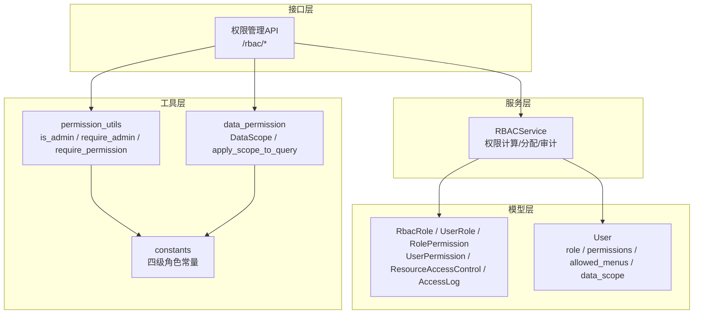
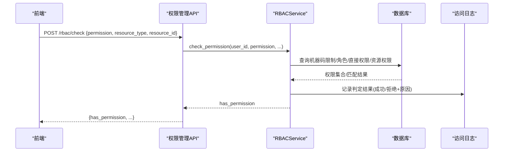
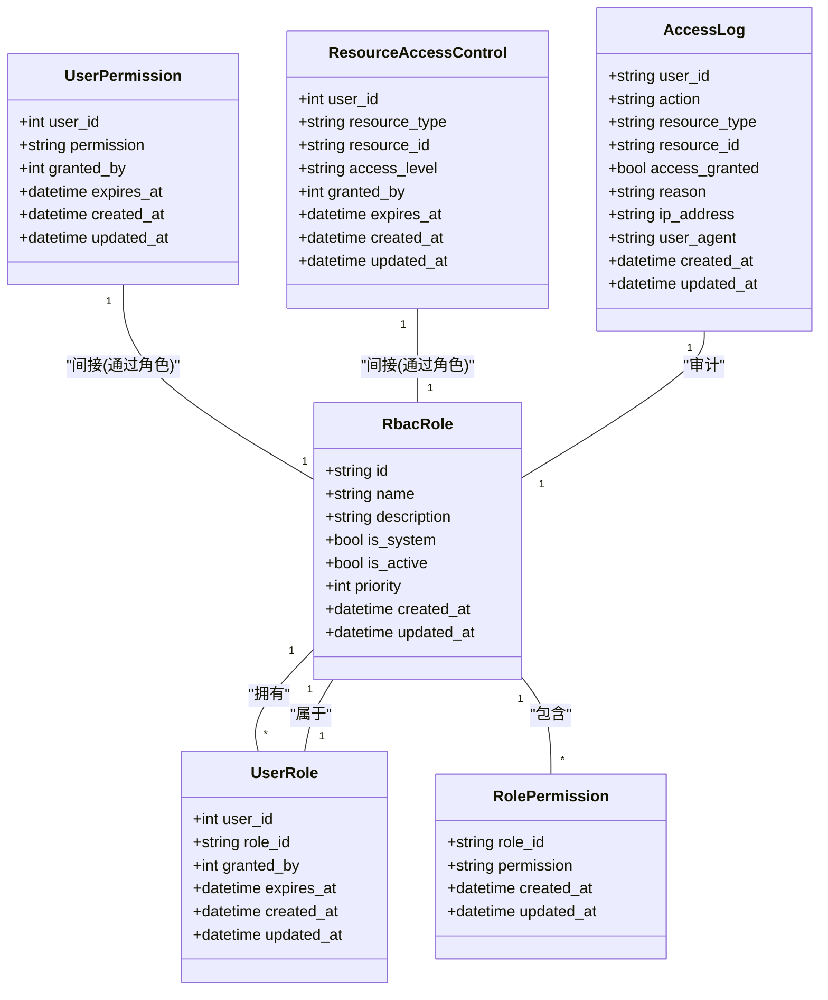
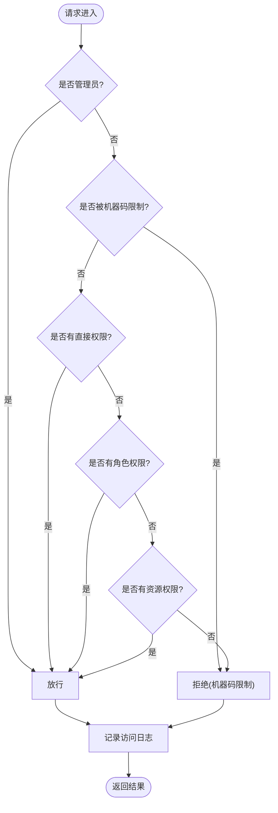
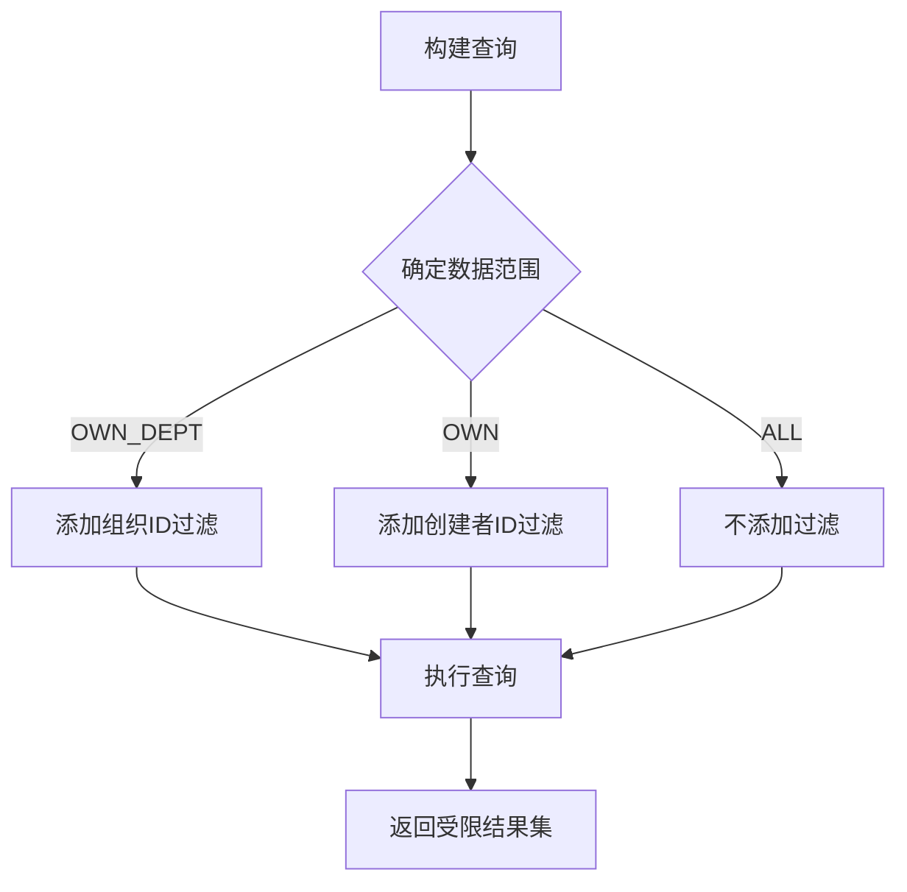
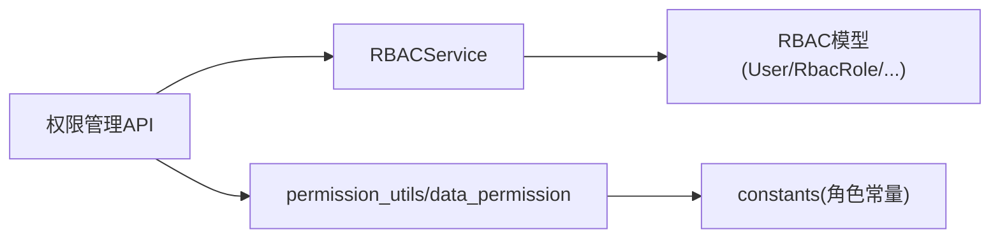

# RBAC权限控制

<cite>
**本文引用的文件**
- [backend/app/models/rbac.py](file://backend/app/models/rbac.py)
- [backend/app/models/user.py](file://backend/app/models/user.py)
- [backend/app/core/constants.py](file://backend/app/core/constants.py)
- [backend/app/core/permission_utils.py](file://backend/app/core/permission_utils.py)
- [backend/app/core/data_permission.py](file://backend/app/core/data_permission.py)
- [backend/app/services/rbac_service.py](file://backend/app/services/rbac_service.py)
- [backend/app/api/v1/auth/rbac.py](file://backend/app/api/v1/auth/rbac.py)
</cite>

## 目录
1. [简介](#简介)
2. [项目结构](#项目结构)
3. [核心组件](#核心组件)
4. [架构总览](#架构总览)
5. [详细组件分析](#详细组件分析)
6. [依赖关系分析](#依赖关系分析)
7. [性能考虑](#性能考虑)
8. [故障排查指南](#故障排查指南)
9. [结论](#结论)
10. [附录](#附录)

## 简介
本技术文档围绕基于角色的访问控制（RBAC）权限控制系统，系统阐述角色、权限、用户之间的关系模型与设计原理；说明四级角色体系（超级管理员、管理员、普通用户、访客）的权限分配机制；文档化细粒度权限控制实现，包括菜单权限、按钮权限和数据范围权限的管理；解释权限验证流程（后端API权限检查与前端权限指令配合）；提供权限管理的代码示例路径（角色创建、权限分配、用户授权）；并解释数据隔离机制，确保用户仅能访问其权限范围内的数据。

## 项目结构
本项目将RBAC能力拆分为“模型层—服务层—接口层—工具层”：
- 模型层：定义角色、用户、权限、资源访问控制等持久化结构。
- 服务层：封装权限计算、角色/权限分配、访问日志等核心业务逻辑。
- 接口层：暴露REST API用于角色管理、权限分配、查询当前用户权限等。
- 工具层：提供权限校验装饰器、组织访问控制、数据范围过滤等通用能力。

图表来源
- [backend/app/api/v1/auth/rbac.py:1-524](file://backend/app/api/v1/auth/rbac.py#L1-L524)
- [backend/app/services/rbac_service.py:1-746](file://backend/app/services/rbac_service.py#L1-L746)
- [backend/app/models/rbac.py:1-263](file://backend/app/models/rbac.py#L1-L263)
- [backend/app/models/user.py:1-152](file://backend/app/models/user.py#L1-L152)
- [backend/app/core/permission_utils.py:1-360](file://backend/app/core/permission_utils.py#L1-L360)
- [backend/app/core/data_permission.py:1-187](file://backend/app/core/data_permission.py#L1-L187)
- [backend/app/core/constants.py:1-87](file://backend/app/core/constants.py#L1-L87)

章节来源
- [backend/app/api/v1/auth/rbac.py:1-524](file://backend/app/api/v1/auth/rbac.py#L1-L524)
- [backend/app/services/rbac_service.py:1-746](file://backend/app/services/rbac_service.py#L1-L746)
- [backend/app/models/rbac.py:1-263](file://backend/app/models/rbac.py#L1-L263)
- [backend/app/models/user.py:1-152](file://backend/app/models/user.py#L1-L152)
- [backend/app/core/permission_utils.py:1-360](file://backend/app/core/permission_utils.py#L1-L360)
- [backend/app/core/data_permission.py:1-187](file://backend/app/core/data_permission.py#L1-L187)
- [backend/app/core/constants.py:1-87](file://backend/app/core/constants.py#L1-L87)

## 核心组件
- 角色与权限模型
  - 角色：支持系统内置标记、优先级、启用状态。
  - 用户-角色关联：支持授权人、过期时间。
  - 角色-权限关联：以字符串标识绑定。
  - 用户直接权限：可独立授予，支持过期。
  - 资源访问控制：按资源类型+ID+访问级别进行细粒度授权。
  - 访问日志：记录每次权限判定结果及原因。
- 用户模型扩展
  - 四级角色：super_admin、admin、user、viewer。
  - 权限列表：逗号分隔或JSON数组。
  - 白名单权限：allowed_permissions（JSON数组），与角色权限取交集。
  - 可见菜单：allowed_menus（JSON数组），NULL继承角色默认，[]表示无菜单。
  - 数据范围：data_scope（all/org/org_children/self）。
- 权限服务
  - 统一权限计算：管理员优先、直接权限、角色权限、资源权限、机器码限制、白名单交集。
  - 批量操作：批量授予/撤销权限、原子保存权限集合。
  - 访问审计：每次判定写入访问日志。
- 权限工具
  - 管理员校验：is_admin、require_admin。
  - 资源权限校验：require_permission、check_permission。
  - 组织访问控制：require_organization。
  - 数据范围过滤：apply_scope_to_query、filter_by_data_scope。
- 权限API
  - 角色CRUD、用户角色/权限查询、权限分配/撤销、当前用户权限与路由权限配置。

章节来源
- [backend/app/models/rbac.py:31-263](file://backend/app/models/rbac.py#L31-L263)
- [backend/app/models/user.py:26-152](file://backend/app/models/user.py#L26-L152)
- [backend/app/services/rbac_service.py:52-746](file://backend/app/services/rbac_service.py#L52-L746)
- [backend/app/core/permission_utils.py:17-360](file://backend/app/core/permission_utils.py#L17-L360)
- [backend/app/core/data_permission.py:20-187](file://backend/app/core/data_permission.py#L20-L187)
- [backend/app/api/v1/auth/rbac.py:25-524](file://backend/app/api/v1/auth/rbac.py#L25-L524)

## 架构总览
RBAC整体采用“声明式模型 + 服务层计算 + 接口层暴露 + 工具层复用”的分层架构。权限判定遵循“机器码限制 > 管理员 > 直接权限 > 角色权限 > 资源权限”的优先级顺序，并在失败时记录审计日志。数据访问通过数据范围过滤器在SQL层面限定可见范围，避免越权读取。

图表来源
- [backend/app/api/v1/auth/rbac.py:85-106](file://backend/app/api/v1/auth/rbac.py#L85-L106)
- [backend/app/services/rbac_service.py:133-222](file://backend/app/services/rbac_service.py#L133-L222)
- [backend/app/models/rbac.py:191-219](file://backend/app/models/rbac.py#L191-L219)

## 详细组件分析

### 角色-权限-用户关系模型
- 角色（RbacRole）：唯一名称、是否系统内置、优先级、启用状态。
- 用户-角色（UserRole）：多对多中间表，支持授权人和过期时间。
- 角色-权限（RolePermission）：角色到权限标识的映射。
- 用户直接权限（UserPermission）：用户到权限标识的直接映射，支持过期。
- 资源访问控制（ResourceAccessControl）：按资源类型+ID+访问级别授权。
- 访问日志（AccessLog）：记录每次权限判定结果和原因。

图表来源
- [backend/app/models/rbac.py:31-263](file://backend/app/models/rbac.py#L31-L263)

章节来源
- [backend/app/models/rbac.py:31-263](file://backend/app/models/rbac.py#L31-L263)

### 四级角色体系与权限分配机制
- 四级角色：
  - 超级管理员（super_admin）：全局数据范围ALL，具备所有权限。
  - 管理员（admin）：数据范围OWN_DEPT（本组织），具备管理相关权限。
  - 普通用户（user）：数据范围OWN（仅本人），具备基础读/写权限。
  - 访客（viewer）：最小权限集，通常只读。
- 权限分配：
  - 通过角色默认权限（如admin:all）快速赋权。
  - 支持用户直接权限（细粒度补充）。
  - 支持白名单权限（allowed_permissions）与角色权限取交集。
  - 支持机器码限制（从机器码维度剔除特定权限）。
- 数据范围：
  - all：全量可见（超级管理员）。
  - org：本组织可见（管理员）。
  - self：仅本人可见（普通用户/访客）。

章节来源
- [backend/app/core/constants.py:27-87](file://backend/app/core/constants.py#L27-L87)
- [backend/app/models/user.py:42-77](file://backend/app/models/user.py#L42-L77)
- [backend/app/core/data_permission.py:20-81](file://backend/app/core/data_permission.py#L20-L81)
- [backend/app/services/rbac_service.py:104-127](file://backend/app/services/rbac_service.py#L104-L127)

### 细粒度权限控制（菜单、按钮、数据范围）
- 菜单权限：
  - 用户级allowed_menus（JSON数组）：覆盖角色默认菜单。
  - 权限包（permission_pack_id）：作为菜单解析的中间层。
  - 角色默认菜单：当allowed_menus为NULL时继承。
- 按钮权限：
  - 使用权限标识（如village:write）在前端通过指令控制显示/隐藏。
  - 后端通过require_permission装饰器校验。
- 数据范围权限：
  - 通过apply_scope_to_query在SQL层自动附加过滤条件。
  - 根据用户角色决定all/own_dept/own三种范围。

章节来源
- [backend/app/models/user.py:63-77](file://backend/app/models/user.py#L63-L77)
- [backend/app/core/permission_utils.py:272-360](file://backend/app/core/permission_utils.py#L272-L360)
- [backend/app/core/data_permission.py:83-170](file://backend/app/core/data_permission.py#L83-L170)

### 权限验证流程（后端API与前端指令）
- 后端API权限检查：
  - 管理员优先通过。
  - 检查机器码限制（若命中则拒绝）。
  - 检查直接权限、角色权限、资源权限。
  - 记录访问日志。
- 前端权限指令：
  - 通过获取当前用户权限（/rbac/frontend/current-user-permissions）渲染按钮/菜单。
  - 路由级权限由/rbac/frontend/route-permissions提供映射。
  - 前端指令依据权限标识控制UI元素显隐。

图表来源
- [backend/app/services/rbac_service.py:133-222](file://backend/app/services/rbac_service.py#L133-L222)
- [backend/app/api/v1/auth/rbac.py:85-106](file://backend/app/api/v1/auth/rbac.py#L85-L106)

章节来源
- [backend/app/services/rbac_service.py:133-222](file://backend/app/services/rbac_service.py#L133-L222)
- [backend/app/api/v1/auth/rbac.py:85-106](file://backend/app/api/v1/auth/rbac.py#L85-L106)

### 权限管理代码示例（路径引用）
- 创建角色（含权限）：
  - 参考：[backend/app/api/v1/auth/rbac.py:144-162](file://backend/app/api/v1/auth/rbac.py#L144-L162)
  - 服务实现：[backend/app/services/rbac_service.py:588-606](file://backend/app/services/rbac_service.py#L588-L606)
- 分配角色给用户：
  - 参考：[backend/app/api/v1/auth/rbac.py:288-310](file://backend/app/api/v1/auth/rbac.py#L288-L310)
  - 服务实现：[backend/app/services/rbac_service.py:322-363](file://backend/app/services/rbac_service.py#L322-L363)
- 授予/撤销用户权限（批量）：
  - 参考：[backend/app/api/v1/auth/rbac.py:332-378](file://backend/app/api/v1/auth/rbac.py#L332-L378)
  - 服务实现：[backend/app/services/rbac_service.py:407-516](file://backend/app/services/rbac_service.py#L407-L516)
- 原子保存用户权限集合：
  - 参考：[backend/app/api/v1/auth/rbac.py:381-405](file://backend/app/api/v1/auth/rbac.py#L381-L405)
  - 服务实现：[backend/app/services/rbac_service.py:518-586](file://backend/app/services/rbac_service.py#L518-L586)
- 查询当前用户权限（前端专用）：
  - 参考：[backend/app/api/v1/auth/rbac.py:442-497](file://backend/app/api/v1/auth/rbac.py#L442-L497)
- 查询路由权限配置（前端路由守卫）：
  - 参考：[backend/app/api/v1/auth/rbac.py:500-524](file://backend/app/api/v1/auth/rbac.py#L500-L524)

章节来源
- [backend/app/api/v1/auth/rbac.py:144-524](file://backend/app/api/v1/auth/rbac.py#L144-L524)
- [backend/app/services/rbac_service.py:322-606](file://backend/app/services/rbac_service.py#L322-L606)

### 数据隔离机制
- 数据范围策略：
  - 超级管理员：全部数据（ALL）。
  - 管理员：本组织数据（OWN_DEPT）。
  - 普通用户/访客：仅本人数据（OWN）。
- SQL层过滤：
  - 通过apply_scope_to_query自动附加过滤条件，避免越权读取。
  - 若模型缺少必要字段，回退为空集（fail-closed）。
- 单条记录访问检查：
  - check_record_access用于判断单个记录是否允许访问。

图表来源
- [backend/app/core/data_permission.py:83-170](file://backend/app/core/data_permission.py#L83-L170)

章节来源
- [backend/app/core/data_permission.py:20-187](file://backend/app/core/data_permission.py#L20-L187)

## 依赖关系分析
- 模块耦合：
  - 接口层依赖服务层进行权限计算与事务管理。
  - 服务层依赖模型层进行数据存取与审计。
  - 工具层提供跨层复用的权限校验与数据范围过滤。
- 外部依赖：
  - FastAPI依赖注入（get_current_user、require_admin）。
  - SQLAlchemy ORM与查询构造。
  - Pydantic用于请求/响应模型。
- 潜在循环依赖：
  - 通过字符串引用注册关系（如machine_code、organization）避免导入循环。

图表来源
- [backend/app/api/v1/auth/rbac.py:1-524](file://backend/app/api/v1/auth/rbac.py#L1-L524)
- [backend/app/services/rbac_service.py:1-746](file://backend/app/services/rbac_service.py#L1-L746)
- [backend/app/core/permission_utils.py:1-360](file://backend/app/core/permission_utils.py#L1-L360)
- [backend/app/core/data_permission.py:1-187](file://backend/app/core/data_permission.py#L1-L187)
- [backend/app/core/constants.py:1-87](file://backend/app/core/constants.py#L1-L87)

章节来源
- [backend/app/api/v1/auth/rbac.py:1-524](file://backend/app/api/v1/auth/rbac.py#L1-L524)
- [backend/app/services/rbac_service.py:1-746](file://backend/app/services/rbac_service.py#L1-L746)
- [backend/app/core/permission_utils.py:1-360](file://backend/app/core/permission_utils.py#L1-L360)
- [backend/app/core/data_permission.py:1-187](file://backend/app/core/data_permission.py#L1-L187)
- [backend/app/core/constants.py:1-87](file://backend/app/core/constants.py#L1-L87)

## 性能考虑
- 权限计算优化：
  - 单次请求内缓存机器码限制权限，避免重复查询。
  - 批量授予/撤销权限使用预查询+批量INSERT/DELETE减少IO。
  - 原子保存权限集合在同一事务内完成，降低并发冲突风险。
- 查询优化：
  - 数据范围过滤在SQL层完成，减少应用层处理开销。
  - 合理使用索引（如用户-角色、角色-权限、用户-权限等）。
- 审计日志：
  - 访问日志异步或轻量写入，避免阻塞主流程。

[本节为通用指导，无需具体文件分析]

## 故障排查指南
- 常见问题定位：
  - 权限不足：检查是否被机器码限制、是否具备直接/角色/资源权限。
  - 数据不可见：确认数据范围设置是否正确，模型是否包含必要字段。
  - 菜单不显示：检查allowed_menus是否为空数组或权限包未正确绑定。
- 调试建议：
  - 查看访问日志中的reason字段，定位拒绝原因。
  - 使用/rbac/frontend/current-user-permissions核对前端可用权限。
  - 使用/rbac/frontend/route-permissions核对路由权限映射。

章节来源
- [backend/app/services/rbac_service.py:716-742](file://backend/app/services/rbac_service.py#L716-L742)
- [backend/app/api/v1/auth/rbac.py:442-524](file://backend/app/api/v1/auth/rbac.py#L442-L524)

## 结论
本RBAC系统通过清晰的模型设计、严谨的服务层权限计算、灵活的接口层管理与强大的工具层支撑，实现了从角色到权限、从菜单到按钮、从数据范围到资源访问的全链路控制。结合机器码限制与白名单机制，系统在安全性与灵活性之间取得良好平衡。建议在新增功能时遵循“声明式权限 + 服务层计算 + SQL层过滤”的原则，确保权限一致性与可维护性。

[本节为总结，无需具体文件分析]

## 附录
- 关键API路径参考：
  - 权限检查：POST /rbac/check
  - 角色管理：POST/GET/PUT/DELETE /rbac/roles
  - 用户角色/权限：GET /rbac/user/{user_id}/roles, GET /rbac/user/{user_id}/permissions
  - 权限分配/撤销：POST /rbac/assign/role, DELETE /rbac/revoke/role
  - 权限授予/撤销：POST /rbac/grant/permission, POST /rbac/revoke/permission
  - 原子保存权限：POST /rbac/save-permissions
  - 前端专用：GET /rbac/frontend/current-user-permissions, GET /rbac/frontend/route-permissions

章节来源
- [backend/app/api/v1/auth/rbac.py:85-524](file://backend/app/api/v1/auth/rbac.py#L85-L524)