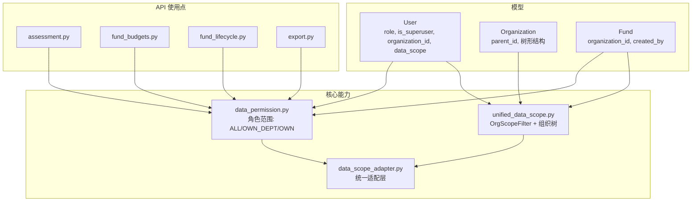
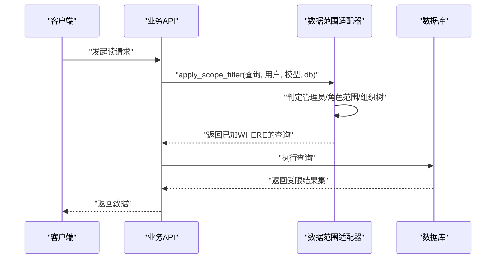
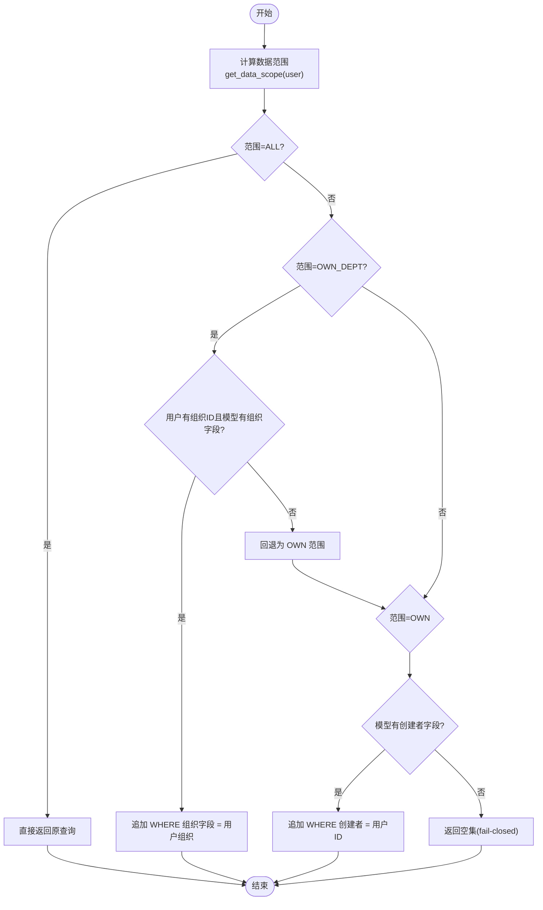
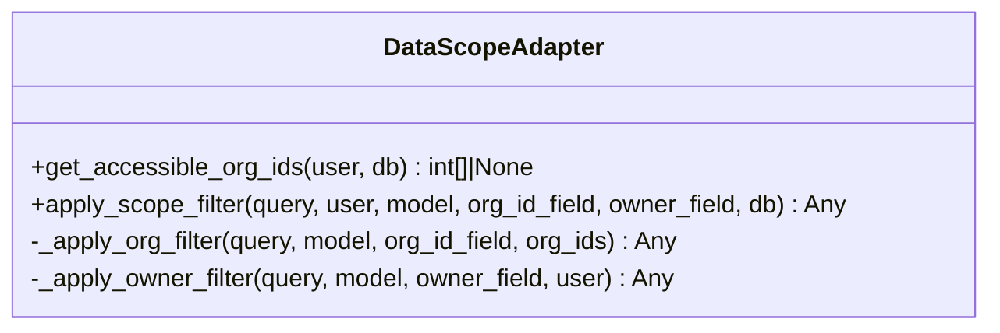
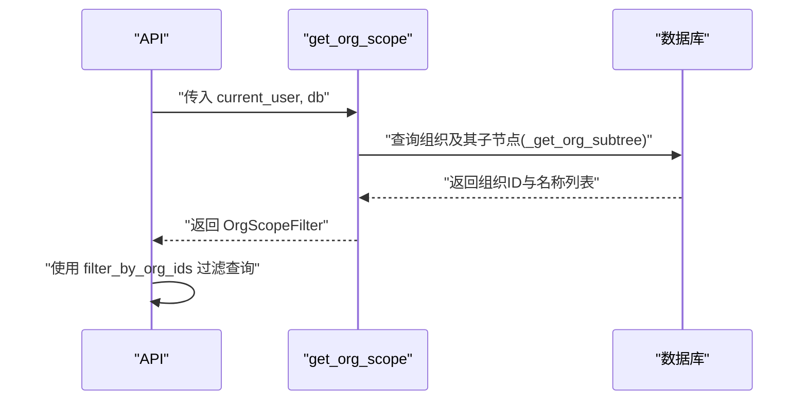
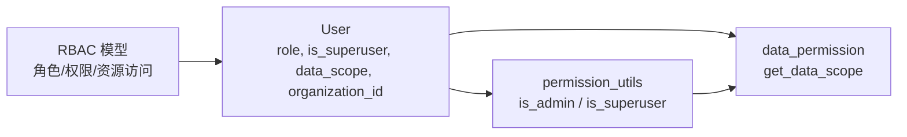
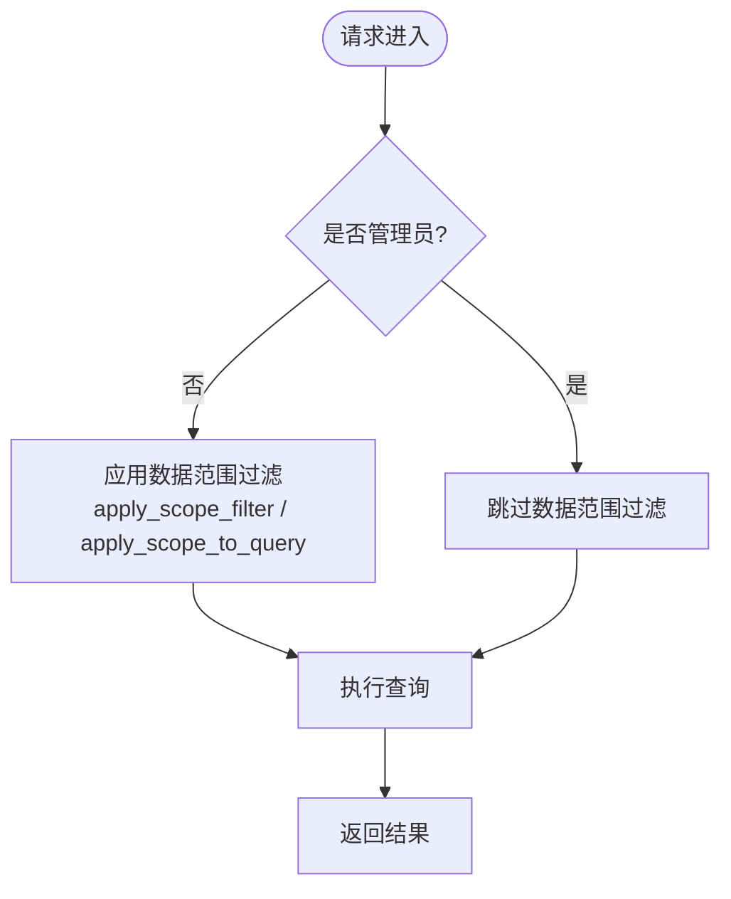
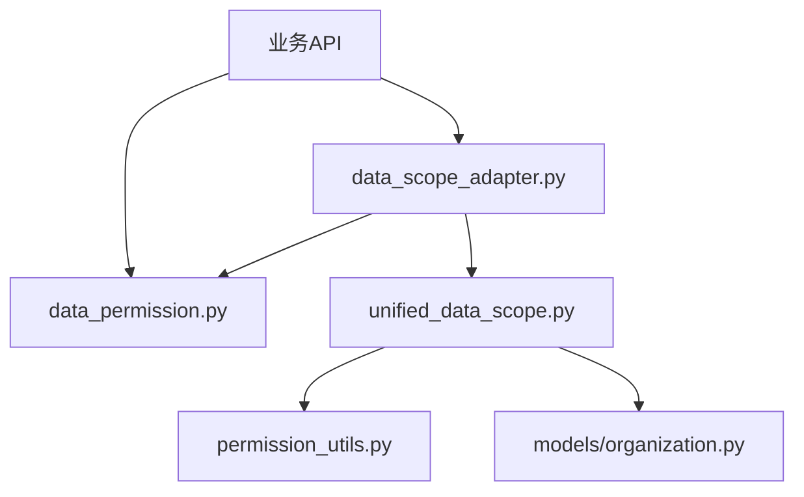

# 数据范围控制

<cite>
**本文引用的文件**
- [data_permission.py](file://backend/app/core/data_permission.py)
- [data_scope_adapter.py](file://backend/app/core/data_scope_adapter.py)
- [unified_data_scope.py](file://backend/app/core/unified_data_scope.py)
- [permission_utils.py](file://backend/app/core/permission_utils.py)
- [user.py](file://backend/app/models/user.py)
- [organization.py](file://backend/app/models/organization.py)
- [fund.py](file://backend/app/models/fund.py)
- [assessment.py](file://backend/app/api/v1/assessment.py)
- [fund_budgets.py](file://backend/app/api/v1/fund_budgets.py)
- [fund_lifecycle.py](file://backend/app/api/v1/fund_lifecycle.py)
- [export.py](file://backend/app/api/v1/import_export/export.py)
- [test_data_isolation.py](file://backend/tests/security/test_data_isolation.py)
</cite>

## 目录
1. [简介](#简介)
2. [项目结构](#项目结构)
3. [核心组件](#核心组件)
4. [架构总览](#架构总览)
5. [详细组件分析](#详细组件分析)
6. [依赖关系分析](#依赖关系分析)
7. [性能考虑](#性能考虑)
8. [故障排查指南](#故障排查指南)
9. [结论](#结论)
10. [附录：使用示例与最佳实践](#附录使用示例与最佳实践)

## 简介
本技术文档面向“数据范围控制系统”，系统性说明如何实现组织级隔离、部门级共享与全局访问控制，并给出数据范围查询的自动注入机制（SQL 条件动态添加）、与 RBAC 权限系统的集成方式、跨组织访问的特殊处理、验证流程与性能优化策略。目标是让开发者在不侵入业务逻辑的前提下，通过统一入口对任意 SQLAlchemy 查询施加安全的数据范围限制。

## 项目结构
后端围绕“角色/组织”双维度的数据范围控制展开，核心位于 app/core 下的三个模块：
- data_permission.py：基于角色的数据范围判定与过滤（ALL/OWN_DEPT/OWN），提供 apply_scope_to_query、check_record_access、require_data_permission 等工具。
- unified_data_scope.py：整合两套历史实现（角色型 + 组织树型），暴露 OrgScopeFilter、get_org_scope 等能力，并提供 _get_org_subtree 进行组织子树遍历。
- data_scope_adapter.py：统一适配层，屏蔽 Query/Select 差异，统一计算可访问组织 ID 列表并应用过滤，支持“组织树展开”语义。

业务 API 在读取列表时调用上述工具为查询附加 WHERE 条件；模型层面通过 organization_id、created_by 等字段承载数据归属信息。

图表来源
- [data_permission.py:20-134](file://backend/app/core/data_permission.py#L20-L134)
- [unified_data_scope.py:43-160](file://backend/app/core/unified_data_scope.py#L43-L160)
- [data_scope_adapter.py:58-183](file://backend/app/core/data_scope_adapter.py#L58-L183)
- [user.py:42-77](file://backend/app/models/user.py#L42-L77)
- [organization.py:31-78](file://backend/app/models/organization.py#L31-L78)
- [fund.py:149-166](file://backend/app/models/fund.py#L149-L166)
- [assessment.py:12-226](file://backend/app/api/v1/assessment.py#L12-L226)
- [fund_budgets.py:15-308](file://backend/app/api/v1/fund_budgets.py#L15-L308)
- [fund_lifecycle.py:40-1715](file://backend/app/api/v1/fund_lifecycle.py#L40-L1715)
- [export.py:12-121](file://backend/app/api/v1/import_export/export.py#L12-L121)

章节来源
- [data_permission.py:20-134](file://backend/app/core/data_permission.py#L20-L134)
- [unified_data_scope.py:43-160](file://backend/app/core/unified_data_scope.py#L43-L160)
- [data_scope_adapter.py:58-183](file://backend/app/core/data_scope_adapter.py#L58-L183)
- [user.py:42-77](file://backend/app/models/user.py#L42-L77)
- [organization.py:31-78](file://backend/app/models/organization.py#L31-L78)
- [fund.py:149-166](file://backend/app/models/fund.py#L149-L166)
- [assessment.py:12-226](file://backend/app/api/v1/assessment.py#L12-L226)
- [fund_budgets.py:15-308](file://backend/app/api/v1/fund_budgets.py#L15-L308)
- [fund_lifecycle.py:40-1715](file://backend/app/api/v1/fund_lifecycle.py#L40-L1715)
- [export.py:12-121](file://backend/app/api/v1/import_export/export.py#L12-L121)

## 核心组件
- 数据范围枚举与判定
  - DataScope：ALL（全部）、OWN_DEPT（本部门/组织）、OWN（仅本人）。
  - get_data_scope(user)：根据 is_superuser、role（经 normalize_role 归一化）返回对应范围。
- 查询过滤与记录校验
  - apply_scope_to_query(query, model, user, owner_field, dept_field)：按范围向查询追加 WHERE 条件。
  - check_record_access(record, user, ...)：单条记录访问校验。
  - require_data_permission(...)：接口内强校验，越权抛 403。
- 统一适配层
  - get_accessible_org_ids(user, db=None)：计算可访问组织 ID 列表（None=不限制，[]表示无组织级权限）。
  - apply_scope_filter(query, user, model, org_id_field, owner_field, db=None)：统一入口，兼容 Query/Select，支持组织树展开。
- 组织树能力
  - OrgScopeFilter：基于组织树与 self_only 模式进行过滤。
  - _get_org_subtree(db, org_id)：递归获取组织及其下级（带深度保护与环检测）。
  - get_org_scope(current_user, db)：FastAPI 依赖，构建 OrgScopeFilter。

章节来源
- [data_permission.py:20-134](file://backend/app/core/data_permission.py#L20-L134)
- [data_scope_adapter.py:58-183](file://backend/app/core/data_scope_adapter.py#L58-L183)
- [unified_data_scope.py:191-343](file://backend/app/core/unified_data_scope.py#L191-L343)

## 架构总览
数据范围控制的执行路径如下：
- 认证阶段：从请求中解析当前用户（含 role、is_superuser、organization_id、data_scope）。
- 权限判定：通过 is_admin / get_data_scope 确定是否放行或进入范围过滤。
- 查询注入：在业务查询前调用 apply_scope_to_query 或 apply_scope_filter，动态追加 WHERE 条件。
- 记录校验：对单条记录的读写操作通过 check_record_access 或 require_data_permission 进行二次校验。
- 组织树扩展：当需要“本部门及下级”时，传入 db 以启用 _get_org_subtree 展开。

图表来源
- [data_scope_adapter.py:114-183](file://backend/app/core/data_scope_adapter.py#L114-L183)
- [unified_data_scope.py:279-343](file://backend/app/core/unified_data_scope.py#L279-L343)
- [data_permission.py:83-134](file://backend/app/core/data_permission.py#L83-L134)

## 详细组件分析

### 数据范围判定与过滤（data_permission.py）
- 角色到范围的映射：super_admin/admin -> ALL/OWN_DEPT；其他 -> OWN。
- 过滤策略：
  - ALL：不过滤。
  - OWN_DEPT：按 user.organization_id 过滤模型组织字段；若缺失则回退至 OWN。
  - OWN：按 created_by == user.id 过滤；若模型缺少 owner 字段，fail-closed 返回空集。
- 单记录校验：check_record_access 依据范围比较记录归属；require_data_permission 用于写操作前的强校验。

图表来源
- [data_permission.py:54-134](file://backend/app/core/data_permission.py#L54-L134)

章节来源
- [data_permission.py:20-134](file://backend/app/core/data_permission.py#L20-L134)

### 统一适配层（data_scope_adapter.py）
- 统一入口 apply_scope_filter：
  - 自动识别 Query/Select 并选择 .filter() 或 .where()。
  - 管理员或 data_scope="all" 直接放行。
  - 部门范围：先计算可访问组织 ID 列表（可包含下级），再追加 IN 条件；若无组织归属则回退 OWN。
  - 仅本人：强制要求模型具备 owner 字段，否则抛出 DataScopeFilterError（fail-closed）。
- 组织树展开：当传入 db 时，通过 _get_org_subtree 获取当前组织及其所有下级 ID。

图表来源
- [data_scope_adapter.py:58-183](file://backend/app/core/data_scope_adapter.py#L58-L183)
- [data_scope_adapter.py:199-224](file://backend/app/core/data_scope_adapter.py#L199-L224)

章节来源
- [data_scope_adapter.py:58-183](file://backend/app/core/data_scope_adapter.py#L58-L183)

### 组织树与 OrgScopeFilter（unified_data_scope.py）
- OrgScopeFilter：
  - has_full_access：管理员拥有全量访问。
  - filter_by_org_ids：按组织 ID 列表 or 仅本人模式过滤。
- _get_org_subtree：递归遍历组织树，带最大深度与环检测，返回 (ids, names)。
- get_org_scope：FastAPI 依赖，综合 role、data_scope、organization_id 构造 OrgScopeFilter。

图表来源
- [unified_data_scope.py:245-343](file://backend/app/core/unified_data_scope.py#L245-L343)

章节来源
- [unified_data_scope.py:191-343](file://backend/app/core/unified_data_scope.py#L191-L343)

### RBAC 与数据范围集成
- 管理员判定：is_admin/is_superuser 决定是否可以绕过数据范围限制。
- 角色归一化：normalize_role 将历史角色映射到精简角色集合，确保存量用户范围一致。
- 用户属性：
  - User.role、is_superuser：决定基础范围。
  - User.data_scope：显式配置 all/org/org_children/self，优先于角色判定。
  - User.organization_id：部门范围的基础。
- 资源级权限：RBAC 模型提供角色-权限、用户-权限、资源访问控制等表，可与数据范围配合实现“功能+数据”双重控制。

图表来源
- [permission_utils.py:17-58](file://backend/app/core/permission_utils.py#L17-L58)
- [data_permission.py:54-80](file://backend/app/core/data_permission.py#L54-L80)
- [user.py:42-77](file://backend/app/models/user.py#L42-L77)
- [rbac.py:31-263](file://backend/app/models/rbac.py#L31-L263)

章节来源
- [permission_utils.py:17-58](file://backend/app/core/permission_utils.py#L17-L58)
- [data_permission.py:54-80](file://backend/app/core/data_permission.py#L54-L80)
- [user.py:42-77](file://backend/app/models/user.py#L42-L77)
- [rbac.py:31-263](file://backend/app/models/rbac.py#L31-L263)

### 跨组织数据访问特殊处理
- 默认策略：普通用户仅能访问本人数据；管理员可访问全部。
- 部门共享：admin 或 data_scope="org"/"org_children" 可访问本组织或包含下级的组织数据。
- 跨组织白名单：可通过 RBAC 的资源访问控制（ResourceAccessControl）对特定资源授予细粒度访问；结合数据范围过滤，实现“功能允许但数据受限”的组合策略。
- fail-closed 原则：当模型缺少必要字段（组织或创建者）时，系统拒绝放宽限制，避免越权。

章节来源
- [data_permission.py:108-134](file://backend/app/core/data_permission.py#L108-L134)
- [data_scope_adapter.py:165-183](file://backend/app/core/data_scope_adapter.py#L165-L183)
- [unified_data_scope.py:297-343](file://backend/app/core/unified_data_scope.py#L297-L343)
- [rbac.py:163-189](file://backend/app/models/rbac.py#L163-L189)

### 数据范围验证流程
- 读路径：在列表查询前调用 apply_scope_to_query/apply_scope_filter，自动注入 WHERE。
- 写路径：在更新/删除前调用 require_data_permission 或 check_record_access，越权抛 403。
- 组织树场景：通过 get_org_scope 构建 OrgScopeFilter，并使用 filter_by_org_ids 精确过滤。

图表来源
- [data_scope_adapter.py:114-183](file://backend/app/core/data_scope_adapter.py#L114-L183)
- [data_permission.py:83-134](file://backend/app/core/data_permission.py#L83-L134)

章节来源
- [data_scope_adapter.py:114-183](file://backend/app/core/data_scope_adapter.py#L114-L183)
- [data_permission.py:83-134](file://backend/app/core/data_permission.py#L83-L134)

## 依赖关系分析
- 模块耦合
  - data_scope_adapter 依赖 data_permission（角色范围）与 unified_data_scope（组织树）。
  - unified_data_scope 依赖 permission_utils（管理员判定）与 Organization 模型（组织树）。
  - 业务 API 通过导入 data_permission 或 data_scope_adapter 来应用过滤。
- 外部依赖
  - SQLAlchemy：Query/Select 对象与 where/filter 方法。
  - FastAPI：Depends(get_current_user)、HTTPException。
- 循环依赖规避
  - 通过延迟 import（如 from app.core.data_permission import ...）避免启动时循环导入。

图表来源
- [data_scope_adapter.py:1-44](file://backend/app/core/data_scope_adapter.py#L1-L44)
- [unified_data_scope.py:1-28](file://backend/app/core/unified_data_scope.py#L1-L28)
- [permission_utils.py:1-15](file://backend/app/core/permission_utils.py#L1-L15)
- [organization.py:1-10](file://backend/app/models/organization.py#L1-L10)

章节来源
- [data_scope_adapter.py:1-44](file://backend/app/core/data_scope_adapter.py#L1-L44)
- [unified_data_scope.py:1-28](file://backend/app/core/unified_data_scope.py#L1-L28)
- [permission_utils.py:1-15](file://backend/app/core/permission_utils.py#L1-L15)
- [organization.py:1-10](file://backend/app/models/organization.py#L1-L10)

## 性能考虑
- 索引设计
  - 模型组织字段与创建者字段应建立索引（如 Fund.organization_id、Fund.created_by），加速 IN 与等值过滤。
  - 统计聚合冗余字段（year、year_month、year_quarter）减少函数计算开销，提升 GROUP BY 性能。
- 查询优化
  - 使用 Select.where 替代旧式 Query.filter，减少 ORM 开销。
  - 组织树展开仅在必要时传入 db，避免不必要的递归查询。
- 失败快速关闭
  - 模型缺字段时立即降级为空集或抛错，避免全表扫描与越权风险。
- 缓存与预取
  - 对频繁的组织树查询可考虑缓存组织子树结果（需结合一致性策略）。

[本节为通用性能建议，无需具体文件引用]

## 故障排查指南
- 现象：列表返回空
  - 检查模型是否缺少 organization_id 或 created_by 字段；若缺失，系统将 fail-closed 返回空集。
  - 确认用户是否属于本部门或拥有本人数据；必要时调整 data_scope 或角色。
- 现象：越权 403
  - 检查 require_data_permission/check_record_access 的入参是否正确（organization_id、created_by）。
  - 确认当前用户是否为管理员或被赋予跨组织资源访问权限。
- 现象：组织树展开异常
  - 检查是否存在环或层级过深；_get_org_subtree 内置深度保护与环检测，日志会提示截断原因。

章节来源
- [data_permission.py:120-134](file://backend/app/core/data_permission.py#L120-L134)
- [data_scope_adapter.py:165-183](file://backend/app/core/data_scope_adapter.py#L165-L183)
- [unified_data_scope.py:245-277](file://backend/app/core/unified_data_scope.py#L245-L277)

## 结论
本项目实现了“角色+组织”双维度的数据范围控制，并通过统一适配层屏蔽了历史实现的差异，使新代码可以一致地应用数据范围限制。通过 fail-closed 策略、组织树展开与 RBAC 集成，系统在安全性与灵活性之间取得平衡。建议在新增模型时确保具备 organization_id 与 created_by 字段，并在所有列表查询中统一调用 apply_scope_filter 或 apply_scope_to_query，以获得一致的安全保障。

[本节为总结性内容，无需具体文件引用]

## 附录：使用示例与最佳实践
- 在业务 API 中应用数据范围
  - 列表查询：在构建查询后调用 apply_scope_to_query 或 apply_scope_filter，传入当前用户与模型类。
  - 单记录校验：在更新/删除前调用 require_data_permission 或 check_record_access。
  - 组织树场景：使用 get_org_scope 依赖获取 OrgScopeFilter，并通过 filter_by_org_ids 过滤。
- 最佳实践
  - 始终为涉及数据范围的模型添加 organization_id 与 created_by 字段。
  - 对高频过滤字段建立索引，提升查询性能。
  - 谨慎授予跨组织访问权限，优先使用 RBAC 资源访问控制进行最小授权。
  - 在导出/报表场景中同样应用数据范围过滤，避免数据泄露。

章节来源
- [assessment.py:12-226](file://backend/app/api/v1/assessment.py#L12-L226)
- [fund_budgets.py:15-308](file://backend/app/api/v1/fund_budgets.py#L15-L308)
- [fund_lifecycle.py:40-1715](file://backend/app/api/v1/fund_lifecycle.py#L40-L1715)
- [export.py:12-121](file://backend/app/api/v1/import_export/export.py#L12-L121)
- [test_data_isolation.py:1-41](file://backend/tests/security/test_data_isolation.py#L1-L41)