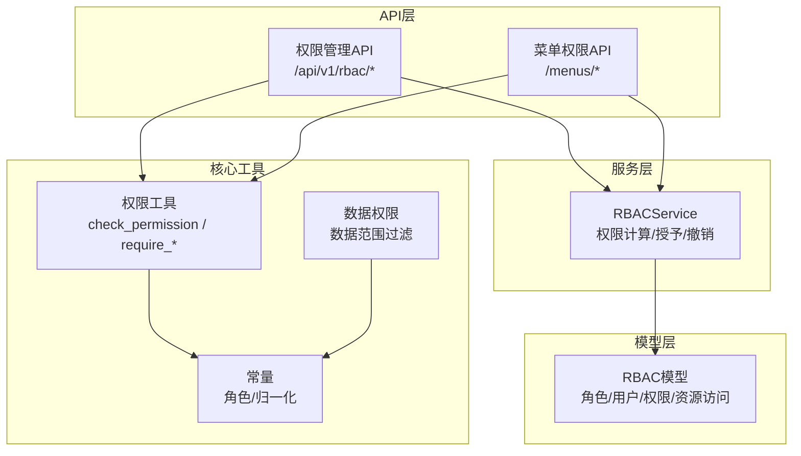
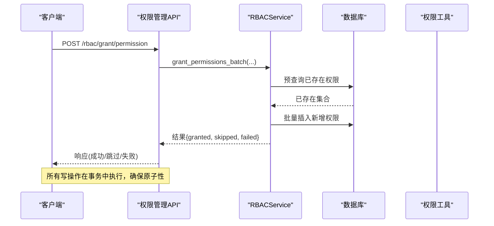
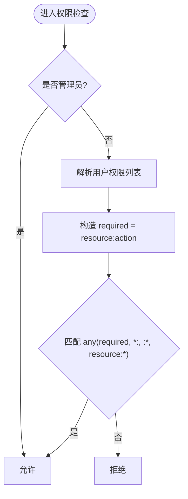
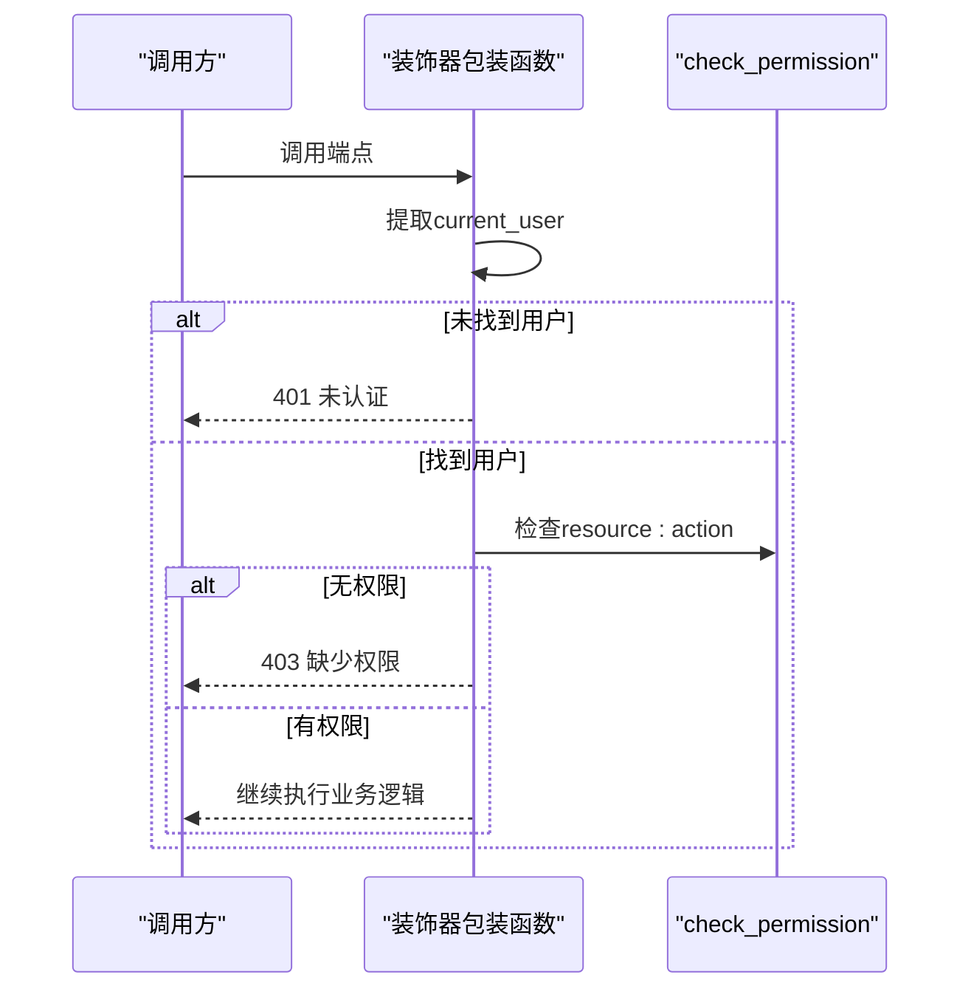
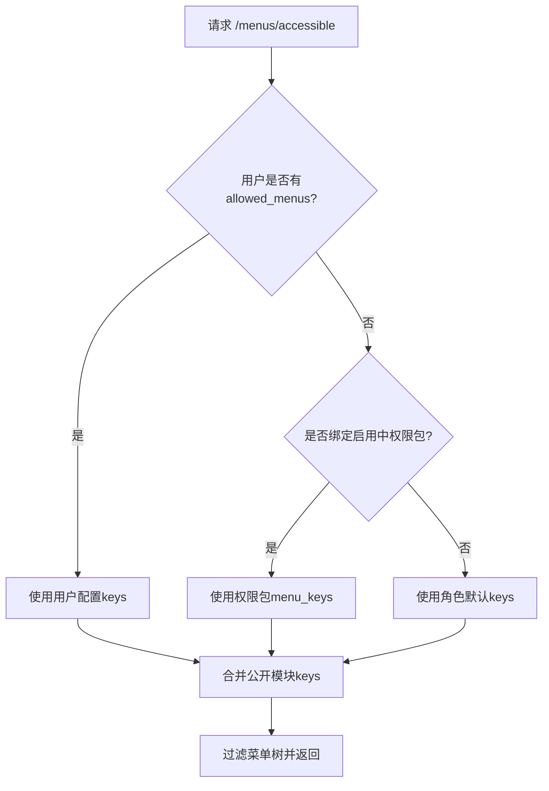
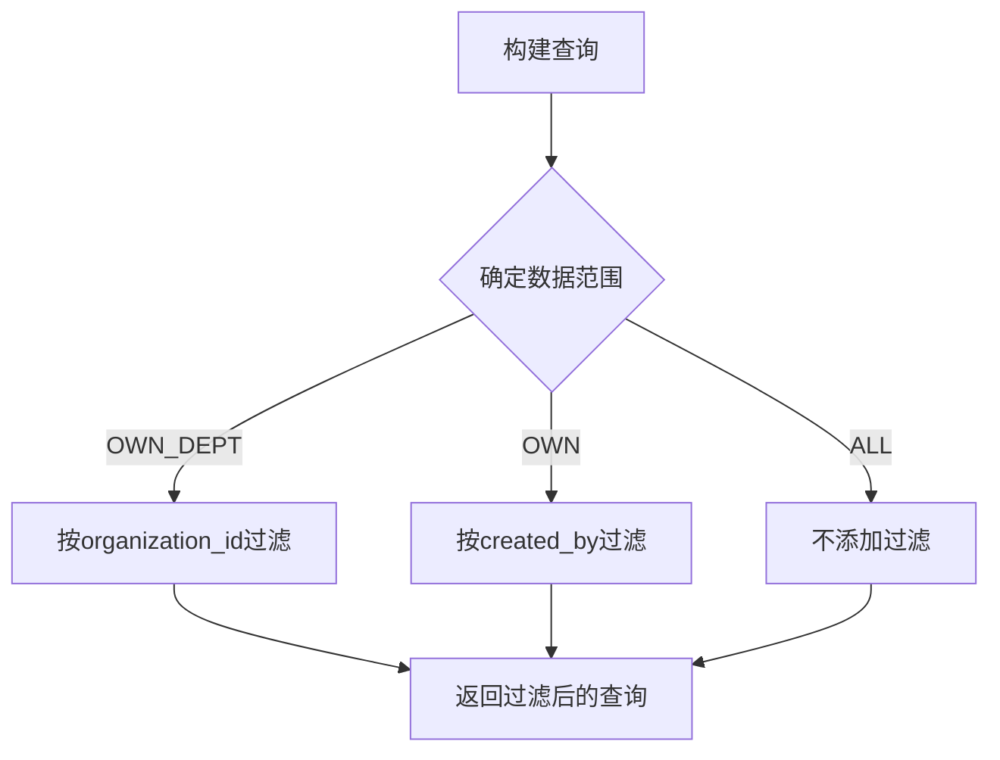
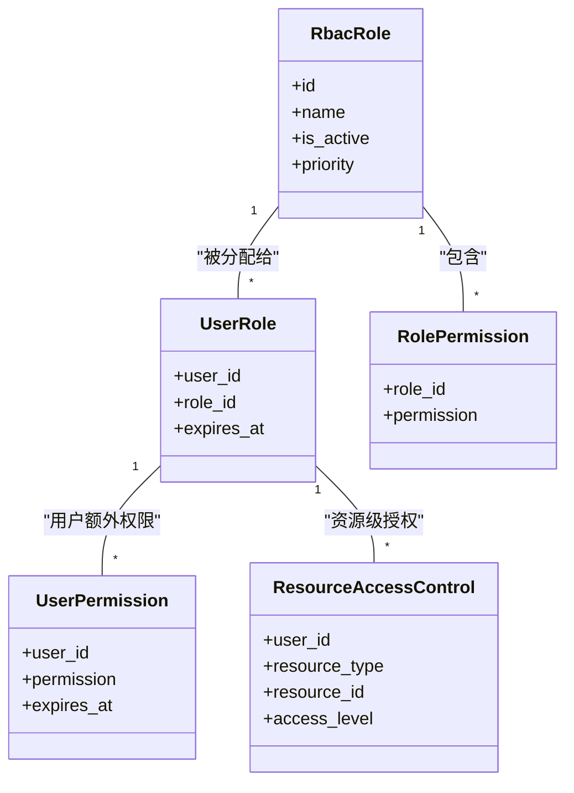
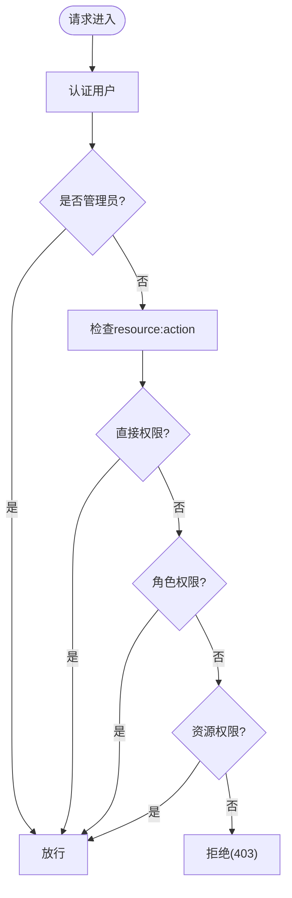
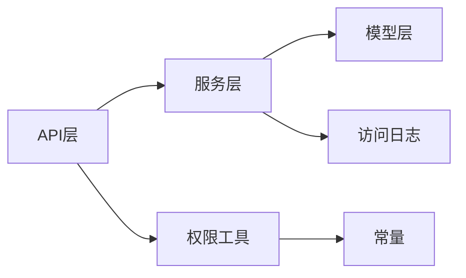

# 权限分配

<cite>
**本文引用的文件**
- [permission_utils.py](file://backend/app/core/permission_utils.py)
- [rbac.py](file://backend/app/models/rbac.py)
- [rbac_service.py](file://backend/app/services/rbac_service.py)
- [auth_rbac.py](file://backend/app/api/v1/auth/rbac.py)
- [menus.py](file://backend/app/api/v1/menus.py)
- [data_permission.py](file://backend/app/core/data_permission.py)
- [unified_data_scope.py](file://backend/app/core/unified_data_scope.py)
- [constants.py](file://backend/app/core/constants.py)
- [test_menu_api_extended.py](file://backend/tests/unit/test_menu_api_extended.py)
</cite>

## 目录
1. [简介](#简介)
2. [项目结构](#项目结构)
3. [核心组件](#核心组件)
4. [架构总览](#架构总览)
5. [详细组件分析](#详细组件分析)
6. [依赖关系分析](#依赖关系分析)
7. [性能考虑](#性能考虑)
8. [故障排查指南](#故障排查指南)
9. [结论](#结论)
10. [附录](#附录)

## 简介
本技术文档围绕系统的细粒度权限控制与权限分配机制，覆盖以下关键点：
- 资源权限格式 resource:action 及通配符支持（如 *:*、*:read、villages:*）
- 菜单权限、按钮权限与数据范围权限的管理方式
- 权限检查装饰器 @require_permission、@require_admin 的使用
- 为用户或角色分配具体权限的代码示例路径
- 权限继承与覆盖规则、冲突解决机制
- 权限验证流程图与常见权限场景处理方案

## 项目结构
后端权限相关代码主要分布在以下模块：
- 核心工具与常量：permission_utils.py、constants.py、data_permission.py、unified_data_scope.py
- 模型层：rbac.py（RBAC 表结构与关系）
- 服务层：rbac_service.py（权限计算、授予/撤销、日志记录等）
- API 层：auth/rbac.py（权限管理接口）、menus.py（菜单权限接口）
- 测试：用于验证权限行为与边界条件

图表来源
- [auth_rbac.py:85-122](file://backend/app/api/v1/auth/rbac.py#L85-L122)
- [menus.py:661-695](file://backend/app/api/v1/menus.py#L661-L695)
- [rbac_service.py:133-222](file://backend/app/services/rbac_service.py#L133-L222)
- [rbac.py:31-188](file://backend/app/models/rbac.py#L31-L188)
- [permission_utils.py:272-359](file://backend/app/core/permission_utils.py#L272-L359)
- [data_permission.py:83-170](file://backend/app/core/data_permission.py#L83-L170)
- [constants.py:27-74](file://backend/app/core/constants.py#L27-L74)

章节来源
- [auth_rbac.py:1-524](file://backend/app/api/v1/auth/rbac.py#L1-L524)
- [menus.py:1-800](file://backend/app/api/v1/menus.py#L1-L800)
- [rbac_service.py:1-746](file://backend/app/services/rbac_service.py#L1-L746)
- [rbac.py:1-263](file://backend/app/models/rbac.py#L1-L263)
- [permission_utils.py:1-360](file://backend/app/core/permission_utils.py#L1-L360)
- [data_permission.py:1-187](file://backend/app/core/data_permission.py#L1-L187)
- [unified_data_scope.py:187-342](file://backend/app/core/unified_data_scope.py#L187-L342)
- [constants.py:1-87](file://backend/app/core/constants.py#L1-L87)

## 核心组件
- 权限工具与装饰器
  - check_permission：校验 resource:action 与通配符匹配
  - require_permission：基于 check_permission 的装饰器
  - require_admin：管理员权限校验装饰器
- RBAC 服务
  - 权限计算：直接权限 + 角色权限 + 资源权限 + 机器码限制
  - 批量授予/撤销/原子保存权限
  - 访问日志记录
- RBAC 模型
  - 角色、用户角色关联、角色权限、用户直接权限、资源访问控制、访问日志
- 菜单权限
  - 菜单定义与可见性过滤（用户配置 > 权限包 > 角色默认；公开模块强制并入）
- 数据范围权限
  - 按数据范围（全部/本部门/本人）对查询进行过滤

章节来源
- [permission_utils.py:17-114](file://backend/app/core/permission_utils.py#L17-L114)
- [permission_utils.py:272-359](file://backend/app/core/permission_utils.py#L272-L359)
- [rbac_service.py:52-127](file://backend/app/services/rbac_service.py#L52-L127)
- [rbac_service.py:133-222](file://backend/app/services/rbac_service.py#L133-L222)
- [rbac_service.py:322-586](file://backend/app/services/rbac_service.py#L322-L586)
- [rbac.py:31-188](file://backend/app/models/rbac.py#L31-L188)
- [menus.py:50-538](file://backend/app/api/v1/menus.py#L50-L538)
- [menus.py:587-607](file://backend/app/api/v1/menus.py#L587-L607)
- [data_permission.py:20-80](file://backend/app/core/data_permission.py#L20-L80)
- [data_permission.py:83-170](file://backend/app/core/data_permission.py#L83-L170)

## 架构总览
系统采用“装饰器 + 服务 + 模型”的分层设计：
- API 层通过装饰器快速声明式地要求权限或管理员身份
- 服务层集中实现权限计算与持久化操作，保证一致性与可审计
- 模型层提供清晰的实体关系与索引优化
- 菜单与数据范围作为两个正交的权限维度，分别控制“能看什么”和“能看到哪些数据”

图表来源
- [auth_rbac.py:332-356](file://backend/app/api/v1/auth/rbac.py#L332-L356)
- [rbac_service.py:407-454](file://backend/app/services/rbac_service.py#L407-L454)

章节来源
- [auth_rbac.py:85-122](file://backend/app/api/v1/auth/rbac.py#L85-L122)
- [rbac_service.py:133-222](file://backend/app/services/rbac_service.py#L133-L222)

## 详细组件分析

### 资源权限与通配符
- 资源权限格式为 resource:action，例如 villages:write、user:read
- 支持通配符：
  - *:* 表示全部权限
  - *:read 表示所有资源的读权限
  - villages:* 表示 villages 资源的所有操作权限
- 管理员自动拥有所有权限

图表来源
- [permission_utils.py:312-359](file://backend/app/core/permission_utils.py#L312-L359)

章节来源
- [permission_utils.py:312-359](file://backend/app/core/permission_utils.py#L312-L359)

### 权限检查装饰器
- @require_permission("resource:action")：若当前用户无对应权限，返回 403
- @require_admin：仅管理员或超级管理员可访问，否则返回 403
- 装饰器内部会尝试从参数中提取 current_user，缺失则返回 401

图表来源
- [permission_utils.py:272-309](file://backend/app/core/permission_utils.py#L272-L309)
- [permission_utils.py:61-114](file://backend/app/core/permission_utils.py#L61-L114)

章节来源
- [permission_utils.py:61-114](file://backend/app/core/permission_utils.py#L61-L114)
- [permission_utils.py:272-309](file://backend/app/core/permission_utils.py#L272-L309)

### 菜单权限管理
- 菜单定义集中维护，包含 key、label、path、roles、children 等字段
- 可见性优先级：用户级 allowed_menus > 绑定的启用中权限包 > 角色默认
- 公开模块（政策法规、数据分析及其子项）对所有角色强制可见
- 前端可通过 /menus/accessible 获取当前用户可见菜单树

图表来源
- [menus.py:587-607](file://backend/app/api/v1/menus.py#L587-L607)
- [menus.py:661-695](file://backend/app/api/v1/menus.py#L661-L695)

章节来源
- [menus.py:50-538](file://backend/app/api/v1/menus.py#L50-L538)
- [menus.py:587-607](file://backend/app/api/v1/menus.py#L587-L607)
- [menus.py:661-695](file://backend/app/api/v1/menus.py#L661-L695)
- [test_menu_api_extended.py:124-189](file://backend/tests/unit/test_menu_api_extended.py#L124-L189)

### 数据范围权限
- 数据范围枚举：ALL（全部）、OWN_DEPT（本部门）、OWN（本人）
- 根据用户角色与组织信息决定范围，并对 SQLAlchemy 查询附加过滤条件
- 当模型缺少必要字段时，回退到更严格的范围或空集，避免异常

图表来源
- [data_permission.py:20-80](file://backend/app/core/data_permission.py#L20-L80)
- [data_permission.py:83-170](file://backend/app/core/data_permission.py#L83-L170)

章节来源
- [data_permission.py:20-80](file://backend/app/core/data_permission.py#L20-L80)
- [data_permission.py:83-170](file://backend/app/core/data_permission.py#L83-L170)
- [unified_data_scope.py:187-342](file://backend/app/core/unified_data_scope.py#L187-L342)

### 权限分配与继承/覆盖
- 权限来源：
  - 直接权限（用户级别）
  - 角色权限（通过 UserRole + RolePermission）
  - 资源权限（ResourceAccessControl）
  - 机器码限制（可能移除某些权限）
- 继承与覆盖：
  - 管理员拥有全部权限
  - 用户白名单 allowed_permissions_list 会与当前权限取交集
  - 机器码限制会从最终权限中减去受限项
- 原子保存：save_permissions 在同一事务内完成撤销旧权限与授予新权限

图表来源
- [rbac.py:31-188](file://backend/app/models/rbac.py#L31-L188)

章节来源
- [rbac_service.py:256-320](file://backend/app/services/rbac_service.py#L256-L320)
- [rbac_service.py:518-586](file://backend/app/services/rbac_service.py#L518-L586)
- [rbac.py:31-188](file://backend/app/models/rbac.py#L31-L188)

### 权限验证流程（综合）

图表来源
- [rbac_service.py:133-222](file://backend/app/services/rbac_service.py#L133-L222)
- [permission_utils.py:312-359](file://backend/app/core/permission_utils.py#L312-L359)

章节来源
- [rbac_service.py:133-222](file://backend/app/services/rbac_service.py#L133-L222)
- [permission_utils.py:312-359](file://backend/app/core/permission_utils.py#L312-L359)

## 依赖关系分析
- API 层依赖服务层进行权限计算与持久化
- 服务层依赖模型层进行 ORM 操作
- 工具层提供通用权限判断与管理员校验
- 常量层统一角色定义与归一化逻辑

图表来源
- [auth_rbac.py:14-21](file://backend/app/api/v1/auth/rbac.py#L14-L21)
- [rbac_service.py:18-27](file://backend/app/services/rbac_service.py#L18-L27)
- [permission_utils.py:6-14](file://backend/app/core/permission_utils.py#L6-L14)
- [constants.py:27-74](file://backend/app/core/constants.py#L27-L74)

章节来源
- [auth_rbac.py:14-21](file://backend/app/api/v1/auth/rbac.py#L14-L21)
- [rbac_service.py:18-27](file://backend/app/services/rbac_service.py#L18-L27)
- [permission_utils.py:6-14](file://backend/app/core/permission_utils.py#L6-L14)
- [constants.py:27-74](file://backend/app/core/constants.py#L27-L74)

## 性能考虑
- 批量操作：grant_permissions_batch、revoke_permissions_batch、save_permissions 使用预查询与批量 INSERT/DELETE，减少往返
- 请求级缓存：机器码限制权限在单次请求内缓存，避免重复查询
- 索引优化：RBAC 表建立复合索引提升查询效率
- 事务边界：所有写操作通过 TransactionManager 包裹，保证一致性并减少提交次数

章节来源
- [rbac_service.py:407-454](file://backend/app/services/rbac_service.py#L407-L454)
- [rbac_service.py:486-516](file://backend/app/services/rbac_service.py#L486-L516)
- [rbac_service.py:518-586](file://backend/app/services/rbac_service.py#L518-L586)
- [rbac_service.py:224-235](file://backend/app/services/rbac_service.py#L224-L235)
- [rbac.py:31-188](file://backend/app/models/rbac.py#L31-L188)

## 故障排查指南
- 401 未认证：装饰器未找到 current_user，检查依赖注入是否正确
- 403 权限不足：
  - 资源权限不匹配：确认 resource:action 与用户权限列表
  - 管理员校验失败：确认角色是否为 admin/super_admin 或 is_superuser
  - 数据范围限制：检查 organization_id 与 created_by 字段
- 菜单不可见：
  - 检查 allowed_menus 配置、权限包是否启用、角色默认菜单
  - 确认公开模块是否被正确并入
- 权限未生效：
  - 确认是否在事务中提交
  - 检查是否存在过期时间导致权限失效
  - 查看机器码限制是否移除了所需权限

章节来源
- [permission_utils.py:61-114](file://backend/app/core/permission_utils.py#L61-L114)
- [permission_utils.py:272-309](file://backend/app/core/permission_utils.py#L272-L309)
- [data_permission.py:176-187](file://backend/app/core/data_permission.py#L176-L187)
- [menus.py:661-695](file://backend/app/api/v1/menus.py#L661-L695)
- [rbac_service.py:256-320](file://backend/app/services/rbac_service.py#L256-L320)

## 结论
本系统通过统一的资源权限格式与装饰器，结合 RBAC 服务与菜单/数据范围控制，实现了灵活且安全的细粒度权限管理。权限继承与覆盖规则清晰，批量操作与事务保障提升了性能与一致性。建议在实际使用中：
- 明确资源与动作命名规范，合理使用通配符
- 优先通过角色与权限包管理权限，必要时再对用户直接授权
- 结合菜单与数据范围控制，确保前后端一致的可见性与可操作范围
- 利用日志与测试用例持续验证权限行为

## 附录
- 权限分配示例路径
  - 授予用户权限：[auth_rbac.py:332-356](file://backend/app/api/v1/auth/rbac.py#L332-L356)
  - 撤销用户权限：[auth_rbac.py:359-378](file://backend/app/api/v1/auth/rbac.py#L359-L378)
  - 原子保存权限：[auth_rbac.py:381-405](file://backend/app/api/v1/auth/rbac.py#L381-L405)
  - 批量授予服务实现：[rbac_service.py:407-454](file://backend/app/services/rbac_service.py#L407-L454)
  - 原子保存服务实现：[rbac_service.py:518-586](file://backend/app/services/rbac_service.py#L518-L586)
- 菜单权限示例路径
  - 获取可见菜单：[menus.py:661-695](file://backend/app/api/v1/menus.py#L661-L695)
  - 菜单定义与过滤：[menus.py:50-538](file://backend/app/api/v1/menus.py#L50-L538)
  - 可见性优先级与公开模块：[menus.py:587-607](file://backend/app/api/v1/menus.py#L587-L607)
- 数据范围示例路径
  - 数据范围判定与过滤：[data_permission.py:20-80](file://backend/app/core/data_permission.py#L20-L80)
  - 查询过滤实现：[data_permission.py:83-170](file://backend/app/core/data_permission.py#L83-L170)
- 装饰器使用示例路径
  - 管理员校验：[permission_utils.py:61-114](file://backend/app/core/permission_utils.py#L61-L114)
  - 资源权限校验：[permission_utils.py:272-309](file://backend/app/core/permission_utils.py#L272-L309)