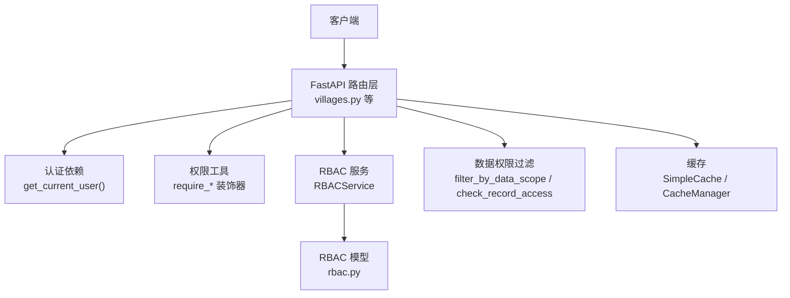
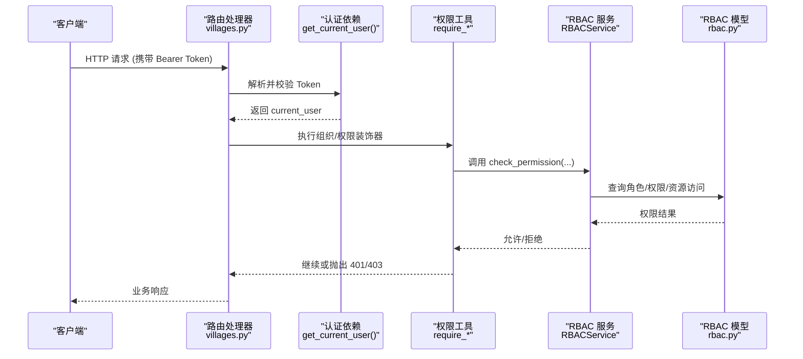
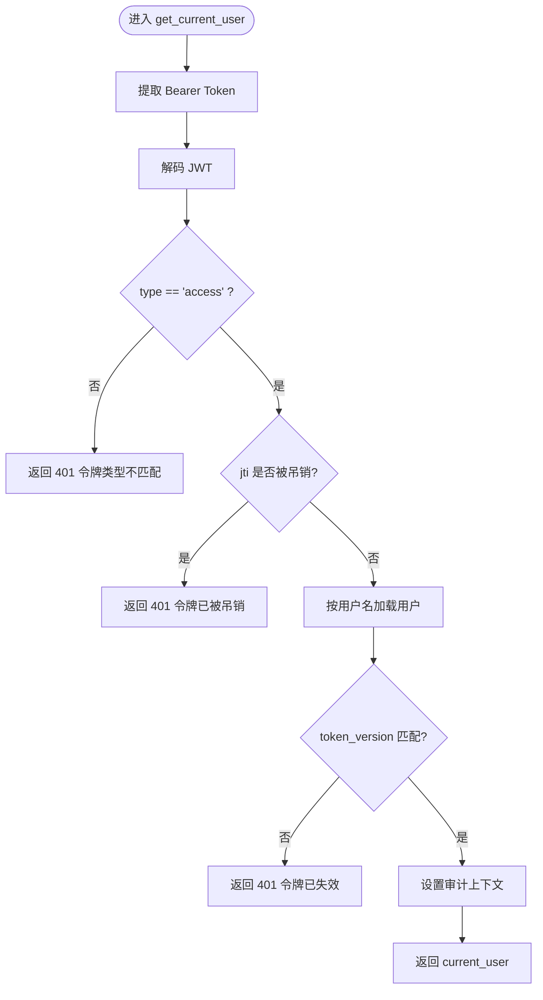
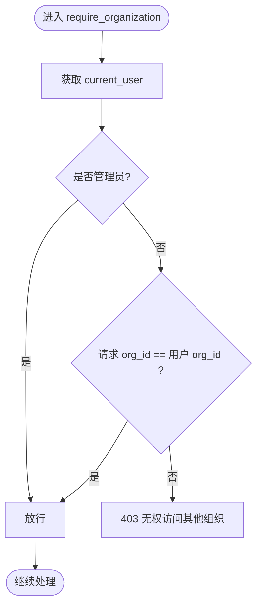
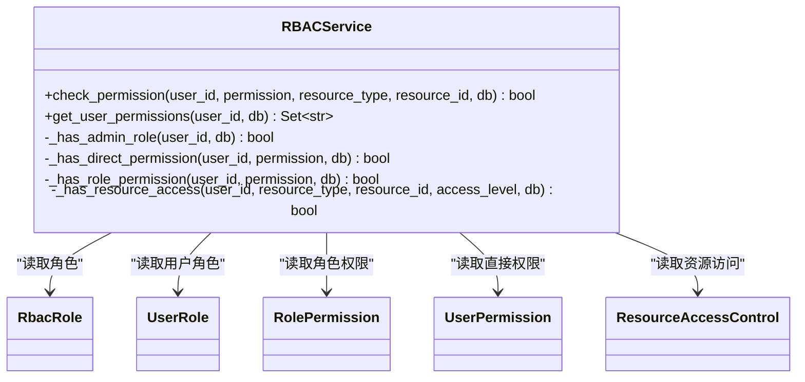
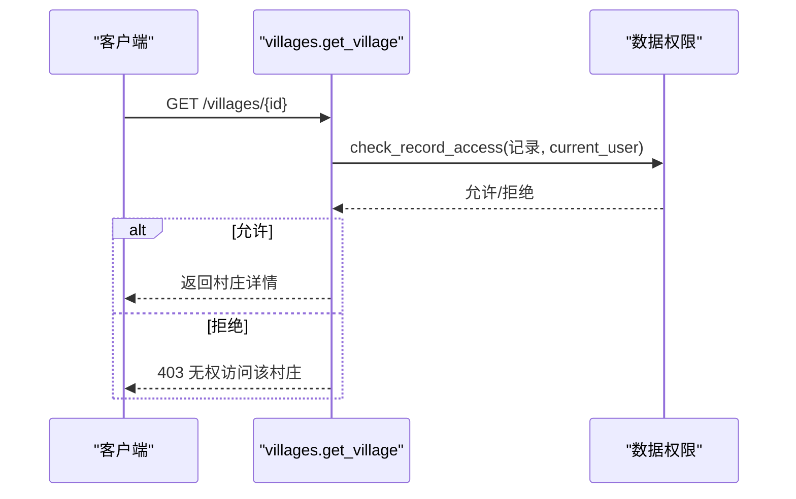
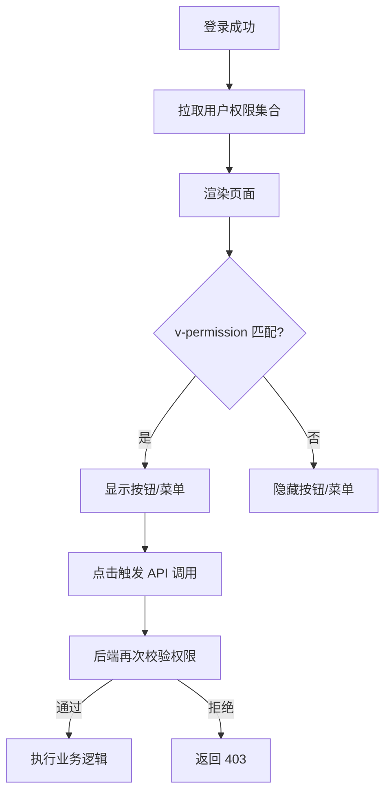
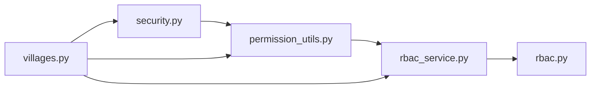

# 权限验证

<cite>
**本文引用的文件**
- [permission_utils.py](file://backend/app/core/permission_utils.py)
- [security.py](file://backend/app/core/security.py)
- [rbac.py](file://backend/app/models/rbac.py)
- [rbac_service.py](file://backend/app/services/rbac_service.py)
- [villages.py](file://backend/app/api/v1/villages.py)
- [cache.py](file://backend/app/core/cache.py)
- [permission.ts](file://frontend/src/directives/permission.ts)
</cite>

## 目录
1. [简介](#简介)
2. [项目结构](#项目结构)
3. [核心组件](#核心组件)
4. [架构总览](#架构总览)
5. [详细组件分析](#详细组件分析)
6. [依赖关系分析](#依赖关系分析)
7. [性能考虑](#性能考虑)
8. [故障排查指南](#故障排查指南)
9. [结论](#结论)
10. [附录](#附录)

## 简介
本技术文档围绕后端 API 的权限验证体系，系统阐述请求拦截、用户认证与权限检查的完整链路；说明前端权限指令与后端验证的配合机制，确保前后端权限一致性；文档化常用权限装饰器（如 @require_organization、@require_permission）的使用方式；提供在 API 端点中应用权限检查的实践示例；并总结权限缓存机制、性能优化策略以及权限变更的实时同步方案与错误处理调试方法。

## 项目结构
本项目采用分层架构：
- 安全与认证层：负责 JWT 签发/校验、当前用户解析、黑名单校验、速率限制与安全头注入。
- 权限服务层：基于 RBAC 模型实现角色、直接权限、资源级访问控制与机器码限制的综合判定。
- API 路由层：通过 FastAPI 依赖注入获取当前用户，结合数据权限过滤与业务逻辑。
- 前端指令层：在前端渲染阶段根据用户权限隐藏/显示菜单或按钮，与后端权限保持一致。

图表来源
- [security.py:243-336](file://backend/app/core/security.py#L243-L336)
- [permission_utils.py:218-309](file://backend/app/core/permission_utils.py#L218-L309)
- [rbac_service.py:133-222](file://backend/app/services/rbac_service.py#L133-L222)
- [rbac.py:31-263](file://backend/app/models/rbac.py#L31-L263)
- [villages.py:18-118](file://backend/app/api/v1/villages.py#L18-L118)
- [cache.py:14-137](file://backend/app/core/cache.py#L14-L137)

章节来源
- [security.py:243-336](file://backend/app/core/security.py#L243-L336)
- [permission_utils.py:218-309](file://backend/app/core/permission_utils.py#L218-L309)
- [rbac_service.py:133-222](file://backend/app/services/rbac_service.py#L133-L222)
- [villages.py:18-118](file://backend/app/api/v1/villages.py#L18-L118)

## 核心组件
- 认证与鉴权入口
  - get_current_user：从 Bearer Token 解码、校验类型与版本、黑名单检查、加载用户上下文。
  - require_admin：FastAPI 依赖工厂，强制管理员角色。
- 权限工具装饰器
  - require_organization：组织隔离，防止跨组织访问。
  - require_permission：按 resource:action 粒度进行权限检查。
  - is_admin / is_superuser：快速判断管理身份。
- RBAC 服务
  - RBACService.check_permission：综合机器码限制、管理员、直接权限、角色权限、资源级访问控制的统一判定。
  - 权限计算：支持白名单交集与机器码限制减法。
- 数据权限
  - filter_by_data_scope / check_record_access：在查询与记录访问时自动附加组织/归属过滤。
- 缓存
  - SimpleCache / CacheManager：进程内内存缓存，支持 TTL、前缀删除、异步封装。
- 前端权限指令
  - v-permission：根据当前用户权限集合控制 UI 元素可见性。

章节来源
- [security.py:243-371](file://backend/app/core/security.py#L243-L371)
- [permission_utils.py:17-114](file://backend/app/core/permission_utils.py#L17-L114)
- [permission_utils.py:218-309](file://backend/app/core/permission_utils.py#L218-L309)
- [rbac_service.py:133-320](file://backend/app/services/rbac_service.py#L133-L320)
- [cache.py:14-137](file://backend/app/core/cache.py#L14-L137)
- [permission.ts](file://frontend/src/directives/permission.ts)

## 架构总览
下图展示一次受保护的 API 请求从进入路由到完成权限判定的关键路径。

图表来源
- [security.py:243-336](file://backend/app/core/security.py#L243-L336)
- [permission_utils.py:218-309](file://backend/app/core/permission_utils.py#L218-L309)
- [rbac_service.py:133-222](file://backend/app/services/rbac_service.py#L133-L222)
- [rbac.py:31-263](file://backend/app/models/rbac.py#L31-L263)
- [villages.py:18-118](file://backend/app/api/v1/villages.py#L18-L118)

## 详细组件分析

### 认证与用户上下文
- 令牌校验流程
  - 提取 Authorization: Bearer <token>
  - 解码 payload，校验 type 为 access，检查 jti 是否在黑名单
  - 校验 token_version 与用户当前版本一致，否则拒绝
  - 延迟导入数据库会话，按用户名加载用户对象，写入审计上下文
- 管理员依赖
  - require_admin() 作为 FastAPI 依赖，要求角色属于管理员集合或 is_superuser 为真

图表来源
- [security.py:243-336](file://backend/app/core/security.py#L243-L336)

章节来源
- [security.py:243-336](file://backend/app/core/security.py#L243-L336)
- [security.py:350-371](file://backend/app/core/security.py#L350-L371)

### 权限工具装饰器
- @require_organization
  - 从参数或上下文中获取 current_user
  - 管理员跳过组织检查
  - 比较请求中的 organization_id 与用户所属组织，不一致则拒绝
- @require_permission(permission)
  - 解析 resource:action 格式
  - 调用 check_permission 进行权限判定
  - 无权限时返回 403

图表来源
- [permission_utils.py:218-269](file://backend/app/core/permission_utils.py#L218-L269)

章节来源
- [permission_utils.py:218-269](file://backend/app/core/permission_utils.py#L218-L269)
- [permission_utils.py:272-309](file://backend/app/core/permission_utils.py#L272-L309)

### RBAC 权限服务
- 统一权限判定顺序
  1) 机器码限制（若命中则拒绝）
  2) 管理员角色（直接放行）
  3) 直接授予的用户权限
  4) 角色关联的权限
  5) 资源级访问控制（resource_type + resource_id）
- 权限计算
  - 合并直接权限与角色权限
  - 若存在 allowed_permissions 白名单，取交集
  - 减去 machine_code 限制的权限集合
- 访问日志
  - 每次判定均记录 AccessLog，便于审计与排障

图表来源
- [rbac_service.py:133-320](file://backend/app/services/rbac_service.py#L133-L320)
- [rbac.py:31-263](file://backend/app/models/rbac.py#L31-L263)

章节来源
- [rbac_service.py:133-320](file://backend/app/services/rbac_service.py#L133-L320)
- [rbac.py:31-263](file://backend/app/models/rbac.py#L31-L263)

### API 端点中的权限应用示例
- 列表接口
  - 使用 selectinload 优化 N+1 查询
  - 通过 filter_by_data_scope 自动附加数据范围过滤
- 详情接口
  - 使用 check_record_access 对单条记录进行访问控制
  - 非本组织/非本人创建且非管理员时返回 403

图表来源
- [villages.py:90-118](file://backend/app/api/v1/villages.py#L90-L118)

章节来源
- [villages.py:18-118](file://backend/app/api/v1/villages.py#L18-L118)

### 前端权限指令与后端配合
- 指令职责
  - v-permission：根据当前用户权限集合决定是否渲染目标元素
- 一致性保障
  - 前端仅做“展示层”控制，所有写操作仍由后端严格校验
  - 建议将权限标识与后端保持一致（如 villages:write），避免前后端语义漂移

[此图为概念流程图，无需源码映射]

章节来源
- [permission.ts](file://frontend/src/directives/permission.ts)

## 依赖关系分析
- 模块耦合
  - security.py 提供认证依赖，被各路由广泛依赖
  - permission_utils.py 依赖 security.py 的 current_user 约定
  - rbac_service.py 依赖 rbac.py 模型，提供统一权限判定
  - 路由层组合认证、权限工具与数据权限过滤
- 外部依赖
  - PyJWT、passlib/bcrypt、SQLAlchemy
  - 可选 Redis（如需分布式缓存）

图表来源
- [security.py:243-371](file://backend/app/core/security.py#L243-L371)
- [permission_utils.py:218-309](file://backend/app/core/permission_utils.py#L218-L309)
- [rbac_service.py:133-320](file://backend/app/services/rbac_service.py#L133-L320)
- [rbac.py:31-263](file://backend/app/models/rbac.py#L31-L263)
- [villages.py:18-118](file://backend/app/api/v1/villages.py#L18-L118)

章节来源
- [security.py:243-371](file://backend/app/core/security.py#L243-L371)
- [permission_utils.py:218-309](file://backend/app/core/permission_utils.py#L218-L309)
- [rbac_service.py:133-320](file://backend/app/services/rbac_service.py#L133-L320)
- [rbac.py:31-263](file://backend/app/models/rbac.py#L31-L263)
- [villages.py:18-118](file://backend/app/api/v1/villages.py#L18-L118)

## 性能考虑
- 认证与鉴权
  - 使用 ContextVar 在请求内缓存受限权限集合，避免重复查询机器码限制
  - RBACService 内部对机器码限制进行请求级缓存，减少 DB 压力
- 查询优化
  - 路由层使用 selectinload 分离加载关联数据，避免 N+1 问题
  - 数据权限过滤在 SQL 层完成，减少无效数据传输
- 缓存策略
  - SimpleCache 提供进程内缓存，支持 TTL、前缀删除与异步封装
  - 对于只读、低频变化的权限配置可考虑引入 Redis 缓存（需扩展）
- 速率限制
  - 内置滑动窗口限流，保护易被刷新的接口

章节来源
- [rbac_service.py:224-235](file://backend/app/services/rbac_service.py#L224-L235)
- [villages.py:18-87](file://backend/app/api/v1/villages.py#L18-L87)
- [cache.py:14-137](file://backend/app/core/cache.py#L14-L137)

## 故障排查指南
- 常见错误与定位
  - 401 未认证/令牌无效：检查 Authorization 头、Token 类型、黑名单、token_version
  - 403 权限不足：确认用户是否具备所需 resource:action，或是否为管理员
  - 403 跨组织访问：核对请求中的 organization_id 与用户所属组织
- 调试建议
  - 开启审计日志：查看 AccessLog 中 reason 字段，定位拒绝原因
  - 打印 current_user 的 role、permissions、organization_id 等关键字段
  - 使用单元测试覆盖装饰器与 RBAC 判定分支
- 相关实现位置
  - 认证失败与黑名单：见认证依赖
  - 权限拒绝日志：见 RBAC 服务访问日志记录
  - 组织越权：见 require_organization 装饰器

章节来源
- [security.py:243-336](file://backend/app/core/security.py#L243-L336)
- [rbac_service.py:716-741](file://backend/app/services/rbac_service.py#L716-L741)
- [permission_utils.py:218-269](file://backend/app/core/permission_utils.py#L218-L269)

## 结论
本权限验证体系以 JWT 认证为基础，通过装饰器与 RBAC 服务形成“认证—授权—数据权限”三层防护。前端指令提升用户体验，但真正的安全边界在后端。通过请求级缓存、查询优化与可选的分布式缓存，系统在可扩展性与性能之间取得平衡。建议在新增功能时遵循统一的权限标注规范，持续完善审计与监控，确保权限策略的可观测性与可维护性。

## 附录
- 常用装饰器速查
  - @require_admin：要求管理员权限（FastAPI 依赖工厂）
  - @require_organization(org_param="organization_id")：组织隔离
  - @require_permission("resource:action")：资源级权限检查
- 最佳实践
  - 所有写操作必须经过后端权限校验，前端指令仅作展示控制
  - 使用统一权限标识命名规范（resource:action）
  - 对敏感接口启用速率限制与审计日志
  - 定期审查机器码限制与白名单策略