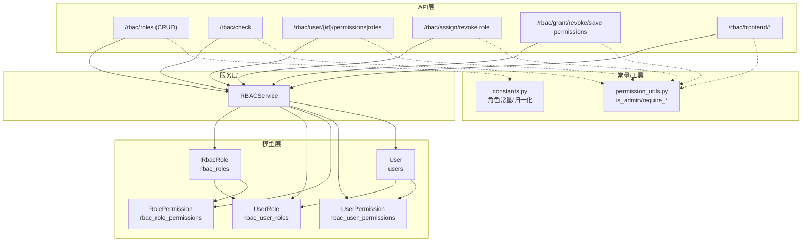
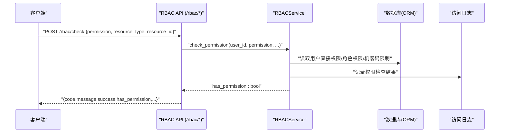
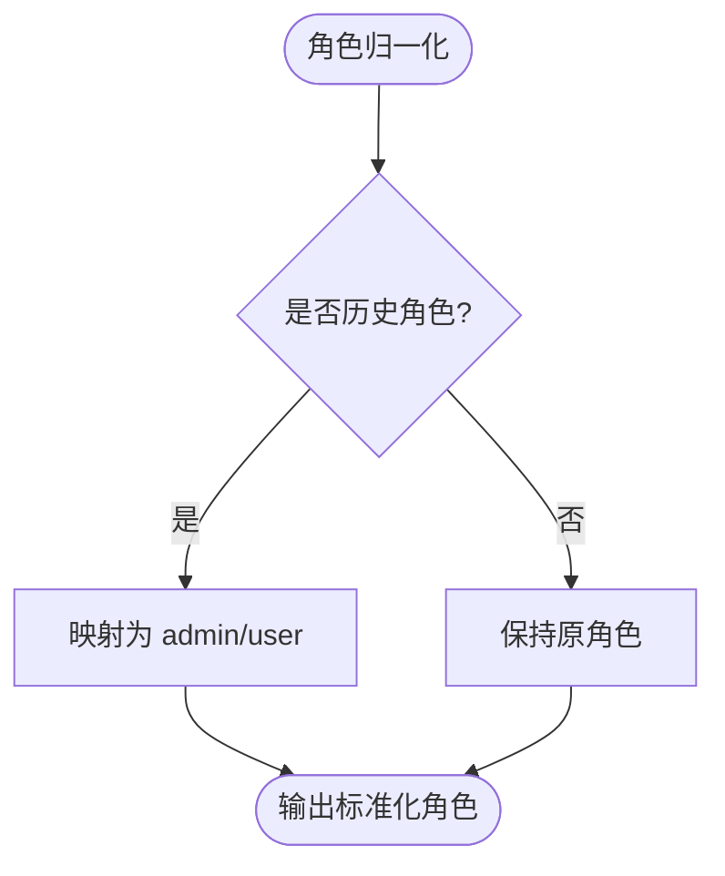
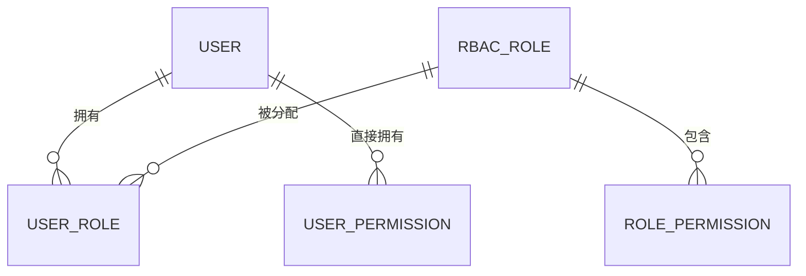
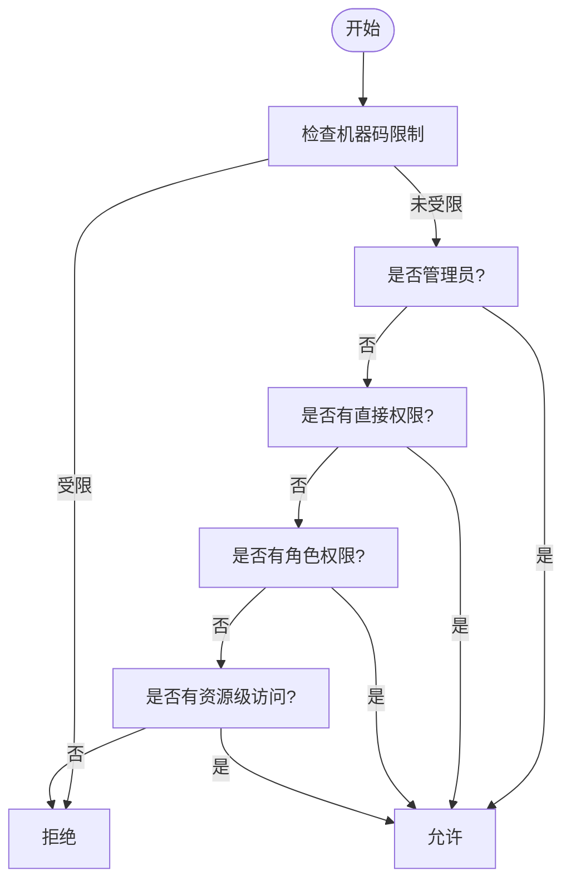
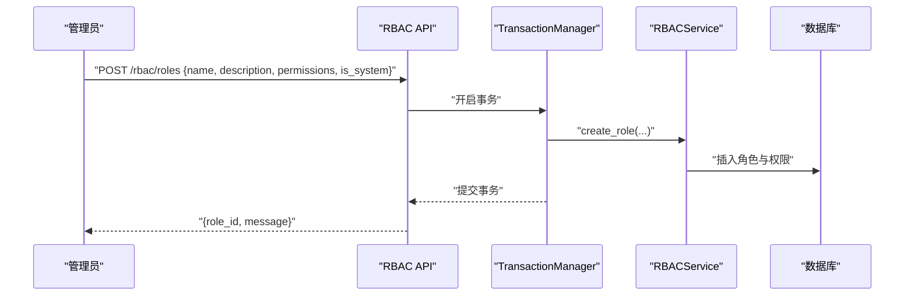
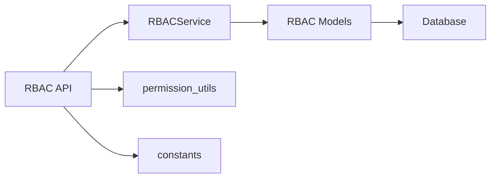

# 角色管理

<cite>
**本文引用的文件**
- [backend/app/models/rbac.py](file://backend/app/models/rbac.py)
- [backend/app/models/user.py](file://backend/app/models/user.py)
- [backend/app/api/v1/auth/rbac.py](file://backend/app/api/v1/auth/rbac.py)
- [backend/app/services/rbac_service.py](file://backend/app/services/rbac_service.py)
- [backend/app/core/constants.py](file://backend/app/core/constants.py)
- [backend/app/core/permission_utils.py](file://backend/app/core/permission_utils.py)
- [backend/tests/unit/test_rbac_api_cov.py](file://backend/tests/unit/test_rbac_api_cov.py)
</cite>

## 目录
1. [简介](#简介)
2. [项目结构](#项目结构)
3. [核心组件](#核心组件)
4. [架构总览](#架构总览)
5. [详细组件分析](#详细组件分析)
6. [依赖关系分析](#依赖关系分析)
7. [性能考虑](#性能考虑)
8. [故障排查指南](#故障排查指南)
9. [结论](#结论)
10. [附录](#附录)

## 简介
本技术文档围绕“四级角色体系”展开，系统性地说明超级管理员（super_admin）、管理员（admin）、普通用户（user）和访客（viewer/guest）的权限范围、职责边界与继承关系；并完整文档化角色的创建、修改、删除操作及角色级权限配置。同时解释角色与用户的多对多关系、权限计算流程、权限矩阵与前端路由/菜单控制要点，帮助读者快速理解并正确使用角色管理系统。

## 项目结构
角色管理涉及后端模型、服务、API 路由以及常量与工具模块：
- 数据模型：角色、用户-角色关联、角色-权限关联、用户直接权限等
- 服务层：RBAC 权限计算、角色分配/撤销、权限授予/撤销、访问日志记录
- API 层：角色 CRUD、用户权限查询、角色分配/撤销、权限检查、前端所需权限接口
- 常量与工具：角色常量定义、管理员判定、权限装饰器与校验
- 测试：覆盖角色与权限相关端点行为

图表来源
- [backend/app/models/rbac.py:31-189](file://backend/app/models/rbac.py#L31-L189)
- [backend/app/models/user.py:26-85](file://backend/app/models/user.py#L26-L85)
- [backend/app/api/v1/auth/rbac.py:144-524](file://backend/app/api/v1/auth/rbac.py#L144-L524)
- [backend/app/services/rbac_service.py:104-746](file://backend/app/services/rbac_service.py#L104-L746)
- [backend/app/core/constants.py:27-87](file://backend/app/core/constants.py#L27-L87)
- [backend/app/core/permission_utils.py:17-114](file://backend/app/core/permission_utils.py#L17-L114)

章节来源
- [backend/app/models/rbac.py:31-189](file://backend/app/models/rbac.py#L31-L189)
- [backend/app/models/user.py:26-85](file://backend/app/models/user.py#L26-L85)
- [backend/app/api/v1/auth/rbac.py:144-524](file://backend/app/api/v1/auth/rbac.py#L144-L524)
- [backend/app/services/rbac_service.py:104-746](file://backend/app/services/rbac_service.py#L104-L746)
- [backend/app/core/constants.py:27-87](file://backend/app/core/constants.py#L27-L87)
- [backend/app/core/permission_utils.py:17-114](file://backend/app/core/permission_utils.py#L17-L114)

## 核心组件
- 角色模型与关联
  - RbacRole：角色主表，支持优先级、是否系统内置、启用状态等
  - UserRole：用户与角色的多对多中间表，支持授权人、过期时间
  - RolePermission：角色到权限标识的映射
  - UserPermission：用户直接权限（可带过期时间）
- 用户模型
  - User：包含基础字段、数据范围、白名单权限 allowed_permissions、可见菜单 allowed_menus、权限包绑定等
- RBAC 服务
  - 权限计算：合并直接权限与角色权限，应用白名单交集与机器码限制，支持管理员全权限
  - 角色管理：创建角色、分配/撤销角色、批量授予/撤销权限、原子保存权限集合
  - 访问日志：记录每次权限检查的结果与原因
- API 路由
  - 角色 CRUD：创建、列表、详情、更新、删除（系统角色不可删）
  - 用户权限/角色查询：支持按用户维度查看，管理员可查任意用户
  - 权限检查：统一 /rbac/check 接口
  - 前端专用：当前用户权限、路由权限映射
- 常量与工具
  - 四级角色常量与归一化：super_admin、admin、user、viewer
  - is_admin/is_superuser 判定、require_admin 装饰器、资源权限校验

章节来源
- [backend/app/models/rbac.py:31-189](file://backend/app/models/rbac.py#L31-L189)
- [backend/app/models/user.py:26-85](file://backend/app/models/user.py#L26-L85)
- [backend/app/services/rbac_service.py:104-746](file://backend/app/services/rbac_service.py#L104-L746)
- [backend/app/api/v1/auth/rbac.py:144-524](file://backend/app/api/v1/auth/rbac.py#L144-L524)
- [backend/app/core/constants.py:27-87](file://backend/app/core/constants.py#L27-L87)
- [backend/app/core/permission_utils.py:17-114](file://backend/app/core/permission_utils.py#L17-L114)

## 架构总览
下图展示从请求进入 API 到权限判断的完整链路，包括角色与权限的数据来源、服务层计算逻辑与结果返回。

图表来源
- [backend/app/api/v1/auth/rbac.py:85-105](file://backend/app/api/v1/auth/rbac.py#L85-L105)
- [backend/app/services/rbac_service.py:133-222](file://backend/app/services/rbac_service.py#L133-L222)
- [backend/app/models/rbac.py:191-219](file://backend/app/models/rbac.py#L191-L219)

## 详细组件分析

### 四级角色体系与继承关系
- 角色定义
  - super_admin：超级管理员，拥有最高权限，通常用于系统初始化与兜底恢复
  - admin：管理员，具备管理功能的全量权限（通过 ADMIN_ALL 或角色默认权限体现）
  - user：普通用户，具备基础读/写能力（如用户、组织、帮扶村、政策等的读取与部分写入）
  - viewer/guest：访客，仅具备最小可读权限或受限访问
- 继承与兼容
  - 历史角色值会被归一化：approval_leader/manager → admin；operator → user
  - 前端有效角色映射：super_admin 视为包含 admin，便于兼容旧配置
  - 管理员判定：is_admin 将 super_admin 与 admin 视为管理员

图表来源
- [backend/app/core/constants.py:52-74](file://backend/app/core/constants.py#L52-L74)
- [frontend/tests/unit/utils/roleAccess.test.ts:39-76](file://frontend/tests/unit/utils/roleAccess.test.ts#L39-L76)

章节来源
- [backend/app/core/constants.py:27-87](file://backend/app/core/constants.py#L27-L87)
- [backend/app/core/permission_utils.py:17-58](file://backend/app/core/permission_utils.py#L17-L58)
- [frontend/tests/unit/utils/roleAccess.test.ts:39-76](file://frontend/tests/unit/utils/roleAccess.test.ts#L39-L76)

### 角色与用户的多对多关系
- 关系模型
  - User ↔ UserRole ↔ RbacRole：用户与角色通过 UserRole 建立多对多关系，支持授权人、过期时间
  - RbacRole ↔ RolePermission：角色与权限标识一对多
  - User ↔ UserPermission：用户可直接获得权限（可带过期时间）
- 查询与计算
  - 获取用户所有权限时，合并直接权限与角色权限，应用白名单交集与机器码限制
  - 管理员角色（admin/super_admin）在权限计算中可返回全部权限

图表来源
- [backend/app/models/rbac.py:31-189](file://backend/app/models/rbac.py#L31-L189)
- [backend/app/models/user.py:26-85](file://backend/app/models/user.py#L26-L85)

章节来源
- [backend/app/models/rbac.py:31-189](file://backend/app/models/rbac.py#L31-L189)
- [backend/app/models/user.py:26-85](file://backend/app/models/user.py#L26-L85)

### 角色权限矩阵与权限验证流程
- 权限枚举
  - 用户管理、组织管理、帮扶村管理、政策管理、备份管理、系统管理、审计管理、数据分析、管理员权限等
- 权限验证顺序
  1) 机器码限制权限（若命中则拒绝）
  2) 管理员权限（admin/super_admin 或 ADMIN_ALL）→ 允许
  3) 用户直接权限（UserPermission）
  4) 角色权限（RolePermission via UserRole）
  5) 资源级访问控制（ResourceAccessControl）
  6) 否则拒绝
- 白名单与限制
  - 用户 allowed_permissions 白名单会与当前权限取交集
  - 机器码限制会进一步减去受限权限

图表来源
- [backend/app/services/rbac_service.py:133-222](file://backend/app/services/rbac_service.py#L133-L222)
- [backend/app/services/rbac_service.py:237-320](file://backend/app/services/rbac_service.py#L237-L320)

章节来源
- [backend/app/services/rbac_service.py:52-99](file://backend/app/services/rbac_service.py#L52-L99)
- [backend/app/services/rbac_service.py:133-222](file://backend/app/services/rbac_service.py#L133-L222)
- [backend/app/services/rbac_service.py:237-320](file://backend/app/services/rbac_service.py#L237-L320)

### 角色管理 API 与事务性
- 角色 CRUD
  - 创建角色：POST /rbac/roles，需管理员权限，事务内持久化角色与权限
  - 列出角色：GET /rbac/roles，分页，按优先级与创建时间排序
  - 获取角色详情：GET /rbac/roles/{role_id}，附带权限列表
  - 更新角色：PUT /rbac/roles/{role_id}，支持名称、描述、启用状态、权限列表（先删后增）
  - 删除角色：DELETE /rbac/roles/{role_id}，系统内置角色不可删除
- 角色分配与撤销
  - 分配角色：POST /rbac/assign/role，支持过期时间，事务内写入 UserRole
  - 撤销角色：DELETE /rbac/revoke/role，事务内删除 UserRole
- 权限授予与撤销
  - 授予权限：POST /rbac/grant/permission，批量新增 UserPermission
  - 撤销权限：POST /rbac/revoke/permission，批量删除 UserPermission
  - 原子保存权限：POST /rbac/save-permissions，单事务内完成撤销+授予
- 权限检查与前端接口
  - 权限检查：POST /rbac/check
  - 用户权限/角色查询：GET /rbac/user/{id}/permissions|roles
  - 前端专用：/rbac/frontend/current-user-permissions、/rbac/frontend/route-permissions

图表来源
- [backend/app/api/v1/auth/rbac.py:144-162](file://backend/app/api/v1/auth/rbac.py#L144-L162)
- [backend/app/api/v1/auth/rbac.py:204-255](file://backend/app/api/v1/auth/rbac.py#L204-L255)
- [backend/app/services/rbac_service.py:588-606](file://backend/app/services/rbac_service.py#L588-L606)

章节来源
- [backend/app/api/v1/auth/rbac.py:144-524](file://backend/app/api/v1/auth/rbac.py#L144-L524)
- [backend/app/services/rbac_service.py:322-373](file://backend/app/services/rbac_service.py#L322-L373)
- [backend/app/services/rbac_service.py:407-586](file://backend/app/services/rbac_service.py#L407-L586)

### 代码示例路径（不直接展示代码内容）
- 创建新角色（含权限）：[创建角色 API:144-162](file://backend/app/api/v1/auth/rbac.py#L144-L162)
- 更新角色权限（先删后增）：[更新角色 API:204-236](file://backend/app/api/v1/auth/rbac.py#L204-L236)
- 删除角色（系统角色保护）：[删除角色 API:239-255](file://backend/app/api/v1/auth/rbac.py#L239-L255)
- 分配角色给用户：[分配角色 API:288-310](file://backend/app/api/v1/auth/rbac.py#L288-L310)
- 撤销角色：[撤销角色 API:313-329](file://backend/app/api/v1/auth/rbac.py#L313-L329)
- 批量授予权限：[授予权限 API:332-356](file://backend/app/api/v1/auth/rbac.py#L332-L356)
- 原子保存权限集合：[保存权限 API:381-405](file://backend/app/api/v1/auth/rbac.py#L381-L405)
- 权限检查接口：[权限检查 API:85-105](file://backend/app/api/v1/auth/rbac.py#L85-L105)
- 前端权限与路由映射：[前端接口:442-524](file://backend/app/api/v1/auth/rbac.py#L442-L524)

章节来源
- [backend/app/api/v1/auth/rbac.py:85-105](file://backend/app/api/v1/auth/rbac.py#L85-L105)
- [backend/app/api/v1/auth/rbac.py:144-162](file://backend/app/api/v1/auth/rbac.py#L144-L162)
- [backend/app/api/v1/auth/rbac.py:204-255](file://backend/app/api/v1/auth/rbac.py#L204-L255)
- [backend/app/api/v1/auth/rbac.py:288-329](file://backend/app/api/v1/auth/rbac.py#L288-L329)
- [backend/app/api/v1/auth/rbac.py:332-405](file://backend/app/api/v1/auth/rbac.py#L332-L405)
- [backend/app/api/v1/auth/rbac.py:442-524](file://backend/app/api/v1/auth/rbac.py#L442-L524)

## 依赖关系分析
- 模型依赖
  - RbacRole 与 UserRole、RolePermission 形成角色-用户-权限的核心三角
  - User 与 UserPermission 提供细粒度直接权限
- 服务依赖
  - RBACService 依赖 ORM 模型进行权限计算与变更
  - 使用 TransactionManager 保证角色与权限操作的原子性
- API 依赖
  - 路由层调用 RBACService，并通过 require_admin/get_current_user 做鉴权
  - 前端接口提供权限与路由映射，支撑前端菜单与路由守卫
- 常量与工具
  - constants.py 提供角色常量与归一化逻辑
  - permission_utils.py 提供 is_admin/require_admin 等工具

图表来源
- [backend/app/api/v1/auth/rbac.py:144-524](file://backend/app/api/v1/auth/rbac.py#L144-L524)
- [backend/app/services/rbac_service.py:104-746](file://backend/app/services/rbac_service.py#L104-L746)
- [backend/app/models/rbac.py:31-189](file://backend/app/models/rbac.py#L31-L189)
- [backend/app/core/constants.py:27-87](file://backend/app/core/constants.py#L27-L87)
- [backend/app/core/permission_utils.py:17-114](file://backend/app/core/permission_utils.py#L17-L114)

章节来源
- [backend/app/api/v1/auth/rbac.py:144-524](file://backend/app/api/v1/auth/rbac.py#L144-L524)
- [backend/app/services/rbac_service.py:104-746](file://backend/app/services/rbac_service.py#L104-L746)
- [backend/app/models/rbac.py:31-189](file://backend/app/models/rbac.py#L31-L189)
- [backend/app/core/constants.py:27-87](file://backend/app/core/constants.py#L27-L87)
- [backend/app/core/permission_utils.py:17-114](file://backend/app/core/permission_utils.py#L17-L114)

## 性能考虑
- 单次请求缓存：机器码限制权限在请求级别缓存，避免重复查询
- 预查询与批量操作：批量授予/撤销权限采用预查询 + 批量 INSERT/DELETE，减少往返
- 索引优化：关键查询列（user_id、role_id、permission）已建索引，提升 JOIN 与过滤效率
- 事务边界：通过 TransactionManager 统一管理事务，减少锁竞争与不一致风险

章节来源
- [backend/app/services/rbac_service.py:224-235](file://backend/app/services/rbac_service.py#L224-L235)
- [backend/app/services/rbac_service.py:407-586](file://backend/app/services/rbac_service.py#L407-L586)
- [backend/app/models/rbac.py:81-189](file://backend/app/models/rbac.py#L81-L189)

## 故障排查指南
- 常见错误
  - 非管理员尝试创建/更新/删除角色：返回 403
  - 删除系统内置角色：返回 400（禁止删除）
  - 角色不存在：返回 404
  - 无权查看其他用户权限/角色：返回 403
- 定位方法
  - 检查 require_admin 是否正确应用于受保护端点
  - 确认角色是否存在且处于激活状态
  - 核对权限枚举是否与业务一致
  - 查看访问日志（AccessLog）了解权限检查失败原因
- 参考测试用例
  - 角色 CRUD 与权限检查的断言覆盖了主要分支

章节来源
- [backend/app/api/v1/auth/rbac.py:186-255](file://backend/app/api/v1/auth/rbac.py#L186-L255)
- [backend/tests/unit/test_rbac_api_cov.py:160-266](file://backend/tests/unit/test_rbac_api_cov.py#L160-L266)

## 结论
本角色管理系统以 RBAC 为核心，结合用户直接权限、角色权限、资源级访问控制与机器码限制，实现了灵活而安全的权限体系。四级角色（super_admin、admin、user、viewer）通过常量与归一化机制保持一致性，API 层提供完整的角色 CRUD 与权限分配能力，并以事务保障数据一致性。配合前端权限与路由映射，可实现端到端的权限控制。建议在生产环境中严格遵循最小权限原则，定期审查角色与权限配置，并结合访问日志进行安全审计。

## 附录
- 权限枚举与分类
  - 用户管理、组织管理、帮扶村管理、政策管理、备份管理、系统管理、审计管理、数据分析、管理员权限
- 前端路由权限映射
  - 各页面/操作对应的权限标识，供前端路由守卫与菜单显示使用
- 角色与用户关系
  - 多对多关系通过 UserRole 维护，支持授权人与过期时间
- 常用 API 路径
  - 角色管理：/rbac/roles
  - 权限检查：/rbac/check
  - 用户权限/角色：/rbac/user/{id}/permissions|roles
  - 角色分配/撤销：/rbac/assign/role、/rbac/revoke/role
  - 权限授予/撤销/保存：/rbac/grant/permission、/rbac/revoke/permission、/rbac/save-permissions
  - 前端接口：/rbac/frontend/current-user-permissions、/rbac/frontend/route-permissions

章节来源
- [backend/app/services/rbac_service.py:52-99](file://backend/app/services/rbac_service.py#L52-L99)
- [backend/app/api/v1/auth/rbac.py:442-524](file://backend/app/api/v1/auth/rbac.py#L442-L524)
- [backend/app/models/rbac.py:81-189](file://backend/app/models/rbac.py#L81-L189)