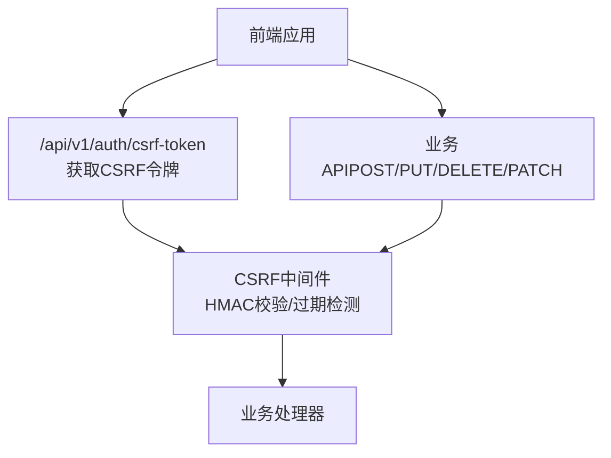
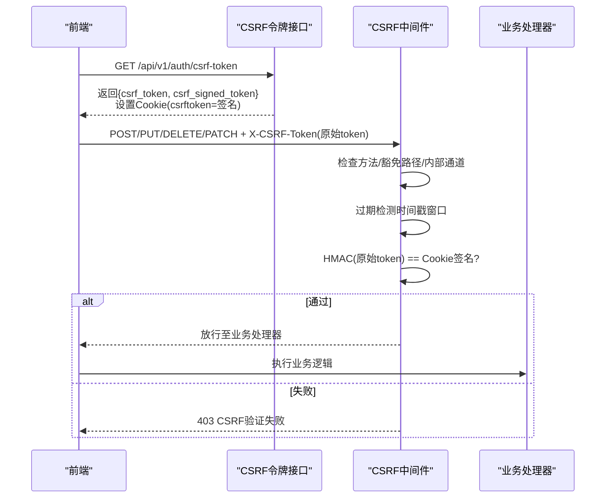
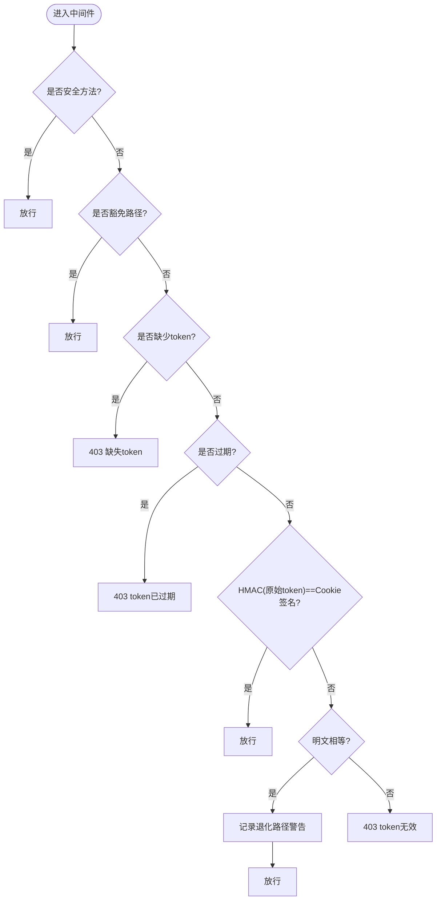
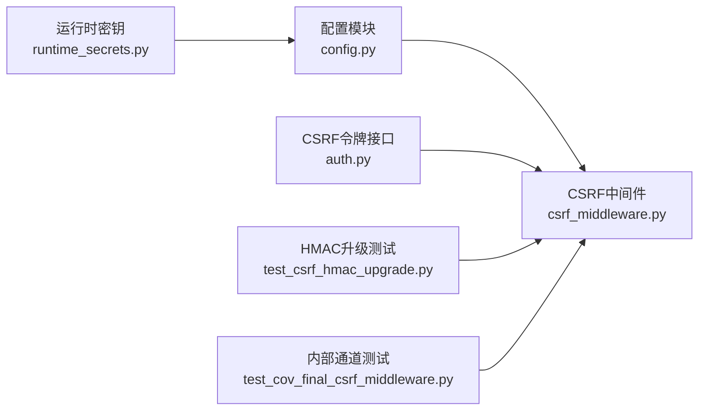

# CSRF防护中间件

<cite>
**本文引用的文件**
- [backend/app/middleware/csrf_middleware.py](file://backend/app/middleware/csrf_middleware.py)
- [backend/app/api/v1/auth/auth.py](file://backend/app/api/v1/auth/auth.py)
- [backend/app/core/config.py](file://backend/app/core/config.py)
- [backend/app/utils/runtime_secrets.py](file://backend/app/utils/runtime_secrets.py)
- [backend/tests/unit/test_csrf_hmac_upgrade.py](file://backend/tests/unit/test_csrf_hmac_upgrade.py)
- [backend/tests/unit/test_cov_final_csrf_middleware.py](file://backend/tests/unit/test_cov_final_csrf_middleware.py)
</cite>

## 目录
1. [简介](#简介)
2. [项目结构](#项目结构)
3. [核心组件](#核心组件)
4. [架构总览](#架构总览)
5. [详细组件分析](#详细组件分析)
6. [依赖关系分析](#依赖关系分析)
7. [性能与安全考量](#性能与安全考量)
8. [故障排查指南](#故障排查指南)
9. [结论](#结论)
10. [附录：配置与集成示例](#附录配置与集成示例)

## 简介
本技术文档围绕CSRF防护中间件的实现与使用，系统阐述Double Submit Cookie模式在本项目中的落地方案。重点包括：
- HMAC-SHA256签名验证机制、令牌生成算法与过期检测策略
- CSRF令牌格式（时间戳.随机数）、签名过程与常量时间比较的安全优势
- 豁免路径配置、可信代理IP透传机制与客户端IP获取逻辑
- 完整配置示例与前端集成指南
- 向后兼容机制（明文比对回退）与安全升级建议
- 攻击防护场景分析与故障排查指南

## 项目结构
CSRF相关代码主要分布在以下位置：
- 中间件实现：backend/app/middleware/csrf_middleware.py
- 令牌获取接口：backend/app/api/v1/auth/auth.py
- 配置项定义：backend/app/core/config.py
- 运行时密钥管理：backend/app/utils/runtime_secrets.py
- 单元测试覆盖：backend/tests/unit/test_csrf_hmac_upgrade.py、backend/tests/unit/test_cov_final_csrf_middleware.py

图表来源
- [backend/app/api/v1/auth/auth.py:692-747](file://backend/app/api/v1/auth/auth.py#L692-L747)
- [backend/app/middleware/csrf_middleware.py:177-284](file://backend/app/middleware/csrf_middleware.py#L177-L284)

章节来源
- [backend/app/middleware/csrf_middleware.py:1-284](file://backend/app/middleware/csrf_middleware.py#L1-L284)
- [backend/app/api/v1/auth/auth.py:692-747](file://backend/app/api/v1/auth/auth.py#L692-L747)
- [backend/app/core/config.py:148-155](file://backend/app/core/config.py#L148-L155)

## 核心组件
- CSRF中间件类：负责请求拦截、豁免判断、过期检测、HMAC签名验证与明文回退
- 令牌生成器：生成“时间戳.随机数”格式的原始token
- 签名器：对原始token进行HMAC-SHA256签名，用于Cookie存储
- 过期检测器：基于token内嵌时间戳的窗口期判定
- 客户端IP提取器：支持可信代理透传X-Forwarded-For，不可信时降级为直连IP
- 令牌获取接口：返回原始token并设置包含签名的Cookie

章节来源
- [backend/app/middleware/csrf_middleware.py:65-125](file://backend/app/middleware/csrf_middleware.py#L65-L125)
- [backend/app/middleware/csrf_middleware.py:135-175](file://backend/app/middleware/csrf_middleware.py#L135-L175)
- [backend/app/api/v1/auth/auth.py:692-747](file://backend/app/api/v1/auth/auth.py#L692-L747)

## 架构总览
CSRF防护采用Double Submit Cookie增强版：
- 前端先调用GET /api/v1/auth/csrf-token，服务端返回原始token并在响应中设置Cookie为HMAC签名值
- 后续状态变更请求需携带X-CSRF-Token头为原始token
- 中间件计算HMAC(原始token)并与Cookie中的签名值进行常量时间比较，通过则放行
- 若未启用或命中豁免路径，直接放行
- 若token过期或缺失，返回403并记录告警日志

图表来源
- [backend/app/api/v1/auth/auth.py:692-747](file://backend/app/api/v1/auth/auth.py#L692-L747)
- [backend/app/middleware/csrf_middleware.py:177-284](file://backend/app/middleware/csrf_middleware.py#L177-L284)

## 详细组件分析

### Double Submit Cookie与HMAC-SHA256验证
- 令牌格式：原始token为“时间戳.随机数”，便于过期检测；随机部分由安全随机源生成
- 签名过程：使用HMAC-SHA256对原始token进行签名，结果写入Cookie（csrftoken）
- 验证流程：中间件对请求头中的原始token再次计算HMAC，并使用常量时间比较函数与Cookie中的签名对比，避免时序攻击
- 常量时间比较优势：防止侧信道攻击，确保比较耗时不泄露匹配信息

图表来源
- [backend/app/middleware/csrf_middleware.py:177-284](file://backend/app/middleware/csrf_middleware.py#L177-L284)

章节来源
- [backend/app/middleware/csrf_middleware.py:65-125](file://backend/app/middleware/csrf_middleware.py#L65-L125)
- [backend/app/middleware/csrf_middleware.py:177-284](file://backend/app/middleware/csrf_middleware.py#L177-L284)

### 令牌生成与过期检测
- 生成算法：当前Unix秒级时间戳拼接随机十六进制字符串，保证唯一性与可审计性
- 过期策略：解析时间戳前缀，若超过配置的有效期（默认86400秒），拒绝请求；旧格式无时间戳不做过期判定以兼容历史数据
- 安全考虑：随机数长度足够，降低碰撞概率；时间戳窗口合理平衡安全性与可用性

章节来源
- [backend/app/middleware/csrf_middleware.py:65-75](file://backend/app/middleware/csrf_middleware.py#L65-L75)
- [backend/app/middleware/csrf_middleware.py:104-125](file://backend/app/middleware/csrf_middleware.py#L104-L125)

### 豁免路径与内部通道
- 豁免路径：登录、注册、健康检查、文档等静态或无需CSRF的路径直接放行
- 内部通道：当存在INTERNAL_BACKUP_KEY环境变量且请求头匹配该密钥时，跳过CSRF校验，用于内部备份通道等受控场景
- 安全基线：生产环境默认开启CSRF保护，仅对必要路径豁免

章节来源
- [backend/app/middleware/csrf_middleware.py:42-56](file://backend/app/middleware/csrf_middleware.py#L42-L56)
- [backend/app/middleware/csrf_middleware.py:205-210](file://backend/app/middleware/csrf_middleware.py#L205-L210)
- [backend/tests/unit/test_cov_final_csrf_middleware.py:11-48](file://backend/tests/unit/test_cov_final_csrf_middleware.py#L11-L48)

### 可信代理IP透传与客户端IP获取
- 未配置TRUSTED_PROXIES：直接返回直连IP，fail-closed策略，防止伪造XFF绕过限流/审计
- 配置后：校验直连IP是否在可信代理列表（支持CIDR），可信则取X-Forwarded-For首段作为真实客户端IP，否则降级为直连IP
- 用途：统一日志、审计、限流键等模块获取可靠客户端IP

章节来源
- [backend/app/middleware/csrf_middleware.py:58-62](file://backend/app/middleware/csrf_middleware.py#L58-L62)
- [backend/app/middleware/csrf_middleware.py:135-175](file://backend/app/middleware/csrf_middleware.py#L135-L175)
- [backend/tests/unit/test_csrf_hmac_upgrade.py:225-261](file://backend/tests/unit/test_csrf_hmac_upgrade.py#L225-L261)

### 后端令牌接口
- 接口路径：GET /api/v1/auth/csrf-token
- 功能：生成原始token和签名token，将签名token写入Cookie（允许JS读取），并在响应体返回原始token与签名token
- 速率限制：按客户端IP限制CSRF令牌获取频率，防止滥用
- 安全属性：Cookie设置SameSite=Strict，生产环境根据条件设置Secure标志

章节来源
- [backend/app/api/v1/auth/auth.py:692-747](file://backend/app/api/v1/auth/auth.py#L692-L747)

## 依赖关系分析
- 中间件依赖配置模块获取CSRF开关与密钥
- 令牌接口依赖中间件工具函数生成与签名
- 运行时密钥管理确保SECRET_KEY与CSRF_SECRET_KEY可用，支持自动生成与持久化
- 测试用例覆盖HMAC验证、明文回退、过期拒绝、IP透传等关键路径

图表来源
- [backend/app/core/config.py:148-155](file://backend/app/core/config.py#L148-L155)
- [backend/app/utils/runtime_secrets.py:20-93](file://backend/app/utils/runtime_secrets.py#L20-L93)
- [backend/app/middleware/csrf_middleware.py:177-284](file://backend/app/middleware/csrf_middleware.py#L177-L284)
- [backend/app/api/v1/auth/auth.py:692-747](file://backend/app/api/v1/auth/auth.py#L692-L747)
- [backend/tests/unit/test_csrf_hmac_upgrade.py:1-261](file://backend/tests/unit/test_csrf_hmac_upgrade.py#L1-L261)
- [backend/tests/unit/test_cov_final_csrf_middleware.py:11-48](file://backend/tests/unit/test_cov_final_csrf_middleware.py#L11-L48)

章节来源
- [backend/app/core/config.py:148-155](file://backend/app/core/config.py#L148-L155)
- [backend/app/utils/runtime_secrets.py:20-93](file://backend/app/utils/runtime_secrets.py#L20-L93)
- [backend/app/middleware/csrf_middleware.py:177-284](file://backend/app/middleware/csrf_middleware.py#L177-L284)
- [backend/app/api/v1/auth/auth.py:692-747](file://backend/app/api/v1/auth/auth.py#L692-L747)

## 性能与安全考量
- 性能
  - HMAC-SHA256计算开销低，适合高并发场景
  - 常量时间比较避免分支差异导致的额外开销
  - 过期检测仅解析时间戳前缀，复杂度O(1)
- 安全
  - 使用HMAC-SHA256防止token篡改
  - 常量时间比较抵御时序攻击
  - 严格SameSite与可选Secure标志减少跨站风险
  - 可信代理白名单防止XFF伪造
  - 内部通道密钥控制敏感操作绕过

[本节为通用指导，不直接分析具体文件]

## 故障排查指南
- 现象：请求返回403，提示CSRF验证失败
  - 检查是否已调用GET /api/v1/auth/csrf-token获取token
  - 确认请求头X-CSRF-Token是否为原始token而非签名值
  - 确认Cookie csrftoken是否存在且为签名值
  - 检查token是否过期（时间戳窗口）
- 现象：明文回退警告
  - 说明前端仍使用旧版明文传输，建议升级至HMAC流程
- 现象：内部通道未生效
  - 检查是否设置INTERNAL_BACKUP_KEY环境变量且请求头匹配
- 现象：客户端IP不正确
  - 检查TRUSTED_PROXIES配置是否正确，直连IP是否在可信列表中
  - 确认X-Forwarded-For头部格式正确

章节来源
- [backend/app/middleware/csrf_middleware.py:211-284](file://backend/app/middleware/csrf_middleware.py#L211-L284)
- [backend/tests/unit/test_csrf_hmac_upgrade.py:146-199](file://backend/tests/unit/test_csrf_hmac_upgrade.py#L146-L199)
- [backend/tests/unit/test_cov_final_csrf_middleware.py:11-48](file://backend/tests/unit/test_cov_final_csrf_middleware.py#L11-L48)

## 结论
本项目实现了基于Double Submit Cookie与HMAC-SHA256的CSRF防护中间件，具备：
- 强安全的令牌生成与签名验证
- 灵活的过期检测与豁免路径配置
- 可靠的客户端IP获取与代理透传机制
- 向后兼容的明文回退路径与安全升级指引
- 完善的测试覆盖与故障排查能力

建议在生产环境中始终启用CSRF保护，并按需配置可信代理与内部通道密钥，确保系统安全基线达标。

[本节为总结性内容，不直接分析具体文件]

## 附录：配置与集成示例

### 后端配置
- 启用CSRF：在配置中设置CSRF_ENABLED为True（默认开启）
- 密钥管理：CSRF_SECRET_KEY留空时自动生成并持久化，也可通过环境变量注入
- 可信代理：通过TRUSTED_PROXIES环境变量配置可信代理IP或网段
- 内部通道：设置INTERNAL_BACKUP_KEY环境变量并在使用内部通道时携带对应请求头

章节来源
- [backend/app/core/config.py:148-155](file://backend/app/core/config.py#L148-L155)
- [backend/app/utils/runtime_secrets.py:20-93](file://backend/app/utils/runtime_secrets.py#L20-L93)
- [backend/app/middleware/csrf_middleware.py:58-62](file://backend/app/middleware/csrf_middleware.py#L58-L62)

### 前端集成步骤
- 发起状态变更前，先调用GET /api/v1/auth/csrf-token
- 从响应体中获取csrf_token字段，放入后续请求的X-CSRF-Token请求头
- 确保浏览器保留响应中设置的csrftoken Cookie
- 注意跨域与Cookie SameSite/Secure设置

章节来源
- [backend/app/api/v1/auth/auth.py:692-747](file://backend/app/api/v1/auth/auth.py#L692-L747)

### 攻击防护场景
- 跨站请求伪造：通过HMAC签名与Double Submit Cookie有效防御
- 重放攻击：结合token过期检测与一次性使用策略缓解
- 代理伪造：通过可信代理白名单与fail-closed策略防止XFF伪造
- 内部通道滥用：通过内部密钥控制敏感操作绕过

[本节为概念性内容，不直接分析具体文件]