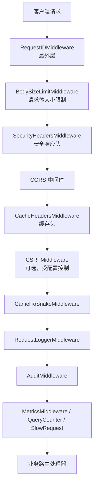
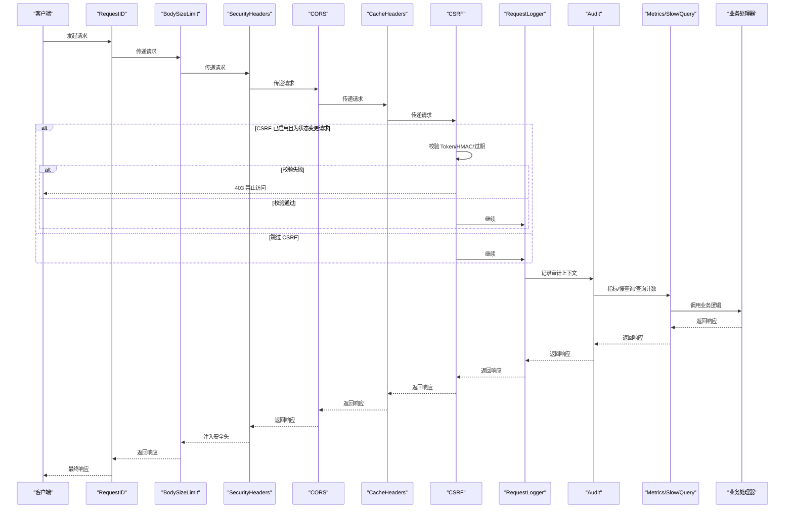
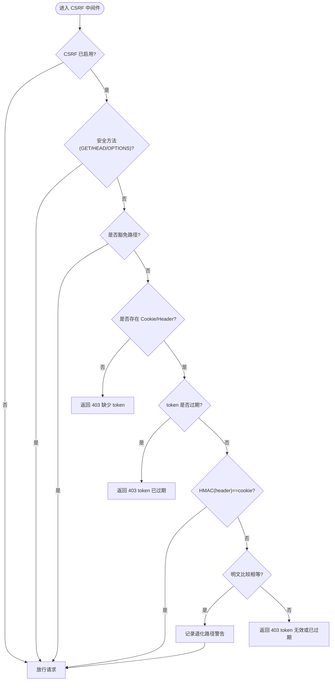
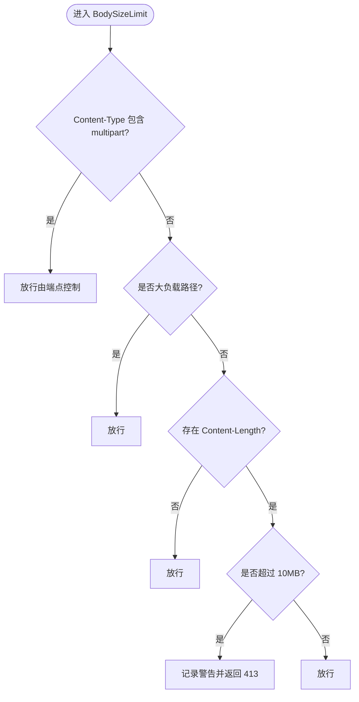
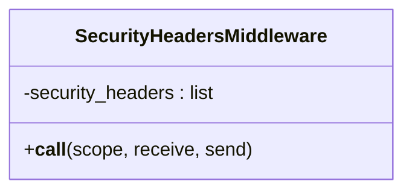
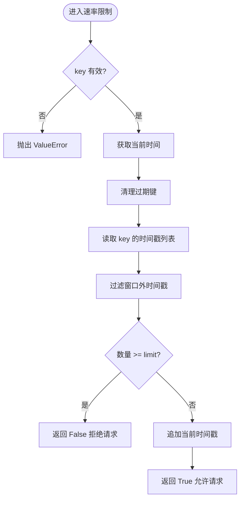
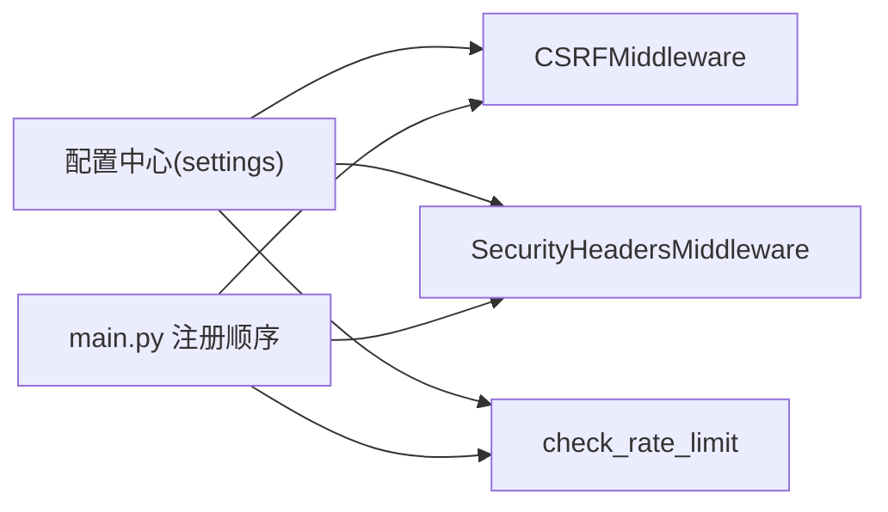

# 安全中间件

<cite>
**本文引用的文件**
- [backend/app/middleware/csrf_middleware.py](file://backend/app/middleware/csrf_middleware.py)
- [backend/app/middleware/body_size_limit.py](file://backend/app/middleware/body_size_limit.py)
- [backend/app/middleware/cache_headers.py](file://backend/app/middleware/cache_headers.py)
- [backend/app/core/security.py](file://backend/app/core/security.py)
- [backend/app/core/config.py](file://backend/app/core/config.py)
- [backend/app/main.py](file://backend/app/main.py)
- [backend/app/middleware/request_logger.py](file://backend/app/middleware/request_logger.py)
</cite>

## 目录
1. [简介](#简介)
2. [项目结构](#项目结构)
3. [核心组件](#核心组件)
4. [架构总览](#架构总览)
5. [详细组件分析](#详细组件分析)
6. [依赖关系分析](#依赖关系分析)
7. [性能考量](#性能考量)
8. [故障排查指南](#故障排查指南)
9. [结论](#结论)
10. [附录](#附录)

## 简介
本技术文档聚焦于后端安全中间件体系，围绕以下目标展开：
- CSRF 防护中间件的实现原理：令牌生成、HMAC 签名校验、过期检测与防攻击机制。
- 请求体大小限制中间件：防止大文件/超大 JSON 导致的资源耗尽攻击。
- 安全响应头中间件：统一注入 X-Content-Type-Options、X-Frame-Options、Referrer-Policy 等关键安全头。
- 速率限制能力：基于内存滑动窗口的 IP 级频率控制，用于防御暴力破解与滥用。
- 配置示例与使用方法：结合应用启动流程说明中间件注册顺序与开关项。
- 执行顺序与错误处理策略：确保安全防护全面且可靠。

## 项目结构
安全相关中间件位于 backend/app/middleware 与 backend/app/core 中，并通过 backend/app/main.py 统一注册到 FastAPI 应用管线。核心要点：
- CSRF 保护：CSRFMiddleware（启用时）
- 请求体大小限制：BodySizeLimitMiddleware
- 安全响应头：SecurityHeadersMiddleware
- 缓存头：CacheHeadersMiddleware（辅助性能与安全）
- 速率限制：check_rate_limit（在 core/security.py 提供）
- 日志与追踪：RequestLoggerMiddleware、RequestIDMiddleware（配合审计）

图示来源
- [backend/app/main.py:113-165](file://backend/app/main.py#L113-L165)
- [backend/app/middleware/csrf_middleware.py:177-284](file://backend/app/middleware/csrf_middleware.py#L177-L284)
- [backend/app/middleware/body_size_limit.py:48-79](file://backend/app/middleware/body_size_limit.py#L48-L79)
- [backend/app/core/security.py:598-636](file://backend/app/core/security.py#L598-L636)
- [backend/app/middleware/cache_headers.py:20-31](file://backend/app/middleware/cache_headers.py#L20-L31)

章节来源
- [backend/app/main.py:113-165](file://backend/app/main.py#L113-L165)

## 核心组件
- CSRF 保护中间件：采用 Double Submit Cookie + HMAC 签名增强模式，支持旧版明文兼容与 token 过期检测。
- 请求体大小限制中间件：对非 multipart 且不在白名单路径的请求进行 Content-Length 检查，超限返回 413。
- 安全响应头中间件：为所有 HTTP 响应注入 X-Content-Type-Options、X-Frame-Options、Referrer-Policy 等安全头，并对静态/参考数据设置合适的 Cache-Control。
- 速率限制器：内存滑动窗口算法，按 key（通常为 IP）统计时间窗口内请求数，超限拒绝。
- 缓存头中间件：为特定路径添加 Cache-Control，减少重复查询并提升性能。

章节来源
- [backend/app/middleware/csrf_middleware.py:1-284](file://backend/app/middleware/csrf_middleware.py#L1-L284)
- [backend/app/middleware/body_size_limit.py:1-79](file://backend/app/middleware/body_size_limit.py#L1-L79)
- [backend/app/core/security.py:598-636](file://backend/app/core/security.py#L598-L636)
- [backend/app/core/security.py:414-488](file://backend/app/core/security.py#L414-L488)
- [backend/app/middleware/cache_headers.py:1-31](file://backend/app/middleware/cache_headers.py#L1-L31)

## 架构总览
下图展示了从请求进入至响应的完整安全链路，包括中间件顺序与关键决策点。

图示来源
- [backend/app/main.py:113-165](file://backend/app/main.py#L113-L165)
- [backend/app/middleware/csrf_middleware.py:177-284](file://backend/app/middleware/csrf_middleware.py#L177-L284)
- [backend/app/middleware/body_size_limit.py:48-79](file://backend/app/middleware/body_size_limit.py#L48-L79)
- [backend/app/core/security.py:598-636](file://backend/app/core/security.py#L598-L636)

## 详细组件分析

### CSRF 防护中间件
- 令牌生成：generate_csrf_token 生成 {timestamp}.{random_hex} 格式的原始 token，便于过期检测。
- HMAC 签名：sign_csrf_token 使用 HMAC-SHA256 对原始 token 签名，签名结果写入 csrftoken Cookie；请求头 X-CSRF-Token 携带原始 token。
- 验证流程：优先 HMAC(header) == cookie 常量时间比较；若失败则回退到明文比较（旧版兼容），并记录警告日志。
- 过期检测：提取 token 中的时间戳，超过 CSRF_TOKEN_EXPIRY（默认 24 小时）即拒绝。
- 豁免路径：认证、健康检查、文档等路径无需 CSRF 验证。
- 代理信任：get_client_ip 支持 TRUSTED_PROXIES 透传真实客户端 IP，未配置时 fail-closed。

图示来源
- [backend/app/middleware/csrf_middleware.py:65-124](file://backend/app/middleware/csrf_middleware.py#L65-L124)
- [backend/app/middleware/csrf_middleware.py:177-284](file://backend/app/middleware/csrf_middleware.py#L177-L284)

章节来源
- [backend/app/middleware/csrf_middleware.py:1-284](file://backend/app/middleware/csrf_middleware.py#L1-L284)

### 请求体大小限制中间件
- 策略：multipart/form-data 一律放行（由端点级 MAX_FILE_SIZE 控制）；特定业务路径允许大 JSON；其他非 multipart 请求若 Content-Length > 10MB，直接返回 413。
- 白名单路径：导入导出、批量操作、系统备份、用户头像等路径被识别为大负载路径。
- 错误处理：记录警告日志并返回结构化错误信息。

图示来源
- [backend/app/middleware/body_size_limit.py:20-79](file://backend/app/middleware/body_size_limit.py#L20-L79)

章节来源
- [backend/app/middleware/body_size_limit.py:1-79](file://backend/app/middleware/body_size_limit.py#L1-L79)

### 安全响应头中间件
- 注入的安全头：X-Content-Type-Options=nosniff、X-Frame-Options=DENY、X-XSS-Protection=1; mode=block、Referrer-Policy=strict-origin-when-cross-origin。
- 缓存策略：静态资源与参考数据可缓存（GET 请求），变更数据不缓存。
- 覆盖范围：所有 HTTP 响应，除非响应已包含同名头部。

图示来源
- [backend/app/core/security.py:598-636](file://backend/app/core/security.py#L598-L636)

章节来源
- [backend/app/core/security.py:598-636](file://backend/app/core/security.py#L598-L636)

### 速率限制中间件（IP 级频率控制）
- 算法：内存滑动窗口，维护每个 key 的时间戳列表，窗口内超过 limit 即拒绝。
- 键选择：通常以 IP 作为 key；可通过 get_client_ip 获取可信源 IP（仅在 TRUST_PROXY_HEADERS=True 时信任代理头）。
- 清理策略：周期性清理过期键，避免内存泄漏。
- 调用方式：在认证或敏感接口处调用 check_rate_limit(key, request, limit, window)。

图示来源
- [backend/app/core/security.py:414-488](file://backend/app/core/security.py#L414-L488)
- [backend/app/core/security.py:491-510](file://backend/app/core/security.py#L491-L510)

章节来源
- [backend/app/core/security.py:414-510](file://backend/app/core/security.py#L414-L510)

### 缓存头中间件
- 规则：为筛选选项、组织树、静态资源等路径设置不同的 Cache-Control，降低数据库压力与网络开销。
- 适用场景：低变化数据与静态资源；统计/概览类端点不缓存以保证数据即时可见。

章节来源
- [backend/app/middleware/cache_headers.py:1-31](file://backend/app/middleware/cache_headers.py#L1-L31)

## 依赖关系分析
- 中间件注册顺序（Starlette 逆序执行）：
  - 最外层：RequestIDMiddleware
  - 安全头：SecurityHeadersMiddleware
  - CORS：CORSMiddleware
  - 缓存头：CacheHeadersMiddleware
  - CSRF：CSRFMiddleware（受 settings.CSRF_ENABLED 控制）
  - 驼峰转换：CamelToSnakeMiddleware
  - 请求日志：RequestLoggerMiddleware
  - 审计：AuditMiddleware
  - 指标/慢查询/查询计数：MetricsMiddleware / SlowRequestMiddleware / QueryCounterMiddleware
- 配置依赖：
  - CSRF 开关与密钥：settings.CSRF_ENABLED、settings.CSRF_SECRET_KEY
  - 代理信任：settings.TRUST_PROXY_HEADERS（影响 get_client_ip）
  - 速率限制：settings.RATE_LIMIT_ENABLED、RATE_LIMIT_PER_MINUTE/HOUR
  - 文件大小：MAX_FILE_SIZE（端点级控制）

图示来源
- [backend/app/main.py:113-165](file://backend/app/main.py#L113-L165)
- [backend/app/core/config.py:126-159](file://backend/app/core/config.py#L126-L159)

章节来源
- [backend/app/main.py:113-165](file://backend/app/main.py#L113-L165)
- [backend/app/core/config.py:126-159](file://backend/app/core/config.py#L126-L159)

## 性能考量
- CSRF 验证使用常量时间比较 hmac.compare_digest，避免时序攻击；HMAC 计算开销较小。
- 请求体大小限制在早期阶段拦截超大请求，减少后续解析成本。
- 安全响应头与缓存头中间件轻量，仅修改响应头，不影响业务逻辑。
- 速率限制使用内存存储，适合单机部署；定期清理过期键防止内存增长。
- 建议在高并发场景下将速率限制迁移至 Redis 等分布式存储以提升扩展性。

## 故障排查指南
- CSRF 验证失败（403）：
  - 检查是否先调用 GET /api/v1/auth/csrf-token 获取 token。
  - 确认前端在 X-CSRF-Token 头中携带原始 token，并在 Cookie 中保存签名版本。
  - 查看日志中“CSRF 验证失败”的详细信息（方法、路径、IP）。
- 请求体过大（413）：
  - 确认是否为 multipart/form-data 或白名单路径；否则需减小请求体或调整策略。
  - 检查 Content-Length 是否正确设置。
- 安全头缺失：
  - 确认 SecurityHeadersMiddleware 已注册且未被上层中间件覆盖。
  - 检查响应是否已包含同名头部导致未注入。
- 速率限制触发：
  - 检查 key 是否唯一（如 IP），必要时调整限流阈值或窗口。
  - 确认 get_client_ip 的代理信任配置是否符合部署环境。

章节来源
- [backend/app/middleware/csrf_middleware.py:211-284](file://backend/app/middleware/csrf_middleware.py#L211-L284)
- [backend/app/middleware/body_size_limit.py:53-79](file://backend/app/middleware/body_size_limit.py#L53-L79)
- [backend/app/core/security.py:598-636](file://backend/app/core/security.py#L598-L636)
- [backend/app/core/security.py:414-488](file://backend/app/core/security.py#L414-L488)

## 结论
本安全中间件体系通过 CSRF 防护、请求体大小限制、安全响应头注入与速率限制等多层纵深防御，有效缓解常见 Web 攻击面。中间件执行顺序清晰、错误处理完善，并结合配置开关与日志审计，确保在生产环境中具备高可用性与可观测性。建议在复杂部署环境下进一步评估分布式速率限制与更细粒度的缓存策略。

## 附录

### 配置示例与使用方法
- 启用 CSRF：
  - 设置环境变量 CSRF_ENABLED=true（默认开启）。
  - 可选设置 CSRF_SECRET_KEY；留空时使用全局 SECRET_KEY。
- 代理信任：
  - 设置 TRUST_PROXY_HEADERS=true（仅在可信反向代理后启用）。
- 速率限制：
  - RATE_LIMIT_ENABLED=true，RATE_LIMIT_PER_MINUTE=60，RATE_LIMIT_PER_HOUR=1000。
- 文件大小：
  - MAX_FILE_SIZE=52428800（50MB），端点级控制上传大小。
- 中间件注册：
  - 已在 main.py 中按推荐顺序注册；如需调整，请保持安全头在 CORS 之后、CSRF 在业务逻辑之前。

章节来源
- [backend/app/core/config.py:126-159](file://backend/app/core/config.py#L126-L159)
- [backend/app/main.py:113-165](file://backend/app/main.py#L113-L165)