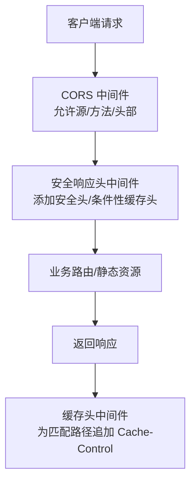
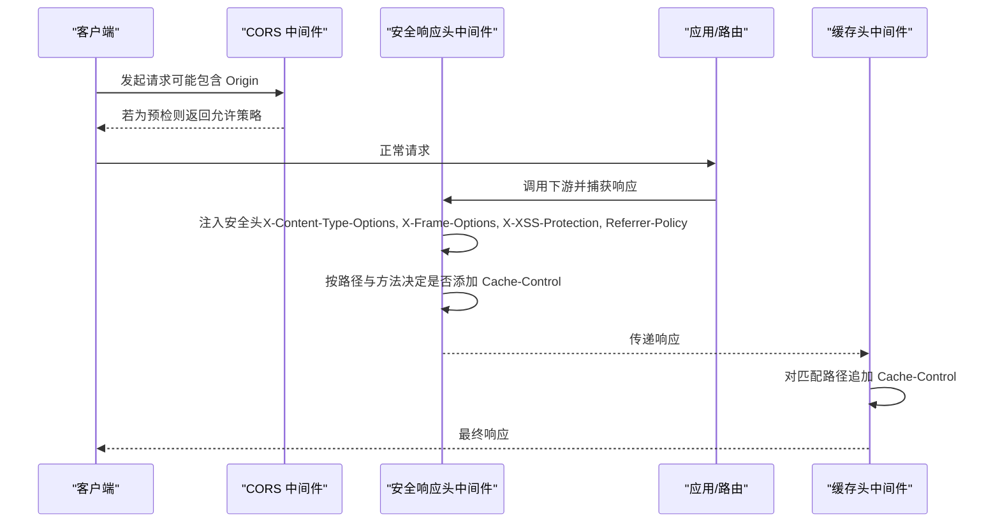
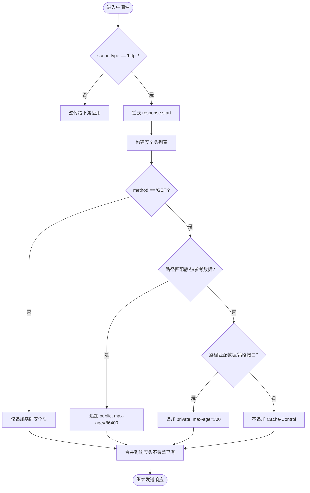

# 安全响应头中间件

<cite>
**本文引用的文件**
- [backend/app/core/security.py](file://backend/app/core/security.py)
- [backend/app/middleware/cache_headers.py](file://backend/app/middleware/cache_headers.py)
- [backend/app/main.py](file://backend/app/main.py)
- [backend/app/core/config.py](file://backend/app/core/config.py)
- [backend/tests/unit/test_core_security.py](file://backend/tests/unit/test_core_security.py)
</cite>

## 目录
1. [简介](#简介)
2. [项目结构](#项目结构)
3. [核心组件](#核心组件)
4. [架构总览](#架构总览)
5. [详细组件分析](#详细组件分析)
6. [依赖关系分析](#依赖关系分析)
7. [性能考量](#性能考量)
8. [故障排查指南](#故障排查指南)
9. [结论](#结论)
10. [附录](#附录)

## 简介
本技术文档聚焦于后端的安全响应头中间件与缓存控制策略，系统性说明以下能力：
- HTTP 安全头的设置机制与作用：X-Content-Type-Options、X-Frame-Options、X-XSS-Protection、Strict-Transport-Security、Referrer-Policy、Permissions-Policy、Content-Security-Policy。
- 缓存控制头的策略：Cache-Control、Pragma、Expires 的管理与适用场景。
- CORS 跨域配置的自动化处理：预检请求、允许的源/方法/头部配置。
- 中间件的执行顺序及其对响应的影响。
- 安全最佳实践与浏览器兼容性说明。
- 结合安全扫描结果给出漏洞修复建议。

## 项目结构
与安全响应头和缓存控制相关的代码主要分布在以下位置：
- 安全响应头中间件：位于 core/security.py 中的 SecurityHeadersMiddleware。
- 缓存头中间件：位于 middleware/cache_headers.py 中的 CacheHeadersMiddleware。
- 应用启动与中间件装配：位于 app/main.py。
- CORS 配置来源：位于 core/config.py 的 Settings 类属性。
- 单元测试覆盖：tests/unit/test_core_security.py。

图表来源
- [backend/app/main.py:146-158](file://backend/app/main.py#L146-L158)
- [backend/app/core/security.py:598-636](file://backend/app/core/security.py#L598-L636)
- [backend/app/middleware/cache_headers.py:20-31](file://backend/app/middleware/cache_headers.py#L20-L31)

章节来源
- [backend/app/main.py:140-162](file://backend/app/main.py#L140-L162)
- [backend/app/core/security.py:598-636](file://backend/app/core/security.py#L598-L636)
- [backend/app/middleware/cache_headers.py:1-31](file://backend/app/middleware/cache_headers.py#L1-L31)
- [backend/app/core/config.py:136-146](file://backend/app/core/config.py#L136-L146)

## 核心组件
- 安全响应头中间件（SecurityHeadersMiddleware）
  - 在响应开始阶段注入安全相关响应头。
  - 根据请求方法与路径条件性地附加 Cache-Control。
  - 不覆盖已存在的同名响应头，保证上层逻辑优先。
- 缓存头中间件（CacheHeadersMiddleware）
  - 针对特定路径前缀统一追加 Cache-Control，减少重复查询与带宽消耗。
- CORS 中间件（FastAPI CORSMiddleware）
  - 基于配置动态允许源、方法、头部，并暴露必要响应头。
  - 自动处理 OPTIONS 预检请求。
- 配置中心（Settings）
  - 提供 CORS_ALLOWED_ORIGINS、CORS_ALLOWED_METHODS、CORS_ALLOWED_HEADERS 等计算属性。

章节来源
- [backend/app/core/security.py:598-636](file://backend/app/core/security.py#L598-L636)
- [backend/app/middleware/cache_headers.py:20-31](file://backend/app/middleware/cache_headers.py#L20-L31)
- [backend/app/main.py:146-158](file://backend/app/main.py#L146-L158)
- [backend/app/core/config.py:208-236](file://backend/app/core/config.py#L208-L236)

## 架构总览
下图展示了请求从进入应用到返回响应的完整链路，以及各中间件对响应头的影响点。

图表来源
- [backend/app/main.py:146-158](file://backend/app/main.py#L146-L158)
- [backend/app/core/security.py:609-636](file://backend/app/core/security.py#L609-L636)
- [backend/app/middleware/cache_headers.py:23-30](file://backend/app/middleware/cache_headers.py#L23-L30)

## 详细组件分析

### 安全响应头中间件（SecurityHeadersMiddleware）
- 作用
  - 强制设置关键安全响应头，降低常见 Web 攻击面（MIME 嗅探、点击劫持、XSS）。
  - 条件性设置 Cache-Control：静态资源与参考数据可缓存；变更数据短期私有缓存；非 GET 请求不缓存。
  - 尊重已有响应头，避免覆盖业务层显式设置的值。
- 关键行为
  - 始终注入：X-Content-Type-Options、X-Frame-Options、X-XSS-Protection、Referrer-Policy。
  - 仅在 GET 且路径匹配时注入 Cache-Control：
    - /static/, /assets/, /frontend/ → public, max-age=86400
    - /api/v1/data/, /api/v1/policy/ → private, max-age=300
  - 通过集合去重判断是否已存在同名头，避免覆盖。
- 复杂度
  - 时间复杂度 O(1) 级别（固定数量头部与路径前缀判断）。
  - 空间复杂度 O(1)，仅维护少量临时变量与集合。
- 错误处理
  - 非 HTTP 类型 scope 直接透传，不影响其他协议。
  - 异常隔离：仅拦截 http.response.start 消息进行头部注入，不影响后续 body 发送。

图表来源
- [backend/app/core/security.py:609-636](file://backend/app/core/security.py#L609-L636)

章节来源
- [backend/app/core/security.py:598-636](file://backend/app/core/security.py#L598-L636)
- [backend/tests/unit/test_core_security.py:110-223](file://backend/tests/unit/test_core_security.py#L110-L223)

### 缓存头中间件（CacheHeadersMiddleware）
- 作用
  - 对指定路径前缀统一追加 Cache-Control，提升缓存命中率，降低数据库压力。
- 规则
  - /api/v1/supported-villages/filter-options → public, max-age=300
  - /api/v1/organizations/tree → public, max-age=300
  - /assets/, /images/ → public, max-age=3600, immutable
- 设计要点
  - 统计/概览类端点不缓存，确保增删改后立即可见。
  - 使用 BaseHTTPMiddleware 的 dispatch 钩子，在 call_next 之后设置响应头。

章节来源
- [backend/app/middleware/cache_headers.py:1-31](file://backend/app/middleware/cache_headers.py#L1-L31)

### CORS 跨域配置与预检处理
- 配置来源
  - CORS_ALLOWED_ORIGINS、CORS_ALLOWED_METHODS、CORS_ALLOWED_HEADERS 由 Settings 类属性解析自环境变量或默认值。
- 中间件装配
  - 在 main.py 中注册 CORSMiddleware，并暴露 Content-Disposition、X-Request-ID、X-Total-Count 等响应头。
  - 设置 max_age=3600，优化预检缓存。
- 预检请求
  - FastAPI 内置 CORSMiddleware 自动处理 OPTIONS 预检，依据 allow_origins/allow_methods/allow_headers 返回允许策略。
- 安全性
  - 生产环境应严格限制 allow_origins，避免使用通配符；开发环境可放宽至本地地址。

章节来源
- [backend/app/main.py:146-158](file://backend/app/main.py#L146-L158)
- [backend/app/core/config.py:136-146](file://backend/app/core/config.py#L136-L146)
- [backend/app/core/config.py:208-236](file://backend/app/core/config.py#L208-L236)

### 安全常量与全局策略
- 安全头字典
  - SECURITY_HEADERS 定义了更广泛的安全头集合，包括 Strict-Transport-Security、Content-Security-Policy、Permissions-Policy 等，便于集中管理与扩展。
- 用途
  - 可作为未来统一注入点的配置基线；当前中间件已实现关键安全头的强制注入。

章节来源
- [backend/app/core/security.py:693-702](file://backend/app/core/security.py#L693-L702)

## 依赖关系分析
- 中间件装配顺序（main.py）
  1) 审计日志中间件
  2) 请求日志中间件
  3) CSRF 中间件（可选）
  4) 驼峰→蛇形转换中间件
  5) 缓存头中间件（CacheHeadersMiddleware）
  6) CORS 中间件（CORSMiddleware）
  7) 安全响应头中间件（SecurityHeadersMiddleware）
  8) 请求体大小限制中间件
- 影响
  - CORS 在前，安全头在后，确保所有响应均携带安全头。
  - 缓存头中间件在安全头之前，但安全头会条件性追加 Cache-Control；两者共同作用，需避免冲突（已通过“不覆盖已有头”的策略规避）。

图表来源
- [backend/app/main.py:128-162](file://backend/app/main.py#L128-L162)

章节来源
- [backend/app/main.py:128-162](file://backend/app/main.py#L128-L162)

## 性能考量
- 安全头注入开销极低，仅在 response.start 阶段进行少量字符串比较与列表拼接。
- 缓存策略
  - 静态资源长期缓存（immutable），显著减少重复下载。
  - 参考数据短期缓存（300s），平衡新鲜度与性能。
  - 变更数据不缓存或私有短缓存，避免脏读。
- 预检缓存
  - max_age=3600 减少频繁预检带来的额外往返。

[本节为通用指导，无需具体文件引用]

## 故障排查指南
- 现象：未看到安全头
  - 检查中间件是否注册成功（main.py 中 add_middleware 顺序）。
  - 确认响应类型为 http.response.start 才会注入。
  - 验证是否存在同名头被业务层覆盖（中间件不会覆盖已有头）。
- 现象：缓存未生效
  - 检查路径是否命中 CACHE_RULES 或安全中间件的静态路径前缀。
  - 确认请求方法是否为 GET（POST 等不缓存）。
  - 核对浏览器/代理是否忽略或重写 Cache-Control。
- 现象：CORS 预检失败
  - 检查 allow_origins/allow_methods/allow_headers 配置是否正确。
  - 确认前端请求是否携带了允许的自定义头部。
  - 查看服务端日志与浏览器控制台网络面板的预检响应。

章节来源
- [backend/app/core/security.py:609-636](file://backend/app/core/security.py#L609-L636)
- [backend/app/middleware/cache_headers.py:23-30](file://backend/app/middleware/cache_headers.py#L23-L30)
- [backend/app/main.py:146-158](file://backend/app/main.py#L146-L158)

## 结论
本项目通过分层中间件实现了稳健的安全响应头与缓存控制策略：
- 安全头强制注入，有效缓解 MIME 嗅探、点击劫持、XSS 等风险。
- 条件性缓存策略兼顾性能与数据新鲜度。
- CORS 配置集中化、可配置，支持预检优化。
- 中间件顺序合理，确保安全头在所有响应上生效。
建议在生产环境中持续监控安全头覆盖率与缓存命中率，并结合安全扫描结果定期复核策略。

[本节为总结性内容，无需具体文件引用]

## 附录

### 安全头清单与作用说明
- X-Content-Type-Options: nosniff — 禁止 MIME 类型嗅探，防止将非预期类型当作脚本执行。
- X-Frame-Options: DENY — 禁止页面被嵌入 iframe，防范点击劫持。
- X-XSS-Protection: 1; mode=block — 启用浏览器 XSS 过滤器并在检测到攻击时阻止渲染。
- Strict-Transport-Security: 强制 HTTPS，减少降级攻击面。
- Referrer-Policy: strict-origin-when-cross-origin — 控制 Referer 泄露范围。
- Permissions-Policy: 限制相机、麦克风、地理位置等敏感权限。
- Content-Security-Policy: 限制资源加载来源，降低注入风险。

章节来源
- [backend/app/core/security.py:693-702](file://backend/app/core/security.py#L693-L702)

### 缓存控制策略建议
- 静态资源（带 hash 的文件名）：public, max-age=31536000, immutable
- 参考数据（极少变化）：public, max-age=300
- 变更数据接口：private, max-age=300 或不缓存
- 敏感数据：no-cache, no-store, must-revalidate；Pragma: no-cache；Expires: 0

章节来源
- [backend/app/core/security.py:621-626](file://backend/app/core/security.py#L621-L626)
- [backend/app/middleware/cache_headers.py:10-17](file://backend/app/middleware/cache_headers.py#L10-L17)
- [backend/app/main.py:303-327](file://backend/app/main.py#L303-L327)

### 浏览器兼容性说明
- X-XSS-Protection：现代浏览器逐步弃用，建议以 CSP 为主。
- X-Frame-Options：仍被广泛支持，但建议配合 CSP frame-ancestors。
- HSTS：需要部署 HTTPS 并正确配置证书链。
- CSP：注意白名单策略，避免误伤第三方资源。

[本节为通用指导，无需具体文件引用]

### 安全扫描结果与修复建议
- 常见问题
  - 缺少安全头：通过 SecurityHeadersMiddleware 强制注入。
  - 缓存不当导致信息泄露：对敏感接口使用 no-cache/no-store。
  - CORS 过于宽松：限制 allow_origins 为已知域名。
- 修复建议
  - 启用 HSTS 并设置合理的 max-age。
  - 配置 CSP 最小权限原则，逐步收紧。
  - 对上传/导出等敏感操作禁用缓存。
  - 定期运行安全扫描并回归测试中间件行为。

章节来源
- [backend/app/core/security.py:598-636](file://backend/app/core/security.py#L598-L636)
- [backend/app/main.py:146-158](file://backend/app/main.py#L146-L158)