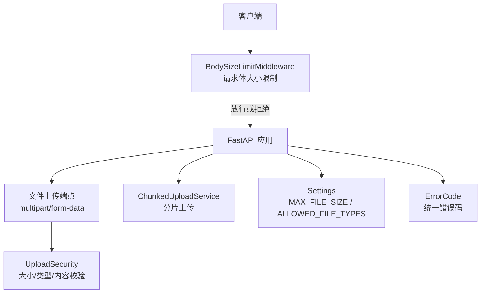
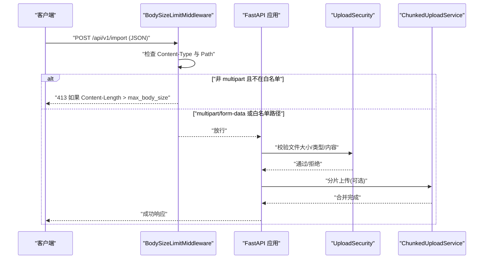
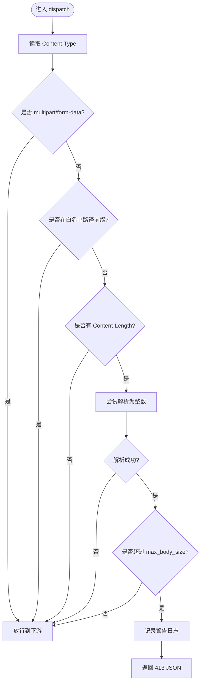
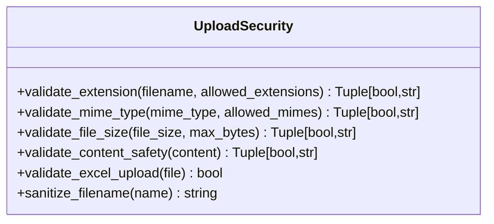
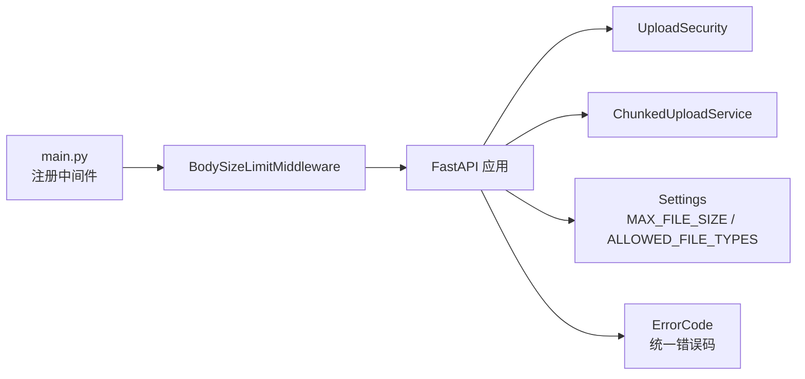

# 请求体大小限制中间件

<cite>
**本文引用的文件**
- [body_size_limit.py](file://backend/app/middleware/body_size_limit.py)
- [main.py](file://backend/app/main.py)
- [config.py](file://backend/app/core/config.py)
- [upload_security.py](file://backend/app/core/upload_security.py)
- [errors.py](file://backend/app/core/errors.py)
- [chunked_upload_service.py](file://backend/app/services/chunked_upload_service.py)
- [test_cov_final_body_size_limit.py](file://backend/tests/unit/test_cov_final_body_size_limit.py)
</cite>

## 目录
1. [简介](#简介)
2. [项目结构](#项目结构)
3. [核心组件](#核心组件)
4. [架构总览](#架构总览)
5. [详细组件分析](#详细组件分析)
6. [依赖关系分析](#依赖关系分析)
7. [性能考量与调优](#性能考量与调优)
8. [故障排查指南](#故障排查指南)
9. [结论](#结论)
10. [附录：配置与最佳实践](#附录配置与最佳实践)

## 简介
本技术文档围绕“请求体大小限制中间件”展开，聚焦大文件上传防护机制、请求体大小验证、内存使用控制与资源耗尽攻击防护。文档说明不同内容类型的处理策略（multipart/form-data、application/json等）、大小限制的配置选项与单位换算、动态调整机制、错误响应格式、日志记录与监控指标，并提供性能影响分析与调优建议以及常见问题解决方案。

## 项目结构
该功能由以下关键部分组成：
- 全局请求体大小限制中间件：拦截非文件上传的大体积 JSON/批量数据请求，防止恶意超大请求导致服务器资源耗尽。
- 应用启动注册：在 FastAPI 应用中注册中间件并设置默认上限。
- 文件上传安全校验：针对 multipart/form-data 的文件大小、类型、内容安全进行校验。
- 分片上传服务：对超大文件采用分片上传，避免单次请求体过大。
- 配置中心：集中管理文件大小限制、允许类型等配置项。
- 错误码与消息：统一错误码定义，便于前端与运维识别。

图表来源
- [body_size_limit.py:48-79](file://backend/app/middleware/body_size_limit.py#L48-L79)
- [main.py:160-162](file://backend/app/main.py#L160-L162)
- [upload_security.py:111-127](file://backend/app/core/upload_security.py#L111-L127)
- [chunked_upload_service.py:105-121](file://backend/app/services/chunked_upload_service.py#L105-L121)
- [config.py:170-176](file://backend/app/core/config.py#L170-L176)
- [errors.py:50-54](file://backend/app/core/errors.py#L50-L54)

章节来源
- [body_size_limit.py:1-79](file://backend/app/middleware/body_size_limit.py#L1-L79)
- [main.py:160-162](file://backend/app/main.py#L160-L162)
- [config.py:170-176](file://backend/app/core/config.py#L170-L176)
- [upload_security.py:111-127](file://backend/app/core/upload_security.py#L111-L127)
- [chunked_upload_service.py:105-121](file://backend/app/services/chunked_upload_service.py#L105-L121)
- [errors.py:50-54](file://backend/app/core/errors.py#L50-L54)

## 核心组件
- BodySizeLimitMiddleware：基于 Content-Length 头部进行快速判断，对非 multipart/form-data 且不在白名单路径的请求体进行大小限制；超过阈值返回 413。
- 白名单路径前缀：对可能接收大批量 JSON 的导入导出、备份恢复、批量操作等路径放宽限制，交由业务层或 MAX_FILE_SIZE 控制。
- UploadSecurity：对 multipart/form-data 的文件进行扩展名、MIME 类型、内容安全与大小校验。
- ChunkedUploadService：提供分片上传能力，避免单次请求体过大，支持会话管理与合并。
- Settings：集中管理 MAX_FILE_SIZE、ALLOWED_FILE_TYPES 等配置项。
- ErrorCode：统一错误码，如 FILE_TOO_LARGE。

章节来源
- [body_size_limit.py:20-45](file://backend/app/middleware/body_size_limit.py#L20-L45)
- [body_size_limit.py:48-79](file://backend/app/middleware/body_size_limit.py#L48-L79)
- [upload_security.py:19-42](file://backend/app/core/upload_security.py#L19-L42)
- [upload_security.py:111-127](file://backend/app/core/upload_security.py#L111-L127)
- [chunked_upload_service.py:105-121](file://backend/app/services/chunked_upload_service.py#L105-L121)
- [config.py:170-176](file://backend/app/core/config.py#L170-L176)
- [errors.py:50-54](file://backend/app/core/errors.py#L50-L54)

## 架构总览
请求进入 FastAPI 应用后，先经过 BodySizeLimitMiddleware 进行初步过滤：
- 若 Content-Type 为 multipart/form-data，直接放行，后续由 upload_security 与 chunked upload 服务处理。
- 若请求路径属于 LARGE_PAYLOAD_PATH_PREFIXES，也放行，交由业务逻辑处理。
- 其他请求检查 Content-Length，超过 max_body_size 则立即返回 413，避免读取完整请求体造成内存压力。

图表来源
- [body_size_limit.py:53-78](file://backend/app/middleware/body_size_limit.py#L53-L78)
- [upload_security.py:111-127](file://backend/app/core/upload_security.py#L111-L127)
- [chunked_upload_service.py:105-121](file://backend/app/services/chunked_upload_service.py#L105-L121)

## 详细组件分析

### BodySizeLimitMiddleware（请求体大小限制）
- 职责：在请求到达业务逻辑之前，基于 Content-Length 进行快速大小判断，阻止超大 JSON/批量数据请求。
- 策略：
  - multipart/form-data 一律放行，由 MAX_FILE_SIZE 与 upload_security 控制。
  - 特定路径前缀（导入导出、备份恢复、批量操作等）放行，交由业务层控制。
  - 其他请求若 Content-Length 超过 max_body_size，返回 413。
- 容错：Content-Length 无法解析为整数时忽略并放行，避免异常中断。
- 日志：记录被拒绝的请求方法、路径与大小，便于审计与告警。
- 错误响应：返回 JSON 格式的 413 响应，包含 detail 字段提示超限信息。

图表来源
- [body_size_limit.py:53-78](file://backend/app/middleware/body_size_limit.py#L53-L78)

章节来源
- [body_size_limit.py:20-45](file://backend/app/middleware/body_size_limit.py#L20-L45)
- [body_size_limit.py:48-79](file://backend/app/middleware/body_size_limit.py#L48-L79)
- [test_cov_final_body_size_limit.py:8-38](file://backend/tests/unit/test_cov_final_body_size_limit.py#L8-L38)

### UploadSecurity（上传安全校验）
- 职责：对 multipart/form-data 上传的文件进行扩展名、MIME 类型、内容安全与大小校验。
- 大小校验：validate_file_size 支持传入最大字节数，默认 50MB；返回布尔值与人类可读的错误消息。
- 类型校验：DEFAULT_ALLOWED_EXTENSIONS 与 DEFAULT_ALLOWED_MIME_TYPES 提供白名单；FORBIDDEN_EXTENSIONS 禁止可执行脚本等危险类型。
- 内容安全：检测常见可执行签名与脚本头，防止恶意文件上传。
- Excel 校验：validate_excel_upload 通过魔数验证真实 Excel 文件。

图表来源
- [upload_security.py:57-84](file://backend/app/core/upload_security.py#L57-L84)
- [upload_security.py:87-108](file://backend/app/core/upload_security.py#L87-L108)
- [upload_security.py:111-127](file://backend/app/core/upload_security.py#L111-L127)
- [upload_security.py:130-160](file://backend/app/core/upload_security.py#L130-L160)
- [upload_security.py:175-195](file://backend/app/core/upload_security.py#L175-L195)

章节来源
- [upload_security.py:19-42](file://backend/app/core/upload_security.py#L19-L42)
- [upload_security.py:57-84](file://backend/app/core/upload_security.py#L57-L84)
- [upload_security.py:87-108](file://backend/app/core/upload_security.py#L87-L108)
- [upload_security.py:111-127](file://backend/app/core/upload_security.py#L111-L127)
- [upload_security.py:130-160](file://backend/app/core/upload_security.py#L130-L160)
- [upload_security.py:175-195](file://backend/app/core/upload_security.py#L175-L195)

### ChunkedUploadService（分片上传服务）
- 职责：将大文件拆分为多个分片上传，降低单次请求体大小，提升稳定性与可恢复性。
- 配置：
  - 默认分片大小：5MB
  - 最小分片大小：1MB
  - 最大分片大小：20MB
  - 最大文件大小：2GB
  - 会话过期时间：24小时
- 优势：避免单次请求体过大导致的内存占用与超时问题；支持断点续传与会话状态管理。

章节来源
- [chunked_upload_service.py:24-65](file://backend/app/services/chunked_upload_service.py#L24-L65)
- [chunked_upload_service.py:105-121](file://backend/app/services/chunked_upload_service.py#L105-L121)

### 配置中心（Settings）
- 文件上传相关配置：
  - UPLOAD_DIR：上传目录
  - EXPORT_DIR：导出目录
  - MAX_FILE_SIZE：单文件最大大小（默认 50MB）
  - ALLOWED_FILE_TYPES：允许的文件扩展名列表
- 运行时路径自动修正：确保上传/导出目录为绝对路径，避免权限问题。

章节来源
- [config.py:170-176](file://backend/app/core/config.py#L170-L176)
- [config.py:331-364](file://backend/app/core/config.py#L331-L364)

### 错误码与消息（ErrorCode）
- 文件相关错误码：FILE_TOO_LARGE、FILE_TYPE_NOT_ALLOWED、FILE_UPLOAD_FAILED、FILE_CORRUPTED
- 通用错误码：BAD_REQUEST、VALIDATION_ERROR、INTERNAL_ERROR 等
- 提供 get_error_message 获取中文可读消息，便于前端展示与日志分析

章节来源
- [errors.py:50-54](file://backend/app/core/errors.py#L50-L54)
- [errors.py:90-142](file://backend/app/core/errors.py#L90-L142)
- [errors.py:145-155](file://backend/app/core/errors.py#L145-L155)

## 依赖关系分析
- BodySizeLimitMiddleware 依赖 Starlette 的 Request/Response 与 BaseHTTPMiddleware。
- 应用启动时在 main.py 中注册中间件，并传入 max_body_size=10MB。
- 文件上传流程依赖 upload_security 与 chunked_upload_service。
- 配置项来自 Settings，统一管理 MAX_FILE_SIZE 与 ALLOWED_FILE_TYPES。
- 错误码与消息来自 errors.py，用于统一响应与日志。

图表来源
- [main.py:160-162](file://backend/app/main.py#L160-L162)
- [body_size_limit.py:48-79](file://backend/app/middleware/body_size_limit.py#L48-L79)
- [upload_security.py:111-127](file://backend/app/core/upload_security.py#L111-L127)
- [chunked_upload_service.py:105-121](file://backend/app/services/chunked_upload_service.py#L105-L121)
- [config.py:170-176](file://backend/app/core/config.py#L170-L176)
- [errors.py:50-54](file://backend/app/core/errors.py#L50-L54)

章节来源
- [main.py:160-162](file://backend/app/main.py#L160-L162)
- [body_size_limit.py:48-79](file://backend/app/middleware/body_size_limit.py#L48-L79)
- [upload_security.py:111-127](file://backend/app/core/upload_security.py#L111-L127)
- [chunked_upload_service.py:105-121](file://backend/app/services/chunked_upload_service.py#L105-L121)
- [config.py:170-176](file://backend/app/core/config.py#L170-L176)
- [errors.py:50-54](file://backend/app/core/errors.py#L50-L54)

## 性能考量与调优
- 早期拒绝：BodySizeLimitMiddleware 基于 Content-Length 快速判断，避免读取完整请求体，减少内存占用与 CPU 消耗。
- 白名单路径：对导入导出、备份恢复、批量操作等路径放宽限制，避免误伤正常业务。
- 分片上传：对超大文件采用分片上传，降低单次请求体大小，提高稳定性与可恢复性。
- 配置调优：
  - 根据业务需求调整 max_body_size（默认 10MB），对于纯 JSON API 建议保持较小限制。
  - 调整 MAX_FILE_SIZE（默认 50MB）以匹配文件上传场景。
  - 合理设置 ALLOWED_FILE_TYPES，仅允许必要类型，降低安全风险。
- 监控与日志：
  - 记录被拒绝的请求方法与路径，便于审计与告警。
  - 结合系统监控指标（CPU、内存、网络 I/O）评估限流效果。

[本节为通用指导，不直接分析具体文件]

## 故障排查指南
- 非法 Content-Length：当 Content-Length 无法解析为整数时，中间件会忽略并放行，不会中断请求。测试用例覆盖了此行为。
- 413 响应：当非 multipart/form-data 且不在白名单路径的请求体超过 max_body_size，返回 413 JSON 响应，detail 字段提示超限信息。
- 文件过大：upload_security.validate_file_size 返回错误消息，包含实际大小与最大允许大小，便于前端展示。
- 类型不允许：当文件扩展名或 MIME 类型不在白名单或被禁止时，返回相应错误消息。
- 内容不安全：检测到可执行签名或脚本头时，拒绝上传并返回错误消息。

章节来源
- [test_cov_final_body_size_limit.py:8-38](file://backend/tests/unit/test_cov_final_body_size_limit.py#L8-L38)
- [body_size_limit.py:63-76](file://backend/app/middleware/body_size_limit.py#L63-L76)
- [upload_security.py:111-127](file://backend/app/core/upload_security.py#L111-L127)
- [upload_security.py:57-84](file://backend/app/core/upload_security.py#L57-L84)
- [upload_security.py:130-160](file://backend/app/core/upload_security.py#L130-L160)

## 结论
BodySizeLimitMiddleware 提供了轻量而高效的请求体大小限制能力，结合白名单路径与分片上传服务，有效防护超大 JSON/批量数据与恶意大文件上传。通过统一的错误码与日志记录，便于运维监控与故障定位。建议根据业务需求合理配置 max_body_size 与 MAX_FILE_SIZE，并结合监控指标持续优化。

[本节为总结，不直接分析具体文件]

## 附录：配置与最佳实践
- 配置项
  - max_body_size：BodySizeLimitMiddleware 的默认值为 10MB，可在 main.py 中调整。
  - MAX_FILE_SIZE：Settings 中的默认值为 50MB，适用于文件上传。
  - ALLOWED_FILE_TYPES：默认允许 xlsx、xls、csv、pdf、图片、文档等类型。
- 单位转换
  - 代码中使用字节为单位，例如 10 * 1024 * 1024 = 10MB，50 * 1024 * 1024 = 50MB。
  - 错误消息中会将字节转换为 MB 显示，便于用户理解。
- 动态调整
  - 可通过环境变量或 .env 文件修改 Settings 中的 MAX_FILE_SIZE 与 ALLOWED_FILE_TYPES。
  - 对于特殊业务路径，可通过调整 LARGE_PAYLOAD_PATH_PREFIXES 白名单实现差异化限制。
- 最佳实践
  - 对纯 JSON API 保持较小的 max_body_size，防止恶意请求。
  - 对文件上传使用分片上传，避免单次请求体过大。
  - 严格限制 ALLOWED_FILE_TYPES，仅允许必要类型。
  - 结合日志与监控，及时发现异常请求与资源消耗。

章节来源
- [main.py:160-162](file://backend/app/main.py#L160-L162)
- [config.py:170-176](file://backend/app/core/config.py#L170-L176)
- [body_size_limit.py:20-45](file://backend/app/middleware/body_size_limit.py#L20-L45)
- [upload_security.py:111-127](file://backend/app/core/upload_security.py#L111-L127)
- [chunked_upload_service.py:105-121](file://backend/app/services/chunked_upload_service.py#L105-L121)