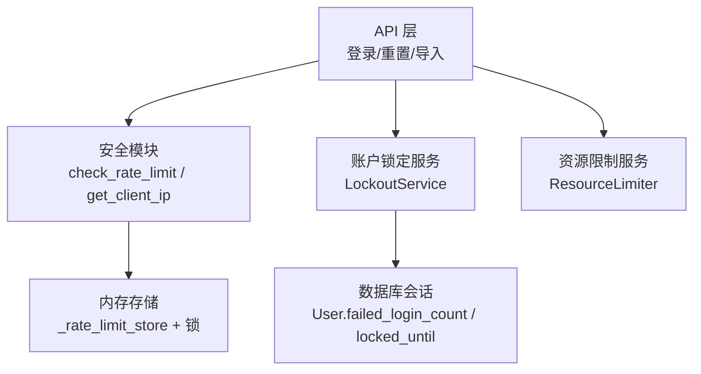
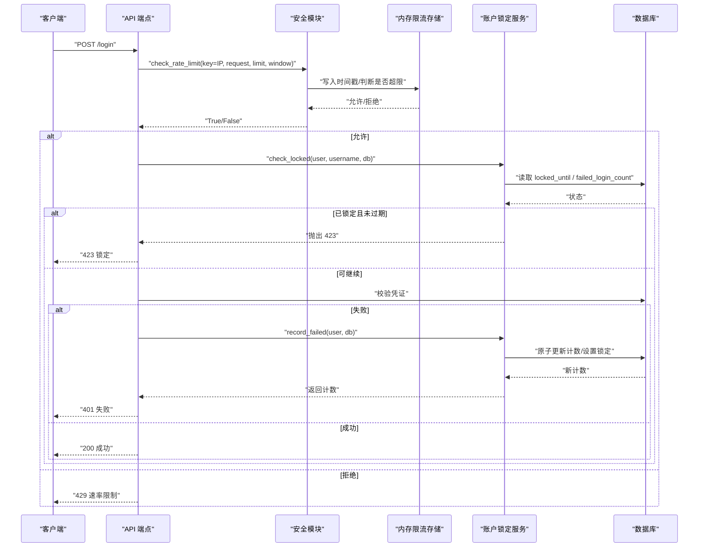
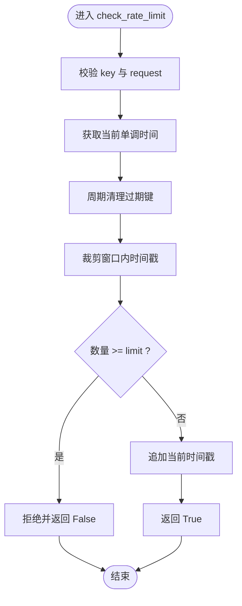
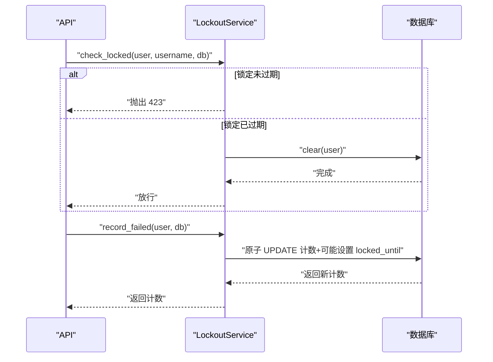
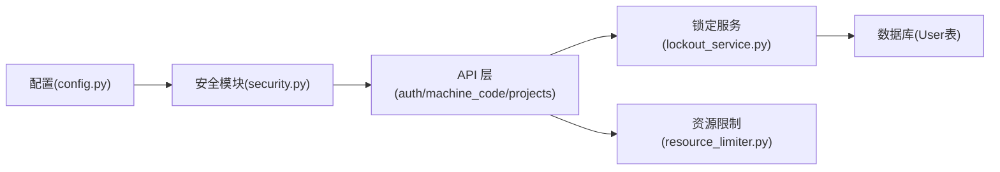

# 速率限制中间件

<cite>
**本文引用的文件**
- [security.py](file://backend/app/core/security.py)
- [config.py](file://backend/app/core/config.py)
- [lockout_service.py](file://backend/app/services/lockout_service.py)
- [auth.py](file://backend/app/api/v1/auth/auth.py)
- [machine_code.py](file://backend/app/api/v1/machine_code.py)
- [projects.py](file://backend/app/api/v1/projects.py)
- [resource_limiter.py](file://backend/app/services/resource_limiter.py)
</cite>

## 目录
1. [简介](#简介)
2. [项目结构](#项目结构)
3. [核心组件](#核心组件)
4. [架构总览](#架构总览)
5. [详细组件分析](#详细组件分析)
6. [依赖关系分析](#依赖关系分析)
7. [性能考量](#性能考量)
8. [故障排查指南](#故障排查指南)
9. [结论](#结论)
10. [附录](#附录)

## 简介
本技术文档围绕“速率限制中间件”展开，系统阐述请求频率控制机制与暴力破解防护策略。内容涵盖：
- 基于 IP 的限流算法（滑动窗口计数器）
- 登录失败次数限制、账户锁定策略与解锁流程
- 全局、端点特定、用户级别的限流配置与使用方式
- 限流统计信息的收集与分析要点
- 自定义限流规则与动态调整接口建议
- 最佳实践、性能影响评估与故障排查指引

## 项目结构
本项目将速率限制能力集中在安全模块中，并通过 API 层在关键路径（如登录、密码重置、导入等）调用；同时提供独立的资源限制服务用于更通用的配额管理。

**图示来源**
- [security.py:414-488](file://backend/app/core/security.py#L414-L488)
- [lockout_service.py:25-159](file://backend/app/services/lockout_service.py#L25-L159)
- [resource_limiter.py:14-67](file://backend/app/services/resource_limiter.py#L14-L67)

**章节来源**
- [security.py:414-488](file://backend/app/core/security.py#L414-L488)
- [config.py:126-159](file://backend/app/core/config.py#L126-L159)

## 核心组件
- 内置速率限制器（滑动窗口）
  - 通过 check_rate_limit(key, request, limit, window) 实现按 key 的滑动窗口计数，默认 60 次/分钟。
  - 使用线程锁保护共享内存存储，周期性清理过期键防止内存泄漏。
- 客户端 IP 提取
  - get_client_ip(request) 默认信任 TCP 对端地址，仅在 TRUST_PROXY_HEADERS=True 时读取代理头，避免伪造绕过。
- 账户锁定服务
  - LockoutService 提供检查锁定、原子递增失败计数、自动清理过期锁定、批量解锁等功能。
- 资源限制服务
  - ResourceLimiter 提供通用配额管理与使用统计，便于扩展不同维度的限流策略。

**章节来源**
- [security.py:414-516](file://backend/app/core/security.py#L414-L516)
- [lockout_service.py:25-219](file://backend/app/services/lockout_service.py#L25-L219)
- [resource_limiter.py:14-67](file://backend/app/services/resource_limiter.py#L14-L67)

## 架构总览
下图展示了从请求进入 API 到触发限流与账户锁定的整体流程。

**图示来源**
- [security.py:439-488](file://backend/app/core/security.py#L439-L488)
- [lockout_service.py:46-159](file://backend/app/services/lockout_service.py#L46-L159)
- [auth.py:24-126](file://backend/app/api/v1/auth/auth.py#L24-L126)

## 详细组件分析

### 基于 IP 的滑动窗口限流（check_rate_limit）
- 算法说明
  - 以 key（通常为 IP）为维度，维护一个时间戳列表。
  - 每次请求在当前时间窗口内过滤掉过期的时间戳，若数量达到 limit 则拒绝。
  - 支持周期性清理所有过期键，降低内存占用。
- 安全约定
  - key 必须为非空字符串，request 必须传入，否则抛异常 fail-closed。
  - 默认不信任代理头，避免伪造 X-Forwarded-For/X-Real-IP 绕过。
- 典型用法
  - 登录、刷新令牌、密码重置、数据导入等敏感操作均调用该函数进行限流。

**图示来源**
- [security.py:439-488](file://backend/app/core/security.py#L439-L488)

**章节来源**
- [security.py:414-516](file://backend/app/core/security.py#L414-L516)

### 账户锁定与暴力破解防护（LockoutService）
- 功能要点
  - check_locked：若账户仍在锁定期内，返回 423；若已过期则自动清理。
  - record_failed：原子递增失败计数，达到阈值时设置 locked_until。
  - clear/unlock_expired：清除锁定或批量解锁过期账户（含 admin 强制解锁）。
- 配置来源
  - max_failed_attempts 与 lockout_minutes 默认来自配置项 MAX_FAILED_LOGIN_ATTEMPTS 与 ACCOUNT_LOCKOUT_MINUTES。
- 集成位置
  - 登录、刷新令牌等认证流程在失败时调用记录失败次数，并在后续尝试前检查锁定状态。

**图示来源**
- [lockout_service.py:46-159](file://backend/app/services/lockout_service.py#L46-L159)

**章节来源**
- [lockout_service.py:25-219](file://backend/app/services/lockout_service.py#L25-L219)
- [config.py:126-134](file://backend/app/core/config.py#L126-L134)

### 端点级限流与用户级别限流
- 端点级限流
  - 登录、刷新令牌、密码重置、管理员恢复等端点均调用 check_rate_limit，并以 IP 作为 key。
  - 部分端点使用更严格的 limit/window 组合（例如 5 次/分钟）。
- 用户级别限流
  - 数据导入等高风险操作使用 user_id 作为 key，限制单位时间内单个用户的请求数。
- 配置项
  - 全局开关 RATE_LIMIT_ENABLED 与默认限制 RATE_LIMIT_PER_MINUTE/RATE_LIMIT_PER_HOUR 提供基础配置入口。
  - 各端点可在调用处覆盖 limit/window，实现细粒度控制。

**章节来源**
- [auth.py:24-126](file://backend/app/api/v1/auth/auth.py#L24-L126)
- [machine_code.py:21-416](file://backend/app/api/v1/machine_code.py#L21-L416)
- [projects.py:37-1731](file://backend/app/api/v1/projects.py#L37-L1731)
- [config.py:156-159](file://backend/app/core/config.py#L156-L159)

### 资源限制服务（ResourceLimiter）
- 用途
  - 提供通用的配额管理与使用统计，便于在不同场景下扩展限流策略。
- 数据结构
  - RateLimit：定义请求数与窗口。
  - ResourceQuota：定义最大请求数、周期与当前用量。
  - UsageStats：记录总请求、允许与拒绝数量及最近重置时间。
- 监控
  - 提供 start_monitoring/stop_monitoring 兼容接口，便于未来接入指标采集。

**章节来源**
- [resource_limiter.py:14-67](file://backend/app/services/resource_limiter.py#L14-L67)

## 依赖关系分析
- 安全模块依赖
  - 配置模块：读取 TRUST_PROXY_HEADERS、RATE_LIMIT_*、MAX_FAILED_LOGIN_ATTEMPTS、ACCOUNT_LOCKOUT_MINUTES 等。
  - 事务工具：safe_commit 用于锁定服务的持久化提交。
- API 层依赖
  - 认证与安全：get_current_user、PasswordPolicy、check_rate_limit、get_client_ip。
  - 锁定服务：LockoutService 统一处理账户锁定逻辑。
- 存储与并发
  - 内存字典 + 线程锁保证并发安全。
  - 数据库会话用于持久化失败计数与锁定时间。

**图示来源**
- [config.py:126-159](file://backend/app/core/config.py#L126-L159)
- [security.py:414-516](file://backend/app/core/security.py#L414-L516)
- [lockout_service.py:25-219](file://backend/app/services/lockout_service.py#L25-L219)
- [auth.py:24-126](file://backend/app/api/v1/auth/auth.py#L24-L126)
- [machine_code.py:21-416](file://backend/app/api/v1/machine_code.py#L21-L416)
- [projects.py:37-1731](file://backend/app/api/v1/projects.py#L37-L1731)
- [resource_limiter.py:14-67](file://backend/app/services/resource_limiter.py#L14-L67)

**章节来源**
- [config.py:126-159](file://backend/app/core/config.py#L126-L159)
- [security.py:414-516](file://backend/app/core/security.py#L414-L516)
- [lockout_service.py:25-219](file://backend/app/services/lockout_service.py#L25-L219)
- [auth.py:24-126](file://backend/app/api/v1/auth/auth.py#L24-L126)
- [machine_code.py:21-416](file://backend/app/api/v1/machine_code.py#L21-L416)
- [projects.py:37-1731](file://backend/app/api/v1/projects.py#L37-L1731)
- [resource_limiter.py:14-67](file://backend/app/services/resource_limiter.py#L14-L67)

## 性能考量
- 内存占用
  - 每个 key 维护时间戳列表，需关注高基数 key 带来的内存增长；已通过周期性清理过期键缓解。
- 并发安全
  - 使用线程锁保护共享存储，避免竞态条件；在高并发下注意锁竞争开销。
- I/O 成本
  - 账户锁定涉及数据库写操作，应确保索引合理与事务高效。
- 可扩展性
  - 当前为进程内内存存储，多实例部署时需考虑分布式限流方案（如 Redis），但离线单机版无需外部依赖。

[本节为通用指导，不直接分析具体文件]

## 故障排查指南
- 常见问题
  - 误判为被限流：检查 key 是否正确（IP 是否可信、代理头是否误用）、limit/window 是否过小。
  - 账户频繁锁定：确认登录失败是否真实发生，检查 MAX_FAILED_LOGIN_ATTEMPTS 与 ACCOUNT_LOCKOUT_MINUTES 配置。
  - 启动后仍锁定：使用 unlock_expired 批量解锁过期账户，admin 会强制解锁。
- 定位步骤
  - 查看日志中的速率限制清理与锁定相关条目。
  - 核对 API 端点调用 check_rate_limit 的参数与返回值。
  - 验证数据库 User 表的 failed_login_count 与 locked_until 字段变化。
- 快速修复
  - 临时放宽 limit/window 或关闭 RATE_LIMIT_ENABLED（仅调试环境）。
  - 手动清理锁定状态或等待过期。

**章节来源**
- [security.py:414-516](file://backend/app/core/security.py#L414-L516)
- [lockout_service.py:46-219](file://backend/app/services/lockout_service.py#L46-L219)
- [config.py:126-159](file://backend/app/core/config.py#L126-L159)

## 结论
本项目实现了以滑动窗口为核心的内存级速率限制，并结合账户锁定服务提供完善的暴力破解防护。通过配置项与端点级参数，可实现全局、端点特定与用户级别的灵活限流。建议在多实例部署时引入分布式限流存储，并持续完善限流统计与告警能力，以提升系统的可观测性与稳定性。

[本节为总结性内容，不直接分析具体文件]

## 附录

### 配置选项速览
- 全局开关与默认限制
  - RATE_LIMIT_ENABLED：是否启用速率限制
  - RATE_LIMIT_PER_MINUTE：每分钟默认限制
  - RATE_LIMIT_PER_HOUR：每小时默认限制
- 安全与锁定
  - MAX_FAILED_LOGIN_ATTEMPTS：最大登录失败次数
  - ACCOUNT_LOCKOUT_MINUTES：账户锁定时长（分钟）
  - TRUST_PROXY_HEADERS：是否信任代理头（默认关闭）

**章节来源**
- [config.py:126-159](file://backend/app/core/config.py#L126-L159)

### 自定义限流规则与动态调整接口建议
- 自定义规则
  - 在 API 端点调用 check_rate_limit 时传入自定义 key、limit、window，实现端点特定策略。
  - 使用 ResourceLimiter 的 set_quota/is_allowed/get_usage_stats 构建更复杂的配额模型。
- 动态调整
  - 可通过配置中心或运行时配置热更新 RATE_LIMIT_* 与锁定策略，重启或重新加载配置后生效。
  - 对于多实例部署，建议将限流状态迁移至集中式存储（如 Redis），并提供管理接口动态调整策略。

**章节来源**
- [resource_limiter.py:14-67](file://backend/app/services/resource_limiter.py#L14-L67)
- [config.py:156-159](file://backend/app/core/config.py#L156-L159)

### 限流统计信息收集与分析
- 当前实现
  - 内置限流器未暴露统计接口；ResourceLimiter 提供 UsageStats（总请求、允许、拒绝、最近重置时间）。
- 建议扩展
  - 在 check_rate_limit 中累计 allowed/denied 计数，并暴露查询接口。
  - 结合 MetricsMiddleware 或独立指标服务，输出请求计数、拒绝原因、性能指标（延迟分布、锁等待等）。

**章节来源**
- [resource_limiter.py:14-67](file://backend/app/services/resource_limiter.py#L14-L67)