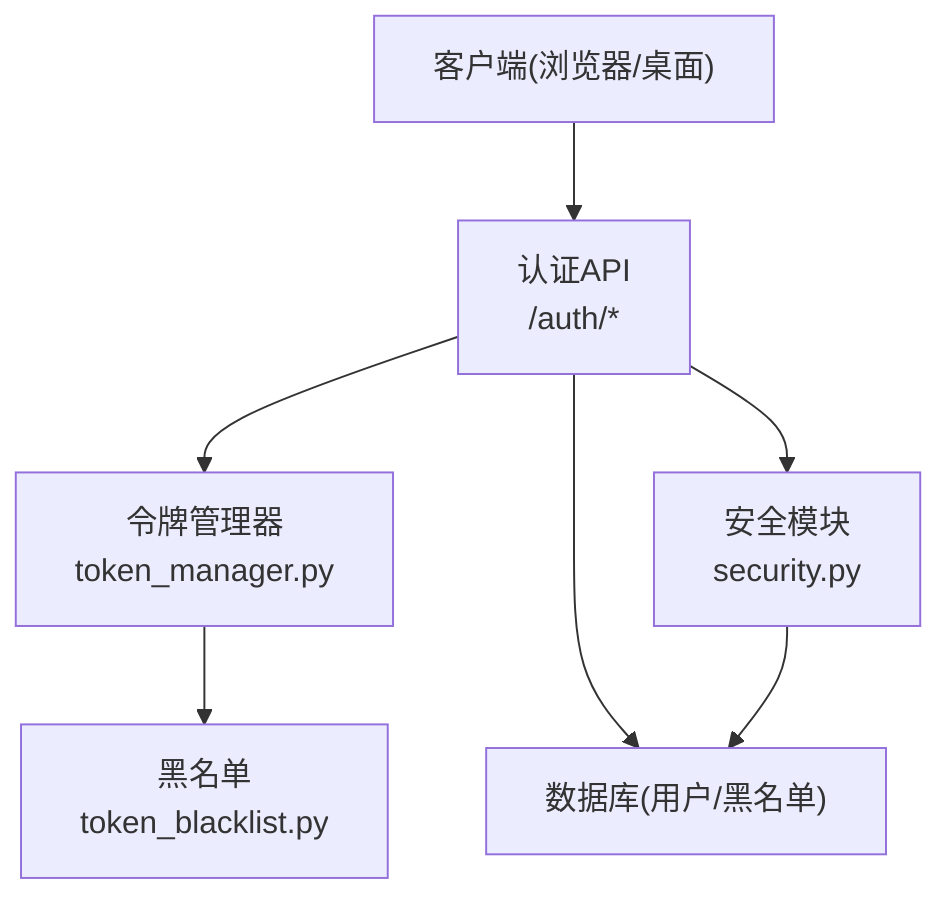
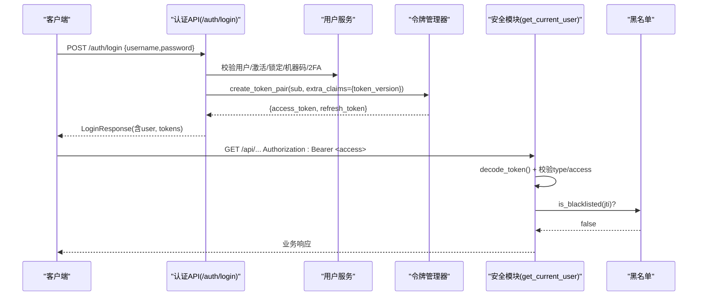
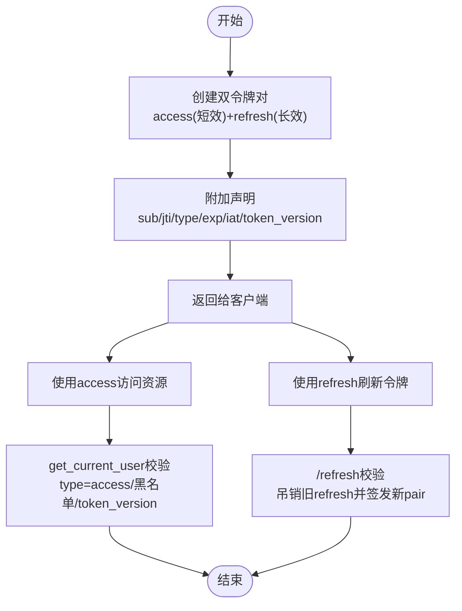
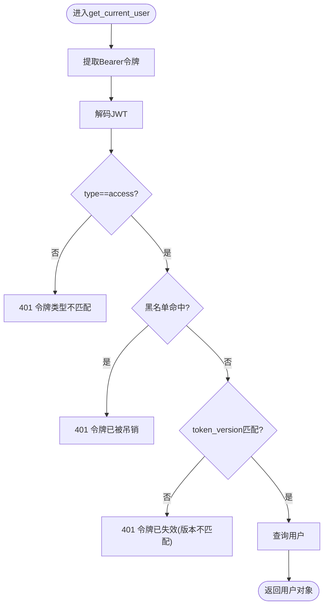
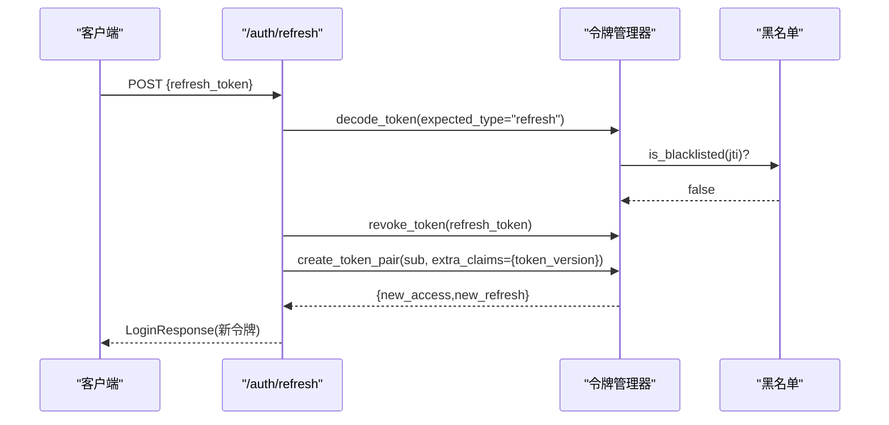
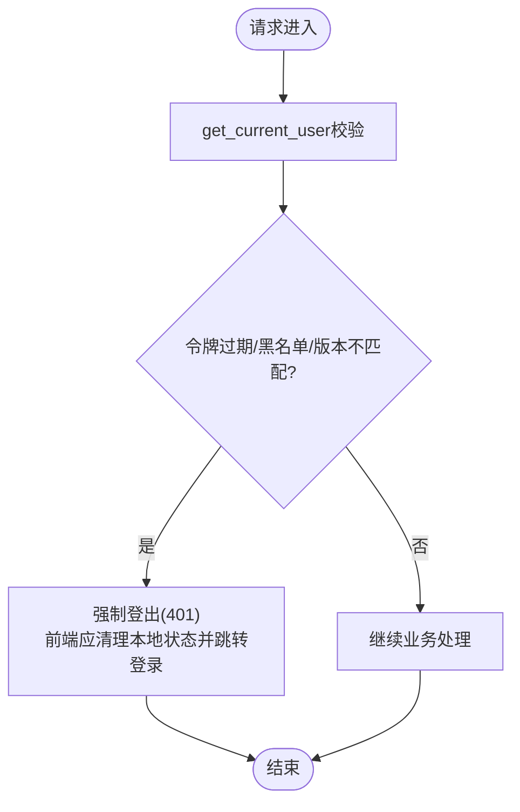
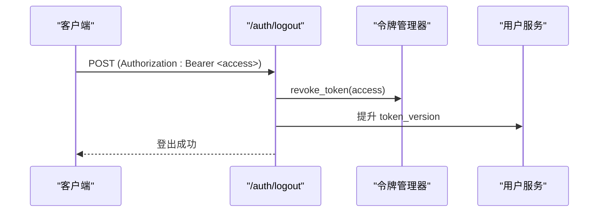
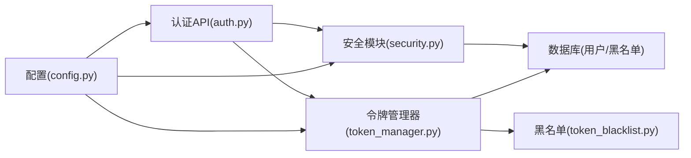

# 会话管理

<cite>
**本文引用的文件**
- [backend/app/core/security.py](file://backend/app/core/security.py)
- [backend/app/core/token_manager.py](file://backend/app/core/token_manager.py)
- [backend/app/core/token_blacklist.py](file://backend/app/core/token_blacklist.py)
- [backend/app/api/v1/auth/auth.py](file://backend/app/api/v1/auth/auth.py)
- [backend/app/schemas/auth.py](file://backend/app/schemas/auth.py)
- [backend/app/core/config.py](file://backend/app/core/config.py)
</cite>

## 目录
1. [简介](#简介)
2. [项目结构](#项目结构)
3. [核心组件](#核心组件)
4. [架构总览](#架构总览)
5. [详细组件分析](#详细组件分析)
6. [依赖关系分析](#依赖关系分析)
7. [性能考虑](#性能考虑)
8. [故障排查指南](#故障排查指南)
9. [结论](#结论)
10. [附录：API 使用示例](#附录api-使用示例)

## 简介
本技术文档聚焦于“用户会话管理”能力，围绕 JWT 访问令牌与刷新令牌的生成、验证、刷新与吊销机制展开，覆盖以下主题：
- 令牌生命周期：访问令牌（短效）与刷新令牌（长效）的签发与过期策略
- 会话超时与自动登出：基于令牌过期、黑名单与 token_version 的版本化强制下线
- 并发与会话控制：多设备/多标签页下的会话一致性、刷新轮换与批量失效
- 令牌吊销：主动登出、批量吊销与安全策略
- API 使用示例：登录获取令牌、刷新令牌、登出与吊销操作
- 前后端同步与异常处理：前端如何处理 401/403、何时触发刷新或跳转登录

## 项目结构
后端采用分层设计：
- 安全与认证：security.py 提供密码哈希、JWT 基础工具、FastAPI 依赖；token_manager.py 封装令牌创建/校验/吊销/刷新；token_blacklist.py 维护内存+数据库持久化的黑名单
- 认证 API：auth.py 暴露 /login、/refresh、/logout、/me、/csrf-token 等接口
- 数据模型与配置：config.py 集中管理令牌有效期、锁定策略、CORS/CSRF 等；schemas/auth.py 定义请求/响应结构

**图表来源**
- [backend/app/api/v1/auth/auth.py:101-287](file://backend/app/api/v1/auth/auth.py#L101-L287)
- [backend/app/core/token_manager.py:64-127](file://backend/app/core/token_manager.py#L64-L127)
- [backend/app/core/security.py:210-336](file://backend/app/core/security.py#L210-L336)
- [backend/app/core/token_blacklist.py:27-70](file://backend/app/core/token_blacklist.py#L27-L70)

**章节来源**
- [backend/app/api/v1/auth/auth.py:101-287](file://backend/app/api/v1/auth/auth.py#L101-L287)
- [backend/app/core/token_manager.py:64-127](file://backend/app/core/token_manager.py#L64-L127)
- [backend/app/core/security.py:210-336](file://backend/app/core/security.py#L210-L336)
- [backend/app/core/token_blacklist.py:27-70](file://backend/app/core/token_blacklist.py#L27-L70)

## 核心组件
- 令牌管理器（TokenManager）
  - 统一创建 access + refresh 双令牌对，注入 jti、type、exp、iat 及可选 extra_claims（如 token_version）
  - 校验时检查黑名单与类型匹配；吊销时将 jti 加入内存黑名单并尝试持久化到数据库
  - 刷新流程中吊销旧 refresh_token 并签发新 pair（轮换防重放）
- 安全模块（Security）
  - 提供 get_current_user FastAPI 依赖：解析 Bearer、解码 JWT、校验 type=access、查黑名单、校验 token_version、查询用户并设置审计上下文
  - 提供密码哈希/校验、速率限制、IP 提取、安全头中间件等
- 黑名单（Blacklist）
  - 内存集合存储已吊销 JTI，带 TTL 清理；支持从数据库加载未过期条目
  - 启动时可加载历史吊销记录，保证重启后仍有效
- 认证 API（Auth）
  - /login：校验凭据、机器码、2FA（可选），返回 access_token + refresh_token
  - /refresh：仅接受 refresh_token，校验后吊销旧 token 并签发新 pair
  - /logout：吊销当前请求携带的 access/refresh，并提升 token_version 使该用户所有现存令牌立即失效
  - /me：获取当前用户信息
  - /csrf-token：获取 CSRF token（用于状态变更请求）

**章节来源**
- [backend/app/core/token_manager.py:64-283](file://backend/app/core/token_manager.py#L64-L283)
- [backend/app/core/security.py:210-336](file://backend/app/core/security.py#L210-L336)
- [backend/app/core/token_blacklist.py:27-163](file://backend/app/core/token_blacklist.py#L27-L163)
- [backend/app/api/v1/auth/auth.py:101-747](file://backend/app/api/v1/auth/auth.py#L101-L747)

## 架构总览
下图展示一次典型登录到资源访问的完整调用链，包括 2FA、令牌签发、鉴权与黑名单校验。

**图表来源**
- [backend/app/api/v1/auth/auth.py:101-287](file://backend/app/api/v1/auth/auth.py#L101-L287)
- [backend/app/core/token_manager.py:64-127](file://backend/app/core/token_manager.py#L64-L127)
- [backend/app/core/security.py:243-336](file://backend/app/core/security.py#L243-L336)
- [backend/app/core/token_blacklist.py:60-70](file://backend/app/core/token_blacklist.py#L60-L70)

## 详细组件分析

### 令牌生成与生命周期
- 访问令牌（access_token）
  - 短时效：默认 480 分钟（可配置），包含 sub、jti、type=access、iat、exp，以及可选 token_version
  - 用途：访问受保护资源，每次请求由 get_current_user 校验
- 刷新令牌（refresh_token）
  - 长时效：默认 30 天（可配置），包含 sub、jti、type=refresh、iat、exp
  - 用途：换取新的 access_token；每次刷新会吊销旧 refresh_token（轮换）
- 版本化强制下线（token_version）
  - 登录/刷新时在令牌中写入 user.token_version_safe
  - 登出或管理员操作可递增该版本，导致旧令牌因版本不匹配被拒绝

**图表来源**
- [backend/app/core/token_manager.py:64-127](file://backend/app/core/token_manager.py#L64-L127)
- [backend/app/core/security.py:243-336](file://backend/app/core/security.py#L243-L336)
- [backend/app/api/v1/auth/auth.py:594-689](file://backend/app/api/v1/auth/auth.py#L594-L689)

**章节来源**
- [backend/app/core/token_manager.py:64-127](file://backend/app/core/token_manager.py#L64-L127)
- [backend/app/core/security.py:243-336](file://backend/app/core/security.py#L243-L336)
- [backend/app/api/v1/auth/auth.py:594-689](file://backend/app/api/v1/auth/auth.py#L594-L689)

### 令牌验证与鉴权
- get_current_user 依赖
  - 从 Authorization: Bearer 提取令牌
  - 解码并校验 type=access、黑名单、token_version
  - 查询用户并设置审计上下文（ContextVar）
- 失败场景
  - 无凭证/无效/过期 → 401
  - 类型不匹配 → 401
  - 黑名单命中 → 401
  - 用户不存在/禁用 → 401/403

**图表来源**
- [backend/app/core/security.py:243-336](file://backend/app/core/security.py#L243-L336)

**章节来源**
- [backend/app/core/security.py:243-336](file://backend/app/core/security.py#L243-L336)

### 刷新令牌与轮换
- /refresh 仅接受 refresh_token
- 校验成功后吊销旧 refresh_token（防止重放）
- 签发新的 access + refresh 对，并携带最新 token_version
- 速率限制：同一 IP 每分钟最多 10 次

**图表来源**
- [backend/app/api/v1/auth/auth.py:594-689](file://backend/app/api/v1/auth/auth.py#L594-L689)
- [backend/app/core/token_manager.py:176-240](file://backend/app/core/token_manager.py#L176-L240)

**章节来源**
- [backend/app/api/v1/auth/auth.py:594-689](file://backend/app/api/v1/auth/auth.py#L594-L689)
- [backend/app/core/token_manager.py:176-240](file://backend/app/core/token_manager.py#L176-L240)

### 会话超时与自动登出
- 访问令牌过期：客户端收到 401 后应触发刷新或跳转登录
- 刷新令牌过期：需重新登录
- 黑名单命中：任何令牌（含未过期）立即失效
- token_version 升级：登出或管理员操作后，旧令牌即使未过期也会因版本不匹配被拒绝
- 账户锁定：连续失败达到阈值将锁定一段时间，期间无法登录/刷新

**图表来源**
- [backend/app/core/security.py:243-336](file://backend/app/core/security.py#L243-L336)
- [backend/app/api/v1/auth/auth.py:101-287](file://backend/app/api/v1/auth/auth.py#L101-L287)

**章节来源**
- [backend/app/core/security.py:243-336](file://backend/app/core/security.py#L243-L336)
- [backend/app/api/v1/auth/auth.py:101-287](file://backend/app/api/v1/auth/auth.py#L101-L287)

### 并发与会话控制
- 多设备/多标签页：每个会话拥有独立 access/refresh 对，互不影响
- 刷新轮换：每次刷新都会吊销旧 refresh_token，避免重放攻击
- 批量失效：登出或管理员操作提升 token_version，使该用户所有现存令牌立即失效
- 并发安全：黑名单内存结构加锁，防止并发下读取不一致

**章节来源**
- [backend/app/core/token_blacklist.py:27-70](file://backend/app/core/token_blacklist.py#L27-L70)
- [backend/app/api/v1/auth/auth.py:570-591](file://backend/app/api/v1/auth/auth.py#L570-L591)

### 令牌吊销机制
- 主动登出（/logout）
  - 吊销本次请求携带的 access_token（以及可选 refresh_token）
  - 提升用户 token_version，使该用户其他会话/令牌立即失效
  - 记录审计日志
- 批量吊销
  - 通过提升 token_version 实现“一键下线全部会话”
  - 也可通过黑名单直接加入特定 jti（例如检测到泄露）
- 安全策略
  - 刷新时吊销旧 refresh_token（轮换）
  - 登录/刷新均受速率限制与账户锁定保护

**图表来源**
- [backend/app/api/v1/auth/auth.py:570-591](file://backend/app/api/v1/auth/auth.py#L570-L591)
- [backend/app/core/token_manager.py:176-210](file://backend/app/core/token_manager.py#L176-L210)

**章节来源**
- [backend/app/api/v1/auth/auth.py:570-591](file://backend/app/api/v1/auth/auth.py#L570-L591)
- [backend/app/core/token_manager.py:176-210](file://backend/app/core/token_manager.py#L176-L210)

### 前后端会话状态同步与异常处理
- 前端最佳实践
  - 登录成功后保存 access_token 与 refresh_token（建议内存存储）
  - 每次请求在 Authorization 头携带 access_token
  - 遇到 401：
    - 若 access 过期但 refresh 有效：调用 /auth/refresh 刷新并重试
    - 若 refresh 也过期或不可用：跳转登录页并清理本地状态
  - 登出后：调用 /auth/logout 并清理本地令牌
- 后端异常处理
  - 401：未认证/无效/过期/黑名单/版本不匹配
  - 403：账户禁用/权限不足
  - 429：速率限制（登录/注册/刷新/CSRF）
  - 审计：登录/登出/错误均记录审计日志

**章节来源**
- [backend/app/api/v1/auth/auth.py:101-287](file://backend/app/api/v1/auth/auth.py#L101-L287)
- [backend/app/api/v1/auth/auth.py:594-689](file://backend/app/api/v1/auth/auth.py#L594-L689)
- [backend/app/api/v1/auth/auth.py:570-591](file://backend/app/api/v1/auth/auth.py#L570-L591)

## 依赖关系分析
- 认证 API 依赖安全模块与令牌管理器
- 令牌管理器依赖黑名单模块进行吊销与校验
- 安全模块在鉴权时调用黑名单与数据库查询用户
- 配置模块提供令牌有效期、锁定策略、CORS/CSRF 等全局参数

**图表来源**
- [backend/app/api/v1/auth/auth.py:101-287](file://backend/app/api/v1/auth/auth.py#L101-L287)
- [backend/app/core/security.py:210-336](file://backend/app/core/security.py#L210-L336)
- [backend/app/core/token_manager.py:64-283](file://backend/app/core/token_manager.py#L64-L283)
- [backend/app/core/config.py:126-159](file://backend/app/core/config.py#L126-L159)

**章节来源**
- [backend/app/api/v1/auth/auth.py:101-287](file://backend/app/api/v1/auth/auth.py#L101-L287)
- [backend/app/core/security.py:210-336](file://backend/app/core/security.py#L210-L336)
- [backend/app/core/token_manager.py:64-283](file://backend/app/core/token_manager.py#L64-L283)
- [backend/app/core/config.py:126-159](file://backend/app/core/config.py#L126-L159)

## 性能考虑
- 令牌校验路径尽量轻量：decode + 黑名单查找 + 用户查询
- 黑名单内存结构 O(1) 查找，定期清理过期条目
- 刷新接口限流，防止重放与滥用
- token_version 提升为 O(1) 写操作，影响面大但开销小
- 建议：
  - 合理设置 ACCESS_TOKEN_EXPIRE_MINUTES 与 REFRESH_TOKEN_EXPIRE_DAYS
  - 在高并发场景关注数据库连接池与慢查询阈值
  - 监控黑名单大小与清理频率

[本节为通用指导，无需具体文件引用]

## 故障排查指南
- 常见 401 原因
  - 令牌过期：检查 exp 与系统时间
  - 黑名单命中：检查是否已登出或被管理员吊销
  - 版本不匹配：检查 token_version 是否与用户最新一致
  - 类型不匹配：确保 access 用于资源访问，refresh 仅用于刷新
- 常见 403 原因
  - 账户禁用：检查 is_active
  - 权限不足：检查角色与菜单权限
- 常见 429 原因
  - 速率限制：登录/注册/刷新/CSRF 请求过于频繁
- 排查步骤
  - 查看服务端日志中的 JWT 解码失败、黑名单命中、版本不匹配等提示
  - 检查 /auth/me 是否能正常返回当前用户
  - 确认 /auth/refresh 是否成功且返回新令牌
  - 检查黑名单表是否有大量条目

**章节来源**
- [backend/app/core/security.py:243-336](file://backend/app/core/security.py#L243-L336)
- [backend/app/core/token_blacklist.py:60-114](file://backend/app/core/token_blacklist.py#L60-L114)
- [backend/app/api/v1/auth/auth.py:101-287](file://backend/app/api/v1/auth/auth.py#L101-L287)

## 结论
本系统的会话管理以 JWT 为核心，结合黑名单与 token_version 实现了强一致的会话控制：
- 短效 access 保障资源访问安全
- 长效 refresh 提供无感续期，并通过轮换防止重放
- 黑名单与版本化机制确保登出/强制下线即时生效
- 速率限制与账户锁定增强抗暴力破解能力
- 审计日志贯穿登录/登出/错误，便于追踪与合规

[本节为总结性内容，无需具体文件引用]

## 附录：API 使用示例
以下为常用会话管理接口的说明与示例（以 JSON 形式描述请求/响应关键部分）：

- 登录
  - 方法：POST /api/v1/auth/login
  - 请求体：{ username, password }
  - 响应：{ code, data: { access_token, token_type, user }, refresh_token, message, must_change_password, two_factor_required, temp_token }
  - 说明：若启用 2FA，先返回 temp_token，再调用 /auth/two-factor/verify-login 换取正式令牌

- 刷新令牌
  - 方法：POST /api/v1/auth/refresh
  - 请求体：{ token: "<refresh_token>" }
  - 响应：{ code, data: { access_token, token_type, user }, refresh_token, message }
  - 说明：旧 refresh_token 会被吊销，返回新的 access + refresh 对

- 登出
  - 方法：POST /api/v1/auth/logout
  - 请求头：Authorization: Bearer <access_token>
  - 可选请求体：{ refresh_token: "<refresh_token>" }
  - 响应：{ code, message }
  - 说明：吊销当前 access（及可选 refresh），并提升 token_version 使该用户其他会话立即失效

- 获取当前用户
  - 方法：GET /api/v1/auth/me
  - 请求头：Authorization: Bearer <access_token>
  - 响应：{ code, data: { id, username, email, name, role, ... }, message }

- 获取 CSRF Token
  - 方法：GET /api/v1/auth/csrf-token
  - 响应：{ code, data: { csrf_token, csrf_signed_token }, message }
  - 说明：后续状态变更请求需在 X-CSRF-Token 头携带原始 token

**章节来源**
- [backend/app/api/v1/auth/auth.py:101-287](file://backend/app/api/v1/auth/auth.py#L101-L287)
- [backend/app/api/v1/auth/auth.py:594-689](file://backend/app/api/v1/auth/auth.py#L594-L689)
- [backend/app/api/v1/auth/auth.py:570-591](file://backend/app/api/v1/auth/auth.py#L570-L591)
- [backend/app/api/v1/auth/auth.py:692-747](file://backend/app/api/v1/auth/auth.py#L692-L747)
- [backend/app/schemas/auth.py:8-77](file://backend/app/schemas/auth.py#L8-L77)