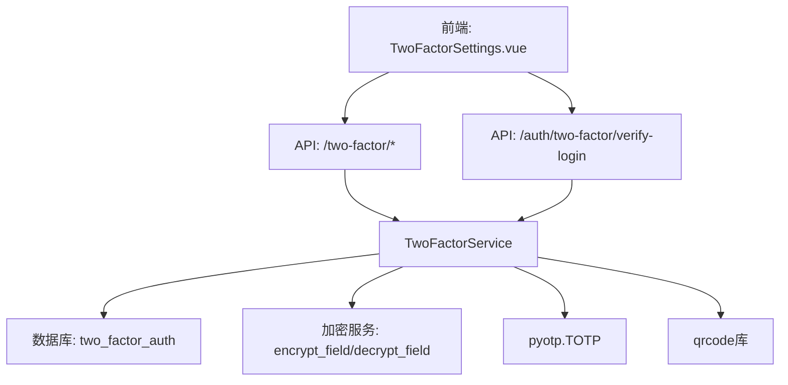
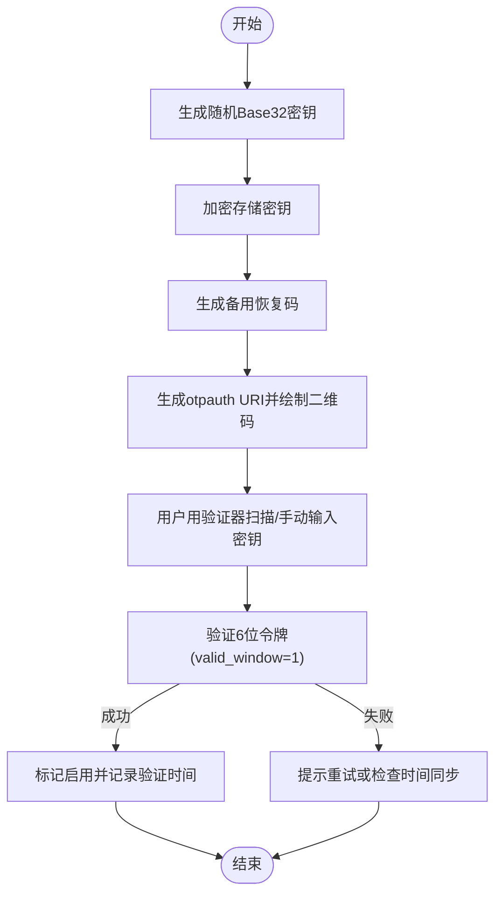
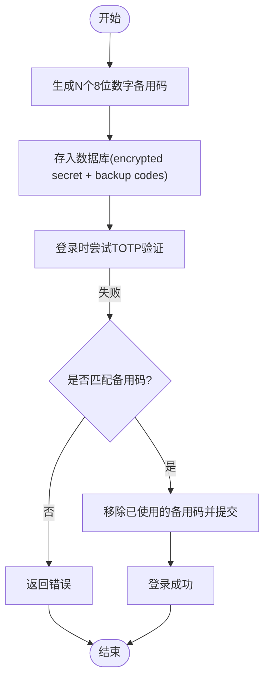
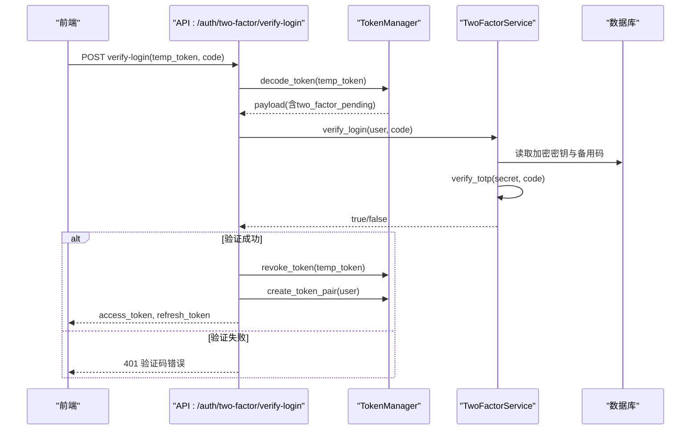
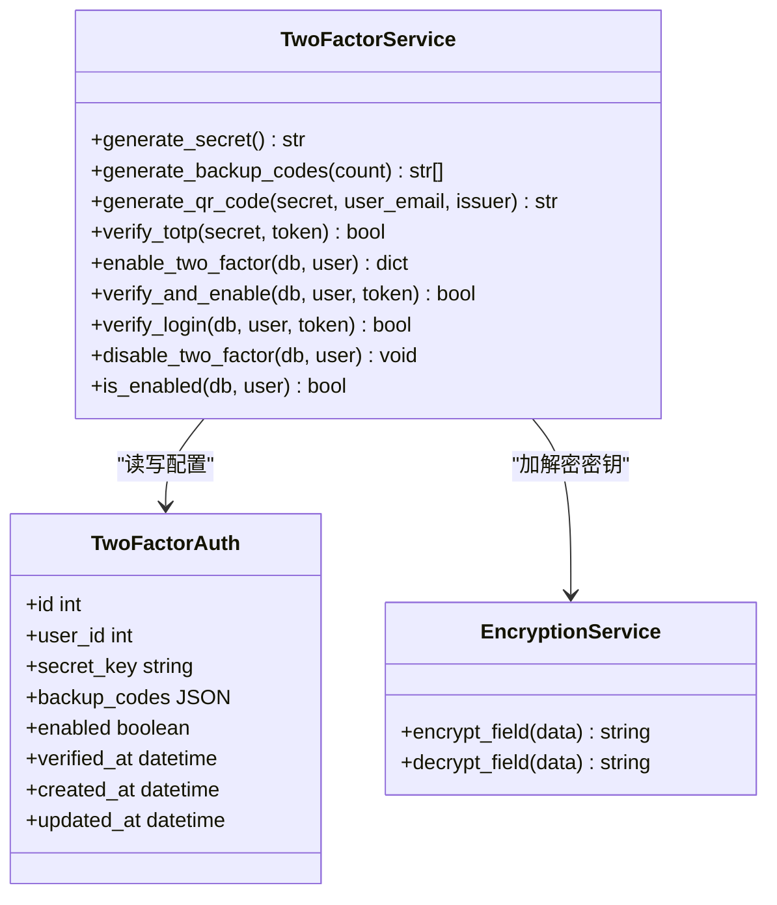
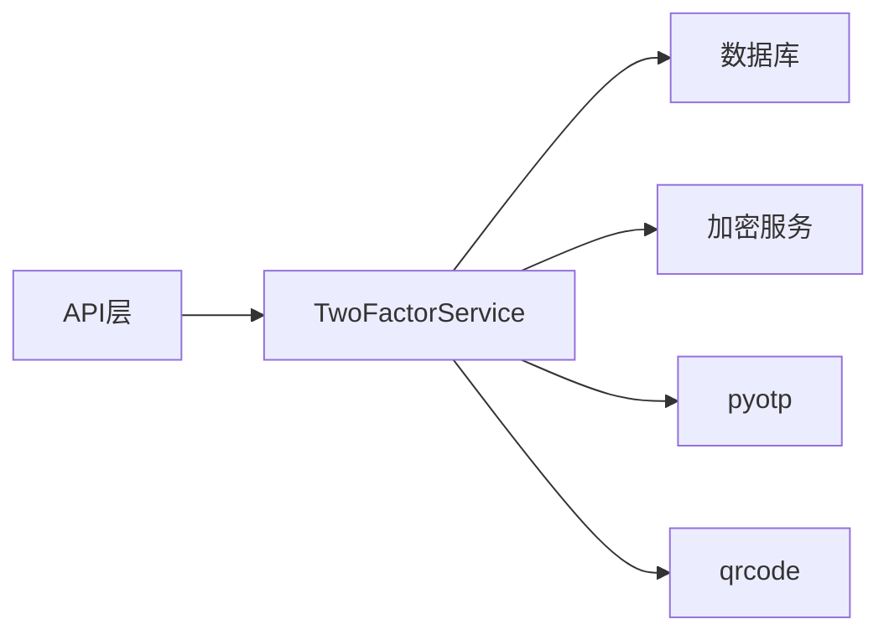

# TOTP验证码生成

<cite>
**本文引用的文件**
- [two_factor_service.py](file://backend/app/services/two_factor_service.py)
- [two_factor_auth.py](file://backend/app/models/two_factor_auth.py)
- [two_factor.py](file://backend/app/api/v1/auth/two_factor.py)
- [auth.py](file://backend/app/api/v1/auth/auth.py)
- [TwoFactorSettings.vue](file://frontend/src/views/auth/TwoFactorSettings.vue)
- [encryption_service.py](file://backend/app/services/encryption_service.py)
</cite>

## 目录
1. [简介](#简介)
2. [项目结构](#项目结构)
3. [核心组件](#核心组件)
4. [架构总览](#架构总览)
5. [详细组件分析](#详细组件分析)
6. [依赖关系分析](#依赖关系分析)
7. [性能与安全性考量](#性能与安全性考量)
8. [故障排查指南](#故障排查指南)
9. [结论](#结论)
10. [附录：配置最佳实践与使用示例](#附录配置最佳实践与使用示例)

## 简介
本技术文档聚焦于TOTP（基于时间的一次性密码）验证码生成功能在系统中的实现，覆盖以下关键主题：
- TOTP算法的实现原理：密钥生成、时间窗口计算、验证码生成与验证流程。
- QR码生成机制：二维码内容编码（otpauth URI）、图像生成与前端展示。
- 备用码策略：随机数生成、安全存储与一次性使用机制。
- TOTP配置最佳实践：时间同步、安全参数与兼容性考虑。
- 具体代码路径与使用场景说明，便于开发者快速定位与集成。

## 项目结构
TOTP相关功能由后端服务层、API路由层、数据模型层以及前端设置页面共同组成：
- 服务层：封装TOTP密钥生成、QR码生成、令牌验证、备用码管理、启用/禁用双因素认证等核心逻辑。
- API层：提供启用、验证、禁用、状态查询等REST接口；登录二次验证通过统一认证接口完成。
- 数据模型：持久化用户的双因素认证配置（加密密钥、备用码、启用状态、验证时间戳）。
- 前端：提供扫码设置、手动输入密钥、备用码展示与复制、验证并启用等交互。



图表来源
- [two_factor_service.py:23-251](file://backend/app/services/two_factor_service.py#L23-L251)
- [two_factor.py:14-88](file://backend/app/api/v1/auth/two_factor.py#L14-L88)
- [auth.py:290-444](file://backend/app/api/v1/auth/auth.py#L290-L444)
- [two_factor_auth.py:13-39](file://backend/app/models/two_factor_auth.py#L13-L39)
- [encryption_service.py:177-200](file://backend/app/services/encryption_service.py#L177-L200)

章节来源
- [two_factor_service.py:23-251](file://backend/app/services/two_factor_service.py#L23-L251)
- [two_factor.py:14-88](file://backend/app/api/v1/auth/two_factor.py#L14-L88)
- [auth.py:290-444](file://backend/app/api/v1/auth/auth.py#L290-L444)
- [two_factor_auth.py:13-39](file://backend/app/models/two_factor_auth.py#L13-L39)
- [TwoFactorSettings.vue:1-337](file://frontend/src/views/auth/TwoFactorSettings.vue#L1-L337)

## 核心组件
- TwoFactorService：提供TOTP密钥生成、QR码生成、令牌验证、备用码生成与管理、启用/禁用双因素认证等静态方法。
- TwoFactorAuth模型：定义双因素认证表结构，包含加密密钥、备用码、启用状态、验证时间戳等字段。
- 双因素认证API：暴露启用、验证、禁用、状态查询等接口。
- 登录二次验证：在统一认证流程中校验TOTP或备用码，成功后签发正式访问令牌。
- 前端设置页：引导用户扫码绑定、输入验证码、查看并复制备用码、启用/禁用双因素认证。

章节来源
- [two_factor_service.py:23-251](file://backend/app/services/two_factor_service.py#L23-L251)
- [two_factor_auth.py:13-39](file://backend/app/models/two_factor_auth.py#L13-L39)
- [two_factor.py:14-88](file://backend/app/api/v1/auth/two_factor.py#L14-L88)
- [auth.py:290-444](file://backend/app/api/v1/auth/auth.py#L290-L444)
- [TwoFactorSettings.vue:1-337](file://frontend/src/views/auth/TwoFactorSettings.vue#L1-L337)

## 架构总览
TOTP验证码生成的端到端流程如下：
- 用户在前端点击“开始设置”，调用启用接口获取密钥、二维码和备用码。
- 前端展示二维码与密钥，用户用手机验证器扫描后输入6位验证码进行验证。
- 服务端验证通过后启用双因素认证；后续登录时若已启用，需再次输入TOTP或备用码完成二次验证。
- 备用码一次性使用，使用后从数据库中移除。

```mermaid
sequenceDiagram
participant U as "用户"
participant FE as "前端 : TwoFactorSettings.vue"
participant API as "API : /two-factor/*"
participant SVC as "TwoFactorService"
participant DB as "数据库 : two_factor_auth"
participant PY as "pyotp.TOTP"
participant QR as "qrcode库"
U->>FE : 点击“开始设置”
FE->>API : POST /enable
API->>SVC : enable_two_factor()
SVC->>DB : 查询/创建记录
SVC->>PY : generate_secret()
SVC->>SVC : generate_backup_codes()
SVC->>Enc : encrypt_field(secret)
SVC->>QR : generate_qr_code(secret, email)
QR-->>SVC : data : image/png;base64,...
SVC-->>API : {secret, qr_code, backup_codes}
API-->>FE : 返回密钥、二维码、备用码
FE->>U : 展示二维码与密钥
U->>FE : 输入6位验证码
FE->>API : POST /verify (token)
API->>SVC : verify_and_enable()
SVC->>DB : 解密secret_key
SVC->>PY : verify(token, valid_window=1)
PY-->>SVC : true/false
SVC->>DB : 更新enabled/verified_at
API-->>FE : 启用成功
```

图表来源
- [two_factor_service.py:27-81](file://backend/app/services/two_factor_service.py#L27-L81)
- [two_factor_service.py:103-177](file://backend/app/services/two_factor_service.py#L103-L177)
- [two_factor.py:31-66](file://backend/app/api/v1/auth/two_factor.py#L31-L66)
- [TwoFactorSettings.vue:149-181](file://frontend/src/views/auth/TwoFactorSettings.vue#L149-L181)

## 详细组件分析

### TOTP算法实现原理
- 密钥生成：使用安全的随机Base32密钥，兼容主流验证器应用。
- 时间窗口计算：验证时使用有效窗口（前后一个时间步），默认时间步为30秒，允许一定时钟偏差。
- 验证码生成与验证：基于共享密钥与当前时间戳生成6位数字令牌，服务端以相同算法验证。



图表来源
- [two_factor_service.py:27-30](file://backend/app/services/two_factor_service.py#L27-L30)
- [two_factor_service.py:49-81](file://backend/app/services/two_factor_service.py#L49-L81)
- [two_factor_service.py:83-100](file://backend/app/services/two_factor_service.py#L83-L100)
- [two_factor_service.py:103-177](file://backend/app/services/two_factor_service.py#L103-L177)

章节来源
- [two_factor_service.py:27-100](file://backend/app/services/two_factor_service.py#L27-L100)

### QR码生成机制
- 内容编码：构造otpauth URI，包含发行者名称、用户标识与密钥信息，便于验证器识别与应用绑定。
- 图像生成：使用qrcode库将URI渲染为PNG图片，并以Base64 dataURL形式返回给前端。
- 前端展示：前端通过标签直接渲染dataURL，避免v-html带来的安全风险；同时支持手动复制密钥。

```mermaid
sequenceDiagram
participant SVC as "TwoFactorService"
participant PY as "pyotp.TOTP"
participant QR as "qrcode库"
participant FE as "前端 : TwoFactorSettings.vue"
SVC->>PY : provisioning_uri(name=user_email, issuer_name=...)
PY-->>SVC : otpauth URI
SVC->>QR : QRCode.add_data(uri), make_image()
QR-->>SVC : PNG图像
SVC->>SVC : 转换为Base64 dataURL
SVC-->>FE : data : image/png;base64,...
FE->>FE :  渲染二维码
```

图表来源
- [two_factor_service.py:49-81](file://backend/app/services/two_factor_service.py#L49-L81)
- [TwoFactorSettings.vue:51-64](file://frontend/src/views/auth/TwoFactorSettings.vue#L51-L64)

章节来源
- [two_factor_service.py:49-81](file://backend/app/services/two_factor_service.py#L49-L81)
- [TwoFactorSettings.vue:51-64](file://frontend/src/views/auth/TwoFactorSettings.vue#L51-L64)

### 备用码生成策略
- 随机数生成：每个备用码为8位数字，使用安全随机源生成，确保不可预测性。
- 安全存储：备用码以JSON数组形式存储在数据库中，与加密密钥一同保存。
- 一次性使用：登录验证时若匹配到备用码，立即从列表中移除并提交变更，防止重复使用。



图表来源
- [two_factor_service.py:31-47](file://backend/app/services/two_factor_service.py#L31-L47)
- [two_factor_service.py:179-215](file://backend/app/services/two_factor_service.py#L179-L215)
- [two_factor_auth.py:18-23](file://backend/app/models/two_factor_auth.py#L18-L23)

章节来源
- [two_factor_service.py:31-47](file://backend/app/services/two_factor_service.py#L31-L47)
- [two_factor_service.py:179-215](file://backend/app/services/two_factor_service.py#L179-L215)
- [two_factor_auth.py:18-23](file://backend/app/models/two_factor_auth.py#L18-L23)

### 登录二次验证流程
- 临时令牌：首次登录成功后返回临时令牌（含two_factor_pending标志），用于二次验证。
- 二次验证：携带临时令牌与验证码调用二次验证接口，校验TOTP或备用码。
- 正式令牌：验证通过后吊销临时令牌，签发正式访问令牌与刷新令牌，并记录登录审计日志。



图表来源
- [auth.py:290-444](file://backend/app/api/v1/auth/auth.py#L290-L444)
- [two_factor_service.py:179-215](file://backend/app/services/two_factor_service.py#L179-L215)

章节来源
- [auth.py:290-444](file://backend/app/api/v1/auth/auth.py#L290-L444)
- [two_factor_service.py:179-215](file://backend/app/services/two_factor_service.py#L179-L215)

### 类与模块关系图


图表来源
- [two_factor_service.py:23-251](file://backend/app/services/two_factor_service.py#L23-L251)
- [two_factor_auth.py:13-39](file://backend/app/models/two_factor_auth.py#L13-L39)
- [encryption_service.py:177-200](file://backend/app/services/encryption_service.py#L177-L200)

## 依赖关系分析
- 外部库依赖：
  - pyotp：用于生成与验证TOTP令牌。
  - qrcode：用于将otpauth URI渲染为二维码图像。
- 内部依赖：
  - encryption_service：对敏感字段（如密钥）进行加解密。
  - database：持久化双因素认证配置。
  - token_manager：处理临时令牌与正式令牌的签发与吊销。
- 耦合与内聚：
  - TwoFactorService高内聚地封装了TOTP相关的所有业务逻辑，降低API层的复杂度。
  - API层仅负责请求解析、响应封装与异常处理，职责清晰。



图表来源
- [two_factor.py:14-88](file://backend/app/api/v1/auth/two_factor.py#L14-L88)
- [two_factor_service.py:23-251](file://backend/app/services/two_factor_service.py#L23-L251)

章节来源
- [two_factor.py:14-88](file://backend/app/api/v1/auth/two_factor.py#L14-L88)
- [two_factor_service.py:23-251](file://backend/app/services/two_factor_service.py#L23-L251)

## 性能与安全性考量
- 性能优化：
  - qrcode库懒加载：在方法内导入以避免模块初始化开销，减少启动时间与测试收集耗时。
  - 时间窗口合理设置：valid_window=1允许前后一个时间步，兼顾容错与安全性。
- 安全性措施：
  - 密钥加密存储：使用加密服务对TOTP密钥进行加解密，避免明文落库。
  - 备用码一次性使用：使用后即时移除，防止重放攻击。
  - 速率限制：二次验证接口复用登录速率限制，防止暴力破解。
  - 审计日志：登录失败与成功均记录审计日志，便于追踪与分析。

[本节为通用指导，不直接分析具体文件]

## 故障排查指南
- 验证码无效：
  - 检查客户端与服务端时间同步，确保验证器应用时间准确。
  - 确认验证码为6位数字且在有效期内。
- 二维码无法显示：
  - 确认后端返回的dataURL格式正确，前端使用标签渲染。
  - 检查浏览器是否允许本地资源加载。
- 备用码失效：
  - 确认备用码未被使用过；一旦使用即从数据库移除。
- 启用失败：
  - 检查数据库连接与事务提交是否正常。
  - 查看服务日志中的异常信息，定位问题原因。

章节来源
- [two_factor_service.py:83-100](file://backend/app/services/two_factor_service.py#L83-L100)
- [auth.py:358-373](file://backend/app/api/v1/auth/auth.py#L358-L373)
- [TwoFactorSettings.vue:164-181](file://frontend/src/views/auth/TwoFactorSettings.vue#L164-L181)

## 结论
本系统实现了完整的TOTP双因素认证能力，涵盖密钥生成、二维码绑定、令牌验证、备用码管理与登录二次验证等关键环节。通过加密存储、速率限制与审计日志等措施，保障了安全性与可运维性。前端提供了友好的设置与验证流程，便于用户快速启用与使用。

[本节为总结性内容，不直接分析具体文件]

## 附录：配置最佳实践与使用示例

### TOTP配置最佳实践
- 时间同步：
  - 建议服务器与客户端设备保持时间同步，误差控制在30秒以内。
  - 可使用NTP服务确保服务器时间准确。
- 安全参数：
  - 密钥长度与算法：采用标准Base32密钥，兼容主流验证器。
  - 时间窗口：默认valid_window=1，可根据业务需求调整。
  - 备用码数量：默认10个，可根据安全策略调整。
- 兼容性：
  - 支持Google Authenticator、Microsoft Authenticator等主流验证器。
  - 提供手动输入密钥选项，便于特殊场景使用。

[本节为通用指导，不直接分析具体文件]

### 使用场景与代码路径参考
- 启用双因素认证：
  - 前端调用：POST /two-factor/enable
  - 服务实现：TwoFactorService.enable_two_factor
  - 参考路径：[two_factor.py:31-43](file://backend/app/api/v1/auth/two_factor.py#L31-L43)、[two_factor_service.py:103-148](file://backend/app/services/two_factor_service.py#L103-L148)
- 验证并启用：
  - 前端调用：POST /two-factor/verify
  - 服务实现：TwoFactorService.verify_and_enable
  - 参考路径：[two_factor.py:46-66](file://backend/app/api/v1/auth/two_factor.py#L46-L66)、[two_factor_service.py:150-177](file://backend/app/services/two_factor_service.py#L150-L177)
- 登录二次验证：
  - 前端调用：POST /auth/two-factor/verify-login
  - 服务实现：TwoFactorService.verify_login
  - 参考路径：[auth.py:290-444](file://backend/app/api/v1/auth/auth.py#L290-L444)、[two_factor_service.py:179-215](file://backend/app/services/two_factor_service.py#L179-L215)
- 禁用双因素认证：
  - 前端调用：POST /two-factor/disable
  - 服务实现：TwoFactorService.disable_two_factor
  - 参考路径：[two_factor.py:69-78](file://backend/app/api/v1/auth/two_factor.py#L69-L78)、[two_factor_service.py:217-231](file://backend/app/services/two_factor_service.py#L217-L231)
- 查询状态：
  - 前端调用：GET /two-factor/status
  - 服务实现：TwoFactorService.is_enabled
  - 参考路径：[two_factor.py:81-87](file://backend/app/api/v1/auth/two_factor.py#L81-L87)、[two_factor_service.py:232-251](file://backend/app/services/two_factor_service.py#L232-L251)

章节来源
- [two_factor.py:31-87](file://backend/app/api/v1/auth/two_factor.py#L31-L87)
- [two_factor_service.py:103-251](file://backend/app/services/two_factor_service.py#L103-L251)
- [auth.py:290-444](file://backend/app/api/v1/auth/auth.py#L290-L444)