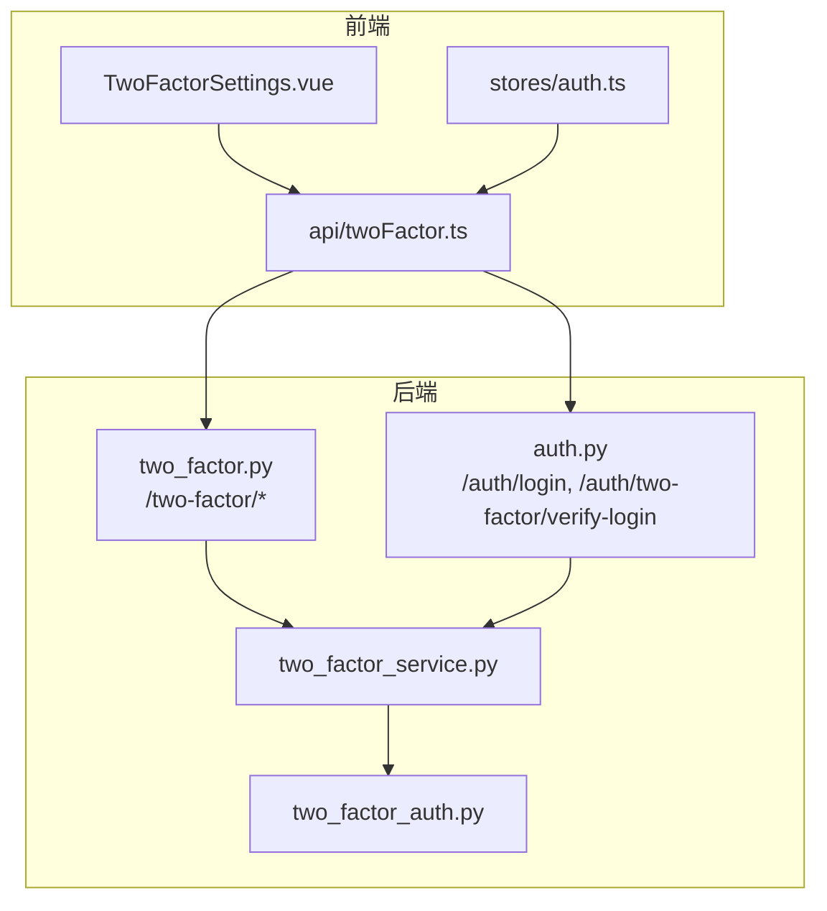
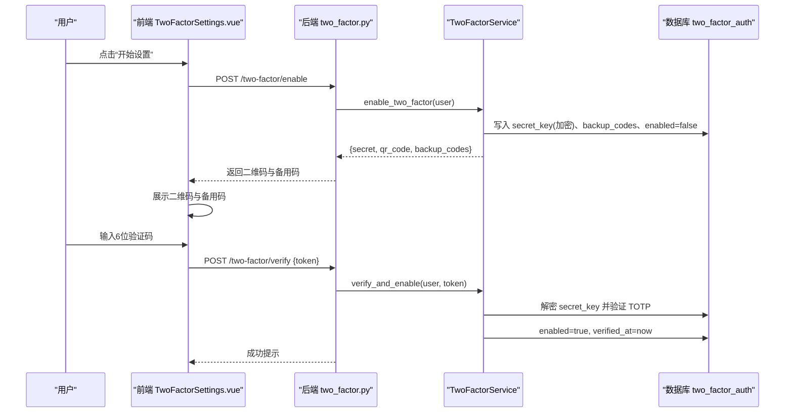
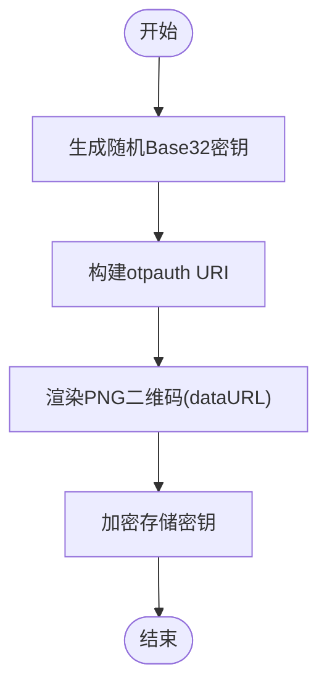
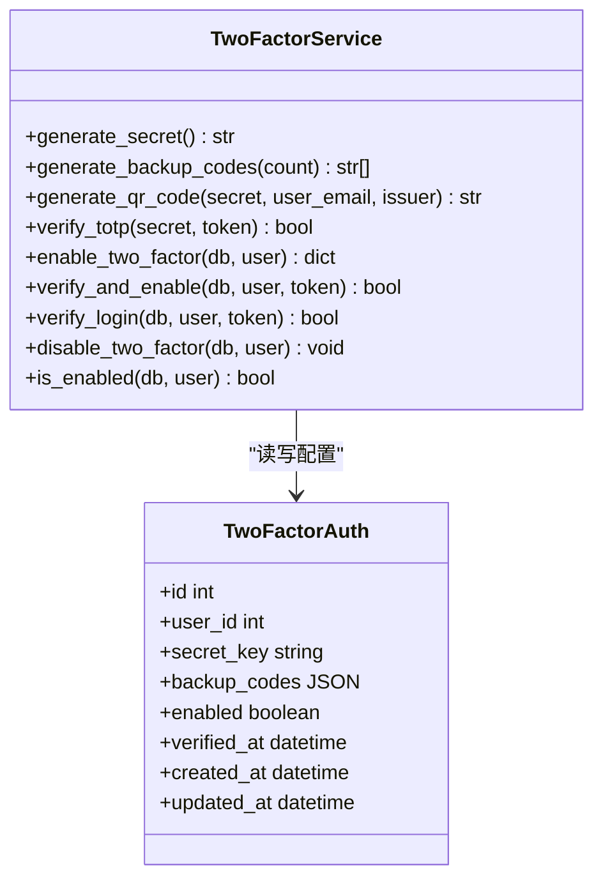
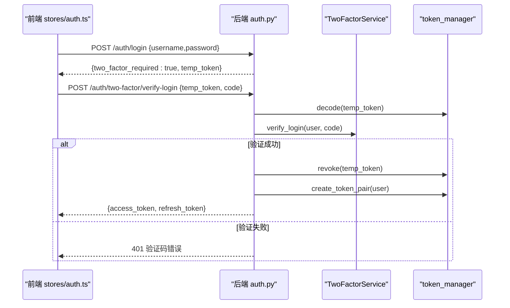
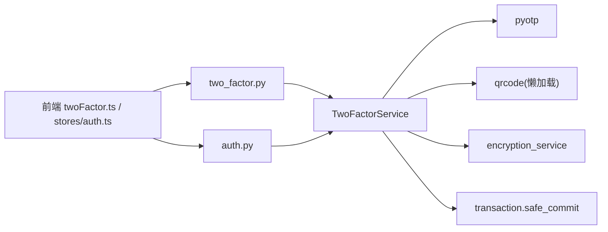

# 双因素认证

<cite>
**本文引用的文件**
- [backend/app/services/two_factor_service.py](file://backend/app/services/two_factor_service.py)
- [backend/app/models/two_factor_auth.py](file://backend/app/models/two_factor_auth.py)
- [backend/app/api/v1/auth/two_factor.py](file://backend/app/api/v1/auth/two_factor.py)
- [backend/app/api/v1/auth/auth.py](file://backend/app/api/v1/auth/auth.py)
- [frontend/src/api/twoFactor.ts](file://frontend/src/api/twoFactor.ts)
- [frontend/src/views/auth/TwoFactorSettings.vue](file://frontend/src/views/auth/TwoFactorSettings.vue)
- [frontend/src/stores/auth.ts](file://frontend/src/stores/auth.ts)
- [backend/tests/unit/test_two_factor_api.py](file://backend/tests/unit/test_two_factor_api.py)
</cite>

## 目录
1. [简介](#简介)
2. [项目结构](#项目结构)
3. [核心组件](#核心组件)
4. [架构总览](#架构总览)
5. [详细组件分析](#详细组件分析)
6. [依赖关系分析](#依赖关系分析)
7. [性能考虑](#性能考虑)
8. [故障排查指南](#故障排查指南)
9. [结论](#结论)
10. [附录：API 使用示例](#附录api-使用示例)

## 简介
本技术文档围绕双因素认证（2FA）功能，系统阐述 TOTP 验证码生成算法、时间同步机制与验证流程；详细说明启用、禁用与管理操作（二维码生成、备用码管理、设备绑定）；完整描述登录时的二次验证流程（临时令牌机制、验证码校验与安全策略）；并提供前后端 API 调用示例与错误处理策略。

## 项目结构
后端采用 FastAPI 分层架构：API 路由层负责请求解析与响应封装，服务层实现业务逻辑（TOTP 密钥生成、二维码生成、备用码管理与验证），数据模型层持久化用户 2FA 配置。前端通过 Vue + TypeScript 提供设置页与登录流程集成，状态管理 store 协调登录与 2FA 验证。

图表来源
- [backend/app/api/v1/auth/auth.py:290-444](file://backend/app/api/v1/auth/auth.py#L290-L444)
- [backend/app/api/v1/auth/two_factor.py:31-87](file://backend/app/api/v1/auth/two_factor.py#L31-L87)
- [backend/app/services/two_factor_service.py:23-251](file://backend/app/services/two_factor_service.py#L23-L251)
- [backend/app/models/two_factor_auth.py:13-39](file://backend/app/models/two_factor_auth.py#L13-L39)
- [frontend/src/api/twoFactor.ts:39-78](file://frontend/src/api/twoFactor.ts#L39-L78)
- [frontend/src/views/auth/TwoFactorSettings.vue:120-235](file://frontend/src/views/auth/TwoFactorSettings.vue#L120-L235)
- [frontend/src/stores/auth.ts:171-259](file://frontend/src/stores/auth.ts#L171-L259)

章节来源
- [backend/app/api/v1/auth/auth.py:290-444](file://backend/app/api/v1/auth/auth.py#L290-L444)
- [backend/app/api/v1/auth/two_factor.py:31-87](file://backend/app/api/v1/auth/two_factor.py#L31-L87)
- [backend/app/services/two_factor_service.py:23-251](file://backend/app/services/two_factor_service.py#L23-L251)
- [backend/app/models/two_factor_auth.py:13-39](file://backend/app/models/two_factor_auth.py#L13-L39)
- [frontend/src/api/twoFactor.ts:39-78](file://frontend/src/api/twoFactor.ts#L39-L78)
- [frontend/src/views/auth/TwoFactorSettings.vue:120-235](file://frontend/src/views/auth/TwoFactorSettings.vue#L120-L235)
- [frontend/src/stores/auth.ts:171-259](file://frontend/src/stores/auth.ts#L171-L259)

## 核心组件
- 服务层 TwoFactorService：负责 TOTP 密钥生成、二维码生成、备用码生成、TOTP 验证、登录时 TOTP/备用码校验、启用/禁用状态管理。
- 数据模型 TwoFactorAuth：存储用户加密的 TOTP 密钥、备用码列表、启用状态与验证时间戳。
- 后端 API：
  - 2FA 管理：/two-factor/enable、/two-factor/verify、/two-factor/disable、/two-factor/status
  - 登录二次验证：/auth/two-factor/verify-login（基于 temp_token 与 code）
- 前端：
  - 设置页 TwoFactorSettings.vue：引导扫码、输入验证码、展示备用码、禁用 2FA
  - 登录流程 stores/auth.ts：处理 two_factor_required 分支，调用 verifyLoginTwoFactor 完成最终登录
  - API 封装 twoFactor.ts：统一调用后端 2FA 接口

章节来源
- [backend/app/services/two_factor_service.py:23-251](file://backend/app/services/two_factor_service.py#L23-L251)
- [backend/app/models/two_factor_auth.py:13-39](file://backend/app/models/two_factor_auth.py#L13-L39)
- [backend/app/api/v1/auth/two_factor.py:31-87](file://backend/app/api/v1/auth/two_factor.py#L31-L87)
- [backend/app/api/v1/auth/auth.py:290-444](file://backend/app/api/v1/auth/auth.py#L290-L444)
- [frontend/src/views/auth/TwoFactorSettings.vue:120-235](file://frontend/src/views/auth/TwoFactorSettings.vue#L120-L235)
- [frontend/src/stores/auth.ts:171-259](file://frontend/src/stores/auth.ts#L171-L259)
- [frontend/src/api/twoFactor.ts:39-78](file://frontend/src/api/twoFactor.ts#L39-L78)

## 架构总览
下图展示了从前端到后端的 2FA 关键交互路径，包括启用流程与登录二次验证流程。

图表来源
- [backend/app/api/v1/auth/two_factor.py:31-66](file://backend/app/api/v1/auth/two_factor.py#L31-L66)
- [backend/app/services/two_factor_service.py:103-177](file://backend/app/services/two_factor_service.py#L103-L177)
- [backend/app/models/two_factor_auth.py:13-39](file://backend/app/models/two_factor_auth.py#L13-L39)

## 详细组件分析

### TOTP 验证码生成与时间同步
- 密钥生成：使用安全随机 Base32 密钥，确保不可预测性。
- 二维码生成：构造 otpauth URI 并渲染为 PNG dataURL，便于手机验证器应用扫描。
- 时间窗口：验证时使用允许前后一个时间步长（约±30秒）的时间窗口，以容忍客户端与服务端时钟微小偏差。

图表来源
- [backend/app/services/two_factor_service.py:26-81](file://backend/app/services/two_factor_service.py#L26-L81)

章节来源
- [backend/app/services/two_factor_service.py:26-100](file://backend/app/services/two_factor_service.py#L26-L100)

### 启用、禁用与管理
- 启用流程：
  - 生成密钥与备用码，加密存储密钥，记录 enabled=false 待验证。
  - 返回二维码与备用码供用户保存。
- 验证启用：
  - 解密密钥，验证 TOTP；通过后设置 enabled=true 与验证时间。
- 禁用流程：
  - 删除用户的 2FA 配置记录。
- 状态查询：
  - 检查 enabled 字段是否存在且为真。

图表来源
- [backend/app/services/two_factor_service.py:23-251](file://backend/app/services/two_factor_service.py#L23-L251)
- [backend/app/models/two_factor_auth.py:13-39](file://backend/app/models/two_factor_auth.py#L13-L39)

章节来源
- [backend/app/services/two_factor_service.py:103-251](file://backend/app/services/two_factor_service.py#L103-L251)
- [backend/app/models/two_factor_auth.py:13-39](file://backend/app/models/two_factor_auth.py#L13-L39)

### 登录二次验证流程（临时令牌机制）
- 首次登录：若用户启用了 2FA，返回 two_factor_required 与 temp_token。
- 二次验证：前端携带 temp_token 与 TOTP/备用码调用 /auth/two-factor/verify-login。
- 服务端校验：
  - 校验 temp_token 有效性及 two_factor_pending 标记。
  - 查找用户并验证 TOTP 或备用码。
  - 成功后吊销 temp_token，签发正式 access_token 与 refresh_token。
- 安全防护：
  - 复用登录速率限制，防止暴力破解。
  - 失败时记录审计日志。

图表来源
- [backend/app/api/v1/auth/auth.py:290-444](file://backend/app/api/v1/auth/auth.py#L290-L444)
- [frontend/src/stores/auth.ts:171-259](file://frontend/src/stores/auth.ts#L171-L259)

章节来源
- [backend/app/api/v1/auth/auth.py:290-444](file://backend/app/api/v1/auth/auth.py#L290-L444)
- [frontend/src/stores/auth.ts:171-259](file://frontend/src/stores/auth.ts#L171-L259)

### 前端 2FA 状态同步与错误处理
- 状态同步：
  - 页面加载时调用 /two-factor/status 获取 enabled 标志。
  - 启用成功后刷新状态并进入下一步。
- 错误处理：
  - 捕获网络异常与业务错误，显示友好提示。
  - 禁用前弹出确认框，避免误操作。

章节来源
- [frontend/src/views/auth/TwoFactorSettings.vue:120-235](file://frontend/src/views/auth/TwoFactorSettings.vue#L120-L235)

## 依赖关系分析
- 服务层依赖：
  - pyotp：用于 TOTP 密钥生成与验证。
  - qrcode：懒加载以避免模块导入开销。
  - encryption_service：对密钥进行加解密。
  - transaction：事务提交保障一致性。
- API 层依赖：
  - 依赖 get_current_active_user、get_db 等依赖注入。
  - 复用登录速率限制与审计日志。
- 前端依赖：
  - api/request.ts 统一请求封装。
  - stores/auth.ts 管理登录与 2FA 流程。

图表来源
- [backend/app/services/two_factor_service.py:5-18](file://backend/app/services/two_factor_service.py#L5-L18)
- [backend/app/api/v1/auth/two_factor.py:5-12](file://backend/app/api/v1/auth/two_factor.py#L5-L12)
- [backend/app/api/v1/auth/auth.py:290-383](file://backend/app/api/v1/auth/auth.py#L290-L383)
- [frontend/src/api/twoFactor.ts:6-78](file://frontend/src/api/twoFactor.ts#L6-L78)
- [frontend/src/stores/auth.ts:171-259](file://frontend/src/stores/auth.ts#L171-L259)

章节来源
- [backend/app/services/two_factor_service.py:5-18](file://backend/app/services/two_factor_service.py#L5-L18)
- [backend/app/api/v1/auth/two_factor.py:5-12](file://backend/app/api/v1/auth/two_factor.py#L5-L12)
- [backend/app/api/v1/auth/auth.py:290-383](file://backend/app/api/v1/auth/auth.py#L290-L383)
- [frontend/src/api/twoFactor.ts:6-78](file://frontend/src/api/twoFactor.ts#L6-L78)
- [frontend/src/stores/auth.ts:171-259](file://frontend/src/stores/auth.ts#L171-L259)

## 性能考虑
- 懒加载 qrcode：将高代价的 qrcode 导入移至方法内，降低模块初始化时间与测试收集开销。
- 时间窗口验证：valid_window=1 允许 ±30 秒误差，减少因时钟漂移导致的失败重试。
- 事务提交：使用 safe_commit 保证写操作的原子性与一致性。
- 速率限制：复用登录速率限制，保护 2FA 验证接口免受暴力攻击。

[本节为通用指导，不直接分析具体文件]

## 故障排查指南
- 常见问题定位：
  - 验证码错误：检查客户端时间是否准确，确认 TOTP 时间窗口；核对备用码是否已被使用。
  - 临时令牌无效：确认 temp_token 未过期且未被吊销；检查 two_factor_pending 标记。
  - 启用失败：检查数据库中是否存在已启用的 2FA 配置；查看加密/解密是否正常。
- 日志与审计：
  - 登录失败会记录审计日志，包含失败原因与客户端信息。
  - 服务层在 TOTP 验证失败时记录错误日志。
- 单元测试参考：
  - 覆盖启用、验证、禁用与状态查询等场景，便于回归验证。

章节来源
- [backend/app/api/v1/auth/auth.py:358-373](file://backend/app/api/v1/auth/auth.py#L358-L373)
- [backend/app/services/two_factor_service.py:83-100](file://backend/app/services/two_factor_service.py#L83-L100)
- [backend/tests/unit/test_two_factor_api.py:45-122](file://backend/tests/unit/test_two_factor_api.py#L45-L122)

## 结论
该 2FA 方案基于标准 TOTP 算法，结合加密存储、备用码恢复与临时令牌机制，提供了安全的二次验证流程。前后端协作清晰，具备完善的错误处理与审计能力。建议在生产环境严格管理密钥与备用码，并确保客户端时间同步，以获得最佳体验与安全效果。

[本节为总结，不直接分析具体文件]

## 附录：API 使用示例
以下示例基于前端 API 封装与后端路由定义，展示典型调用方式与数据结构。

- 启用 2FA
  - 前端调用：POST /two-factor/enable
  - 返回：{ secret, qr_code, backup_codes }
  - 参考：
    - [frontend/src/api/twoFactor.ts:39-42](file://frontend/src/api/twoFactor.ts#L39-L42)
    - [backend/app/api/v1/auth/two_factor.py:31-43](file://backend/app/api/v1/auth/two_factor.py#L31-L43)

- 验证并启用 2FA
  - 前端调用：POST /two-factor/verify { token }
  - 返回：{ message }
  - 参考：
    - [frontend/src/api/twoFactor.ts:44-47](file://frontend/src/api/twoFactor.ts#L44-L47)
    - [backend/app/api/v1/auth/two_factor.py:46-66](file://backend/app/api/v1/auth/two_factor.py#L46-L66)

- 禁用 2FA
  - 前端调用：POST /two-factor/disable
  - 返回：{ message }
  - 参考：
    - [frontend/src/api/twoFactor.ts:49-52](file://frontend/src/api/twoFactor.ts#L49-L52)
    - [backend/app/api/v1/auth/two_factor.py:69-78](file://backend/app/api/v1/auth/two_factor.py#L69-L78)

- 查询 2FA 状态
  - 前端调用：GET /two-factor/status
  - 返回：{ enabled }
  - 参考：
    - [frontend/src/api/twoFactor.ts:54-57](file://frontend/src/api/twoFactor.ts#L54-L57)
    - [backend/app/api/v1/auth/two_factor.py:81-87](file://backend/app/api/v1/auth/two_factor.py#L81-L87)

- 登录二次验证
  - 前端调用：POST /auth/two-factor/verify-login { temp_token, code }
  - 返回：{ access_token, refresh_token, user, ... }
  - 参考：
    - [frontend/src/api/twoFactor.ts:59-68](file://frontend/src/api/twoFactor.ts#L59-L68)
    - [backend/app/api/v1/auth/auth.py:290-444](file://backend/app/api/v1/auth/auth.py#L290-L444)

章节来源
- [frontend/src/api/twoFactor.ts:39-68](file://frontend/src/api/twoFactor.ts#L39-L68)
- [backend/app/api/v1/auth/two_factor.py:31-87](file://backend/app/api/v1/auth/two_factor.py#L31-L87)
- [backend/app/api/v1/auth/auth.py:290-444](file://backend/app/api/v1/auth/auth.py#L290-L444)