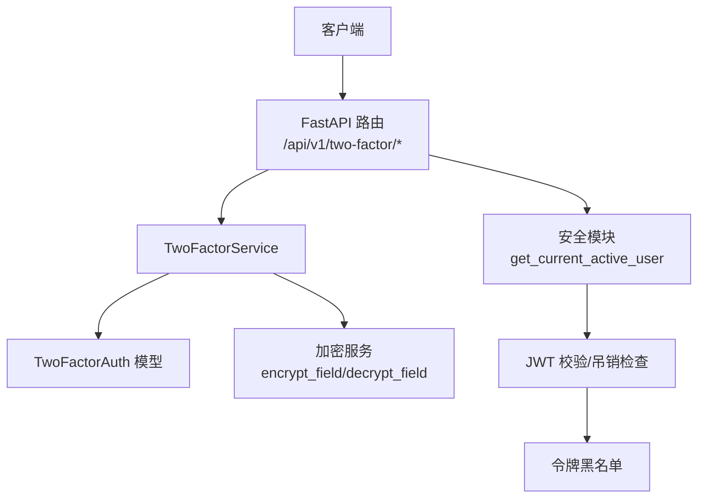
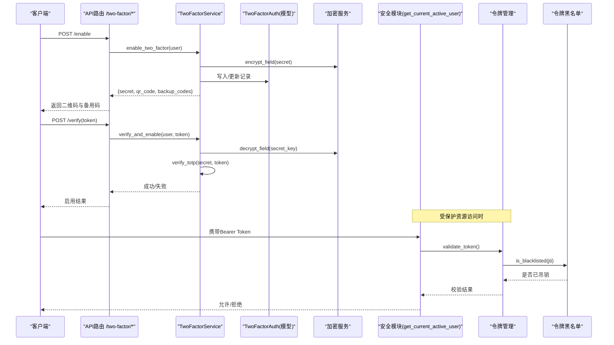
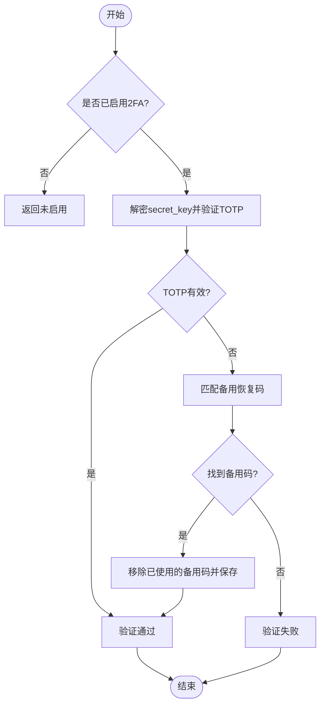
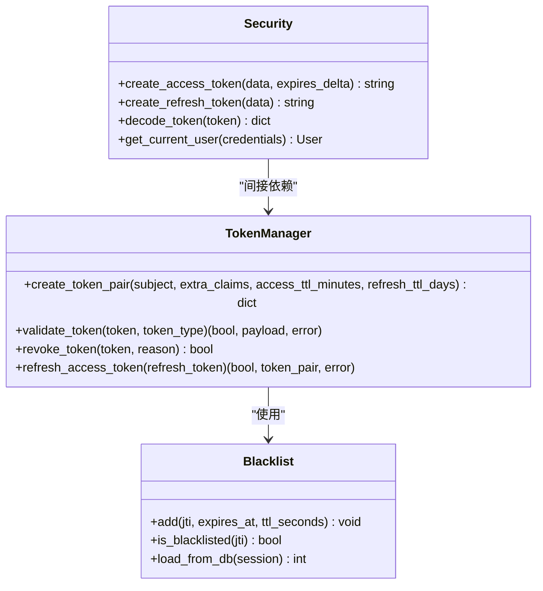
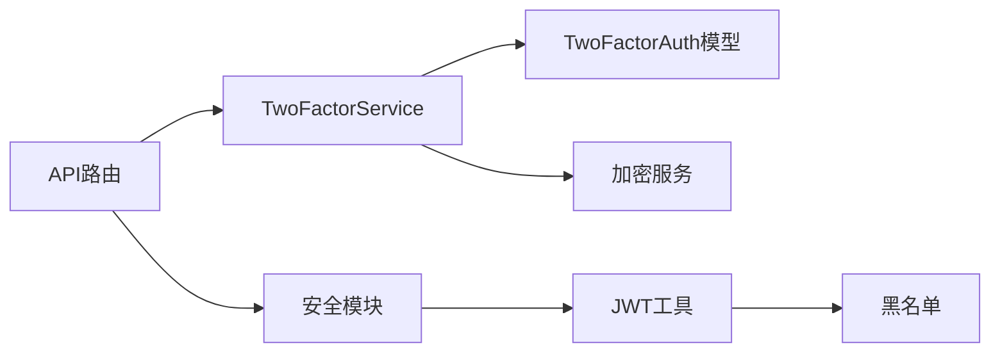

# 安全考虑

<cite>
**本文引用的文件**
- [two_factor_service.py](file://backend/app/services/two_factor_service.py)
- [two_factor_auth.py](file://backend/app/models/two_factor_auth.py)
- [two_factor.py](file://backend/app/api/v1/auth/two_factor.py)
- [security.py](file://backend/app/core/security.py)
- [token_manager.py](file://backend/app/core/token_manager.py)
- [token_blacklist.py](file://backend/app/core/token_blacklist.py)
- [encryption_service.py](file://backend/app/services/encryption_service.py)
- [secrets_manager.py](file://backend/app/services/secrets_manager.py)
- [security_self_check.py](file://backend/scripts/security_self_check.py)
- [audit_security.py](file://scripts/archive/audit_security.py)
- [deep_scan.py](file://backend/scripts/deep_scan.py)
</cite>

## 目录
1. [简介](#简介)
2. [项目结构](#项目结构)
3. [核心组件](#核心组件)
4. [架构总览](#架构总览)
5. [详细组件分析](#详细组件分析)
6. [依赖关系分析](#依赖关系分析)
7. [性能与安全特性](#性能与安全特性)
8. [故障排查指南](#故障排查指南)
9. [结论](#结论)
10. [附录：配置与测试建议](#附录配置与测试建议)

## 简介
本技术文档围绕双因素认证（2FA）的安全实现，系统阐述以下方面：
- 威胁防护：暴力破解防护、时间攻击防护、重放攻击防护
- 密钥安全管理：存储加密、传输安全、访问控制
- 会话管理：临时令牌有效期、会话隔离、自动清理
- 安全配置：密码策略、超时设置、审计日志
- 安全测试与漏洞扫描：确保2FA功能的健壮性与安全性

## 项目结构
与2FA相关的关键代码分布在服务层、模型层、API层以及核心安全模块中：
- 服务层：TwoFactorService 负责TOTP生成、验证、备用码管理与启用/禁用流程
- 模型层：TwoFactorAuth 持久化用户2FA配置（含加密的secret_key、备用码列表、启用状态等）
- API层：/api/v1/two-factor/* 暴露启用、验证、禁用、状态查询接口
- 核心安全：JWT签发与校验、黑名单、速率限制、密码策略、审计日志
- 加密与密钥：Fernet字段级加密、运行时密钥存储与轮换

**图表来源**
- [two_factor.py:31-87](file://backend/app/api/v1/auth/two_factor.py#L31-L87)
- [two_factor_service.py:23-251](file://backend/app/services/two_factor_service.py#L23-L251)
- [two_factor_auth.py:13-39](file://backend/app/models/two_factor_auth.py#L13-L39)
- [security.py:243-347](file://backend/app/core/security.py#L243-L347)
- [token_blacklist.py:27-70](file://backend/app/core/token_blacklist.py#L27-L70)

**章节来源**
- [two_factor.py:31-87](file://backend/app/api/v1/auth/two_factor.py#L31-L87)
- [two_factor_service.py:23-251](file://backend/app/services/two_factor_service.py#L23-L251)
- [two_factor_auth.py:13-39](file://backend/app/models/two_factor_auth.py#L13-L39)
- [security.py:243-347](file://backend/app/core/security.py#L243-L347)
- [token_blacklist.py:27-70](file://backend/app/core/token_blacklist.py#L27-L70)

## 核心组件
- TwoFactorService：提供TOTP密钥生成、二维码生成、令牌验证、备用码使用与移除、启用/禁用、状态查询
- TwoFactorAuth：数据库表结构，包含加密的secret_key、备用码JSON、enabled标志、verified_at时间戳
- 安全模块：JWT签发/解码、当前用户获取、黑名单校验、类型校验、速率限制、密码策略、审计日志
- 令牌管理：统一创建access/refresh token对、校验、吊销、刷新；支持jti与黑名单持久化
- 加密与密钥：字段级Fernet加密、运行时密钥存储与轮换、默认密钥持久化

**章节来源**
- [two_factor_service.py:23-251](file://backend/app/services/two_factor_service.py#L23-L251)
- [two_factor_auth.py:13-39](file://backend/app/models/two_factor_auth.py#L13-L39)
- [security.py:210-347](file://backend/app/core/security.py#L210-L347)
- [token_manager.py:64-240](file://backend/app/core/token_manager.py#L64-L240)
- [encryption_service.py:181-261](file://backend/app/services/encryption_service.py#L181-L261)
- [secrets_manager.py:13-43](file://backend/app/services/secrets_manager.py#L13-L43)

## 架构总览
下图展示2FA登录与鉴权的核心调用链：客户端发起请求，API路由调用TwoFactorService进行TOTP或备用码验证；安全模块在受保护端点前校验JWT并检查黑名单；令牌管理负责签发、吊销与刷新。

**图表来源**
- [two_factor.py:31-87](file://backend/app/api/v1/auth/two_factor.py#L31-L87)
- [two_factor_service.py:103-215](file://backend/app/services/two_factor_service.py#L103-L215)
- [encryption_service.py:233-261](file://backend/app/services/encryption_service.py#L233-L261)
- [security.py:243-347](file://backend/app/core/security.py#L243-L347)
- [token_manager.py:135-240](file://backend/app/core/token_manager.py#L135-L240)
- [token_blacklist.py:27-70](file://backend/app/core/token_blacklist.py#L27-L70)

## 详细组件分析

### 双因素认证服务（TwoFactorService）
- 功能要点
  - 生成TOTP密钥与二维码，便于绑定到认证器应用
  - 生成备用恢复码（一次性使用），使用后从列表中移除
  - 验证TOTP令牌（允许前后一个时间窗口，缓解时钟偏差）
  - 启用/禁用2FA，并在启用时记录验证时间
  - 登录时优先尝试TOTP，再尝试备用码
- 安全考量
  - secret_key以加密形式存储，避免明文落库
  - 备用码一次性使用，降低泄露风险
  - 验证失败不泄露具体错误原因（防枚举）
- 复杂度与性能
  - TOTP验证为O(1)，备用码查找为O(n)（n通常为少量恢复码）
  - 二维码生成仅在启用阶段执行，不影响高频路径

**图表来源**
- [two_factor_service.py:180-215](file://backend/app/services/two_factor_service.py#L180-L215)

**章节来源**
- [two_factor_service.py:23-251](file://backend/app/services/two_factor_service.py#L23-L251)

### 双因素认证模型（TwoFactorAuth）
- 字段说明
  - user_id：唯一关联用户
  - secret_key：加密后的TOTP密钥
  - backup_codes：备用恢复码列表（JSON）
  - enabled：是否启用2FA
  - verified_at：首次验证时间
  - created_at/updated_at：审计时间戳
- 安全设计
  - 通过外键约束保证数据一致性
  - 敏感字段加密存储，降低数据库泄露风险

**章节来源**
- [two_factor_auth.py:13-39](file://backend/app/models/two_factor_auth.py#L13-L39)

### 双因素认证API（/two-factor/*）
- 接口职责
  - /enable：生成密钥、二维码与备用码，准备启用
  - /verify：验证TOTP并正式启用
  - /disable：禁用2FA
  - /status：查询当前用户的2FA状态
- 安全控制
  - 所有接口均要求当前活跃用户（get_current_active_user）
  - 异常统一转换为HTTP状态码，避免信息泄露

**章节来源**
- [two_factor.py:31-87](file://backend/app/api/v1/auth/two_factor.py#L31-L87)

### 令牌与会话管理（JWT、黑名单、刷新）
- 令牌签发
  - access_token与refresh_token成对签发，包含jti用于吊销
  - 可配置过期时间（ACCESS_TOKEN_EXPIRE_MINUTES、REFRESH_TOKEN_EXPIRE_DAYS）
- 令牌校验
  - get_current_user解码JWT，检查黑名单与类型，校验token_version
  - 支持强制下线所有会话（token_version提升）
- 吊销与刷新
  - revoke_token将jti加入内存与数据库黑名单
  - refresh_access_token使用有效的refresh_token换取新令牌对，并旋转旧refresh_token

**图表来源**
- [token_manager.py:64-240](file://backend/app/core/token_manager.py#L64-L240)
- [security.py:210-347](file://backend/app/core/security.py#L210-L347)
- [token_blacklist.py:27-103](file://backend/app/core/token_blacklist.py#L27-L103)

**章节来源**
- [token_manager.py:64-240](file://backend/app/core/token_manager.py#L64-L240)
- [security.py:210-347](file://backend/app/core/security.py#L210-L347)
- [token_blacklist.py:27-103](file://backend/app/core/token_blacklist.py#L27-L103)

### 密钥与加密管理
- 字段级加密
  - encrypt_field/decrypt_field使用Fernet，密钥优先级：环境变量/配置文件 → 运行时密钥存储 → 自动生成并持久化
- 密钥轮换与清理
  - SecretsManager支持创建、轮换、撤销密钥版本，清理过期/撤销的密钥
- 安全建议
  - 生产环境必须配置ENCRYPTION_KEY或使用运行时密钥存储
  - 定期轮换密钥，保留历史密钥以便解密旧数据

**章节来源**
- [encryption_service.py:181-261](file://backend/app/services/encryption_service.py#L181-L261)
- [secrets_manager.py:13-43](file://backend/app/services/secrets_manager.py#L13-L43)

## 依赖关系分析
- 耦合性
  - API层依赖服务层，服务层依赖模型与加密服务
  - 安全模块被API层广泛依赖，承担认证与授权
  - 令牌管理独立封装JWT操作，并通过黑名单模块实现吊销
- 外部依赖
  - pyotp用于TOTP生成与验证
  - cryptography.Fernet用于字段级加密
  - PyJWT用于JWT编解码
- 潜在循环依赖
  - 通过延迟导入避免循环依赖（如安全模块内延迟导入数据库会话）

**图表来源**
- [two_factor.py:31-87](file://backend/app/api/v1/auth/two_factor.py#L31-L87)
- [two_factor_service.py:23-251](file://backend/app/services/two_factor_service.py#L23-L251)
- [security.py:243-347](file://backend/app/core/security.py#L243-L347)
- [token_manager.py:64-240](file://backend/app/core/token_manager.py#L64-L240)
- [token_blacklist.py:27-103](file://backend/app/core/token_blacklist.py#L27-L103)

**章节来源**
- [two_factor.py:31-87](file://backend/app/api/v1/auth/two_factor.py#L31-L87)
- [two_factor_service.py:23-251](file://backend/app/services/two_factor_service.py#L23-L251)
- [security.py:243-347](file://backend/app/core/security.py#L243-L347)
- [token_manager.py:64-240](file://backend/app/core/token_manager.py#L64-L240)
- [token_blacklist.py:27-103](file://backend/app/core/token_blacklist.py#L27-L103)

## 性能与安全特性
- 暴力破解防护
  - 速率限制：内置滑动窗口限流，默认60次/分钟，支持按IP或用户名作为键
  - 备用码一次性使用，降低重复尝试收益
  - 建议：对2FA相关接口进一步收紧限流策略（如更短窗口、更低上限）
- 时间攻击防护
  - TOTP验证使用pyotp.verify，内部比较恒定时间逻辑，避免时序侧信道
  - 建议：保持valid_window=1，避免过大窗口导致可预测性增强
- 重放攻击防护
  - JWT包含exp与jti，结合黑名单实现即时吊销
  - 建议：对关键操作引入一次性nonce或请求签名（如CSRF/HMAC）
- 会话隔离
  - 每个用户拥有独立的access/refresh token对，jti唯一标识
  - token_version机制支持全局强制下线
- 自动清理
  - 黑名单内存条目按过期时间清理
  - 密钥管理服务支持清理过期/撤销密钥

**章节来源**
- [security.py:414-488](file://backend/app/core/security.py#L414-L488)
- [token_blacklist.py:117-126](file://backend/app/core/token_blacklist.py#L117-L126)
- [secrets_manager.py:13-43](file://backend/app/services/secrets_manager.py#L13-L43)

## 故障排查指南
- 常见问题
  - 2FA启用失败：检查数据库连接、加密服务初始化、密钥可用性
  - TOTP验证失败：确认设备时间与服务器时间偏差在窗口范围内
  - 备用码无效：确认未被使用过且格式正确
  - 令牌失效：检查黑名单、token_version、过期时间
- 诊断步骤
  - 查看审计日志与错误日志，定位失败路径
  - 使用安全自检脚本检查配置与加密后端
  - 使用深度扫描脚本发现潜在安全问题

**章节来源**
- [security_self_check.py:46-177](file://backend/scripts/security_self_check.py#L46-L177)
- [deep_scan.py:1-41](file://backend/scripts/deep_scan.py#L1-L41)

## 结论
本项目在2FA实现上采用了业界标准的TOTP方案，并结合字段级加密、令牌吊销、速率限制与审计日志等机制，形成了较为完整的安全闭环。建议在部署与运维中重点关注密钥管理、限流策略与审计覆盖，持续进行安全测试与漏洞扫描，以确保系统的长期安全与稳定。

## 附录：配置与测试建议
- 安全配置建议
  - 密码策略：最小长度、复杂度要求、弱口令检测、用户名包含检查
  - 超时设置：合理配置access_token与refresh_token过期时间
  - 审计日志：开启并集中收集，关注2FA相关事件
- 安全测试方法
  - 单元测试：覆盖TOTP验证、备用码使用、启用/禁用流程
  - 集成测试：端到端验证2FA登录与受保护资源访问
  - 安全测试：模拟暴力破解、时间偏移、重放攻击场景
- 漏洞扫描指南
  - 静态扫描：使用安全自检脚本与深度扫描脚本
  - 依赖扫描：关注第三方库CVE（如PyJWT、cryptography）
  - 渗透测试：针对2FA接口进行专项测试

**章节来源**
- [security.py:524-590](file://backend/app/core/security.py#L524-L590)
- [security_self_check.py:46-177](file://backend/scripts/security_self_check.py#L46-L177)
- [audit_security.py:194-240](file://scripts/archive/audit_security.py#L194-L240)
- [deep_scan.py:1-41](file://backend/scripts/deep_scan.py#L1-L41)