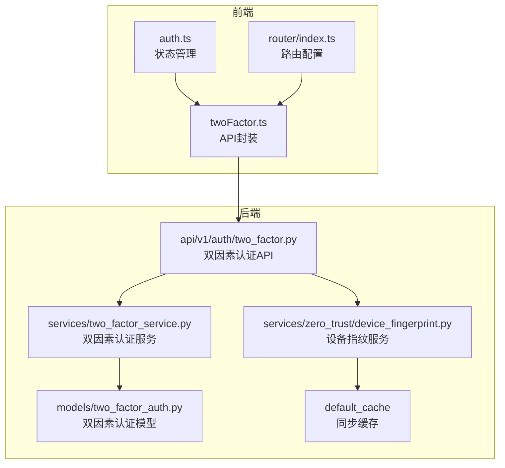
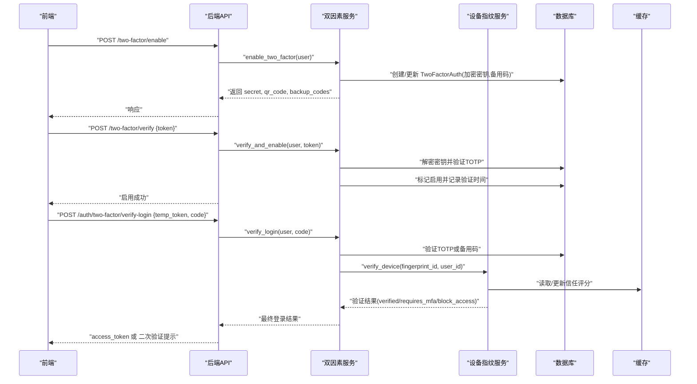
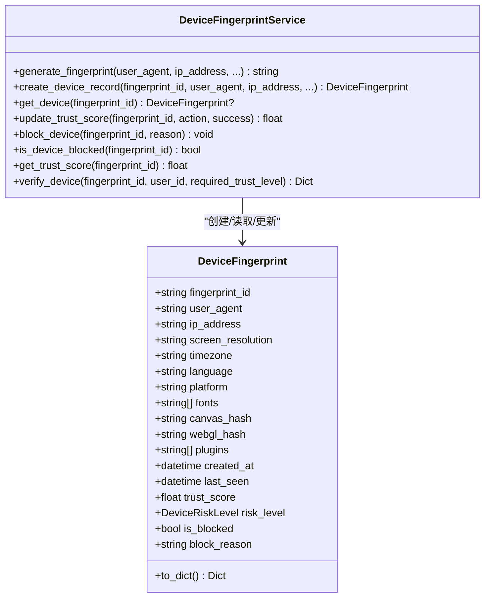
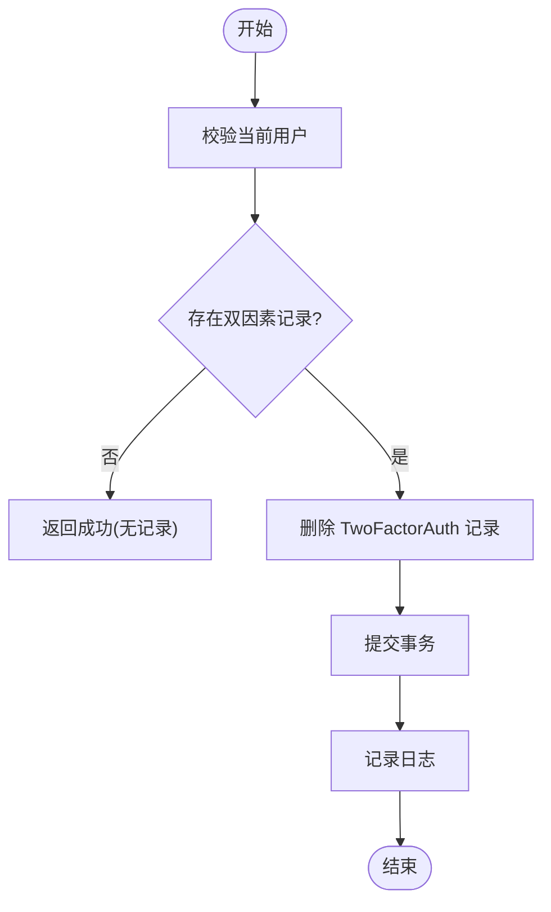
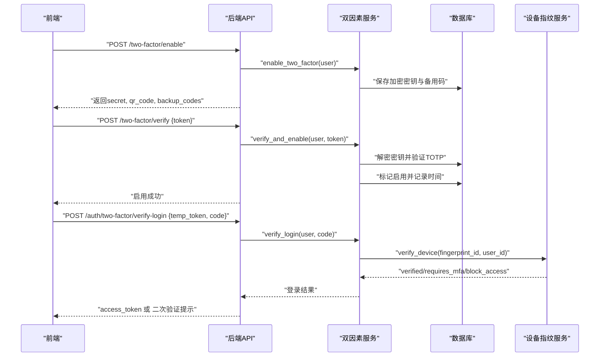
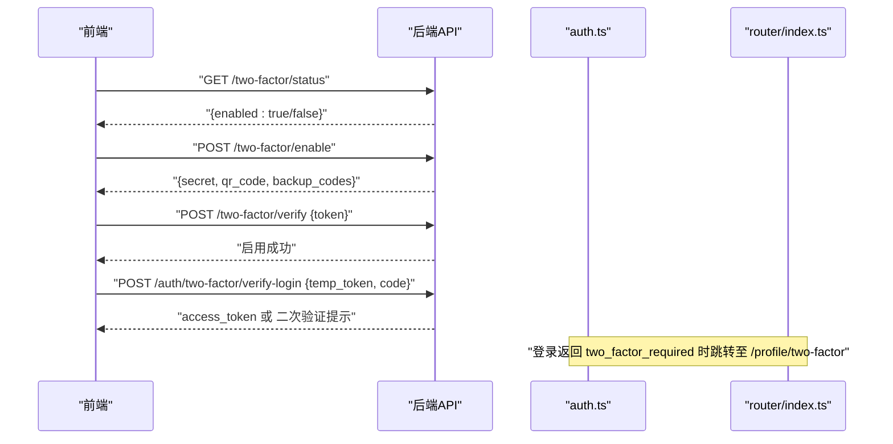
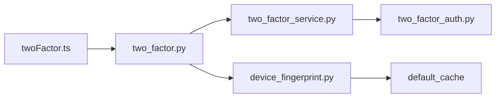

# 设备管理

<cite>
**本文引用的文件**
- [two_factor_auth.py](file://backend/app/models/two_factor_auth.py)
- [two_factor_service.py](file://backend/app/services/two_factor_service.py)
- [two_factor.py](file://backend/app/api/v1/auth/two_factor.py)
- [device_fingerprint.py](file://backend/app/services/zero_trust/device_fingerprint.py)
- [twoFactor.ts](file://frontend/src/api/twoFactor.ts)
- [auth.ts](file://frontend/src/stores/auth.ts)
- [index.ts](file://frontend/src/router/index.ts)
</cite>

## 目录
1. [简介](#简介)
2. [项目结构](#项目结构)
3. [核心组件](#核心组件)
4. [架构总览](#架构总览)
5. [详细组件分析](#详细组件分析)
6. [依赖关系分析](#依赖关系分析)
7. [性能考虑](#性能考虑)
8. [故障排查指南](#故障排查指南)
9. [结论](#结论)
10. [附录](#附录)

## 简介
本技术文档围绕“双因素认证设备管理”能力，系统化阐述设备绑定机制、设备列表查询、设备解绑操作与最佳实践。系统采用零信任设备指纹与TOTP双因素认证相结合：设备指纹用于识别与评估设备可信度，双因素认证用于在登录或敏感操作中强化身份验证。文档覆盖前后端交互流程、数据模型、服务实现、API接口、缓存策略与安全控制点，并提供可操作的排障建议与优化方案。

## 项目结构
后端以分层架构组织：
- 模型层：定义双因素认证持久化模型（用户与TOTP密钥、备用码、启用状态等）。
- 服务层：封装双因素认证业务逻辑（生成密钥、二维码、校验TOTP、启用/禁用、登录校验）以及设备指纹服务（生成指纹、计算信任评分、风险等级判定、封禁与解封、信任度更新）。
- API层：暴露REST接口供前端调用（启用、验证、禁用、状态查询、登录二次验证）。
- 缓存层：使用同步缓存存储设备指纹与信任评分，避免频繁数据库访问。

前端提供双因素认证相关API封装、路由配置与状态管理，支持启用/验证/禁用流程及登录时二次验证跳转。

图表来源
- [two_factor.py:1-88](file://backend/app/api/v1/auth/two_factor.py#L1-L88)
- [two_factor_service.py:1-251](file://backend/app/services/two_factor_service.py#L1-L251)
- [device_fingerprint.py:1-391](file://backend/app/services/zero_trust/device_fingerprint.py#L1-L391)
- [two_factor_auth.py:1-40](file://backend/app/models/two_factor_auth.py#L1-L40)
- [twoFactor.ts:1-79](file://frontend/src/api/twoFactor.ts#L1-L79)
- [auth.ts:160-190](file://frontend/src/stores/auth.ts#L160-L190)
- [index.ts:55-65](file://frontend/src/router/index.ts#L55-L65)

章节来源
- [two_factor.py:1-88](file://backend/app/api/v1/auth/two_factor.py#L1-L88)
- [two_factor_service.py:1-251](file://backend/app/services/two_factor_service.py#L1-L251)
- [device_fingerprint.py:1-391](file://backend/app/services/zero_trust/device_fingerprint.py#L1-L391)
- [two_factor_auth.py:1-40](file://backend/app/models/two_factor_auth.py#L1-L40)
- [twoFactor.ts:1-79](file://frontend/src/api/twoFactor.ts#L1-L79)
- [auth.ts:160-190](file://frontend/src/stores/auth.ts#L160-L190)
- [index.ts:55-65](file://frontend/src/router/index.ts#L55-L65)

## 核心组件
- 双因素认证模型（TwoFactorAuth）：存储用户ID、加密的TOTP密钥、备用恢复码、启用标志、验证时间戳等。
- 双因素认证服务（TwoFactorService）：负责密钥生成、二维码生成、TOTP校验、启用/禁用、登录时TOTP或备用码校验。
- 设备指纹服务（DeviceFingerprintService）：负责设备指纹生成、信任评分计算、风险等级判定、封禁检查、信任度动态更新。
- 双因素认证API（two_factor.py）：对外暴露启用、验证、禁用、状态查询、登录二次验证接口。
- 前端API封装（twoFactor.ts）：封装启用、验证、禁用、状态查询、登录二次验证请求。
- 前端状态与路由（auth.ts、router/index.ts）：处理登录流程中的“需要2FA”分支，跳转到相应页面完成二次验证。

章节来源
- [two_factor_auth.py:13-39](file://backend/app/models/two_factor_auth.py#L13-L39)
- [two_factor_service.py:23-251](file://backend/app/services/two_factor_service.py#L23-L251)
- [device_fingerprint.py:22-391](file://backend/app/services/zero_trust/device_fingerprint.py#L22-L391)
- [two_factor.py:14-88](file://backend/app/api/v1/auth/two_factor.py#L14-L88)
- [twoFactor.ts:8-79](file://frontend/src/api/twoFactor.ts#L8-L79)
- [auth.ts:160-190](file://frontend/src/stores/auth.ts#L160-L190)
- [index.ts:55-65](file://frontend/src/router/index.ts#L55-L65)

## 架构总览
系统通过“设备指纹 + TOTP双因素”形成双重保障：
- 设备指纹用于识别设备并评估其可信度，结合行为更新信任评分，必要时触发MFA或阻断。
- TOTP用于在登录或关键操作时进行强身份验证，支持备用码应急。

图表来源
- [two_factor.py:31-88](file://backend/app/api/v1/auth/two_factor.py#L31-L88)
- [two_factor_service.py:103-215](file://backend/app/services/two_factor_service.py#L103-L215)
- [device_fingerprint.py:325-386](file://backend/app/services/zero_trust/device_fingerprint.py#L325-L386)

## 详细组件分析

### 设备绑定机制（设备标识符生成、绑定关系存储、设备状态管理）
- 设备标识符生成：基于User-Agent、IP、屏幕分辨率、平台、语言、Canvas/WebGL哈希等特征拼接后SHA256截断生成唯一指纹ID。
- 绑定关系存储：设备信息以字典形式存入同步缓存，键前缀为“device_fp:”，TTL为30天；信任评分单独缓存，键前缀“trust_score:”，TTL为1小时。
- 设备状态管理：包含信任评分、风险等级、是否封禁、封禁原因、最后访问时间等；支持根据行为（登录、MFA验证、可疑活动、导出失败）动态调整信任评分并重新评估风险等级。

图表来源
- [device_fingerprint.py:31-65](file://backend/app/services/zero_trust/device_fingerprint.py#L31-L65)
- [device_fingerprint.py:98-152](file://backend/app/services/zero_trust/device_fingerprint.py#L98-L152)
- [device_fingerprint.py:203-235](file://backend/app/services/zero_trust/device_fingerprint.py#L203-L235)
- [device_fingerprint.py:237-323](file://backend/app/services/zero_trust/device_fingerprint.py#L237-L323)
- [device_fingerprint.py:325-386](file://backend/app/services/zero_trust/device_fingerprint.py#L325-L386)

章节来源
- [device_fingerprint.py:98-152](file://backend/app/services/zero_trust/device_fingerprint.py#L98-L152)
- [device_fingerprint.py:203-235](file://backend/app/services/zero_trust/device_fingerprint.py#L203-L235)
- [device_fingerprint.py:237-323](file://backend/app/services/zero_trust/device_fingerprint.py#L237-L323)
- [device_fingerprint.py:325-386](file://backend/app/services/zero_trust/device_fingerprint.py#L325-L386)

### 设备列表查询功能（设备信息展示、状态筛选、历史记录查看）
- 设备信息展示：通过设备指纹ID获取设备详情（包括UA、IP、平台、字体、Canvas/WebGL哈希、信任评分、风险等级、封禁状态等）。
- 状态筛选：依据风险等级与封禁状态进行过滤（低风险/中风险/高风险/严重风险），支持仅显示未封禁设备。
- 历史记录查看：设备记录包含创建时间与最后访问时间，可用于统计活跃设备与最近登录情况。

说明：当前实现将设备信息保存在缓存中，可通过设备指纹ID检索；如需持久化历史，可在后续扩展中将设备记录写入数据库表并增加索引。

章节来源
- [device_fingerprint.py:208-235](file://backend/app/services/zero_trust/device_fingerprint.py#L208-L235)
- [device_fingerprint.py:325-386](file://backend/app/services/zero_trust/device_fingerprint.py#L325-L386)

### 设备解绑操作（安全验证、数据清理、权限控制）
- 安全验证：解绑需通过已认证用户上下文（当前登录用户），确保只有设备所有者或管理员可执行。
- 数据清理：解绑对应的是禁用双因素认证（删除TwoFactorAuth记录），释放与该用户关联的TOTP密钥与备用码；设备指纹本身不直接“解绑”，但可通过封禁设备阻止其继续访问。
- 权限控制：API层依赖当前活跃用户依赖注入，服务层在执行删除前校验是否存在记录，保证幂等性与安全性。

图表来源
- [two_factor_service.py:217-231](file://backend/app/services/two_factor_service.py#L217-L231)
- [two_factor.py:69-78](file://backend/app/api/v1/auth/two_factor.py#L69-L78)

章节来源
- [two_factor_service.py:217-231](file://backend/app/services/two_factor_service.py#L217-L231)
- [two_factor.py:69-78](file://backend/app/api/v1/auth/two_factor.py#L69-L78)

### 双因素认证流程（启用、验证、登录二次验证）
- 启用：生成TOTP密钥与备用码，生成二维码，保存加密密钥到数据库。
- 验证：校验用户输入的TOTP令牌，成功后标记启用并记录验证时间。
- 登录二次验证：支持TOTP或备用码，结合设备指纹验证结果决定是否放行或要求额外挑战。

图表来源
- [two_factor.py:31-88](file://backend/app/api/v1/auth/two_factor.py#L31-L88)
- [two_factor_service.py:103-215](file://backend/app/services/two_factor_service.py#L103-L215)
- [device_fingerprint.py:325-386](file://backend/app/services/zero_trust/device_fingerprint.py#L325-L386)

章节来源
- [two_factor.py:31-88](file://backend/app/api/v1/auth/two_factor.py#L31-L88)
- [two_factor_service.py:103-215](file://backend/app/services/two_factor_service.py#L103-L215)
- [device_fingerprint.py:325-386](file://backend/app/services/zero_trust/device_fingerprint.py#L325-L386)

### 前端交互流程（启用、验证、禁用、状态查询、登录二次验证）
- 启用：调用启用接口，展示二维码与备用码，引导用户扫描并输入验证码。
- 验证：提交验证码，成功后提示启用完成。
- 禁用：调用禁用接口，移除双因素配置。
- 状态查询：获取当前用户的双因素启用状态。
- 登录二次验证：当登录返回“需要2FA”时，前端跳转到指定路由，使用临时令牌与验证码完成登录。

图表来源
- [twoFactor.ts:39-68](file://frontend/src/api/twoFactor.ts#L39-L68)
- [auth.ts:168-190](file://frontend/src/stores/auth.ts#L168-L190)
- [index.ts:55-65](file://frontend/src/router/index.ts#L55-L65)

章节来源
- [twoFactor.ts:39-68](file://frontend/src/api/twoFactor.ts#L39-L68)
- [auth.ts:168-190](file://frontend/src/stores/auth.ts#L168-L190)
- [index.ts:55-65](file://frontend/src/router/index.ts#L55-L65)

## 依赖关系分析
- 双因素认证API依赖双因素服务与当前用户上下文，服务依赖数据库会话与加密服务。
- 设备指纹服务依赖同步缓存，避免异步缓存导致的协程对象误用问题。
- 前端API封装统一调用后端接口，状态管理处理登录流程分支，路由配置提供二次验证页面入口。

图表来源
- [twoFactor.ts:39-68](file://frontend/src/api/twoFactor.ts#L39-L68)
- [two_factor.py:31-88](file://backend/app/api/v1/auth/two_factor.py#L31-L88)
- [two_factor_service.py:103-215](file://backend/app/services/two_factor_service.py#L103-L215)
- [two_factor_auth.py:13-39](file://backend/app/models/two_factor_auth.py#L13-L39)
- [device_fingerprint.py:203-235](file://backend/app/services/zero_trust/device_fingerprint.py#L203-L235)

章节来源
- [twoFactor.ts:39-68](file://frontend/src/api/twoFactor.ts#L39-L68)
- [two_factor.py:31-88](file://backend/app/api/v1/auth/two_factor.py#L31-L88)
- [two_factor_service.py:103-215](file://backend/app/services/two_factor_service.py#L103-L215)
- [two_factor_auth.py:13-39](file://backend/app/models/two_factor_auth.py#L13-L39)
- [device_fingerprint.py:203-235](file://backend/app/services/zero_trust/device_fingerprint.py#L203-L235)

## 性能考虑
- 缓存优先：设备指纹与信任评分使用同步缓存，减少数据库压力；信任评分短期缓存提升查询效率。
- 懒加载依赖：二维码生成依赖qrcode库，按需导入以避免模块导入开销影响启动与测试收集。
- 事务提交：双因素启用/禁用使用安全提交，确保数据一致性。
- 风险等级阈值：合理设置信任评分阈值与风险等级，平衡用户体验与安全强度。

[本节为通用指导，不直接分析具体文件]

## 故障排查指南
- 启用失败：检查是否已启用、数据库写入是否成功、加密服务是否正常。
- 验证失败：确认TOTP时间窗口、备用码是否被使用过、密钥是否正确解密。
- 登录二次验证失败：检查临时令牌有效性、验证码正确性、设备指纹验证结果（是否被封禁或高风险）。
- 设备封禁：查看封禁原因与封禁列表，必要时解除封禁并重置信任评分。

章节来源
- [two_factor_service.py:103-215](file://backend/app/services/two_factor_service.py#L103-L215)
- [device_fingerprint.py:284-307](file://backend/app/services/zero_trust/device_fingerprint.py#L284-L307)
- [two_factor.py:31-88](file://backend/app/api/v1/auth/two_factor.py#L31-L88)

## 结论
本系统通过设备指纹与TOTP双因素认证构建起完整的设备管理与安全验证体系。设备指纹用于识别与风险评估，双因素认证用于强身份验证；两者协同提升了登录与敏感操作的安全性。建议在后续版本中增强设备记录的持久化与审计能力，完善设备列表查询与历史追踪，进一步优化用户体验与安全策略。

[本节为总结性内容，不直接分析具体文件]

## 附录
- 最佳实践
  - 设备数量限制：按用户维度限制同时活跃设备数，防止滥用。
  - 安全策略：对高风险设备强制MFA，对严重风险设备自动封禁；定期审查封禁列表。
  - 用户体验优化：清晰展示二维码与备用码，提供便捷的启用/禁用流程；登录时明确提示二次验证步骤。
  - 数据清理：解绑时彻底删除敏感数据（TOTP密钥与备用码），确保隐私合规。
  - 监控与审计：记录启用、验证、禁用、封禁等操作日志，便于追溯与分析。

[本节为通用指导，不直接分析具体文件]