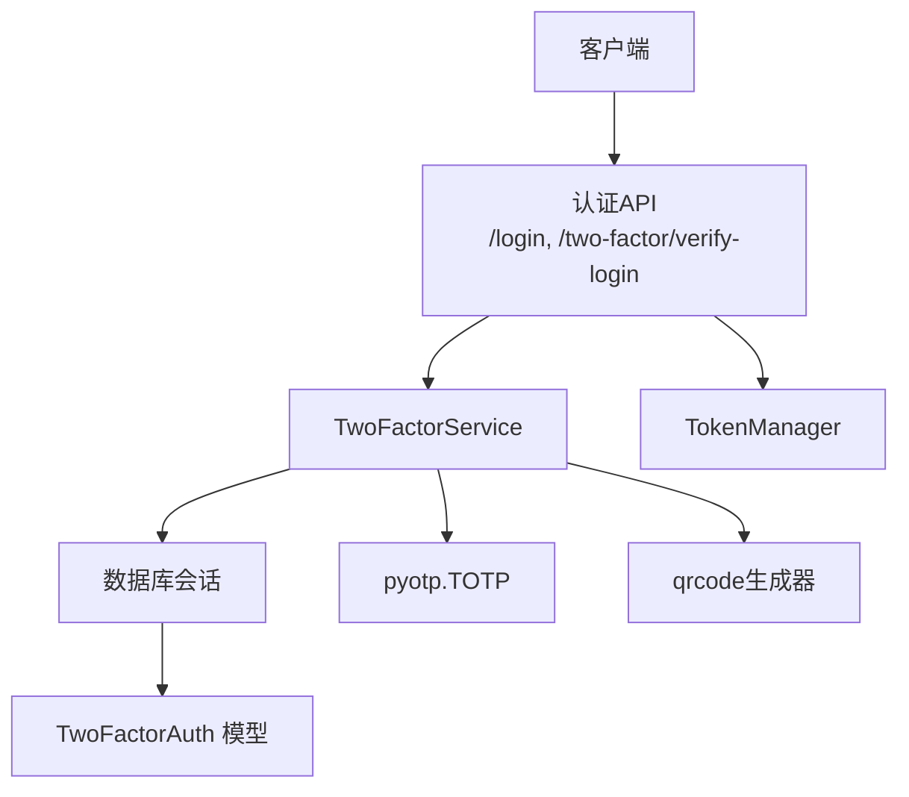
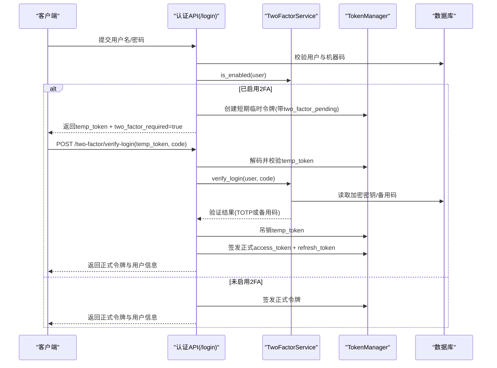
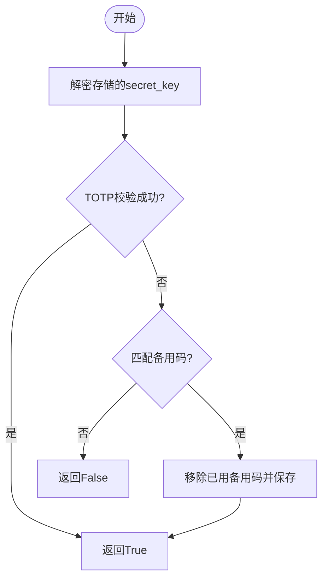
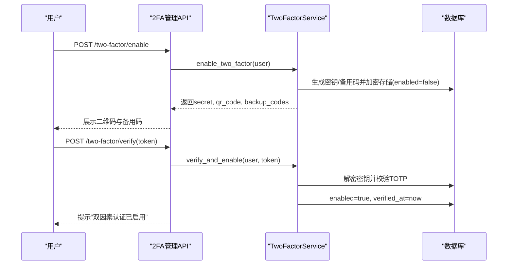
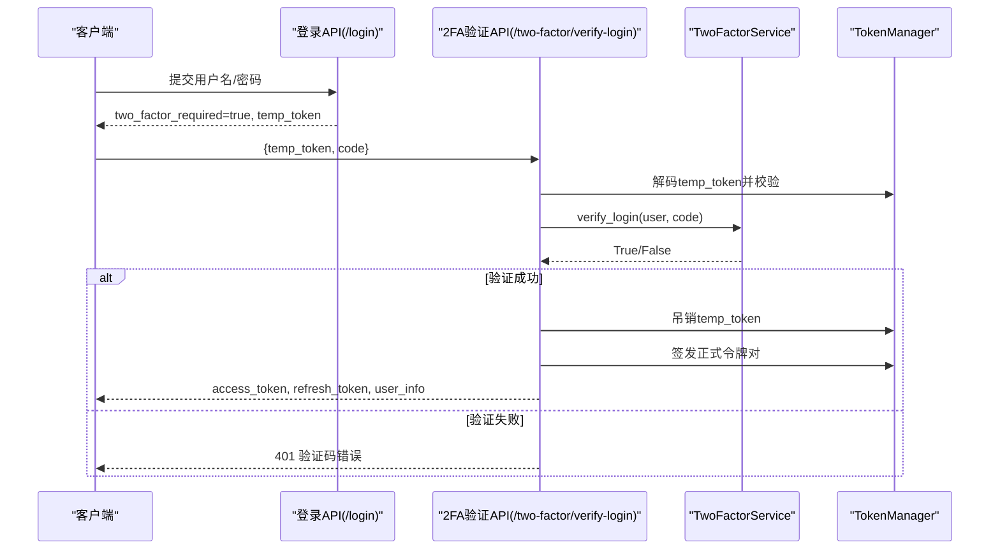
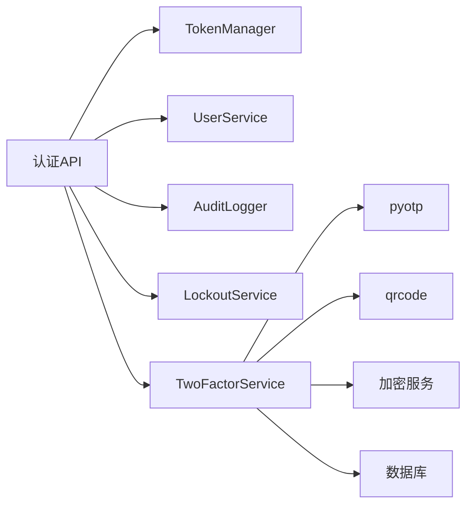

# 验证流程

<cite>
**本文引用的文件**
- [two_factor_service.py](file://backend/app/services/two_factor_service.py)
- [two_factor_auth.py](file://backend/app/models/two_factor_auth.py)
- [auth.py](file://backend/app/api/v1/auth/auth.py)
- [two_factor.py](file://backend/app/api/v1/auth/two_factor.py)
- [auth.py（schemas）](file://backend/app/schemas/auth.py)
- [test_two_factor_service.py](file://backend/tests/unit/test_two_factor_service.py)
- [test_auth_2fa_api_cov.py](file://backend/tests/unit/test_auth_2fa_api_cov.py)
</cite>

## 目录
1. [简介](#简介)
2. [项目结构](#项目结构)
3. [核心组件](#核心组件)
4. [架构总览](#架构总览)
5. [详细组件分析](#详细组件分析)
6. [依赖关系分析](#依赖关系分析)
7. [性能与安全性考量](#性能与安全性考量)
8. [故障排查指南](#故障排查指南)
9. [结论](#结论)
10. [附录：API示例与错误响应](#附录api示例与错误响应)

## 简介
本技术文档围绕双因素认证（2FA）的完整验证流程，重点说明TOTP验证码的验证算法、时间窗口匹配与容错机制、启用/禁用流程中的临时状态管理与二次确认、登录时的2FA集成（令牌传递与会话管理）、以及失败重试与锁定策略。文档同时提供完整的API调用示例与错误响应格式说明，便于前后端对接与问题定位。

## 项目结构
与2FA相关的后端代码主要分布在以下模块：
- 服务层：TwoFactorService 实现TOTP密钥生成、二维码生成、TOTP校验、备用码校验、启用/禁用与状态查询等。
- 模型层：TwoFactorAuth 持久化用户2FA配置（加密密钥、备用码、启用状态、验证时间等）。
- API层：
  - auth.py：登录流程中检测是否需要2FA；提供 /two-factor/verify-login 完成二次验证并签发正式令牌。
  - two_factor.py：提供启用、验证启用、禁用、状态查询等2FA管理接口。
- Schema层：定义登录请求/响应、2FA登录验证请求等数据结构。

图表来源
- [auth.py:180-287](file://backend/app/api/v1/auth/auth.py#L180-L287)
- [auth.py:290-444](file://backend/app/api/v1/auth/auth.py#L290-L444)
- [two_factor_service.py:23-251](file://backend/app/services/two_factor_service.py#L23-L251)
- [two_factor_auth.py:13-39](file://backend/app/models/two_factor_auth.py#L13-L39)

章节来源
- [auth.py:180-287](file://backend/app/api/v1/auth/auth.py#L180-L287)
- [auth.py:290-444](file://backend/app/api/v1/auth/auth.py#L290-L444)
- [two_factor_service.py:23-251](file://backend/app/services/two_factor_service.py#L23-L251)
- [two_factor_auth.py:13-39](file://backend/app/models/two_factor_auth.py#L13-L39)

## 核心组件
- TwoFactorService：封装TOTP相关能力，包括密钥生成、二维码生成、TOTP校验（含时间窗口容错）、备用码校验、启用/禁用与状态检查。
- TwoFactorAuth 模型：存储用户2FA配置，包含加密后的secret_key、备用码列表、是否启用、验证时间戳等。
- 认证API（auth.py）：在密码与机器码通过后，若检测到用户启用了2FA，则返回临时令牌（带two_factor_pending标记，短时效），引导前端进行二次验证；二次验证成功后吊销临时令牌并签发正式访问令牌与刷新令牌。
- 2FA管理API（two_factor.py）：提供启用、验证启用、禁用、状态查询等接口，用于用户自助开启或关闭2FA。

章节来源
- [two_factor_service.py:23-251](file://backend/app/services/two_factor_service.py#L23-L251)
- [two_factor_auth.py:13-39](file://backend/app/models/two_factor_auth.py#L13-L39)
- [auth.py:180-287](file://backend/app/api/v1/auth/auth.py#L180-L287)
- [auth.py:290-444](file://backend/app/api/v1/auth/auth.py#L290-L444)
- [two_factor.py:1-88](file://backend/app/api/v1/auth/two_factor.py#L1-L88)

## 架构总览
下图展示了从登录到2FA二次验证再到签发正式令牌的完整时序。

图表来源
- [auth.py:180-287](file://backend/app/api/v1/auth/auth.py#L180-L287)
- [auth.py:290-444](file://backend/app/api/v1/auth/auth.py#L290-L444)
- [two_factor_service.py:180-215](file://backend/app/services/two_factor_service.py#L180-L215)

## 详细组件分析

### TOTP验证算法与时间窗口
- 时间窗口与容错：使用 pyotp.TOTP.verify(token, valid_window=1)，允许当前时间步前后各一个时间步（默认30秒步长）的容差，即约±30秒的时间窗口匹配。
- 异常处理：若底层库抛出异常，统一记录日志并返回False，避免异常传播影响主流程。
- 备用码回退：当TOTP校验失败时，尝试匹配备用恢复码；若命中，使用后从数据库中移除该备用码，确保一次性使用。

图表来源
- [two_factor_service.py:83-100](file://backend/app/services/two_factor_service.py#L83-L100)
- [two_factor_service.py:180-215](file://backend/app/services/two_factor_service.py#L180-L215)

章节来源
- [two_factor_service.py:83-100](file://backend/app/services/two_factor_service.py#L83-L100)
- [two_factor_service.py:180-215](file://backend/app/services/two_factor_service.py#L180-L215)
- [test_two_factor_service.py:63-84](file://backend/tests/unit/test_two_factor_service.py#L63-L84)

### 启用2FA流程（临时状态与二次确认）
- 生成密钥与备用码：调用服务生成随机Base32密钥与若干8位数字备用码。
- 安全存储：密钥通过加密服务写入数据库；备用码以JSON数组形式存储。
- 临时启用：首次启用时记录enabled=false，需用户扫描二维码并在应用中输入当前TOTP进行二次确认；确认后设置enabled=true并记录验证时间。
- 管理接口：提供启用、验证启用、禁用、状态查询等REST接口，统一返回结构化响应。

图表来源
- [two_factor.py:31-66](file://backend/app/api/v1/auth/two_factor.py#L31-L66)
- [two_factor_service.py:103-177](file://backend/app/services/two_factor_service.py#L103-L177)

章节来源
- [two_factor.py:31-66](file://backend/app/api/v1/auth/two_factor.py#L31-L66)
- [two_factor_service.py:103-177](file://backend/app/services/two_factor_service.py#L103-L177)

### 登录时的2FA集成（令牌传递与会话管理）
- 初次登录：密码与机器码校验通过后，若用户启用2FA，则签发短期临时令牌（携带two_factor_pending标记，短TTL），并返回two_factor_required=true与temp_token。
- 二次验证：客户端使用temp_token与code调用 /two-factor/verify-login；服务端校验temp_token有效性、是否为pending类型、提取用户名并查找用户，再调用服务层验证TOTP或备用码。
- 签发正式令牌：验证通过后吊销临时令牌，重置失败计数与锁定状态，更新最后登录时间，签发正式access_token与refresh_token，并返回用户信息与权限数据。

图表来源
- [auth.py:180-287](file://backend/app/api/v1/auth/auth.py#L180-L287)
- [auth.py:290-444](file://backend/app/api/v1/auth/auth.py#L290-L444)

章节来源
- [auth.py:180-287](file://backend/app/api/v1/auth/auth.py#L180-L287)
- [auth.py:290-444](file://backend/app/api/v1/auth/auth.py#L290-L444)
- [auth.py（schemas）:53-70](file://backend/app/schemas/auth.py#L53-L70)

### 错误处理与重试/锁定策略
- 速率限制：二次验证复用登录速率限制，防止暴力破解。
- 临时令牌校验：无效或过期、非pending类型或缺少sub字段均返回401。
- 用户状态：用户不存在或被禁用返回401。
- 验证码错误：记录审计日志并返回401。
- 锁定策略：登录失败会累计失败次数，达到阈值将触发账户锁定；成功登录后重置失败计数与锁定状态。具体锁定逻辑由锁服务统一管理，测试覆盖剩余分钟数提示与HTTPException透传。

章节来源
- [auth.py:290-444](file://backend/app/api/v1/auth/auth.py#L290-L444)
- [test_auth_2fa_api_cov.py:83-211](file://backend/tests/unit/test_auth_2fa_api_cov.py#L83-L211)
- [test_lockout_service.py:190-214](file://backend/tests/unit/test_lockout_service.py#L190-L214)

## 依赖关系分析
- TwoFactorService 依赖：
  - pyotp：用于生成与校验TOTP。
  - qrcode：用于生成二维码图片（懒加载以避免导入开销）。
  - 加密服务：用于密钥的加解密。
  - 数据库会话：读写TwoFactorAuth记录。
- 认证API 依赖：
  - TokenManager：签发/解码/吊销令牌。
  - UserService：根据用户名获取用户。
  - AuditLogger：记录登录成功/失败的审计日志。
  - 锁服务：管理失败计数与锁定。

图表来源
- [auth.py:180-287](file://backend/app/api/v1/auth/auth.py#L180-L287)
- [auth.py:290-444](file://backend/app/api/v1/auth/auth.py#L290-L444)
- [two_factor_service.py:23-251](file://backend/app/services/two_factor_service.py#L23-L251)

章节来源
- [auth.py:180-287](file://backend/app/api/v1/auth/auth.py#L180-L287)
- [auth.py:290-444](file://backend/app/api/v1/auth/auth.py#L290-L444)
- [two_factor_service.py:23-251](file://backend/app/services/two_factor_service.py#L23-L251)

## 性能与安全性考量
- 性能
  - 二维码生成采用懒加载导入，避免模块导入阶段的高开销。
  - TOTP校验为轻量计算，时间窗口容错仅增加少量比较。
  - 备用码使用后立即删除，减少后续匹配成本。
- 安全性
  - secret_key以加密形式存储，避免明文泄露。
  - 临时令牌带two_factor_pending标记且短TTL，降低被重放风险。
  - 二次验证前进行速率限制，防止暴力破解。
  - 审计日志记录每次登录尝试的成功/失败原因，便于追踪与风控。
  - 锁定策略结合失败计数与锁定时段，保护账户免受持续攻击。

[本节为通用指导，不直接分析具体文件]

## 故障排查指南
- 常见问题
  - 临时令牌无效或过期：检查客户端是否正确传递temp_token，并确保在有效期内调用二次验证接口。
  - 非pending令牌：确认登录接口返回的temp_token是否带有two_factor_pending标记。
  - 验证码错误：核对设备时间同步情况；若仍失败可尝试备用码。
  - 账户锁定：查看锁定时间与剩余分钟数，等待解锁或联系管理员。
- 定位方法
  - 检查审计日志中的failure_reason字段（如“2FA验证码错误”、“未授权的机器”）。
  - 检查速率限制是否触发（429）。
  - 检查数据库TwoFactorAuth记录是否存在、是否启用、备用码是否已被使用。

章节来源
- [auth.py:290-444](file://backend/app/api/v1/auth/auth.py#L290-L444)
- [test_auth_2fa_api_cov.py:83-211](file://backend/tests/unit/test_auth_2fa_api_cov.py#L83-L211)

## 结论
本系统实现了基于TOTP的双因素认证流程，具备时间窗口容错、备用码回退、临时令牌与二次确认、速率限制与锁定策略等关键安全特性。通过清晰的服务分层与API设计，既保证了安全性，也提供了良好的用户体验与可维护性。建议在生产环境中严格管理密钥与备用码，并结合审计日志与监控进行持续安全运营。

[本节为总结性内容，不直接分析具体文件]

## 附录：API示例与错误响应

### 启用2FA
- 请求
  - 方法：POST
  - 路径：/api/v1/auth/two-factor/enable
  - 鉴权：需要已登录用户
- 响应
  - 成功：返回secret、qr_code（Base64图片）、backup_codes（备用码列表）
  - 失败：400（已启用或参数错误）、500（服务器错误）

章节来源
- [two_factor.py:31-43](file://backend/app/api/v1/auth/two_factor.py#L31-L43)

### 验证并启用2FA
- 请求
  - 方法：POST
  - 路径：/api/v1/auth/two-factor/verify
  - 请求体：{ "token": "当前TOTP验证码" }
- 响应
  - 成功：返回启用成功消息
  - 失败：400（验证码错误）、500（服务器错误）

章节来源
- [two_factor.py:46-66](file://backend/app/api/v1/auth/two_factor.py#L46-L66)

### 禁用2FA
- 请求
  - 方法：POST
  - 路径：/api/v1/auth/two-factor/disable
- 响应
  - 成功：返回禁用成功消息
  - 失败：500（服务器错误）

章节来源
- [two_factor.py:69-78](file://backend/app/api/v1/auth/two_factor.py#L69-L78)

### 查询2FA状态
- 请求
  - 方法：GET
  - 路径：/api/v1/auth/two-factor/status
- 响应
  - 成功：{ "enabled": true/false }

章节来源
- [two_factor.py:81-87](file://backend/app/api/v1/auth/two_factor.py#L81-L87)

### 登录流程（含2FA）
- 初次登录
  - 方法：POST
  - 路径：/api/v1/auth/login
  - 请求体：{ "username": "...", "password": "..." }
  - 响应（需要2FA）：{ "two_factor_required": true, "temp_token": "..." }
  - 响应（无需2FA）：{ "data": { "access_token": "...", "user": {...} }, "refresh_token": "..." }
- 二次验证
  - 方法：POST
  - 路径：/api/v1/auth/two-factor/verify-login
  - 请求体：{ "temp_token": "...", "code": "TOTP或备用码" }
  - 响应（成功）：{ "data": { "access_token": "...", "user": {...} }, "refresh_token": "..." }
  - 响应（失败）：401（验证码错误、临时令牌无效等）

章节来源
- [auth.py:180-287](file://backend/app/api/v1/auth/auth.py#L180-L287)
- [auth.py:290-444](file://backend/app/api/v1/auth/auth.py#L290-L444)
- [auth.py（schemas）:53-70](file://backend/app/schemas/auth.py#L53-L70)

### 常见错误响应
- 401 Unauthorized
  - 临时令牌无效或已过期
  - 无效的临时令牌（非pending或缺少sub）
  - 用户不存在或已被禁用
  - 验证码错误
- 403 Forbidden
  - 未授权的机器
- 423 Locked
  - 账户处于锁定状态（包含剩余分钟数提示）
- 429 Too Many Requests
  - 验证尝试过于频繁

章节来源
- [auth.py:290-444](file://backend/app/api/v1/auth/auth.py#L290-L444)
- [test_auth_2fa_api_cov.py:83-211](file://backend/tests/unit/test_auth_2fa_api_cov.py#L83-L211)
- [test_lockout_service.py:190-214](file://backend/tests/unit/test_lockout_service.py#L190-L214)