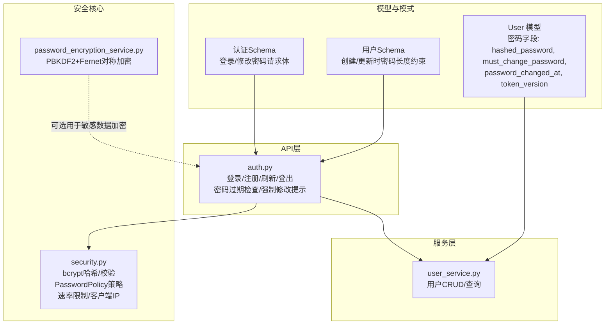
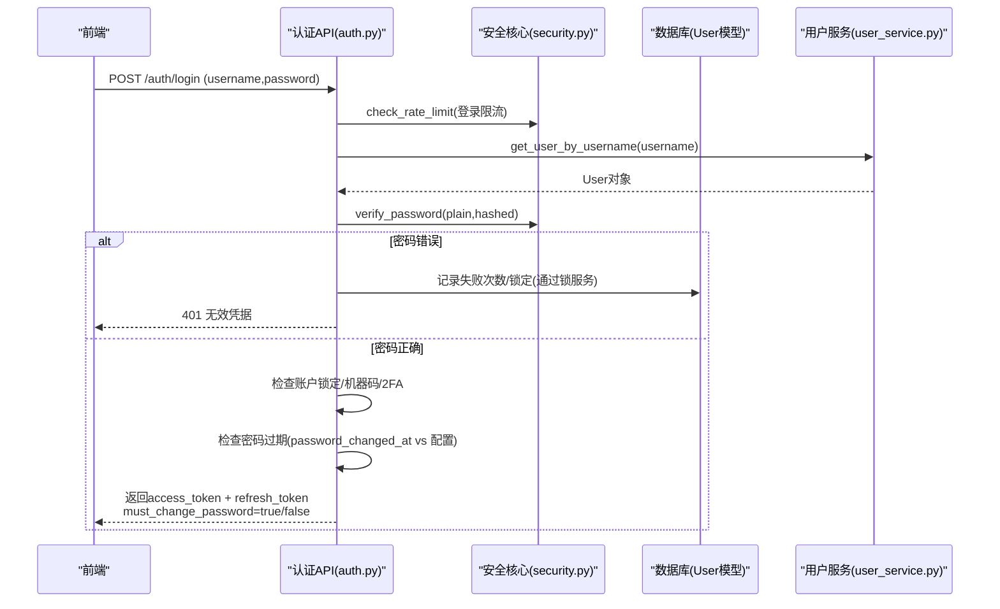
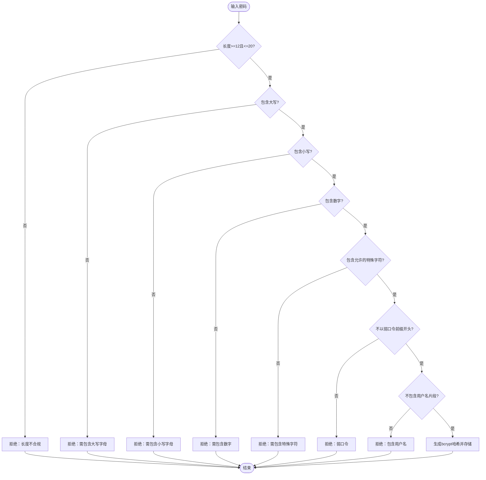
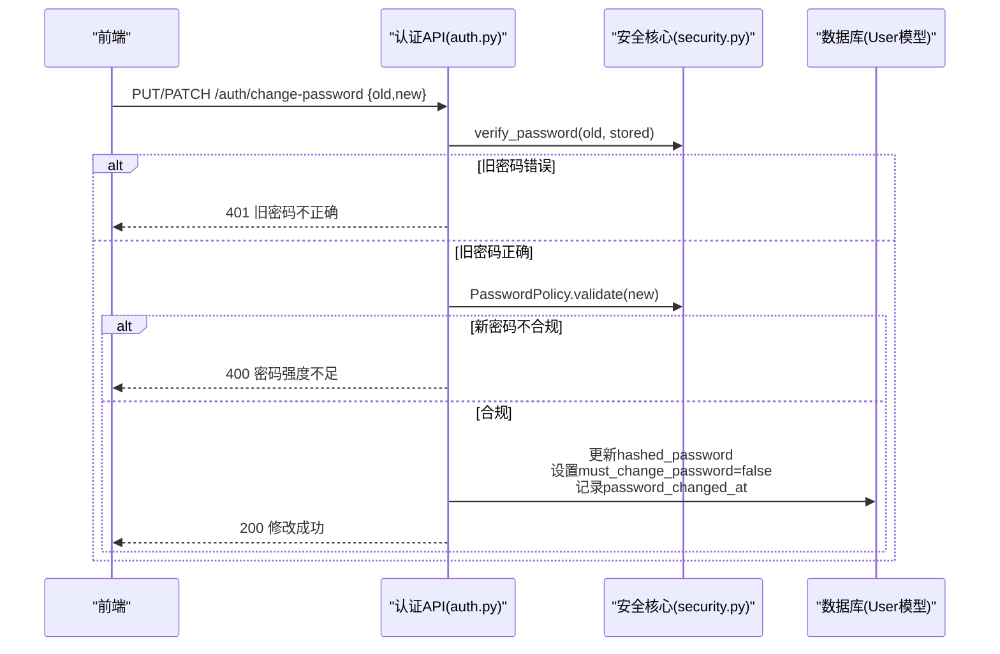
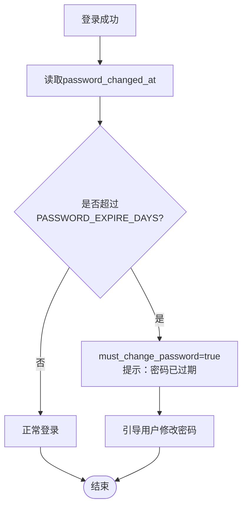
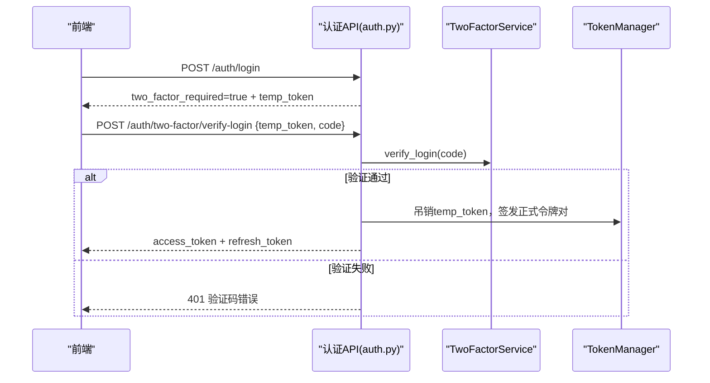
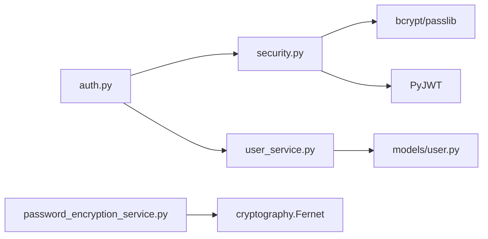

# 密码管理

<cite>
**本文引用的文件**
- [backend/app/models/user.py](file://backend/app/models/user.py)
- [backend/app/schemas/user.py](file://backend/app/schemas/user.py)
- [backend/app/schemas/auth.py](file://backend/app/schemas/auth.py)
- [backend/app/api/v1/auth/auth.py](file://backend/app/api/v1/auth/auth.py)
- [backend/app/core/security.py](file://backend/app/core/security.py)
- [backend/app/services/password_encryption_service.py](file://backend/app/services/password_encryption_service.py)
- [backend/app/services/user_service.py](file://backend/app/services/user_service.py)
</cite>

## 目录
1. [简介](#简介)
2. [项目结构](#项目结构)
3. [核心组件](#核心组件)
4. [架构总览](#架构总览)
5. [详细组件分析](#详细组件分析)
6. [依赖关系分析](#依赖关系分析)
7. [性能考虑](#性能考虑)
8. [故障排查指南](#故障排查指南)
9. [结论](#结论)
10. [附录：API使用示例](#附录api使用示例)

## 简介
本技术文档聚焦“用户密码管理”能力，覆盖密码安全策略、哈希存储与校验、密码修改流程、密码过期策略、以及密码相关API的使用说明与安全最佳实践。系统采用业界成熟的bcrypt进行密码哈希存储，结合严格的密码强度策略、登录速率限制、账户锁定机制、令牌版本控制与审计日志，形成端到端的安全闭环。同时提供基于PBKDF2+Fernet的“基于密码的加密服务”，用于对敏感数据（如文件）进行可恢复的对称加密。

## 项目结构
围绕密码管理的代码主要分布在以下模块：
- 模型层：用户实体与密码相关字段
- 模式层：请求/响应数据结构定义
- 认证API：登录、注册、刷新、登出等接口
- 安全核心：密码哈希、验证、策略、速率限制、JWT工具
- 服务层：用户服务、密码加密服务
- 配置与常量：密码有效期、失败次数、锁定时间等

图表来源
- [backend/app/models/user.py:37-85](file://backend/app/models/user.py#L37-L85)
- [backend/app/schemas/user.py:21-36](file://backend/app/schemas/user.py#L21-L36)
- [backend/app/schemas/auth.py:8-13](file://backend/app/schemas/auth.py#L8-L13)
- [backend/app/api/v1/auth/auth.py:101-287](file://backend/app/api/v1/auth/auth.py#L101-L287)
- [backend/app/core/security.py:120-148](file://backend/app/core/security.py#L120-L148)
- [backend/app/services/password_encryption_service.py:23-138](file://backend/app/services/password_encryption_service.py#L23-L138)

章节来源
- [backend/app/models/user.py:37-85](file://backend/app/models/user.py#L37-L85)
- [backend/app/schemas/user.py:21-36](file://backend/app/schemas/user.py#L21-L36)
- [backend/app/schemas/auth.py:8-13](file://backend/app/schemas/auth.py#L8-L13)
- [backend/app/api/v1/auth/auth.py:101-287](file://backend/app/api/v1/auth/auth.py#L101-L287)
- [backend/app/core/security.py:120-148](file://backend/app/core/security.py#L120-L148)
- [backend/app/services/password_encryption_service.py:23-138](file://backend/app/services/password_encryption_service.py#L23-L138)

## 核心组件
- 用户模型（User）
  - 关键字段：hashed_password（哈希密码）、must_change_password（是否强制修改）、password_changed_at（最后修改时间）、token_version（令牌版本，支持强制下线）。
  - 辅助方法：revoke_all_tokens() 递增版本号并记录修改时间，使所有现有JWT立即失效。
- 安全核心（security.py）
  - 密码哈希：基于bcrypt（通过passlib CryptContext），提供 get_password_hash/hash_password 与 verify_password。
  - 密码策略：PasswordPolicy 校验最小长度、大小写、数字、特殊字符、弱口令前缀、用户名包含检测等。
  - 速率限制：check_rate_limit 滑动窗口限流，保护登录、注册、刷新等接口。
  - JWT：create_access_token/create_refresh_token/decode_token，配合黑名单与类型校验。
- 认证API（auth.py）
  - 登录：校验用户名/密码、账户锁定、机器码绑定、2FA临时令牌、密码过期检查、返回must_change_password。
  - 注册：用户名与密码策略校验、速率限制。
  - 刷新：仅接受refresh_token，轮换旧令牌，签发新对。
  - 登出：吊销当前access_token，递增token_version使全部会话失效。
- 用户服务（user_service.py）
  - 提供用户查询、创建、更新、删除；创建用户时对密码进行哈希存储。
- 基于密码的加密服务（password_encryption_service.py）
  - 使用PBKDF2-HMAC-SHA256派生密钥，Fernet对称加密/解密，适用于敏感数据或文件的加解密。

章节来源
- [backend/app/models/user.py:37-85](file://backend/app/models/user.py#L37-L85)
- [backend/app/models/user.py:145-149](file://backend/app/models/user.py#L145-L149)
- [backend/app/core/security.py:120-148](file://backend/app/core/security.py#L120-L148)
- [backend/app/core/security.py:524-590](file://backend/app/core/security.py#L524-L590)
- [backend/app/api/v1/auth/auth.py:101-287](file://backend/app/api/v1/auth/auth.py#L101-L287)
- [backend/app/services/user_service.py:76-95](file://backend/app/services/user_service.py#L76-L95)
- [backend/app/services/password_encryption_service.py:23-138](file://backend/app/services/password_encryption_service.py#L23-L138)

## 架构总览
下图展示密码管理在系统中的关键交互：前端调用认证API，后端通过安全核心完成密码校验与策略检查，必要时触发账户锁定与审计；登录成功后根据密码过期策略决定是否要求修改密码；登出时通过令牌版本控制实现全局失效。

图表来源
- [backend/app/api/v1/auth/auth.py:101-287](file://backend/app/api/v1/auth/auth.py#L101-L287)
- [backend/app/core/security.py:120-148](file://backend/app/core/security.py#L120-L148)
- [backend/app/services/user_service.py:26-32](file://backend/app/services/user_service.py#L26-L32)
- [backend/app/models/user.py:37-85](file://backend/app/models/user.py#L37-L85)

## 详细组件分析

### 密码安全策略与存储
- 密码强度验证规则（PasswordPolicy）
  - 最小长度：至少12位
  - 必须包含：大写字母、小写字母、数字、特殊字符（白名单集合）
  - 最大长度：不超过20位
  - 弱口令前缀：禁止以 admin/root/123/password/qwerty 等开头
  - 用户名关联：密码不能包含用户名片段
- 哈希存储算法
  - 使用 bcrypt（通过 passlib CryptContext）进行不可逆哈希存储
  - 为兼容bcrypt 5.x，内部对超长密码进行截断处理，避免异常
  - 提供统一的哈希与校验函数，确保全链路一致
- 敏感数据加密（可选）
  - 基于PBKDF2-HMAC-SHA256派生密钥，Fernet对称加密
  - 适用于需要“可恢复”的敏感数据或文件场景

图表来源
- [backend/app/core/security.py:524-590](file://backend/app/core/security.py#L524-L590)
- [backend/app/core/security.py:120-148](file://backend/app/core/security.py#L120-L148)

章节来源
- [backend/app/core/security.py:524-590](file://backend/app/core/security.py#L524-L590)
- [backend/app/core/security.py:120-148](file://backend/app/core/security.py#L120-L148)

### 密码修改流程
- 入口与校验
  - 修改密码请求体包含 old_password 与 new_password（最小长度12）
  - 服务端先验证旧密码是否正确（verify_password）
  - 对新密码执行 PasswordPolicy 强度校验
- 更新与副作用
  - 将新密码哈希后写入用户表
  - 重置 must_change_password 标志
  - 记录 password_changed_at 时间戳
  - 可选择递增 token_version 使旧令牌失效（登出/强制下线场景）
- 审计与防护
  - 登录失败计数与账户锁定由锁服务统一处理
  - 所有变更均通过事务提交，失败回滚

图表来源
- [backend/app/schemas/auth.py:72-77](file://backend/app/schemas/auth.py#L72-L77)
- [backend/app/core/security.py:120-148](file://backend/app/core/security.py#L120-L148)
- [backend/app/core/security.py:524-590](file://backend/app/core/security.py#L524-L590)
- [backend/app/models/user.py:37-85](file://backend/app/models/user.py#L37-L85)

章节来源
- [backend/app/schemas/auth.py:72-77](file://backend/app/schemas/auth.py#L72-L77)
- [backend/app/core/security.py:120-148](file://backend/app/core/security.py#L120-L148)
- [backend/app/core/security.py:524-590](file://backend/app/core/security.py#L524-L590)
- [backend/app/models/user.py:37-85](file://backend/app/models/user.py#L37-L85)

### 密码过期策略
- 有效期检查
  - 登录时读取 password_changed_at，若超过配置的 PASSWORD_EXPIRE_DAYS，则标记为已过期
  - 响应中 must_change_password=true，并提示“密码已过期，请修改密码”
- 强制修改提示
  - 首次登录或管理员强制修改时，must_change_password=true，前端应引导用户修改
- 自动提醒机制
  - 当前登录流程已在响应中携带 must_change_password 标志，前端可根据该标志进行提示
  - 如需定时提醒，可在后台任务中扫描即将过期的用户并发送通知（可扩展）

图表来源
- [backend/app/api/v1/auth/auth.py:256-287](file://backend/app/api/v1/auth/auth.py#L256-L287)
- [backend/app/models/user.py:37-85](file://backend/app/models/user.py#L37-L85)

章节来源
- [backend/app/api/v1/auth/auth.py:256-287](file://backend/app/api/v1/auth/auth.py#L256-L287)
- [backend/app/models/user.py:37-85](file://backend/app/models/user.py#L37-L85)

### 密码重置与找回
- 当前仓库未提供独立的“密码重置/找回”API端点
- 建议方案（实施层面）：
  - 管理员重置：管理员调用用户更新接口，直接设置新密码（需遵循强度策略）
  - 自助重置：引入“重置令牌”机制（邮件链接+短期有效），校验后跳转修改密码页面
  - 安全加固：重置过程需记录审计日志、限制频率、验证码/二次确认

章节来源
- [backend/app/schemas/user.py:21-36](file://backend/app/schemas/user.py#L21-L36)
- [backend/app/core/security.py:524-590](file://backend/app/core/security.py#L524-L590)

### 双因素认证与登录安全
- 登录流程中，若启用2FA，将返回临时令牌（temp_token），需在限定时间内使用TOTP或备用码换取正式令牌
- 登录失败会累计失败次数，达到阈值后账户将被锁定一段时间（通过锁服务原子操作）
- 登录与刷新均受速率限制保护，防止暴力破解

图表来源
- [backend/app/api/v1/auth/auth.py:202-219](file://backend/app/api/v1/auth/auth.py#L202-L219)
- [backend/app/api/v1/auth/auth.py:290-444](file://backend/app/api/v1/auth/auth.py#L290-L444)

章节来源
- [backend/app/api/v1/auth/auth.py:202-219](file://backend/app/api/v1/auth/auth.py#L202-L219)
- [backend/app/api/v1/auth/auth.py:290-444](file://backend/app/api/v1/auth/auth.py#L290-L444)

## 依赖关系分析
- 模块耦合
  - auth.py 依赖 security.py（密码策略、哈希、速率限制、JWT）、user_service.py（用户查询）、锁服务（账户锁定）
  - user_service.py 依赖 models.user（用户实体）与 security.py（密码哈希）
  - 模型层 user.py 提供密码相关字段与令牌版本控制
- 外部依赖
  - bcrypt/passlib 用于密码哈希
  - PyJWT 用于令牌编解码
  - cryptography.Fernet 用于对称加密（可选）

图表来源
- [backend/app/api/v1/auth/auth.py:101-287](file://backend/app/api/v1/auth/auth.py#L101-L287)
- [backend/app/core/security.py:120-148](file://backend/app/core/security.py#L120-L148)
- [backend/app/services/user_service.py:76-95](file://backend/app/services/user_service.py#L76-L95)
- [backend/app/models/user.py:37-85](file://backend/app/models/user.py#L37-L85)
- [backend/app/services/password_encryption_service.py:23-138](file://backend/app/services/password_encryption_service.py#L23-L138)

章节来源
- [backend/app/api/v1/auth/auth.py:101-287](file://backend/app/api/v1/auth/auth.py#L101-L287)
- [backend/app/core/security.py:120-148](file://backend/app/core/security.py#L120-L148)
- [backend/app/services/user_service.py:76-95](file://backend/app/services/user_service.py#L76-L95)
- [backend/app/models/user.py:37-85](file://backend/app/models/user.py#L37-L85)
- [backend/app/services/password_encryption_service.py:23-138](file://backend/app/services/password_encryption_service.py#L23-L138)

## 性能考虑
- 密码哈希成本
  - bcrypt 计算开销较高，建议在并发高的场景下合理配置工作因子，并结合缓存/队列优化
- 速率限制
  - 登录/注册/刷新均有限流保护，避免资源耗尽与暴力破解
- 令牌版本控制
  - 登出或强制修改密码时递增 token_version，使旧令牌立即失效，减少长尾风险
- 审计日志
  - 登录成功/失败、登出等操作均记录审计日志，便于追踪与排障

[本节为通用指导，无需具体文件引用]

## 故障排查指南
- 登录失败
  - 检查用户名是否存在、是否激活、是否被锁定（locked_until）
  - 查看失败次数与锁定状态（通过锁服务）
  - 核对密码策略是否符合要求
- 密码修改失败
  - 旧密码校验失败：确认传入的旧密码正确
  - 新密码强度不足：按策略调整（长度、大小写、数字、特殊字符、非弱口令）
- 令牌问题
  - 刷新失败：确认传入的是 refresh_token，而非 access_token
  - 登出后仍可用：检查是否递增了 token_version 并将当前access_token加入黑名单
- 2FA流程异常
  - 临时令牌无效：确认未过期且类型为two_factor_pending
  - 验证码错误：检查TOTP或备用码是否正确

章节来源
- [backend/app/api/v1/auth/auth.py:101-287](file://backend/app/api/v1/auth/auth.py#L101-L287)
- [backend/app/api/v1/auth/auth.py:290-444](file://backend/app/api/v1/auth/auth.py#L290-L444)
- [backend/app/core/security.py:524-590](file://backend/app/core/security.py#L524-L590)

## 结论
本系统的密码管理实现了从强度校验、哈希存储、登录防护到过期策略与令牌控制的完整闭环。通过bcrypt保障密码不可逆存储，PasswordPolicy确保密码强度，速率限制与账户锁定抵御暴力攻击，令牌版本控制支持即时吊销。对于需要可恢复的敏感数据，提供了基于PBKDF2+Fernet的加密服务。建议在生产环境中严格配置密码有效期、开启审计日志、并完善自助重置流程以提升用户体验与安全水平。

[本节为总结性内容，无需具体文件引用]

## 附录：API使用示例
以下为密码管理相关API的常用用法说明（以路径与参数为主，不含具体代码）：

- 登录
  - 路径：POST /auth/login
  - 请求体：{ username, password }
  - 响应：access_token、refresh_token、must_change_password、two_factor_required（如需2FA）
  - 注意：同一IP每分钟最多5次尝试

- 双因素认证验证
  - 路径：POST /auth/two-factor/verify-login
  - 请求体：{ temp_token, code }
  - 响应：access_token、refresh_token

- 刷新令牌
  - 路径：POST /auth/refresh
  - 请求体：{ token: refresh_token }
  - 响应：新的access_token与refresh_token（旧refresh_token会被吊销）

- 获取当前用户信息
  - 路径：GET /auth/me
  - 鉴权：Bearer access_token

- 登出
  - 路径：POST /auth/logout
  - 行为：吊销当前access_token，递增token_version使全部会话失效

- 修改密码
  - 路径：PUT/PATCH /auth/change-password（或对应业务路由）
  - 请求体：{ old_password, new_password }
  - 行为：校验旧密码、新密码强度、更新哈希、记录修改时间、重置强制修改标志

- 注册（通行码）
  - 路径：POST /auth/register
  - 请求体：{ username, password, pass_code, full_name?, email? }
  - 行为：用户名与密码策略校验、速率限制

章节来源
- [backend/app/api/v1/auth/auth.py:101-287](file://backend/app/api/v1/auth/auth.py#L101-L287)
- [backend/app/api/v1/auth/auth.py:290-444](file://backend/app/api/v1/auth/auth.py#L290-L444)
- [backend/app/api/v1/auth/auth.py:594-689](file://backend/app/api/v1/auth/auth.py#L594-L689)
- [backend/app/api/v1/auth/auth.py:750-800](file://backend/app/api/v1/auth/auth.py#L750-L800)
- [backend/app/schemas/auth.py:8-13](file://backend/app/schemas/auth.py#L8-L13)
- [backend/app/schemas/auth.py:72-77](file://backend/app/schemas/auth.py#L72-L77)