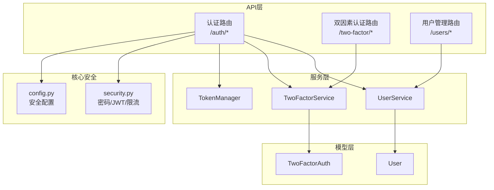
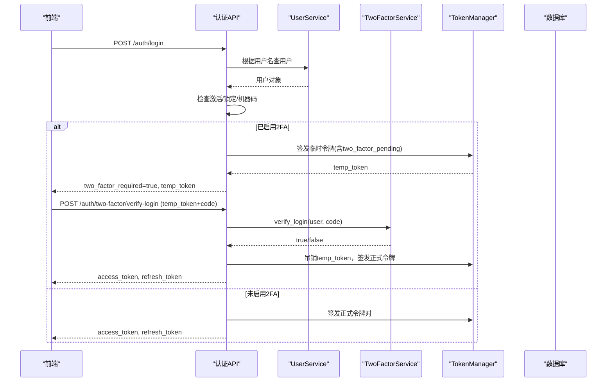
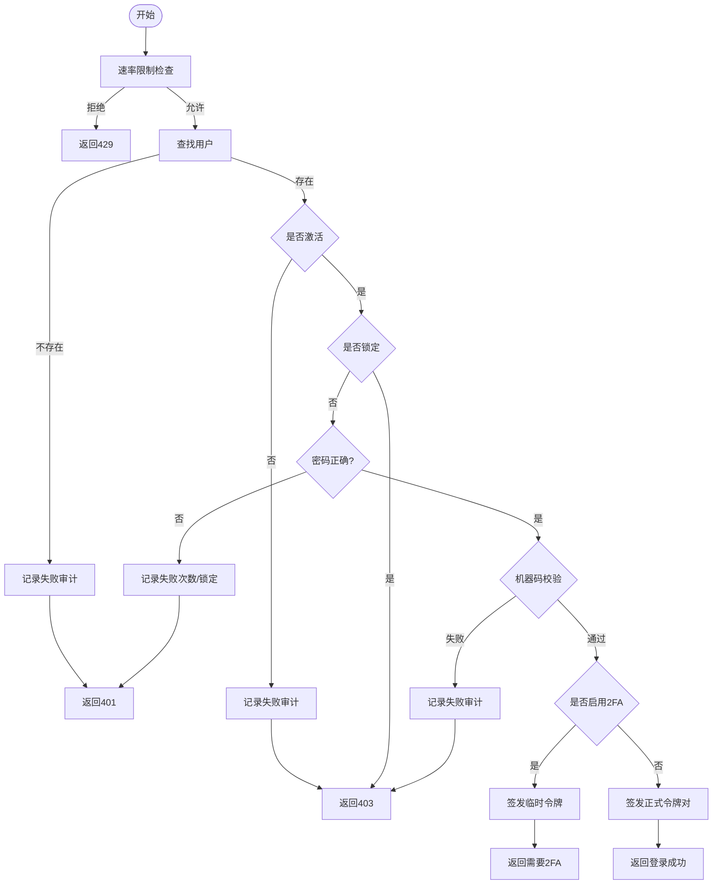
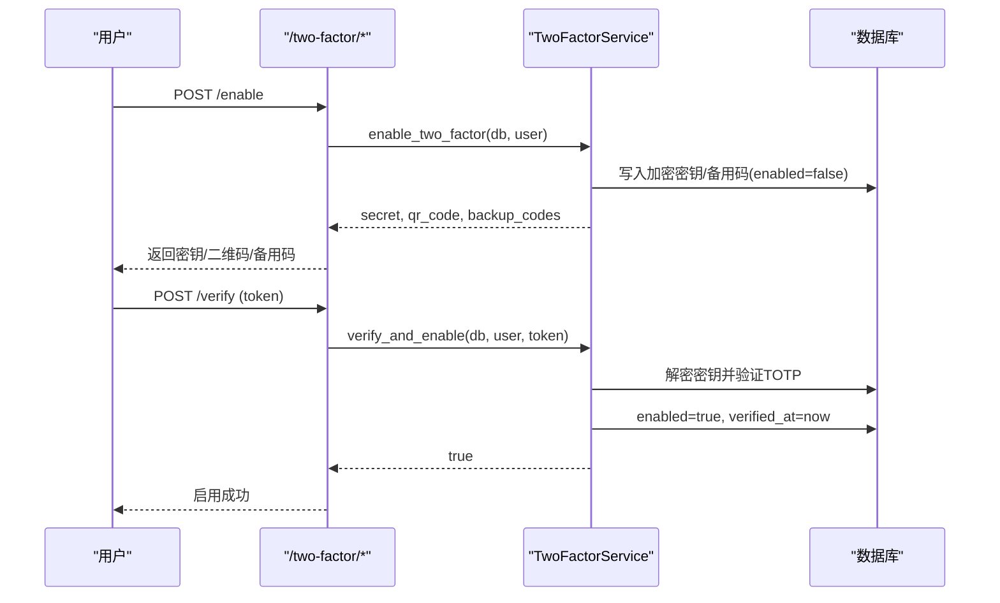
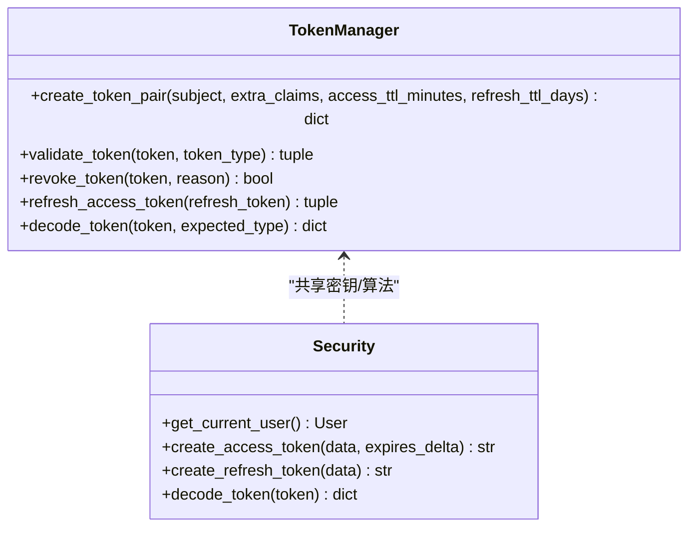
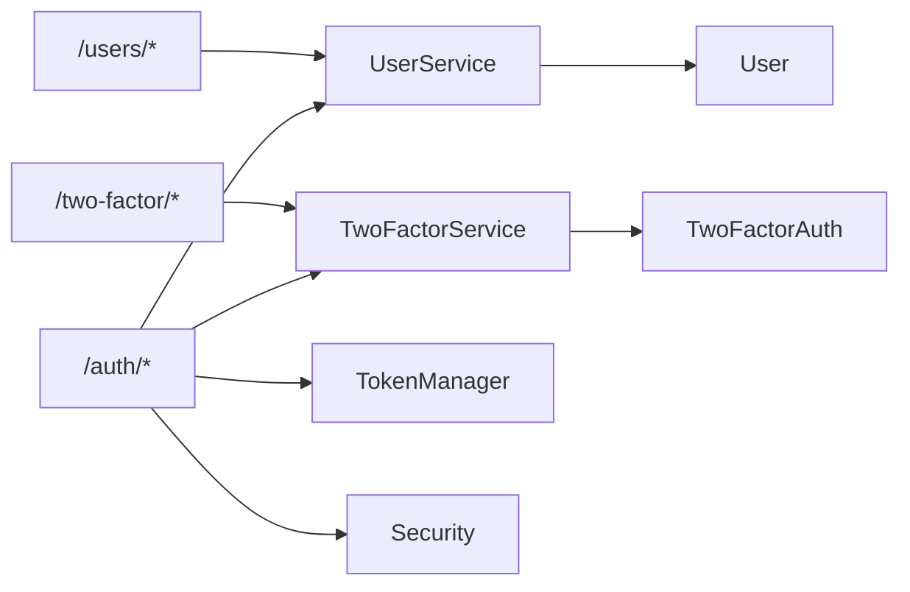

# 用户认证

<cite>
**本文引用的文件**
- [backend/app/api/v1/auth/auth.py](file://backend/app/api/v1/auth/auth.py)
- [backend/app/schemas/auth.py](file://backend/app/schemas/auth.py)
- [backend/app/models/user.py](file://backend/app/models/user.py)
- [backend/app/services/user_service.py](file://backend/app/services/user_service.py)
- [backend/app/api/v1/auth/two_factor.py](file://backend/app/api/v1/auth/two_factor.py)
- [backend/app/services/two_factor_service.py](file://backend/app/services/two_factor_service.py)
- [backend/app/models/two_factor_auth.py](file://backend/app/models/two_factor_auth.py)
- [backend/app/core/security.py](file://backend/app/core/security.py)
- [backend/app/core/token_manager.py](file://backend/app/core/token_manager.py)
- [backend/app/core/config.py](file://backend/app/core/config.py)
- [backend/app/api/v1/auth/users.py](file://backend/app/api/v1/auth/users.py)
</cite>

## 目录
1. [简介](#简介)
2. [项目结构](#项目结构)
3. [核心组件](#核心组件)
4. [架构总览](#架构总览)
5. [详细组件分析](#详细组件分析)
6. [依赖关系分析](#依赖关系分析)
7. [性能与安全考量](#性能与安全考量)
8. [故障排查指南](#故障排查指南)
9. [结论](#结论)
10. [附录：API使用示例](#附录api使用示例)

## 简介
本技术文档围绕“用户认证”能力，系统阐述登录、注册、密码管理、双因素认证（TOTP）、会话与令牌管理、前后端状态同步及错误处理策略。文档基于后端实现进行说明，帮助开发者理解并正确使用认证相关接口。

## 项目结构
认证相关代码主要分布在以下模块：
- API层：认证路由、双因素认证路由、用户管理路由
- 服务层：用户服务、双因素认证服务、令牌管理
- 模型层：用户模型、双因素认证模型
- 核心安全：密码策略、JWT/刷新令牌、速率限制、CSRF等

图表来源
- [backend/app/api/v1/auth/auth.py:101-287](file://backend/app/api/v1/auth/auth.py#L101-L287)
- [backend/app/api/v1/auth/two_factor.py:31-87](file://backend/app/api/v1/auth/two_factor.py#L31-L87)
- [backend/app/services/user_service.py:20-124](file://backend/app/services/user_service.py#L20-L124)
- [backend/app/services/two_factor_service.py:23-251](file://backend/app/services/two_factor_service.py#L23-L251)
- [backend/app/core/security.py:210-336](file://backend/app/core/security.py#L210-L336)
- [backend/app/core/config.py:126-154](file://backend/app/core/config.py#L126-L154)

章节来源
- [backend/app/api/v1/auth/auth.py:101-287](file://backend/app/api/v1/auth/auth.py#L101-L287)
- [backend/app/api/v1/auth/two_factor.py:31-87](file://backend/app/api/v1/auth/two_factor.py#L31-L87)
- [backend/app/services/user_service.py:20-124](file://backend/app/services/user_service.py#L20-L124)
- [backend/app/services/two_factor_service.py:23-251](file://backend/app/services/two_factor_service.py#L23-L251)
- [backend/app/core/security.py:210-336](file://backend/app/core/security.py#L210-L336)
- [backend/app/core/config.py:126-154](file://backend/app/core/config.py#L126-L154)

## 核心组件
- 认证路由（/auth）：提供登录、登出、刷新令牌、获取当前用户、CSRF token、注册等能力；在登录流程中集成账户锁定、机器码校验、2FA临时令牌机制。
- 双因素认证路由（/two-factor）：启用、验证、禁用、查询2FA状态。
- 用户服务：用户CRUD、通过用户名/邮箱查询、创建用户时密码哈希。
- 双因素服务：TOTP密钥生成、二维码生成、TOTP验证、备用码验证、启用/禁用、登录时验证。
- 令牌管理：统一签发access/refresh token对、吊销、黑名单持久化、版本控制支持强制下线。
- 安全核心：密码策略、bcrypt哈希、JWT编解码、速率限制、CSRF保护、客户端IP提取。

章节来源
- [backend/app/api/v1/auth/auth.py:101-287](file://backend/app/api/v1/auth/auth.py#L101-L287)
- [backend/app/api/v1/auth/two_factor.py:31-87](file://backend/app/api/v1/auth/two_factor.py#L31-L87)
- [backend/app/services/user_service.py:20-124](file://backend/app/services/user_service.py#L20-L124)
- [backend/app/services/two_factor_service.py:23-251](file://backend/app/services/two_factor_service.py#L23-L251)
- [backend/app/core/token_manager.py:64-283](file://backend/app/core/token_manager.py#L64-L283)
- [backend/app/core/security.py:120-148](file://backend/app/core/security.py#L120-L148)

## 架构总览
认证整体采用“无状态JWT + 可选黑名单 + 版本号”的混合模式：
- 登录成功签发短期access_token与长期refresh_token，携带token_version以便后续强制下线。
- 登出或管理员操作可递增token_version使旧令牌失效；同时可将具体jti加入黑名单。
- 2FA开启后，登录返回临时令牌，需二次验证通过后换取正式令牌。
- 密码以bcrypt哈希存储，遵循强度策略；支持密码过期提示与强制修改。

图表来源
- [backend/app/api/v1/auth/auth.py:101-287](file://backend/app/api/v1/auth/auth.py#L101-L287)
- [backend/app/api/v1/auth/auth.py:290-444](file://backend/app/api/v1/auth/auth.py#L290-L444)
- [backend/app/services/two_factor_service.py:180-215](file://backend/app/services/two_factor_service.py#L180-L215)
- [backend/app/core/token_manager.py:64-127](file://backend/app/core/token_manager.py#L64-L127)

## 详细组件分析

### 登录与注册流程
- 登录
  - 速率限制：按IP每分钟最多N次尝试。
  - 凭据校验：用户名存在性、是否激活、账户锁定状态、密码匹配。
  - 机器码校验：若用户绑定机器码，则必须匹配当前设备。
  - 2FA分支：若启用2FA，返回临时令牌；否则直接签发正式令牌对。
  - 审计日志：记录成功/失败原因、IP、UA。
- 注册
  - 速率限制：按IP每分钟最多N次。
  - 用户名与密码策略校验。
  - 使用通行码完成注册（业务规则）。
  - 成功后返回访问令牌。

图表来源
- [backend/app/api/v1/auth/auth.py:101-287](file://backend/app/api/v1/auth/auth.py#L101-L287)
- [backend/app/api/v1/auth/auth.py:750-800](file://backend/app/api/v1/auth/auth.py#L750-L800)

章节来源
- [backend/app/api/v1/auth/auth.py:101-287](file://backend/app/api/v1/auth/auth.py#L101-L287)
- [backend/app/api/v1/auth/auth.py:750-800](file://backend/app/api/v1/auth/auth.py#L750-L800)

### 双因素认证（TOTP）
- 启用流程
  - 生成随机密钥、备用恢复码、加密存储密钥。
  - 生成二维码供用户扫码绑定。
  - 用户提交验证码后，服务端解密密钥并验证TOTP，通过后标记启用。
- 登录验证
  - 优先验证TOTP；若失败则尝试备用码（使用后移除）。
  - 验证通过后吊销临时令牌，签发正式令牌对。
- 管理与状态
  - 支持禁用2FA、查询是否启用。

图表来源
- [backend/app/api/v1/auth/two_factor.py:31-87](file://backend/app/api/v1/auth/two_factor.py#L31-L87)
- [backend/app/services/two_factor_service.py:103-177](file://backend/app/services/two_factor_service.py#L103-L177)
- [backend/app/models/two_factor_auth.py:13-35](file://backend/app/models/two_factor_auth.py#L13-L35)

章节来源
- [backend/app/api/v1/auth/two_factor.py:31-87](file://backend/app/api/v1/auth/two_factor.py#L31-L87)
- [backend/app/services/two_factor_service.py:103-177](file://backend/app/services/two_factor_service.py#L103-L177)
- [backend/app/models/two_factor_auth.py:13-35](file://backend/app/models/two_factor_auth.py#L13-L35)

### 会话与令牌管理
- 令牌签发
  - access_token短时效（默认480分钟），refresh_token长时效（默认30天）。
  - 令牌包含jti用于黑名单吊销，以及token_version用于全局失效。
- 令牌刷新
  - 仅接受refresh_token，校验类型与有效性后吊销旧refresh_token并签发新对。
- 登出与强制下线
  - 登出时吊销请求中的access/refresh token，并递增token_version使该用户所有现存JWT立即失效。
  - 黑名单持久化到数据库，重启后仍有效。
- 鉴权入口
  - get_current_user从Bearer token解析用户，校验黑名单、类型、token_version，并注入审计上下文。

图表来源
- [backend/app/core/token_manager.py:64-283](file://backend/app/core/token_manager.py#L64-L283)
- [backend/app/core/security.py:210-336](file://backend/app/core/security.py#L210-L336)

章节来源
- [backend/app/core/token_manager.py:64-283](file://backend/app/core/token_manager.py#L64-L283)
- [backend/app/core/security.py:210-336](file://backend/app/core/security.py#L210-L336)

### 密码安全策略
- 强度校验
  - 最小长度、大小写、数字、特殊字符要求，弱口令前缀检测，禁止包含用户名片段。
- 存储与验证
  - bcrypt哈希存储，兼容不同版本；超长密码截断避免异常。
- 重置与过期
  - 管理员可重置用户密码；登录时检测密码过期时间并提示强制修改。
  - 登出/密码变更会更新token_version，使旧令牌失效。

章节来源
- [backend/app/core/security.py:524-590](file://backend/app/core/security.py#L524-L590)
- [backend/app/core/security.py:120-148](file://backend/app/core/security.py#L120-L148)
- [backend/app/api/v1/auth/auth.py:256-287](file://backend/app/api/v1/auth/auth.py#L256-L287)
- [backend/app/api/v1/auth/users.py:348-384](file://backend/app/api/v1/auth/users.py#L348-L384)

### 用户与会话状态同步（前后端）
- 前端在登录后保存access_token与refresh_token，并在后续请求头携带Authorization: Bearer。
- 当收到401（令牌无效/过期/被吊销）时，前端应尝试使用refresh_token调用刷新接口；若仍失败则引导重新登录。
- 登出时调用登出接口，后端将令牌加入黑名单并递增token_version，前端清理本地令牌。
- CSRF保护：发起状态变更请求前获取CSRF token并放入X-CSRF-Token头。

章节来源
- [backend/app/api/v1/auth/auth.py:570-591](file://backend/app/api/v1/auth/auth.py#L570-L591)
- [backend/app/api/v1/auth/auth.py:594-689](file://backend/app/api/v1/auth/auth.py#L594-L689)
- [backend/app/api/v1/auth/auth.py:692-747](file://backend/app/api/v1/auth/auth.py#L692-L747)
- [backend/app/core/security.py:243-336](file://backend/app/core/security.py#L243-L336)

## 依赖关系分析
- 认证路由依赖：
  - UserService：用户查询与创建
  - TwoFactorService：2FA逻辑
  - TokenManager：令牌签发/吊销/刷新
  - security：密码策略、JWT、速率限制、CSRF
- 数据模型：
  - User：用户主表，包含角色、激活状态、token_version、密码哈希等
  - TwoFactorAuth：2FA配置，包含加密密钥、备用码、启用状态

图表来源
- [backend/app/api/v1/auth/auth.py:101-287](file://backend/app/api/v1/auth/auth.py#L101-L287)
- [backend/app/api/v1/auth/two_factor.py:31-87](file://backend/app/api/v1/auth/two_factor.py#L31-L87)
- [backend/app/services/user_service.py:20-124](file://backend/app/services/user_service.py#L20-L124)
- [backend/app/services/two_factor_service.py:23-251](file://backend/app/services/two_factor_service.py#L23-L251)
- [backend/app/models/user.py:26-152](file://backend/app/models/user.py#L26-L152)
- [backend/app/models/two_factor_auth.py:13-35](file://backend/app/models/two_factor_auth.py#L13-L35)

章节来源
- [backend/app/models/user.py:26-152](file://backend/app/models/user.py#L26-L152)
- [backend/app/models/two_factor_auth.py:13-35](file://backend/app/models/two_factor_auth.py#L13-L35)

## 性能与安全考量
- 性能
  - 速率限制采用内存滑动窗口，定期清理过期键，避免内存泄漏。
  - 令牌黑名单支持持久化，兼顾重启后的安全性。
  - TOTP二维码按需生成，懒加载qrcode库降低启动开销。
- 安全
  - bcrypt哈希与密码策略保障密码安全。
  - JWT黑名单与token_version双重机制防止令牌重用与泄露。
  - CSRF保护与代理头信任策略避免跨站与伪造源攻击。
  - 登录失败计数与账户锁定降低暴力破解风险。

[本节为通用指导，不直接分析具体文件]

## 故障排查指南
- 登录频繁被拒
  - 检查是否触发速率限制（429）或账户锁定（403）。
  - 查看审计日志中的失败原因（如用户不存在、未激活、机器码不匹配、2FA验证码错误）。
- 2FA无法启用或验证失败
  - 确认二维码已正确扫描，输入验证码在时间窗口内。
  - 若TOTP失败，尝试使用备用码（使用后会被移除）。
- 令牌刷新失败
  - 确认传入的是refresh_token而非access_token。
  - 若仍失败，检查是否已被吊销或token_version不匹配。
- 登出后仍可访问
  - 确认登出接口已调用，且前端清除了本地令牌。
  - 检查token_version是否递增，黑名单是否生效。

章节来源
- [backend/app/api/v1/auth/auth.py:124-179](file://backend/app/api/v1/auth/auth.py#L124-L179)
- [backend/app/api/v1/auth/auth.py:290-444](file://backend/app/api/v1/auth/auth.py#L290-L444)
- [backend/app/api/v1/auth/auth.py:570-689](file://backend/app/api/v1/auth/auth.py#L570-L689)
- [backend/app/services/two_factor_service.py:180-215](file://backend/app/services/two_factor_service.py#L180-L215)

## 结论
本认证体系通过严格的密码策略、双因素认证、令牌版本与黑名单机制，提供了高安全性的登录与会话管理能力。结合速率限制与审计日志，可有效抵御常见攻击。前后端通过标准JWT与刷新机制协同，确保状态一致性与用户体验。

[本节为总结，不直接分析具体文件]

## 附录：API使用示例
以下为常用认证接口的调用方式与参数说明（以HTTP为例）：

- 登录
  - 方法：POST
  - 路径：/api/v1/auth/login
  - 请求体：{ username, password }
  - 响应：若启用2FA，返回two_factor_required=true与temp_token；否则返回access_token与refresh_token。
  - 参考：[backend/app/api/v1/auth/auth.py:101-287](file://backend/app/api/v1/auth/auth.py#L101-L287)

- 2FA登录验证
  - 方法：POST
  - 路径：/api/v1/auth/two-factor/verify-login
  - 请求体：{ temp_token, code }
  - 响应：验证通过后返回正式access_token与refresh_token。
  - 参考：[backend/app/api/v1/auth/auth.py:290-444](file://backend/app/api/v1/auth/auth.py#L290-L444)

- 获取当前用户信息
  - 方法：GET
  - 路径：/api/v1/auth/me
  - 头部：Authorization: Bearer <access_token>
  - 响应：当前用户基本信息与权限。
  - 参考：[backend/app/api/v1/auth/auth.py:473-505](file://backend/app/api/v1/auth/auth.py#L473-L505)

- 刷新令牌
  - 方法：POST
  - 路径：/api/v1/auth/refresh
  - 请求体：{ token: "<refresh_token>" }
  - 响应：新的access_token与refresh_token。
  - 参考：[backend/app/api/v1/auth/auth.py:594-689](file://backend/app/api/v1/auth/auth.py#L594-L689)

- 登出
  - 方法：POST
  - 路径：/api/v1/auth/logout
  - 头部：Authorization: Bearer <access_token>
  - 可选请求体：{ refresh_token: "<refresh_token>" }
  - 响应：登出成功。
  - 参考：[backend/app/api/v1/auth/auth.py:570-591](file://backend/app/api/v1/auth/auth.py#L570-L591)

- 获取CSRF token
  - 方法：GET
  - 路径：/api/v1/auth/csrf-token
  - 响应：返回csrf_token与csrf_signed_token，并在响应Cookie中设置签名版token。
  - 参考：[backend/app/api/v1/auth/auth.py:692-747](file://backend/app/api/v1/auth/auth.py#L692-L747)

- 启用2FA
  - 方法：POST
  - 路径：/api/v1/two-factor/enable
  - 头部：Authorization: Bearer <access_token>
  - 响应：返回secret、qr_code、backup_codes。
  - 参考：[backend/app/api/v1/auth/two_factor.py:31-43](file://backend/app/api/v1/auth/two_factor.py#L31-L43)

- 验证并启用2FA
  - 方法：POST
  - 路径：/api/v1/two-factor/verify
  - 头部：Authorization: Bearer <access_token>
  - 请求体：{ token: "<TOTP验证码>" }
  - 响应：启用成功。
  - 参考：[backend/app/api/v1/auth/two_factor.py:46-66](file://backend/app/api/v1/auth/two_factor.py#L46-L66)

- 禁用2FA
  - 方法：POST
  - 路径：/api/v1/two-factor/disable
  - 头部：Authorization: Bearer <access_token>
  - 响应：禁用成功。
  - 参考：[backend/app/api/v1/auth/two_factor.py:69-78](file://backend/app/api/v1/auth/two_factor.py#L69-L78)

- 查询2FA状态
  - 方法：GET
  - 路径：/api/v1/two-factor/status
  - 头部：Authorization: Bearer <access_token>
  - 响应：enabled布尔值。
  - 参考：[backend/app/api/v1/auth/two_factor.py:81-87](file://backend/app/api/v1/auth/two_factor.py#L81-L87)

- 修改密码（个人）
  - 方法：PUT
  - 路径：/api/v1/users/me/password（示例路径，实际以路由为准）
  - 头部：Authorization: Bearer <access_token>
  - 请求体：{ old_password, new_password }
  - 参考：[backend/app/api/v1/auth/users.py:98-103](file://backend/app/api/v1/auth/users.py#L98-L103)

- 管理员重置用户密码
  - 方法：POST
  - 路径：/api/v1/user-management/{user_id}/reset-password
  - 头部：Authorization: Bearer <access_token>
  - 请求体：{ new_password }（可选，不提供则自动生成）
  - 响应：返回新密码。
  - 参考：[backend/app/api/v1/auth/user_management.py:348-384](file://backend/app/api/v1/auth/user_management.py#L348-L384)

章节来源
- [backend/app/api/v1/auth/auth.py:101-747](file://backend/app/api/v1/auth/auth.py#L101-L747)
- [backend/app/api/v1/auth/two_factor.py:31-87](file://backend/app/api/v1/auth/two_factor.py#L31-L87)
- [backend/app/api/v1/auth/users.py:98-103](file://backend/app/api/v1/auth/users.py#L98-L103)
- [backend/app/api/v1/auth/user_management.py:348-384](file://backend/app/api/v1/auth/user_management.py#L348-L384)