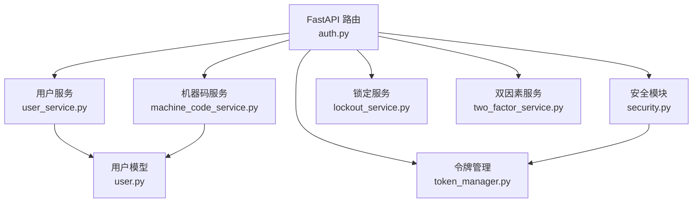
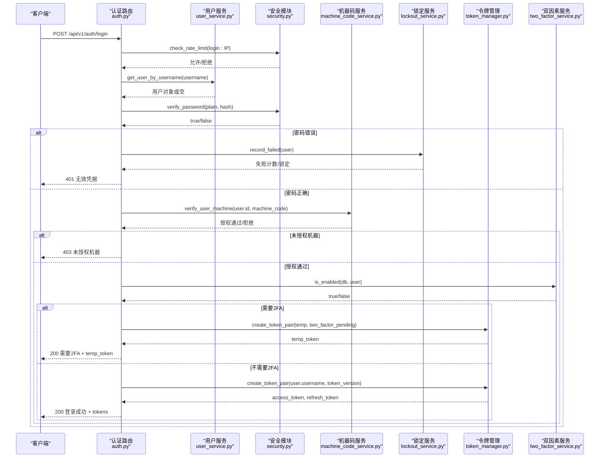
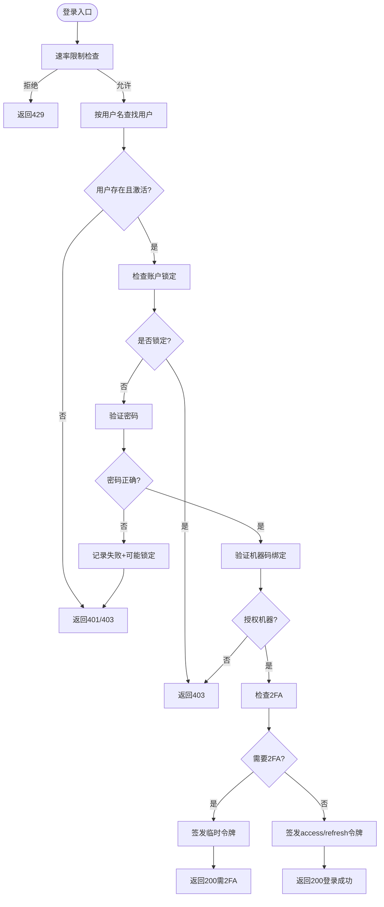
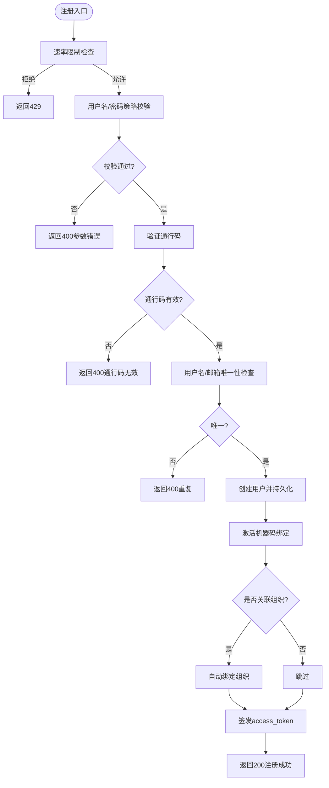
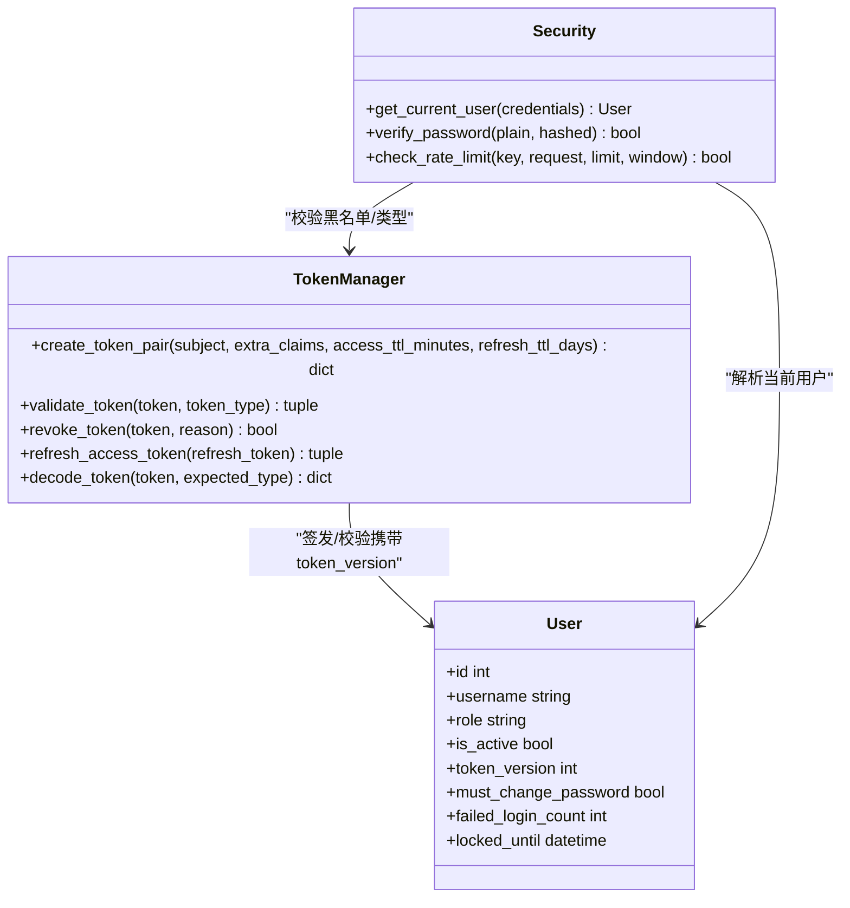
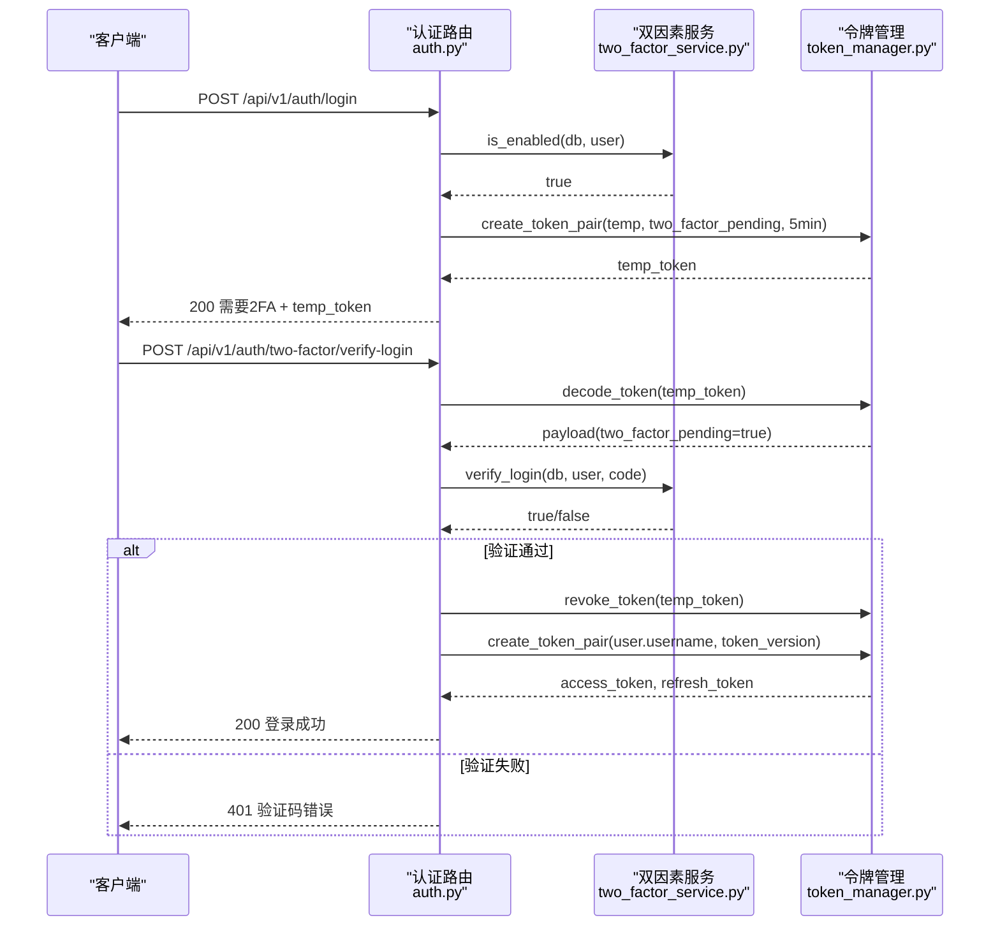
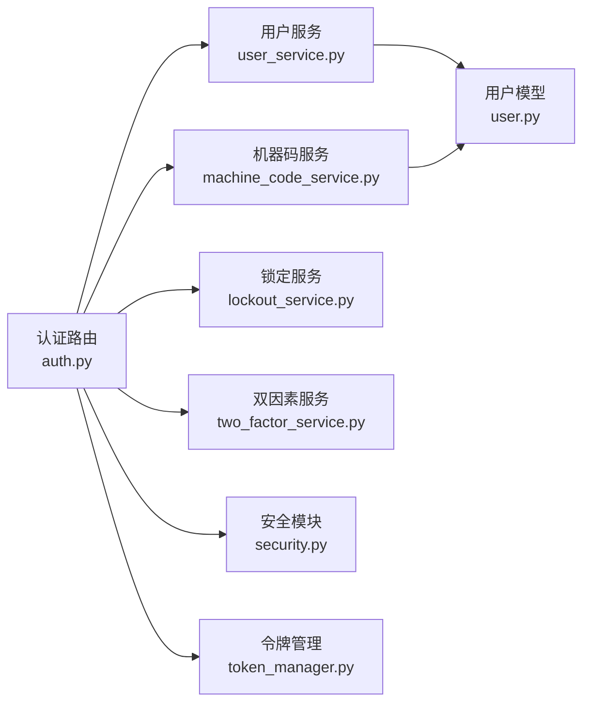

# 登录注册

<cite>
**本文引用的文件**
- [backend/app/api/v1/auth/auth.py](file://backend/app/api/v1/auth/auth.py)
- [backend/app/schemas/auth.py](file://backend/app/schemas/auth.py)
- [backend/app/models/user.py](file://backend/app/models/user.py)
- [backend/app/services/user_service.py](file://backend/app/services/user_service.py)
- [backend/app/core/security.py](file://backend/app/core/security.py)
- [backend/app/core/token_manager.py](file://backend/app/core/token_manager.py)
- [backend/app/services/machine_code_service.py](file://backend/app/services/machine_code_service.py)
- [backend/app/services/lockout_service.py](file://backend/app/services/lockout_service.py)
- [backend/app/api/v1/auth/two_factor.py](file://backend/app/api/v1/auth/two_factor.py)
- [backend/app/services/two_factor_service.py](file://backend/app/services/two_factor_service.py)
- [backend/tests/unit/test_auth_auth_api.py](file://backend/tests/unit/test_auth_auth_api.py)
</cite>

## 目录
1. [简介](#简介)
2. [项目结构](#项目结构)
3. [核心组件](#核心组件)
4. [架构总览](#架构总览)
5. [详细组件分析](#详细组件分析)
6. [依赖关系分析](#依赖关系分析)
7. [性能考虑](#性能考虑)
8. [故障排查指南](#故障排查指南)
9. [结论](#结论)
10. [附录：API使用示例与前后端同步](#附录api使用示例与前后端同步)

## 简介
本技术文档聚焦“用户登录与注册”功能，覆盖以下关键主题：
- 登录流程：用户名密码校验、账户锁定机制、速率限制、机器码绑定、双因素认证（可选）、审计日志。
- 注册流程：通行码验证、用户名唯一性检查、邮箱唯一性、密码强度策略、机器码绑定与组织自动绑定。
- 会话管理：JWT访问令牌与刷新令牌生成、吊销与轮换、强制下线（token_version）与自动登出。
- API使用与错误处理：登录、刷新、登出、CSRF获取等接口的调用方式与异常响应。
- 前后端状态同步：前端如何维护登录态、刷新令牌、处理鉴权失败与页面跳转。

## 项目结构
认证相关代码主要位于后端 FastAPI 模块中，围绕路由层、服务层、安全与令牌管理、数据模型展开：
- 路由层：认证接口定义在 auth.py，包含登录、注册、刷新、登出、CSRF、2FA 验证等。
- 服务层：UserService 负责用户查询与创建；MachineCodeService 负责机器码与通行码；LockoutService 负责账户锁定；TwoFactorService 负责双因素认证。
- 安全与令牌：security.py 提供密码哈希、策略、速率限制、当前用户解析；token_manager.py 提供 JWT 的签发、校验、吊销与刷新。
- 数据模型：user.py 定义用户表结构与字段（含 token_version、must_change_password、failed_login_count、locked_until 等）。

**图示来源**
- [backend/app/api/v1/auth/auth.py:101-287](file://backend/app/api/v1/auth/auth.py#L101-L287)
- [backend/app/services/user_service.py:20-95](file://backend/app/services/user_service.py#L20-L95)
- [backend/app/services/machine_code_service.py:267-323](file://backend/app/services/machine_code_service.py#L267-L323)
- [backend/app/core/security.py:130-148](file://backend/app/core/security.py#L130-L148)
- [backend/app/core/token_manager.py:64-127](file://backend/app/core/token_manager.py#L64-L127)
- [backend/app/services/lockout_service.py:145-177](file://backend/app/services/lockout_service.py#L145-L177)
- [backend/app/services/two_factor_service.py:150-174](file://backend/app/services/two_factor_service.py#L150-L174)
- [backend/app/models/user.py:26-85](file://backend/app/models/user.py#L26-L85)

**章节来源**
- [backend/app/api/v1/auth/auth.py:101-287](file://backend/app/api/v1/auth/auth.py#L101-L287)
- [backend/app/services/user_service.py:20-95](file://backend/app/services/user_service.py#L20-L95)
- [backend/app/core/security.py:130-148](file://backend/app/core/security.py#L130-L148)
- [backend/app/core/token_manager.py:64-127](file://backend/app/core/token_manager.py#L64-L127)
- [backend/app/services/machine_code_service.py:267-323](file://backend/app/services/machine_code_service.py#L267-L323)
- [backend/app/services/lockout_service.py:145-177](file://backend/app/services/lockout_service.py#L145-L177)
- [backend/app/models/user.py:26-85](file://backend/app/models/user.py#L26-L85)

## 核心组件
- 认证路由（auth.py）：实现登录、注册、刷新、登出、CSRF、2FA 验证等接口，统一速率限制、审计日志与安全策略。
- 用户服务（user_service.py）：按用户名/邮箱查询用户，创建新用户并持久化。
- 机器码服务（machine_code_service.py）：生成/验证通行码、机器码绑定、跨机器自验证（HMAC fail-closed）。
- 锁定服务（lockout_service.py）：记录失败次数、达到阈值自动锁定、过期解锁。
- 安全模块（security.py）：密码哈希/校验、密码策略、速率限制、客户端IP、当前用户解析。
- 令牌管理（token_manager.py）：签发 access/refresh 对、黑名单吊销、版本控制（token_version）支持强制下线。
- 双因素服务（two_factor_service.py）：TOTP 验证、备用码、启用/禁用状态。

**章节来源**
- [backend/app/api/v1/auth/auth.py:101-287](file://backend/app/api/v1/auth/auth.py#L101-L287)
- [backend/app/services/user_service.py:20-95](file://backend/app/services/user_service.py#L20-L95)
- [backend/app/services/machine_code_service.py:267-323](file://backend/app/services/machine_code_service.py#L267-L323)
- [backend/app/services/lockout_service.py:145-177](file://backend/app/services/lockout_service.py#L145-L177)
- [backend/app/core/security.py:130-148](file://backend/app/core/security.py#L130-L148)
- [backend/app/core/token_manager.py:64-127](file://backend/app/core/token_manager.py#L64-L127)
- [backend/app/services/two_factor_service.py:150-174](file://backend/app/services/two_factor_service.py#L150-L174)

## 架构总览
下图展示登录主流程的关键交互：速率限制、凭据校验、账户锁定检查、机器码绑定、2FA 分支、令牌签发与审计。

**图示来源**
- [backend/app/api/v1/auth/auth.py:101-287](file://backend/app/api/v1/auth/auth.py#L101-L287)
- [backend/app/core/security.py:130-148](file://backend/app/core/security.py#L130-L148)
- [backend/app/services/machine_code_service.py:661-691](file://backend/app/services/machine_code_service.py#L661-L691)
- [backend/app/services/lockout_service.py:145-177](file://backend/app/services/lockout_service.py#L145-L177)
- [backend/app/core/token_manager.py:64-127](file://backend/app/core/token_manager.py#L64-L127)
- [backend/app/services/two_factor_service.py:150-174](file://backend/app/services/two_factor_service.py#L150-L174)

## 详细组件分析

### 登录流程
- 速率限制：同一 IP 每分钟最多 5 次登录尝试，超限返回 429。
- 用户查找与激活状态：不存在或未激活直接拒绝。
- 账户锁定：委托 LockoutService 检查 locked_until 与 failed_login_count，达到阈值自动锁定。
- 密码校验：使用 bcrypt 哈希验证，兼容长密码截断。
- 机器码绑定：若用户已绑定机器码，则必须匹配当前机器码，否则拒绝。
- 双因素认证：如启用，返回临时令牌（5分钟），需二次验证换取正式令牌。
- 成功路径：重置失败计数与锁定，更新最后登录时间，签发 access/refresh 令牌对，携带 token_version。
- 审计日志：每次登录成功/失败均记录 IP、UA、原因。

**图示来源**
- [backend/app/api/v1/auth/auth.py:101-287](file://backend/app/api/v1/auth/auth.py#L101-L287)
- [backend/app/services/lockout_service.py:145-177](file://backend/app/services/lockout_service.py#L145-L177)
- [backend/app/core/security.py:130-148](file://backend/app/core/security.py#L130-L148)
- [backend/app/services/machine_code_service.py:661-691](file://backend/app/services/machine_code_service.py#L661-L691)
- [backend/app/core/token_manager.py:64-127](file://backend/app/core/token_manager.py#L64-L127)

**章节来源**
- [backend/app/api/v1/auth/auth.py:101-287](file://backend/app/api/v1/auth/auth.py#L101-L287)
- [backend/app/services/lockout_service.py:145-177](file://backend/app/services/lockout_service.py#L145-L177)
- [backend/app/core/security.py:130-148](file://backend/app/core/security.py#L130-L148)
- [backend/app/services/machine_code_service.py:661-691](file://backend/app/services/machine_code_service.py#L661-L691)
- [backend/app/core/token_manager.py:64-127](file://backend/app/core/token_manager.py#L64-L127)

### 注册流程
- 速率限制：同一 IP 每分钟最多 3 次注册尝试，超限返回 429。
- 用户名与密码策略：用户名格式校验、密码强度校验（长度、大小写、数字、特殊字符、弱口令前缀、禁止包含用户名）。
- 通行码验证：优先数据库匹配（机器特定/组织/仅pass_code回退），最后 HMAC 自验证（fail-closed，未显式配置密钥时拒绝）。
- 唯一性检查：用户名与邮箱唯一性校验。
- 创建用户：默认角色为 user，is_active=True，邮箱缺失时生成本地邮箱。
- 机器码绑定：激活机器码记录，若通行码关联组织则自动绑定用户到该组织。
- 签发令牌：注册成功后返回 access_token（单令牌模式）。

**图示来源**
- [backend/app/api/v1/auth/auth.py:750-890](file://backend/app/api/v1/auth/auth.py#L750-L890)
- [backend/app/core/security.py:524-590](file://backend/app/core/security.py#L524-L590)
- [backend/app/services/machine_code_service.py:411-585](file://backend/app/services/machine_code_service.py#L411-L585)
- [backend/app/services/user_service.py:76-95](file://backend/app/services/user_service.py#L76-L95)

**章节来源**
- [backend/app/api/v1/auth/auth.py:750-890](file://backend/app/api/v1/auth/auth.py#L750-L890)
- [backend/app/core/security.py:524-590](file://backend/app/core/security.py#L524-L590)
- [backend/app/services/machine_code_service.py:411-585](file://backend/app/services/machine_code_service.py#L411-L585)
- [backend/app/services/user_service.py:76-95](file://backend/app/services/user_service.py#L76-L95)

### 登录状态管理（JWT与会话）
- 令牌签发：access_token（短期，默认480分钟）与 refresh_token（长期，默认7天），携带 jti、type、exp、sub、token_version。
- 令牌校验：get_current_user 解码后校验类型、黑名单、token_version 与用户当前版本一致。
- 令牌吊销：logout 将请求中的 access_token 加入黑名单，并递增 token_version 使所有现存令牌失效。
- 令牌刷新：refresh 仅接受 refresh_token，校验通过后吊销旧 refresh_token 并签发新 pair（轮换防重放）。
- 强制下线：登出或修改密码时递增 token_version，后续请求因版本不匹配被拒绝。

**图示来源**
- [backend/app/core/token_manager.py:64-127](file://backend/app/core/token_manager.py#L64-L127)
- [backend/app/core/token_manager.py:176-210](file://backend/app/core/token_manager.py#L176-L210)
- [backend/app/core/token_manager.py:218-240](file://backend/app/core/token_manager.py#L218-L240)
- [backend/app/core/security.py:243-336](file://backend/app/core/security.py#L243-L336)
- [backend/app/models/user.py:78-85](file://backend/app/models/user.py#L78-L85)

**章节来源**
- [backend/app/core/token_manager.py:64-127](file://backend/app/core/token_manager.py#L64-L127)
- [backend/app/core/token_manager.py:176-210](file://backend/app/core/token_manager.py#L176-L210)
- [backend/app/core/token_manager.py:218-240](file://backend/app/core/token_manager.py#L218-L240)
- [backend/app/core/security.py:243-336](file://backend/app/core/security.py#L243-L336)
- [backend/app/models/user.py:78-85](file://backend/app/models/user.py#L78-L85)

### 双因素认证（2FA）
- 登录阶段：若用户启用 2FA，返回临时令牌（标记 two_factor_pending），有效期短（5分钟）。
- 验证阶段：使用 temp_token 与 TOTP 验证码或备用码进行验证，成功后吊销 temp_token 并签发正式令牌对。
- 管理接口：启用/禁用 2FA、查询状态、验证并启用。

**图示来源**
- [backend/app/api/v1/auth/auth.py:290-444](file://backend/app/api/v1/auth/auth.py#L290-L444)
- [backend/app/api/v1/auth/two_factor.py:46-87](file://backend/app/api/v1/auth/two_factor.py#L46-L87)
- [backend/app/services/two_factor_service.py:150-174](file://backend/app/services/two_factor_service.py#L150-L174)
- [backend/app/core/token_manager.py:64-127](file://backend/app/core/token_manager.py#L64-L127)

**章节来源**
- [backend/app/api/v1/auth/auth.py:290-444](file://backend/app/api/v1/auth/auth.py#L290-L444)
- [backend/app/api/v1/auth/two_factor.py:46-87](file://backend/app/api/v1/auth/two_factor.py#L46-L87)
- [backend/app/services/two_factor_service.py:150-174](file://backend/app/services/two_factor_service.py#L150-L174)
- [backend/app/core/token_manager.py:64-127](file://backend/app/core/token_manager.py#L64-L127)

## 依赖关系分析
- 路由层依赖服务层：auth.py 依赖 UserService、MachineCodeService、LockoutService、TwoFactorService。
- 安全与令牌：security.py 提供密码与策略，token_manager.py 提供 JWT 能力，两者共同支撑认证链路。
- 数据模型：user.py 提供用户实体与权限/菜单/组织等扩展字段，影响登录响应与权限判断。

**图示来源**
- [backend/app/api/v1/auth/auth.py:101-287](file://backend/app/api/v1/auth/auth.py#L101-L287)
- [backend/app/services/user_service.py:20-95](file://backend/app/services/user_service.py#L20-L95)
- [backend/app/services/machine_code_service.py:267-323](file://backend/app/services/machine_code_service.py#L267-L323)
- [backend/app/services/lockout_service.py:145-177](file://backend/app/services/lockout_service.py#L145-L177)
- [backend/app/services/two_factor_service.py:150-174](file://backend/app/services/two_factor_service.py#L150-L174)
- [backend/app/core/security.py:130-148](file://backend/app/core/security.py#L130-L148)
- [backend/app/core/token_manager.py:64-127](file://backend/app/core/token_manager.py#L64-L127)
- [backend/app/models/user.py:26-85](file://backend/app/models/user.py#L26-L85)

**章节来源**
- [backend/app/api/v1/auth/auth.py:101-287](file://backend/app/api/v1/auth/auth.py#L101-L287)
- [backend/app/services/user_service.py:20-95](file://backend/app/services/user_service.py#L20-L95)
- [backend/app/services/machine_code_service.py:267-323](file://backend/app/services/machine_code_service.py#L267-L323)
- [backend/app/services/lockout_service.py:145-177](file://backend/app/services/lockout_service.py#L145-L177)
- [backend/app/services/two_factor_service.py:150-174](file://backend/app/services/two_factor_service.py#L150-L174)
- [backend/app/core/security.py:130-148](file://backend/app/core/security.py#L130-L148)
- [backend/app/core/token_manager.py:64-127](file://backend/app/core/token_manager.py#L64-L127)
- [backend/app/models/user.py:26-85](file://backend/app/models/user.py#L26-L85)

## 性能考虑
- 速率限制采用内存滑动窗口，定期清理过期键，避免内存泄漏。
- 机器码计算结果进程级缓存，减少子进程调用开销。
- 令牌校验使用黑名单与 token_version 双重机制，兼顾即时失效与批量吊销。
- 审计日志写入失败不影响主流程，确保高可用。

[本节为通用性能指导，无需具体文件引用]

## 故障排查指南
- 登录频繁失败导致锁定：检查 lockout_service 的失败计数与锁定时间，确认是否达到阈值。
- 通行码无效：核对输入是否去除连字符，确认是否命中数据库匹配或 HMAC 自验证（fail-closed）。
- 令牌刷新失败：确认传入的是 refresh_token，且未被吊销；检查 token_version 是否匹配。
- 登出后仍可使用令牌：确认 logout 是否执行了黑名单添加与 token_version 递增。
- 2FA 验证失败：检查 temp_token 是否有效且标记 two_factor_pending，验证码是否正确。

**章节来源**
- [backend/app/services/lockout_service.py:145-177](file://backend/app/services/lockout_service.py#L145-L177)
- [backend/app/services/machine_code_service.py:411-585](file://backend/app/services/machine_code_service.py#L411-L585)
- [backend/app/core/token_manager.py:176-210](file://backend/app/core/token_manager.py#L176-L210)
- [backend/app/api/v1/auth/auth.py:570-591](file://backend/app/api/v1/auth/auth.py#L570-L591)
- [backend/app/api/v1/auth/auth.py:290-444](file://backend/app/api/v1/auth/auth.py#L290-L444)

## 结论
本系统实现了健壮的登录注册流程，涵盖速率限制、账户锁定、机器码绑定、双因素认证与完善的令牌生命周期管理。通过 token_version 与黑名单机制，支持即时吊销与强制下线；通过通行码 HMAC 自验证与四级匹配策略，保障注册安全与灵活性。建议在生产环境严格配置 PASS_CODE_SECRET、合理设置速率限制与锁定策略，并完善前端状态同步与异常处理。

[本节为总结性内容，无需具体文件引用]

## 附录：API使用示例与前后端同步
- 登录接口
  - 方法：POST
  - 路径：/api/v1/auth/login
  - 请求体：{ username, password }
  - 成功响应：code=200，data.access_token，data.user，refresh_token，must_change_password，two_factor_required/temp_token（如需2FA）
  - 失败响应：401 无效凭据，403 未激活/未授权机器，429 频率过高
  - 参考测试用例：[test_auth_auth_api.py:324-351](file://backend/tests/unit/test_auth_auth_api.py#L324-L351)

- 2FA 验证接口
  - 方法：POST
  - 路径：/api/v1/auth/two-factor/verify-login
  - 请求体：{ temp_token, code }
  - 成功响应：code=200，data.access_token，refresh_token
  - 失败响应：401 临时令牌无效/验证码错误
  - 参考实现：[auth.py:290-444](file://backend/app/api/v1/auth/auth.py#L290-L444)

- 刷新令牌接口
  - 方法：POST
  - 路径：/api/v1/auth/refresh
  - 请求体：{ token: refresh_token }
  - 成功响应：code=200，data.access_token，refresh_token
  - 失败响应：401 无效/过期/类型不匹配
  - 参考实现：[auth.py:594-689](file://backend/app/api/v1/auth/auth.py#L594-L689)

- 登出接口
  - 方法：POST
  - 路径：/api/v1/auth/logout
  - 请求头：Authorization: Bearer <access_token>
  - 行为：吊销 access_token，可选吊销 refresh_token，递增 token_version
  - 参考实现：[auth.py:570-591](file://backend/app/api/v1/auth/auth.py#L570-L591)

- CSRF 获取接口
  - 方法：GET
  - 路径：/api/v1/auth/csrf-token
  - 行为：返回 csrf_token 并在响应中设置 Cookie（signed）
  - 参考实现：[auth.py:692-747](file://backend/app/api/v1/auth/auth.py#L692-L747)

- 前后端状态同步建议
  - 登录后保存 access_token 与 refresh_token，发起受保护请求时在 Authorization 头携带 Bearer token。
  - 当收到 401 或 403 时，尝试使用 refresh_token 调用 /api/v1/auth/refresh 刷新；若刷新失败则引导重新登录。
  - 登出后清除本地存储的 token，并跳转至登录页。
  - 对于状态变更请求（POST/PUT/DELETE/PATCH），先调用 /api/v1/auth/csrf-token 获取并携带 X-CSRF-Token 头。

**章节来源**
- [backend/tests/unit/test_auth_auth_api.py:324-351](file://backend/tests/unit/test_auth_auth_api.py#L324-L351)
- [backend/app/api/v1/auth/auth.py:290-444](file://backend/app/api/v1/auth/auth.py#L290-L444)
- [backend/app/api/v1/auth/auth.py:594-689](file://backend/app/api/v1/auth/auth.py#L594-L689)
- [backend/app/api/v1/auth/auth.py:570-591](file://backend/app/api/v1/auth/auth.py#L570-L591)
- [backend/app/api/v1/auth/auth.py:692-747](file://backend/app/api/v1/auth/auth.py#L692-L747)