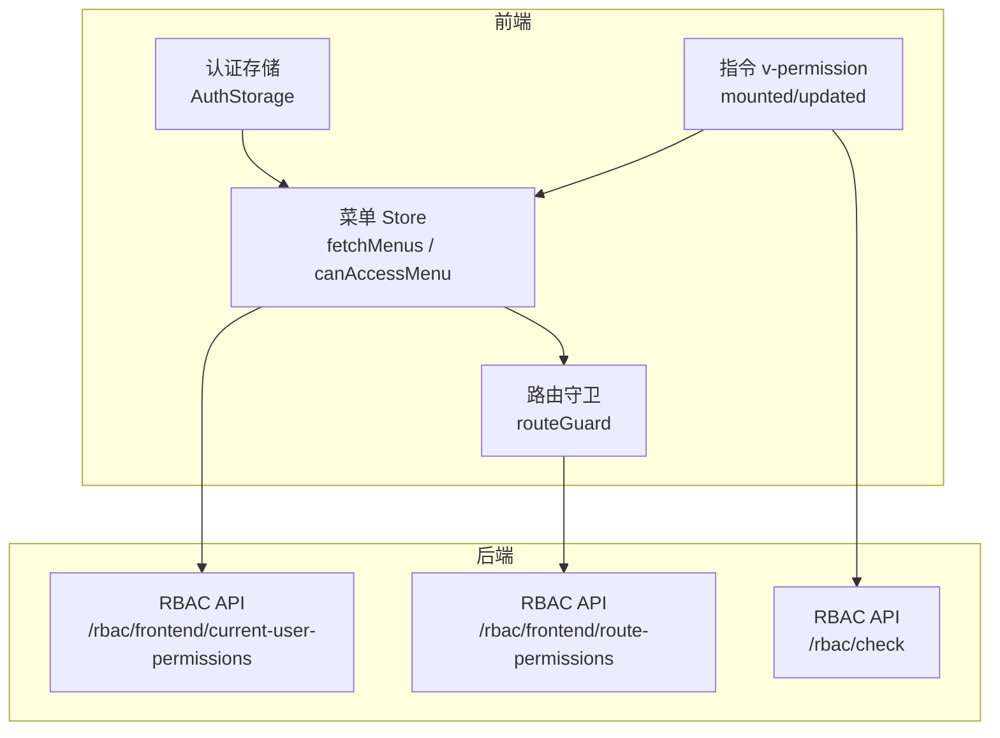
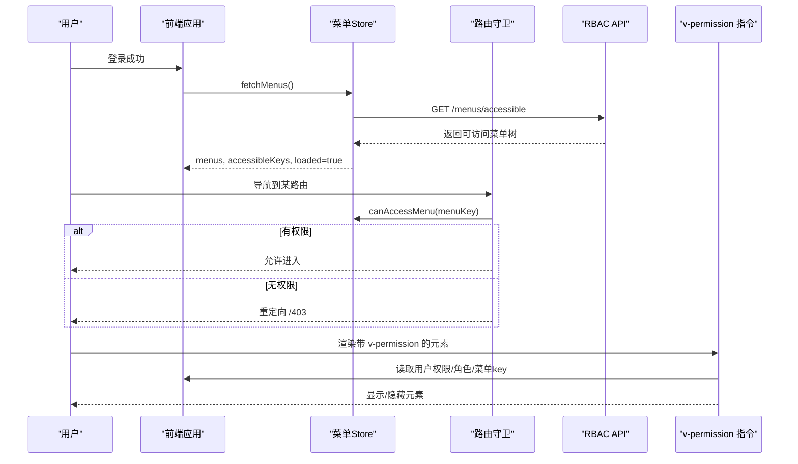
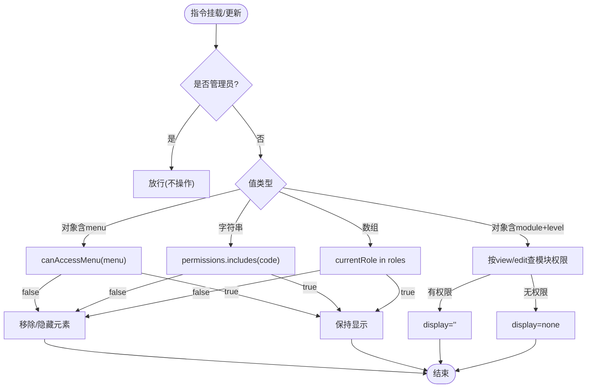
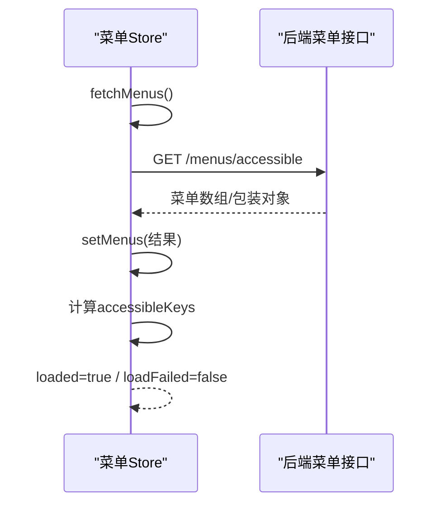
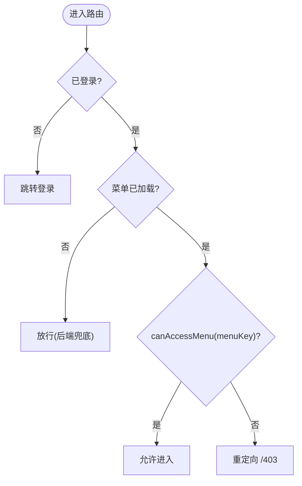
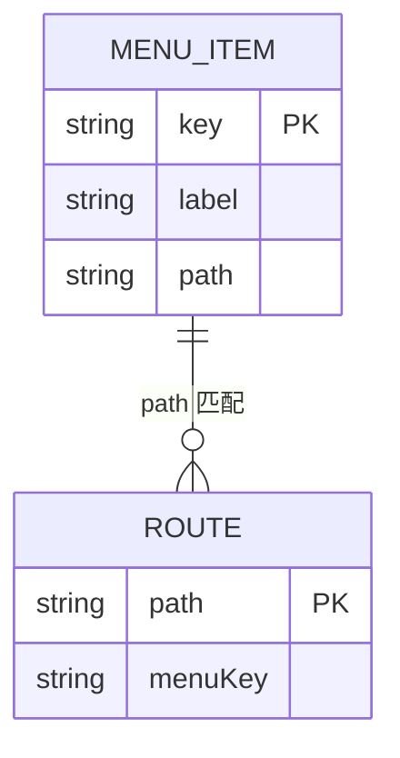
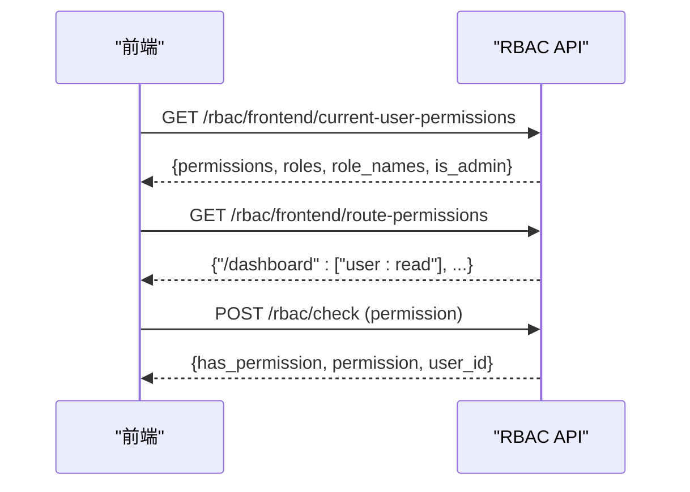
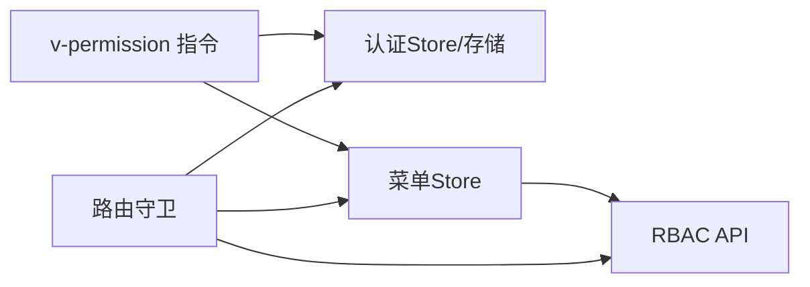

# 菜单权限控制

<cite>
**本文引用的文件**
- [frontend/src/directives/permission.ts](file://frontend/src/directives/permission.ts)
- [frontend/tests/unit/stores/menu.test.ts](file://frontend/tests/unit/stores/menu.test.ts)
- [frontend/tests/unit/router/guards.test.ts](file://frontend/tests/unit/router/guards.test.ts)
- [backend/app/api/v1/auth/rbac.py](file://backend/app/api/v1/auth/rbac.py)
- [backend/tests/unit/test_rbac_api_cov.py](file://backend/tests/unit/test_rbac_api_cov.py)
- [frontend/src/utils/authStorage.ts](file://frontend/src/utils/authStorage.ts)
- [scripts/check_menu_alignment.py](file://scripts/check_menu_alignment.py)
- [frontend/tests/unit/router/menuKeyAlignment.test.ts](file://frontend/tests/unit/router/menuKeyAlignment.test.ts)
</cite>

## 目录
1. [简介](#简介)
2. [项目结构](#项目结构)
3. [核心组件](#核心组件)
4. [架构总览](#架构总览)
5. [详细组件分析](#详细组件分析)
6. [依赖关系分析](#依赖关系分析)
7. [性能考虑](#性能考虑)
8. [故障排查指南](#故障排查指南)
9. [结论](#结论)
10. [附录](#附录)

## 简介
本技术文档围绕“菜单权限控制”展开，系统性说明前端菜单的动态加载、基于用户权限的菜单过滤、v-permission 指令的工作原理（权限检查、DOM 显示隐藏与组件级控制）、菜单配置的层次结构（一级菜单、二级菜单与路由权限映射），以及前后端 RBAC 系统的集成方式（权限码传递与验证）。同时提供配置示例与最佳实践，并解释菜单缓存机制与权限变更后的实时更新策略。

## 项目结构
本项目采用前后端分离架构：
- 前端（Vue）通过 store 管理菜单状态，使用自定义指令 v-permission 进行按钮/模块级权限控制，并通过路由守卫实现页面级访问控制。
- 后端（FastAPI）提供 RBAC API，包括当前用户权限、路由权限映射、角色与权限管理等接口，供前端在登录或初始化时拉取。

图表来源
- [frontend/src/directives/permission.ts:1-141](file://frontend/src/directives/permission.ts#L1-L141)
- [frontend/tests/unit/stores/menu.test.ts:190-264](file://frontend/tests/unit/stores/menu.test.ts#L190-L264)
- [frontend/tests/unit/router/guards.test.ts:1-243](file://frontend/tests/unit/router/guards.test.ts#L1-L243)
- [backend/app/api/v1/auth/rbac.py:442-524](file://backend/app/api/v1/auth/rbac.py#L442-L524)

章节来源
- [frontend/src/directives/permission.ts:1-141](file://frontend/src/directives/permission.ts#L1-L141)
- [frontend/tests/unit/stores/menu.test.ts:190-264](file://frontend/tests/unit/stores/menu.test.ts#L190-L264)
- [frontend/tests/unit/router/guards.test.ts:1-243](file://frontend/tests/unit/router/guards.test.ts#L1-L243)
- [backend/app/api/v1/auth/rbac.py:442-524](file://backend/app/api/v1/auth/rbac.py#L442-L524)

## 核心组件
- 菜单 Store：负责从后端获取可访问菜单、维护菜单树与 key 集合、并发请求去重、失败态标记等。
- 路由守卫：在导航前校验是否具备访问该路由所需的 menuKey 或 meta.roles；未登录跳转登录；菜单加载失败时放行由后端兜底。
- v-permission 指令：支持角色数组、权限码字符串、菜单 key 检查、模块 view/edit 粒度四种用法，并在 mounted/updated 钩子中动态控制 DOM 显示隐藏。
- 认证存储：统一读写 sessionStorage/localStorage，提供用户信息、令牌、刷新令牌等能力。
- 后端 RBAC API：提供当前用户权限、路由权限映射、权限检查等接口，支撑前端展示与鉴权。

章节来源
- [frontend/tests/unit/stores/menu.test.ts:190-264](file://frontend/tests/unit/stores/menu.test.ts#L190-L264)
- [frontend/tests/unit/router/guards.test.ts:1-243](file://frontend/tests/unit/router/guards.test.ts#L1-L243)
- [frontend/src/directives/permission.ts:1-141](file://frontend/src/directives/permission.ts#L1-L141)
- [frontend/src/utils/authStorage.ts:1-283](file://frontend/src/utils/authStorage.ts#L1-L283)
- [backend/app/api/v1/auth/rbac.py:442-524](file://backend/app/api/v1/auth/rbac.py#L442-L524)

## 架构总览
下图展示了菜单权限控制的端到端流程：登录后前端拉取菜单与权限，渲染侧边栏；路由切换时守卫校验；按钮级权限由指令控制；后端提供权限数据与校验能力。

图表来源
- [frontend/tests/unit/stores/menu.test.ts:190-264](file://frontend/tests/unit/stores/menu.test.ts#L190-L264)
- [frontend/tests/unit/router/guards.test.ts:1-243](file://frontend/tests/unit/router/guards.test.ts#L1-L243)
- [frontend/src/directives/permission.ts:1-141](file://frontend/src/directives/permission.ts#L1-L141)
- [backend/app/api/v1/auth/rbac.py:442-524](file://backend/app/api/v1/auth/rbac.py#L442-L524)

## 详细组件分析

### v-permission 指令工作原理
- 支持四种用法：
  - 角色数组：如传入 ['admin','manager']，若当前用户角色命中则保留，否则移除元素。
  - 权限码字符串：如 'project:create'，检查用户权限列表包含即保留。
  - 菜单 key 检查：如 { menu: 'system' }，调用菜单 Store 的 canAccessMenu 判断。
  - 模块 view/edit 粒度：如 { module: 'village', level: 'edit' }，根据模块权限 map 决定显示或隐藏。
- 管理员自动放行：当用户为管理员或超级用户时直接跳过检查。
- 生命周期：
  - mounted：首次渲染时根据值类型执行对应分支，必要时直接移除节点。
  - updated：当绑定值变化时，按相同逻辑更新 display 属性或恢复状态。
- 错误提示：开发环境下对非法用法输出警告日志。

图表来源
- [frontend/src/directives/permission.ts:1-141](file://frontend/src/directives/permission.ts#L1-L141)

章节来源
- [frontend/src/directives/permission.ts:1-141](file://frontend/src/directives/permission.ts#L1-L141)

### 菜单 Store 与动态加载
- 功能要点：
  - fetchMenus：调用后端接口获取可访问菜单，兼容多种响应格式；并发调用去重，只发一次请求；成功写入菜单与 accessibleKeys，并设置 loaded=true；失败时置 loadFailed=true。
  - setMenus：替换菜单树并提取所有 key（含子节点）到 accessibleKeys，重置 loading/loadFailed。
  - canAccessMenu：基于 accessibleKeys 判断某个菜单 key 是否可访问。
- 行为保障：
  - 多次 setActive 保持最后一个值。
  - 非数组响应或 null 等异常路径均被安全处理。

图表来源
- [frontend/tests/unit/stores/menu.test.ts:190-264](file://frontend/tests/unit/stores/menu.test.ts#L190-L264)

章节来源
- [frontend/tests/unit/stores/menu.test.ts:190-264](file://frontend/tests/unit/stores/menu.test.ts#L190-L264)

### 路由守卫与菜单权限
- 行为规则：
  - 未登录：跳转登录页。
  - 已登录但菜单未加载：放行，交由后端接口兜底，避免冷启动或接口失败导致误拦截。
  - 已加载且无权限：重定向到 /403。
  - 已加载且有权限：放行。
  - 旧角色归一化：存量旧角色（如 manager）访问 admin 页时放行。
  - must_change_password：优先强制改密，再考虑其他权限校验。
- 与菜单 key 的关系：路由 meta.menuKey 需与菜单配置一致，测试保证对齐。

图表来源
- [frontend/tests/unit/router/guards.test.ts:1-243](file://frontend/tests/unit/router/guards.test.ts#L1-L243)

章节来源
- [frontend/tests/unit/router/guards.test.ts:1-243](file://frontend/tests/unit/router/guards.test.ts#L1-L243)

### 菜单配置层次结构与路由映射
- 菜单项通常包含 key、label、path、children 等字段，形成一级、二级等多级结构。
- 每个叶子菜单项的 path 应与路由定义一致，并在路由 meta 中声明对应的 menuKey。
- 脚本与单测用于校验：
  - 菜单 key 与路由 path 的一致性。
  - 路由 meta.menuKey 必须存在于菜单键集合。
  - 同一 path 可对应多个 key（例如不同入口）。

图表来源
- [scripts/check_menu_alignment.py:35-62](file://scripts/check_menu_alignment.py#L35-L62)
- [frontend/tests/unit/router/menuKeyAlignment.test.ts:40-75](file://frontend/tests/unit/router/menuKeyAlignment.test.ts#L40-L75)

章节来源
- [scripts/check_menu_alignment.py:35-62](file://scripts/check_menu_alignment.py#L35-L62)
- [frontend/tests/unit/router/menuKeyAlignment.test.ts:40-75](file://frontend/tests/unit/router/menuKeyAlignment.test.ts#L40-L75)

### 与后端 RBAC 系统集成
- 前端在初始化或登录后调用以下接口：
  - 当前用户权限：GET /rbac/frontend/current-user-permissions，返回模块级权限、角色名、是否管理员等。
  - 路由权限映射：GET /rbac/frontend/route-permissions，返回路径到权限码的映射，供路由守卫使用。
  - 权限检查：POST /rbac/check，用于运行时细粒度权限校验。
- 后端通过服务层聚合用户权限与角色，并以结构化形式返回给前端。

图表来源
- [backend/app/api/v1/auth/rbac.py:442-524](file://backend/app/api/v1/auth/rbac.py#L442-L524)
- [backend/tests/unit/test_rbac_api_cov.py:406-439](file://backend/tests/unit/test_rbac_api_cov.py#L406-L439)

章节来源
- [backend/app/api/v1/auth/rbac.py:442-524](file://backend/app/api/v1/auth/rbac.py#L442-L524)
- [backend/tests/unit/test_rbac_api_cov.py:406-439](file://backend/tests/unit/test_rbac_api_cov.py#L406-L439)

### 认证与权限数据持久化
- 认证存储统一使用 sessionStorage 管理会话数据，支持“记住登录”持久化到 localStorage。
- 提供 token、用户信息、刷新令牌的存取与迁移能力，确保向后兼容与安全。
- 权限相关字段（如 permissions、role、is_superuser、must_change_password）随用户信息一并存储，供前端各组件与指令读取。

章节来源
- [frontend/src/utils/authStorage.ts:1-283](file://frontend/src/utils/authStorage.ts#L1-L283)

## 依赖关系分析
- 指令依赖：
  - 认证 Store（用户角色、权限、模块权限）。
  - 菜单 Store（菜单 key 可达性）。
  - 工具（管理员角色常量、日志）。
- 路由守卫依赖：
  - 菜单 Store（loaded、loadFailed、fetchMenus、canAccessMenu）。
  - 认证存储（token、用户信息）。
- 后端依赖：
  - RBAC 服务（权限查询、角色查询、权限检查）。
  - 数据库（角色、权限、用户关联）。

图表来源
- [frontend/src/directives/permission.ts:1-141](file://frontend/src/directives/permission.ts#L1-L141)
- [frontend/tests/unit/router/guards.test.ts:1-243](file://frontend/tests/unit/router/guards.test.ts#L1-L243)
- [backend/app/api/v1/auth/rbac.py:442-524](file://backend/app/api/v1/auth/rbac.py#L442-L524)

章节来源
- [frontend/src/directives/permission.ts:1-141](file://frontend/src/directives/permission.ts#L1-L141)
- [frontend/tests/unit/router/guards.test.ts:1-243](file://frontend/tests/unit/router/guards.test.ts#L1-L243)
- [backend/app/api/v1/auth/rbac.py:442-524](file://backend/app/api/v1/auth/rbac.py#L442-L524)

## 性能考虑
- 菜单请求去重：并发 fetchMenus 共享同一 Promise，避免重复网络请求。
- 懒加载与缓存：菜单加载完成后缓存于 Store，后续导航仅做内存判断，减少后端压力。
- 指令优化：updated 钩子中对值不变的情况短路，避免不必要的 DOM 操作。
- 后端接口：权限与路由映射接口轻量返回，便于前端快速构建 UI 与鉴权。

[本节为通用性能建议，无需特定文件引用]

## 故障排查指南
- 菜单未加载导致误拦截：
  - 现象：菜单接口失败或冷启动时，路由守卫可能放行或拒绝不当。
  - 处理：确保菜单加载失败时置 loadFailed=true；守卫在未加载时放行，由后端接口兜底。
  - 参考：[frontend/tests/unit/router/guards.test.ts:79-90](file://frontend/tests/unit/router/guards.test.ts#L79-L90)
- 指令无效参数：
  - 现象：传入空数组、null、数字或缺少必要字段的对象。
  - 处理：开发环境会输出警告；请修正传参为角色数组、权限码字符串或菜单/模块配置对象。
  - 参考：[frontend/src/directives/permission.ts:64-67](file://frontend/src/directives/permission.ts#L64-L67)
- 模块权限缺失：
  - 现象：模块未配置时默认隐藏。
  - 处理：确保后端返回模块权限 map，或在业务层补齐默认值。
  - 参考：[frontend/src/directives/permission.ts:128-140](file://frontend/src/directives/permission.ts#L128-L140)
- 菜单与路由不一致：
  - 现象：路由 meta.menuKey 不在菜单键集合，或菜单叶子项 path 未声明 menuKey。
  - 处理：运行对齐脚本或单测修复配置。
  - 参考：[scripts/check_menu_alignment.py:35-62](file://scripts/check_menu_alignment.py#L35-L62)、[frontend/tests/unit/router/menuKeyAlignment.test.ts:40-75](file://frontend/tests/unit/router/menuKeyAlignment.test.ts#L40-L75)

章节来源
- [frontend/tests/unit/router/guards.test.ts:79-90](file://frontend/tests/unit/router/guards.test.ts#L79-L90)
- [frontend/src/directives/permission.ts:64-67](file://frontend/src/directives/permission.ts#L64-L67)
- [frontend/src/directives/permission.ts:128-140](file://frontend/src/directives/permission.ts#L128-L140)
- [scripts/check_menu_alignment.py:35-62](file://scripts/check_menu_alignment.py#L35-L62)
- [frontend/tests/unit/router/menuKeyAlignment.test.ts:40-75](file://frontend/tests/unit/router/menuKeyAlignment.test.ts#L40-L75)

## 结论
本方案通过“菜单 Store + 路由守卫 + v-permission 指令 + 后端 RBAC API”的组合，实现了从页面到按钮的多层级权限控制。前端负责动态渲染与即时反馈，后端提供权威权限数据与校验能力。通过严格的菜单与路由对齐校验、并发去重与缓存策略，系统在可用性与性能之间取得平衡。建议在新增菜单或调整权限时，同步更新菜单配置、路由 meta 与后端权限映射，并使用脚本与单测保障一致性。

[本节为总结性内容，无需特定文件引用]

## 附录

### 配置示例与实践
- 新增菜单：
  - 在后端菜单接口返回的菜单树中添加新项，确保 key、label、path 正确。
  - 在前端路由定义中为该 path 添加 meta.menuKey，并与菜单 key 保持一致。
  - 使用脚本或单测校验对齐。
  - 参考：[scripts/check_menu_alignment.py:35-62](file://scripts/check_menu_alignment.py#L35-L62)、[frontend/tests/unit/router/menuKeyAlignment.test.ts:40-75](file://frontend/tests/unit/router/menuKeyAlignment.test.ts#L40-L75)
- 设置权限：
  - 通过后端 RBAC 接口为用户授予所需权限码（如 user:read、village:write）。
  - 前端在登录后拉取当前用户权限与路由权限映射，用于渲染与守卫校验。
  - 参考：[backend/app/api/v1/auth/rbac.py:442-524](file://backend/app/api/v1/auth/rbac.py#L442-L524)
- 动态更新菜单结构：
  - 修改后端菜单接口返回的菜单树后，前端 Store 会在下次 fetchMenus 时刷新菜单与 accessibleKeys。
  - 注意并发去重与失败态标记，避免频繁刷新造成抖动。
  - 参考：[frontend/tests/unit/stores/menu.test.ts:190-264](file://frontend/tests/unit/stores/menu.test.ts#L190-L264)

### 菜单缓存与实时更新策略
- 缓存位置：前端 Store 中的 menus 与 accessibleKeys。
- 失效时机：
  - 用户切换角色或权限变更后，应重新拉取菜单与权限。
  - 可在权限变更成功后主动触发 fetchMenus 以刷新。
- 实时性：
  - 路由守卫在未加载时放行，由后端接口兜底，避免冷启动导致的误判。
  - 指令在 updated 钩子中根据最新权限状态更新 DOM。
- 参考：
  - 菜单加载与状态：[frontend/tests/unit/stores/menu.test.ts:190-264](file://frontend/tests/unit/stores/menu.test.ts#L190-L264)
  - 守卫放行策略：[frontend/tests/unit/router/guards.test.ts:79-90](file://frontend/tests/unit/router/guards.test.ts#L79-L90)
  - 指令更新逻辑：[frontend/src/directives/permission.ts:70-122](file://frontend/src/directives/permission.ts#L70-L122)