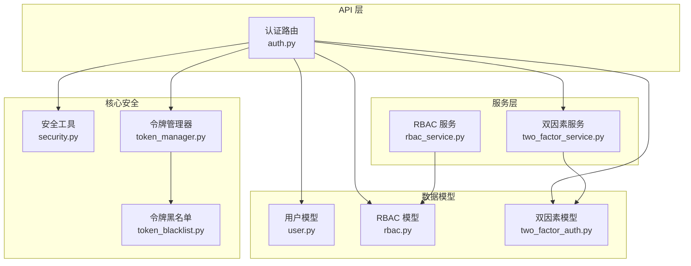
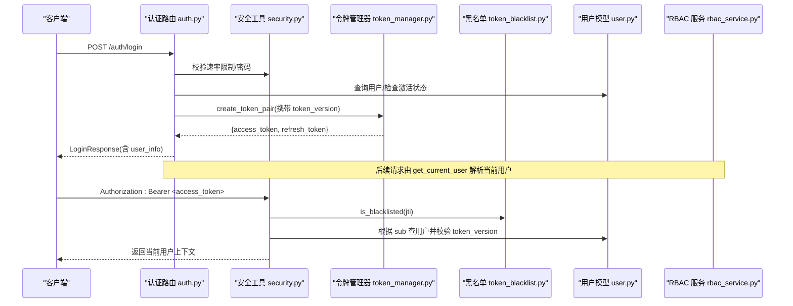
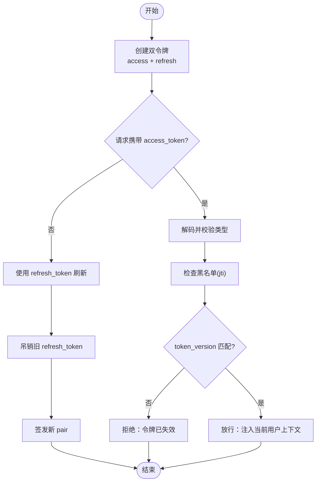
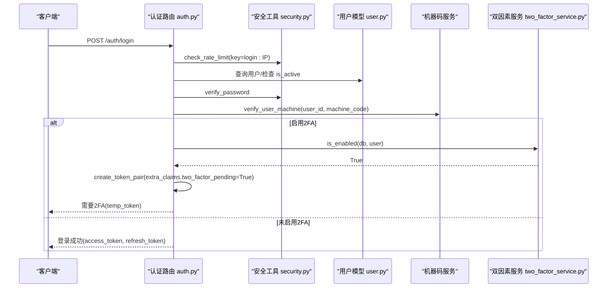
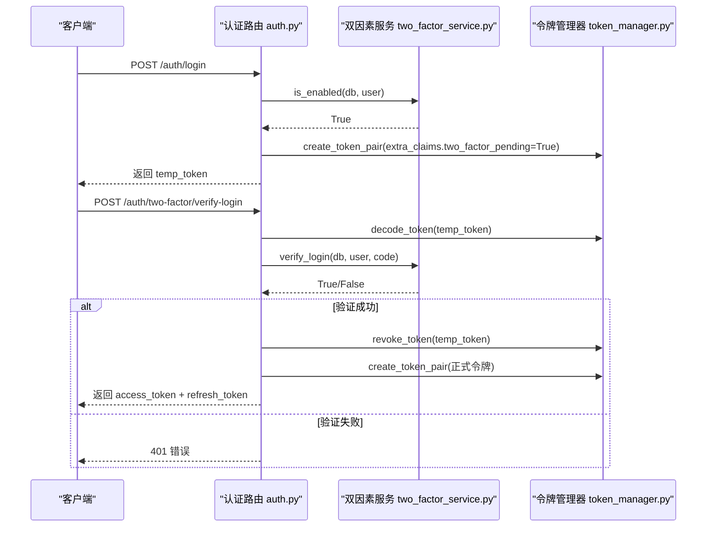
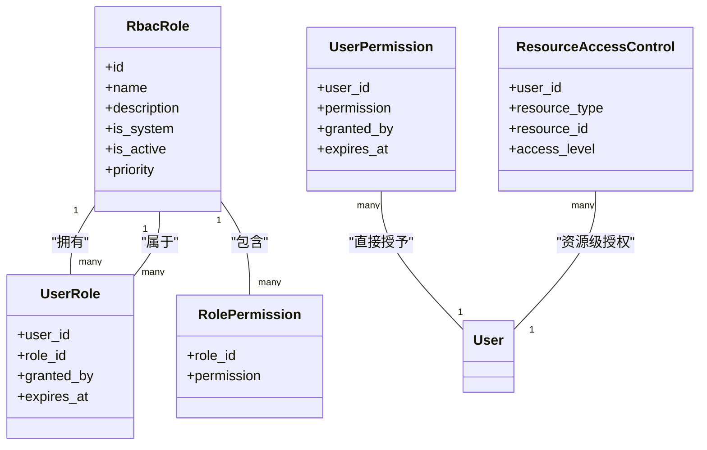
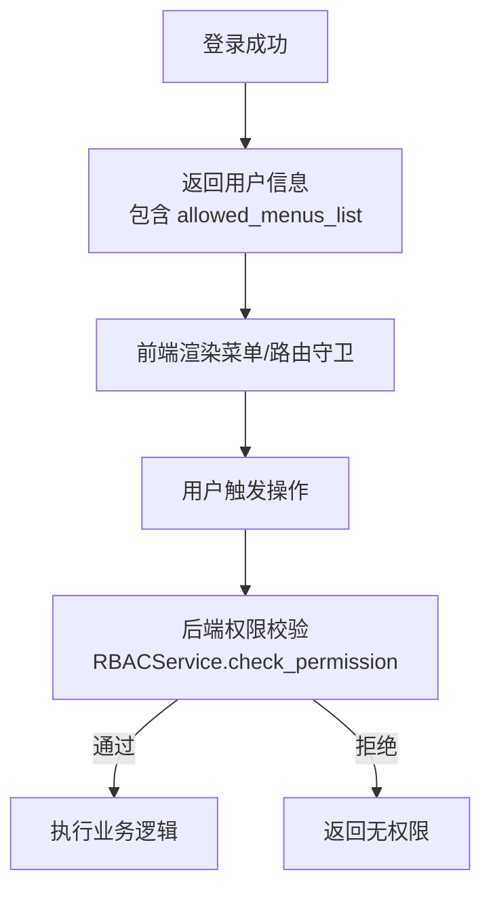
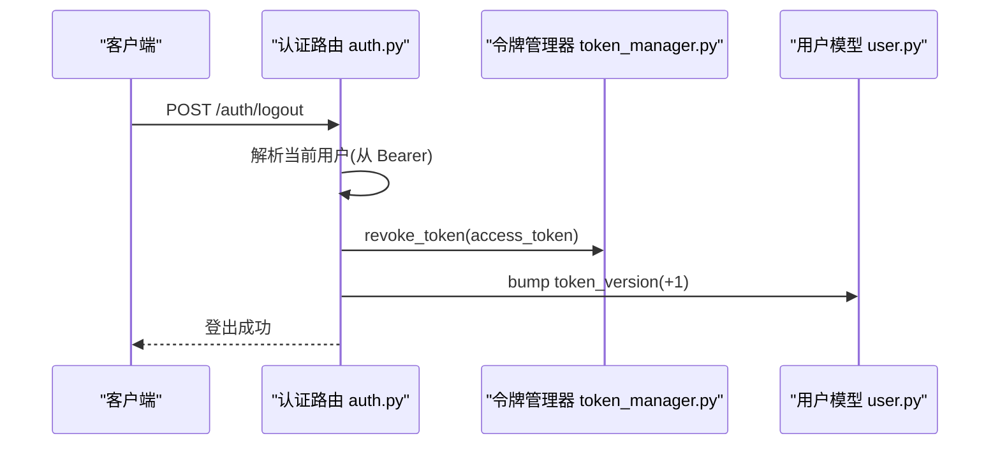
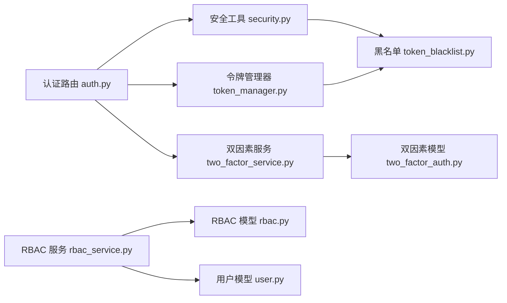

# 认证授权模块

<cite>
**本文引用的文件**
- [backend/app/api/v1/auth/auth.py](file://backend/app/api/v1/auth/auth.py)
- [backend/app/core/security.py](file://backend/app/core/security.py)
- [backend/app/core/token_manager.py](file://backend/app/core/token_manager.py)
- [backend/app/core/token_blacklist.py](file://backend/app/core/token_blacklist.py)
- [backend/app/models/rbac.py](file://backend/app/models/rbac.py)
- [backend/app/services/rbac_service.py](file://backend/app/services/rbac_service.py)
- [backend/app/models/user.py](file://backend/app/models/user.py)
- [backend/app/schemas/auth.py](file://backend/app/schemas/auth.py)
- [backend/app/models/two_factor_auth.py](file://backend/app/models/two_factor_auth.py)
- [backend/app/services/two_factor_service.py](file://backend/app/services/two_factor_service.py)
</cite>

## 目录
1. [简介](#简介)
2. [项目结构](#项目结构)
3. [核心组件](#核心组件)
4. [架构总览](#架构总览)
5. [详细组件分析](#详细组件分析)
6. [依赖关系分析](#依赖关系分析)
7. [性能考虑](#性能考虑)
8. [故障排查指南](#故障排查指南)
9. [结论](#结论)
10. [附录](#附录)

## 简介
本技术文档聚焦认证与授权子系统，系统性说明以下能力：
- JWT 令牌生命周期管理（生成、验证、刷新、吊销）
- 用户身份认证流程（含速率限制、账户锁定、机器码校验）
- 双因素认证（TOTP + 备用码）的登录集成
- RBAC 权限模型（用户-角色-权限映射）与资源级访问控制
- 菜单权限控制（前端指令与后端权限协同）
- 关键时序图与权限判断流程，帮助开发者理解安全机制实现细节

## 项目结构
认证授权相关代码主要分布在后端 FastAPI 应用中：
- API 层：认证路由、登录/登出/刷新/2FA 等接口
- 核心安全：密码哈希、JWT 基础操作、当前用户解析、速率限制
- 令牌管理：统一封装令牌创建、校验、刷新、吊销及黑名单持久化
- 数据模型：用户、RBAC 角色/权限/资源访问、双因素认证配置
- 服务层：RBAC 权限计算、双因素认证业务逻辑

**图示来源**
- [backend/app/api/v1/auth/auth.py:101-287](file://backend/app/api/v1/auth/auth.py#L101-L287)
- [backend/app/core/security.py:243-336](file://backend/app/core/security.py#L243-L336)
- [backend/app/core/token_manager.py:64-127](file://backend/app/core/token_manager.py#L64-L127)
- [backend/app/core/token_blacklist.py:27-70](file://backend/app/core/token_blacklist.py#L27-L70)
- [backend/app/models/user.py:26-85](file://backend/app/models/user.py#L26-L85)
- [backend/app/models/rbac.py:31-135](file://backend/app/models/rbac.py#L31-L135)
- [backend/app/models/two_factor_auth.py:13-35](file://backend/app/models/two_factor_auth.py#L13-L35)
- [backend/app/services/rbac_service.py:104-222](file://backend/app/services/rbac_service.py#L104-L222)
- [backend/app/services/two_factor_service.py:180-215](file://backend/app/services/two_factor_service.py#L180-L215)

**章节来源**
- [backend/app/api/v1/auth/auth.py:101-287](file://backend/app/api/v1/auth/auth.py#L101-L287)
- [backend/app/core/security.py:243-336](file://backend/app/core/security.py#L243-L336)
- [backend/app/core/token_manager.py:64-127](file://backend/app/core/token_manager.py#L64-L127)
- [backend/app/core/token_blacklist.py:27-70](file://backend/app/core/token_blacklist.py#L27-L70)
- [backend/app/models/user.py:26-85](file://backend/app/models/user.py#L26-L85)
- [backend/app/models/rbac.py:31-135](file://backend/app/models/rbac.py#L31-L135)
- [backend/app/models/two_factor_auth.py:13-35](file://backend/app/models/two_factor_auth.py#L13-L35)
- [backend/app/services/rbac_service.py:104-222](file://backend/app/services/rbac_service.py#L104-L222)
- [backend/app/services/two_factor_service.py:180-215](file://backend/app/services/two_factor_service.py#L180-L215)

## 核心组件
- 认证路由与流程编排：负责登录、2FA 验证、获取当前用户信息、登出、刷新令牌、CSRF Token 获取等。
- 安全工具：提供密码哈希/校验、JWT 基础编解码、FastAPI 当前用户依赖、速率限制、客户端 IP 识别等。
- 令牌管理器：统一封装 access/refresh token 对创建、校验、刷新、吊销，并对接黑名单持久化。
- 令牌黑名单：内存+数据库持久化的已吊销令牌集合，支持过期清理与重启恢复。
- RBAC 模型与服务：定义角色、用户-角色、角色-权限、用户直接权限、资源访问控制；提供权限计算、分配、撤销、批量操作。
- 双因素认证模型与服务：存储 TOTP 密钥与备用码，提供启用、验证、登录校验、禁用等功能。
- 用户模型：承载用户基本信息、角色、组织、菜单白名单、token_version 等与安全相关的字段。

**章节来源**
- [backend/app/api/v1/auth/auth.py:101-287](file://backend/app/api/v1/auth/auth.py#L101-L287)
- [backend/app/core/security.py:120-148](file://backend/app/core/security.py#L120-L148)
- [backend/app/core/token_manager.py:64-127](file://backend/app/core/token_manager.py#L64-L127)
- [backend/app/core/token_blacklist.py:27-70](file://backend/app/core/token_blacklist.py#L27-L70)
- [backend/app/models/rbac.py:31-135](file://backend/app/models/rbac.py#L31-L135)
- [backend/app/services/rbac_service.py:104-222](file://backend/app/services/rbac_service.py#L104-L222)
- [backend/app/models/two_factor_auth.py:13-35](file://backend/app/models/two_factor_auth.py#L13-L35)
- [backend/app/services/two_factor_service.py:103-177](file://backend/app/services/two_factor_service.py#L103-L177)
- [backend/app/models/user.py:26-85](file://backend/app/models/user.py#L26-L85)

## 架构总览
认证授权系统采用分层设计：
- API 层暴露 RESTful 接口，编排认证流程（登录→2FA→签发令牌；登出→吊销令牌→版本升级）。
- 核心安全层提供通用能力（密码策略、JWT 基础、当前用户解析、速率限制）。
- 令牌管理层抽象令牌全生命周期，屏蔽底层 JWT 库与黑名单细节。
- 数据模型层定义实体关系（用户、RBAC、2FA），支撑权限计算与审计。
- 服务层封装复杂业务逻辑（RBAC 权限计算、2FA 流程）。

**图示来源**
- [backend/app/api/v1/auth/auth.py:101-287](file://backend/app/api/v1/auth/auth.py#L101-L287)
- [backend/app/core/security.py:243-336](file://backend/app/core/security.py#L243-L336)
- [backend/app/core/token_manager.py:64-127](file://backend/app/core/token_manager.py#L64-L127)
- [backend/app/core/token_blacklist.py:27-70](file://backend/app/core/token_blacklist.py#L27-L70)
- [backend/app/models/user.py:26-85](file://backend/app/models/user.py#L26-L85)
- [backend/app/services/rbac_service.py:104-222](file://backend/app/services/rbac_service.py#L104-L222)

## 详细组件分析

### JWT 令牌管理机制
- 令牌生成：通过令牌管理器创建 access/refresh 双令牌，包含 jti、type、exp、sub 以及可选 extra_claims（如 token_version）。
- 令牌验证：安全模块在 get_current_user 中解码令牌，校验类型、黑名单、用户存在性、token_version 一致性。
- 令牌刷新：仅接受 refresh_token，校验后吊销旧 refresh_token 并签发新 pair，防止重放攻击。
- 令牌吊销：将 jti 加入内存黑名单，并异步持久化到数据库，确保重启后仍有效；登出时还可递增 token_version 使该用户所有现存 JWT 立即失效。

**图示来源**
- [backend/app/core/token_manager.py:64-127](file://backend/app/core/token_manager.py#L64-L127)
- [backend/app/core/security.py:243-336](file://backend/app/core/security.py#L243-L336)
- [backend/app/core/token_blacklist.py:27-70](file://backend/app/core/token_blacklist.py#L27-L70)
- [backend/app/api/v1/auth/auth.py:594-689](file://backend/app/api/v1/auth/auth.py#L594-L689)

**章节来源**
- [backend/app/core/token_manager.py:64-127](file://backend/app/core/token_manager.py#L64-L127)
- [backend/app/core/security.py:243-336](file://backend/app/core/security.py#L243-L336)
- [backend/app/core/token_blacklist.py:27-70](file://backend/app/core/token_blacklist.py#L27-L70)
- [backend/app/api/v1/auth/auth.py:594-689](file://backend/app/api/v1/auth/auth.py#L594-L689)

### 用户身份验证流程
- 登录入口：校验用户名/密码、账户激活状态、账户锁定状态、机器码绑定校验。
- 速率限制：基于 IP 的滑动窗口限流，防止暴力破解。
- 审计日志：登录成功/失败均记录审计日志，便于追踪。
- 结果返回：成功后返回 access_token、refresh_token 与用户信息（含角色、权限、菜单白名单）。

**图示来源**
- [backend/app/api/v1/auth/auth.py:101-287](file://backend/app/api/v1/auth/auth.py#L101-L287)
- [backend/app/core/security.py:439-488](file://backend/app/core/security.py#L439-L488)
- [backend/app/services/two_factor_service.py:233-250](file://backend/app/services/two_factor_service.py#L233-L250)

**章节来源**
- [backend/app/api/v1/auth/auth.py:101-287](file://backend/app/api/v1/auth/auth.py#L101-L287)
- [backend/app/core/security.py:439-488](file://backend/app/core/security.py#L439-L488)
- [backend/app/services/two_factor_service.py:233-250](file://backend/app/services/two_factor_service.py#L233-L250)

### 双因素认证（2FA）实现
- 启用流程：生成 TOTP 密钥与备用码，加密存储密钥，生成二维码供客户端扫码绑定。
- 验证流程：登录时若检测到用户启用 2FA，返回临时令牌；客户端提交 temp_token + TOTP/备用码完成二次验证，服务端吊销临时令牌并签发正式令牌。
- 安全要点：备用码一次性使用后立即移除；TOTP 验证允许时间窗口容差。

**图示来源**
- [backend/app/api/v1/auth/auth.py:290-444](file://backend/app/api/v1/auth/auth.py#L290-L444)
- [backend/app/services/two_factor_service.py:103-177](file://backend/app/services/two_factor_service.py#L103-L177)
- [backend/app/services/two_factor_service.py:180-215](file://backend/app/services/two_factor_service.py#L180-L215)
- [backend/app/core/token_manager.py:176-210](file://backend/app/core/token_manager.py#L176-L210)

**章节来源**
- [backend/app/api/v1/auth/auth.py:290-444](file://backend/app/api/v1/auth/auth.py#L290-L444)
- [backend/app/services/two_factor_service.py:103-177](file://backend/app/services/two_factor_service.py#L103-L177)
- [backend/app/services/two_factor_service.py:180-215](file://backend/app/services/two_factor_service.py#L180-L215)
- [backend/app/core/token_manager.py:176-210](file://backend/app/core/token_manager.py#L176-L210)

### RBAC 权限模型与设计
- 角色与权限：角色可关联多个权限；用户可被分配角色或直接授予权限。
- 资源访问控制：支持按资源类型与资源 ID 细粒度授权（读/写/删除）。
- 权限计算：管理员优先；其次直接权限；再角色权限；最后资源级权限；同时考虑机器码限制与用户白名单。
- 审计：每次权限检查均记录访问日志，便于追溯。

**图示来源**
- [backend/app/models/rbac.py:31-135](file://backend/app/models/rbac.py#L31-L135)
- [backend/app/models/rbac.py:137-188](file://backend/app/models/rbac.py#L137-L188)

**章节来源**
- [backend/app/models/rbac.py:31-135](file://backend/app/models/rbac.py#L31-L135)
- [backend/app/models/rbac.py:137-188](file://backend/app/models/rbac.py#L137-L188)
- [backend/app/services/rbac_service.py:104-222](file://backend/app/services/rbac_service.py#L104-L222)

### 菜单权限控制（前后端协同）
- 后端：用户信息中包含 allowed_menus 与 allowed_menus_list，用于标识用户可见菜单 key 列表；优先级为“用户自定义 > 权限包 > 角色默认”。
- 前端：基于 allowed_menus_list 渲染侧边栏与路由守卫；结合后端权限指令进行按钮/功能级控制。
- 协同机制：登录后返回的用户信息即包含菜单白名单；前端据此构建导航；后端在敏感操作处再次校验权限，确保安全闭环。

**图示来源**
- [backend/app/api/v1/auth/auth.py:241-254](file://backend/app/api/v1/auth/auth.py#L241-L254)
- [backend/app/models/user.py:71-77](file://backend/app/models/user.py#L71-L77)
- [backend/app/services/rbac_service.py:133-222](file://backend/app/services/rbac_service.py#L133-L222)

**章节来源**
- [backend/app/api/v1/auth/auth.py:241-254](file://backend/app/api/v1/auth/auth.py#L241-L254)
- [backend/app/models/user.py:71-77](file://backend/app/models/user.py#L71-L77)
- [backend/app/services/rbac_service.py:133-222](file://backend/app/services/rbac_service.py#L133-L222)

### 登出与令牌撤销
- 登出流程：解析当前用户，吊销本次请求携带的 access_token（可选吊销 refresh_token），递增 token_version 使该用户所有现存 JWT 立即失效，并记录审计日志。
- 黑名单机制：吊销时将 jti 加入内存黑名单，并持久化到数据库，确保重启后仍有效。

**图示来源**
- [backend/app/api/v1/auth/auth.py:570-591](file://backend/app/api/v1/auth/auth.py#L570-L591)
- [backend/app/core/token_manager.py:176-210](file://backend/app/core/token_manager.py#L176-L210)
- [backend/app/models/user.py:145-149](file://backend/app/models/user.py#L145-L149)

**章节来源**
- [backend/app/api/v1/auth/auth.py:570-591](file://backend/app/api/v1/auth/auth.py#L570-L591)
- [backend/app/core/token_manager.py:176-210](file://backend/app/core/token_manager.py#L176-L210)
- [backend/app/models/user.py:145-149](file://backend/app/models/user.py#L145-L149)

## 依赖关系分析
- 认证路由依赖安全工具（密码校验、速率限制）、令牌管理器（令牌生命周期）、双因素服务（2FA 流程）、用户服务（用户查询）。
- 安全模块依赖令牌黑名单（吊销检查）、数据库会话（用户查询）。
- RBAC 服务依赖 RBAC 模型（角色/权限/资源访问）、用户模型（白名单/菜单配置）、机器码权限服务（限制权限）。
- 令牌管理器依赖黑名单（吊销持久化）与安全模块（密钥/算法）。

**图示来源**
- [backend/app/api/v1/auth/auth.py:101-287](file://backend/app/api/v1/auth/auth.py#L101-L287)
- [backend/app/core/security.py:243-336](file://backend/app/core/security.py#L243-L336)
- [backend/app/core/token_manager.py:64-127](file://backend/app/core/token_manager.py#L64-L127)
- [backend/app/core/token_blacklist.py:27-70](file://backend/app/core/token_blacklist.py#L27-L70)
- [backend/app/services/rbac_service.py:104-222](file://backend/app/services/rbac_service.py#L104-L222)
- [backend/app/models/rbac.py:31-135](file://backend/app/models/rbac.py#L31-L135)
- [backend/app/models/user.py:26-85](file://backend/app/models/user.py#L26-L85)
- [backend/app/models/two_factor_auth.py:13-35](file://backend/app/models/two_factor_auth.py#L13-L35)
- [backend/app/services/two_factor_service.py:180-215](file://backend/app/services/two_factor_service.py#L180-L215)

**章节来源**
- [backend/app/api/v1/auth/auth.py:101-287](file://backend/app/api/v1/auth/auth.py#L101-L287)
- [backend/app/core/security.py:243-336](file://backend/app/core/security.py#L243-L336)
- [backend/app/core/token_manager.py:64-127](file://backend/app/core/token_manager.py#L64-L127)
- [backend/app/core/token_blacklist.py:27-70](file://backend/app/core/token_blacklist.py#L27-L70)
- [backend/app/services/rbac_service.py:104-222](file://backend/app/services/rbac_service.py#L104-L222)
- [backend/app/models/rbac.py:31-135](file://backend/app/models/rbac.py#L31-L135)
- [backend/app/models/user.py:26-85](file://backend/app/models/user.py#L26-L85)
- [backend/app/models/two_factor_auth.py:13-35](file://backend/app/models/two_factor_auth.py#L13-L35)
- [backend/app/services/two_factor_service.py:180-215](file://backend/app/services/two_factor_service.py#L180-L215)

## 性能考虑
- 速率限制：登录、注册、刷新、CSRF 均实施滑动窗口限流，降低暴力破解风险。
- 黑名单清理：定期清理过期条目，避免内存泄漏。
- 权限计算缓存：单次请求内缓存机器码限制权限，减少重复查询。
- 数据库索引：RBAC 表建立复合索引优化查询性能。
- 令牌版本：通过 token_version 实现强制下线，避免长尾过期令牌影响安全。

[本节为通用指导，不直接分析具体文件]

## 故障排查指南
- 登录失败：检查用户名是否存在、密码是否正确、账户是否激活、是否达到锁定阈值、机器码是否绑定。
- 2FA 验证失败：确认 temp_token 是否有效、TOTP 或备用码是否正确、时间窗口是否容差。
- 令牌无效：检查是否被加入黑名单、token_version 是否匹配、令牌类型是否为 access。
- 权限不足：确认用户是否具备直接权限或角色权限，是否被机器码限制，资源级权限是否配置。
- 审计日志：查看登录/登出/权限检查日志，定位问题原因。

**章节来源**
- [backend/app/api/v1/auth/auth.py:77-99](file://backend/app/api/v1/auth/auth.py#L77-L99)
- [backend/app/api/v1/auth/auth.py:290-444](file://backend/app/api/v1/auth/auth.py#L290-L444)
- [backend/app/core/security.py:243-336](file://backend/app/core/security.py#L243-L336)
- [backend/app/services/rbac_service.py:716-741](file://backend/app/services/rbac_service.py#L716-L741)

## 结论
本认证授权模块通过分层设计与严格的安全策略，实现了健壮的令牌管理、多因子认证与细粒度权限控制。JWT 令牌的生命周期管理结合黑名单与 token_version 机制，确保令牌可即时吊销与全局失效；RBAC 模型支持角色与资源级权限，配合机器码限制与用户白名单，满足复杂业务场景；双因素认证提升账户安全性。前后端通过菜单白名单与权限指令协同，形成完整的安全闭环。

[本节为总结性内容，不直接分析具体文件]

## 附录
- 关键接口路径参考：
  - 登录：POST /auth/login
  - 2FA 验证：POST /auth/two-factor/verify-login
  - 获取当前用户：GET /auth/me
  - 登出：POST /auth/logout
  - 刷新令牌：POST /auth/refresh
  - CSRF Token：GET /auth/csrf-token

**章节来源**
- [backend/app/api/v1/auth/auth.py:101-287](file://backend/app/api/v1/auth/auth.py#L101-L287)
- [backend/app/api/v1/auth/auth.py:290-444](file://backend/app/api/v1/auth/auth.py#L290-L444)
- [backend/app/api/v1/auth/auth.py:473-505](file://backend/app/api/v1/auth/auth.py#L473-L505)
- [backend/app/api/v1/auth/auth.py:570-591](file://backend/app/api/v1/auth/auth.py#L570-L591)
- [backend/app/api/v1/auth/auth.py:594-689](file://backend/app/api/v1/auth/auth.py#L594-L689)
- [backend/app/api/v1/auth/auth.py:692-747](file://backend/app/api/v1/auth/auth.py#L692-L747)