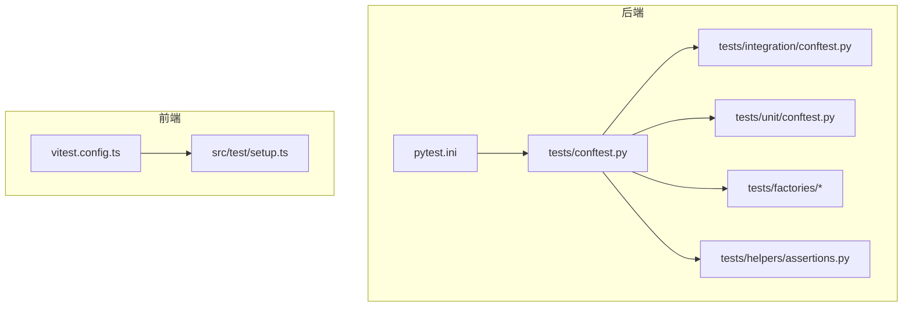
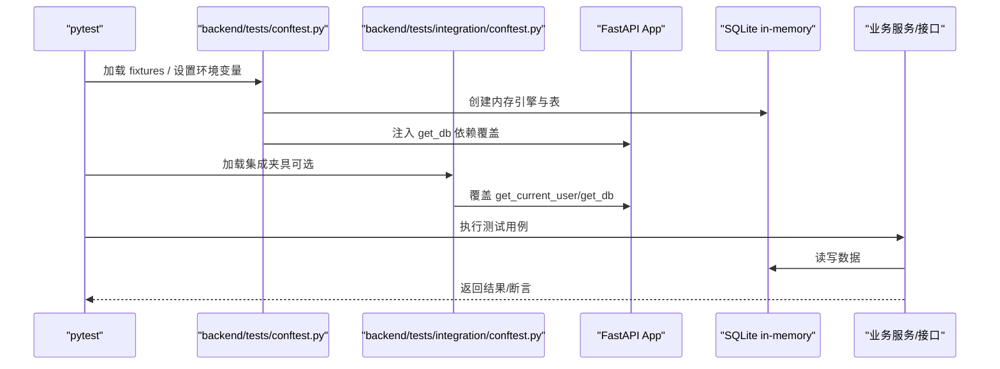
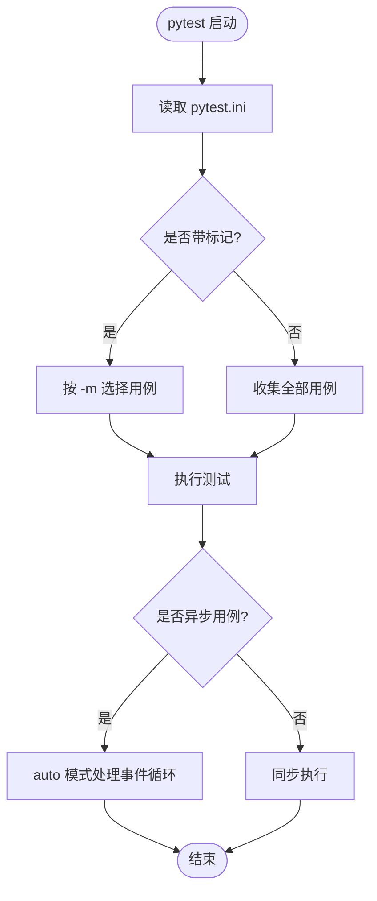
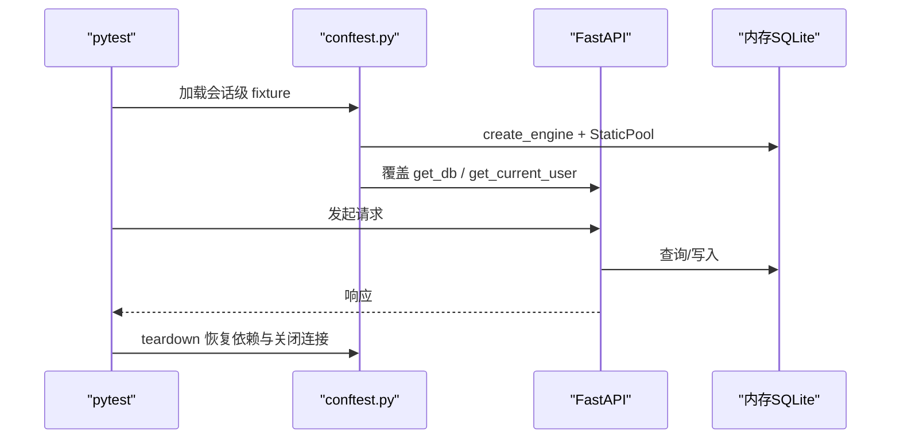
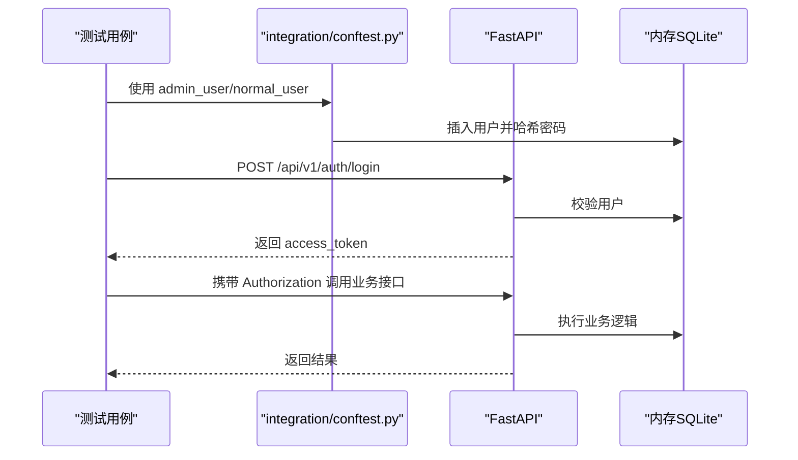
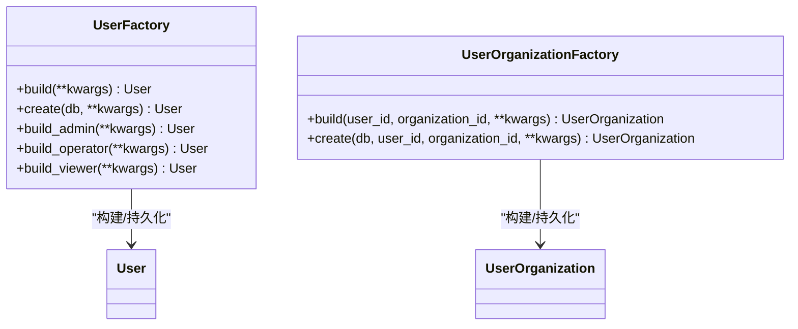
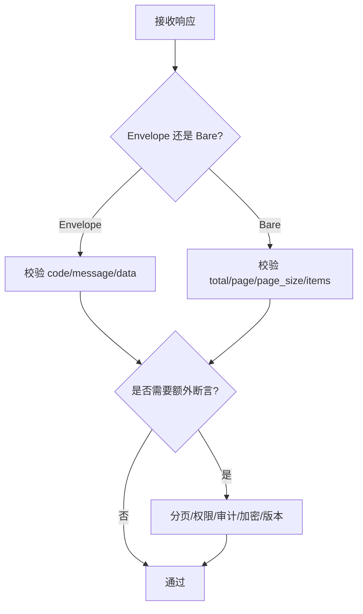
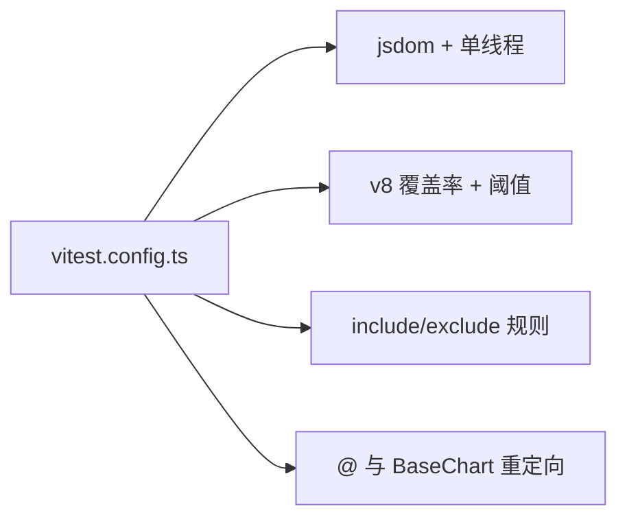
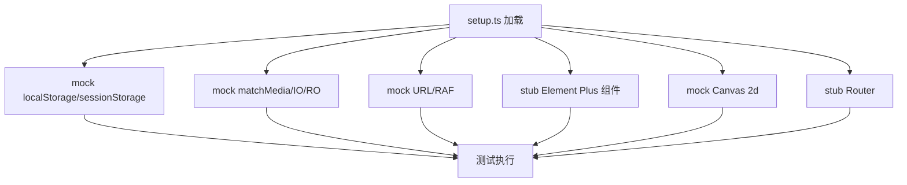
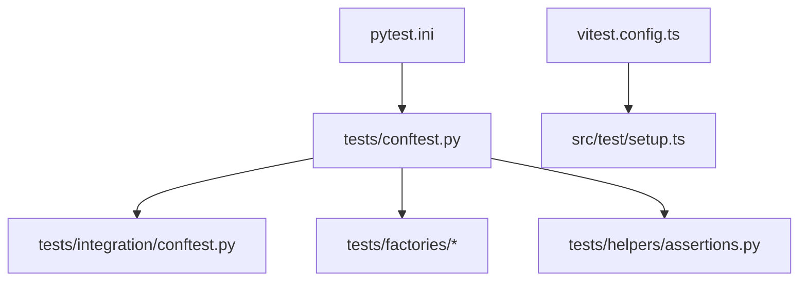

# 单元测试

<cite>
**本文引用的文件**
- [backend/pytest.ini](file://backend/pytest.ini)
- [backend/.coveragerc](file://backend/.coveragerc)
- [backend/pyproject.toml](file://backend/pyproject.toml)
- [backend/tests/conftest.py](file://backend/tests/conftest.py)
- [backend/tests/unit/conftest.py](file://backend/tests/unit/conftest.py)
- [backend/tests/integration/conftest.py](file://backend/tests/integration/conftest.py)
- [backend/tests/factories/__init__.py](file://backend/tests/factories/__init__.py)
- [backend/tests/factories/user_factory.py](file://backend/tests/factories/user_factory.py)
- [backend/tests/helpers/assertions.py](file://backend/tests/helpers/assertions.py)
- [frontend/vitest.config.ts](file://frontend/vitest.config.ts)
- [frontend/src/test/setup.ts](file://frontend/src/test/setup.ts)
</cite>

## 目录
1. [简介](#简介)
2. [项目结构](#项目结构)
3. [核心组件](#核心组件)
4. [架构总览](#架构总览)
5. [详细组件分析](#详细组件分析)
6. [依赖关系分析](#依赖关系分析)
7. [性能考虑](#性能考虑)
8. [故障排查指南](#故障排查指南)
9. [结论](#结论)
10. [附录](#附录)

## 简介
本文件面向后端 Python（pytest）与前端 TypeScript（Vitest）的单元测试体系，系统性说明测试用例编写、Mock 策略、数据库测试、异步测试、覆盖率配置、测试数据工厂模式、测试环境隔离与最佳实践，并提供可操作的调试技巧。目标是让不同技术背景的读者都能快速上手并稳定运行测试。

## 项目结构
后端测试位于 backend/tests，按 unit、integration、security 等分层组织；前端测试位于 frontend/tests/unit，配合 vitest.config.ts 与 src/test/setup.ts 完成浏览器环境模拟与全局桩。

**图示来源**
- [backend/pytest.ini:1-38](file://backend/pytest.ini#L1-L38)
- [backend/tests/conftest.py:1-697](file://backend/tests/conftest.py#L1-L697)
- [backend/tests/integration/conftest.py:1-313](file://backend/tests/integration/conftest.py#L1-L313)
- [backend/tests/unit/conftest.py:1-67](file://backend/tests/unit/conftest.py#L1-L67)
- [backend/tests/factories/__init__.py:1-38](file://backend/tests/factories/__init__.py#L1-L38)
- [backend/tests/helpers/assertions.py:1-190](file://backend/tests/helpers/assertions.py#L1-L190)
- [frontend/vitest.config.ts:1-104](file://frontend/vitest.config.ts#L1-L104)
- [frontend/src/test/setup.ts:1-330](file://frontend/src/test/setup.ts#L1-L330)

**章节来源**
- [backend/pytest.ini:1-38](file://backend/pytest.ini#L1-L38)
- [backend/tests/conftest.py:1-697](file://backend/tests/conftest.py#L1-L697)
- [backend/tests/integration/conftest.py:1-313](file://backend/tests/integration/conftest.py#L1-L313)
- [backend/tests/unit/conftest.py:1-67](file://backend/tests/unit/conftest.py#L1-L67)
- [backend/tests/factories/__init__.py:1-38](file://backend/tests/factories/__init__.py#L1-L38)
- [backend/tests/helpers/assertions.py:1-190](file://backend/tests/helpers/assertions.py#L1-L190)
- [frontend/vitest.config.ts:1-104](file://frontend/vitest.config.ts#L1-L104)
- [frontend/src/test/setup.ts:1-330](file://frontend/src/test/setup.ts#L1-L330)

## 核心组件
- 后端 pytest 配置：定义测试路径、标记、异步模式、警告过滤等。
- 后端 conftest：提供内存 SQLite、TestClient、认证覆盖、设置隔离、模型导入与平台跳过策略。
- 后端集成测试 conftest：独立内存库、自动建表/清理、真实登录流程获取 token。
- 后端工厂与断言：统一构造测试数据与响应断言工具。
- 前端 Vitest 配置：jsdom 环境、单线程执行、覆盖率阈值、包含/排除规则、别名与重试。
- 前端 setup：localStorage/sessionStorage、matchMedia、IntersectionObserver、ResizeObserver、Element Plus 组件桩、Canvas 桩、路由桩等。

**章节来源**
- [backend/pytest.ini:1-38](file://backend/pytest.ini#L1-L38)
- [backend/tests/conftest.py:1-697](file://backend/tests/conftest.py#L1-L697)
- [backend/tests/integration/conftest.py:1-313](file://backend/tests/integration/conftest.py#L1-L313)
- [backend/tests/factories/__init__.py:1-38](file://backend/tests/factories/__init__.py#L1-L38)
- [backend/tests/helpers/assertions.py:1-190](file://backend/tests/helpers/assertions.py#L1-L190)
- [frontend/vitest.config.ts:1-104](file://frontend/vitest.config.ts#L1-L104)
- [frontend/src/test/setup.ts:1-330](file://frontend/src/test/setup.ts#L1-L330)

## 架构总览
后端测试通过 pytest 收集用例，conftest 在会话级注入环境变量与模块级替换，确保所有测试使用内存数据库与受控依赖；集成测试进一步提供完整 API 调用链路与真实鉴权流程。前端测试由 Vitest 驱动，setup 文件在 jsdom 中补齐浏览器能力并全局桩化 UI 组件与存储，保证组件与状态管理测试稳定。

**图示来源**
- [backend/tests/conftest.py:352-410](file://backend/tests/conftest.py#L352-L410)
- [backend/tests/integration/conftest.py:112-197](file://backend/tests/integration/conftest.py#L112-L197)

**章节来源**
- [backend/tests/conftest.py:352-410](file://backend/tests/conftest.py#L352-L410)
- [backend/tests/integration/conftest.py:112-197](file://backend/tests/integration/conftest.py#L112-L197)

## 详细组件分析

### 后端 pytest 配置与异步测试
- 测试路径与命名约定：testpaths=tests，匹配 test_*.py、Test*、test_*。
- 标记体系：slow、unit、integration、security、approval、e2e、stress、performance，便于选择性执行。
- 异步支持：asyncio_mode=auto，默认 fixture 作用域为 function，简化 async 测试。
- 警告过滤：针对第三方弃用与测试预期行为进行精准忽略，避免噪声掩盖真实问题。

**图示来源**
- [backend/pytest.ini:1-38](file://backend/pytest.ini#L1-L38)

**章节来源**
- [backend/pytest.ini:1-38](file://backend/pytest.ini#L1-L38)

### 后端测试夹具与环境隔离
- 会话级环境变量与编码修复：强制 UTF-8、MPLBACKEND=Agg，避免 Windows 控制台与无头环境异常。
- 模型预导入：会话开始时导入全部模型子模块，确保 SQLAlchemy mapper 注册表完整。
- 内存数据库与 TestClient：每个 client fixture 创建内存 SQLite，覆盖 get_db，并在 teardown 恢复原始依赖与全局 engine/SessionLocal。
- 认证覆盖：通过 dependency_overrides 注入当前用户，无需真实 JWT 即可访问受保护接口。
- 平台相关跳过：非 Windows 环境跳过仅 Windows 的行为用例，提升跨平台稳定性。

**图示来源**
- [backend/tests/conftest.py:352-410](file://backend/tests/conftest.py#L352-L410)
- [backend/tests/conftest.py:61-73](file://backend/tests/conftest.py#L61-L73)
- [backend/tests/unit/conftest.py:25-67](file://backend/tests/unit/conftest.py#L25-L67)

**章节来源**
- [backend/tests/conftest.py:61-73](file://backend/tests/conftest.py#L61-L73)
- [backend/tests/conftest.py:352-410](file://backend/tests/conftest.py#L352-L410)
- [backend/tests/unit/conftest.py:25-67](file://backend/tests/unit/conftest.py#L25-L67)

### 后端集成测试：真实鉴权与共享数据库
- 独立内存库：使用 sqlite:// 内存库，每个测试前建表，结束后 drop_all。
- 依赖覆盖：同时覆盖 get_db 与 get_current_user/get_current_active_user，使鉴权直接命中内存库中的测试用户。
- 登录流程：通过 /api/v1/auth/login 获取 access_token，生成 headers 供后续接口调用。
- 清理策略：关闭外键检查、抑制特定警告，确保 drop_all 顺利执行。

**图示来源**
- [backend/tests/integration/conftest.py:112-197](file://backend/tests/integration/conftest.py#L112-L197)
- [backend/tests/integration/conftest.py:216-313](file://backend/tests/integration/conftest.py#L216-L313)

**章节来源**
- [backend/tests/integration/conftest.py:112-197](file://backend/tests/integration/conftest.py#L112-L197)
- [backend/tests/integration/conftest.py:216-313](file://backend/tests/integration/conftest.py#L216-L313)

### 后端测试数据工厂模式
- 工厂入口：统一导出各实体工厂，便于按需引入。
- 用户工厂：提供 build/create/build_admin/operator/viewer 等方法，内置默认值与密码哈希。
- 扩展性：其他实体（组织、村庄、项目、经费、审批、学校等）遵循相同模式，集中维护默认字段与创建流程。

**图示来源**
- [backend/tests/factories/user_factory.py:10-86](file://backend/tests/factories/user_factory.py#L10-L86)
- [backend/tests/factories/__init__.py:1-38](file://backend/tests/factories/__init__.py#L1-L38)

**章节来源**
- [backend/tests/factories/user_factory.py:10-86](file://backend/tests/factories/user_factory.py#L10-L86)
- [backend/tests/factories/__init__.py:1-38](file://backend/tests/factories/__init__.py#L1-L38)

### 后端响应断言与一致性校验
- Envelope/Bare 格式断言：统一校验 code/message/data 或 total/page/page_size/items。
- 分页断言：便捷校验 meta.pagination。
- 权限与错误：断言 403/401/404/422 及错误体结构。
- 审计日志：支持 Mock 或服务对象两种断言方式。
- 加密字段与版本递增：验证敏感字段加密与并发安全字段自增。

**图示来源**
- [backend/tests/helpers/assertions.py:9-190](file://backend/tests/helpers/assertions.py#L9-L190)

**章节来源**
- [backend/tests/helpers/assertions.py:9-190](file://backend/tests/helpers/assertions.py#L9-L190)

### 前端 Vitest 配置与组件测试
- 环境与并行：jsdom 环境，单线程 fileParallelism=false，缓解 Windows 下 v8 coverage 竞态导致的 ENOENT。
- 重试机制：retry=1 缓解时序抖动，不掩盖真实回归。
- 覆盖率：v8 provider，text/json/html 报告，按目录设定阈值（utils/stores/composables/api/views/components/router/config/directives 均为 90%）。
- 包含/排除：仅执行 tests/unit 与根级 property-based 测试，排除 e2e、dist、node_modules 等。
- 别名：@ 指向 src，charts/BaseChart.vue 重定向到 common/BaseChart.vue，解决测试期相对导入问题。

**图示来源**
- [frontend/vitest.config.ts:1-104](file://frontend/vitest.config.ts#L1-L104)

**章节来源**
- [frontend/vitest.config.ts:1-104](file://frontend/vitest.config.ts#L1-L104)

### 前端测试环境桩与状态管理测试
- 存储桩：localStorage/sessionStorage 内存实现，beforeEach 清空，避免跨测试污染。
- 浏览器 API 桩：matchMedia、IntersectionObserver、ResizeObserver、requestAnimationFrame、URL.createObjectURL/revokeObjectURL。
- UI 组件桩：全局 stub Element Plus 组件与布局组件，减少渲染依赖。
- Canvas 桩：提供最小 2d 上下文，避免图表销毁时报错。
- 路由桩：提供最小 router，消除注入缺失告警。

**图示来源**
- [frontend/src/test/setup.ts:16-330](file://frontend/src/test/setup.ts#L16-L330)

**章节来源**
- [frontend/src/test/setup.ts:16-330](file://frontend/src/test/setup.ts#L16-L330)

### 前端 API 调用测试与状态管理测试
- API 调用测试：结合 vi.mock 或 fetch 拦截，验证请求参数、响应结构与错误分支。
- 状态管理测试：基于 stores/*.ts 的覆盖率阈值，重点覆盖关键分支与副作用。
- 组件测试：利用全局组件桩与路由桩，聚焦业务逻辑与交互行为。

[本节为概念性说明，不直接分析具体文件]

## 依赖关系分析
- pytest 与 conftest：pytest.ini 驱动收集与执行，conftest 提供夹具与环境隔离。
- 集成测试 conftest：依赖 FastAPI、SQLAlchemy、app.models、app.core.database/security。
- 工厂与断言：被各层测试复用，降低耦合度。
- Vitest 与 setup：vitest.config.ts 控制执行与覆盖率，setup.ts 提供运行时桩。

**图示来源**
- [backend/pytest.ini:1-38](file://backend/pytest.ini#L1-L38)
- [backend/tests/conftest.py:1-697](file://backend/tests/conftest.py#L1-L697)
- [backend/tests/integration/conftest.py:1-313](file://backend/tests/integration/conftest.py#L1-L313)
- [backend/tests/factories/__init__.py:1-38](file://backend/tests/factories/__init__.py#L1-L38)
- [backend/tests/helpers/assertions.py:1-190](file://backend/tests/helpers/assertions.py#L1-L190)
- [frontend/vitest.config.ts:1-104](file://frontend/vitest.config.ts#L1-L104)
- [frontend/src/test/setup.ts:1-330](file://frontend/src/test/setup.ts#L1-L330)

**章节来源**
- [backend/pytest.ini:1-38](file://backend/pytest.ini#L1-L38)
- [backend/tests/conftest.py:1-697](file://backend/tests/conftest.py#L1-L697)
- [backend/tests/integration/conftest.py:1-313](file://backend/tests/integration/conftest.py#L1-L313)
- [backend/tests/factories/__init__.py:1-38](file://backend/tests/factories/__init__.py#L1-L38)
- [backend/tests/helpers/assertions.py:1-190](file://backend/tests/helpers/assertions.py#L1-L190)
- [frontend/vitest.config.ts:1-104](file://frontend/vitest.config.ts#L1-L104)
- [frontend/src/test/setup.ts:1-330](file://frontend/src/test/setup.ts#L1-L330)

## 性能考虑
- 后端：
  - 使用内存 SQLite 与 StaticPool，避免磁盘 IO 与锁竞争。
  - 会话级预导入模型，减少首次导入开销。
  - 精确过滤弃用警告，降低输出噪音。
- 前端：
  - 单线程执行与 retry=1，平衡稳定性与速度。
  - 覆盖率阈值按目录分级，避免过度追求 100% 导致维护成本上升。
  - 全局组件桩减少渲染与资源消耗。

[本节提供通用指导，不直接分析具体文件]

## 故障排查指南
- 后端常见问题：
  - 真实数据库被误写：确认 DATABASE_URL 已设置为内存或测试库，且 conftest 已覆盖 get_db 与 SessionLocal。
  - 权限/认证失败：检查 dependency_overrides 是否正确注入 get_current_user。
  - 平台差异：非 Windows 环境跳过 Windows 专属用例，避免误报。
- 前端常见问题：
  - 组件解析告警：确认 Element Plus 组件已全局 stub。
  - Canvas 报错：确保 HTMLCanvasElement.getContext 已桩化。
  - 存储污染：确认 beforeEach 清空 localStorage/sessionStorage。

**章节来源**
- [backend/tests/conftest.py:352-410](file://backend/tests/conftest.py#L352-L410)
- [backend/tests/unit/conftest.py:25-67](file://backend/tests/unit/conftest.py#L25-L67)
- [frontend/src/test/setup.ts:16-330](file://frontend/src/test/setup.ts#L16-L330)

## 结论
本项目构建了完善的后端 pytest 与前端的 Vitest 测试体系：通过 conftest 与环境桩实现强隔离，工厂与断言工具提升可读性与一致性，覆盖率门禁保障质量。建议持续完善边界条件与异常分支测试，保持覆盖率阈值合理，定期复盘 flaky 用例与性能瓶颈。

[本节为总结性内容，不直接分析具体文件]

## 附录
- 覆盖率配置要点：
  - 后端：coverage 源为 app，fail_under=100，exclude_lines 豁免不可执行行。
  - 前端：v8 provider，按目录设置阈值，排除类型与配置文件。
- 调试技巧：
  - 后端：使用 -v --tb=line 快速定位；通过 pytest.mark 选择性执行；打印日志时注意 UTF-8。
  - 前端：开启 console.warn 过滤以减少干扰；逐步注释桩以定位缺失依赖。

**章节来源**
- [backend/pyproject.toml:1-34](file://backend/pyproject.toml#L1-L34)
- [backend/.coveragerc:1-18](file://backend/.coveragerc#L1-L18)
- [frontend/vitest.config.ts:37-87](file://frontend/vitest.config.ts#L37-L87)