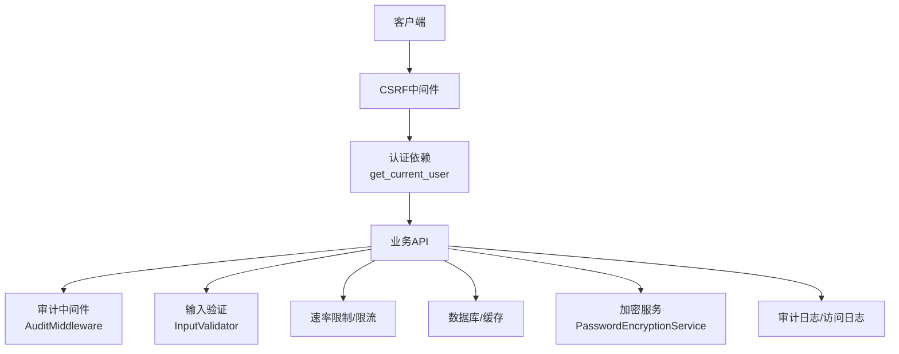
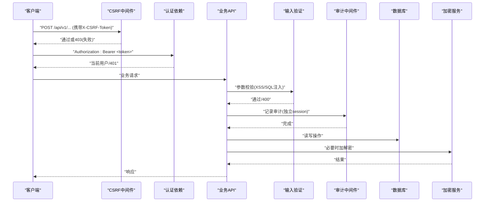
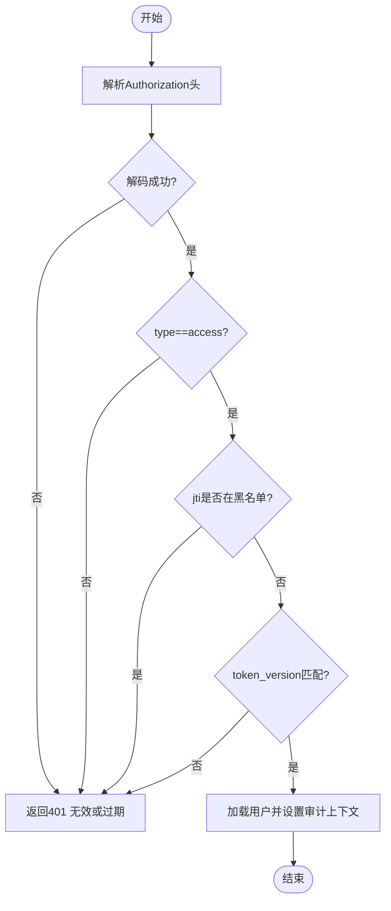
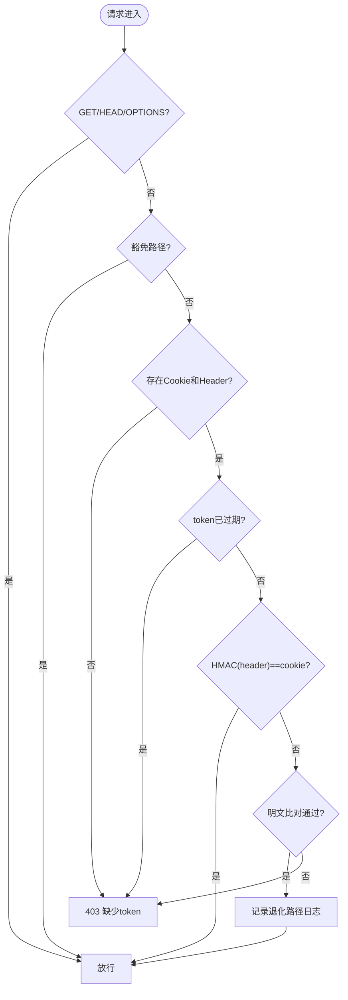
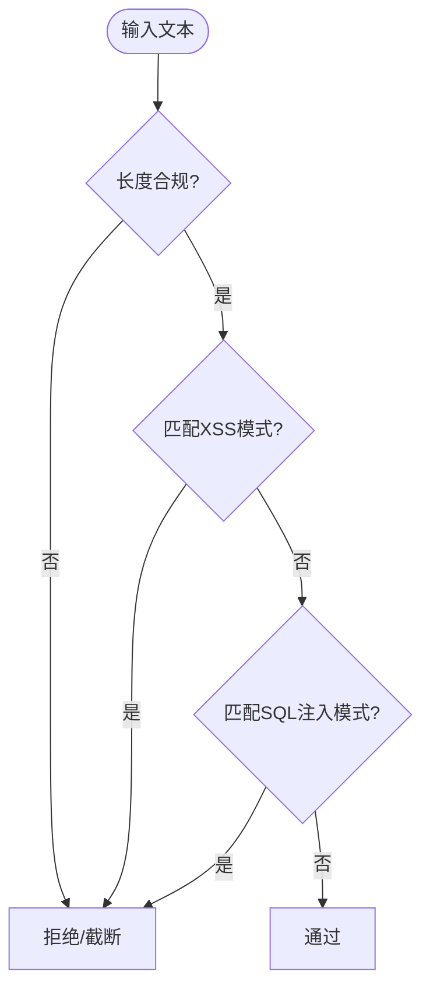
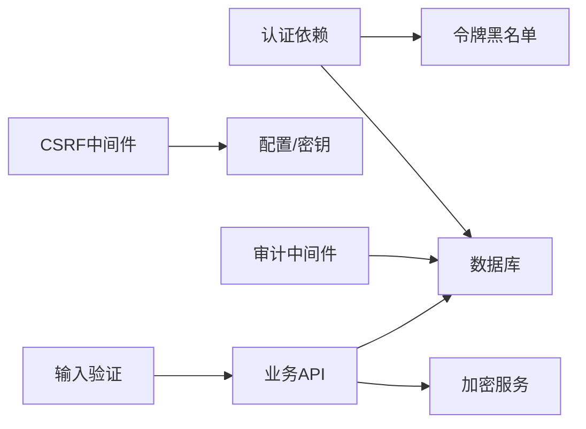

# 安全测试

<cite>
**本文引用的文件**
- [backend/app/core/security.py](file://backend/app/core/security.py)
- [backend/app/middleware/csrf_middleware.py](file://backend/app/middleware/csrf_middleware.py)
- [backend/app/core/audit_middleware.py](file://backend/app/core/audit_middleware.py)
- [backend/app/core/token_blacklist.py](file://backend/app/core/token_blacklist.py)
- [backend/app/utils/input_validator.py](file://backend/app/utils/input_validator.py)
- [backend/app/services/password_encryption_service.py](file://backend/app/services/password_encryption_service.py)
- [backend/app/middleware/body_size_limit.py](file://backend/app/middleware/body_size_limit.py)
- [backend/app/middleware/request_logger.py](file://backend/app/middleware/request_logger.py)
- [backend/scripts/security_self_check.py](file://backend/scripts/security_self_check.py)
</cite>

## 目录
1. [简介](#简介)
2. [项目结构](#项目结构)
3. [核心组件](#核心组件)
4. [架构总览](#架构总览)
5. [详细组件分析](#详细组件分析)
6. [依赖关系分析](#依赖关系分析)
7. [性能考虑](#性能考虑)
8. [故障排查指南](#故障排查指南)
9. [结论](#结论)
10. [附录](#附录)

## 简介
本安全测试文档面向乡村振兴系统后端，围绕安全漏洞扫描、渗透测试与代码审计的实施方法，系统化说明认证授权测试、SQL注入防护、XSS攻击防护、CSRF攻击防护、敏感数据加密验证、权限越权测试、会话管理测试、输入验证测试与日志脱敏测试。同时给出安全配置检查清单、安全最佳实践与安全事件响应流程建议，帮助测试与运维团队在开发与生产环境中持续保障系统安全。

## 项目结构
本项目在后端集中实现了多项安全能力：
- 认证与授权：JWT签发与校验、角色控制、令牌黑名单、会话版本控制
- CSRF保护：HMAC签名增强、过期检测、豁免路径与可信代理IP策略
- 输入与输出安全：XSS/SQL注入模式检测、请求体大小限制、安全响应头
- 审计与可观测性：请求级审计落库、访问日志、审计上下文
- 加密与密钥：密码哈希、PBKDF2+Fernet对称加密、自检脚本
- 中间件体系：CSRF、审计、请求日志、请求体大小限制等

图表来源
- [backend/app/middleware/csrf_middleware.py:177-284](file://backend/app/middleware/csrf_middleware.py#L177-L284)
- [backend/app/core/security.py:243-336](file://backend/app/core/security.py#L243-L336)
- [backend/app/core/audit_middleware.py:11-44](file://backend/app/core/audit_middleware.py#L11-L44)
- [backend/app/utils/input_validator.py:12-71](file://backend/app/utils/input_validator.py#L12-L71)
- [backend/app/services/password_encryption_service.py:23-137](file://backend/app/services/password_encryption_service.py#L23-L137)

章节来源
- [backend/app/core/security.py:61-115](file://backend/app/core/security.py#L61-L115)
- [backend/app/middleware/csrf_middleware.py:29-57](file://backend/app/middleware/csrf_middleware.py#L29-L57)
- [backend/app/core/audit_middleware.py:11-44](file://backend/app/core/audit_middleware.py#L11-L44)
- [backend/app/utils/input_validator.py:12-71](file://backend/app/utils/input_validator.py#L12-L71)
- [backend/app/services/password_encryption_service.py:23-137](file://backend/app/services/password_encryption_service.py#L23-L137)

## 核心组件
- 认证与授权
  - JWT签发与校验、类型校验（access/refresh）、令牌吊销（黑名单）、用户会话版本控制
  - 管理员权限校验依赖
- CSRF保护
  - HMAC签名增强、过期检测、豁免路径、可信代理IP透传
- 输入与输出安全
  - XSS/SQL注入模式检测、请求体大小限制、安全响应头
- 审计与可观测性
  - 每次请求落库审计、访问日志、审计上下文绑定当前用户
- 加密与密钥
  - 密码哈希、PBKDF2+Fernet对称加密、自检脚本
- 中间件体系
  - CSRF、审计、请求日志、请求体大小限制

章节来源
- [backend/app/core/security.py:210-336](file://backend/app/core/security.py#L210-L336)
- [backend/app/middleware/csrf_middleware.py:177-284](file://backend/app/middleware/csrf_middleware.py#L177-L284)
- [backend/app/utils/input_validator.py:12-71](file://backend/app/utils/input_validator.py#L12-L71)
- [backend/app/middleware/body_size_limit.py:48-79](file://backend/app/middleware/body_size_limit.py#L48-L79)
- [backend/app/core/audit_middleware.py:11-44](file://backend/app/core/audit_middleware.py#L11-L44)
- [backend/app/services/password_encryption_service.py:23-137](file://backend/app/services/password_encryption_service.py#L23-L137)
- [backend/scripts/security_self_check.py:46-177](file://backend/scripts/security_self_check.py#L46-L177)

## 架构总览
下图展示一次受保护的写请求从进入网关到落库的完整安全链路：CSRF校验、认证鉴权、输入校验、审计记录、数据库操作与加密服务调用。

图表来源
- [backend/app/middleware/csrf_middleware.py:177-284](file://backend/app/middleware/csrf_middleware.py#L177-L284)
- [backend/app/core/security.py:243-336](file://backend/app/core/security.py#L243-L336)
- [backend/app/utils/input_validator.py:12-71](file://backend/app/utils/input_validator.py#L12-L71)
- [backend/app/core/audit_middleware.py:11-44](file://backend/app/core/audit_middleware.py#L11-L44)
- [backend/app/services/password_encryption_service.py:81-137](file://backend/app/services/password_encryption_service.py#L81-L137)

## 详细组件分析

### 认证与授权测试
- 目标
  - 验证JWT签发/校验、类型校验、黑名单吊销、会话版本控制、管理员权限校验是否生效
- 关键实现
  - get_current_user：解析Bearer Token、校验类型、查黑名单、校验token_version、写入审计上下文
  - require_admin：基于角色/超级管理员判断
  - token_blacklist：内存+可选数据库持久化，支持TTL与过期清理
- 测试要点
  - 正常登录获取access token并访问受限接口
  - 使用refresh token访问需access的接口应被拒绝
  - 登出/强制下线后，旧token应立即失效
  - 非admin角色访问管理员接口返回403
  - 伪造/篡改token应返回401
- 参考路径
  - [backend/app/core/security.py:243-336](file://backend/app/core/security.py#L243-L336)
  - [backend/app/core/security.py:350-371](file://backend/app/core/security.py#L350-L371)
  - [backend/app/core/token_blacklist.py:27-70](file://backend/app/core/token_blacklist.py#L27-L70)

图表来源
- [backend/app/core/security.py:243-336](file://backend/app/core/security.py#L243-L336)
- [backend/app/core/token_blacklist.py:60-70](file://backend/app/core/token_blacklist.py#L60-L70)

章节来源
- [backend/app/core/security.py:243-336](file://backend/app/core/security.py#L243-L336)
- [backend/app/core/token_blacklist.py:27-70](file://backend/app/core/token_blacklist.py#L27-L70)

### CSRF攻击防护测试
- 目标
  - 验证HMAC签名校验、过期检测、豁免路径、可信代理IP透传是否生效
- 关键实现
  - CSRF中间件：生成token、设置HMAC签名的Cookie、Header中携带原始token、常量时间比较
  - 豁免路径：认证相关、健康检查、文档等
  - 过期检测：token内嵌时间戳，超过阈值拒绝
- 测试要点
  - 未携带X-CSRF-Token或csrftoken Cookie的请求应返回403
  - 篡改header或cookie任一值应返回403
  - 过期token应返回403
  - 豁免路径无需CSRF校验
  - 可信代理场景下真实客户端IP透传正确
- 参考路径
  - [backend/app/middleware/csrf_middleware.py:65-124](file://backend/app/middleware/csrf_middleware.py#L65-L124)
  - [backend/app/middleware/csrf_middleware.py:177-284](file://backend/app/middleware/csrf_middleware.py#L177-L284)

图表来源
- [backend/app/middleware/csrf_middleware.py:177-284](file://backend/app/middleware/csrf_middleware.py#L177-L284)

章节来源
- [backend/app/middleware/csrf_middleware.py:65-124](file://backend/app/middleware/csrf_middleware.py#L65-L124)
- [backend/app/middleware/csrf_middleware.py:177-284](file://backend/app/middleware/csrf_middleware.py#L177-L284)

### SQL注入与XSS防护测试
- 目标
  - 验证输入层对XSS与SQL注入模式的检测与拦截
- 关键实现
  - InputValidator：XSS/SQL注入正则模式检测、长度限制、格式校验
  - security模块：SQL注入模式集合、输入清理函数
- 测试要点
  - 包含<script>、javascript:、on*=等XSS特征应被拒绝
  - 包含union/select/drop/alter等SQL注入特征应被拒绝
  - 超长输入应被截断或拒绝
  - 合法输入应正常通过
- 参考路径
  - [backend/app/utils/input_validator.py:12-71](file://backend/app/utils/input_validator.py#L12-L71)
  - [backend/app/core/security.py:379-411](file://backend/app/core/security.py#L379-L411)

图表来源
- [backend/app/utils/input_validator.py:12-71](file://backend/app/utils/input_validator.py#L12-L71)
- [backend/app/core/security.py:379-411](file://backend/app/core/security.py#L379-L411)

章节来源
- [backend/app/utils/input_validator.py:12-71](file://backend/app/utils/input_validator.py#L12-L71)
- [backend/app/core/security.py:379-411](file://backend/app/core/security.py#L379-L411)

### 权限越权测试
- 目标
  - 验证基于角色的访问控制（RBAC）与数据权限隔离是否有效
- 关键实现
  - require_admin：仅允许管理员或超级管理员
  - 数据权限：通过上下文与模型层过滤（结合数据范围适配）
- 测试要点
  - 普通用户访问管理员接口应返回403
  - 跨组织/跨项目数据访问应被拒绝
  - 资源ID替换（IDOR）尝试应被拒绝
- 参考路径
  - [backend/app/core/security.py:350-371](file://backend/app/core/security.py#L350-L371)

章节来源
- [backend/app/core/security.py:350-371](file://backend/app/core/security.py#L350-L371)

### 会话管理测试
- 目标
  - 验证JWT生命周期、刷新机制、强制下线与会话版本控制
- 关键实现
  - create_access_token/create_refresh_token：签发带exp与type的token
  - decode_token：校验算法与密钥
  - get_current_user：校验type、黑名单、token_version
  - token_blacklist：添加/查询/清理
- 测试要点
  - access token过期后无法访问
  - refresh token不能用于需要access的场景
  - 登出后旧token立即失效
  - 修改用户token_version后所有旧token失效
- 参考路径
  - [backend/app/core/security.py:210-336](file://backend/app/core/security.py#L210-L336)
  - [backend/app/core/token_blacklist.py:27-70](file://backend/app/core/token_blacklist.py#L27-L70)

章节来源
- [backend/app/core/security.py:210-336](file://backend/app/core/security.py#L210-L336)
- [backend/app/core/token_blacklist.py:27-70](file://backend/app/core/token_blacklist.py#L27-L70)

### 输入验证测试
- 目标
  - 验证必填字段、邮箱/手机/身份证格式、文件大小与扩展名、数值范围等
- 关键实现
  - InputValidator：validate_email/phone/id_card/file_extension/file_size/number_range/required_fields
- 测试要点
  - 非法邮箱/手机/身份证应被拒绝
  - 超大文件或不允许的扩展名应被拒绝
  - 缺失必填字段应返回明确错误
- 参考路径
  - [backend/app/utils/input_validator.py:73-124](file://backend/app/utils/input_validator.py#L73-L124)

章节来源
- [backend/app/utils/input_validator.py:73-124](file://backend/app/utils/input_validator.py#L73-L124)

### 日志脱敏与审计测试
- 目标
  - 验证敏感字段脱敏、审计日志记录完整性与可用性
- 关键实现
  - sanitize_log_data：按敏感字段名进行脱敏
  - AuditMiddleware：记录请求方法、路径、状态码、耗时、用户身份并落库
  - request_logger：ASGI请求日志，记录IP、UA、耗时
- 测试要点
  - 日志中password/token/credit_card等字段应被脱敏
  - 每次请求应有审计记录且可检索
  - 审计落库失败不应影响业务请求
- 参考路径
  - [backend/app/core/security.py:180-202](file://backend/app/core/security.py#L180-L202)
  - [backend/app/core/audit_middleware.py:11-44](file://backend/app/core/audit_middleware.py#L11-L44)
  - [backend/app/middleware/request_logger.py:52-114](file://backend/app/middleware/request_logger.py#L52-L114)

章节来源
- [backend/app/core/security.py:180-202](file://backend/app/core/security.py#L180-L202)
- [backend/app/core/audit_middleware.py:11-44](file://backend/app/core/audit_middleware.py#L11-L44)
- [backend/app/middleware/request_logger.py:52-114](file://backend/app/middleware/request_logger.py#L52-L114)

### 敏感数据加密验证
- 目标
  - 验证基于密码的对称加密/解密流程、密钥派生强度与异常处理
- 关键实现
  - PasswordEncryptionService：PBKDF2-HMAC-SHA256派生密钥，Fernet对称加密/解密
  - 盐值随机生成、迭代次数默认满足OWASP建议
- 测试要点
  - 正确密码可解密，错误密码抛出业务异常
  - 大文件加解密流程稳定
  - 盐值与迭代次数可追溯存储
- 参考路径
  - [backend/app/services/password_encryption_service.py:23-137](file://backend/app/services/password_encryption_service.py#L23-L137)

章节来源
- [backend/app/services/password_encryption_service.py:23-137](file://backend/app/services/password_encryption_service.py#L23-L137)

### 安全配置检查
- 目标
  - 自动化检查SECRET_KEY、CSRF启用、速率限制、Bcrypt轮数、数据库加密、调试模式、加密后端等
- 关键实现
  - security_self_check：逐项检查并输出PASS/WARNING/CRITICAL
- 测试要点
  - 运行自检脚本，确认无CRITICAL项
  - 针对WARNING项制定整改计划
- 参考路径
  - [backend/scripts/security_self_check.py:46-177](file://backend/scripts/security_self_check.py#L46-L177)

章节来源
- [backend/scripts/security_self_check.py:46-177](file://backend/scripts/security_self_check.py#L46-L177)

## 依赖关系分析
- 组件耦合
  - 认证依赖与安全中间件强耦合：get_current_user依赖token_blacklist与数据库
  - CSRF中间件依赖配置与HMAC签名工具
  - 审计中间件依赖数据库会话与审计模型
  - 输入验证与业务API解耦，便于复用
- 外部依赖
  - PyJWT、passlib/bcrypt、cryptography(Fernet)、Starlette/FastAPI中间件框架
- 潜在风险
  - 循环导入：通过延迟导入避免
  - 单点故障：审计落库失败不影响主流程
  - 内存泄漏：黑名单与速率限制器定期清理

图表来源
- [backend/app/core/security.py:243-336](file://backend/app/core/security.py#L243-L336)
- [backend/app/core/token_blacklist.py:27-70](file://backend/app/core/token_blacklist.py#L27-L70)
- [backend/app/middleware/csrf_middleware.py:177-284](file://backend/app/middleware/csrf_middleware.py#L177-L284)
- [backend/app/core/audit_middleware.py:11-44](file://backend/app/core/audit_middleware.py#L11-L44)
- [backend/app/utils/input_validator.py:12-71](file://backend/app/utils/input_validator.py#L12-L71)
- [backend/app/services/password_encryption_service.py:81-137](file://backend/app/services/password_encryption_service.py#L81-L137)

章节来源
- [backend/app/core/security.py:243-336](file://backend/app/core/security.py#L243-L336)
- [backend/app/core/token_blacklist.py:27-70](file://backend/app/core/token_blacklist.py#L27-L70)
- [backend/app/middleware/csrf_middleware.py:177-284](file://backend/app/middleware/csrf_middleware.py#L177-L284)
- [backend/app/core/audit_middleware.py:11-44](file://backend/app/core/audit_middleware.py#L11-L44)
- [backend/app/utils/input_validator.py:12-71](file://backend/app/utils/input_validator.py#L12-L71)
- [backend/app/services/password_encryption_service.py:81-137](file://backend/app/services/password_encryption_service.py#L81-L137)

## 性能考虑
- 认证与鉴权
  - JWT解码与黑名单查询为O(1)，注意高频请求下的内存占用与清理策略
- CSRF校验
  - HMAC计算开销低，常量时间比较避免时序攻击
- 输入验证
  - 正则匹配开销可控，建议对热点接口做白名单优化
- 审计与日志
  - 审计落库采用独立短事务，失败不阻塞主流程；建议异步化或批量写入以降低延迟
- 请求体大小限制
  - 防止超大JSON导致内存压力，合理设置阈值与豁免路径

[本节提供通用指导，不直接分析具体文件]

## 故障排查指南
- 常见错误与定位
  - 401未认证：检查Authorization头、Token有效期、类型、黑名单、token_version
  - 403禁止访问：检查CSRF、角色权限、数据权限
  - 400参数错误：检查XSS/SQL注入模式、必填字段、格式校验
  - 413请求体过大：检查Content-Length与豁免路径
  - 审计落库失败：查看警告日志，不影响业务
- 快速定位
  - 使用security_self_check脚本检查配置与加密状态
  - 查看审计与访问日志，定位异常请求来源与耗时
- 参考路径
  - [backend/app/core/exceptions.py:123-145](file://backend/app/core/exceptions.py#L123-L145)
  - [backend/app/middleware/body_size_limit.py:48-79](file://backend/app/middleware/body_size_limit.py#L48-L79)
  - [backend/scripts/security_self_check.py:46-177](file://backend/scripts/security_self_check.py#L46-L177)

章节来源
- [backend/app/core/exceptions.py:123-145](file://backend/app/core/exceptions.py#L123-L145)
- [backend/app/middleware/body_size_limit.py:48-79](file://backend/app/middleware/body_size_limit.py#L48-L79)
- [backend/scripts/security_self_check.py:46-177](file://backend/scripts/security_self_check.py#L46-L177)

## 结论
本系统在后端实现了较为完善的安全能力：认证授权、CSRF保护、输入校验、审计日志、加密与自检。建议在CI/CD中集成安全扫描与单元测试，持续验证上述能力；在生产环境定期执行安全自检与渗透测试，确保配置与实现始终符合安全基线。

[本节总结性内容，不直接分析具体文件]

## 附录
- 安全测试实施建议
  - 漏洞扫描：静态扫描（SAST）与依赖漏洞扫描纳入流水线
  - 渗透测试：覆盖认证、授权、输入校验、CSRF、会话管理等关键路径
  - 代码审计：重点审查认证依赖、CSRF中间件、输入验证、审计与加密模块
- 安全最佳实践
  - 最小权限原则、失败关闭（fail-closed）、输入白名单、输出编码
  - 密钥与敏感信息不进仓库，使用运行时密钥管理
  - 审计日志不可篡改、可检索、可告警
- 安全事件响应流程
  - 发现：监控与日志告警
  - 评估：影响面与严重等级
  - 处置：临时阻断、补丁发布、密钥轮换
  - 复盘：根因分析与改进措施

[本节提供通用指导，不直接分析具体文件]