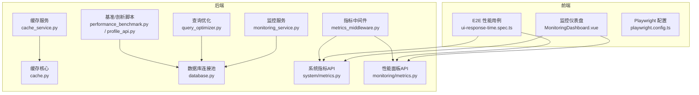
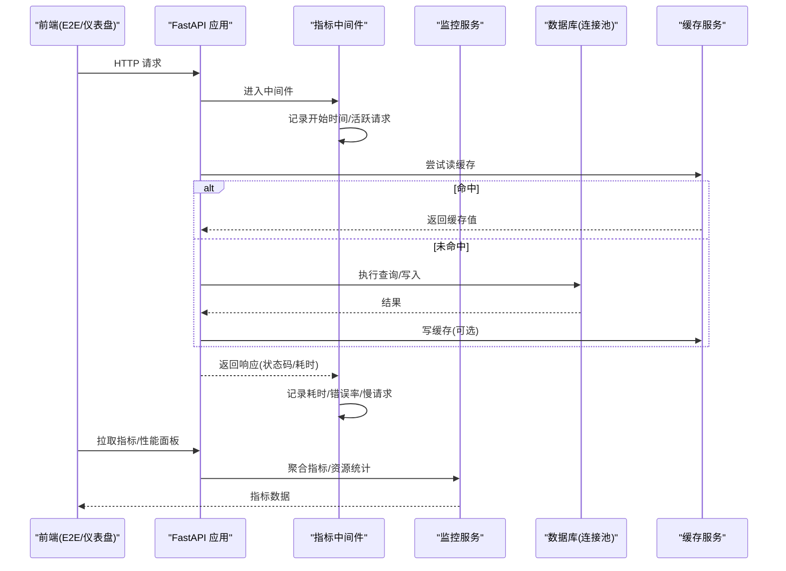
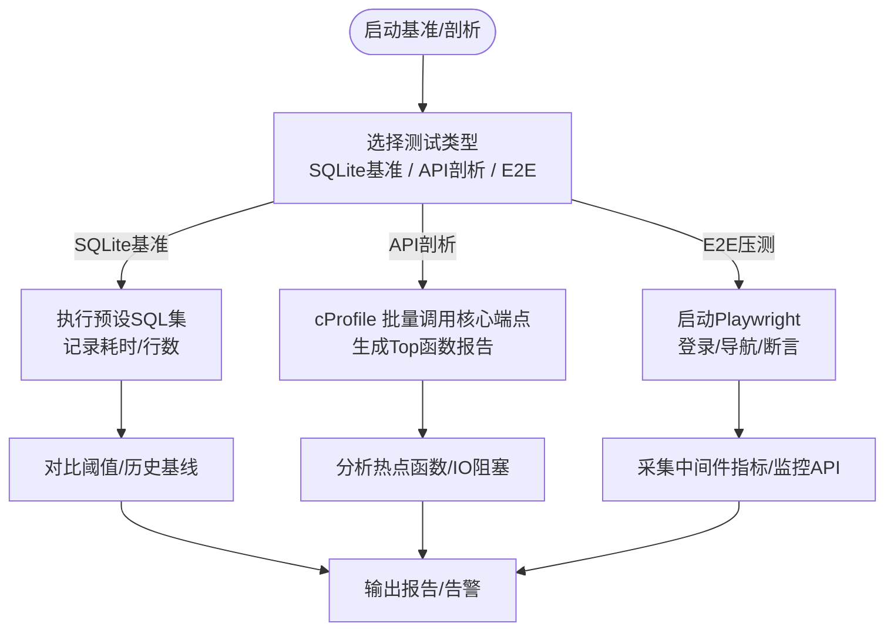
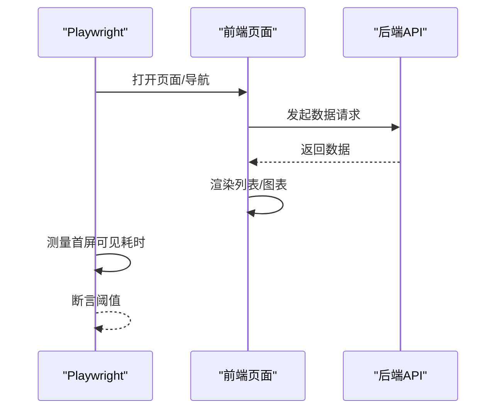
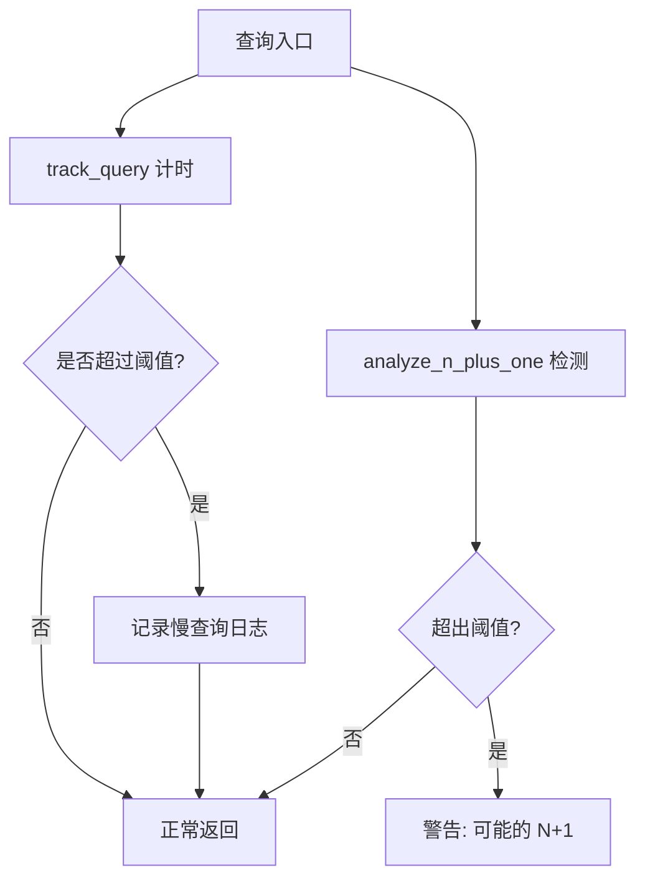
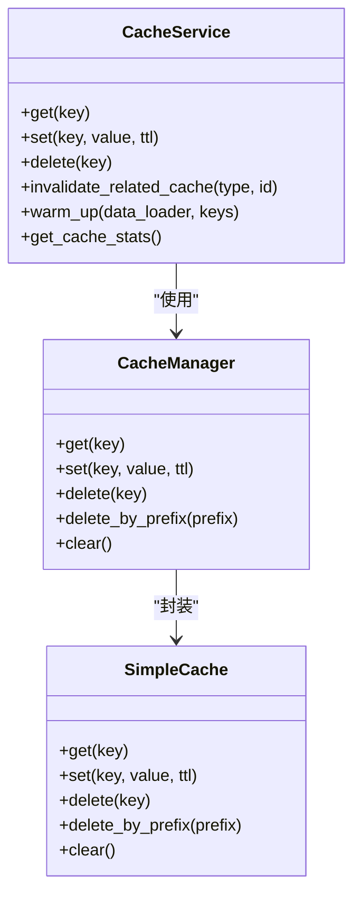
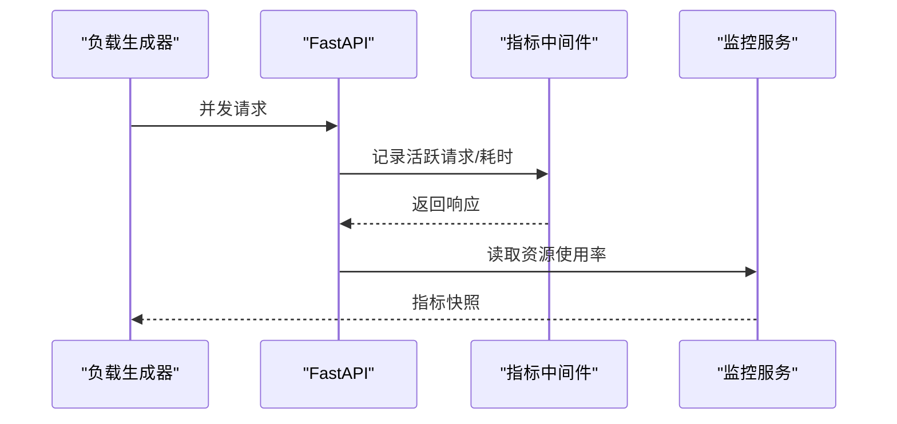
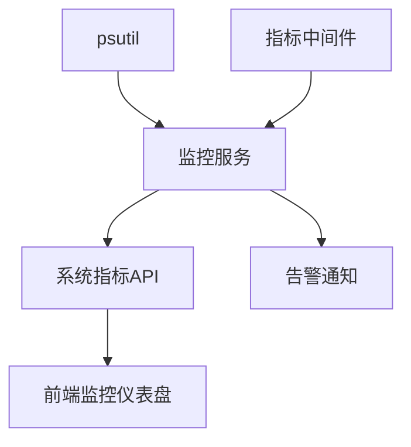
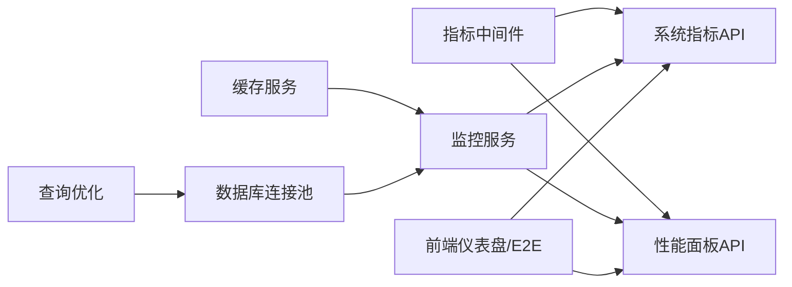

# 性能测试

<cite>
**本文引用的文件**
- [performance_benchmark.py](file://backend/scripts/performance_benchmark.py)
- [profile_api.py](file://backend/scripts/profile_api.py)
- [metrics_middleware.py](file://backend/app/middleware/metrics_middleware.py)
- [cache.py](file://backend/app/core/cache.py)
- [cache_service.py](file://backend/app/services/cache_service.py)
- [query_optimizer.py](file://backend/app/core/query_optimizer.py)
- [database.py](file://backend/app/core/database.py)
- [monitoring_service.py](file://backend/app/services/monitoring_service.py)
- [metrics.py](file://backend/app/api/v1/system/metrics.py)
- [metrics.py](file://backend/app/api/v1/monitoring/metrics.py)
- [MonitoringDashboard.vue](file://frontend/src/views/system/MonitoringDashboard.vue)
- [ui-response-time.spec.ts](file://frontend/tests/e2e/performance/ui-response-time.spec.ts)
- [playwright.config.ts](file://frontend/playwright.config.ts)
- [optimize_database.py](file://backend/scripts/optimize_database.py)
- [安全加固.md](file://docs/03-开发文档/04-安全文档/安全加固.md)
- [性能需求.md](file://docs/03-开发文档/05-性能优化/性能需求.md)
</cite>

## 目录
1. [简介](#简介)
2. [项目结构](#项目结构)
3. [核心组件](#核心组件)
4. [架构总览](#架构总览)
5. [详细组件分析](#详细组件分析)
6. [依赖关系分析](#依赖关系分析)
7. [性能考虑](#性能考虑)
8. [故障排查指南](#故障排查指南)
9. [结论](#结论)
10. [附录](#附录)

## 简介
本性能测试策略面向乡村振兴系统，覆盖后端 API 基准与压测、前端页面加载与渲染性能、数据库查询优化与缓存效果验证、并发能力与系统资源监控，以及性能瓶颈识别、回归检测与优化建议。策略基于现有代码库中的指标采集、监控服务、缓存实现、数据库连接池配置、前后端 E2E 性能用例与脚本工具进行设计，确保可落地、可度量、可回归。

## 项目结构
- 后端
  - 指标采集中间件：记录请求计数、错误率、活跃请求数、按路径耗时与慢请求列表。
  - 监控服务：聚合 API 响应时间百分位、错误率、端点统计、资源使用率，支持告警规则检查与通知。
  - 缓存层：内存缓存（SimpleCache）+ 异步包装（CacheManager）+ 业务级 CacheService（含预热、失效、装饰器）。
  - 查询优化：分页、慢查询追踪、N+1 检测。
  - 数据库连接池：SQLAlchemy 引擎参数化配置，SQLite 专用优化。
  - 脚本工具：SQLite 基准脚本、API Profiling 脚本、数据库优化工具。
  - API 暴露：系统指标与性能面板接口。
- 前端
  - 监控仪表盘：CPU/内存/磁盘/响应时间/数据库大小等健康检查与评分。
  - E2E 性能用例：工作台与列表页加载时间断言；Playwright 配置隔离后端端口与数据库。
  - 配置：独立 E2E 后端与前端 dev server，避免污染生产数据。

**图表来源**
- [metrics_middleware.py:1-177](file://backend/app/middleware/metrics_middleware.py#L1-L177)
- [monitoring_service.py:1-312](file://backend/app/services/monitoring_service.py#L1-L312)
- [cache.py:1-166](file://backend/app/core/cache.py#L1-L166)
- [cache_service.py:1-477](file://backend/app/services/cache_service.py#L1-L477)
- [query_optimizer.py:1-177](file://backend/app/core/query_optimizer.py#L1-L177)
- [database.py:44-67](file://backend/app/core/database.py#L44-L67)
- [metrics.py:123-157](file://backend/app/api/v1/system/metrics.py#L123-L157)
- [metrics.py:46-63](file://backend/app/api/v1/monitoring/metrics.py#L46-L63)
- [performance_benchmark.py:1-149](file://backend/scripts/performance_benchmark.py#L1-L149)
- [profile_api.py:1-167](file://backend/scripts/profile_api.py#L1-L167)
- [MonitoringDashboard.vue:389-434](file://frontend/src/views/system/MonitoringDashboard.vue#L389-L434)
- [ui-response-time.spec.ts:1-41](file://frontend/tests/e2e/performance/ui-response-time.spec.ts#L1-L41)
- [playwright.config.ts:1-84](file://frontend/playwright.config.ts#L1-L84)

**章节来源**
- [metrics_middleware.py:1-177](file://backend/app/middleware/metrics_middleware.py#L1-L177)
- [monitoring_service.py:1-312](file://backend/app/services/monitoring_service.py#L1-L312)
- [cache.py:1-166](file://backend/app/core/cache.py#L1-L166)
- [cache_service.py:1-477](file://backend/app/services/cache_service.py#L1-L477)
- [query_optimizer.py:1-177](file://backend/app/core/query_optimizer.py#L1-L177)
- [database.py:44-67](file://backend/app/core/database.py#L44-L67)
- [metrics.py:123-157](file://backend/app/api/v1/system/metrics.py#L123-L157)
- [metrics.py:46-63](file://backend/app/api/v1/monitoring/metrics.py#L46-L63)
- [performance_benchmark.py:1-149](file://backend/scripts/performance_benchmark.py#L1-L149)
- [profile_api.py:1-167](file://backend/scripts/profile_api.py#L1-L167)
- [MonitoringDashboard.vue:389-434](file://frontend/src/views/system/MonitoringDashboard.vue#L389-L434)
- [ui-response-time.spec.ts:1-41](file://frontend/tests/e2e/performance/ui-response-time.spec.ts#L1-L41)
- [playwright.config.ts:1-84](file://frontend/playwright.config.ts#L1-L84)

## 核心组件
- 指标采集中间件：以 ASGI 原生方式收集请求计数、错误率、活跃请求、按路径耗时与慢请求，提供汇总接口供面板展示。
- 监控服务：计算 API 响应时间百分位、错误率、端点统计，读取系统资源（CPU/内存/磁盘），支持告警规则检查与通知。
- 缓存体系：线程安全的内存缓存、TTL、前缀删除、装饰器缓存、实体缓存管理器，提供预热与失效能力。
- 查询优化：分页封装、慢查询日志、N+1 检测，辅助定位低效查询。
- 数据库连接池：针对 SQLite 的 QueuePool 与 PRAGMA 优化，连接回收与健康检查。
- 脚本工具：SQLite 基准测试、API cProfile 剖析、数据库 ANALYZE 与优化。
- 前端监控与 E2E：监控仪表盘健康检查与评分；E2E 用例测量页面加载时间并断言阈值。

**章节来源**
- [metrics_middleware.py:1-177](file://backend/app/middleware/metrics_middleware.py#L1-L177)
- [monitoring_service.py:1-312](file://backend/app/services/monitoring_service.py#L1-L312)
- [cache.py:1-166](file://backend/app/core/cache.py#L1-L166)
- [cache_service.py:1-477](file://backend/app/services/cache_service.py#L1-L477)
- [query_optimizer.py:1-177](file://backend/app/core/query_optimizer.py#L1-L177)
- [database.py:44-67](file://backend/app/core/database.py#L44-L67)
- [performance_benchmark.py:1-149](file://backend/scripts/performance_benchmark.py#L1-L149)
- [profile_api.py:1-167](file://backend/scripts/profile_api.py#L1-L167)
- [MonitoringDashboard.vue:389-434](file://frontend/src/views/system/MonitoringDashboard.vue#L389-L434)
- [ui-response-time.spec.ts:1-41](file://frontend/tests/e2e/performance/ui-response-time.spec.ts#L1-L41)

## 架构总览
后端通过中间件在请求链路中采集指标，监控服务聚合指标并暴露 API，前端仪表盘消费这些 API 进行可视化与评分；E2E 用例驱动真实浏览器访问前端与后端，测量端到端响应时间；缓存与查询优化降低数据库压力；连接池与 PRAGMA 提升 SQLite 吞吐。

**图表来源**
- [metrics_middleware.py:1-177](file://backend/app/middleware/metrics_middleware.py#L1-L177)
- [monitoring_service.py:1-312](file://backend/app/services/monitoring_service.py#L1-L312)
- [cache_service.py:1-477](file://backend/app/services/cache_service.py#L1-L477)
- [database.py:44-67](file://backend/app/core/database.py#L44-L67)

## 详细组件分析

### 后端 API 性能基准与压测
- 基准测试
  - SQLite 基准脚本：对典型 SQL（全表、条件、JOIN、聚合、深分页 vs Keyset、年度数据、Dashboard 聚合）进行多次迭代计时，输出平均/最小/最大耗时与行数，并与慢查询阈值对比。
  - 适用场景：优化前后对比、索引/分页策略评估。
- API 剖析
  - cProfile 批量剖析核心端点，输出 Top 函数耗时，支持保存 pstats 用 snakeviz 可视化。
  - 适用场景：定位热点函数、识别 IO/CPU 瓶颈。
- 负载与压力测试
  - 利用 Playwright E2E 并行执行（当前配置为单 worker 以避免共享 SQLite 竞争），结合前端超时与断言，模拟多用户操作。
  - 结合中间件指标与监控服务 API，观察吞吐、错误率、慢请求趋势。
- 响应时间与吞吐量
  - 中间件提供 avg_duration、requests_per_second、top_endpoints、slow_requests。
  - 监控服务提供 p50/p95/p99 响应时间、错误率、端点分组统计。

**图表来源**
- [performance_benchmark.py:1-149](file://backend/scripts/performance_benchmark.py#L1-L149)
- [profile_api.py:1-167](file://backend/scripts/profile_api.py#L1-L167)
- [ui-response-time.spec.ts:1-41](file://frontend/tests/e2e/performance/ui-response-time.spec.ts#L1-L41)
- [metrics_middleware.py:1-177](file://backend/app/middleware/metrics_middleware.py#L1-L177)
- [monitoring_service.py:1-312](file://backend/app/services/monitoring_service.py#L1-L312)

**章节来源**
- [performance_benchmark.py:1-149](file://backend/scripts/performance_benchmark.py#L1-L149)
- [profile_api.py:1-167](file://backend/scripts/profile_api.py#L1-L167)
- [ui-response-time.spec.ts:1-41](file://frontend/tests/e2e/performance/ui-response-time.spec.ts#L1-L41)
- [metrics_middleware.py:1-177](file://backend/app/middleware/metrics_middleware.py#L1-L177)
- [monitoring_service.py:1-312](file://backend/app/services/monitoring_service.py#L1-L312)

### 前端性能测试方法
- 页面加载时间
  - E2E 用例测量工作台与项目列表页从导航到可见的耗时，设置合理阈值并断言。
- 渲染性能
  - 通过 DOM 可见性断言与 UI 元素出现时机评估渲染性能。
- 内存使用与网络优化
  - 借助浏览器开发者工具与 E2E trace（Playwright 配置启用 trace on first retry）定位内存泄漏与大对象；结合缓存与分页减少重复请求。
- 端到端一致性
  - Playwright 配置固定后端端口与独立数据库，避免污染生产数据，保证结果稳定。

**图表来源**
- [ui-response-time.spec.ts:1-41](file://frontend/tests/e2e/performance/ui-response-time.spec.ts#L1-L41)
- [playwright.config.ts:1-84](file://frontend/playwright.config.ts#L1-L84)

**章节来源**
- [ui-response-time.spec.ts:1-41](file://frontend/tests/e2e/performance/ui-response-time.spec.ts#L1-L41)
- [playwright.config.ts:1-84](file://frontend/playwright.config.ts#L1-L84)

### 数据库查询性能优化
- 慢查询追踪与 N+1 检测
  - 通过 track_query 记录慢查询，analyze_n_plus_one 检测潜在 N+1。
- 分页优化
  - 统一 paginate 封装，限制 page_size，避免深分页开销。
- SQLite 优化
  - 连接关闭时执行 PRAGMA optimize；脚本支持 ANALYZE 更新统计信息。
- 连接池调优
  - QueuePool 参数（pool_size、max_overflow、recycle、pre_ping、timeout）根据环境调整。

**图表来源**
- [query_optimizer.py:1-177](file://backend/app/core/query_optimizer.py#L1-L177)
- [optimize_database.py:40-72](file://backend/scripts/optimize_database.py#L40-L72)
- [database.py:44-67](file://backend/app/core/database.py#L44-L67)

**章节来源**
- [query_optimizer.py:1-177](file://backend/app/core/query_optimizer.py#L1-L177)
- [optimize_database.py:40-72](file://backend/scripts/optimize_database.py#L40-L72)
- [database.py:44-67](file://backend/app/core/database.py#L44-L67)

### 缓存效果验证
- 缓存策略
  - SimpleCache 线程安全、TTL、容量淘汰；CacheManager 提供异步接口；CacheService 提供业务级 get/set/delete/invalidate/warm_up。
- 关键指标
  - hits/misses/sets/deletes；可通过装饰器自动缓存函数结果。
- 验证方法
  - 对比开启/关闭缓存的响应时间与数据库查询次数；使用 E2E 或基准脚本观测吞吐变化。
- 失效策略
  - 按资源类型与 ID 失效相关缓存，避免脏读。

**图表来源**
- [cache.py:1-166](file://backend/app/core/cache.py#L1-L166)
- [cache_service.py:1-477](file://backend/app/services/cache_service.py#L1-L477)

**章节来源**
- [cache.py:1-166](file://backend/app/core/cache.py#L1-L166)
- [cache_service.py:1-477](file://backend/app/services/cache_service.py#L1-L477)

### 并发处理能力测试
- 后端
  - 中间件记录 active_requests 与 requests_per_second；监控服务提供资源使用率（CPU/内存/磁盘）。
  - 连接池参数影响并发吞吐，需结合压测调整。
- 前端
  - Playwright workers=1 避免共享 SQLite 竞争；可在 CI 环境下增加并发度并观察稳定性。
- 指标采集
  - 通过 /api/v1/system/metrics 与 /api/v1/monitoring/performance-dashboard 获取实时指标。

**图表来源**
- [metrics_middleware.py:1-177](file://backend/app/middleware/metrics_middleware.py#L1-L177)
- [monitoring_service.py:1-312](file://backend/app/services/monitoring_service.py#L1-L312)
- [metrics.py:123-157](file://backend/app/api/v1/system/metrics.py#L123-L157)
- [metrics.py:46-63](file://backend/app/api/v1/monitoring/metrics.py#L46-L63)

**章节来源**
- [metrics_middleware.py:1-177](file://backend/app/middleware/metrics_middleware.py#L1-L177)
- [monitoring_service.py:1-312](file://backend/app/services/monitoring_service.py#L1-L312)
- [metrics.py:123-157](file://backend/app/api/v1/system/metrics.py#L123-L157)
- [metrics.py:46-63](file://backend/app/api/v1/monitoring/metrics.py#L46-L63)

### 系统资源监控
- 指标来源
  - psutil 获取 CPU/内存/磁盘使用率；中间件记录错误率与慢请求；监控服务聚合指标并暴露 API。
- 前端展示
  - 监控仪表盘计算健康评分，展示 CPU/内存/磁盘/响应时间/数据库大小等检查项。
- 告警
  - 监控服务支持基于阈值的告警规则（响应时间、错误率、资源使用率），并可发送邮件/Webhook。

**图表来源**
- [monitoring_service.py:1-312](file://backend/app/services/monitoring_service.py#L1-L312)
- [metrics_middleware.py:1-177](file://backend/app/middleware/metrics_middleware.py#L1-L177)
- [metrics.py:123-157](file://backend/app/api/v1/system/metrics.py#L123-L157)
- [MonitoringDashboard.vue:389-434](file://frontend/src/views/system/MonitoringDashboard.vue#L389-L434)

**章节来源**
- [monitoring_service.py:1-312](file://backend/app/services/monitoring_service.py#L1-L312)
- [metrics_middleware.py:1-177](file://backend/app/middleware/metrics_middleware.py#L1-L177)
- [metrics.py:123-157](file://backend/app/api/v1/system/metrics.py#L123-L157)
- [MonitoringDashboard.vue:389-434](file://frontend/src/views/system/MonitoringDashboard.vue#L389-L434)

## 依赖关系分析
- 中间件依赖 FastAPI 生命周期钩子，记录指标并暴露汇总。
- 监控服务依赖数据库会话与 psutil，聚合指标并触发告警。
- 缓存服务依赖内存缓存与配置，提供业务级缓存能力。
- 查询优化依赖 SQLAlchemy，提供分页与慢查询/N+1 检测。
- 数据库连接池依赖 SQLAlchemy Engine 与 SQLite PRAGMA。
- 前端仪表盘依赖系统指标 API 与性能面板 API。
- E2E 用例依赖 Playwright 配置，隔离后端与数据库。

**图表来源**
- [metrics_middleware.py:1-177](file://backend/app/middleware/metrics_middleware.py#L1-L177)
- [monitoring_service.py:1-312](file://backend/app/services/monitoring_service.py#L1-L312)
- [cache_service.py:1-477](file://backend/app/services/cache_service.py#L1-L477)
- [query_optimizer.py:1-177](file://backend/app/core/query_optimizer.py#L1-L177)
- [database.py:44-67](file://backend/app/core/database.py#L44-L67)
- [metrics.py:123-157](file://backend/app/api/v1/system/metrics.py#L123-L157)
- [metrics.py:46-63](file://backend/app/api/v1/monitoring/metrics.py#L46-L63)

**章节来源**
- [metrics_middleware.py:1-177](file://backend/app/middleware/metrics_middleware.py#L1-L177)
- [monitoring_service.py:1-312](file://backend/app/services/monitoring_service.py#L1-L312)
- [cache_service.py:1-477](file://backend/app/services/cache_service.py#L1-L477)
- [query_optimizer.py:1-177](file://backend/app/core/query_optimizer.py#L1-L177)
- [database.py:44-67](file://backend/app/core/database.py#L44-L67)
- [metrics.py:123-157](file://backend/app/api/v1/system/metrics.py#L123-L157)
- [metrics.py:46-63](file://backend/app/api/v1/monitoring/metrics.py#L46-L63)

## 性能考虑
- 负载测试
  - 使用 SQLite 基准脚本评估不同查询模式性能；结合 E2E 模拟日常操作与批处理场景。
- 压力测试
  - 逐步增加并发，观察中间件的 active_requests 与 requests_per_second，监控服务的错误率与资源使用率。
- 响应时间监控
  - 关注 p50/p95/p99 响应时间，结合慢请求列表定位热点端点。
- 吞吐量分析
  - 通过 requests_per_second 与 top_endpoints 分析吞吐瓶颈。
- 数据库优化
  - 定期执行 ANALYZE 与 PRAGMA optimize；使用 Keyset 分页替代深 OFFSET。
- 缓存验证
  - 对比开启/关闭缓存的命中率与响应时间；对热点数据进行预热。
- 并发能力
  - 调整连接池参数，避免文件锁竞争；在 CI 下逐步提升并发度。
- 资源监控
  - 设定 CPU/内存/磁盘阈值，触发告警；监控数据库大小增长。

[本节为通用指导，不直接分析具体文件]

## 故障排查指南
- 慢查询与 N+1
  - 使用 query_optimizer 的慢查询日志与 N+1 检测，定位低效查询与缺失索引。
- 缓存失效问题
  - 检查 cache_invalidate 装饰器与 invalidate_related_cache 调用是否正确；确认 TTL 设置。
- 连接池耗尽
  - 检查 pool_size、max_overflow、pool_recycle；观察数据库指标 API 的连接使用情况。
- 指标采集异常
  - 中间件跳过特定路径（/health、/metrics、/favicon.ico）；确认路径未被误过滤。
- 前端性能退化
  - 通过 E2E 用例断言页面加载时间；结合浏览器 trace 分析渲染与网络请求。

**章节来源**
- [query_optimizer.py:1-177](file://backend/app/core/query_optimizer.py#L1-L177)
- [cache_service.py:1-477](file://backend/app/services/cache_service.py#L1-L477)
- [database.py:44-67](file://backend/app/core/database.py#L44-L67)
- [metrics_middleware.py:1-177](file://backend/app/middleware/metrics_middleware.py#L1-L177)
- [ui-response-time.spec.ts:1-41](file://frontend/tests/e2e/performance/ui-response-time.spec.ts#L1-L41)

## 结论
本策略充分利用现有代码库中的指标采集、监控服务、缓存实现、查询优化与 E2E 用例，构建了覆盖后端 API 基准/压测、前端性能、数据库优化、缓存验证、并发能力与资源监控的完整性能测试体系。通过脚本工具与 API 暴露的指标，可实现持续的性能回归检测与瓶颈定位，并为优化提供量化依据。

[本节为总结，不直接分析具体文件]

## 附录
- 性能需求参考
  - 内存利用率、磁盘利用率、网络利用率、测试类型与场景定义。
- 安全与连接池优化
  - 连接池参数计算公式与监控方法。

**章节来源**
- [性能需求.md:105-142](file://docs/03-开发文档/05-性能优化/性能需求.md#L105-L142)
- [安全加固.md:563-734](file://docs/03-开发文档/04-安全文档/安全加固.md#L563-L734)