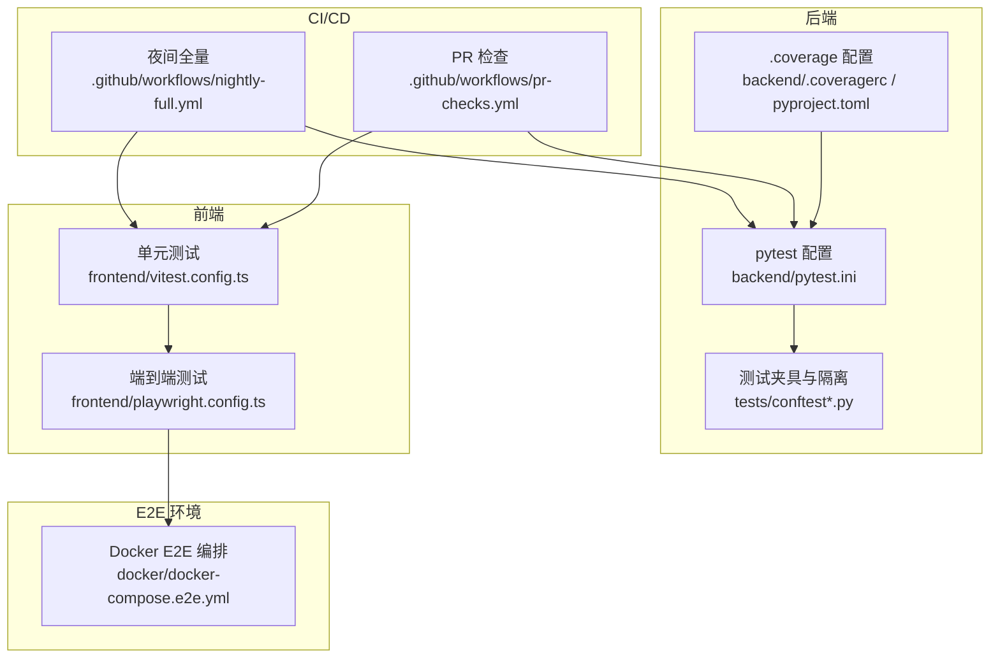
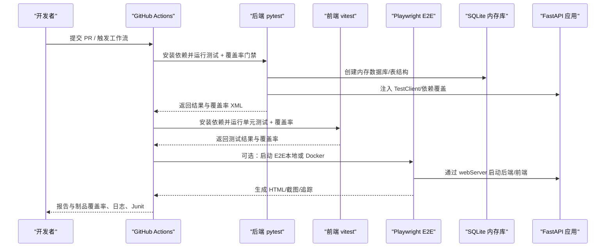
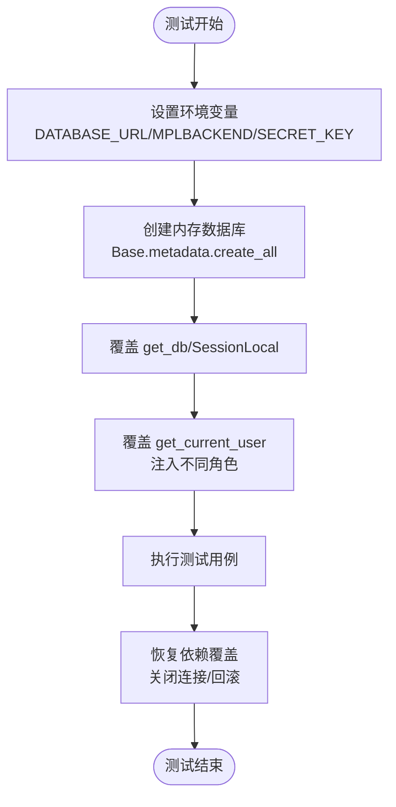
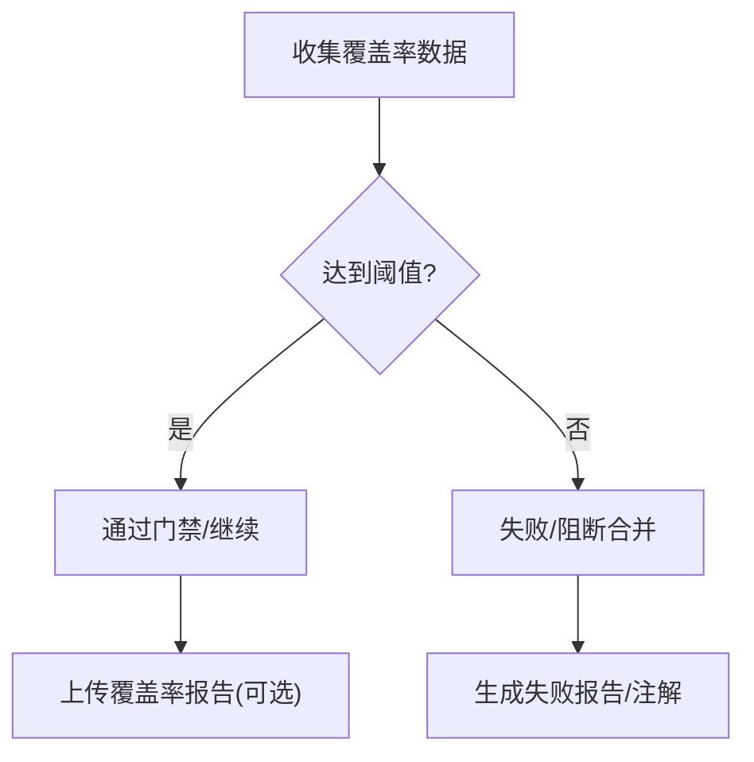
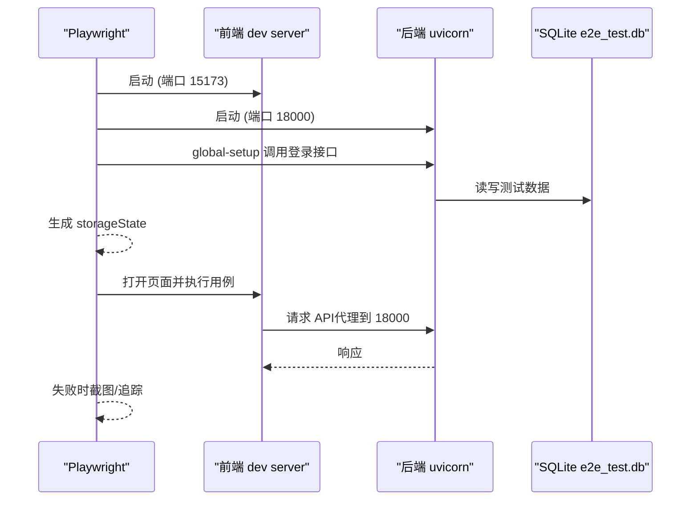
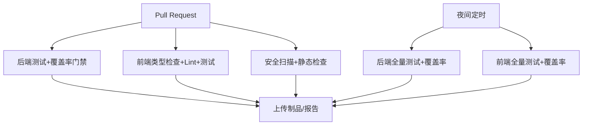
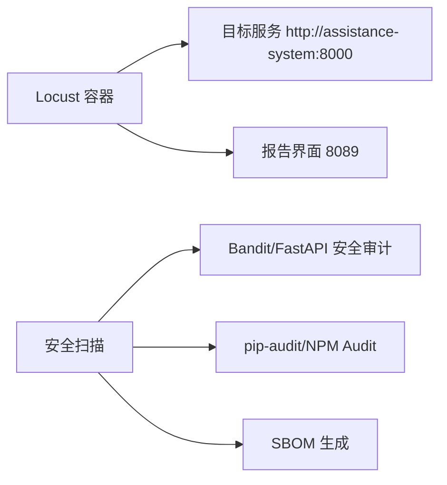
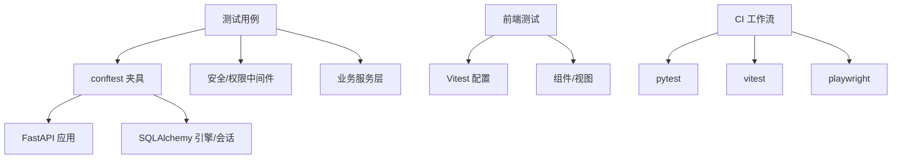

# 测试策略

<cite>
**本文引用的文件**
- [backend/pytest.ini](file://backend/pytest.ini)
- [backend/.coveragerc](file://backend/.coveragerc)
- [backend/pyproject.toml](file://backend/pyproject.toml)
- [backend/tests/conftest.py](file://backend/tests/conftest.py)
- [backend/tests/conftest_extended.py](file://backend/tests/conftest_extended.py)
- [frontend/playwright.config.ts](file://frontend/playwright.config.ts)
- [frontend/vitest.config.ts](file://frontend/vitest.config.ts)
- [.github/workflows/pr-checks.yml](file://.github/workflows/pr-checks.yml)
- [.github/workflows/nightly-full.yml](file://.github/workflows/nightly-full.yml)
- [docker/docker-compose.e2e.yml](file://docker/docker-compose.e2e.yml)
</cite>

## 目录
1. [引言](#引言)
2. [项目结构](#项目结构)
3. [核心组件](#核心组件)
4. [架构总览](#架构总览)
5. [详细组件分析](#详细组件分析)
6. [依赖关系分析](#依赖关系分析)
7. [性能考虑](#性能考虑)
8. [故障排查指南](#故障排查指南)
9. [结论](#结论)
10. [附录](#附录)

## 引言
本测试策略面向乡村振兴系统，覆盖单元测试、集成测试、端到端测试的设计与实现，明确覆盖率要求、测试数据管理、Mock 策略、测试环境配置，以及自动化测试流程、持续集成配置、性能测试与安全测试的实施方法。目标是确保代码质量与系统稳定性，提供可复现、可维护、可扩展的测试体系。

## 项目结构
后端采用 pytest 作为测试框架，前端采用 Vitest（单元）与 Playwright（端到端）。CI 通过 GitHub Actions 在 PR 与夜间全量任务中执行测试、覆盖率门禁、静态检查与安全扫描。E2E 支持本地与 Docker 两种运行方式。

**图示来源**
- [backend/pytest.ini:1-38](file://backend/pytest.ini#L1-L38)
- [backend/.coveragerc:1-18](file://backend/.coveragerc#L1-L18)
- [backend/pyproject.toml:1-34](file://backend/pyproject.toml#L1-L34)
- [backend/tests/conftest.py:1-697](file://backend/tests/conftest.py#L1-L697)
- [backend/tests/conftest_extended.py:1-130](file://backend/tests/conftest_extended.py#L1-L130)
- [frontend/vitest.config.ts:1-104](file://frontend/vitest.config.ts#L1-L104)
- [frontend/playwright.config.ts:1-84](file://frontend/playwright.config.ts#L1-L84)
- [.github/workflows/pr-checks.yml:1-134](file://.github/workflows/pr-checks.yml#L1-L134)
- [.github/workflows/nightly-full.yml:1-99](file://.github/workflows/nightly-full.yml#L1-L99)
- [docker/docker-compose.e2e.yml:1-63](file://docker/docker-compose.e2e.yml#L1-L63)

**章节来源**
- [backend/pytest.ini:1-38](file://backend/pytest.ini#L1-L38)
- [backend/.coveragerc:1-18](file://backend/.coveragerc#L1-L18)
- [backend/pyproject.toml:1-34](file://backend/pyproject.toml#L1-L34)
- [backend/tests/conftest.py:1-697](file://backend/tests/conftest.py#L1-L697)
- [backend/tests/conftest_extended.py:1-130](file://backend/tests/conftest_extended.py#L1-L130)
- [frontend/vitest.config.ts:1-104](file://frontend/vitest.config.ts#L1-L104)
- [frontend/playwright.config.ts:1-84](file://frontend/playwright.config.ts#L1-L84)
- [.github/workflows/pr-checks.yml:1-134](file://.github/workflows/pr-checks.yml#L1-L134)
- [.github/workflows/nightly-full.yml:1-99](file://.github/workflows/nightly-full.yml#L1-L99)
- [docker/docker-compose.e2e.yml:1-63](file://docker/docker-compose.e2e.yml#L1-L63)

## 核心组件
- 后端测试框架与标记：pytest 统一入口，定义 unit/integration/security/e2e/stress/performance 等标记，异步模式自动处理。
- 覆盖率报告与门禁：coverage.py 与 pytest-cov 配合，pyproject 与 .coveragerc 共同定义可覆盖集与豁免规则；CI 设置 fail-under 阈值。
- 测试夹具与环境隔离：conftest.py 提供内存数据库、TestClient、认证头、缓存 Mock、全局设置覆盖等；扩展 conftest 提供独立 test_db、组织用户隔离。
- 前端单元测试：Vitest 使用 jsdom 环境，单线程稳定执行，覆盖率阈值按模块设定。
- 端到端测试：Playwright 启动前后端 webServer，使用独立数据库与浏览器存储态登录，支持 UI/Headless 与重试。
- CI 流水线：PR 检查包含后端测试+覆盖率门禁、前端类型检查+lint+测试、安全扫描与静态检查；夜间全量输出详细报告与产物。

**章节来源**
- [backend/pytest.ini:1-38](file://backend/pytest.ini#L1-L38)
- [backend/.coveragerc:1-18](file://backend/.coveragerc#L1-L18)
- [backend/pyproject.toml:1-34](file://backend/pyproject.toml#L1-L34)
- [backend/tests/conftest.py:1-697](file://backend/tests/conftest.py#L1-L697)
- [backend/tests/conftest_extended.py:1-130](file://backend/tests/conftest_extended.py#L1-L130)
- [frontend/vitest.config.ts:1-104](file://frontend/vitest.config.ts#L1-L104)
- [frontend/playwright.config.ts:1-84](file://frontend/playwright.config.ts#L1-L84)
- [.github/workflows/pr-checks.yml:1-134](file://.github/workflows/pr-checks.yml#L1-L134)
- [.github/workflows/nightly-full.yml:1-99](file://.github/workflows/nightly-full.yml#L1-L99)

## 架构总览
下图展示从 PR 触发到各层测试执行的总体流程，包括后端单元测试/集成测试、前端单元测试、E2E 测试、覆盖率上报与安全扫描。

**图示来源**
- [.github/workflows/pr-checks.yml:17-66](file://.github/workflows/pr-checks.yml#L17-L66)
- [.github/workflows/nightly-full.yml:12-78](file://.github/workflows/nightly-full.yml#L12-L78)
- [backend/tests/conftest.py:352-410](file://backend/tests/conftest.py#L352-L410)
- [frontend/playwright.config.ts:50-83](file://frontend/playwright.config.ts#L50-L83)

## 详细组件分析

### 后端测试夹具与环境隔离
- 环境变量与编码：会话级清理超长环境变量，强制 UTF-8，避免 Windows 平台异常。
- 数据库隔离：为每个测试构建 SQLite 内存库，创建所有模型表，并通过依赖注入覆盖 get_db；同时修复审计等绕过 get_db 的路径，保证审计落库链路可断言。
- 认证模拟：通过覆盖 get_current_user 提供 admin/user/operator 等不同角色上下文，构造带 Authorization 的请求头。
- 集合顺序优化：将污染敏感测试提前执行，避免跨测试状态影响。
- 扩展夹具：提供独立的 test_db、test_app、auth_headers 与组织隔离用户，便于服务层与 API 层测试复用。

**图示来源**
- [backend/tests/conftest.py:6-29](file://backend/tests/conftest.py#L6-L29)
- [backend/tests/conftest.py:352-410](file://backend/tests/conftest.py#L352-L410)
- [backend/tests/conftest.py:414-485](file://backend/tests/conftest.py#L414-L485)
- [backend/tests/conftest.py:648-697](file://backend/tests/conftest.py#L648-L697)
- [backend/tests/conftest_extended.py:22-48](file://backend/tests/conftest_extended.py#L22-L48)
- [backend/tests/conftest_extended.py:78-89](file://backend/tests/conftest_extended.py#L78-L89)

**章节来源**
- [backend/tests/conftest.py:1-697](file://backend/tests/conftest.py#L1-L697)
- [backend/tests/conftest_extended.py:1-130](file://backend/tests/conftest_extended.py#L1-L130)

### 覆盖率与门禁
- 后端覆盖率：
  - coverage 源路径为 app，排除测试与缓存目录。
  - 报告精度与缺失行显示开启，fail_under 设置为 100（可覆盖集），.coveragerc 定义豁免规则（如 TYPE_CHECKING、__repr__、抽象方法等）。
  - CI 中 pr-checks 与 nightly 均启用 --cov-fail-under=98（以工作流为准），并上传覆盖率至 Codecov（仅展示）。
- 前端覆盖率：
  - Vitest 使用 v8 provider，按模块设置阈值（utils/stores/composables/api/views/components/router/config/directives 等均为 90%）。
  - 单线程执行以避免并发导致的临时文件竞争问题，并配置 retry 缓解时序抖动。

**图示来源**
- [backend/pyproject.toml:1-34](file://backend/pyproject.toml#L1-L34)
- [backend/.coveragerc:1-18](file://backend/.coveragerc#L1-L18)
- [.github/workflows/pr-checks.yml:23-44](file://.github/workflows/pr-checks.yml#L23-L44)
- [.github/workflows/nightly-full.yml:20-49](file://.github/workflows/nightly-full.yml#L20-L49)
- [frontend/vitest.config.ts:37-87](file://frontend/vitest.config.ts#L37-L87)

**章节来源**
- [backend/pyproject.toml:1-34](file://backend/pyproject.toml#L1-L34)
- [backend/.coveragerc:1-18](file://backend/.coveragerc#L1-L18)
- [.github/workflows/pr-checks.yml:23-44](file://.github/workflows/pr-checks.yml#L23-L44)
- [.github/workflows/nightly-full.yml:20-49](file://.github/workflows/nightly-full.yml#L20-L49)
- [frontend/vitest.config.ts:37-87](file://frontend/vitest.config.ts#L37-L87)

### 端到端测试（Playwright）
- 启动策略：webServer 同时启动后端（端口 18000）与前端（端口 15173），使用独立数据库 data/e2e_test.db，避免污染生产数据。
- 登录态：global-setup 通过 API 登录一次生成 storageState，后续测试复用，减少限流风险。
- 并行与重试：workers=1 串行执行，避免共享 SQLite 并发写入导致随机失败；CI 下启用重试。
- 浏览器：优先使用系统 Edge 内核，减少下载开销；失败时截图与追踪仅在首次重试时开启。

**图示来源**
- [frontend/playwright.config.ts:29-83](file://frontend/playwright.config.ts#L29-L83)
- [docker/docker-compose.e2e.yml:7-35](file://docker/docker-compose.e2e.yml#L7-L35)

**章节来源**
- [frontend/playwright.config.ts:1-84](file://frontend/playwright.config.ts#L1-L84)
- [docker/docker-compose.e2e.yml:1-63](file://docker/docker-compose.e2e.yml#L1-L63)

### 持续集成与自动化流程
- PR Checks：
  - 后端：安装依赖 → 运行 pytest（并行 -n auto）→ 覆盖率门禁（--cov-fail-under=98）→ 失败时打印具体用例 → 上传覆盖率（仅展示）。
  - 前端：类型检查（vue-tsc）→ lint 检查 → 单元测试 + 覆盖率 → 上传覆盖率（仅展示）。
  - 安全：flake8/mypy/bandit 静态检查；pip-audit/npm audit 依赖漏洞扫描；SBOM 生成与上传。
- Nightly Full：
  - 后端：全量测试 + 覆盖率（HTML/JSON/XML/JUnit）→ 产物上传 → Codecov。
  - 前端：全量测试 + 覆盖率 → 产物上传 → Codecov。
  - 质量汇总：生成每日质量报告。

**图示来源**
- [.github/workflows/pr-checks.yml:17-134](file://.github/workflows/pr-checks.yml#L17-L134)
- [.github/workflows/nightly-full.yml:12-99](file://.github/workflows/nightly-full.yml#L12-L99)

**章节来源**
- [.github/workflows/pr-checks.yml:1-134](file://.github/workflows/pr-checks.yml#L1-L134)
- [.github/workflows/nightly-full.yml:1-99](file://.github/workflows/nightly-full.yml#L1-L99)

### 性能测试与安全测试
- 性能测试：
  - Docker Compose 提供 Locust 容器，通过配置文件设置用户数、并发与运行时长，无头模式执行压测脚本。
  - 可通过 profile 组合启动 E2E 与性能测试环境。
- 安全测试：
  - 静态扫描：bandit（后端）、flake8/mypy（后端）、npm audit（前端）。
  - 依赖漏洞：pip-audit、npm audit（high 及以上）。
  - SBOM：许可证清单生成与上传，供合规审查。

**图示来源**
- [docker/docker-compose.e2e.yml:37-58](file://docker/docker-compose.e2e.yml#L37-L58)
- [.github/workflows/pr-checks.yml:68-134](file://.github/workflows/pr-checks.yml#L68-L134)

**章节来源**
- [docker/docker-compose.e2e.yml:1-63](file://docker/docker-compose.e2e.yml#L1-L63)
- [.github/workflows/pr-checks.yml:68-134](file://.github/workflows/pr-checks.yml#L68-L134)

## 依赖关系分析
- 后端测试对 FastAPI 应用与 SQLAlchemy 的强耦合：通过依赖注入覆盖 get_db 与 get_current_user，确保测试与生产环境解耦。
- 前端测试对运行时环境的依赖：jsdom 环境、Vite 插件、路由与组件别名在测试中需正确解析。
- CI 对工具链的依赖：Python 3.11、Node 22、playwright 浏览器、Codecov 等。

**图示来源**
- [backend/tests/conftest.py:352-410](file://backend/tests/conftest.py#L352-L410)
- [frontend/vitest.config.ts:1-104](file://frontend/vitest.config.ts#L1-L104)
- [.github/workflows/pr-checks.yml:17-66](file://.github/workflows/pr-checks.yml#L17-L66)

**章节来源**
- [backend/tests/conftest.py:1-697](file://backend/tests/conftest.py#L1-L697)
- [frontend/vitest.config.ts:1-104](file://frontend/vitest.config.ts#L1-L104)
- [.github/workflows/pr-checks.yml:17-66](file://.github/workflows/pr-checks.yml#L17-L66)

## 性能考虑
- 后端测试并行：pytest-xdist 并行执行，显著缩短全量用例时间；注意与 rerunfailures 的兼容性，已选择默认调度器。
- 前端测试单线程：避免 jsdom 并发导致的临时文件竞争与时序抖动，提升稳定性。
- E2E 串行执行：共享 SQLite 测试库，多 worker 会互相修改数据导致随机失败，因此固定 workers=1。
- 覆盖率报告体积：夜间任务生成 HTML/JSON/XML 等多格式报告，注意制品大小与上传时间。

[本节为通用指导，不直接分析具体文件]

## 故障排查指南
- 数据库损坏/并发写冲突：
  - 现象：SQLite 页损坏或“database disk image is malformed”。
  - 原因：未使用内存库或并发进程写同一文件。
  - 解决：确保使用内存库与 StaticPool，并在 fixture teardown 中正确关闭与回滚。
- 审计落库失败：
  - 现象：审计记录未写入或被吞掉错误。
  - 原因：部分路径绕过 get_db 直接使用 SessionLocal。
  - 解决：在测试中替换 module 级 engine/SessionLocal 指向内存库。
- 环境变量过长导致崩溃：
  - 现象：Windows 上 patch.dict(os.environ) 还原时报错。
  - 解决：会话开始时删除超长环境变量。
- 前端测试时序抖动：
  - 现象：零代码变更偶发失败。
  - 解决：单线程执行、启用 retry、必要时增加等待与重试逻辑。
- E2E 登录失败/限流：
  - 现象：UI 登录触发限流或 401。
  - 解决：global-setup 通过 API 登录一次生成 storageState，后续复用。

**章节来源**
- [backend/tests/conftest.py:6-29](file://backend/tests/conftest.py#L6-L29)
- [backend/tests/conftest.py:352-410](file://backend/tests/conftest.py#L352-L410)
- [backend/tests/conftest.py:648-697](file://backend/tests/conftest.py#L648-L697)
- [frontend/playwright.config.ts:29-39](file://frontend/playwright.config.ts#L29-L39)
- [frontend/vitest.config.ts:11-18](file://frontend/vitest.config.ts#L11-L18)

## 结论
本项目建立了完善的分层测试体系：后端 pytest 结合内存数据库与依赖注入实现高内聚低耦合的单元/集成测试；前端 Vitest 保障组件与逻辑稳定性；Playwright 端到端测试覆盖真实用户流程。CI 在 PR 与夜间任务中执行严格的覆盖率门禁与安全扫描，形成质量闭环。建议持续优化测试数据工厂、完善 E2E 场景覆盖，并逐步提升前端覆盖率阈值以对齐后端标准。

[本节为总结性内容，不直接分析具体文件]

## 附录
- 测试编写最佳实践
  - 使用夹具集中管理数据库、认证与缓存 Mock，避免重复代码。
  - 针对权限与数据范围，使用不同角色的认证夹具进行断言。
  - 对外部依赖（AI、加密、备份、消息等）采用 Mock，聚焦被测逻辑。
  - 保持测试幂等与隔离，避免跨测试状态泄漏。
- 调试技巧
  - 使用 pytest -v -s 查看输出；利用 --lf 重跑失败用例；结合 JUnit 报告定位。
  - 前端使用 Playwright UI 模式与 trace 回放定位交互问题。
- 常见问题解决方案
  - 覆盖率门限不一致：以工作流为准，必要时统一阈值与文档说明。
  - 依赖安装失败：使用 npm ci/pip install 严格版本锁定。
  - 浏览器/驱动问题：优先使用系统浏览器通道，必要时安装对应驱动。

[本节为通用指导，不直接分析具体文件]