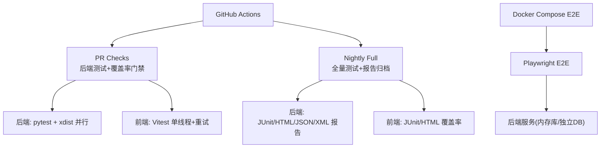
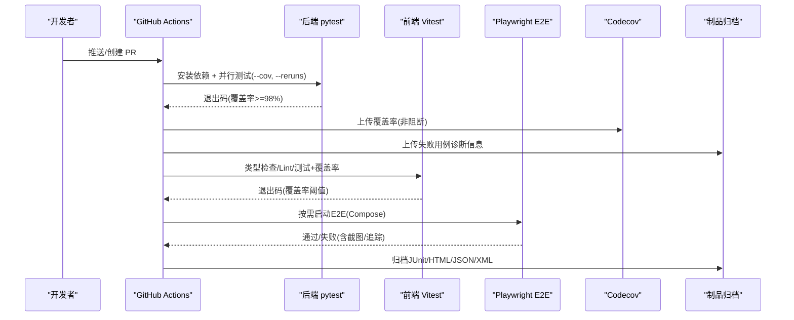
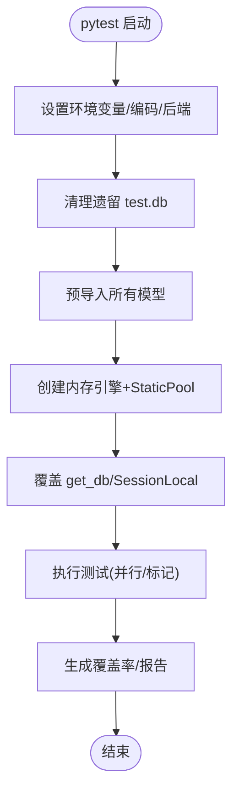
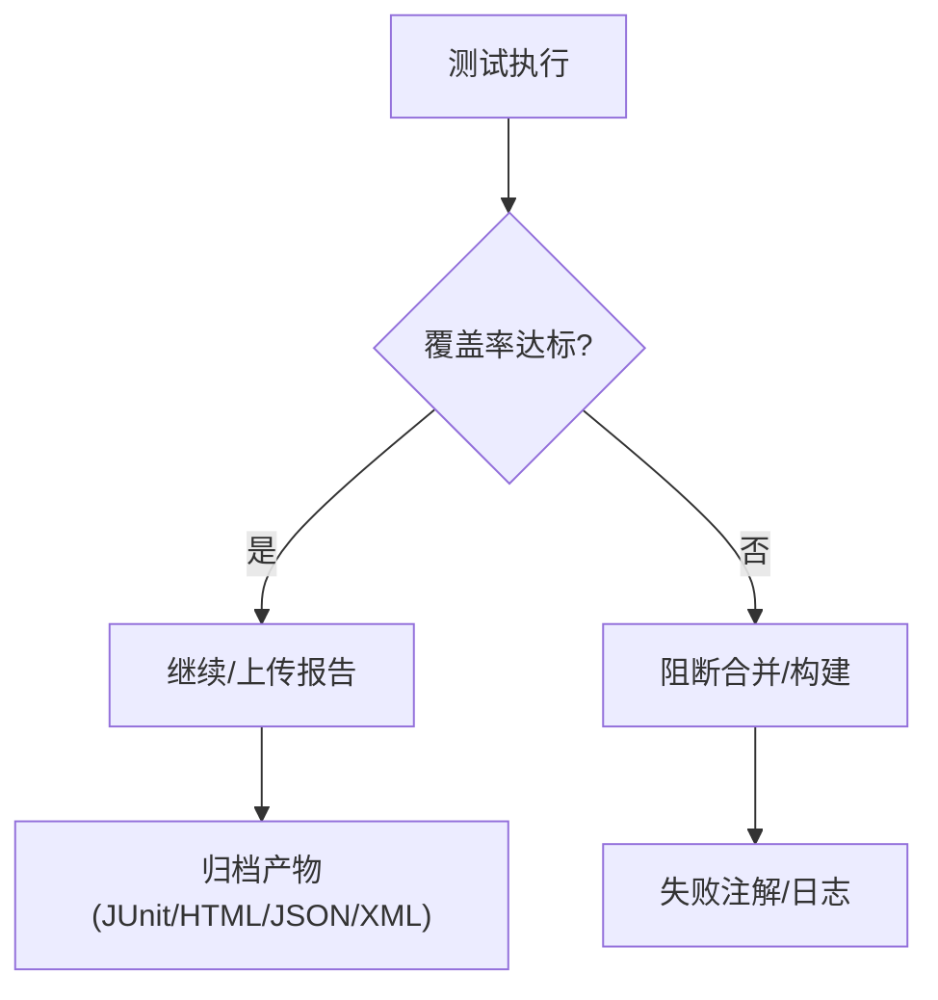
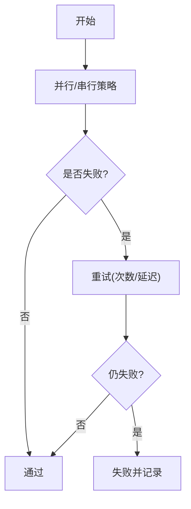
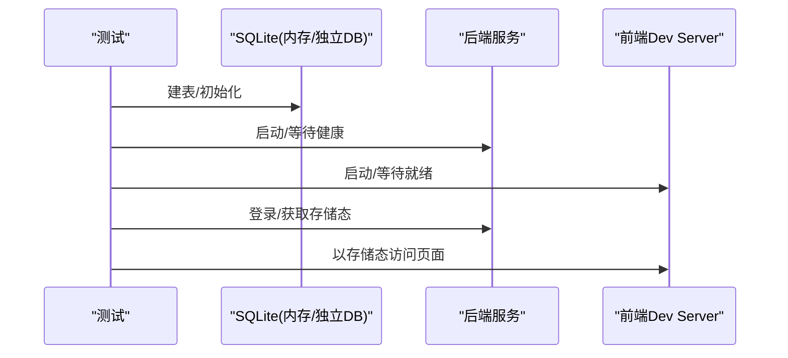
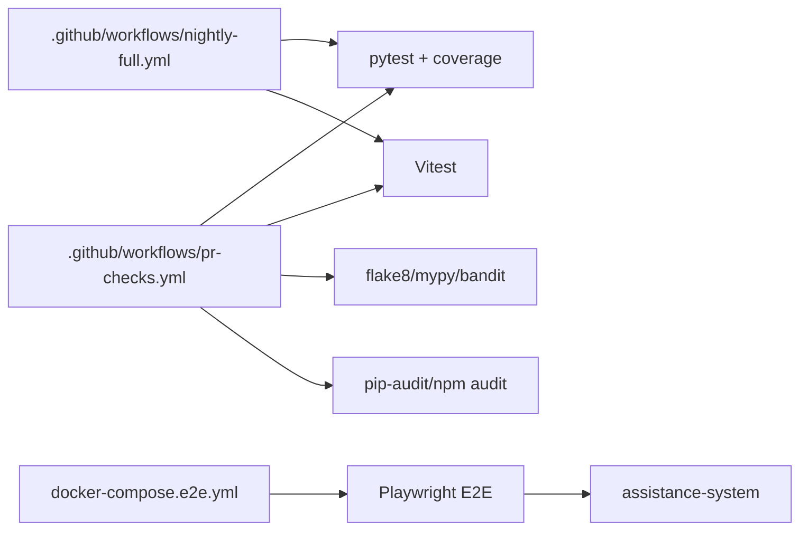

# 测试自动化

<cite>
**本文引用的文件**
- [pr-checks.yml](file://.github/workflows/pr-checks.yml)
- [nightly-full.yml](file://.github/workflows/nightly-full.yml)
- [pytest.ini](file://backend/pytest.ini)
- [.coveragerc](file://backend/.coveragerc)
- [pyproject.toml](file://backend/pyproject.toml)
- [conftest.py](file://backend/tests/conftest.py)
- [conftest_extended.py](file://backend/tests/conftest_extended.py)
- [vitest.config.ts](file://frontend/vitest.config.ts)
- [playwright.config.ts](file://frontend/playwright.config.ts)
- [docker-compose.e2e.yml](file://docker/docker-compose.e2e.yml)
- [Makefile](file://Makefile)
</cite>

## 目录
1. [简介](#简介)
2. [项目结构](#项目结构)
3. [核心组件](#核心组件)
4. [架构总览](#架构总览)
5. [详细组件分析](#详细组件分析)
6. [依赖关系分析](#依赖关系分析)
7. [性能考量](#性能考量)
8. [故障排查指南](#故障排查指南)
9. [结论](#结论)
10. [附录](#附录)

## 简介
本文件面向持续集成中的测试自动化，覆盖 GitHub Actions 工作流、任务编排、并行执行与结果报告；说明测试环境自动搭建、测试数据准备、测试执行与结果收集的全流程；并给出覆盖率统计、质量门禁、失败重试机制、报告生成、CI/CD 管道优化、执行监控与故障排查方法。

## 项目结构
仓库采用前后端分离架构，测试体系围绕后端 pytest + coverage、前端 vitest + playwright E2E 构建，并通过 GitHub Actions 在 PR 与夜间全量场景下执行。关键目录与职责：
- .github/workflows：PR 检查与夜间全量测试流水线
- backend/tests：单元测试、集成测试、安全测试与覆盖率配置
- frontend：Vitest 单元/组件测试与 Playwright E2E 配置
- docker：E2E 与性能测试的容器化运行环境
- Makefile：本地一键测试、覆盖率与部署前检查

**图示来源**
- [pr-checks.yml:17-44](file://.github/workflows/pr-checks.yml#L17-L44)
- [nightly-full.yml:12-49](file://.github/workflows/nightly-full.yml#L12-L49)
- [docker-compose.e2e.yml:7-35](file://docker/docker-compose.e2e.yml#L7-L35)

**章节来源**
- [pr-checks.yml:1-134](file://.github/workflows/pr-checks.yml#L1-L134)
- [nightly-full.yml:1-99](file://.github/workflows/nightly-full.yml#L1-L99)
- [Makefile:8-58](file://Makefile#L8-L58)

## 核心组件
- 后端测试框架与配置
  - pytest 入口与标记：定义测试路径、异步模式、警告过滤与用例标记（unit/integration/security/e2e/stress/performance）
  - 覆盖率配置：coverage 源为 app，排除测试与缓存；报告精度、缺失行展示、fail_under=100（可覆盖集），HTML 输出目录
  - 测试夹具与环境隔离：强制 UTF-8、SQLite 内存库、会话级清理、模型导入预热、环境变量注入、Mock 认证头与客户端
- 前端测试框架与配置
  - Vitest：jsdom 环境、单 worker、文件级串行、重试缓解时序抖动、覆盖率阈值按模块设定
  - Playwright E2E：固定端口、独立数据库、浏览器通道选择、CI 下重试与 HTML/GitHub 报告
- CI/CD 流水线
  - PR Checks：后端并行测试+98% 覆盖率门禁+失败重跑；前端类型检查、Lint、测试与覆盖率；安全扫描与 SBOM
  - Nightly Full：全量测试、多格式覆盖率与 JUnit 报告、制品归档、质量汇总

**章节来源**
- [pytest.ini:1-38](file://backend/pytest.ini#L1-L38)
- [pyproject.toml:1-34](file://backend/pyproject.toml#L1-L34)
- [.coveragerc:1-18](file://backend/.coveragerc#L1-L18)
- [conftest.py:1-697](file://backend/tests/conftest.py#L1-L697)
- [vitest.config.ts:1-104](file://frontend/vitest.config.ts#L1-L104)
- [playwright.config.ts:1-84](file://frontend/playwright.config.ts#L1-L84)
- [pr-checks.yml:17-134](file://.github/workflows/pr-checks.yml#L17-L134)
- [nightly-full.yml:12-99](file://.github/workflows/nightly-full.yml#L12-L99)

## 架构总览
下图展示了从代码提交到测试结果与覆盖率上报的端到端流程，包括并行执行、失败重试、报告归档与第三方平台上传。

**图示来源**
- [pr-checks.yml:17-66](file://.github/workflows/pr-checks.yml#L17-L66)
- [nightly-full.yml:20-78](file://.github/workflows/nightly-full.yml#L20-L78)
- [docker-compose.e2e.yml:7-35](file://docker/docker-compose.e2e.yml#L7-L35)

## 详细组件分析

### 后端测试环境与夹具
- 环境隔离与稳定性
  - 强制 UTF-8 编码与无头 matplotlib 后端，避免控制台与 GUI 资源问题
  - 会话级清理 test.db，防止跨会话残留导致顺序敏感失败
  - 提前导入全部模型子模块，确保 SQLAlchemy mapper 注册表完整
  - 移除超长环境变量，规避 Windows 环境变量长度限制导致的崩溃
- 数据库与客户端
  - 使用 SQLite 内存库与 StaticPool，保证并发安全与快速建表
  - 覆盖 get_db 依赖，使审计等直连 SessionLocal 的路径也落库到内存库
  - 提供带/不带认证的 TestClient 夹具，统一 Mock 当前用户
- 测试集合排序
  - 将依赖 mock/TestClient 的文件前置执行，避免全局状态污染

**图示来源**
- [conftest.py:6-73](file://backend/tests/conftest.py#L6-L73)
- [conftest.py:352-410](file://backend/tests/conftest.py#L352-L410)
- [conftest.py:544-612](file://backend/tests/conftest.py#L544-L612)

**章节来源**
- [conftest.py:1-697](file://backend/tests/conftest.py#L1-L697)
- [conftest_extended.py:22-71](file://backend/tests/conftest_extended.py#L22-L71)

### 覆盖率统计与质量门禁
- 后端
  - 覆盖率源：app；排除测试与缓存；HTML 输出 htmlcov
  - 报告策略：显示缺失行、不跳过已覆盖；fail_under=100（仅对可覆盖集）
  - 运行时豁免：pragma no cover、抽象方法、__repr__、TYPE_CHECKING 等
- 前端
  - 覆盖率提供者 v8；按模块设置阈值（utils/stores/composables/api/views/components/router/config/directives）
  - 单 worker + 文件级串行，缓解 jsdom 环境复用导致的时序抖动
- CI 门禁
  - PR Checks 使用 --cov-fail-under=98 真实阻断
  - Nightly 全量同时产出 HTML/JSON/XML/JUnit 并归档

**图示来源**
- [pyproject.toml:1-34](file://backend/pyproject.toml#L1-L34)
- [.coveragerc:1-18](file://backend/.coveragerc#L1-L18)
- [vitest.config.ts:37-87](file://frontend/vitest.config.ts#L37-L87)
- [pr-checks.yml:24-29](file://.github/workflows/pr-checks.yml#L24-L29)
- [nightly-full.yml:20-32](file://.github/workflows/nightly-full.yml#L20-L32)

**章节来源**
- [pyproject.toml:1-34](file://backend/pyproject.toml#L1-L34)
- [.coveragerc:1-18](file://backend/.coveragerc#L1-L18)
- [vitest.config.ts:1-104](file://frontend/vitest.config.ts#L1-L104)
- [pr-checks.yml:24-44](file://.github/workflows/pr-checks.yml#L24-L44)
- [nightly-full.yml:20-49](file://.github/workflows/nightly-full.yml#L20-L49)

### 并行执行与失败重试
- 后端
  - 使用 xdist 并行(-n auto)，显著缩短全量用例时间
  - 失败重试：--reruns 2 --reruns-delay 1，缓解偶发抖动
  - 注意：loadfile 调度器与 rerun 不兼容，保持默认 load 调度器
- 前端
  - Vitest 单 worker + fileParallelism:false，避免 provider 实例竞争
  - retry:1 针对失败文件重试一次，不掩盖确定性回归
- E2E
  - Playwright 在 CI 下 retries:2，workers:1 串行以避免共享 SQLite 数据竞争

**图示来源**
- [pr-checks.yml:24-35](file://.github/workflows/pr-checks.yml#L24-L35)
- [nightly-full.yml:20-32](file://.github/workflows/nightly-full.yml#L20-L32)
- [vitest.config.ts:10-18](file://frontend/vitest.config.ts#L10-L18)
- [playwright.config.ts:19-24](file://frontend/playwright.config.ts#L19-L24)

**章节来源**
- [pr-checks.yml:24-35](file://.github/workflows/pr-checks.yml#L24-L35)
- [nightly-full.yml:20-32](file://.github/workflows/nightly-full.yml#L20-L32)
- [vitest.config.ts:10-18](file://frontend/vitest.config.ts#L10-L18)
- [playwright.config.ts:19-24](file://frontend/playwright.config.ts#L19-L24)

### 测试数据准备与环境搭建
- 后端
  - 内存 SQLite：每次测试独立、自动回滚，避免跨测试污染
  - 会话级清理 test.db，确保幂等
  - 环境变量注入：SECRET_KEY、ENVIRONMENT、DEBUG、DATABASE_URL、CSRF_ENABLED
  - 模型与迁移：Base.metadata.create_all 确保表结构存在
- 前端 E2E
  - 独立数据库 data/e2e_test.db，避免污染生产数据
  - 固定端口隔离：后端 18000、前端 15173，避免与本机冲突
  - 登录态：global-setup 一次性获取 storageState，减少 UI 登录限流风险
- Docker E2E
  - 使用 Playwright 镜像，挂载测试脚本与前端源码只读
  - 依赖 assistance-system 健康检查后再运行

**图示来源**
- [conftest.py:352-410](file://backend/tests/conftest.py#L352-L410)
- [conftest.py:544-612](file://backend/tests/conftest.py#L544-L612)
- [playwright.config.ts:54-82](file://frontend/playwright.config.ts#L54-L82)
- [docker-compose.e2e.yml:7-35](file://docker/docker-compose.e2e.yml#L7-L35)

**章节来源**
- [conftest.py:1-697](file://backend/tests/conftest.py#L1-L697)
- [playwright.config.ts:29-82](file://frontend/playwright.config.ts#L29-L82)
- [docker-compose.e2e.yml:7-35](file://docker/docker-compose.e2e.yml#L7-L35)

### 结果收集与报告
- 后端
  - 覆盖率：XML/HTML/JSON，便于 Codecov 与本地查看
  - JUnit XML：用于 CI 可视化与归档
  - 失败时打印最后失败用例，写入错误注解辅助定位
- 前端
  - Vitest：text/json/html 覆盖率；JUnit 输出
  - Playwright：CI 下 GitHub reporter，本地 HTML 报告
- 制品归档
  - 测试报告与覆盖率 HTML 作为 artifacts 持久化

**章节来源**
- [nightly-full.yml:20-49](file://.github/workflows/nightly-full.yml#L20-L49)
- [pr-checks.yml:32-44](file://.github/workflows/pr-checks.yml#L32-L44)
- [vitest.config.ts:37-87](file://frontend/vitest.config.ts#L37-L87)
- [playwright.config.ts:26-38](file://frontend/playwright.config.ts#L26-L38)

### 安全与静态检查
- 后端
  - flake8：零错误门禁
  - mypy：类型检查（非阻断）
  - bandit：低级别安全扫描（阻断）
  - pip-audit：依赖漏洞扫描（提示，不阻断）
  - 软删除过滤器与安全审计脚本
- 前端
  - npm audit：high 及以上阻断
  - Vue 类型检查与 Lint 检查

**章节来源**
- [pr-checks.yml:68-134](file://.github/workflows/pr-checks.yml#L68-L134)

## 依赖关系分析
- 工作流与工具链
  - pr-checks.yml 依赖 Python 3.11、Node 22、pytest、coverage、flake8、mypy、bandit、pip-audit、npm
  - nightly-full.yml 依赖相同工具链，额外产出 JUnit/HTML/JSON/XML
- 测试与运行环境
  - 后端：SQLAlchemy + FastAPI TestClient + SQLite 内存库
  - 前端：Vitest(jsdom)、Playwright(chromium/msedge)
  - E2E：Docker Compose 编排 assistance-system 与 e2e-playwright/locust

**图示来源**
- [pr-checks.yml:17-134](file://.github/workflows/pr-checks.yml#L17-L134)
- [nightly-full.yml:12-99](file://.github/workflows/nightly-full.yml#L12-L99)
- [docker-compose.e2e.yml:7-35](file://docker/docker-compose.e2e.yml#L7-L35)

**章节来源**
- [pr-checks.yml:17-134](file://.github/workflows/pr-checks.yml#L17-L134)
- [nightly-full.yml:12-99](file://.github/workflows/nightly-full.yml#L12-L99)
- [docker-compose.e2e.yml:7-35](file://docker/docker-compose.e2e.yml#L7-L35)

## 性能考量
- 并行策略
  - 后端使用 xdist 并行，显著降低全量用例耗时
  - 前端 Vitest 单 worker 避免并发竞争，提升稳定性
  - E2E 串行 workers 避免共享 SQLite 数据竞争
- 超时与重试
  - 后端 --reruns 2 与 delay 1 缓解偶发失败
  - 前端 Vitest retry:1 与 Playwright retries:2（CI）
- 报告与产物
  - 仅必要报告（JUnit/HTML/JSON/XML）归档，控制体积
  - Codecov 上传为非阻断，避免网络抖动影响合并

[本节为通用指导，无需特定文件引用]

## 故障排查指南
- 常见失败与定位
  - 覆盖率未达标：检查 --cov-fail-under 与 pyproject.toml 的 fail_under；确认被测代码未被 omit 排除
  - 数据库相关错误：确认 conftest 中内存库与 Base.metadata.create_all 生效；检查 test.db 清理逻辑
  - 并发/时序问题：优先启用/调整重试；必要时将相关用例改为串行或缩小范围
  - E2E 登录失败：检查 global-setup 与 storageState；确认端口与数据库隔离
- 调试建议
  - 使用 --tb=line/short 精简堆栈
  - 使用 --lf 仅运行上次失败用例
  - 查看 Codecov 与制品中的 HTML 覆盖率定位未覆盖分支
  - 使用 Playwright trace/screenshot 定位 UI 问题

**章节来源**
- [pr-checks.yml:24-35](file://.github/workflows/pr-checks.yml#L24-L35)
- [nightly-full.yml:20-49](file://.github/workflows/nightly-full.yml#L20-L49)
- [conftest.py:33-73](file://backend/tests/conftest.py#L33-L73)
- [playwright.config.ts:26-38](file://frontend/playwright.config.ts#L26-L38)

## 结论
该项目的测试自动化以“高覆盖率门禁 + 并行稳定执行 + 完善报告归档”为核心，结合前后端不同的并行与重试策略，在保证质量的同时兼顾速度与稳定性。通过 Docker 化的 E2E 环境与严格的环境隔离，进一步提升了可重复性与可维护性。建议在后续迭代中持续关注覆盖率趋势、失败根因与执行时长，持续优化并行粒度与资源利用。

## 附录
- 本地快捷命令
  - 运行全部测试：make test
  - 仅后端测试：make test-backend
  - 仅前端测试：make test-frontend
  - 生成覆盖率报告：make coverage
  - 部署前检查：make deploy-check
  - 清理测试产物：make clean

**章节来源**
- [Makefile:8-79](file://Makefile#L8-L79)