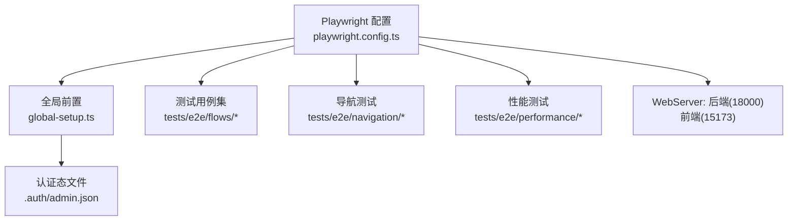
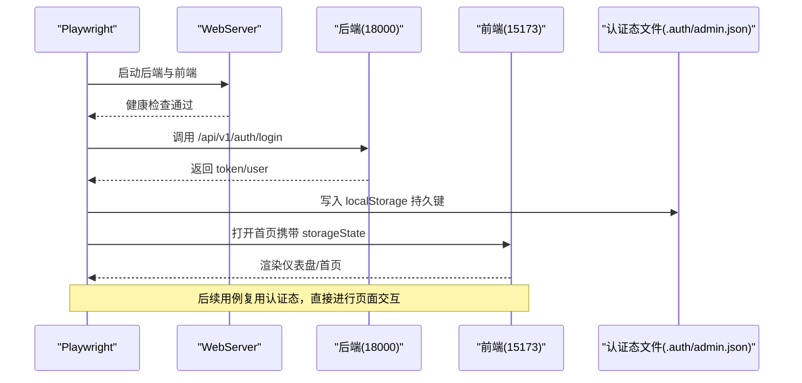
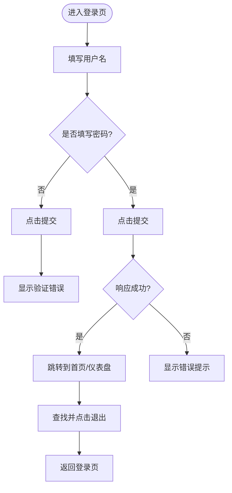
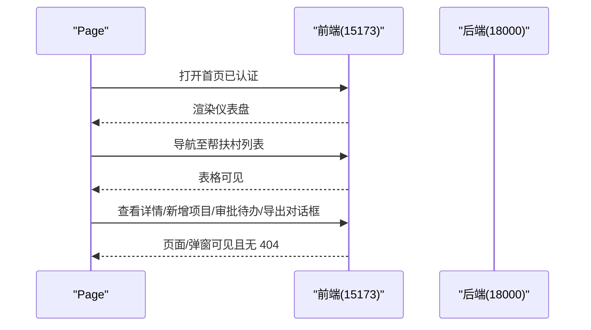
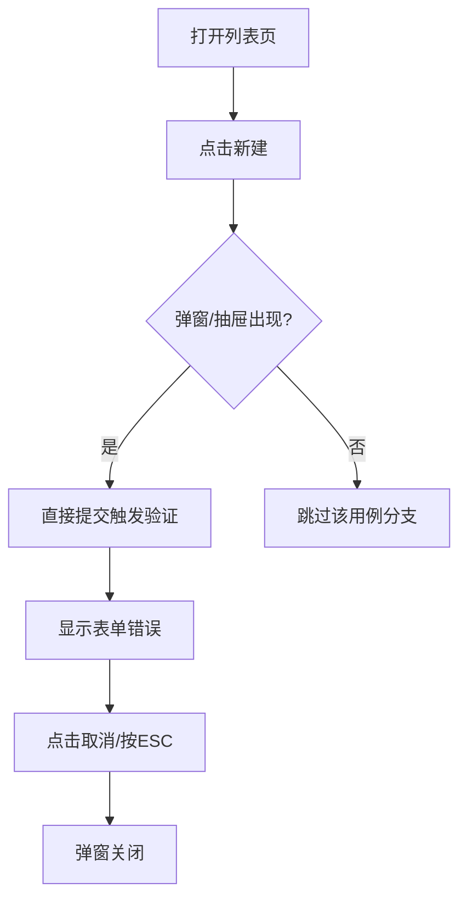
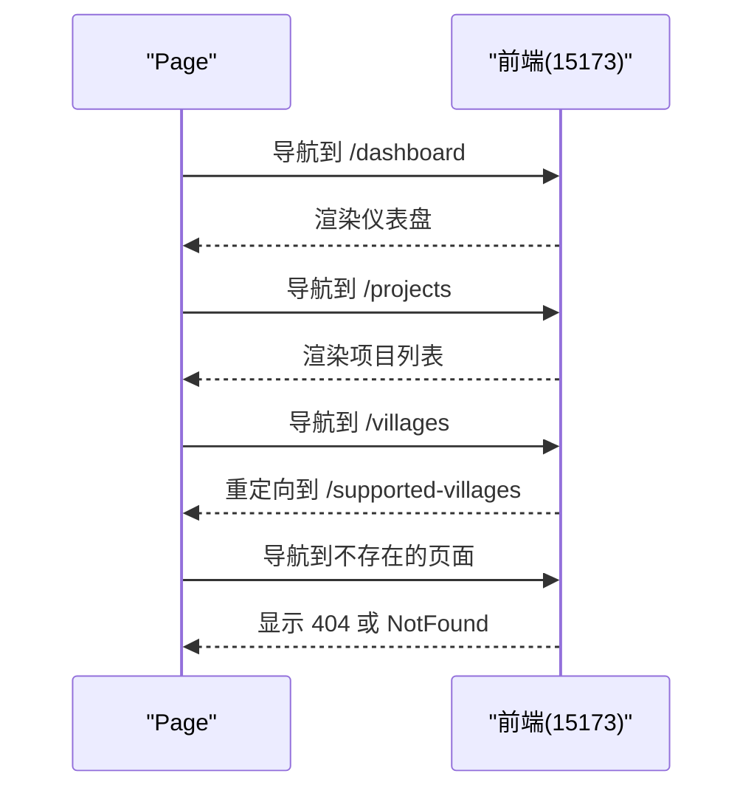
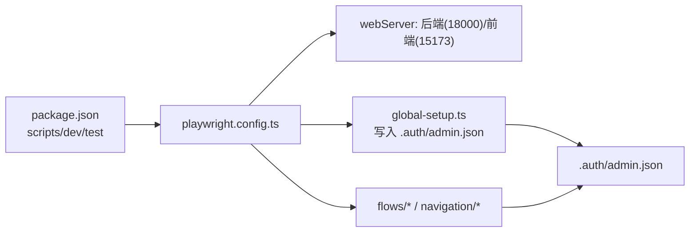

# 端到端测试

<cite>
**本文引用的文件**
- [frontend/playwright.config.ts](file://frontend/playwright.config.ts)
- [frontend/tests/e2e/global-setup.ts](file://frontend/tests/e2e/global-setup.ts)
- [frontend/package.json](file://frontend/package.json)
- [frontend/tests/e2e/flows/login.spec.ts](file://frontend/tests/e2e/flows/login.spec.ts)
- [frontend/tests/e2e/flows/core-business-flow.spec.ts](file://frontend/tests/e2e/flows/core-business-flow.spec.ts)
- [frontend/tests/e2e/flows/form.spec.ts](file://frontend/tests/e2e/flows/form.spec.ts)
- [frontend/tests/e2e/navigation/navigation-correctness.spec.ts](file://frontend/tests/e2e/navigation/navigation-correctness.spec.ts)
</cite>

## 目录
1. [简介](#简介)
2. [项目结构](#项目结构)
3. [核心组件](#核心组件)
4. [架构总览](#架构总览)
5. [详细组件分析](#详细组件分析)
6. [依赖关系分析](#依赖关系分析)
7. [性能考量](#性能考量)
8. [故障排查指南](#故障排查指南)
9. [结论](#结论)
10. [附录](#附录)

## 简介
本文件面向前端端到端（E2E）测试，基于 Playwright 对乡村振兴管理系统的前端进行浏览器自动化与用户交互模拟。文档覆盖：
- 环境配置与启动流程（后端、前端 dev server、独立测试数据库）
- 认证态注入与复用（storageState），避免 UI 登录限流
- 页面元素定位策略、截图与追踪
- 关键场景实现：登录流程、核心业务流程、表单操作、导航正确性
- 跨浏览器与移动端适配建议
- 调试工具使用与性能分析方法

## 项目结构
前端 E2E 测试位于 frontend/tests/e2e，配置文件为 playwright.config.ts，全局前置在 global-setup.ts。测试按场景分目录组织：
- flows：业务流与功能流测试（登录、核心业务、表单等）
- navigation：导航正确性验证
- performance：UI 响应时间测量（示例）
- fixtures：测试夹具（预留）
- .auth：认证态存储文件（由 global-setup 生成）

图表来源
- [frontend/playwright.config.ts:11-83](file://frontend/playwright.config.ts#L11-L83)
- [frontend/tests/e2e/global-setup.ts:22-60](file://frontend/tests/e2e/global-setup.ts#L22-L60)

章节来源
- [frontend/playwright.config.ts:11-83](file://frontend/playwright.config.ts#L11-L83)
- [frontend/tests/e2e/global-setup.ts:22-60](file://frontend/tests/e2e/global-setup.ts#L22-L60)

## 核心组件
- 运行器与报告器：通过 playwright.config.ts 定义测试目录、匹配规则、超时、并行与重试、报告器（CI 输出 GitHub 格式，本地 HTML）。
- WebServer：自动拉起后端（uvicorn 端口 18000）与前端（Vite 端口 15173），并设置环境变量隔离测试数据库与代理目标。
- 全局前置：通过 API 登录一次，写入 storageState（localStorage 持久键），所有 spec 复用该认证态，避免 UI 登录触发限流。
- 测试用例：按场景拆分，覆盖登录、核心业务、表单、导航等。

章节来源
- [frontend/playwright.config.ts:11-83](file://frontend/playwright.config.ts#L11-L83)
- [frontend/tests/e2e/global-setup.ts:22-60](file://frontend/tests/e2e/global-setup.ts#L22-L60)

## 架构总览
E2E 执行时，Playwright 先启动 webServer（后端+前端），再执行 globalSetup 完成一次性 API 登录并生成 storageState；随后各测试用例以已认证态访问前端页面，进行交互与断言。

图表来源
- [frontend/playwright.config.ts:50-82](file://frontend/playwright.config.ts#L50-L82)
- [frontend/tests/e2e/global-setup.ts:22-60](file://frontend/tests/e2e/global-setup.ts#L22-L60)

## 详细组件分析

### 登录流程 E2E（flows/login.spec.ts）
- 目标：验证登录页加载、成功跳转、错误提示、空输入校验、密码可见切换、登出。
- 关键点：
  - 覆盖 storageState 的未认证态，确保测试登录表单本身的行为。
  - 使用通用选择器兼容不同按钮文案与 Element Plus 样式类。
  - 断言 URL 跳转到首页或仪表盘。

图表来源
- [frontend/tests/e2e/flows/login.spec.ts:21-130](file://frontend/tests/e2e/flows/login.spec.ts#L21-L130)

章节来源
- [frontend/tests/e2e/flows/login.spec.ts:21-130](file://frontend/tests/e2e/flows/login.spec.ts#L21-L130)

### 核心业务流程（flows/core-business-flow.spec.ts）
- 目标：从工作台到帮扶村、项目、审批、导出、系统健康度等多页面串联验证。
- 关键点：
  - 利用 storageState 已注入认证态，直接进入首页并等待网络空闲。
  - 针对懒加载与慢速环境，使用 waitForLoadState('networkidle') 与合理超时。
  - 校验路由跳转有效性，避免 undefined 路径。

图表来源
- [frontend/tests/e2e/flows/core-business-flow.spec.ts:13-95](file://frontend/tests/e2e/flows/core-business-flow.spec.ts#L13-L95)

章节来源
- [frontend/tests/e2e/flows/core-business-flow.spec.ts:13-95](file://frontend/tests/e2e/flows/core-business-flow.spec.ts#L13-L95)

### 表单操作（flows/form.spec.ts）
- 目标：验证村庄、项目、学校等模块的列表访问、新建表单打开、表单验证、取消/ESC 关闭。
- 关键点：
  - 通过通用按钮文案选择器兼容多语言或多版本文案。
  - 断言表单弹窗/抽屉出现与消失，验证 Element Plus 表单错误提示。
  - 使用 ESC 键关闭弹窗的键盘交互。

图表来源
- [frontend/tests/e2e/flows/form.spec.ts:23-156](file://frontend/tests/e2e/flows/form.spec.ts#L23-L156)

章节来源
- [frontend/tests/e2e/flows/form.spec.ts:23-156](file://frontend/tests/e2e/flows/form.spec.ts#L23-L156)

### 导航正确性（navigation/navigation-correctness.spec.ts）
- 目标：验证侧边栏与面包屑导航、旧路由重定向、404 处理、根路径跳转。
- 关键点：
  - 统一通过 navigateTo 辅助函数导航（由 helpers 提供）。
  - 断言路由跳转结果与页面内容，确保不存在 404 文本。

图表来源
- [frontend/tests/e2e/navigation/navigation-correctness.spec.ts:14-78](file://frontend/tests/e2e/navigation/navigation-correctness.spec.ts#L14-L78)

章节来源
- [frontend/tests/e2e/navigation/navigation-correctness.spec.ts:14-78](file://frontend/tests/e2e/navigation/navigation-correctness.spec.ts#L14-L78)

## 依赖关系分析
- 运行脚本：package.json 中定义了开发、构建、测试等脚本，E2E 通过 npx playwright test 执行。
- 浏览器与设备：配置中使用 Desktop Chrome（msedge channel），便于复用系统 Edge 内核。
- 环境与端口：webServer 固定后端 18000、前端 15173，避免与生产或本地默认端口冲突；E2E 使用独立 SQLite 数据库。
- 认证态：global-setup 将 token/user 写入 storageState，供所有用例复用。

图表来源
- [frontend/package.json:7-19](file://frontend/package.json#L7-L19)
- [frontend/playwright.config.ts:41-82](file://frontend/playwright.config.ts#L41-L82)
- [frontend/tests/e2e/global-setup.ts:22-60](file://frontend/tests/e2e/global-setup.ts#L22-L60)

章节来源
- [frontend/package.json:7-19](file://frontend/package.json#L7-L19)
- [frontend/playwright.config.ts:41-82](file://frontend/playwright.config.ts#L41-L82)
- [frontend/tests/e2e/global-setup.ts:22-60](file://frontend/tests/e2e/global-setup.ts#L22-L60)

## 性能考量
- 并行与串行：配置启用 fullyParallel 但 workers=1，避免共享 SQLite 测试库并发写导致随机失败。
- 超时设置：全局超时 30s，expect 默认 5s；关键断言可单独设置更长超时。
- 网络等待：使用 networkidle 等待资源加载完成，减少因懒加载导致的断言不稳定。
- 追踪与截图：trace 仅在重试时记录，screenshot 仅失败时捕获，平衡磁盘占用与排障能力。
- 建议：
  - 对慢接口或大数据量页面，适当增加 waitForTimeout 或使用更稳定的断言点（如表格可见）。
  - 在 CI 中开启 retries 提升稳定性。
  - 如需移动端测试，可在 projects 中添加 mobile 设备配置并复用 storageState。

[本节为通用指导，无需特定文件引用]

## 故障排查指南
- 登录失败或 401：
  - 确认 global-setup 已成功调用后端 /api/v1/auth/login 并写入 storageState。
  - 检查 E2E_API_URL/E2E_BASE_URL 与环境变量是否正确。
- 页面空白或 404：
  - 确认 webServer 已启动且端口未被占用；必要时关闭 reuseExistingServer 或在 CI 中强制重启。
  - 检查前端路由与后端代理（E2E_BACKEND_URL）指向 18000。
- 数据污染或随机失败：
  - 确保 DATABASE_URL 指向独立的 e2e_test.db；避免多 worker 并发写同一库。
- 断言不稳定：
  - 使用 waitForLoadState('networkidle') 与合理的超时；优先断言稳定元素（如表格、弹窗）。
- 调试技巧：
  - 使用 --headed 模式观察浏览器行为。
  - 使用 --ui 模式逐步执行与回放。
  - 查看生成的 HTML 报告与 trace（on-first-retry）。

章节来源
- [frontend/playwright.config.ts:15-39](file://frontend/playwright.config.ts#L15-L39)
- [frontend/playwright.config.ts:50-82](file://frontend/playwright.config.ts#L50-L82)
- [frontend/tests/e2e/global-setup.ts:22-60](file://frontend/tests/e2e/global-setup.ts#L22-L60)

## 结论
本项目通过 Playwright 实现了完整的前端 E2E 测试体系：统一的配置与启动流程、一次登录多次复用的认证态、覆盖登录与核心业务的测试用例、以及导航正确性与表单操作的验证。配合合理的超时、网络等待与追踪/截图策略，能够在本地与 CI 环境中稳定运行。建议在后续迭代中补充移动端设备矩阵与更多性能基准用例，进一步提升质量保障能力。

[本节为总结，无需特定文件引用]

## 附录
- 常用命令
  - 运行全部 E2E：npx playwright test
  - 打开 UI 模式：npx playwright test --ui
  - 有头模式运行：npx playwright test --headed
- 环境变量
  - E2E_API_URL：后端 API 地址（默认 http://127.0.0.1:18000/api/v1）
  - E2E_BASE_URL：前端地址（默认 http://127.0.0.1:15173）
  - TEST_USERNAME/TEST_PASSWORD：测试账号凭据
- 跨浏览器与移动端
  - 当前使用 Desktop Chrome（msedge channel）；可按需添加其他设备配置。
  - 移动端适配：在 projects 中添加 mobile 设备并使用相同 storageState 进行认证态复用。

[本节为补充信息，无需特定文件引用]