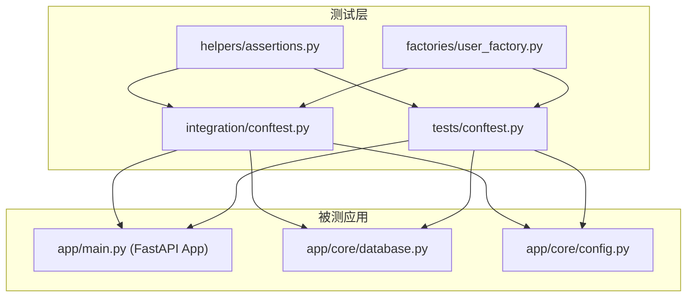
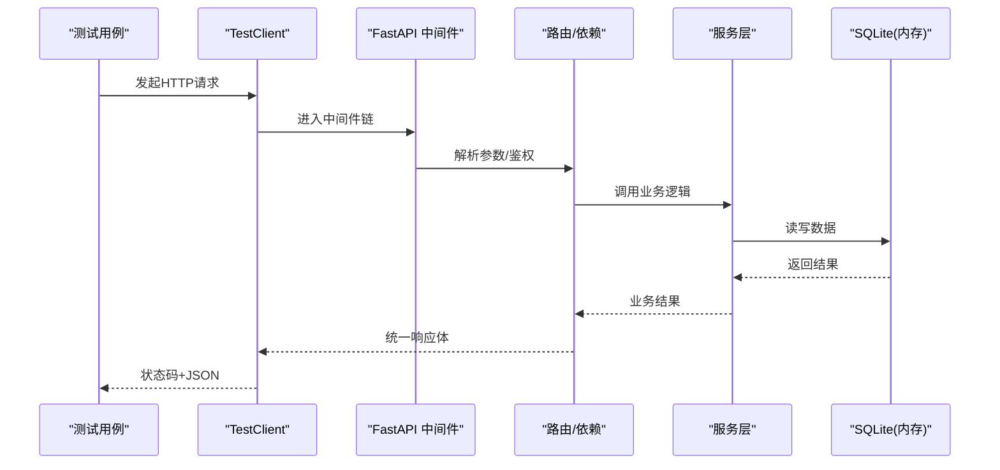
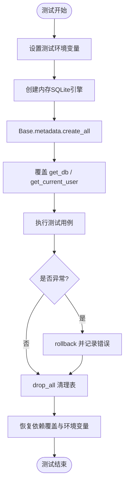
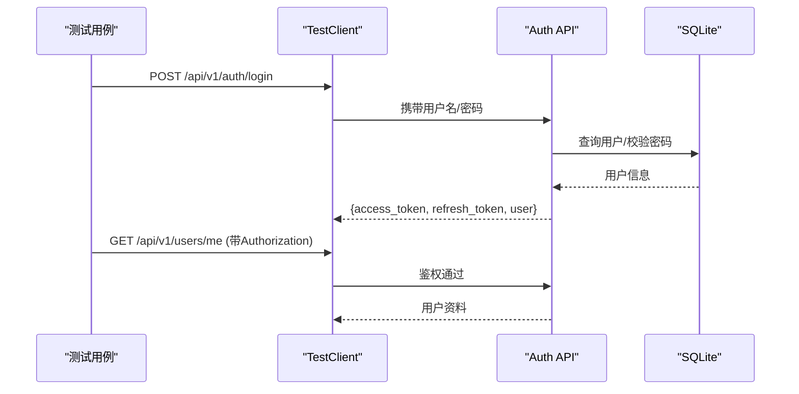
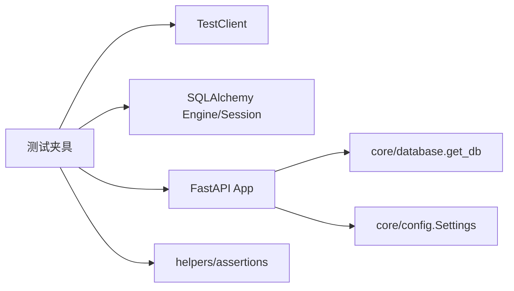

# 集成测试

<cite>
**本文引用的文件**
- [backend/tests/integration/conftest.py](file://backend/tests/integration/conftest.py)
- [backend/tests/conftest.py](file://backend/tests/conftest.py)
- [backend/pytest.ini](file://backend/pytest.ini)
- [backend/pyproject.toml](file://backend/pyproject.toml)
- [backend/app/core/database.py](file://backend/app/core/database.py)
- [backend/app/core/config.py](file://backend/app/core/config.py)
- [backend/tests/integration/test_auth_integration.py](file://backend/tests/integration/test_auth_integration.py)
- [backend/tests/integration/test_users_integration.py](file://backend/tests/integration/test_users_integration.py)
- [backend/tests/factories/user_factory.py](file://backend/tests/factories/user_factory.py)
- [backend/tests/helpers/assertions.py](file://backend/tests/helpers/assertions.py)
</cite>

## 目录
1. [简介](#简介)
2. [项目结构](#项目结构)
3. [核心组件](#核心组件)
4. [架构总览](#架构总览)
5. [详细组件分析](#详细组件分析)
6. [依赖关系分析](#依赖关系分析)
7. [性能考量](#性能考量)
8. [故障排查指南](#故障排查指南)
9. [结论](#结论)
10. [附录](#附录)

## 简介
本文件面向后端 API 的集成测试，系统性说明 FastAPI TestClient 的使用、数据库事务与隔离、外部服务 Mock、并发测试策略，以及测试数据准备、环境搭建、依赖管理与执行流程。同时覆盖认证授权、权限控制、数据一致性验证与错误处理等关键场景的实现方法，并提供调试技巧与性能优化建议。

## 项目结构
后端测试位于 backend/tests 下，按类型划分：
- integration：端到端 API 集成测试（使用真实模型与内存 SQLite）
- unit：单元与模块级测试（大量断言与覆盖率目标）
- factories：测试数据工厂（用户、组织、项目等）
- helpers：通用断言与响应校验工具

图表来源
- [backend/tests/integration/conftest.py:1-313](file://backend/tests/integration/conftest.py#L1-L313)
- [backend/tests/conftest.py:1-697](file://backend/tests/conftest.py#L1-L697)
- [backend/app/core/database.py:1-200](file://backend/app/core/database.py#L1-L200)
- [backend/app/core/config.py:1-200](file://backend/app/core/config.py#L1-L200)

章节来源
- [backend/tests/integration/conftest.py:1-313](file://backend/tests/integration/conftest.py#L1-L313)
- [backend/tests/conftest.py:1-697](file://backend/tests/conftest.py#L1-L697)
- [backend/pytest.ini:1-38](file://backend/pytest.ini#L1-L38)
- [backend/pyproject.toml:1-34](file://backend/pyproject.toml#L1-L34)

## 核心组件
- 测试客户端与依赖注入覆盖：通过 FastAPI TestClient 与 dependency_overrides 将 get_db、get_current_user 等替换为测试实现，确保请求在内存数据库中运行并绕过真实鉴权。
- 数据库夹具：每个测试前创建所有表，测试后清理；提供 db、client、admin_user、normal_user、admin_token、user_headers 等常用夹具。
- 全局配置与环境：在导入 app 之前设置环境变量（ENVIRONMENT、DATABASE_URL、SECRET_KEY、CSRF_ENABLED、DEBUG），避免污染生产配置。
- 统一断言库：封装信封格式、分页、权限拒绝、审计日志、加密字段等断言，提升可读性与稳定性。
- 数据工厂：集中构建用户、组织等实体，支持 build/create/build_admin/operator/viewer 等便捷方法。

章节来源
- [backend/tests/integration/conftest.py:47-213](file://backend/tests/integration/conftest.py#L47-L213)
- [backend/tests/conftest.py:352-411](file://backend/tests/conftest.py#L352-L411)
- [backend/tests/helpers/assertions.py:1-190](file://backend/tests/helpers/assertions.py#L1-L190)
- [backend/tests/factories/user_factory.py:1-86](file://backend/tests/factories/user_factory.py#L1-L86)

## 架构总览
集成测试以 FastAPI TestClient 驱动 HTTP 请求，经过中间件、路由、服务层到数据库。测试夹具在请求前注入测试数据库会话与模拟用户，保证每次测试独立、可重复。

图表来源
- [backend/tests/integration/conftest.py:112-213](file://backend/tests/integration/conftest.py#L112-L213)
- [backend/app/core/database.py:174-187](file://backend/app/core/database.py#L174-L187)

## 详细组件分析

### 测试环境与数据库事务
- 环境变量前置：在导入 app 之前设置 ENVIRONMENT、DATABASE_URL、SECRET_KEY、CSRF_ENABLED、DEBUG，确保应用以测试模式启动。
- 内存数据库：使用 sqlite:// 内存库 + StaticPool，避免跨进程共享问题；每个测试前 Base.metadata.create_all，测试后 drop_all。
- 依赖覆盖：覆盖 get_db 和 get_current_user/get_current_active_user，使路由与依赖注入均指向测试 SessionLocal 与 Mock 用户。
- 事务隔离：每个测试拥有独立 Session，测试结束关闭；必要时显式 rollback，避免跨测试污染。
- 外键约束：SQLite 默认不强制外键，测试 teardown 时临时关闭 PRAGMA foreign_keys 以避免 drop_all 排序失败。

图表来源
- [backend/tests/integration/conftest.py:112-197](file://backend/tests/integration/conftest.py#L112-L197)
- [backend/app/core/database.py:174-187](file://backend/app/core/database.py#L174-L187)

章节来源
- [backend/tests/integration/conftest.py:1-313](file://backend/tests/integration/conftest.py#L1-L313)
- [backend/app/core/database.py:1-200](file://backend/app/core/database.py#L1-L200)

### 外部服务 Mock 与速率限制
- 速率限制：通过 patch("app.api.v1.auth.auth.check_rate_limit") 模拟返回 False，触发 429 限流路径，验证限流保护生效。
- 缓存/消息队列：如需测试，可通过依赖覆盖或 unittest.mock.patch 替换对应服务接口，仅关注输入输出契约。
- 第三方服务：对外部 HTTP 调用建议使用 httpx mock 或 requests mock，确保测试离线且稳定。

章节来源
- [backend/tests/integration/test_auth_integration.py:262-271](file://backend/tests/integration/test_auth_integration.py#L262-L271)

### 并发测试策略
- 单进程内并发：TestClient 基于同步调用，适合串行集成测试；若需并发，可使用 pytest-xdist 多进程并行，但需确保数据库隔离（内存库天然隔离）。
- 连接池与锁：SQLite WAL + busy_timeout=10000 缓解并发写冲突；长事务写入走独占协调器，避免阻塞短事务读取。
- 资源竞争：避免共享全局可变状态（如 token_manager 缓存、rate limit store），在每个测试前清理。

章节来源
- [backend/app/core/database.py:133-157](file://backend/app/core/database.py#L133-L157)
- [backend/tests/integration/conftest.py:112-128](file://backend/tests/integration/conftest.py#L112-L128)

### 认证授权与权限控制测试
- 登录/登出/刷新：覆盖成功、密码错误、不存在用户、校验失败、刷新令牌、访问 me 等场景。
- 权限控制：通过 admin_headers/user_headers 区分管理员与普通用户，断言不同角色对同一接口的访问差异。
- 令牌失效：修改密码后旧令牌应失效，后续请求返回 401/403。

图表来源
- [backend/tests/integration/test_auth_integration.py:10-70](file://backend/tests/integration/test_auth_integration.py#L10-L70)
- [backend/tests/integration/test_auth_integration.py:108-188](file://backend/tests/integration/test_auth_integration.py#L108-L188)
- [backend/tests/integration/test_users_integration.py:10-32](file://backend/tests/integration/test_users_integration.py#L10-L32)

章节来源
- [backend/tests/integration/test_auth_integration.py:1-271](file://backend/tests/integration/test_auth_integration.py#L1-L271)
- [backend/tests/integration/test_users_integration.py:1-221](file://backend/tests/integration/test_users_integration.py#L1-L221)

### 数据一致性验证
- 列表/分页：断言返回包含 total、page、page_size、items，并验证过滤条件（关键词、is_active）生效。
- 唯一性：创建用户时重复用户名/邮箱应被拒绝（预留断言位）。
- 软删除/状态：根据模型设计验证 is_active、deleted_at 等字段行为。

章节来源
- [backend/tests/integration/test_users_integration.py:64-147](file://backend/tests/integration/test_users_integration.py#L64-L147)

### 错误处理测试
- 校验错误：422 验证错误（用户名过短、密码过短）。
- 未认证/无权限：401/403 多种可能（取决于鉴权实现），断言响应体包含 message/detail。
- 资源不存在：404/400 断言。

章节来源
- [backend/tests/integration/test_auth_integration.py:25-58](file://backend/tests/integration/test_auth_integration.py#L25-L58)
- [backend/tests/integration/test_users_integration.py:101-120](file://backend/tests/integration/test_users_integration.py#L101-L120)

### 测试数据准备与工厂
- 用户工厂：UserFactory.build/create 支持默认密码、角色、部门等；提供 build_admin/operator/viewer 快捷方法。
- 夹具用户：admin_user、normal_user 直接持久化到内存库，便于端到端认证流程。
- 组织关联：UserOrganizationFactory 用于组织维度数据隔离测试。

章节来源
- [backend/tests/factories/user_factory.py:1-86](file://backend/tests/factories/user_factory.py#L1-L86)
- [backend/tests/integration/conftest.py:215-264](file://backend/tests/integration/conftest.py#L215-L264)

### 测试执行流程与依赖管理
- 入口：pytest 自动收集 tests 目录下 test_*.py，按标记筛选（unit、integration、security 等）。
- 配置：pytest.ini 定义 markers、asyncio_mode、filterwarnings；pyproject.toml 配置 coverage 源与 100% 门禁。
- 执行顺序：根 conftest 将依赖 mock/TestClient 的测试提前执行，避免跨测试污染。

章节来源
- [backend/pytest.ini:1-38](file://backend/pytest.ini#L1-L38)
- [backend/pyproject.toml:1-34](file://backend/pyproject.toml#L1-L34)
- [backend/tests/conftest.py:81-108](file://backend/tests/conftest.py#L81-L108)

## 依赖关系分析
- 测试夹具依赖 FastAPI TestClient、SQLAlchemy Engine/Session、app.models.Base。
- 应用依赖 app.core.database.get_db、app.core.config.Settings。
- 测试断言依赖统一响应格式（Envelope/Bare）与分页结构。

图表来源
- [backend/tests/integration/conftest.py:112-213](file://backend/tests/integration/conftest.py#L112-L213)
- [backend/app/core/database.py:174-187](file://backend/app/core/database.py#L174-L187)
- [backend/tests/helpers/assertions.py:1-190](file://backend/tests/helpers/assertions.py#L1-L190)

章节来源
- [backend/tests/integration/conftest.py:112-213](file://backend/tests/integration/conftest.py#L112-L213)
- [backend/app/core/database.py:174-187](file://backend/app/core/database.py#L174-L187)
- [backend/tests/helpers/assertions.py:1-190](file://backend/tests/helpers/assertions.py#L1-L190)

## 性能考量
- 内存数据库：sqlite:// 内存库 + StaticPool，避免磁盘 IO，提高测试速度。
- WAL 模式与 PRAGMA：WAL、busy_timeout、cache_size、mmap_size 调优，减少锁等待与提升并发读性能。
- 连接池：QueuePool 限制连接数，防止过多连接导致文件锁竞争。
- 测试隔离：每个测试独立 Session，避免长事务影响其他测试。
- 覆盖率门禁：coverage fail_under=100，推动高覆盖质量。

章节来源
- [backend/app/core/database.py:133-157](file://backend/app/core/database.py#L133-L157)
- [backend/pyproject.toml:13-17](file://backend/pyproject.toml#L13-L17)

## 故障排查指南
- 数据库损坏/页损坏：根因是测试写入了真实开发库；已在根 conftest 中强制设置 DATABASE_URL 为测试库并在会话开始时清理遗留 test.db。
- 超长环境变量：Windows 环境变量长度限制导致 patch.dict 还原时报错；已在会话级 fixture 中移除超长变量。
- 模型懒加载导致的 mapper 初始化失败：在 conftest 启动时导入全部模型子模块，确保 mapper 注册表完整。
- 审计落库链路失败：测试 client fixture 将 module 级 engine/SessionLocal 也指向内存库，确保审计真正落库可断言。
- 并发敏感测试污染：将依赖 mock/TestClient 的测试文件提前执行，避免其他测试破坏事件循环或依赖覆盖。

章节来源
- [backend/tests/conftest.py:6-73](file://backend/tests/conftest.py#L6-L73)
- [backend/tests/conftest.py:383-401](file://backend/tests/conftest.py#L383-L401)
- [backend/tests/conftest.py:81-108](file://backend/tests/conftest.py#L81-L108)

## 结论
本项目的集成测试体系以 FastAPI TestClient 为核心，结合内存 SQLite、依赖注入覆盖、统一断言与数据工厂，实现了高可靠、可维护的端到端 API 测试。通过严格的测试环境隔离、并发优化与覆盖率门禁，有效保障了认证授权、权限控制、数据一致性与错误处理的正确性。建议在新增功能时沿用现有夹具与断言模式，保持测试的一致性与可追溯性。

## 附录
- 常用命令
  - 运行集成测试：pytest -v -m integration
  - 运行单元测试：pytest -v -m unit
  - 生成覆盖率报告：pytest --cov=app --cov-report=html
- 参考文件
  - 测试夹具与客户端：[backend/tests/integration/conftest.py](file://backend/tests/integration/conftest.py)
  - 根测试配置：[backend/tests/conftest.py](file://backend/tests/conftest.py)
  - 数据库核心：[backend/app/core/database.py](file://backend/app/core/database.py)
  - 配置管理：[backend/app/core/config.py](file://backend/app/core/config.py)
  - 认证集成测试：[backend/tests/integration/test_auth_integration.py](file://backend/tests/integration/test_auth_integration.py)
  - 用户管理集成测试：[backend/tests/integration/test_users_integration.py](file://backend/tests/integration/test_users_integration.py)
  - 数据工厂：[backend/tests/factories/user_factory.py](file://backend/tests/factories/user_factory.py)
  - 断言工具：[backend/tests/helpers/assertions.py](file://backend/tests/helpers/assertions.py)