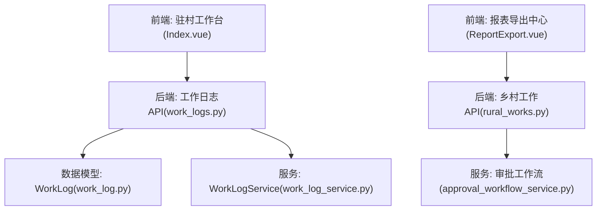
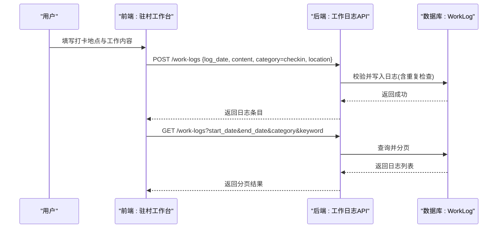
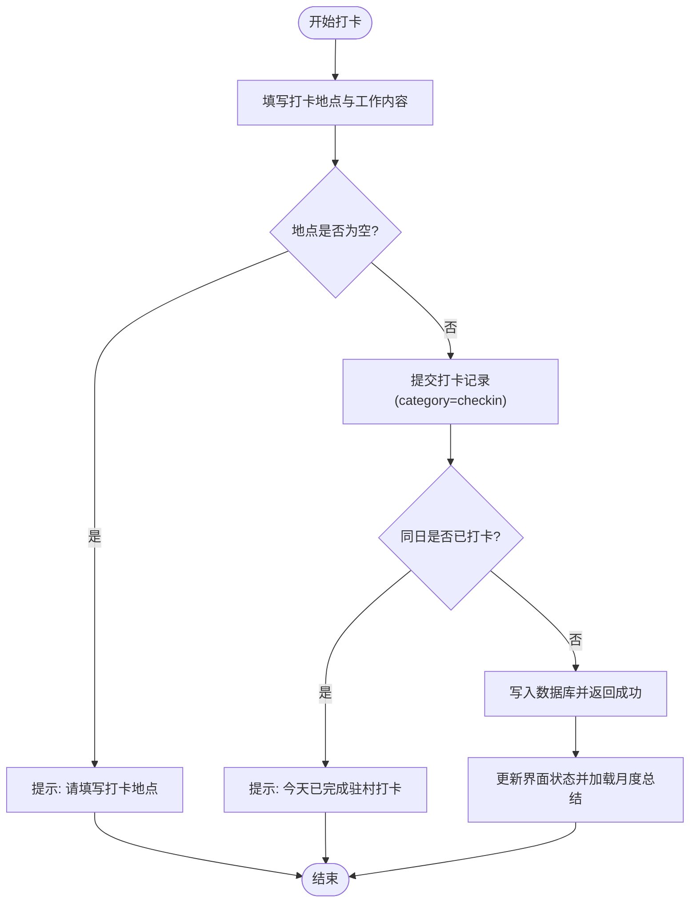
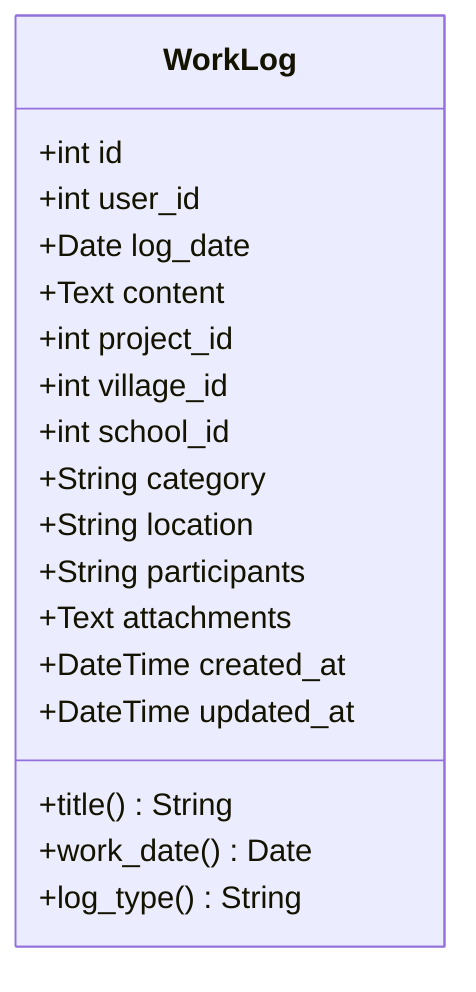
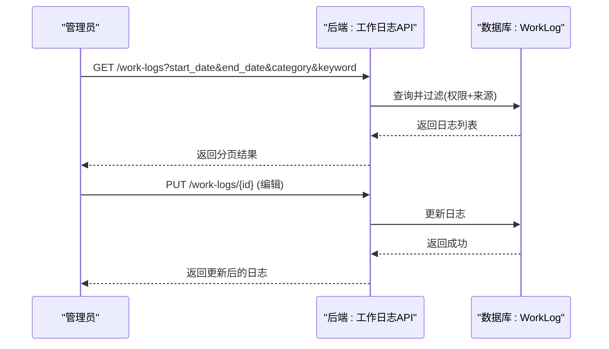
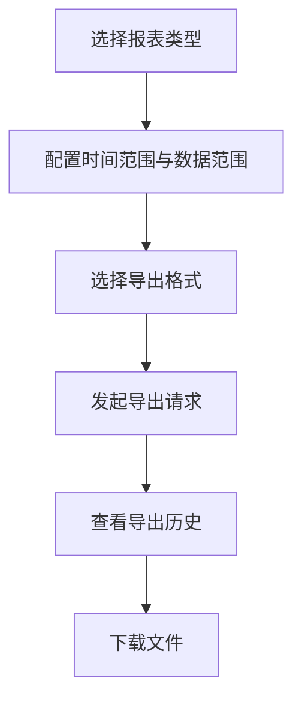
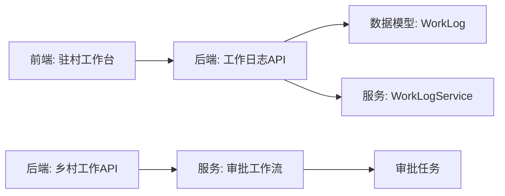

# 下乡打卡与工作日志

<cite>
**本文引用的文件**
- [backend/app/models/work_log.py](file://backend/app/models/work_log.py)
- [backend/app/services/work_log_service.py](file://backend/app/services/work_log_service.py)
- [backend/app/api/v1/work_logs.py](file://backend/app/api/v1/work_logs.py)
- [frontend/src/views/ruralWorks/checkin/Index.vue](file://frontend/src/views/ruralWorks/checkin/Index.vue)
- [backend/app/api/v1/rural_works.py](file://backend/app/api/v1/rural_works.py)
- [backend/app/schemas/rural_work.py](file://backend/app/schemas/rural_work.py)
- [backend/app/services/approval_workflow_service.py](file://backend/app/services/approval_workflow_service.py)
- [frontend/src/views/export/ReportExport.vue](file://frontend/src/views/export/ReportExport.vue)
</cite>

## 目录
1. [简介](#简介)
2. [项目结构](#项目结构)
3. [核心组件](#核心组件)
4. [架构总览](#架构总览)
5. [详细组件分析](#详细组件分析)
6. [依赖关系分析](#依赖关系分析)
7. [性能注意事项](#性能注意事项)
8. [故障排查指南](#故障排查指南)
9. [结论](#结论)
10. [附录](#附录)

## 简介
本操作指南面向驻村工作人员与管理人员，覆盖“下乡打卡”和“工作日志”两大能力：
- 下乡打卡：支持签到、位置记录、重复打卡保护、月度总结。
- 工作日志：支持创建、更新、删除、按日期/分类/关键词检索、日历视图、月度汇总。
- 审核与管理：结合审批流程，对乡村工作等实体变更进行自动审批；工作日志支持来源区分（手动/自动）与权限控制。
- 统计与导出：提供报表导出中心，支持时间范围、数据范围、格式选择及历史追溯。

## 项目结构
围绕“下乡打卡与工作日志”，系统采用前后端分离架构：
- 前端页面：驻村工作台（打卡与月度总结）、报表导出中心。
- 后端接口：工作日志 CRUD、日历视图、月度汇总；乡村工作列表与统计、报告生成。
- 数据模型：工作日志模型包含用户、日期、内容、地点、参与人、附件、关联对象（项目/村/学校）等字段。
- 服务层：工作日志服务封装基础 CRUD；审批工作流服务负责实体变更的审批任务创建与处理。

**图表来源**
- [frontend/src/views/ruralWorks/checkin/Index.vue:1-252](file://frontend/src/views/ruralWorks/checkin/Index.vue#L1-L252)
- [backend/app/api/v1/work_logs.py:1-437](file://backend/app/api/v1/work_logs.py#L1-L437)
- [backend/app/models/work_log.py:1-79](file://backend/app/models/work_log.py#L1-L79)
- [backend/app/services/work_log_service.py:1-100](file://backend/app/services/work_log_service.py#L1-L100)
- [backend/app/api/v1/rural_works.py:1-272](file://backend/app/api/v1/rural_works.py#L1-L272)
- [backend/app/services/approval_workflow_service.py:214-670](file://backend/app/services/approval_workflow_service.py#L214-L670)

**章节来源**
- [backend/app/models/work_log.py:1-79](file://backend/app/models/work_log.py#L1-L79)
- [backend/app/api/v1/work_logs.py:1-437](file://backend/app/api/v1/work_logs.py#L1-L437)
- [frontend/src/views/ruralWorks/checkin/Index.vue:1-252](file://frontend/src/views/ruralWorks/checkin/Index.vue#L1-L252)

## 核心组件
- 工作日志数据模型：定义日志表结构与索引，支持按用户、项目、村、学校、日期等多维度查询。
- 工作日志API：提供列表、创建、更新、删除、日历视图、月度汇总等接口，并实现字段兼容（title/log_type/work_date）。
- 驻村工作台（前端）：提供今日打卡入口、地点与工作内容输入、重复打卡提示、月度总结展示。
- 乡村工作API与服务：提供列表、统计、报告生成，并在新增/更新/删除时触发审批流程。
- 审批工作流服务：根据实体类型匹配活跃工作流，创建审批任务，支持角色节点解析与默认工作流兜底。
- 报表导出中心（前端）：选择报表类型、配置时间范围与数据范围、选择导出格式，查看导出历史。

**章节来源**
- [backend/app/models/work_log.py:10-79](file://backend/app/models/work_log.py#L10-L79)
- [backend/app/api/v1/work_logs.py:77-437](file://backend/app/api/v1/work_logs.py#L77-L437)
- [frontend/src/views/ruralWorks/checkin/Index.vue:10-186](file://frontend/src/views/ruralWorks/checkin/Index.vue#L10-L186)
- [backend/app/api/v1/rural_works.py:57-272](file://backend/app/api/v1/rural_works.py#L57-L272)
- [backend/app/services/approval_workflow_service.py:214-670](file://backend/app/services/approval_workflow_service.py#L214-L670)
- [frontend/src/views/export/ReportExport.vue:1-200](file://frontend/src/views/export/ReportExport.vue#L1-L200)

## 架构总览
下乡打卡与工作日志的整体交互如下：
- 前端驻村工作台调用工作日志API完成打卡与查询。
- 后端校验必填字段、去重（同用户同日仅允许一条打卡），持久化到数据库。
- 列表与日历视图支持按日期范围、分类、关键词筛选，并按来源（手动/自动）排序显示。
- 乡村工作变更通过审批工作流服务创建审批任务，进入待审批板块。
- 报表导出中心统一发起导出请求，支持多种报表类型与格式。

**图表来源**
- [frontend/src/views/ruralWorks/checkin/Index.vue:112-158](file://frontend/src/views/ruralWorks/checkin/Index.vue#L112-L158)
- [backend/app/api/v1/work_logs.py:163-233](file://backend/app/api/v1/work_logs.py#L163-L233)
- [backend/app/models/work_log.py:10-79](file://backend/app/models/work_log.py#L10-L79)

## 详细组件分析

### 下乡打卡流程与位置记录
- 签到流程：
  - 前端表单收集打卡地点与可选工作内容，提交至工作日志API，category为checkin。
  - 后端校验必填字段，若category为checkin则检查同用户同日是否已有记录，避免重复打卡。
  - 成功后前端更新状态并刷新月度总结。
- 位置记录：
  - 支持location字段记录打卡地点，便于后续统计与审计。
- 月度总结：
  - 前端调用月度汇总接口，展示工作项数、打卡天数、分类统计与明细列表。

**图表来源**
- [frontend/src/views/ruralWorks/checkin/Index.vue:112-158](file://frontend/src/views/ruralWorks/checkin/Index.vue#L112-L158)
- [backend/app/api/v1/work_logs.py:191-233](file://backend/app/api/v1/work_logs.py#L191-L233)

**章节来源**
- [frontend/src/views/ruralWorks/checkin/Index.vue:10-186](file://frontend/src/views/ruralWorks/checkin/Index.vue#L10-L186)
- [backend/app/api/v1/work_logs.py:163-233](file://backend/app/api/v1/work_logs.py#L163-L233)

### 工作日志的记录方法（内容、时间统计、问题描述）
- 创建日志：
  - 支持标准字段与兼容字段（title→content、log_type→category、work_date→log_date）。
  - 必填校验：工作日期不能为空，工作内容去除首尾空格后仍不能为空。
  - 字符串日期转换为date对象以适配SQLite Date列。
- 时间统计：
  - 列表接口支持start_date/end_date过滤；日历视图按月聚合；月度汇总统计打卡天数与分类计数。
- 问题描述：
  - 可在content中记录问题描述，并通过关键词搜索快速定位。

**图表来源**
- [backend/app/models/work_log.py:10-79](file://backend/app/models/work_log.py#L10-L79)

**章节来源**
- [backend/app/api/v1/work_logs.py:163-233](file://backend/app/api/v1/work_logs.py#L163-L233)
- [backend/app/api/v1/work_logs.py:77-160](file://backend/app/api/v1/work_logs.py#L77-L160)
- [backend/app/api/v1/work_logs.py:313-437](file://backend/app/api/v1/work_logs.py#L313-L437)

### 打卡记录的查看、审核与管理
- 查看：
  - 列表接口支持按日期范围、项目、村、分类、关键词筛选；非管理员仅可见本人手动日志与全部自动日志。
  - 日历视图按月返回事件，支持来源筛选（auto/manual）。
- 审核：
  - 工作日志本身无独立审核流程；但乡村工作变更会触发审批任务，进入待审批板块。
- 管理：
  - 管理员可编辑/删除他人日志；自动记录不允许删除；普通用户仅能编辑/删除自己的日志。

**图表来源**
- [backend/app/api/v1/work_logs.py:77-160](file://backend/app/api/v1/work_logs.py#L77-L160)
- [backend/app/api/v1/work_logs.py:236-286](file://backend/app/api/v1/work_logs.py#L236-L286)

**章节来源**
- [backend/app/api/v1/work_logs.py:77-160](file://backend/app/api/v1/work_logs.py#L77-L160)
- [backend/app/api/v1/work_logs.py:236-310](file://backend/app/api/v1/work_logs.py#L236-L310)

### 工作日志的分类、标签与搜索功能
- 分类：
  - category字段用于分类（如visit/meeting/inspection/training/other/checkin/system_auto）。
  - 列表与日历视图支持按category或log_type参数过滤。
- 标签：
  - 可通过participants字段记录参与人员（逗号分隔），作为辅助标签。
- 搜索：
  - 支持keyword参数对content进行模糊匹配；支持start_date/end_date精确范围过滤。

**章节来源**
- [backend/app/api/v1/work_logs.py:77-160](file://backend/app/api/v1/work_logs.py#L77-L160)
- [backend/app/models/work_log.py:50-57](file://backend/app/models/work_log.py#L50-L57)

### 打卡异常处理与补卡申请流程
- 异常处理：
  - 重复打卡：后端检测到同用户同日已有checkin记录时返回错误提示。
  - 必填校验：工作日期或内容为空时返回422错误。
  - 权限限制：非管理员无法删除自动记录；只能编辑自己的日志。
- 补卡申请：
  - 当前工作日志模块未内置“补卡申请”专用流程；如需补卡，可通过创建新的日志记录（category=checkin）并备注说明，或由管理员在后台修正。
  - 对于乡村工作等实体的变更，系统支持自动创建审批任务，可作为参考流程扩展补卡审批。

**章节来源**
- [backend/app/api/v1/work_logs.py:191-233](file://backend/app/api/v1/work_logs.py#L191-L233)
- [backend/app/api/v1/work_logs.py:289-310](file://backend/app/api/v1/work_logs.py#L289-L310)
- [backend/app/api/v1/rural_works.py:150-202](file://backend/app/api/v1/rural_works.py#L150-L202)
- [backend/app/services/approval_workflow_service.py:214-670](file://backend/app/services/approval_workflow_service.py#L214-L670)

### 工作统计报表生成与数据导出
- 工作统计：
  - 月度汇总接口返回总条数、打卡天数、分类计数与明细列表，便于生成工作总结。
  - 乡村工作统计接口提供总体统计与报告生成。
- 数据导出：
  - 报表导出中心支持选择报表类型、时间范围、数据范围、导出格式（Excel/PDF/Word），并查看导出历史。
  - 官方报告导出支持一键生成Word/PDF格式的帮扶公文。

**图表来源**
- [frontend/src/views/export/ReportExport.vue:1-200](file://frontend/src/views/export/ReportExport.vue#L1-L200)
- [backend/app/api/v1/rural_works.py:93-133](file://backend/app/api/v1/rural_works.py#L93-L133)

**章节来源**
- [backend/app/api/v1/work_logs.py:374-437](file://backend/app/api/v1/work_logs.py#L374-L437)
- [backend/app/api/v1/rural_works.py:93-133](file://backend/app/api/v1/rural_works.py#L93-L133)
- [frontend/src/views/export/ReportExport.vue:1-200](file://frontend/src/views/export/ReportExport.vue#L1-L200)

## 依赖关系分析
- 前端驻村工作台依赖工作日志API进行打卡与查询。
- 工作日志API依赖数据模型WorkLog与服务层WorkLogService进行CRUD。
- 乡村工作API在服务层注册审批处理器，并在新增/更新/删除时调用审批工作流服务创建任务。
- 审批工作流服务根据实体类型匹配活跃工作流，创建审批任务，支持角色节点解析与默认工作流兜底。

**图表来源**
- [frontend/src/views/ruralWorks/checkin/Index.vue:1-252](file://frontend/src/views/ruralWorks/checkin/Index.vue#L1-L252)
- [backend/app/api/v1/work_logs.py:1-437](file://backend/app/api/v1/work_logs.py#L1-L437)
- [backend/app/models/work_log.py:1-79](file://backend/app/models/work_log.py#L1-L79)
- [backend/app/services/work_log_service.py:1-100](file://backend/app/services/work_log_service.py#L1-L100)
- [backend/app/api/v1/rural_works.py:1-272](file://backend/app/api/v1/rural_works.py#L1-L272)
- [backend/app/services/approval_workflow_service.py:214-670](file://backend/app/services/approval_workflow_service.py#L214-L670)

**章节来源**
- [backend/app/api/v1/work_logs.py:1-437](file://backend/app/api/v1/work_logs.py#L1-L437)
- [backend/app/api/v1/rural_works.py:1-272](file://backend/app/api/v1/rural_works.py#L1-L272)
- [backend/app/services/approval_workflow_service.py:214-670](file://backend/app/services/approval_workflow_service.py#L214-L670)

## 性能注意事项
- 列表查询使用分页与索引优化（user_id、log_date、project_id、village_id等索引）。
- 日历视图与月度汇总按月份范围查询，减少不必要的数据扫描。
- 导出功能支持时间范围与数据范围过滤，建议合理设置范围以提升响应速度。
- 批量操作（如批量删除乡村工作）记录工作日志并触发审批任务，注意并发与事务一致性。

[本节为通用性能指导，不直接分析具体文件]

## 故障排查指南
- 重复打卡：
  - 现象：提交打卡时报错“今天已完成驻村打卡”。
  - 原因：同用户同日已有checkin记录。
  - 处理：确认是否已打卡；如需补卡，创建新日志并备注说明。
- 必填校验失败：
  - 现象：创建工作日志返回422错误，提示“工作日期不能为空”或“工作内容不能为空”。
  - 原因：未提供日期或内容为空/仅空格。
  - 处理：补充日期与内容；确保内容去除首尾空格后仍有值。
- 权限限制：
  - 现象：编辑或删除他人日志返回403；自动记录不允许删除。
  - 原因：非管理员权限不足或自动记录保护。
  - 处理：联系管理员处理；或修改为手动记录后再操作。
- 审批任务未创建：
  - 现象：乡村工作变更后未进入待审批板块。
  - 原因：未配置活跃工作流或角色节点解析失败。
  - 处理：检查审批工作流配置；系统会自动创建默认工作流并重试。

**章节来源**
- [backend/app/api/v1/work_logs.py:191-233](file://backend/app/api/v1/work_logs.py#L191-L233)
- [backend/app/api/v1/work_logs.py:289-310](file://backend/app/api/v1/work_logs.py#L289-L310)
- [backend/app/services/approval_workflow_service.py:214-670](file://backend/app/services/approval_workflow_service.py#L214-L670)

## 结论
本系统提供了完整的下乡打卡与工作日志能力，涵盖签到签退、位置记录、分类搜索、月度汇总、审批联动与报表导出。通过清晰的权限控制与数据隔离，确保数据准确性与安全性。建议在实际使用中：
- 规范打卡地点与工作内容填写，便于后续统计与审计。
- 合理使用分类与关键词搜索，提高查找效率。
- 利用月度汇总与报表导出，生成工作总结与汇报材料。
- 对于需要审批的业务（如乡村工作变更），确保审批工作流配置正确。

[本节为总结性内容，不直接分析具体文件]

## 附录
- 常用接口路径：
  - 工作日志列表：GET /api/v1/work-logs
  - 创建工作日志：POST /api/v1/work-logs
  - 更新工作日志：PUT /api/v1/work-logs/{log_id}
  - 删除工作日志：DELETE /api/v1/work-logs/{log_id}
  - 日历视图：GET /api/v1/work-logs/calendar?year=&month=
  - 月度汇总：GET /api/v1/work-logs/monthly-summary?year=&month=
  - 乡村工作列表：GET /api/v1/rural-works
  - 乡村工作统计：GET /api/v1/rural-works/statistics/summary
  - 报告生成：GET /api/v1/rural-works/report/generate

**章节来源**
- [backend/app/api/v1/work_logs.py:77-437](file://backend/app/api/v1/work_logs.py#L77-L437)
- [backend/app/api/v1/rural_works.py:57-133](file://backend/app/api/v1/rural_works.py#L57-L133)