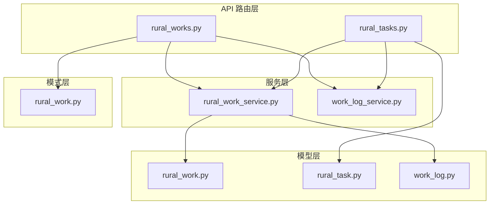
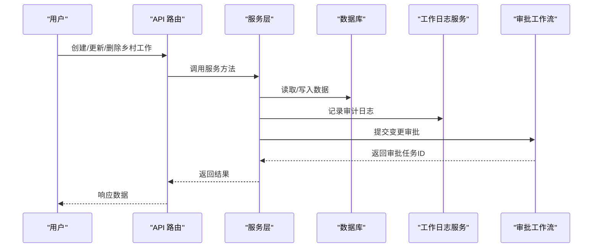
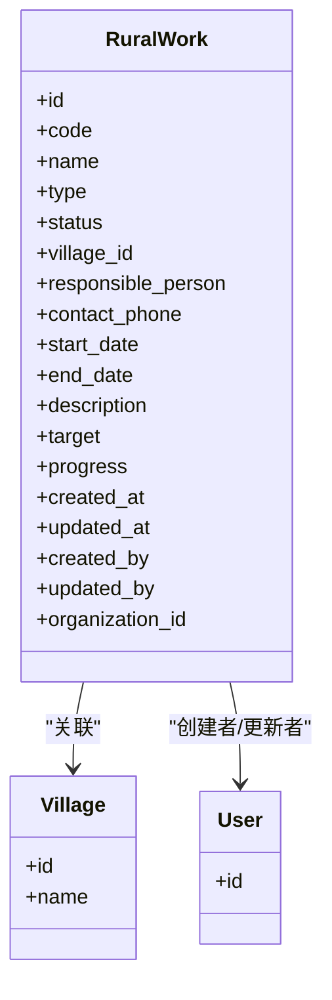
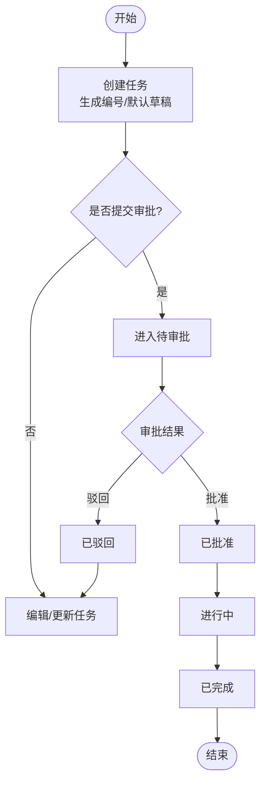
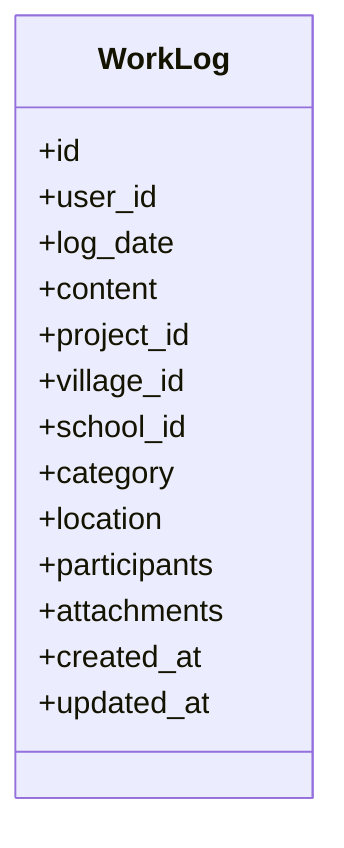
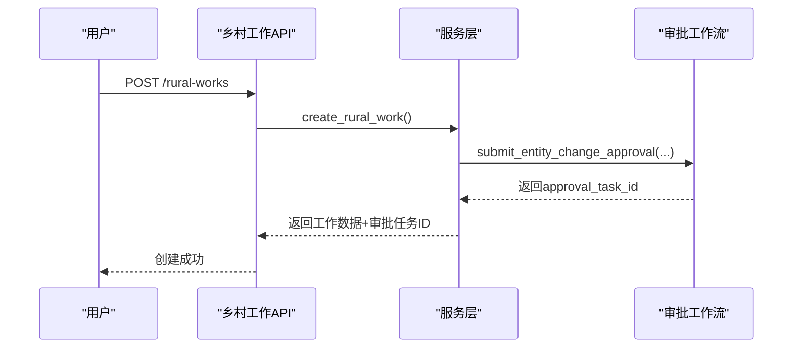
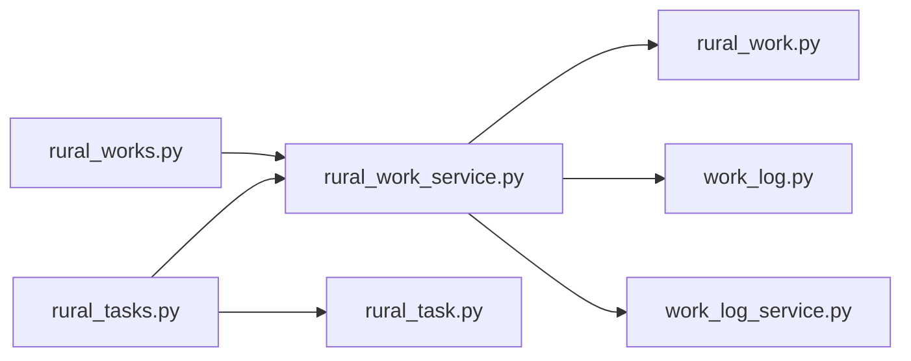

# 乡村工作管理指南

<cite>
**本文引用的文件**
- [backend/app/models/rural_work.py](file://backend/app/models/rural_work.py)
- [backend/app/models/rural_task.py](file://backend/app/models/rural_task.py)
- [backend/app/models/work_log.py](file://backend/app/models/work_log.py)
- [backend/app/schemas/rural_work.py](file://backend/app/schemas/rural_work.py)
- [backend/app/services/rural_work_service.py](file://backend/app/services/rural_work_service.py)
- [backend/app/services/work_log_service.py](file://backend/app/services/work_log_service.py)
- [backend/app/api/v1/rural_works.py](file://backend/app/api/v1/rural_works.py)
- [backend/app/api/v1/rural_tasks.py](file://backend/app/api/v1/rural_tasks.py)
</cite>

## 目录
1. [简介](#简介)
2. [项目结构](#项目结构)
3. [核心组件](#核心组件)
4. [架构总览](#架构总览)
5. [详细组件分析](#详细组件分析)
6. [依赖关系分析](#依赖关系分析)
7. [性能考虑](#性能考虑)
8. [故障排查指南](#故障排查指南)
9. [结论](#结论)
10. [附录](#附录)

## 简介
本指南面向基层工作人员与管理人员，系统说明“乡村工作管理模块”的操作方法与管理流程，覆盖以下主题：
- 工作任务创建、分配与跟踪
- 下乡打卡与工作日志记录
- 工作报告的提交、审核与归档
- 资源分配与协调管理
- 工作统计分析与问题上报处理机制
- 与项目和经费管理的集成使用方法
- 基层工作流程与最佳实践建议

本指南以代码实现为依据，确保操作说明与实际功能一致。

## 项目结构
后端采用分层架构：API 路由层负责请求解析与响应封装；服务层封装业务逻辑（含数据权限、审计日志、审批联动）；模型层定义数据表结构与关系；Schema 层负责输入校验与输出序列化。

图表来源
- [backend/app/api/v1/rural_works.py:1-272](file://backend/app/api/v1/rural_works.py#L1-L272)
- [backend/app/api/v1/rural_tasks.py:1-366](file://backend/app/api/v1/rural_tasks.py#L1-L366)
- [backend/app/services/rural_work_service.py:1-533](file://backend/app/services/rural_work_service.py#L1-L533)
- [backend/app/services/work_log_service.py:1-100](file://backend/app/services/work_log_service.py#L1-L100)
- [backend/app/models/rural_work.py:1-76](file://backend/app/models/rural_work.py#L1-L76)
- [backend/app/models/rural_task.py:1-133](file://backend/app/models/rural_task.py#L1-L133)
- [backend/app/models/work_log.py:1-79](file://backend/app/models/work_log.py#L1-L79)
- [backend/app/schemas/rural_work.py:1-130](file://backend/app/schemas/rural_work.py#L1-L130)

章节来源
- [backend/app/api/v1/rural_works.py:1-272](file://backend/app/api/v1/rural_works.py#L1-L272)
- [backend/app/api/v1/rural_tasks.py:1-366](file://backend/app/api/v1/rural_tasks.py#L1-L366)
- [backend/app/services/rural_work_service.py:1-533](file://backend/app/services/rural_work_service.py#L1-L533)
- [backend/app/services/work_log_service.py:1-100](file://backend/app/services/work_log_service.py#L1-L100)
- [backend/app/models/rural_work.py:1-76](file://backend/app/models/rural_work.py#L1-L76)
- [backend/app/models/rural_task.py:1-133](file://backend/app/models/rural_task.py#L1-L133)
- [backend/app/models/work_log.py:1-79](file://backend/app/models/work_log.py#L1-L79)
- [backend/app/schemas/rural_work.py:1-130](file://backend/app/schemas/rural_work.py#L1-L130)

## 核心组件
- 乡村工作（RuralWork）：承载年度/季度工作项，支持类型、状态、进度、时间范围、负责人与联系方式等字段，具备组织隔离与索引优化。
- 乡村任务（RuralTask）：作为工作的子任务，支持分类、优先级、预算与实际花费、计划与实际起止时间、审批流转与附件等。
- 工作日志（WorkLog）：记录下乡打卡、会议、检查、培训等工作内容，支持关联项目、帮扶村、学校及附件。
- 乡村工作服务（RuralWorkService）：提供列表查询、统计、报告生成、村庄下拉、批量删除、数据权限过滤、审计日志写入等能力。
- 工作日志服务（WorkLogService）：提供日志 CRUD 与统一写日志工具函数，用于各服务的审计留痕。
- API 路由：暴露乡村工作与任务的增删改查、统计、报告、审批联动接口。

章节来源
- [backend/app/models/rural_work.py:18-76](file://backend/app/models/rural_work.py#L18-L76)
- [backend/app/models/rural_task.py:21-133](file://backend/app/models/rural_task.py#L21-L133)
- [backend/app/models/work_log.py:10-79](file://backend/app/models/work_log.py#L10-L79)
- [backend/app/services/rural_work_service.py:124-533](file://backend/app/services/rural_work_service.py#L124-L533)
- [backend/app/services/work_log_service.py:9-100](file://backend/app/services/work_log_service.py#L9-L100)
- [backend/app/api/v1/rural_works.py:57-272](file://backend/app/api/v1/rural_works.py#L57-L272)
- [backend/app/api/v1/rural_tasks.py:72-366](file://backend/app/api/v1/rural_tasks.py#L72-L366)

## 架构总览
乡村工作管理模块通过 API 路由接收请求，调用服务层完成业务逻辑，读写模型并持久化到数据库。所有关键变更均通过工作日志服务进行审计留痕，并与审批工作流集成，形成“创建/更新/删除 → 自动提交审批 → 审批结果回写”的闭环。

图表来源
- [backend/app/api/v1/rural_works.py:150-227](file://backend/app/api/v1/rural_works.py#L150-L227)
- [backend/app/services/rural_work_service.py:260-368](file://backend/app/services/rural_work_service.py#L260-L368)
- [backend/app/services/work_log_service.py:58-100](file://backend/app/services/work_log_service.py#L58-L100)

## 详细组件分析

### 乡村工作（RuralWork）
- 数据模型要点
  - 字段包括名称、类型、状态、所属村庄、负责人、联系电话（加密）、起止日期、目标、进度、创建/更新时间与创建/更新人，以及组织隔离字段。
  - 为类型、状态、村庄建立索引以提升查询性能。
- 服务层能力
  - 列表查询支持分页、多条件筛选（状态、类型、村庄、搜索词、起止日期、年份），并按指定字段排序。
  - 单条获取与删除具备数据权限校验，非管理员仅能访问本组织或本人创建的数据。
  - 统计接口按状态与类型汇总，计算完成率。
  - 报告生成支持按年或日期区间聚合，返回按状态/类型分布与明细。
  - 村庄下拉从帮扶村表同步至村庄表，保证外键一致性。
  - 批量删除支持权限控制与审计日志记录。
- API 端点
  - 列表、详情、创建、更新、删除、批量删除、统计摘要、村庄下拉、报告生成、可用年份。

图表来源
- [backend/app/models/rural_work.py:34-76](file://backend/app/models/rural_work.py#L34-L76)

章节来源
- [backend/app/models/rural_work.py:18-76](file://backend/app/models/rural_work.py#L18-L76)
- [backend/app/services/rural_work_service.py:162-533](file://backend/app/services/rural_work_service.py#L162-L533)
- [backend/app/api/v1/rural_works.py:57-272](file://backend/app/api/v1/rural_works.py#L57-L272)
- [backend/app/schemas/rural_work.py:50-130](file://backend/app/schemas/rural_work.py#L50-L130)

### 乡村任务（RuralTask）
- 数据模型要点
  - 关联乡村工作，包含标题、编号、分类、优先级、年度/季度、描述、目标、成果、预算与实际花费、进度、责任单位/人、联系方式、计划与实际起止时间、审批信息、帮扶村、附件、审计字段。
  - 为工作ID、状态、分类、村庄、年度建立索引。
- 服务与API
  - 列表支持按工作ID、状态、分类、年度、村庄、关键词筛选与排序。
  - 统计接口汇总状态、分类、预算与实际花费、完成率。
  - 任务可提交审批与审批通过/驳回，全程审计留痕。
  - 批量删除具备权限控制与审计日志。

图表来源
- [backend/app/models/rural_task.py:56-133](file://backend/app/models/rural_task.py#L56-L133)
- [backend/app/api/v1/rural_tasks.py:175-333](file://backend/app/api/v1/rural_tasks.py#L175-L333)

章节来源
- [backend/app/models/rural_task.py:21-133](file://backend/app/models/rural_task.py#L21-L133)
- [backend/app/api/v1/rural_tasks.py:72-366](file://backend/app/api/v1/rural_tasks.py#L72-L366)

### 工作日志（WorkLog）
- 数据模型要点
  - 记录人、工作日期、工作内容、关联项目/帮扶村/学校、类别、地点、参与人员、附件路径、审计时间戳。
  - 提供兼容前端的属性（标题、工作日期、日志类型）。
- 服务与审计
  - 提供日志的CRUD能力。
  - 通用写日志函数在各服务中用于审计留痕，支持用户、详情等上下文。

图表来源
- [backend/app/models/work_log.py:10-79](file://backend/app/models/work_log.py#L10-L79)
- [backend/app/services/work_log_service.py:9-100](file://backend/app/services/work_log_service.py#L9-L100)

章节来源
- [backend/app/models/work_log.py:10-79](file://backend/app/models/work_log.py#L10-L79)
- [backend/app/services/work_log_service.py:9-100](file://backend/app/services/work_log_service.py#L9-L100)

### 工作报告与审批联动
- 报告生成
  - 支持按年或起止日期筛选，统计总数、按状态/类型分布、完成率与明细。
- 审批联动
  - 乡村工作新增/更新/删除自动创建审批任务，返回审批任务ID供前端展示。
  - 任务提交审批后进入待审批状态，审批通过后标记为已批准，驳回则回到可编辑状态。

图表来源
- [backend/app/api/v1/rural_works.py:150-175](file://backend/app/api/v1/rural_works.py#L150-L175)
- [backend/app/services/rural_work_service.py:260-309](file://backend/app/services/rural_work_service.py#L260-L309)

章节来源
- [backend/app/api/v1/rural_works.py:109-125](file://backend/app/api/v1/rural_works.py#L109-L125)
- [backend/app/services/rural_work_service.py:444-488](file://backend/app/services/rural_work_service.py#L444-L488)
- [backend/app/api/v1/rural_tasks.py:276-333](file://backend/app/api/v1/rural_tasks.py#L276-L333)

### 资源分配与协调管理
- 资源维度
  - 任务预算与实际花费字段支持资源规划与执行对比。
  - 联系人、责任单位/人、帮扶村等字段支撑跨部门协作。
- 协调方式
  - 通过任务分类、优先级与年度/季度划分，明确责任边界与时间节点。
  - 工作日志记录参与人员与地点，便于追溯协调过程。

章节来源
- [backend/app/models/rural_task.py:85-111](file://backend/app/models/rural_task.py#L85-L111)
- [backend/app/models/work_log.py:32-57](file://backend/app/models/work_log.py#L32-L57)

### 工作统计分析
- 乡村工作统计
  - 按状态（计划、进行中、已完成、延期）与类型汇总，计算完成率。
- 任务统计
  - 按状态、分类汇总，统计预算与实际花费总额与完成率。

章节来源
- [backend/app/services/rural_work_service.py:370-396](file://backend/app/services/rural_work_service.py#L370-L396)
- [backend/app/api/v1/rural_tasks.py:117-161](file://backend/app/api/v1/rural_tasks.py#L117-L161)

### 问题上报与处理机制
- 审计留痕
  - 所有关键操作（创建、更新、删除、提交、审批）均通过工作日志服务记录，包含操作人、对象、详情等上下文。
- 异常防护
  - 写日志时对 user_id 为空的情况进行防御性检查，避免崩溃影响主流程。

章节来源
- [backend/app/services/work_log_service.py:58-100](file://backend/app/services/work_log_service.py#L58-L100)
- [backend/app/api/v1/rural_tasks.py:214-222](file://backend/app/api/v1/rural_tasks.py#L214-L222)
- [backend/app/api/v1/rural_tasks.py:292-298](file://backend/app/api/v1/rural_tasks.py#L292-L298)
- [backend/app/api/v1/rural_tasks.py:324-332](file://backend/app/api/v1/rural_tasks.py#L324-L332)

### 与项目和经费管理的集成使用
- 项目集成
  - 工作日志支持关联项目ID，便于将下乡打卡与具体项目绑定。
- 经费集成
  - 任务预算与实际花费字段可用于经费计划与执行跟踪；结合统计接口进行预算执行率分析。
- 协同
  - 通过帮扶村与学校关联，打通教育、医疗等专项工作的资源协调。

章节来源
- [backend/app/models/work_log.py:32-49](file://backend/app/models/work_log.py#L32-L49)
- [backend/app/models/rural_task.py:85-90](file://backend/app/models/rural_task.py#L85-L90)

## 依赖关系分析
- 模块耦合
  - API 路由依赖服务层；服务层依赖模型与日志服务；模型之间通过外键建立关系（如任务关联工作、日志关联项目/村/校）。
- 外部依赖
  - 审批工作流服务在乡村工作变更时自动创建审批任务，形成跨模块协作。
- 数据权限
  - 服务层内置数据权限过滤，确保不同角色可见范围正确。

图表来源
- [backend/app/api/v1/rural_works.py:1-272](file://backend/app/api/v1/rural_works.py#L1-L272)
- [backend/app/api/v1/rural_tasks.py:1-366](file://backend/app/api/v1/rural_tasks.py#L1-L366)
- [backend/app/services/rural_work_service.py:1-533](file://backend/app/services/rural_work_service.py#L1-L533)
- [backend/app/services/work_log_service.py:1-100](file://backend/app/services/work_log_service.py#L1-L100)
- [backend/app/models/rural_work.py:1-76](file://backend/app/models/rural_work.py#L1-L76)
- [backend/app/models/rural_task.py:1-133](file://backend/app/models/rural_task.py#L1-L133)
- [backend/app/models/work_log.py:1-79](file://backend/app/models/work_log.py#L1-L79)

章节来源
- [backend/app/api/v1/rural_works.py:1-272](file://backend/app/api/v1/rural_works.py#L1-L272)
- [backend/app/api/v1/rural_tasks.py:1-366](file://backend/app/api/v1/rural_tasks.py#L1-L366)
- [backend/app/services/rural_work_service.py:1-533](file://backend/app/services/rural_work_service.py#L1-L533)
- [backend/app/services/work_log_service.py:1-100](file://backend/app/services/work_log_service.py#L1-L100)

## 性能考虑
- 索引优化
  - 乡村工作按类型、状态、村庄建立索引；任务按工作ID、状态、分类、村庄、年度建立索引；工作日志按用户、项目、村庄、日期建立索引。
- 查询优化
  - 列表接口支持分页与多条件筛选，减少不必要的数据传输。
- 事务与提交
  - 使用安全提交封装数据库事务，降低并发写入风险。
- 日志写入
  - 审计日志失败不影响主业务流程，提升系统鲁棒性。

章节来源
- [backend/app/models/rural_work.py:71-76](file://backend/app/models/rural_work.py#L71-L76)
- [backend/app/models/rural_task.py:126-133](file://backend/app/models/rural_task.py#L126-L133)
- [backend/app/models/work_log.py:15-21](file://backend/app/models/work_log.py#L15-L21)
- [backend/app/services/rural_work_service.py:297-309](file://backend/app/services/rural_work_service.py#L297-L309)
- [backend/app/services/work_log_service.py:80-99](file://backend/app/services/work_log_service.py#L80-L99)

## 故障排查指南
- 常见问题
  - 无法查看他人数据：检查数据权限与组织隔离设置。
  - 任务无法提交审批：确认任务状态为草稿或被驳回。
  - 日志未记录：检查 user_id 是否为空，避免写日志被跳过。
- 定位步骤
  - 查看对应API返回的错误信息。
  - 检查工作日志表中是否有相关审计记录。
  - 核对模型字段与Schema校验规则是否符合要求。

章节来源
- [backend/app/api/v1/rural_tasks.py:283-299](file://backend/app/api/v1/rural_tasks.py#L283-L299)
- [backend/app/services/work_log_service.py:80-99](file://backend/app/services/work_log_service.py#L80-L99)
- [backend/app/schemas/rural_work.py:50-80](file://backend/app/schemas/rural_work.py#L50-L80)

## 结论
乡村工作管理模块以清晰的层次化设计与完善的数据权限控制，实现了工作任务的全生命周期管理、下乡打卡与日志记录、报告生成与审批联动、资源协调与统计分析，以及与项目和经费管理的深度集成。基层工作人员可据此规范操作流程，提升工作效率与透明度。

## 附录
- 常用操作速查
  - 创建工作：调用乡村工作创建接口，填写名称、类型、目标、起止时间等。
  - 分配任务：在工作下创建任务，设定分类、优先级、预算与责任人。
  - 下乡打卡：记录工作日志，填写日期、内容、地点、参与人员与附件。
  - 提交报告：选择年度或日期区间，生成报告并导出。
  - 审批流程：任务提交后等待审批，审批通过后推进执行。
- 最佳实践
  - 明确责任人与联系方式，确保沟通顺畅。
  - 合理设置优先级与时间节点，避免延期。
  - 及时记录工作日志，保留过程证据。
  - 定期查看统计与报告，评估执行效果。