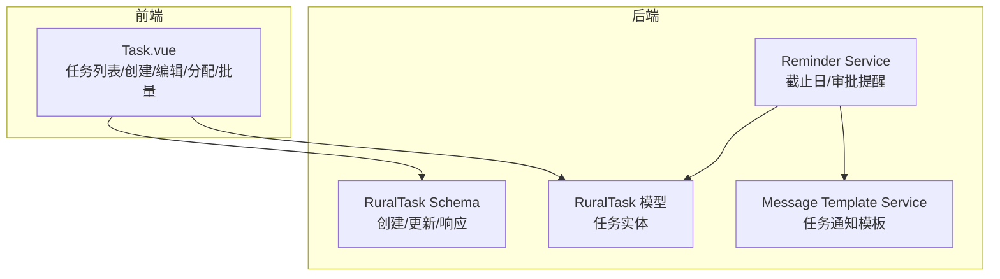
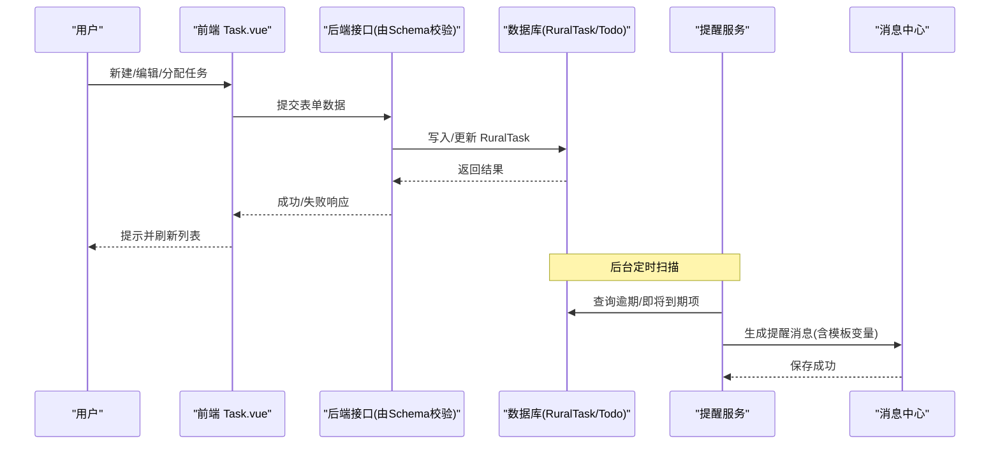
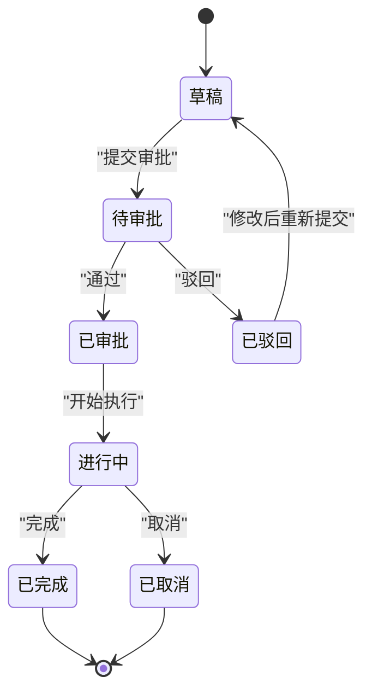
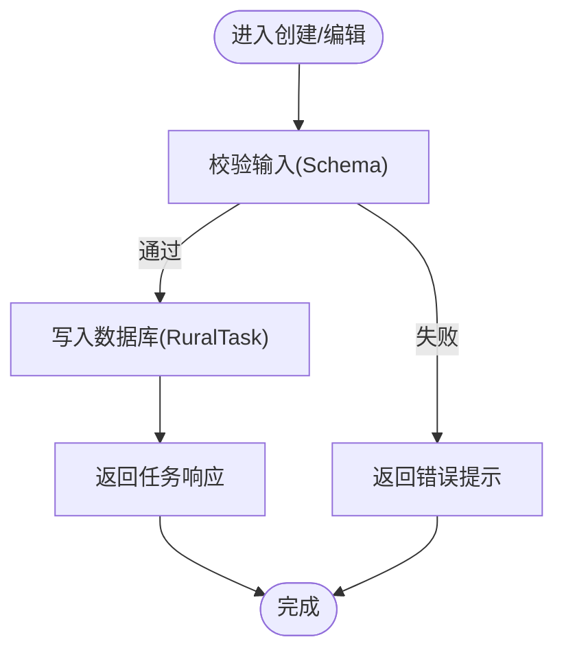
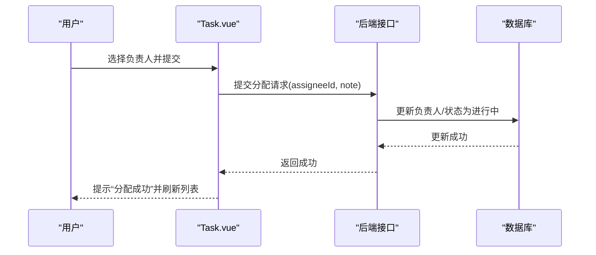
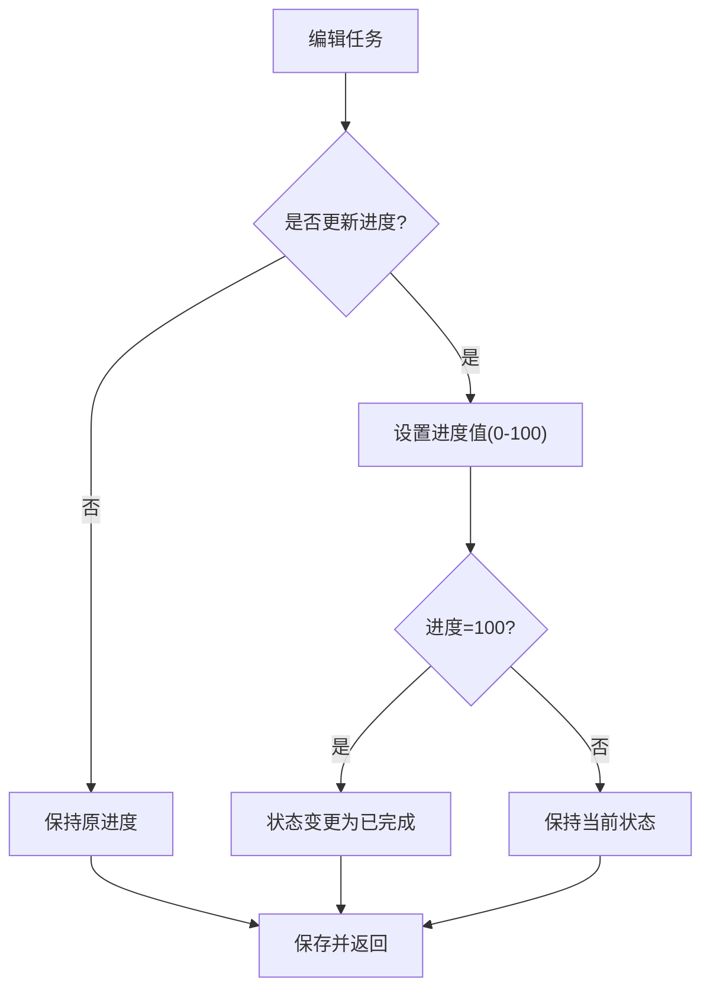
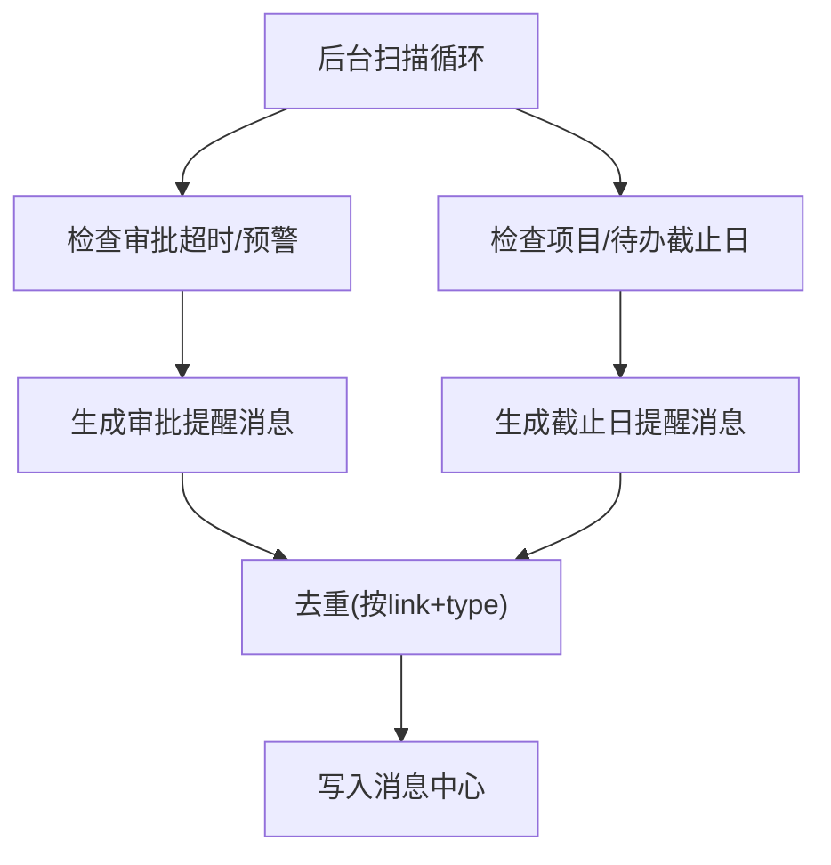
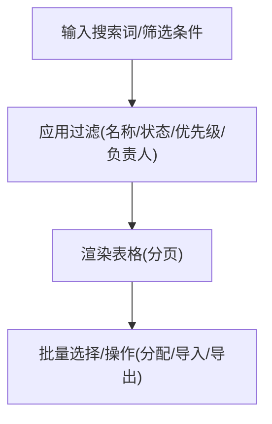
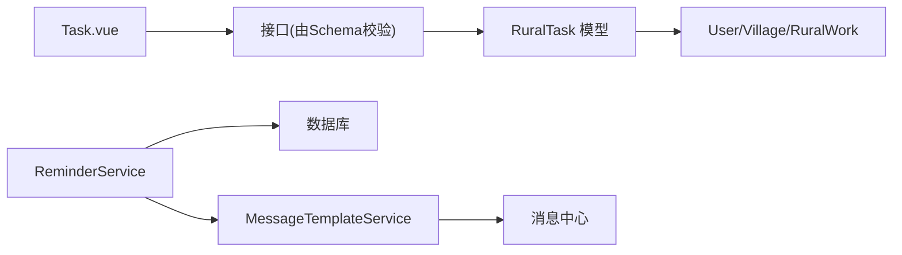

# 工作任务管理

<cite>
**本文引用的文件**
- [backend/app/models/rural_task.py](file://backend/app/models/rural_task.py)
- [backend/app/schemas/rural_task.py](file://backend/app/schemas/rural_task.py)
- [backend/app/models/todo.py](file://backend/app/models/todo.py)
- [backend/app/services/reminder_service.py](file://backend/app/services/reminder_service.py)
- [backend/app/services/message_template_service.py](file://backend/app/services/message_template_service.py)
- [frontend/src/views/ruralWorks/Task.vue](file://frontend/src/views/ruralWorks/Task.vue)
</cite>

## 目录
1. [简介](#简介)
2. [项目结构](#项目结构)
3. [核心组件](#核心组件)
4. [架构总览](#架构总览)
5. [详细组件分析](#详细组件分析)
6. [依赖关系分析](#依赖关系分析)
7. [性能与可用性考虑](#性能与可用性考虑)
8. [故障排查指南](#故障排查指南)
9. [结论](#结论)
10. [附录：操作清单与最佳实践](#附录：操作清单与最佳实践)

## 简介
本指南面向使用“乡村振兴管理系统”中“工作任务管理”功能的用户，覆盖任务创建、编辑、删除、分配、状态跟踪与进度更新、优先级与截止日期管理、提醒机制、搜索筛选与批量操作，以及模板与重复任务的实践建议。文档基于后端数据模型、服务层与前端交互实现进行说明，确保读者既能快速上手，也能理解系统行为背后的逻辑。

## 项目结构
围绕“工作任务管理”，系统在后端提供数据模型与提醒服务，在前端提供完整的任务列表、创建/编辑对话框、分配与批量操作界面。关键文件如下：
- 数据模型：rural_task（任务）、todo（待办）
- 请求/响应校验：rural_task schema
- 提醒与通知：reminder_service、message_template_service
- 前端页面：Task.vue（任务列表、创建/编辑、分配、批量操作、搜索筛选）

图表来源
- [backend/app/models/rural_task.py:1-133](file://backend/app/models/rural_task.py#L1-L133)
- [backend/app/schemas/rural_task.py:1-130](file://backend/app/schemas/rural_task.py#L1-L130)
- [backend/app/services/reminder_service.py:1-321](file://backend/app/services/reminder_service.py#L1-L321)
- [backend/app/services/message_template_service.py:700-848](file://backend/app/services/message_template_service.py#L700-L848)
- [frontend/src/views/ruralWorks/Task.vue:1-200](file://frontend/src/views/ruralWorks/Task.vue#L1-L200)

章节来源
- [backend/app/models/rural_task.py:1-133](file://backend/app/models/rural_task.py#L1-L133)
- [backend/app/schemas/rural_task.py:1-130](file://backend/app/schemas/rural_task.py#L1-L130)
- [backend/app/models/todo.py:1-72](file://backend/app/models/todo.py#L1-L72)
- [backend/app/services/reminder_service.py:1-321](file://backend/app/services/reminder_service.py#L1-L321)
- [backend/app/services/message_template_service.py:700-848](file://backend/app/services/message_template_service.py#L700-L848)
- [frontend/src/views/ruralWorks/Task.vue:1-200](file://frontend/src/views/ruralWorks/Task.vue#L1-L200)

## 核心组件
- 任务数据模型（RuralTask）：定义任务的基本信息、分类、状态、优先级、年度/季度、目标与成果、预算与实际花费、责任人、计划与实际起止时间、审批字段、帮扶村关联、附件、审计字段等，并提供索引优化查询。
- 任务Schema：定义创建、更新、响应、统计、提交与审批请求的数据结构与约束。
- 待办事项（Todo）：个人级待办，支持标题、描述、截止日期、完成状态、优先级、所属用户及时间戳。
- 提醒服务：后台线程定期扫描超时审批、项目/待办截止日，生成消息提醒；支持去重与接收人解析。
- 消息模板：内置任务分配、完成、到期提醒等模板，便于统一通知内容。
- 前端任务页：提供搜索、筛选、分页、新建/编辑、分配、批量分配、导入导出、进度展示、过期标记等操作。

章节来源
- [backend/app/models/rural_task.py:21-133](file://backend/app/models/rural_task.py#L21-L133)
- [backend/app/schemas/rural_task.py:9-130](file://backend/app/schemas/rural_task.py#L9-L130)
- [backend/app/models/todo.py:18-72](file://backend/app/models/todo.py#L18-L72)
- [backend/app/services/reminder_service.py:27-321](file://backend/app/services/reminder_service.py#L27-L321)
- [backend/app/services/message_template_service.py:700-848](file://backend/app/services/message_template_service.py#L700-L848)
- [frontend/src/views/ruralWorks/Task.vue:1-200](file://frontend/src/views/ruralWorks/Task.vue#L1-L200)

## 架构总览
任务管理的端到端流程包括：用户在Task.vue中创建/编辑/分配任务，调用后端接口（由Schema校验），持久化到RuralTask表；后台提醒服务定时扫描待办/项目/审批的截止或超时情况，生成消息并写入消息中心；消息模板保证通知内容一致性与可配置性。

图表来源
- [frontend/src/views/ruralWorks/Task.vue:1016-1065](file://frontend/src/views/ruralWorks/Task.vue#L1016-L1065)
- [backend/app/schemas/rural_task.py:9-130](file://backend/app/schemas/rural_task.py#L9-L130)
- [backend/app/models/rural_task.py:56-133](file://backend/app/models/rural_task.py#L56-L133)
- [backend/app/services/reminder_service.py:64-131](file://backend/app/services/reminder_service.py#L64-L131)
- [backend/app/services/message_template_service.py:700-848](file://backend/app/services/message_template_service.py#L700-L848)

## 详细组件分析

### 任务数据模型与状态机
- 任务分类：基础设施、产业帮扶、教育帮扶、医疗帮扶、环境改善、党建帮扶、消费帮扶、就业帮扶、其他。
- 任务状态：草稿、待审批、已审批、已驳回、进行中、已完成、已取消。
- 优先级：低、中、高、紧急。
- 时间与进度：计划开始/结束、实际开始/结束；进度0-100。
- 审批流：提交人/时间、审批人/时间、审批意见。
- 索引：按工作ID+年度、状态、分类、帮扶村、年度建立索引，提升查询效率。

图表来源
- [backend/app/models/rural_task.py:35-54](file://backend/app/models/rural_task.py#L35-L54)
- [backend/app/models/rural_task.py:75-107](file://backend/app/models/rural_task.py#L75-L107)

章节来源
- [backend/app/models/rural_task.py:21-133](file://backend/app/models/rural_task.py#L21-L133)

### 任务创建与编辑
- 创建：通过RuralTaskCreate Schema校验必填字段（如关联乡村工作ID、标题等），支持分类、优先级、年度/季度、目标、预算、负责人、联系电话、计划起止时间、帮扶村等可选字段。
- 编辑：通过RuralTaskUpdate Schema允许增量更新，包含状态、进度、预算与实际花费、结果、时间字段等。
- 响应：RuralTaskResponse包含基础信息、审批信息、关联名称（如帮扶村名、乡村工作名）、时间戳等。

图表来源
- [backend/app/schemas/rural_task.py:9-91](file://backend/app/schemas/rural_task.py#L9-L91)

章节来源
- [backend/app/schemas/rural_task.py:9-91](file://backend/app/schemas/rural_task.py#L9-L91)

### 任务分配机制
- 单条分配：在Task.vue中打开“分配任务”对话框，选择负责人并填写分配说明；确认后更新任务负责人，并将状态自动设置为“进行中”。
- 批量分配：勾选多个任务后点击“批量分配”，选择同一负责人和说明，一次性分配给多人。
- 人员选择：从员工列表中选择，支持头像与职位显示，便于识别。

图表来源
- [frontend/src/views/ruralWorks/Task.vue:328-376](file://frontend/src/views/ruralWorks/Task.vue#L328-L376)
- [frontend/src/views/ruralWorks/Task.vue:1061-1085](file://frontend/src/views/ruralWorks/Task.vue#L1061-L1085)

章节来源
- [frontend/src/views/ruralWorks/Task.vue:328-376](file://frontend/src/views/ruralWorks/Task.vue#L328-L376)
- [frontend/src/views/ruralWorks/Task.vue:1061-1085](file://frontend/src/views/ruralWorks/Task.vue#L1061-L1085)

### 任务状态跟踪与进度更新
- 状态流转：遵循“草稿→待审批→已审批/已驳回→进行中→已完成/已取消”的状态机。
- 进度更新：通过编辑任务时设置进度（0-100），前端以进度条展示，并在达到100%时标记为完成。
- 过期标记：当截止日期早于当前日期时，前端显示“过期”标签，便于识别逾期任务。

图表来源
- [backend/app/schemas/rural_task.py:29-91](file://backend/app/schemas/rural_task.py#L29-L91)
- [frontend/src/views/ruralWorks/Task.vue:116-143](file://frontend/src/views/ruralWorks/Task.vue#L116-L143)

章节来源
- [backend/app/schemas/rural_task.py:29-91](file://backend/app/schemas/rural_task.py#L29-L91)
- [frontend/src/views/ruralWorks/Task.vue:116-143](file://frontend/src/views/ruralWorks/Task.vue#L116-L143)

### 优先级、截止日期与提醒
- 优先级：支持低、中、高、紧急，前端以不同颜色标签展示，便于快速识别重要任务。
- 截止日期：任务与待办均支持设置截止日期；提醒服务会扫描即将到期或已逾期的项目/待办，生成提醒消息。
- 提醒机制：
  - 审批超时：超过阈值（默认48小时）或接近阈值（默认36小时）未处理时生成提醒。
  - 待办逾期：对未完成且已过截止日期的待办生成提醒。
  - 消息模板：任务分配、完成、到期提醒等模板统一内容格式，支持邮件与站内信。

图表来源
- [backend/app/services/reminder_service.py:64-131](file://backend/app/services/reminder_service.py#L64-L131)
- [backend/app/services/reminder_service.py:201-290](file://backend/app/services/reminder_service.py#L201-L290)
- [backend/app/services/message_template_service.py:700-848](file://backend/app/services/message_template_service.py#L700-L848)

章节来源
- [backend/app/services/reminder_service.py:64-131](file://backend/app/services/reminder_service.py#L64-L131)
- [backend/app/services/reminder_service.py:201-290](file://backend/app/services/reminder_service.py#L201-L290)
- [backend/app/services/message_template_service.py:700-848](file://backend/app/services/message_template_service.py#L700-L848)

### 搜索、筛选与批量操作
- 搜索：支持按任务名称、负责人、所属项目模糊搜索。
- 筛选：支持按状态、优先级、负责人筛选。
- 批量操作：支持批量分配、导入、导出；表格支持多选与分页。
- 分页：支持自定义每页数量与跳转。

图表来源
- [frontend/src/views/ruralWorks/Task.vue:7-68](file://frontend/src/views/ruralWorks/Task.vue#L7-L68)
- [frontend/src/views/ruralWorks/Task.vue:70-190](file://frontend/src/views/ruralWorks/Task.vue#L70-L190)

章节来源
- [frontend/src/views/ruralWorks/Task.vue:7-68](file://frontend/src/views/ruralWorks/Task.vue#L7-L68)
- [frontend/src/views/ruralWorks/Task.vue:70-190](file://frontend/src/views/ruralWorks/Task.vue#L70-L190)

### 任务模板与重复任务最佳实践
- 模板建议：
  - 使用“乡村工作”作为任务容器，将同类任务归类到同一工作下，便于统计与报告。
  - 利用分类与优先级组合，形成标准化模板（例如“基础设施-高-季度X”）。
  - 在描述与目标字段中固化模板内容，减少重复录入。
- 重复任务建议：
  - 借助“年度/季度”字段区分周期，结合提醒服务设定截止日期，周期性创建新任务。
  - 使用消息模板中的“任务提醒”模板，提前触发提醒，避免遗漏。
  - 对于固定周期的常规任务，可在服务层扩展调度器（参考现有备份/周报调度模式）实现自动化创建。

章节来源
- [backend/app/models/rural_task.py:81-83](file://backend/app/models/rural_task.py#L81-L83)
- [backend/app/services/message_template_service.py:700-848](file://backend/app/services/message_template_service.py#L700-L848)

## 依赖关系分析
- 前端Task.vue依赖后端接口进行CRUD与分配操作，并通过本地回退策略保障网络不可用时的基本体验。
- 后端RuralTask模型依赖User、Village、RuralWork等实体，形成任务与工作、村庄、人员的关联。
- ReminderService依赖数据库会话与消息中心，定期扫描并生成提醒，具备幂等去重能力。
- MessageTemplateService提供统一的通知模板，确保跨渠道（站内信/邮件）内容一致性。

图表来源
- [frontend/src/views/ruralWorks/Task.vue:1016-1065](file://frontend/src/views/ruralWorks/Task.vue#L1016-L1065)
- [backend/app/models/rural_task.py:118-124](file://backend/app/models/rural_task.py#L118-L124)
- [backend/app/services/reminder_service.py:84-131](file://backend/app/services/reminder_service.py#L84-L131)
- [backend/app/services/message_template_service.py:700-848](file://backend/app/services/message_template_service.py#L700-L848)

章节来源
- [backend/app/models/rural_task.py:118-124](file://backend/app/models/rural_task.py#L118-L124)
- [backend/app/services/reminder_service.py:84-131](file://backend/app/services/reminder_service.py#L84-L131)
- [backend/app/services/message_template_service.py:700-848](file://backend/app/services/message_template_service.py#L700-L848)

## 性能与可用性考虑
- 查询优化：RuralTask针对状态、分类、年度、帮扶村建立索引，提升列表与筛选性能。
- 分页与限流：前端支持分页与每页大小调整，避免一次性加载过多数据。
- 提醒服务：后台线程定期检查，具备异常捕获与日志记录，避免阻塞主流程。
- 幂等与去重：提醒消息按link+type去重，防止重复通知。
- 容错：前端在网络不可用时采用本地回退，保证基本可用。

章节来源
- [backend/app/models/rural_task.py:126-132](file://backend/app/models/rural_task.py#L126-L132)
- [frontend/src/views/ruralWorks/Task.vue:1016-1065](file://frontend/src/views/ruralWorks/Task.vue#L1016-L1065)
- [backend/app/services/reminder_service.py:64-82](file://backend/app/services/reminder_service.py#L64-L82)

## 故障排查指南
- 任务无法创建/更新：
  - 检查Schema校验是否通过（必填字段、范围限制）。
  - 查看后端日志与数据库写入是否成功。
- 分配失败：
  - 确认负责人选择有效，状态是否被正确更新为“进行中”。
  - 检查前端回退逻辑是否生效。
- 提醒未生成：
  - 确认提醒服务是否启动，检查扫描间隔与阈值配置。
  - 查看消息中心是否存在重复去重导致未新增。
- 搜索/筛选无结果：
  - 检查筛选条件是否正确传递，确认数据权限隔离是否影响可见性。

章节来源
- [backend/app/schemas/rural_task.py:9-91](file://backend/app/schemas/rural_task.py#L9-L91)
- [frontend/src/views/ruralWorks/Task.vue:1016-1065](file://frontend/src/views/ruralWorks/Task.vue#L1016-L1065)
- [backend/app/services/reminder_service.py:64-131](file://backend/app/services/reminder_service.py#L64-L131)

## 结论
本系统提供了完整的工作任务管理能力，涵盖创建、编辑、删除、分配、状态与进度跟踪、优先级与截止日期管理、提醒机制、搜索筛选与批量操作。通过清晰的数据模型、严格的Schema校验、后台提醒服务与统一的消息模板，确保了任务管理的规范性与可追踪性。建议在实际使用中结合年度/季度与分类/优先级构建模板，并利用提醒服务与消息模板提升团队协作效率。

## 附录：操作清单与最佳实践
- 创建任务
  - 填写必填字段（关联乡村工作、标题），按需设置分类、优先级、年度/季度、目标、预算、负责人、联系电话、计划起止时间、帮扶村。
  - 提交后等待审批（如需），状态流转至“待审批”。
- 编辑任务
  - 更新进度、状态、预算与实际花费、结果、时间字段等。
  - 注意进度范围0-100，达到100%时自动完成。
- 删除任务
  - 在任务列表中选择任务，执行删除操作；注意权限与数据隔离。
- 分配任务
  - 单条分配：选择负责人并填写说明，确认后状态变为“进行中”。
  - 批量分配：勾选多个任务，统一分配给同一负责人。
- 状态跟踪与进度更新
  - 根据实际执行情况更新进度与状态，关注截止日期与“过期”标记。
- 优先级与截止日期管理
  - 合理设置优先级与截止日期，配合提醒服务及时获知逾期风险。
- 搜索、筛选与批量操作
  - 使用搜索框与筛选条件快速定位任务；支持批量分配、导入、导出。
- 模板与重复任务
  - 使用分类与优先级组合形成模板；借助年度/季度与提醒服务实现周期性任务管理。

章节来源
- [backend/app/models/rural_task.py:56-133](file://backend/app/models/rural_task.py#L56-L133)
- [backend/app/schemas/rural_task.py:9-130](file://backend/app/schemas/rural_task.py#L9-L130)
- [frontend/src/views/ruralWorks/Task.vue:1-200](file://frontend/src/views/ruralWorks/Task.vue#L1-L200)
- [backend/app/services/reminder_service.py:64-131](file://backend/app/services/reminder_service.py#L64-L131)
- [backend/app/services/message_template_service.py:700-848](file://backend/app/services/message_template_service.py#L700-L848)