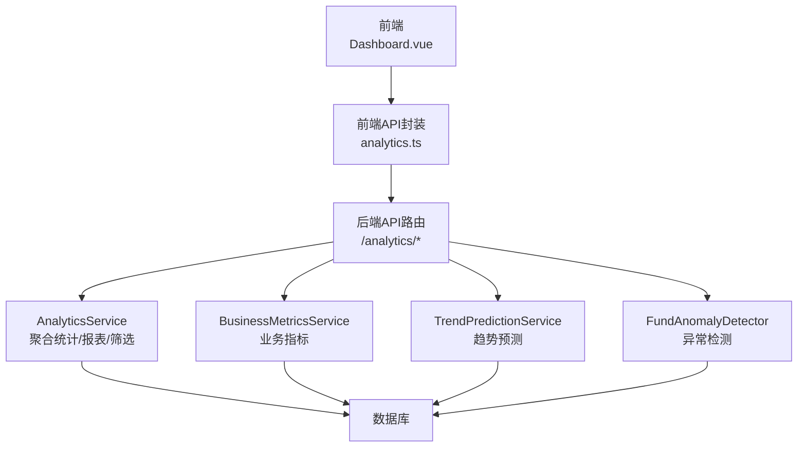
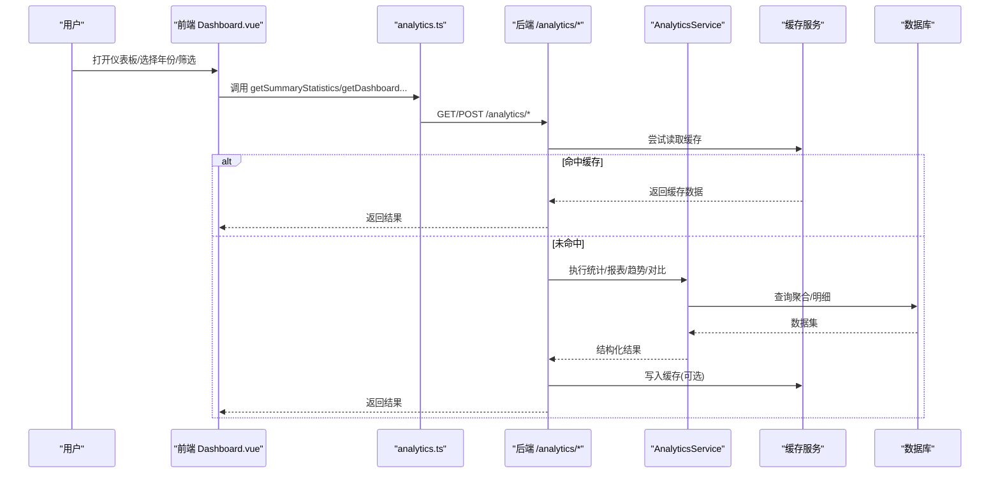
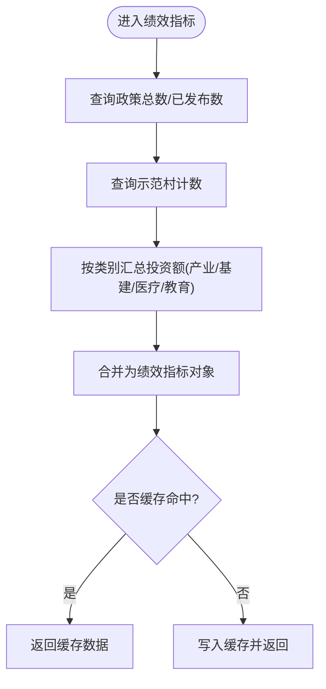
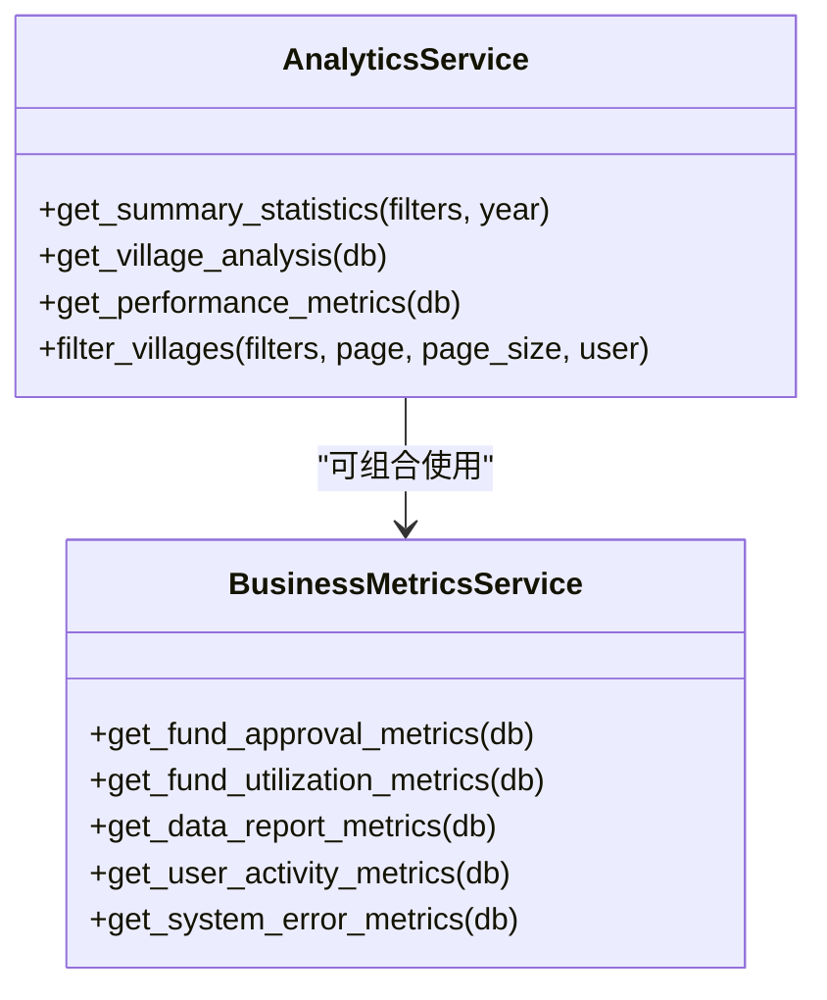
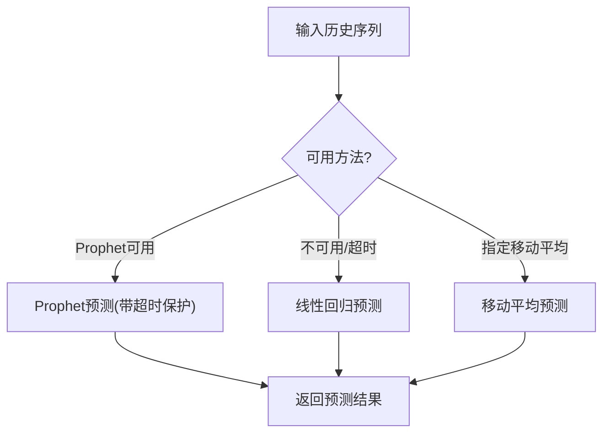
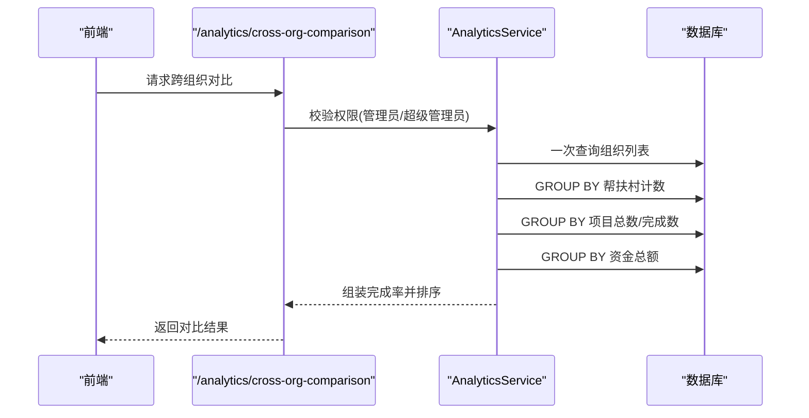
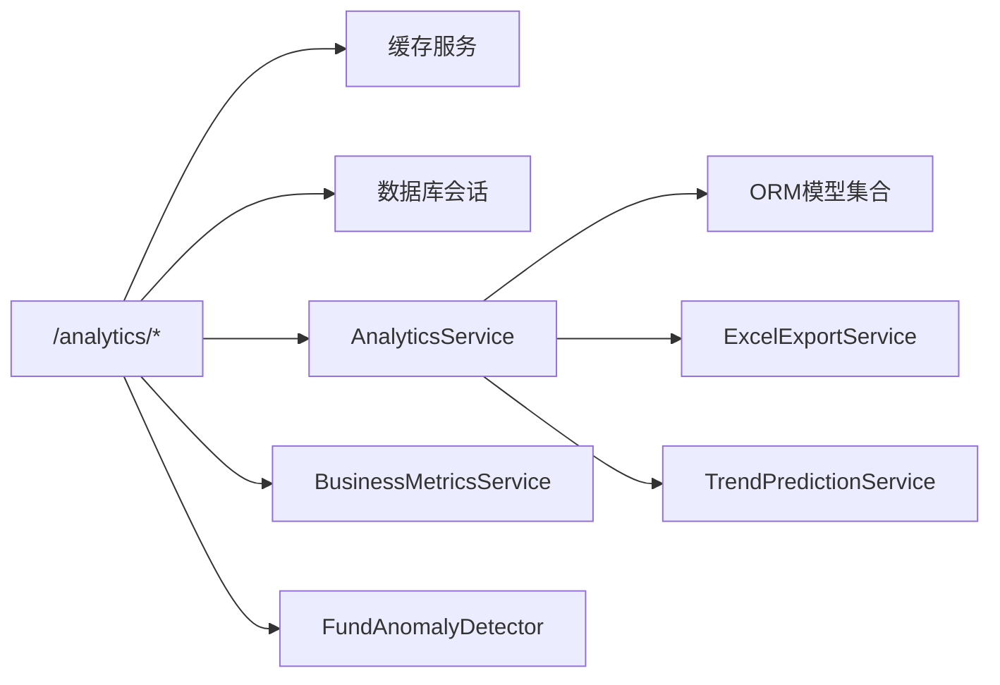
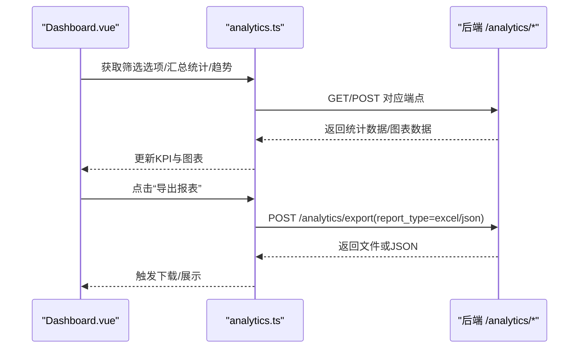
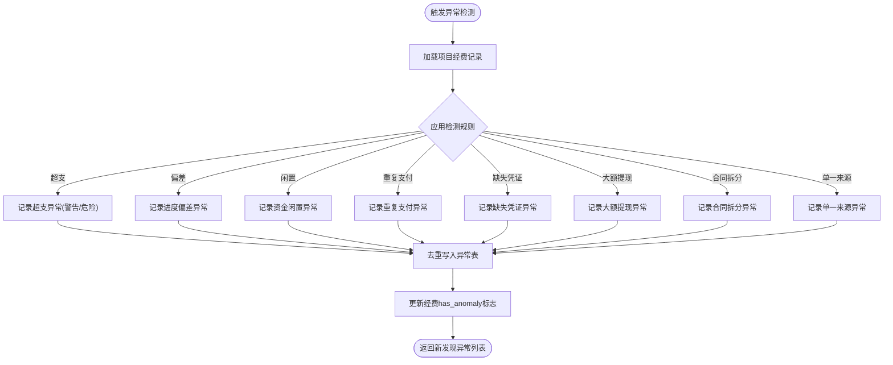
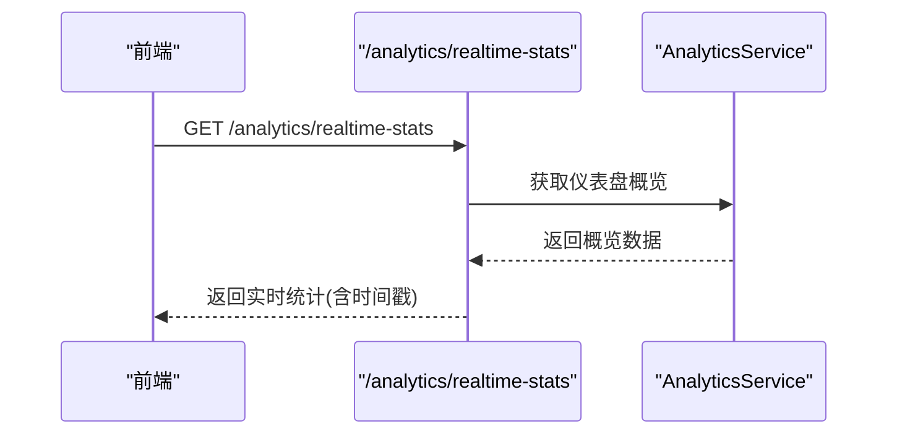

# 工作分析与统计

<cite>
**本文引用的文件**
- [backend/app/services/analytics_service.py](file://backend/app/services/analytics_service.py)
- [backend/app/api/v1/data/data/analytics.py](file://backend/app/api/v1/data/data/analytics.py)
- [frontend/src/api/analytics.ts](file://frontend/src/api/analytics.ts)
- [frontend/src/views/analytics/dashboard/Dashboard.vue](file://frontend/src/views/analytics/dashboard/Dashboard.vue)
- [backend/app/services/business_metrics_service.py](file://backend/app/services/business_metrics_service.py)
- [backend/app/services/ai/trend_prediction_service.py](file://backend/app/services/ai/trend_prediction_service.py)
- [backend/app/services/fund_anomaly_detector.py](file://backend/app/services/fund_anomaly_detector.py)
</cite>

## 目录
1. [简介](#简介)
2. [项目结构](#项目结构)
3. [核心组件](#核心组件)
4. [架构总览](#架构总览)
5. [详细组件分析](#详细组件分析)
6. [依赖关系分析](#依赖关系分析)
7. [性能与缓存](#性能与缓存)
8. [可视化与报表](#可视化与报表)
9. [数据导出、对比与异常检测](#数据导出对比与异常检测)
10. [实时与历史数据查询](#实时与历史数据查询)
11. [故障排查](#故障排查)
12. [结论](#结论)

## 简介
本指南面向“工作分析与统计”功能，覆盖绩效指标计算与展示、工作量统计与效率分析、趋势预测、多维度数据分析（时间/区域/项目等）、可视化图表定制与报表生成、数据导出、对比分析、异常检测、实时更新与历史查询等。文档以代码为依据，提供端到端操作说明与实现要点，帮助使用者与开发者快速掌握系统能力。

## 项目结构
后端提供数据分析服务与API路由，前端提供仪表板与交互。关键路径：
- 后端服务层：analytics_service.py、business_metrics_service.py、trend_prediction_service.py、fund_anomaly_detector.py
- 后端API层：analytics.py（/analytics/*）
- 前端API封装：analytics.ts
- 前端页面：Dashboard.vue（数据分析仪表板）

**图示来源**
- [backend/app/api/v1/data/data/analytics.py:84-280](file://backend/app/api/v1/data/data/analytics.py#L84-L280)
- [backend/app/services/analytics_service.py:22-703](file://backend/app/services/analytics_service.py#L22-L703)
- [backend/app/services/business_metrics_service.py:22-376](file://backend/app/services/business_metrics_service.py#L22-L376)
- [backend/app/services/ai/trend_prediction_service.py:30-90](file://backend/app/services/ai/trend_prediction_service.py#L30-L90)
- [backend/app/services/fund_anomaly_detector.py:34-93](file://backend/app/services/fund_anomaly_detector.py#L34-L93)

**章节来源**
- [backend/app/api/v1/data/data/analytics.py:1-364](file://backend/app/api/v1/data/data/analytics.py#L1-L364)
- [frontend/src/views/analytics/dashboard/Dashboard.vue:1-200](file://frontend/src/views/analytics/dashboard/Dashboard.vue#L1-L200)

## 核心组件
- AnalyticsService：仪表盘总览、帮扶村分析、资金趋势、绩效指标、对比分析、汇总统计、筛选与分页、报表生成与导出。
- BusinessMetricsService：资金审批、资金使用、数据上报、用户活跃度、系统错误率等业务指标，支持Prometheus格式导出。
- TrendPredictionService：时间序列预测（Prophet/线性回归/移动平均），带超时保护与回退策略。
- FundAnomalyDetector：经费超支、进度偏差、闲置、重复支付、缺失凭证、大额提现、合同拆分、单一来源等规则检测。
- 前端API封装与仪表板：统一调用后端接口，渲染KPI卡片、图表、筛选器、导出按钮等。

**章节来源**
- [backend/app/services/analytics_service.py:22-703](file://backend/app/services/analytics_service.py#L22-L703)
- [backend/app/services/business_metrics_service.py:22-376](file://backend/app/services/business_metrics_service.py#L22-L376)
- [backend/app/services/ai/trend_prediction_service.py:30-90](file://backend/app/services/ai/trend_prediction_service.py#L30-L90)
- [backend/app/services/fund_anomaly_detector.py:34-93](file://backend/app/services/fund_anomaly_detector.py#L34-L93)
- [frontend/src/api/analytics.ts:1-205](file://frontend/src/api/analytics.ts#L1-L205)

## 架构总览
请求从前端发起，经API封装到后端路由，路由层进行鉴权、缓存命中判断后调用服务层完成计算或查询，最终返回结构化响应。部分接口使用Redis缓存降低DB压力；报表导出通过Excel服务输出二进制流。

**图示来源**
- [backend/app/api/v1/data/data/analytics.py:30-45](file://backend/app/api/v1/data/data/analytics.py#L30-L45)
- [backend/app/api/v1/data/data/analytics.py:84-280](file://backend/app/api/v1/data/data/analytics.py#L84-L280)
- [backend/app/services/analytics_service.py:28-703](file://backend/app/services/analytics_service.py#L28-L703)

## 详细组件分析

### 绩效指标计算与展示
- 指标范围：政策发布数、示范村数量、产业/基建/医疗/教育投资分类汇总等。
- 计算逻辑：按最新年度聚合各表投资额，结合政策与村庄状态过滤软删数据。
- 展示方式：前端仪表板KPI卡片与饼图/柱状图组合呈现。

**图示来源**
- [backend/app/services/analytics_service.py:220-290](file://backend/app/services/analytics_service.py#L220-L290)
- [backend/app/api/v1/data/data/analytics.py:137-151](file://backend/app/api/v1/data/data/analytics.py#L137-L151)
- [frontend/src/views/analytics/dashboard/Dashboard.vue:64-178](file://frontend/src/views/analytics/dashboard/Dashboard.vue#L64-L178)

**章节来源**
- [backend/app/services/analytics_service.py:220-290](file://backend/app/services/analytics_service.py#L220-L290)
- [backend/app/api/v1/data/data/analytics.py:137-151](file://backend/app/api/v1/data/data/analytics.py#L137-L151)
- [frontend/src/views/analytics/dashboard/Dashboard.vue:64-178](file://frontend/src/views/analytics/dashboard/Dashboard.vue#L64-L178)

### 工作量统计与效率分析
- 工作量维度：帮扶村数量、人口覆盖、收入水平、基础设施投入、教育资助人数等。
- 效率维度：项目完成率、资金拨付率、审批成功率、数据上报及时率等。
- 数据来源：聚合查询与跨表关联，支持按部门、地区属性、梯队等筛选。

**图示来源**
- [backend/app/services/analytics_service.py:399-683](file://backend/app/services/analytics_service.py#L399-L683)
- [backend/app/services/business_metrics_service.py:42-310](file://backend/app/services/business_metrics_service.py#L42-L310)

**章节来源**
- [backend/app/services/analytics_service.py:399-683](file://backend/app/services/analytics_service.py#L399-L683)
- [backend/app/services/business_metrics_service.py:42-310](file://backend/app/services/business_metrics_service.py#L42-L310)

### 趋势预测功能
- 方法：Prophet（优先）、线性回归、移动平均；Windows环境对Prophet初始化设置超时保护，失败自动回退。
- 输入：历史时间序列（日期+数值），预测周期数。
- 输出：预测值、置信区间、方法名、错误信息（如有）。

**图示来源**
- [backend/app/services/ai/trend_prediction_service.py:30-90](file://backend/app/services/ai/trend_prediction_service.py#L30-L90)

**章节来源**
- [backend/app/services/ai/trend_prediction_service.py:30-90](file://backend/app/services/ai/trend_prediction_service.py#L30-L90)

### 多维度数据分析（时间/区域/项目）
- 时间：按年聚合资金趋势、收入/人口最新年度统计。
- 区域：按省份、振兴梯队、部门、地区属性（三区三州/重点县等）分组统计。
- 项目：跨组织对比（仅管理员），按组织聚合帮扶村数、项目数、资金总额、完成率。

**图示来源**
- [backend/app/api/v1/data/data/analytics.py:283-363](file://backend/app/api/v1/data/data/analytics.py#L283-L363)

**章节来源**
- [backend/app/api/v1/data/data/analytics.py:283-363](file://backend/app/api/v1/data/data/analytics.py#L283-L363)

## 依赖关系分析
- 路由层依赖：缓存服务、数据库会话、当前用户、AnalyticsService。
- 服务层依赖：ORM模型（村庄、人口、收入、产业、基建、教育、项目、资金、审批、监控等）。
- 外部依赖：Prophet（可选）、NumPy/Pandas（趋势预测）、Excel导出服务。

**图示来源**
- [backend/app/api/v1/data/data/analytics.py:15-20](file://backend/app/api/v1/data/data/analytics.py#L15-L20)
- [backend/app/services/analytics_service.py:8-19](file://backend/app/services/analytics_service.py#L8-L19)
- [backend/app/services/analytics_service.py:685-702](file://backend/app/services/analytics_service.py#L685-L702)

**章节来源**
- [backend/app/api/v1/data/data/analytics.py:1-364](file://backend/app/api/v1/data/data/analytics.py#L1-L364)
- [backend/app/services/analytics_service.py:1-703](file://backend/app/services/analytics_service.py#L1-L703)

## 性能与缓存
- 分析数据缓存：按用户ID或参数键前缀缓存，TTL约5分钟，减少重复计算。
- KPI汇总：独立计算函数，供端点与定时任务共用，避免口径漂移。
- 批量聚合：尽量使用GROUP BY与条件聚合，降低N次COUNT/SUM的开销。
- 趋势预测：Prophet初始化超时保护，失败自动回退线性回归，保障可用性。

**章节来源**
- [backend/app/api/v1/data/data/analytics.py:24-45](file://backend/app/api/v1/data/data/analytics.py#L24-L45)
- [backend/app/api/v1/data/data/analytics.py:226-274](file://backend/app/api/v1/data/data/analytics.py#L226-L274)
- [backend/app/services/ai/trend_prediction_service.py:16-27](file://backend/app/services/ai/trend_prediction_service.py#L16-L27)

## 可视化与报表
- 仪表板：KPI卡片（帮扶村总数、覆盖人口、人均收入、帮扶投入）、地域分布图、投入构成图、年度趋势对比图。
- 筛选器：年份、部门、地域属性（三区三州/边疆/民族/革命/重点县）联动刷新。
- 报表生成：综合报表、村庄资金趋势、政策执行报表；支持JSON与Excel导出。
- 前端调用：analytics.ts封装所有分析接口，Dashboard.vue负责渲染与交互。

**图示来源**
- [frontend/src/views/analytics/dashboard/Dashboard.vue:1-200](file://frontend/src/views/analytics/dashboard/Dashboard.vue#L1-L200)
- [frontend/src/api/analytics.ts:144-204](file://frontend/src/api/analytics.ts#L144-L204)
- [backend/app/api/v1/data/data/analytics.py:167-202](file://backend/app/api/v1/data/data/analytics.py#L167-L202)

**章节来源**
- [frontend/src/views/analytics/dashboard/Dashboard.vue:1-200](file://frontend/src/views/analytics/dashboard/Dashboard.vue#L1-L200)
- [frontend/src/api/analytics.ts:144-204](file://frontend/src/api/analytics.ts#L144-L204)
- [backend/app/api/v1/data/data/analytics.py:167-202](file://backend/app/api/v1/data/data/analytics.py#L167-L202)

## 数据导出、对比与异常检测
- 数据导出：支持JSON与Excel导出；Excel包含基本统计摘要（帮扶村总数、组织机构数、政策文件数等）。
- 对比分析：按省份/梯队对比村数、总投资、平均收入；跨组织对比（管理员）聚合村数、项目数、资金总额、完成率。
- 异常检测：经费超支、进度偏差、闲置、重复支付、缺失凭证、大额提现、合同拆分、单一来源；支持触发检测与处理标记。

**图示来源**
- [backend/app/services/fund_anomaly_detector.py:34-93](file://backend/app/services/fund_anomaly_detector.py#L34-L93)
- [backend/app/services/fund_anomaly_detector.py:99-315](file://backend/app/services/fund_anomaly_detector.py#L99-L315)

**章节来源**
- [backend/app/api/v1/data/data/analytics.py:180-202](file://backend/app/api/v1/data/data/analytics.py#L180-L202)
- [backend/app/services/analytics_service.py:685-702](file://backend/app/services/analytics_service.py#L685-L702)
- [backend/app/services/fund_anomaly_detector.py:34-93](file://backend/app/services/fund_anomaly_detector.py#L34-L93)

## 实时与历史数据查询
- 实时统计：/analytics/realtime-stats 返回概览与最近活动，适合轮询刷新。
- 历史查询：汇总统计支持按年、部门、地区属性筛选；资金趋势支持近N年；对比分析支持按省份/梯队。
- 健康检查：/analytics/health 用于服务可用性探测。

**图示来源**
- [backend/app/api/v1/data/data/analytics.py:205-223](file://backend/app/api/v1/data/data/analytics.py#L205-L223)
- [backend/app/api/v1/data/data/analytics.py:277-280](file://backend/app/api/v1/data/data/analytics.py#L277-L280)

**章节来源**
- [backend/app/api/v1/data/data/analytics.py:205-223](file://backend/app/api/v1/data/data/analytics.py#L205-L223)
- [backend/app/api/v1/data/data/analytics.py:277-280](file://backend/app/api/v1/data/data/analytics.py#L277-L280)

## 故障排查
- 缓存读取失败：日志记录警告，降级直接查库。
- 趋势预测超时：Prophet初始化或运行超时，自动回退线性回归。
- 数据库异常：服务层捕获异常并返回空结构或默认值，保证接口稳定。
- 权限限制：跨组织对比仅管理员/超级管理员可用，非授权角色返回提示。

**章节来源**
- [backend/app/api/v1/data/data/analytics.py:30-45](file://backend/app/api/v1/data/data/analytics.py#L30-L45)
- [backend/app/services/ai/trend_prediction_service.py:62-90](file://backend/app/services/ai/trend_prediction_service.py#L62-L90)
- [backend/app/services/analytics_service.py:78-84](file://backend/app/services/analytics_service.py#L78-L84)
- [backend/app/api/v1/data/data/analytics.py:283-296](file://backend/app/api/v1/data/data/analytics.py#L283-L296)

## 结论
本系统围绕“工作分析与统计”构建了完整的数据采集、计算、可视化与导出闭环。通过多服务协作与缓存机制，兼顾性能与稳定性；趋势预测与异常检测增强了对未来走势与风险点的洞察能力。建议在生产环境中：
- 合理配置缓存TTL与刷新策略，平衡实时性与负载。
- 定期评估趋势预测方法与阈值，确保与实际业务一致。
- 将异常检测结果纳入工单或预警流程，形成闭环管理。
- 在前端增加更多自定义筛选与图表配置，提升分析灵活性。