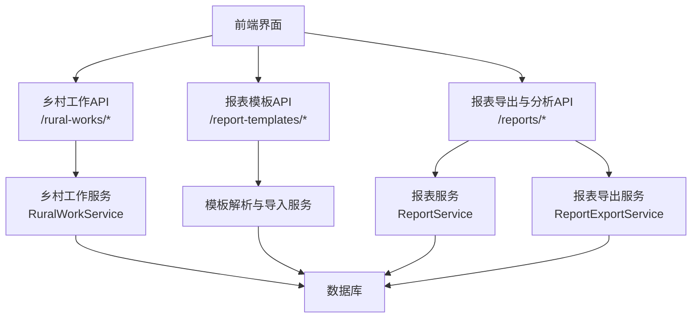
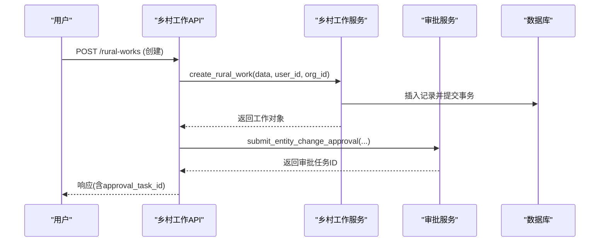
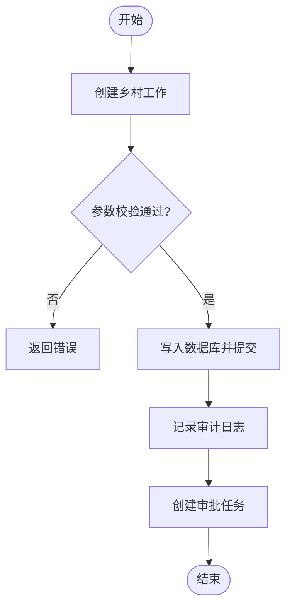
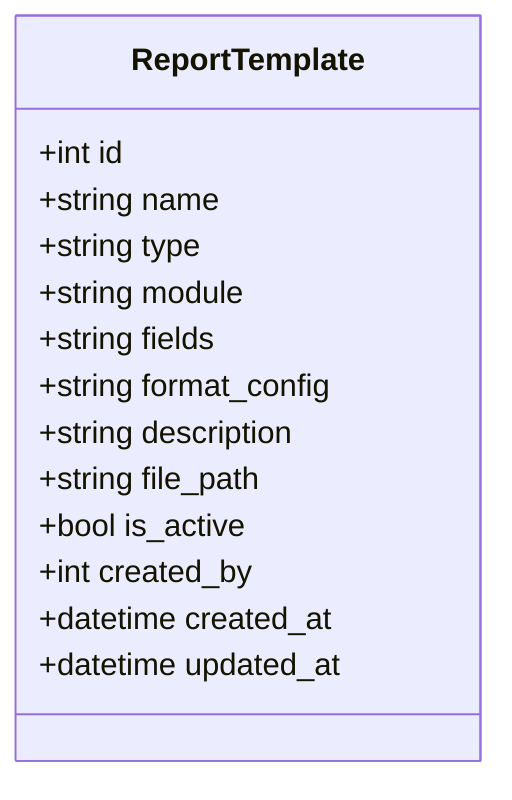
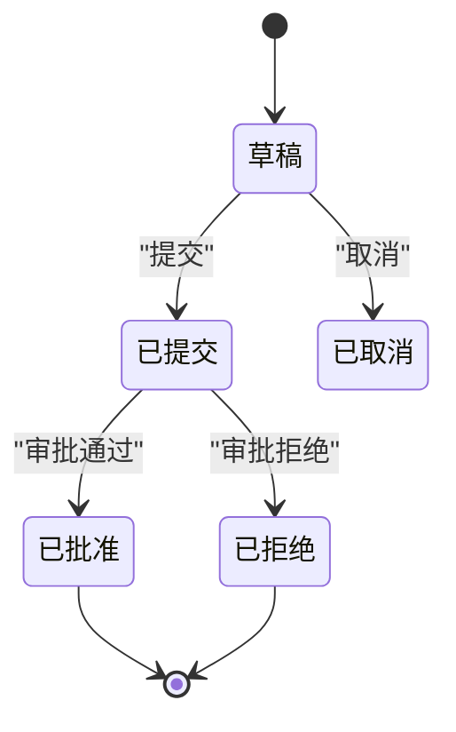
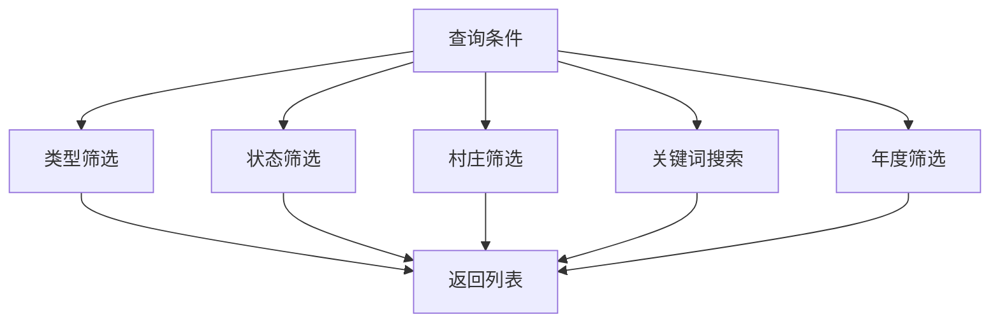
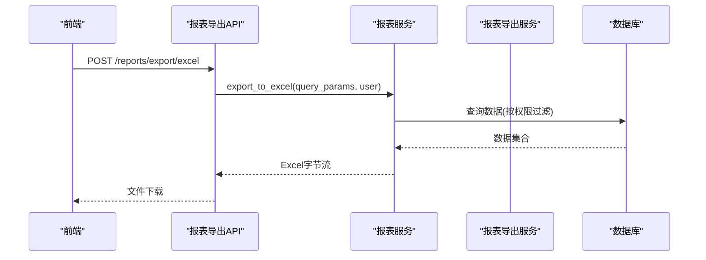
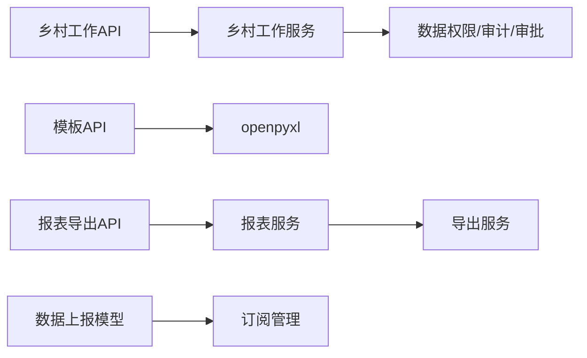

# 工作报告管理

<cite>
**本文引用的文件**
- [backend/app/models/rural_work.py](file://backend/app/models/rural_work.py)
- [backend/app/schemas/rural_work.py](file://backend/app/schemas/rural_work.py)
- [backend/app/services/rural_work_service.py](file://backend/app/services/rural_work_service.py)
- [backend/app/api/v1/rural_works.py](file://backend/app/api/v1/rural_works.py)
- [backend/app/models/report_template.py](file://backend/app/models/report_template.py)
- [backend/app/api/v1/report_templates.py](file://backend/app/api/v1/report_templates.py)
- [backend/app/models/data_report.py](file://backend/app/models/data_report.py)
- [backend/app/services/report_service.py](file://backend/app/services/report_service.py)
- [backend/app/services/report_export_service.py](file://backend/app/services/report_export_service.py)
- [backend/app/api/v1/data/data/reports.py](file://backend/app/api/v1/data/data/reports.py)
</cite>

## 目录
1. [简介](#简介)
2. [项目结构](#项目结构)
3. [核心组件](#核心组件)
4. [架构总览](#架构总览)
5. [详细组件分析](#详细组件分析)
6. [依赖关系分析](#依赖关系分析)
7. [性能考虑](#性能考虑)
8. [故障排查指南](#故障排查指南)
9. [结论](#结论)
10. [附录](#附录)

## 简介
本操作指南面向“工作报告管理”功能，覆盖报告的创建、编辑、提交与审批流转；模板使用与自定义格式；审核、修改与版本留痕；分类、标签与归档；分享、协作与评论；统计分析、可视化图表生成与导出。文档以系统现有后端能力为依据，提供端到端流程说明与关键接口路径指引，帮助业务人员与实施人员快速上手。

## 项目结构
围绕工作报告管理，系统采用分层架构：
- 模型层：定义乡村工作、数据上报、报表模板等实体及状态。
- 服务层：封装业务逻辑（统计、报告汇总、导出、订阅等）。
- API 层：暴露 RESTful 接口，承载前端交互。
- 导出与渲染：支持 Excel/PDF/Word 等多格式输出，并内置中文字体与表格样式。

**图示来源**
- [backend/app/api/v1/rural_works.py:57-125](file://backend/app/api/v1/rural_works.py#L57-L125)
- [backend/app/api/v1/report_templates.py:298-502](file://backend/app/api/v1/report_templates.py#L298-L502)
- [backend/app/api/v1/data/data/reports.py:54-155](file://backend/app/api/v1/data/data/reports.py#L54-L155)
- [backend/app/services/rural_work_service.py:162-488](file://backend/app/services/rural_work_service.py#L162-L488)
- [backend/app/services/report_service.py:27-165](file://backend/app/services/report_service.py#L27-L165)
- [backend/app/services/report_export_service.py:55-443](file://backend/app/services/report_export_service.py#L55-L443)

**章节来源**
- [backend/app/api/v1/rural_works.py:57-125](file://backend/app/api/v1/rural_works.py#L57-L125)
- [backend/app/api/v1/report_templates.py:298-502](file://backend/app/api/v1/report_templates.py#L298-L502)
- [backend/app/api/v1/data/data/reports.py:54-155](file://backend/app/api/v1/data/data/reports.py#L54-L155)

## 核心组件
- 乡村工作模型与Schema：定义工作类型、状态、时间字段、进度、组织隔离等。
- 乡村工作服务：列表查询、筛选、统计、报告汇总、年份枚举、批量删除、数据权限控制。
- 报表模板：模板CRUD、字段映射、Excel模板下载与导入解析。
- 数据上报模型：上报生命周期（草稿/已提交/已批准/已拒绝/已取消）、提交与审批信息、截止时间。
- 报表服务：Excel/PDF导出、综合报表、订阅管理。
- 报表导出服务：Word/PDF公文报告生成，统一数据结构渲染。

**章节来源**
- [backend/app/models/rural_work.py:18-76](file://backend/app/models/rural_work.py#L18-L76)
- [backend/app/schemas/rural_work.py:50-130](file://backend/app/schemas/rural_work.py#L50-L130)
- [backend/app/services/rural_work_service.py:124-520](file://backend/app/services/rural_work_service.py#L124-L520)
- [backend/app/models/report_template.py:26-73](file://backend/app/models/report_template.py#L26-L73)
- [backend/app/models/data_report.py:19-141](file://backend/app/models/data_report.py#L19-L141)
- [backend/app/services/report_service.py:18-357](file://backend/app/services/report_service.py#L18-L357)
- [backend/app/services/report_export_service.py:46-448](file://backend/app/services/report_export_service.py#L46-L448)

## 架构总览
工作报告管理的关键调用链如下：
- 创建/更新/删除乡村工作：API路由校验参数→服务层执行→写入审计日志→自动触发审批任务。
- 模板管理与导入：模板CRUD→下载模板→上传Excel→按字段映射导入目标表。
- 报表导出与分析：导出Excel/PDF→综合报表→订阅管理→数据分析与钻取。

**图示来源**
- [backend/app/api/v1/rural_works.py:150-175](file://backend/app/api/v1/rural_works.py#L150-L175)
- [backend/app/services/rural_work_service.py:260-309](file://backend/app/services/rural_work_service.py#L260-L309)

**章节来源**
- [backend/app/api/v1/rural_works.py:150-202](file://backend/app/api/v1/rural_works.py#L150-L202)
- [backend/app/services/rural_work_service.py:260-368](file://backend/app/services/rural_work_service.py#L260-L368)

## 详细组件分析

### 工作报告的创建、编辑与提交流程
- 创建：通过乡村工作API创建，服务层生成唯一编码、写入创建人/组织、提交事务并记录审计日志；随后自动创建审批任务，进入待审批板块。
- 编辑：更新时读取旧值，变更同样触发审批任务，便于对比与留痕。
- 删除/批量删除：删除前获取旧值，记录审计日志，批量删除后生成审批任务用于审计留痕。
- 数据权限：列表与单条访问均受数据权限过滤（管理员全量、部门范围含下级、仅本人）。

**图示来源**
- [backend/app/api/v1/rural_works.py:150-175](file://backend/app/api/v1/rural_works.py#L150-L175)
- [backend/app/services/rural_work_service.py:260-309](file://backend/app/services/rural_work_service.py#L260-L309)

**章节来源**
- [backend/app/api/v1/rural_works.py:150-227](file://backend/app/api/v1/rural_works.py#L150-L227)
- [backend/app/services/rural_work_service.py:162-368](file://backend/app/services/rural_work_service.py#L162-L368)

### 报告模板的使用与自定义报告格式设置
- 模板CRUD：支持创建、更新、删除、查询模板，限制模板类型与模块白名单。
- 字段映射：模板包含Excel列头与数据库字段的映射配置，支持必填标注。
- 模板下载：根据模板字段动态生成Excel模板，带标题行与必填提示。
- 导入解析：上传Excel后按字段映射解析，支持增量与覆盖模式，失败行记录错误。

**图示来源**
- [backend/app/models/report_template.py:44-73](file://backend/app/models/report_template.py#L44-L73)

**章节来源**
- [backend/app/api/v1/report_templates.py:298-502](file://backend/app/api/v1/report_templates.py#L298-L502)
- [backend/app/models/report_template.py:26-73](file://backend/app/models/report_template.py#L26-L73)

### 报告的审核、修改与版本管理
- 审核：乡村工作的新增/修改/删除均自动创建审批任务，进入待审批板块；审批终态可回写处理器（当前为预留扩展点）。
- 修改：更新接口会保留旧值作为original_data，便于审批对比。
- 版本管理：通过审计日志与工作日志记录变更详情；数据上报模型具备明确的状态机（草稿/已提交/已批准/已拒绝/已取消）与提交/审批时间戳。

**图示来源**
- [backend/app/models/data_report.py:19-141](file://backend/app/models/data_report.py#L19-L141)
- [backend/app/api/v1/rural_works.py:150-227](file://backend/app/api/v1/rural_works.py#L150-L227)

**章节来源**
- [backend/app/models/data_report.py:19-141](file://backend/app/models/data_report.py#L19-L141)
- [backend/app/api/v1/rural_works.py:150-227](file://backend/app/api/v1/rural_works.py#L150-L227)

### 报告分类、标签与归档机制
- 分类：乡村工作支持类型（基础设施、产业、教育、医疗、环境）与状态（计划、进行中、完成、延期等），可用于筛选与统计。
- 标签：可通过搜索关键词进行模糊匹配（名称/描述），结合类型与状态实现多维检索。
- 归档：数据上报具备截止时间与状态流转，配合订阅与导出形成归档闭环；乡村工作支持按年度筛选与可用年份枚举。

**图示来源**
- [backend/app/services/rural_work_service.py:162-221](file://backend/app/services/rural_work_service.py#L162-L221)
- [backend/app/models/rural_work.py:18-76](file://backend/app/models/rural_work.py#L18-L76)

**章节来源**
- [backend/app/services/rural_work_service.py:162-221](file://backend/app/services/rural_work_service.py#L162-L221)
- [backend/app/models/rural_work.py:18-76](file://backend/app/models/rural_work.py#L18-L76)

### 报告分享、协作编辑与评论
- 分享：通过报表订阅与导出功能，将报表以Excel/PDF形式分享给相关人员或定时发送。
- 协作编辑：乡村工作更新会触发审批任务，便于多人协同与版本留痕；模板导入支持增量与覆盖模式，避免重复与冲突。
- 评论：当前代码未提供评论接口；可在审批意见字段（上报模型）中填写审批意见与原因，作为协作沟通载体。

**章节来源**
- [backend/app/api/v1/data/data/reports.py:345-586](file://backend/app/api/v1/data/data/reports.py#L345-L586)
- [backend/app/models/data_report.py:57-83](file://backend/app/models/data_report.py#L57-L83)

### 报告统计分析、数据可视化图表生成与导出
- 统计分析：乡村工作服务提供统计数据（总数、各状态计数、按类型分布、完成率）；数据上报与模板导入支撑多维度分析。
- 可视化：导出服务支持Excel/PDF/Word多格式，内置表格与样式，便于在报表中呈现图表数据。
- 导出：提供通用导出接口与综合报表导出；支持按年份、村庄、板块选择导出数据。

**图示来源**
- [backend/app/api/v1/data/data/reports.py:54-85](file://backend/app/api/v1/data/data/reports.py#L54-L85)
- [backend/app/services/report_service.py:27-69](file://backend/app/services/report_service.py#L27-L69)

**章节来源**
- [backend/app/services/rural_work_service.py:370-488](file://backend/app/services/rural_work_service.py#L370-L488)
- [backend/app/services/report_service.py:27-165](file://backend/app/services/report_service.py#L27-L165)
- [backend/app/services/report_export_service.py:318-443](file://backend/app/services/report_export_service.py#L318-L443)

## 依赖关系分析
- 乡村工作API依赖服务层的数据权限过滤、审计日志与审批服务。
- 模板API依赖openpyxl进行模板生成与解析，支持字段映射与导入。
- 报表导出API依赖报表服务与导出服务，支持Excel/PDF/Word输出。
- 数据上报模型与订阅机制形成上报-审批-归档闭环。

**图示来源**
- [backend/app/api/v1/rural_works.py:57-125](file://backend/app/api/v1/rural_works.py#L57-L125)
- [backend/app/api/v1/report_templates.py:298-502](file://backend/app/api/v1/report_templates.py#L298-L502)
- [backend/app/api/v1/data/data/reports.py:54-155](file://backend/app/api/v1/data/data/reports.py#L54-L155)

**章节来源**
- [backend/app/api/v1/rural_works.py:57-125](file://backend/app/api/v1/rural_works.py#L57-L125)
- [backend/app/api/v1/report_templates.py:298-502](file://backend/app/api/v1/report_templates.py#L298-L502)
- [backend/app/api/v1/data/data/reports.py:54-155](file://backend/app/api/v1/data/data/reports.py#L54-L155)

## 性能考虑
- 列表查询：支持分页、排序、多条件筛选与年份提取，建议合理设置limit与索引。
- 导出性能：Excel/PDF导出对大数据集可能耗时，建议按需筛选与限制行数；PDF默认限制展示行数以避免过大文件。
- 权限过滤：数据权限过滤在查询前应用，减少不必要的数据加载。
- 导入性能：模板导入支持增量与覆盖模式，覆盖模式下仅删除当前用户数据范围内的记录，避免全表扫描。

[本节为通用指导，不直接分析具体文件]

## 故障排查指南
- 导出失败：检查openpyxl/reportlab是否安装；查看日志中的异常堆栈；确认数据源是否存在。
- 模板导入错误：核对Excel列头与模板字段映射；检查必填项是否缺失；查看错误行号与提示信息。
- 审批任务未创建：确认API是否正确调用审批服务；检查用户权限与数据范围。
- 数据权限问题：确认用户数据范围（全部/本部门/仅本人）与组织归属；检查历史数据的organization_id是否为空。

**章节来源**
- [backend/app/services/report_service.py:67-72](file://backend/app/services/report_service.py#L67-L72)
- [backend/app/api/v1/report_templates.py:508-546](file://backend/app/api/v1/report_templates.py#L508-L546)
- [backend/app/services/rural_work_service.py:30-90](file://backend/app/services/rural_work_service.py#L30-L90)

## 结论
本报告管理功能以乡村工作为核心，结合模板管理与报表导出，形成了从创建、编辑、提交到审批、归档、导出的完整闭环。通过数据权限控制、审计日志与审批任务，确保数据安全与可追溯性；通过多格式导出与订阅机制，满足多样化汇报与协作需求。建议在业务使用中充分利用筛选、统计与导出能力，提升工作效率。

[本节为总结性内容，不直接分析具体文件]

## 附录
- 常用接口路径参考：
  - 乡村工作：/rural-works/*
  - 报表模板：/report-templates/*
  - 报表导出与分析：/reports/*
- 关键服务方法参考：
  - 乡村工作服务：get_rural_works、create_rural_work、update_rural_work、delete_rural_work、generate_work_report、get_statistics
  - 报表服务：export_to_excel、export_to_pdf、export_comprehensive_report、get_export_filename
  - 报表导出服务：export_word、export_pdf、generate_*_report_data

**章节来源**
- [backend/app/api/v1/rural_works.py:57-125](file://backend/app/api/v1/rural_works.py#L57-L125)
- [backend/app/api/v1/report_templates.py:298-502](file://backend/app/api/v1/report_templates.py#L298-L502)
- [backend/app/api/v1/data/data/reports.py:54-155](file://backend/app/api/v1/data/data/reports.py#L54-L155)
- [backend/app/services/rural_work_service.py:162-488](file://backend/app/services/rural_work_service.py#L162-L488)
- [backend/app/services/report_service.py:27-165](file://backend/app/services/report_service.py#L27-L165)
- [backend/app/services/report_export_service.py:55-443](file://backend/app/services/report_export_service.py#L55-L443)