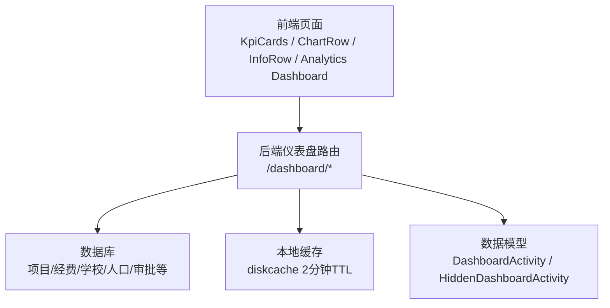
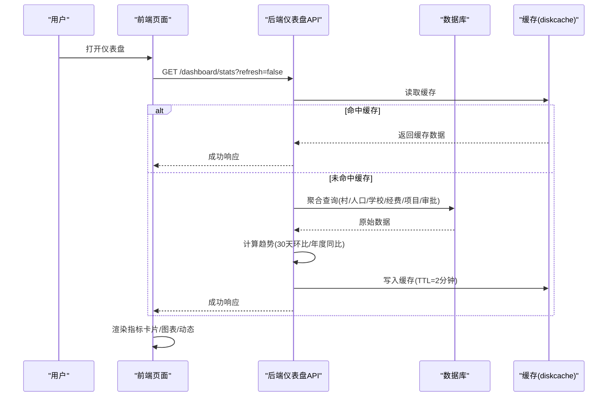
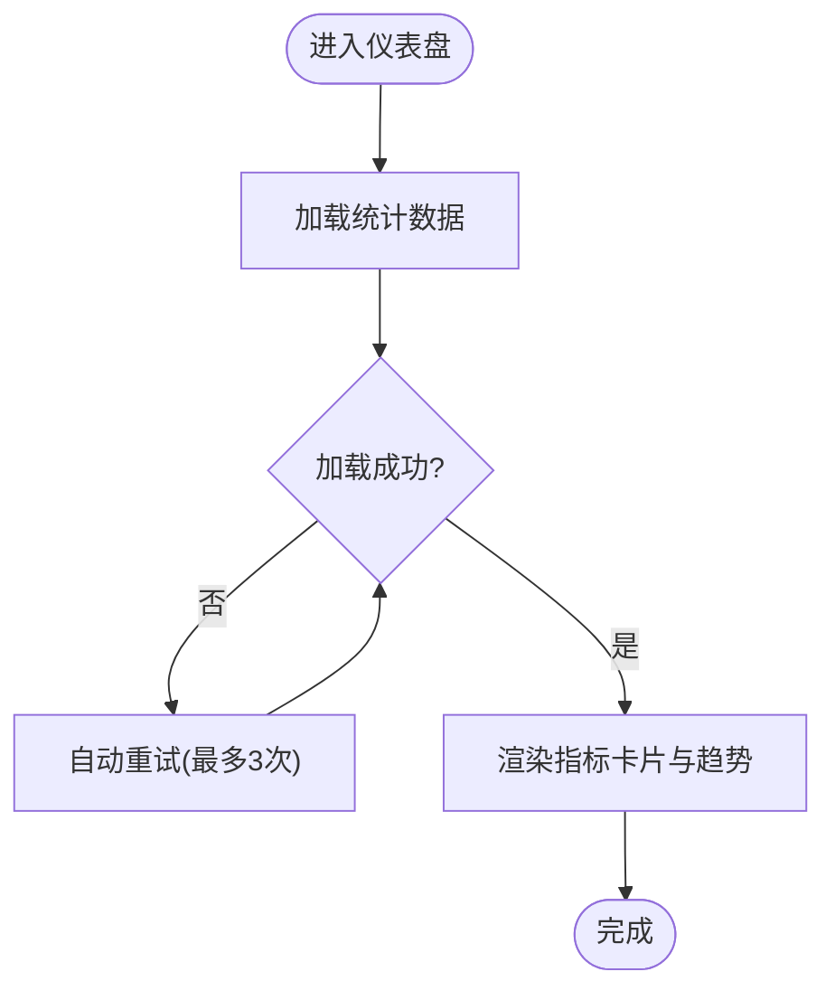
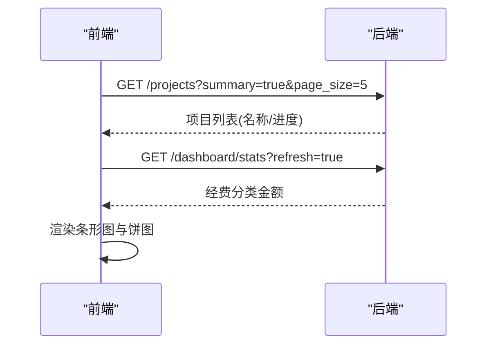
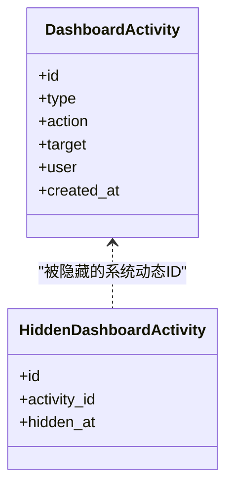
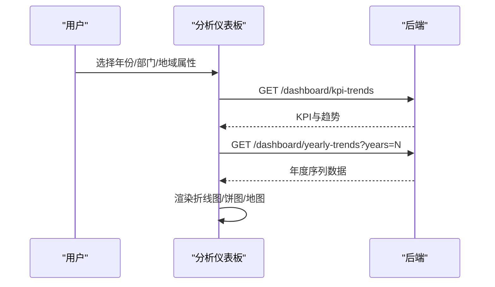
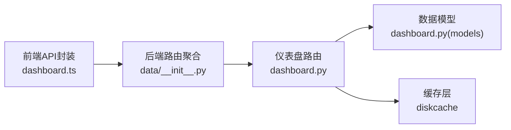

# 仪表盘使用指南

<cite>
**本文引用的文件**
- [KpiCards.vue](file://frontend/src/views/dashboard/KpiCards.vue)
- [ChartRow.vue](file://frontend/src/views/dashboard/ChartRow.vue)
- [InfoRow.vue](file://frontend/src/views/dashboard/InfoRow.vue)
- [Dashboard.vue（分析仪表板）](file://frontend/src/views/analytics/dashboard/Dashboard.vue)
- [dashboard.ts（前端API封装）](file://frontend/src/api/dashboard.ts)
- [dashboard.py（后端仪表盘路由）](file://backend/app/api/v1/data/data/dashboard.py)
- [dashboard.py（数据模型：近期动态）](file://backend/app/models/dashboard.py)
- [__init__.py（数据模块路由聚合）](file://backend/app/api/v1/data/data/__init__.py)
</cite>

## 目录
1. [简介](#简介)
2. [项目结构](#项目结构)
3. [核心组件](#核心组件)
4. [架构总览](#架构总览)
5. [详细组件说明](#详细组件说明)
6. [依赖关系分析](#依赖关系分析)
7. [性能与可用性](#性能与可用性)
8. [常见问题与排错](#常见问题与排错)
9. [结论](#结论)
10. [附录：数据解读技巧与最佳实践](#附录数据解读技巧与最佳实践)

## 简介
本指南面向用户与管理者，帮助快速掌握“乡村振兴帮扶管理系统”中的仪表盘功能。你将学会：
- 查看关键指标卡片（帮扶村、项目、学校、经费、覆盖人口）及其趋势含义
- 通过图表了解项目进度与经费使用情况
- 阅读近期动态，跟踪工作进展
- 在数据分析仪表板中进行多维度筛选与年度对比
- 自定义近期动态，管理个人视图
- 高效排查问题并优化日常使用体验

## 项目结构
仪表盘由前后端协同实现：
- 前端页面与组件负责展示与交互
- 后端提供统计数据、年度趋势、近期动态等接口，并内置缓存与权限过滤
- 数据模型支撑“近期动态”的持久化与隐藏机制

**图示来源**
- [KpiCards.vue:1-120](file://frontend/src/views/dashboard/KpiCards.vue#L1-L120)
- [ChartRow.vue:1-80](file://frontend/src/views/dashboard/ChartRow.vue#L1-L80)
- [InfoRow.vue:1-127](file://frontend/src/views/dashboard/InfoRow.vue#L1-L127)
- [Dashboard.vue（分析仪表板）:1-200](file://frontend/src/views/analytics/dashboard/Dashboard.vue#L1-L200)
- [dashboard.py（后端仪表盘路由）:365-408](file://backend/app/api/v1/data/data/dashboard.py#L365-L408)
- [dashboard.py（数据模型：近期动态）:1-42](file://backend/app/models/dashboard.py#L1-L42)

**章节来源**
- [dashboard.py（后端仪表盘路由）:39-90](file://backend/app/api/v1/data/data/dashboard.py#L39-L90)
- [__init__.py（数据模块路由聚合）:1-26](file://backend/app/api/v1/data/data/__init__.py#L1-L26)

## 核心组件
- 关键指标卡片：展示帮扶村、项目、学校、经费、覆盖人口及环比/同比趋势
- 统计图表：项目进度条形图、经费使用饼图；分析页包含地域分布、投入构成、年度趋势折线
- 数据概览：近期动态时间轴，支持编辑与删除自定义条目
- 个性化定制：新增/编辑/删除近期动态，按组织范围与权限过滤数据

**章节来源**
- [KpiCards.vue:67-194](file://frontend/src/views/dashboard/KpiCards.vue#L67-L194)
- [ChartRow.vue:49-165](file://frontend/src/views/dashboard/ChartRow.vue#L49-L165)
- [InfoRow.vue:48-127](file://frontend/src/views/dashboard/InfoRow.vue#L48-L127)
- [Dashboard.vue（分析仪表板）:64-200](file://frontend/src/views/analytics/dashboard/Dashboard.vue#L64-L200)

## 架构总览
仪表盘的数据流从前端发起请求到后端聚合查询，再返回给前端渲染。

**图示来源**
- [dashboard.py（后端仪表盘路由）:365-408](file://backend/app/api/v1/data/data/dashboard.py#L365-L408)
- [dashboard.py（后端仪表盘路由）:282-355](file://backend/app/api/v1/data/data/dashboard.py#L282-L355)
- [KpiCards.vue:201-240](file://frontend/src/views/dashboard/KpiCards.vue#L201-L240)
- [ChartRow.vue:49-80](file://frontend/src/views/dashboard/ChartRow.vue#L49-L80)

## 详细组件说明

### 关键指标卡片（KPI Cards）
- 功能要点
  - 展示五大核心指标：帮扶村数、项目数、学校数、经费总额、覆盖人口
  - 显示趋势标签：正增长/负下降/持平，并提供跳转链接至对应业务页面
  - 支持加载骨架屏、错误重试与自动恢复
- 数据来源
  - 调用 /dashboard/stats，获取当前值与 trends（villages/projects/schools/funds/population_yoy/income_yoy）
- 使用方法
  - 进入首页仪表盘即可看到卡片；点击卡片可跳转到对应列表页
  - 若数据加载失败，点击“重试”或等待自动重试（最多3次，间隔2秒）

**图示来源**
- [KpiCards.vue:201-240](file://frontend/src/views/dashboard/KpiCards.vue#L201-L240)
- [dashboard.py（后端仪表盘路由）:365-408](file://backend/app/api/v1/data/data/dashboard.py#L365-L408)

**章节来源**
- [KpiCards.vue:67-194](file://frontend/src/views/dashboard/KpiCards.vue#L67-L194)
- [KpiCards.vue:201-240](file://frontend/src/views/dashboard/KpiCards.vue#L201-L240)
- [dashboard.py（后端仪表盘路由）:365-408](file://backend/app/api/v1/data/data/dashboard.py#L365-L408)

### 统计图表（项目进度与经费使用）
- 项目进度跟踪（横向条形图）
  - 展示最近项目的完成率/进度百分比
  - 数据来自 /projects?summary=true&limit=5
- 经费使用概览（环形饼图）
  - 展示已拨付、待拨付、计划中三类经费占比
  - 数据来自 /dashboard/stats 的 funds_allocated/pending/planned
- 使用方法
  - 打开仪表盘后自动加载；如为空数据将显示空状态提示
  - 支持窗口尺寸变化自适应

**图示来源**
- [ChartRow.vue:49-80](file://frontend/src/views/dashboard/ChartRow.vue#L49-L80)
- [ChartRow.vue:82-165](file://frontend/src/views/dashboard/ChartRow.vue#L82-L165)

**章节来源**
- [ChartRow.vue:49-165](file://frontend/src/views/dashboard/ChartRow.vue#L49-L165)

### 数据概览（近期动态）
- 功能要点
  - 汇总系统事件（项目更新/创建、经费状态变更、审批任务）与自定义动态
  - 支持编辑与删除自定义动态；系统动态可通过“隐藏”持久化
- 使用方法
  - 进入仪表盘查看时间轴；对自定义条目进行编辑或删除
  - 如需添加新动态，可通过“创建动态”入口提交（type/action/target）

**图示来源**
- [dashboard.py（数据模型：近期动态）:1-42](file://backend/app/models/dashboard.py#L1-L42)

**章节来源**
- [InfoRow.vue:48-127](file://frontend/src/views/dashboard/InfoRow.vue#L48-L127)
- [dashboard.py（后端仪表盘路由）:681-711](file://backend/app/api/v1/data/data/dashboard.py#L681-L711)
- [dashboard.py（数据模型：近期动态）:1-42](file://backend/app/models/dashboard.py#L1-L42)

### 数据分析仪表板（多维筛选与年度对比）
- 功能要点
  - KPI卡片：帮扶村总数、覆盖人口、平均人均收入、帮扶投入，附带同比/环比趋势
  - 图表：地域分布、帮扶投入构成、年度趋势对比折线图
  - 筛选器：部门、地域属性（三区三州/边疆/民族/革命/重点帮扶县），年份选择
- 使用方法
  - 选择年份与筛选条件后刷新图表
  - 支持导出报表

**图示来源**
- [Dashboard.vue（分析仪表板）:64-200](file://frontend/src/views/analytics/dashboard/Dashboard.vue#L64-L200)
- [dashboard.py（后端仪表盘路由）:410-508](file://backend/app/api/v1/data/data/dashboard.py#L410-L508)

**章节来源**
- [Dashboard.vue（分析仪表板）:64-200](file://frontend/src/views/analytics/dashboard/Dashboard.vue#L64-L200)
- [dashboard.py（后端仪表盘路由）:410-508](file://backend/app/api/v1/data/data/dashboard.py#L410-L508)

## 依赖关系分析
- 前端依赖
  - 页面组件依赖 dashboard.ts 提供的API封装
  - 图表库使用 ECharts，结合响应式resize
- 后端依赖
  - FastAPI 路由聚合于 data/data/__init__.py
  - 数据模型引用项目、经费、学校、人口、审批等实体
  - 缓存使用 diskcache（TTL=2分钟），异常时降级为无缓存
- 权限与数据范围
  - 所有查询均受统一数据范围过滤影响（按组织/创建人）

**图示来源**
- [dashboard.ts（前端API封装）:1-64](file://frontend/src/api/dashboard.ts#L1-L64)
- [__init__.py（数据模块路由聚合）:1-26](file://backend/app/api/v1/data/data/__init__.py#L1-L26)
- [dashboard.py（后端仪表盘路由）:39-90](file://backend/app/api/v1/data/data/dashboard.py#L39-L90)

**章节来源**
- [dashboard.ts（前端API封装）:1-64](file://frontend/src/api/dashboard.ts#L1-L64)
- [__init__.py（数据模块路由聚合）:1-26](file://backend/app/api/v1/data/data/__init__.py#L1-L26)
- [dashboard.py（后端仪表盘路由）:39-90](file://backend/app/api/v1/data/data/dashboard.py#L39-L90)

## 性能与可用性
- 缓存策略
  - 仪表盘统计与近期动态采用本地磁盘缓存，TTL约2分钟，显著降低重复查询压力
  - 首次冷启动可能短暂失败，前端具备自动重试机制
- 并发与聚合
  - 近期动态通过并行抓取（项目/经费/审批/自定义/隐藏列表）减少响应时间
  - 统计接口合并多次SQL为少量聚合查询，提升吞吐
- 容错与降级
  - 接口异常时返回空数据或None，前端展示空状态或错误提示，避免误导决策
- 建议
  - 大数据量场景下，合理设置刷新频率；必要时使用 refresh=true 强制拉取最新数据
  - 关注网络波动与后端冷启动，利用重试与空状态提示提升用户体验

[本节为通用指导，不直接分析具体文件]

## 常见问题与排错
- 指标卡片显示“数据加载失败”
  - 检查网络连接与后端服务是否就绪
  - 点击“重试”，或等待自动重试（最多3次）
  - 确认当前用户组织范围是否有数据
- 图表为空或无数据
  - 确认是否存在项目或经费记录
  - 尝试切换年份或筛选条件
  - 刷新页面或强制刷新（refresh=true）
- 近期动态无法保存或删除
  - 仅自定义动态可编辑/删除；系统动态需通过“隐藏”持久化
  - 确认权限（仅本人或管理员可修改）
- 分析仪表板数据不更新
  - 检查筛选条件是否正确
  - 调用年度趋势接口获取最新数据
  - 清除浏览器缓存或重新登录

**章节来源**
- [KpiCards.vue:201-240](file://frontend/src/views/dashboard/KpiCards.vue#L201-L240)
- [ChartRow.vue:49-80](file://frontend/src/views/dashboard/ChartRow.vue#L49-L80)
- [InfoRow.vue:67-88](file://frontend/src/views/dashboard/InfoRow.vue#L67-L88)
- [dashboard.py（后端仪表盘路由）:730-800](file://backend/app/api/v1/data/data/dashboard.py#L730-L800)

## 结论
仪表盘以直观的指标卡片、清晰的图表与可操作的近期动态，帮助用户快速掌握项目进度、经费使用与乡村工作概况。通过缓存与并发优化，系统在性能与可用性方面表现稳健。建议在日常使用中结合筛选与年度对比，形成数据驱动的决策习惯。

[本节为总结性内容，不直接分析具体文件]

## 附录：数据解读技巧与最佳实践
- 指标卡片趋势
  - 正值表示增长，负值表示下降，零表示持平；注意不同指标的对比周期（月度环比/年度同比）
  - 经费指标以万元为单位，便于宏观把握投入规模
- 项目进度条形图
  - 关注低进度项目，及时跟进风险点
  - 结合“近期动态”定位最近更新的项目
- 经费使用饼图
  - 已拨付/待拨付/计划中的比例反映资金流转效率
  - 待拨付占比过高需关注审批与拨付流程
- 分析仪表板
  - 通过地域属性与部门筛选，聚焦特定区域或责任单位的成效
  - 年度趋势折线图用于观察长期变化与政策效果
- 近期动态
  - 自定义动态用于记录重要里程碑或提醒事项
  - 系统动态可通过“隐藏”保持界面整洁
- 最佳实践
  - 定期查看仪表盘，形成周/月复盘习惯
  - 结合导出报表进行离线分析与汇报
  - 遇到数据异常优先检查权限与筛选条件，再联系管理员

[本节为通用指导，不直接分析具体文件]