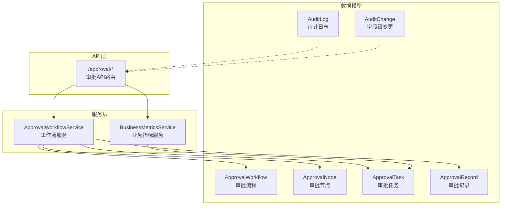
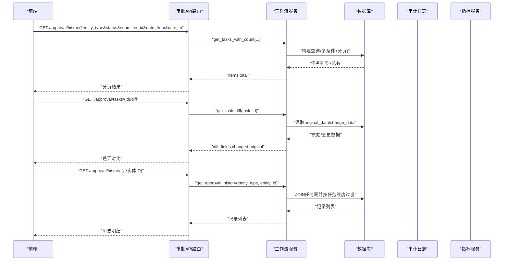
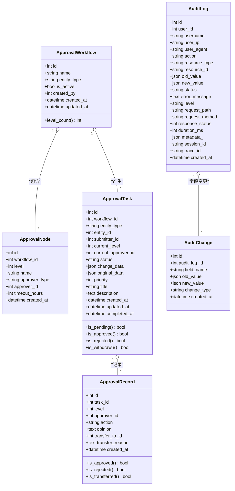
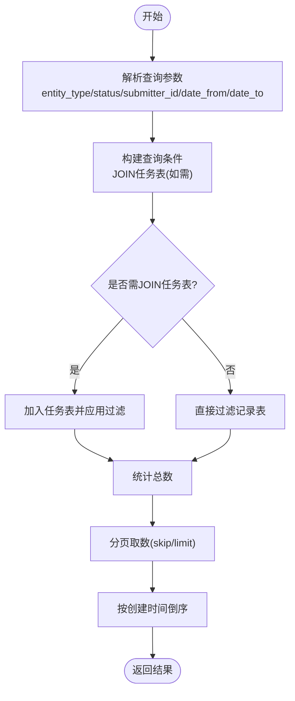
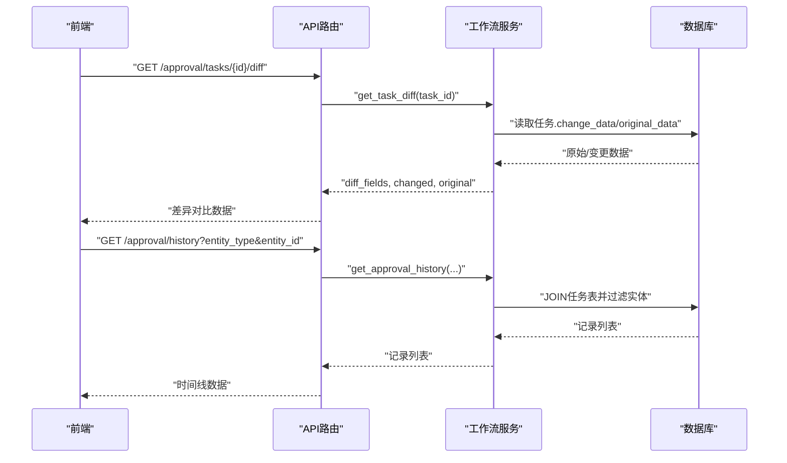
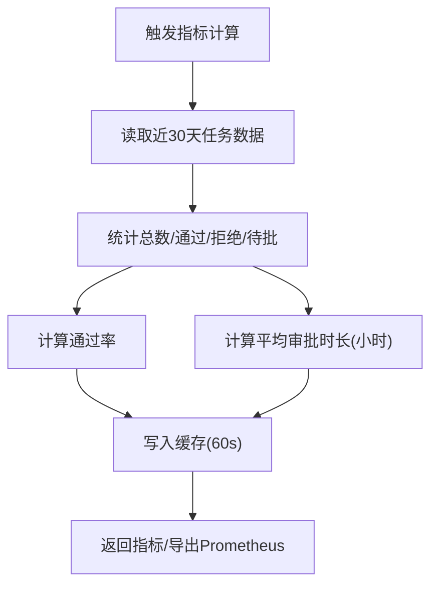
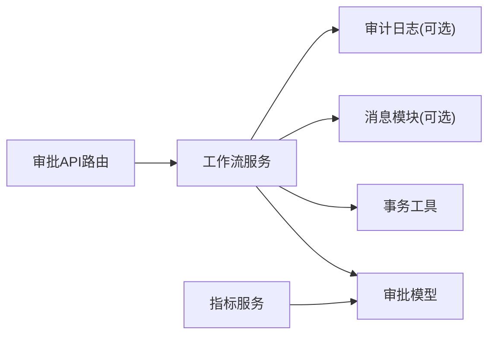

# 审批历史查询

<cite>
**本文引用的文件**
- [backend/app/models/approval.py](file://backend/app/models/approval.py)
- [backend/app/services/approval_workflow_service.py](file://backend/app/services/approval_workflow_service.py)
- [backend/app/api/v1/approval.py](file://backend/app/api/v1/approval.py)
- [backend/app/models/audit.py](file://backend/app/models/audit.py)
- [backend/app/models/audit_change.py](file://backend/app/models/audit_change.py)
- [backend/app/services/business_metrics_service.py](file://backend/app/services/business_metrics_service.py)
</cite>

## 目录
1. [简介](#简介)
2. [项目结构](#项目结构)
3. [核心组件](#核心组件)
4. [架构总览](#架构总览)
5. [详细组件分析](#详细组件分析)
6. [依赖关系分析](#依赖关系分析)
7. [性能考虑](#性能考虑)
8. [故障排查指南](#故障排查指南)
9. [结论](#结论)
10. [附录](#附录)

## 简介
本文件面向“审批历史查询”功能，系统性说明审批历史记录的数据结构与存储机制、查询与筛选能力、审批时间线与流转追踪、权限控制、统计分析以及导出报表等。文档基于后端数据模型、服务层与API端点实现进行梳理，帮助读者快速理解并正确使用该功能。

## 项目结构
围绕审批历史查询，系统采用“模型-服务-接口”的分层组织：
- 数据模型层：定义审批流程、节点、任务、记录及审计日志等实体。
- 服务层：封装审批工作流生命周期管理、历史查询、变更对比、统计指标计算等。
- API层：暴露审批相关REST接口，包括提交、审批、转交、撤回、历史查询、差异对比等。

图表来源
- [backend/app/models/approval.py:53-291](file://backend/app/models/approval.py#L53-L291)
- [backend/app/services/approval_workflow_service.py:30-875](file://backend/app/services/approval_workflow_service.py#L30-L875)
- [backend/app/api/v1/approval.py:1-800](file://backend/app/api/v1/approval.py#L1-L800)
- [backend/app/models/audit.py:53-205](file://backend/app/models/audit.py#L53-L205)
- [backend/app/models/audit_change.py:13-33](file://backend/app/models/audit_change.py#L13-L33)

章节来源
- [backend/app/models/approval.py:53-291](file://backend/app/models/approval.py#L53-L291)
- [backend/app/services/approval_workflow_service.py:30-875](file://backend/app/services/approval_workflow_service.py#L30-L875)
- [backend/app/api/v1/approval.py:1-800](file://backend/app/api/v1/approval.py#L1-L800)
- [backend/app/models/audit.py:53-205](file://backend/app/models/audit.py#L53-L205)
- [backend/app/models/audit_change.py:13-33](file://backend/app/models/audit_change.py#L13-L33)

## 核心组件
- 审批流程配置（ApprovalWorkflow）：按实体类型定义多级审批流程，支持启用/停用与节点配置。
- 审批节点（ApprovalNode）：每个节点的级别、审批人类型（用户/角色）、超时策略等。
- 审批任务（ApprovalTask）：一次业务变更产生的审批实例，包含提交人、当前级别、状态、变更数据、完成时间等。
- 审批记录（ApprovalRecord）：每次审批操作（通过/拒绝/转交）的留痕，含意见、时间、转交信息等。
- 审计日志（AuditLog/AuditChange）：系统级操作与字段级变更记录，用于安全审计与合规追溯。
- 工作流服务（ApprovalWorkflowService）：提供任务创建、推进、撤回、重提、批量处理、历史查询、差异对比等能力。
- 业务指标服务（BusinessMetricsService）：提供通过率、平均时长、待办量等统计指标。

章节来源
- [backend/app/models/approval.py:53-291](file://backend/app/models/approval.py#L53-L291)
- [backend/app/services/approval_workflow_service.py:30-875](file://backend/app/services/approval_workflow_service.py#L30-L875)
- [backend/app/services/business_metrics_service.py:22-113](file://backend/app/services/business_metrics_service.py#L22-L113)
- [backend/app/models/audit.py:53-205](file://backend/app/models/audit.py#L53-L205)
- [backend/app/models/audit_change.py:13-33](file://backend/app/models/audit_change.py#L13-L33)

## 架构总览
审批历史查询的整体调用链路如下：前端请求进入API路由，路由层校验权限与参数后调用服务层方法；服务层根据过滤条件在数据库层执行查询，返回分页结果；必要时结合审计日志与指标服务生成可视化或报表数据。

图表来源
- [backend/app/api/v1/approval.py:720-800](file://backend/app/api/v1/approval.py#L720-L800)
- [backend/app/services/approval_workflow_service.py:368-423](file://backend/app/services/approval_workflow_service.py#L368-L423)
- [backend/app/services/approval_workflow_service.py:759-822](file://backend/app/services/approval_workflow_service.py#L759-L822)

## 详细组件分析

### 数据结构与存储机制
- 审批流程与节点
  - 流程：标识实体类型、是否启用、创建人、创建/更新时间。
  - 节点：级别、名称、审批人类型（用户/角色）、审批人ID或角色ID、超时小时数。
- 审批任务
  - 关联流程、实体类型与ID、提交人、当前级别、当前审批人、状态、变更前后数据、优先级、标题/说明、创建/更新/完成时间。
  - 索引覆盖常用查询维度：流程ID、实体、提交人、当前审批人、状态、优先级+创建时间。
- 审批记录
  - 关联任务、级别、审批人、操作类型（通过/拒绝/转交）、意见、转交目标与原因、审批时间。
  - 索引覆盖任务ID、审批人、级别、操作类型、创建时间。
- 审计日志与字段变更
  - 审计日志：记录用户操作、资源、旧/新值、状态、错误信息、耗时、元数据、会话/追踪ID、时间戳等。
  - 字段变更：针对每条审计日志，记录具体字段名、旧/新值、变更类型、时间。

图表来源
- [backend/app/models/approval.py:53-291](file://backend/app/models/approval.py#L53-L291)
- [backend/app/models/audit.py:53-205](file://backend/app/models/audit.py#L53-L205)
- [backend/app/models/audit_change.py:13-33](file://backend/app/models/audit_change.py#L13-L33)

章节来源
- [backend/app/models/approval.py:53-291](file://backend/app/models/approval.py#L53-L291)
- [backend/app/models/audit.py:53-205](file://backend/app/models/audit.py#L53-L205)
- [backend/app/models/audit_change.py:13-33](file://backend/app/models/audit_change.py#L13-L33)

### 查询与筛选能力
- 多维度查询
  - 按时间范围：支持 date_from/date_to 过滤任务的创建时间。
  - 按审批状态：支持 pending/approved/rejected/withdrawn 等状态过滤。
  - 按审批人：支持 submitter_id 过滤提交人；管理员可查看所有任务。
  - 按业务类型：支持 entity_type 过滤实体类型；支持按实体ID精确查询历史。
- 分页与排序
  - 统一支持 skip/limit 分页；默认按创建时间倒序。
- 历史明细
  - 支持按实体类型+实体ID获取该实体的全部审批记录，便于单条业务的全链路回溯。

图表来源
- [backend/app/services/approval_workflow_service.py:368-423](file://backend/app/services/approval_workflow_service.py#L368-L423)
- [backend/app/services/approval_workflow_service.py:759-785](file://backend/app/services/approval_workflow_service.py#L759-L785)

章节来源
- [backend/app/services/approval_workflow_service.py:368-423](file://backend/app/services/approval_workflow_service.py#L368-L423)
- [backend/app/services/approval_workflow_service.py:759-785](file://backend/app/services/approval_workflow_service.py#L759-L785)

### 审批时间线可视化与流转追踪
- 时间线构成
  - 任务维度：创建时间、当前级别、当前审批人、状态、完成时间。
  - 记录维度：每次操作的级别、审批人、操作类型、意见、转交信息、时间。
- 变更对比
  - 通过差异对比接口获取 original_data 与 change_data，并计算 diff_fields，便于前端渲染“变更了什么”。
- 流转追踪
  - 通过 records 列表还原审批流转顺序；结合节点级别与操作类型，绘制时间轴。

图表来源
- [backend/app/services/approval_workflow_service.py:787-822](file://backend/app/services/approval_workflow_service.py#L787-L822)
- [backend/app/services/approval_workflow_service.py:759-785](file://backend/app/services/approval_workflow_service.py#L759-L785)

章节来源
- [backend/app/services/approval_workflow_service.py:787-822](file://backend/app/services/approval_workflow_service.py#L787-L822)
- [backend/app/services/approval_workflow_service.py:759-785](file://backend/app/services/approval_workflow_service.py#L759-L785)

### 权限控制（个人申请与他人审批）
- 概览统计
  - 非管理员仅能看到与自己相关的任务（提交人或当前审批人）。
- 待审批列表
  - 普通用户：返回分配给自己 OR 自己提交的 pending 任务。
  - 管理员：返回所有 pending 任务。
- 历史查询
  - 支持按提交人过滤；管理员可查看所有任务；普通用户可通过提交人维度查看自己的申请。
- 敏感操作
  - 自动审批、批量审批、重试回写等操作需要管理员权限。

章节来源
- [backend/app/api/v1/approval.py:86-158](file://backend/app/api/v1/approval.py#L86-L158)
- [backend/app/api/v1/approval.py:720-800](file://backend/app/api/v1/approval.py#L720-L800)
- [backend/app/services/approval_workflow_service.py:318-366](file://backend/app/services/approval_workflow_service.py#L318-L366)

### 统计分析（通过率、平均时长、瓶颈识别）
- 指标内容
  - 近30天总审批数、通过数、拒绝数、待审批数。
  - 通过率 = 通过数 / 已决数（通过+拒绝）。
  - 平均审批时长（小时）= 基于任务创建到更新的时差计算。
- 缓存与导出
  - 指标结果短期缓存，减少重复计算。
  - 支持导出为 Prometheus 格式，便于接入监控平台。

图表来源
- [backend/app/services/business_metrics_service.py:42-113](file://backend/app/services/business_metrics_service.py#L42-L113)
- [backend/app/services/business_metrics_service.py:312-371](file://backend/app/services/business_metrics_service.py#L312-L371)

章节来源
- [backend/app/services/business_metrics_service.py:42-113](file://backend/app/services/business_metrics_service.py#L42-L113)
- [backend/app/services/business_metrics_service.py:312-371](file://backend/app/services/business_metrics_service.py#L312-L371)

### 历史数据导出与报表
- 导出记录
  - 系统提供数据导出日志（DataExportLog），记录导出类型、数据类型、过滤条件、文件格式、记录数、文件大小、路径、状态、错误信息等。
- 报表输出
  - 指标服务支持导出为 Prometheus 文本格式，便于外部监控系统采集。
- 建议用法
  - 将导出日志与指标导出结合，形成“审批历史导出+指标报表”的组合方案。

章节来源
- [backend/app/models/audit.py:178-205](file://backend/app/models/audit.py#L178-L205)
- [backend/app/services/business_metrics_service.py:312-371](file://backend/app/services/business_metrics_service.py#L312-L371)

## 依赖关系分析
- 模块耦合
  - API路由依赖工作流服务与权限工具；服务层依赖数据模型与事务工具；指标服务依赖任务模型与数据库聚合函数。
- 外部集成点
  - 消息推送：审批任务创建与结果通知会尝试写入消息表（失败不阻断主流程）。
  - 审计日志：系统级操作与字段变更记录，用于安全审计。
- 潜在循环依赖
  - 服务层通过字符串引用注册实体变更处理器，避免导入循环。

图表来源
- [backend/app/api/v1/approval.py:1-800](file://backend/app/api/v1/approval.py#L1-L800)
- [backend/app/services/approval_workflow_service.py:30-875](file://backend/app/services/approval_workflow_service.py#L30-L875)
- [backend/app/services/business_metrics_service.py:22-113](file://backend/app/services/business_metrics_service.py#L22-L113)

章节来源
- [backend/app/api/v1/approval.py:1-800](file://backend/app/api/v1/approval.py#L1-L800)
- [backend/app/services/approval_workflow_service.py:30-875](file://backend/app/services/approval_workflow_service.py#L30-L875)
- [backend/app/services/business_metrics_service.py:22-113](file://backend/app/services/business_metrics_service.py#L22-L113)

## 性能考虑
- 索引优化
  - 任务表对 workflow_id、entity_type/entity_id、submitter_id、current_approver_id、status、priority+created_at 建立索引，提升常见查询效率。
  - 记录表对 task_id、approver_id、level、action、created_at 建立索引，加速历史明细查询。
  - 审计日志对 user_id/action、created_at、resource_type/resource_id 等建立索引，提高审计检索性能。
- 查询优化
  - 使用 joinedload 预加载关联对象，减少N+1查询。
  - 复杂过滤在数据库层执行，保证分页正确性。
- 缓存策略
  - 指标服务对统计结果进行短时缓存，降低高频访问压力。

章节来源
- [backend/app/models/approval.py:192-199](file://backend/app/models/approval.py#L192-L199)
- [backend/app/models/approval.py:261-267](file://backend/app/models/approval.py#L261-L267)
- [backend/app/models/audit.py:56-63](file://backend/app/models/audit.py#L56-L63)
- [backend/app/services/approval_workflow_service.py:385-422](file://backend/app/services/approval_workflow_service.py#L385-L422)
- [backend/app/services/business_metrics_service.py:25-39](file://backend/app/services/business_metrics_service.py#L25-L39)

## 故障排查指南
- 常见问题定位
  - 无法创建审批任务：检查是否存在对应实体类型的活跃工作流；若无则会自动创建默认流程。
  - 无权限审批：确认当前用户是否为当前审批人或处于单机模式；管理员可绕过校验。
  - 驳回失败：必须填写原因；否则返回参数错误。
  - 审批成功但业务状态未变：任务状态可能为 approved_apply_failed 或 rejected_apply_failed，可使用重试接口恢复。
- 排查步骤
  - 查看任务详情与记录列表，确认流转阶段与操作留痕。
  - 检查审计日志与字段变更，定位数据不一致的具体字段。
  - 使用指标服务观察通过率与平均时长异常波动。

章节来源
- [backend/app/api/v1/approval.py:380-413](file://backend/app/api/v1/approval.py#L380-L413)
- [backend/app/api/v1/approval.py:453-483](file://backend/app/api/v1/approval.py#L453-L483)
- [backend/app/api/v1/approval.py:486-512](file://backend/app/api/v1/approval.py#L486-L512)
- [backend/app/services/approval_workflow_service.py:49-70](file://backend/app/services/approval_workflow_service.py#L49-L70)
- [backend/app/services/approval_workflow_service.py:541-566](file://backend/app/services/approval_workflow_service.py#L541-L566)

## 结论
审批历史查询功能以清晰的数据模型与完善的服务层能力为基础，提供了多维度的查询筛选、完整的时间线可视化、严格的权限控制与实用的统计分析。配合审计日志与导出能力，可满足合规审计与运营分析需求。建议在大数据量场景下关注索引与分页策略，并结合指标缓存提升整体性能。

## 附录
- 关键接口参考
  - 提交审批：POST /approval/submit
  - 审批通过/拒绝/转交/撤回/重新提交：POST /approval/tasks/{id}/{action}
  - 待审批列表：GET /approval/tasks/pending
  - 所有任务（管理员）：GET /approval/tasks/all
  - 变更对比：GET /approval/tasks/{id}/diff
  - 审批历史：GET /approval/history
- 使用建议
  - 前端渲染时间线时，优先展示 records 列表，并结合 diff_fields 高亮变更字段。
  - 统计看板可接入指标服务的 Prometheus 导出，实现实时监控。