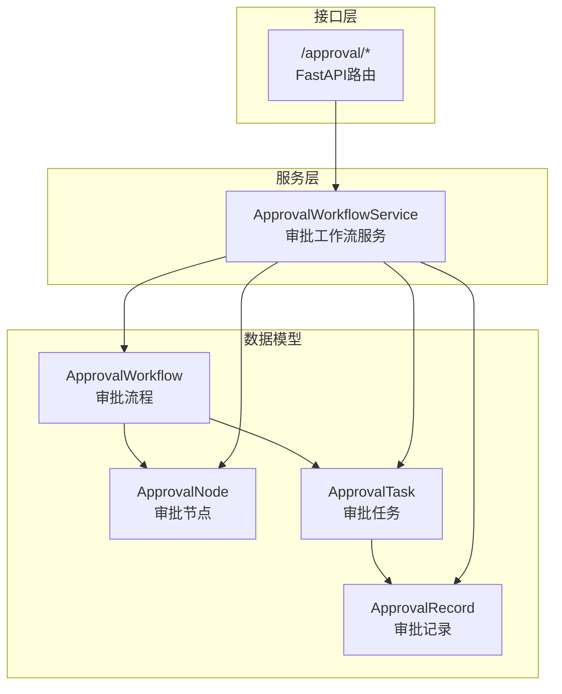
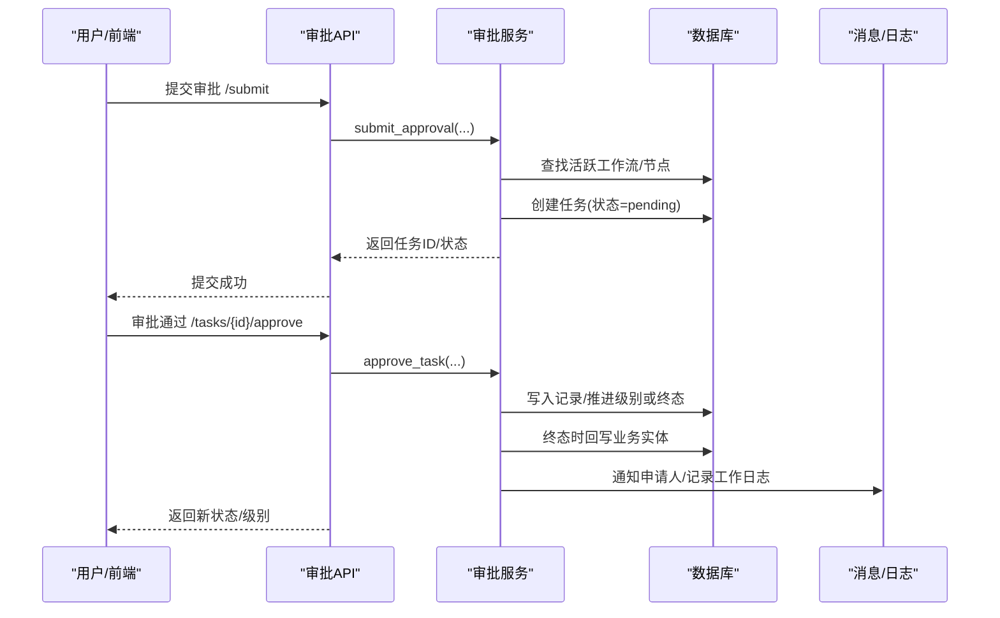
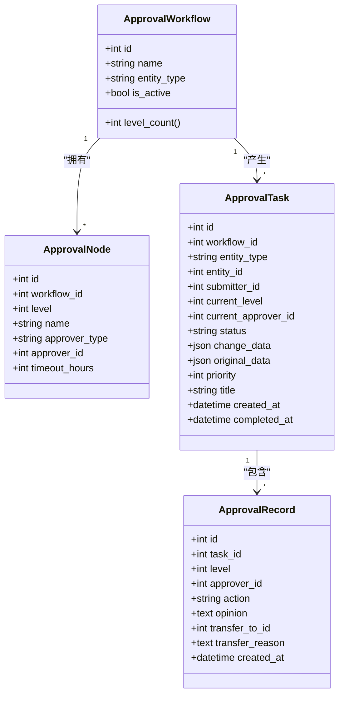

# 审批流程操作指南

<cite>
**本文引用的文件**
- [backend/app/models/approval.py](file://backend/app/models/approval.py)
- [backend/app/services/approval_workflow_service.py](file://backend/app/services/approval_workflow_service.py)
- [backend/app/api/v1/approval.py](file://backend/app/api/v1/approval.py)
- [backend/app/models/todo.py](file://backend/app/models/todo.py)
- [backend/app/services/business_metrics_service.py](file://backend/app/services/business_metrics_service.py)
- [backend/tests/unit/test_approval.py](file://backend/tests/unit/test_approval.py)
</cite>

## 目录
1. [简介](#简介)
2. [项目结构](#项目结构)
3. [核心组件](#核心组件)
4. [架构总览](#架构总览)
5. [详细组件分析](#详细组件分析)
6. [依赖关系分析](#依赖关系分析)
7. [性能与效率优化](#性能与效率优化)
8. [故障排查指南](#故障排查指南)
9. [结论](#结论)
10. [附录：API清单与使用要点](#附录api清单与使用要点)

## 简介
本指南面向系统管理员、业务经办人与开发实施人员，系统化说明审批工作流模块的配置与管理方法，覆盖审批节点设置、审批人指定、流转规则配置；详细说明待办事项处理与审批操作（同意、驳回、转交、撤回、重新提交）；提供审批历史查询与统计分析能力说明；深入介绍自定义审批流程的设计与实现方法；并给出多级审批场景的处理策略、最佳实践、效率优化建议与常见问题解决方案。

## 项目结构
审批模块由“数据模型层 + 服务层 + API层”构成，围绕可配置的审批流程（Workflow）、审批节点（Node）、审批任务（Task）与审批记录（Record）展开，并通过消息通知与工作日志形成闭环。



图表来源
- [backend/app/models/approval.py:53-291](file://backend/app/models/approval.py#L53-L291)
- [backend/app/services/approval_workflow_service.py:30-875](file://backend/app/services/approval_workflow_service.py#L30-L875)
- [backend/app/api/v1/approval.py:45-1109](file://backend/app/api/v1/approval.py#L45-L1109)

章节来源
- [backend/app/models/approval.py:53-291](file://backend/app/models/approval.py#L53-L291)
- [backend/app/services/approval_workflow_service.py:30-875](file://backend/app/services/approval_workflow_service.py#L30-L875)
- [backend/app/api/v1/approval.py:45-1109](file://backend/app/api/v1/approval.py#L45-L1109)

## 核心组件
- 审批流程（Workflow）：定义实体类型对应的审批链，支持最多5级节点，启用/停用控制。
- 审批节点（Node）：每个节点定义级别、名称、审批人类型（用户或角色）、超时时间等。
- 审批任务（Task）：每次数据变更产生的待审实例，包含当前级别、当前审批人、状态、优先级、变更数据等。
- 审批记录（Record）：每次操作的留痕，包括通过、拒绝、转交等操作及意见、时间、转交原因等。
- 待办事项（Todo）：通用待办模型，可与审批任务联动展示（如“我的待办”）。

章节来源
- [backend/app/models/approval.py:53-291](file://backend/app/models/approval.py#L53-L291)
- [backend/app/models/todo.py:18-72](file://backend/app/models/todo.py#L18-L72)

## 架构总览
审批流程从业务侧触发提交，服务层匹配活跃工作流并创建任务，按节点推进流转；最终态触发业务实体回写（如经费状态更新），并发送通知与记录工作日志。



图表来源
- [backend/app/api/v1/approval.py:380-450](file://backend/app/api/v1/approval.py#L380-L450)
- [backend/app/services/approval_workflow_service.py:203-504](file://backend/app/services/approval_workflow_service.py#L203-L504)

## 详细组件分析

### 审批流程配置与管理
- 创建工作流：需管理员权限，定义名称、实体类型、描述与节点列表（最多5级）。
- 查看/更新/删除工作流：支持按实体类型与启用状态筛选；更新仅允许管理员修改元信息。
- 默认工作流：若某实体类型无活跃工作流，可在提交时自动创建单节点默认流程，便于单机版快速运行。

关键要点
- 节点至少1个，最多5个；未分配审批人的任务在单机模式下可由任意登录用户审批。
- 角色型节点会在提交流程中解析为具体用户（如管理员），解析失败则保持未分配，不影响可见性。

章节来源
- [backend/app/api/v1/approval.py:226-374](file://backend/app/api/v1/approval.py#L226-L374)
- [backend/app/services/approval_workflow_service.py:76-197](file://backend/app/services/approval_workflow_service.py#L76-L197)
- [backend/app/services/approval_workflow_service.py:280-307](file://backend/app/services/approval_workflow_service.py#L280-L307)

### 待办事项与审批操作
- 待办列表：支持分页、按优先级与创建时间排序；管理员可查看全局pending任务，普通用户仅看与自己相关（提交或待自己审批）。
- 同意：在当前级别通过后，自动推进到下一级；全部通过后标记为已通过，并执行业务实体回写。
- 驳回：必须填写原因；终止流程，标记为已拒绝，并尝试回写业务实体状态。
- 转交：将当前任务转交给其他用户，记录转交原因；管理员可代为转交任意待审批任务。
- 撤回：仅提交人可撤回处于pending的任务。
- 重新提交：被驳回或撤回后可重新提交，重置到第一级并重新分配审批人。
- 批量/一键审批：管理员可对单个任务或所有pending任务进行快速通过（单机模式语义）。

```mermaid
flowchart TD
Start(["开始"]) --> CheckStatus{"任务是否pending?"}
CheckStatus -- 否 --> EndNo["结束(不可操作)"]
CheckStatus -- 是 --> Action{"操作类型"}
Action --> |同意| Approve["写入通过记录"]
Action --> |驳回| Reject["校验原因必填"]
Action --> |转交| Transfer["记录转交并更新审批人"]
Action --> |撤回| Withdraw["标记为已撤回"]
Action --> |重新提交| Resubmit["重置级别与审批人"]
Approve --> NextLevel{"是否还有下一级?"}
NextLevel -- 是|推进| Push["current_level+1, 解析下一节点审批人"]
NextLevel -- 否|终态| Finalize["标记已通过, 完成时间, 回写业务实体"]
Reject --> FinalizeReject["标记已拒绝, 完成时间, 回写业务实体"]
Transfer --> EndOK["结束(成功)"]
Withdraw --> EndOK
Resubmit --> EndOK
Push --> EndOK
Finalize --> EndOK
FinalizeReject --> EndOK
```

图表来源
- [backend/app/services/approval_workflow_service.py:447-704](file://backend/app/services/approval_workflow_service.py#L447-L704)
- [backend/app/api/v1/approval.py:416-717](file://backend/app/api/v1/approval.py#L416-L717)

章节来源
- [backend/app/api/v1/approval.py:768-800](file://backend/app/api/v1/approval.py#L768-L800)
- [backend/app/services/approval_workflow_service.py:318-422](file://backend/app/services/approval_workflow_service.py#L318-L422)
- [backend/app/services/approval_workflow_service.py:447-704](file://backend/app/services/approval_workflow_service.py#L447-L704)

### 审批历史记录与统计分析
- 历史记录：可按实体类型、实体ID、提交人、状态过滤，支持分页；记录包含操作类型、意见、时间、审批人等信息。
- 统计指标：近30天总审批数、通过数、拒绝数、待审批数、成功率、平均审批时长等，支持缓存以提升性能。
- 概览统计：首页模块统计（pending/approved/rejected/total/my_pending），管理员看全局，普通用户看自身相关。

章节来源
- [backend/app/services/approval_workflow_service.py:759-800](file://backend/app/services/approval_workflow_service.py#L759-L800)
- [backend/app/services/business_metrics_service.py:54-113](file://backend/app/services/business_metrics_service.py#L54-L113)
- [backend/app/api/v1/approval.py:86-158](file://backend/app/api/v1/approval.py#L86-L158)

### 自定义审批流程设计与实现
设计步骤
1. 明确实体类型：例如“supported_village”“fund”“project”等，不同实体可绑定不同流程。
2. 设计节点序列：按业务需要设置1-5级节点，每级指定名称、审批人类型（用户/角色）、超时时间。
3. 配置审批人：
   - 用户型：直接指定用户ID。
   - 角色型：指定角色标识，系统在提交与晋级时解析为具体用户（如管理员）。
4. 启用流程：确保is_active为真，以便提交时自动匹配。
5. 验证与测试：通过单元测试与集成测试覆盖创建、提交、审批、驳回、转交、重试回写等路径。

实现要点
- 服务层提供create_workflow/list/get/update/delete等方法，统一事务提交。
- 提交时自动匹配活跃工作流；若无则自动创建默认单节点流程（单机版）。
- 角色型节点解析失败时保持未分配，不影响任务可见性与后续审批。
- 终态回写采用注册处理器机制，业务模块在导入时注册对应实体的回写逻辑。

章节来源
- [backend/app/services/approval_workflow_service.py:76-197](file://backend/app/services/approval_workflow_service.py#L76-L197)
- [backend/app/services/approval_workflow_service.py:203-278](file://backend/app/services/approval_workflow_service.py#L203-L278)
- [backend/app/services/approval_workflow_service.py:49-70](file://backend/app/services/approval_workflow_service.py#L49-L70)

### 多级审批场景策略与最佳实践
- 节点数量限制：最多5级，避免流程过长导致效率下降。
- 审批人分配策略：
  - 关键节点建议使用角色型，便于组织调整时减少维护成本。
  - 未分配审批人时，单机模式下任何登录用户可审批，保证流程不阻塞。
- 超时与提醒：为节点设置超时时间，结合消息推送提升时效性。
- 回写一致性：终态回写失败会标记为“*_apply_failed”，提供重试接口，避免业务状态不一致。
- 审计与留痕：所有操作均记录到审批记录表，支持追溯与审计。

章节来源
- [backend/app/services/approval_workflow_service.py:96-99](file://backend/app/services/approval_workflow_service.py#L96-L99)
- [backend/app/services/approval_workflow_service.py:253-277](file://backend/app/services/approval_workflow_service.py#L253-L277)
- [backend/app/services/approval_workflow_service.py:497-504](file://backend/app/services/approval_workflow_service.py#L497-L504)
- [backend/app/services/approval_workflow_service.py:541-566](file://backend/app/services/approval_workflow_service.py#L541-L566)

## 依赖关系分析
- 模型依赖：ApprovalWorkflow关联多个ApprovalNode；ApprovalTask关联Workflow、Submitter、CurrentApprover与多条ApprovalRecord。
- 服务依赖：服务层对模型进行CRUD与流程编排，调用事务工具safe_commit保证一致性。
- API依赖：路由层负责鉴权、参数校验与响应封装，调用服务层执行业务逻辑。
- 外部依赖：消息模块用于通知，工作日志模块用于审计。



图表来源
- [backend/app/models/approval.py:53-291](file://backend/app/models/approval.py#L53-L291)

章节来源
- [backend/app/models/approval.py:53-291](file://backend/app/models/approval.py#L53-L291)
- [backend/app/services/approval_workflow_service.py:30-875](file://backend/app/services/approval_workflow_service.py#L30-L875)
- [backend/app/api/v1/approval.py:45-1109](file://backend/app/api/v1/approval.py#L45-L1109)

## 性能与效率优化
- 索引优化：任务表针对workflow_id、entity组合、submitter_id、current_approver_id、status、priority+created_at建立索引，提升查询与排序性能。
- 分页与计数：列表接口统一返回total，避免前端重复计算；历史与任务列表支持skip/limit分页。
- 缓存指标：统计分析指标（如近30天审批指标）使用缓存降低数据库压力。
- 批量操作：提供批量审批与一键审批接口，减少多次往返与事务开销。
- 异步与容错：消息推送失败不阻断主流程；终态回写失败标记可重试，避免静默吞错。

章节来源
- [backend/app/models/approval.py:192-199](file://backend/app/models/approval.py#L192-L199)
- [backend/app/services/approval_workflow_service.py:318-422](file://backend/app/services/approval_workflow_service.py#L318-L422)
- [backend/app/services/business_metrics_service.py:54-113](file://backend/app/services/business_metrics_service.py#L54-L113)
- [backend/app/services/approval_workflow_service.py:706-753](file://backend/app/services/approval_workflow_service.py#L706-L753)

## 故障排查指南
常见问题与定位
- 无法创建审批任务：检查是否存在对应实体类型的活跃工作流；若无则自动创建默认流程后重试。
- 无权限审批：确认当前用户是否为任务当前审批人或管理员；单机模式下未分配任务可由任意用户审批。
- 驳回失败：必须填写原因；若为空将返回错误提示。
- 业务状态未更新：检查终态回写是否失败；可通过重试接口修复“*_apply_failed”任务。
- 消息推送失败：非致命异常，不影响审批主流程；查看日志定位问题。

定位方法
- 查看审批记录：通过历史记录接口获取操作留痕，核对操作人、时间与意见。
- 查看任务详情：通过任务详情接口获取当前级别、审批人、状态与变更数据。
- 查看统计与概览：通过概览接口了解整体待办与完成情况。

章节来源
- [backend/app/api/v1/approval.py:453-483](file://backend/app/api/v1/approval.py#L453-L483)
- [backend/app/api/v1/approval.py:486-512](file://backend/app/api/v1/approval.py#L486-L512)
- [backend/app/services/approval_workflow_service.py:253-277](file://backend/app/services/approval_workflow_service.py#L253-L277)
- [backend/app/services/approval_workflow_service.py:541-566](file://backend/app/services/approval_workflow_service.py#L541-L566)

## 结论
本审批工作流模块以可配置的流程与节点为核心，提供完整的任务生命周期管理、严格的权限控制与完善的审计留痕；通过角色型审批人、默认流程与单机模式优化，兼顾灵活性与易用性；借助统计分析与缓存机制，保障系统在高并发下的稳定与高效。建议在复杂组织中优先采用角色型节点与合理的超时策略，并结合重试机制确保业务状态一致性。

## 附录：API清单与使用要点
- 流程管理
  - POST /approval/workflows：创建审批流程（管理员）
  - GET /approval/workflows：列出流程（支持实体类型与启用状态过滤）
  - GET /approval/workflows/{id}：获取流程详情
  - PUT /approval/workflows/{id}：更新流程（管理员）
  - DELETE /approval/workflows/{id}：删除流程（管理员）
- 任务操作
  - POST /approval/submit：提交审批
  - POST /approval/tasks/{id}/approve：审批通过
  - POST /approval/tasks/{id}/reject：审批拒绝（必须填写原因）
  - POST /approval/tasks/{id}/transfer：转交审批
  - POST /approval/tasks/{id}/withdraw：撤回申请
  - POST /approval/tasks/{id}/resubmit：重新提交
  - GET /approval/tasks/pending：待审批列表（管理员可见全部）
  - POST /approval/tasks/batch：批量审批
  - GET /approval/tasks/all：所有任务（管理员）
  - GET /approval/tasks/{id}/diff：变更对比
  - GET /approval/history：审批历史
  - POST /approval/submit-auto：提交并自动审批（管理员）
  - POST /approval/tasks/{id}/auto-approve：单机版快速审批（管理员）
  - POST /approval/tasks/auto-approve-all：一键审批所有待处理任务（管理员）
  - POST /approval/tasks/{id}/retry-apply：重试终态回写（管理员）

使用要点
- 管理员权限：流程配置、批量/一键审批、重试回写等接口需管理员。
- 角色型节点：提交与晋级时自动解析为具体用户，解析失败保持未分配。
- 单机模式：未分配审批人的任务可由任意登录用户审批，便于快速流转。
- 回写失败：终态回写失败会标记为“*_apply_failed”，可通过重试接口恢复。

章节来源
- [backend/app/api/v1/approval.py:226-800](file://backend/app/api/v1/approval.py#L226-L800)
- [backend/tests/unit/test_approval.py:70-200](file://backend/tests/unit/test_approval.py#L70-L200)