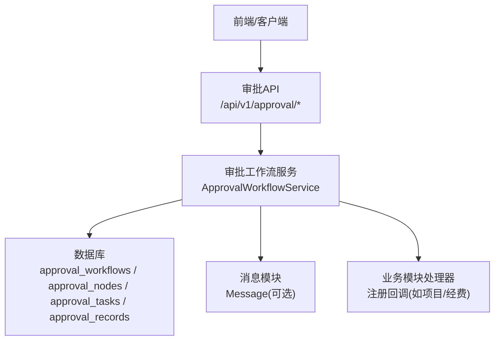
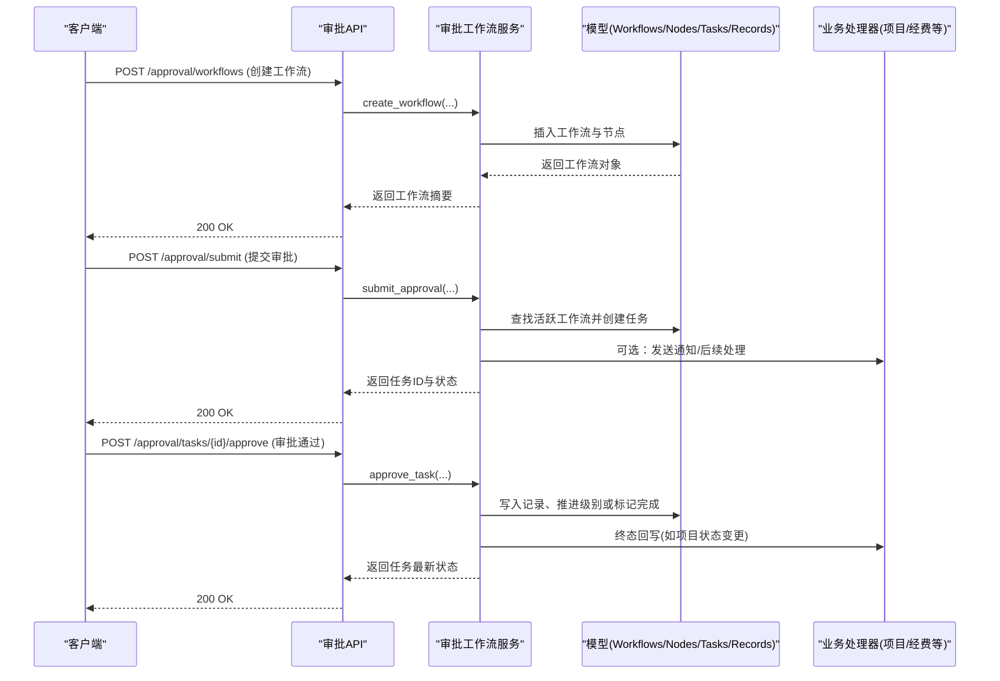
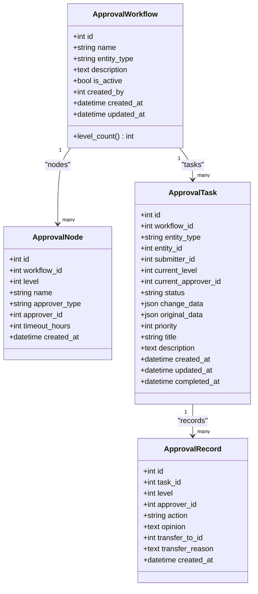
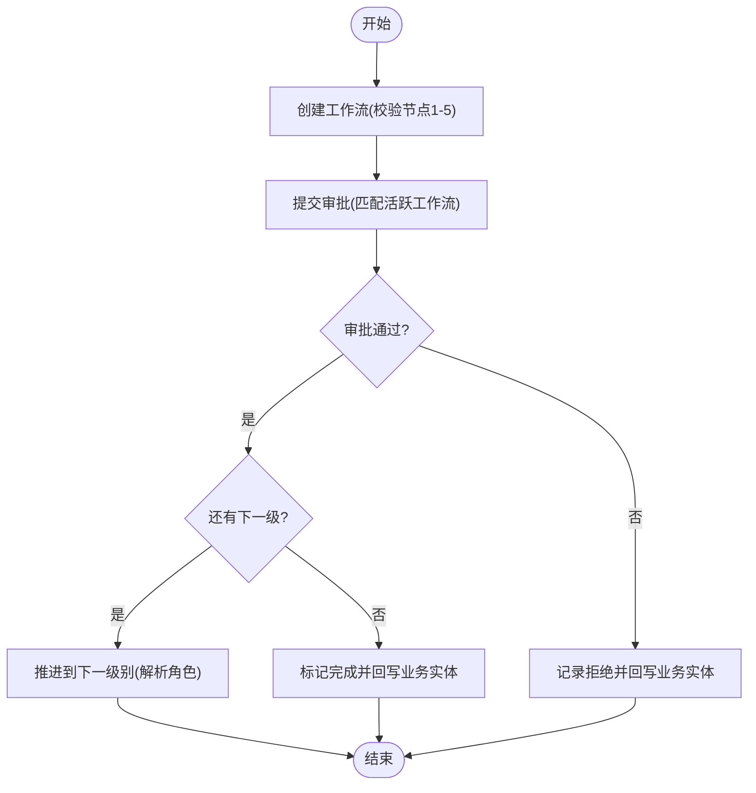
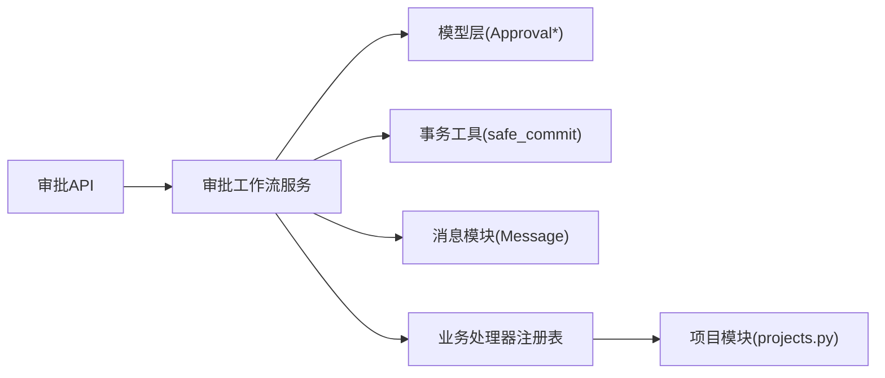

# 审批流程配置管理

<cite>
**本文引用的文件**
- [backend/app/models/approval.py](file://backend/app/models/approval.py)
- [backend/app/services/approval_workflow_service.py](file://backend/app/services/approval_workflow_service.py)
- [backend/app/api/v1/approval.py](file://backend/app/api/v1/approval.py)
- [backend/app/models/validation_rule.py](file://backend/app/models/validation_rule.py)
- [backend/app/api/v1/projects.py](file://backend/app/api/v1/projects.py)
- [frontend/src/utils/offlineMock.ts](file://frontend/src/utils/offlineMock.ts)
- [backend/tests/factories/approval_factory.py](file://backend/tests/factories/approval_factory.py)
</cite>

## 目录
1. [简介](#简介)
2. [项目结构](#项目结构)
3. [核心组件](#核心组件)
4. [架构总览](#架构总览)
5. [详细组件分析](#详细组件分析)
6. [依赖关系分析](#依赖关系分析)
7. [性能与可用性](#性能与可用性)
8. [故障排查指南](#故障排查指南)
9. [结论](#结论)
10. [附录：业务场景配置示例](#附录业务场景配置示例)

## 简介
本文件面向“多级审批流程配置管理”的完整实现，覆盖以下目标：
- 如何创建和配置多级审批流程（名称、实体类型绑定、描述等）
- 审批节点配置方法（级别1-5、审批人类型：指定用户/角色、超时时间）
- 流程激活状态管理与版本控制机制
- 不同业务场景的配置示例（项目立项审批、经费使用审批、人员调动审批等）
- 流程配置的验证规则与最佳实践建议

## 项目结构
审批能力由“模型层 + 服务层 + API层”构成，数据持久化在数据库，API暴露给前端或外部系统调用。关键路径如下：
- 模型层：定义审批工作流、节点、任务、记录等数据结构
- 服务层：封装创建工作流、提交审批、审批通过/拒绝、转交、批量处理、回写业务实体等逻辑
- API层：提供REST接口，负责鉴权、参数校验、调用服务并返回结果

**图表来源**
- [backend/app/api/v1/approval.py:226-374](file://backend/app/api/v1/approval.py#L226-L374)
- [backend/app/services/approval_workflow_service.py:76-197](file://backend/app/services/approval_workflow_service.py#L76-L197)
- [backend/app/models/approval.py:53-291](file://backend/app/models/approval.py#L53-L291)

**章节来源**
- [backend/app/models/approval.py:53-291](file://backend/app/models/approval.py#L53-L291)
- [backend/app/services/approval_workflow_service.py:76-197](file://backend/app/services/approval_workflow_service.py#L76-L197)
- [backend/app/api/v1/approval.py:226-374](file://backend/app/api/v1/approval.py#L226-L374)

## 核心组件
- 审批工作流模型（ApprovalWorkflow）：定义流程名称、实体类型、描述、是否启用、创建人与时间戳；支持最多5级节点
- 审批节点模型（ApprovalNode）：定义级别（1-5）、节点名称、审批人类型（user/role）、审批人ID或角色ID、超时小时数
- 审批任务模型（ApprovalTask）：记录每次变更请求的当前级别、当前审批人、状态、变更前后数据、优先级、标题与说明
- 审批记录模型（ApprovalRecord）：记录每次操作（通过/拒绝/转交）的审批人、意见、转交信息、时间
- 审批工作流服务（ApprovalWorkflowService）：实现工作流CRUD、任务生命周期、自动默认流程、批量操作、回写业务实体等
- 审批API（/approval/*）：对外暴露工作流与任务的增删改查、提交、审批、拒绝、转交、撤回、重新提交、批量操作等

**章节来源**
- [backend/app/models/approval.py:53-291](file://backend/app/models/approval.py#L53-L291)
- [backend/app/services/approval_workflow_service.py:30-197](file://backend/app/services/approval_workflow_service.py#L30-L197)
- [backend/app/api/v1/approval.py:164-221](file://backend/app/api/v1/approval.py#L164-L221)

## 架构总览
下图展示从API到服务再到模型的调用链，以及业务回写的扩展点。

**图表来源**
- [backend/app/api/v1/approval.py:226-450](file://backend/app/api/v1/approval.py#L226-L450)
- [backend/app/services/approval_workflow_service.py:76-504](file://backend/app/services/approval_workflow_service.py#L76-L504)
- [backend/app/api/v1/projects.py:100-112](file://backend/app/api/v1/projects.py#L100-L112)

## 详细组件分析

### 数据模型与关系
- ApprovalWorkflow：包含name、entity_type、description、is_active、created_by、created_at、updated_at；关联nodes与tasks
- ApprovalNode：包含workflow_id、level(1-5)、name、approver_type(user/role)、approver_id、timeout_hours
- ApprovalTask：包含workflow_id、entity_type、entity_id、submitter_id、current_level、current_approver_id、status、change_data、original_data、priority、title、description、completed_at
- ApprovalRecord：包含task_id、level、approver_id、action(approve/reject/transfer)、opinion、transfer_to_id、transfer_reason、created_at

**图表来源**
- [backend/app/models/approval.py:53-291](file://backend/app/models/approval.py#L53-L291)

**章节来源**
- [backend/app/models/approval.py:53-291](file://backend/app/models/approval.py#L53-L291)

### 工作流与服务能力
- 创建工作流：校验节点数量（1-5），创建流程与节点，默认启用
- 获取/更新/删除工作流：支持按实体类型与激活状态筛选；更新仅允许修改名称、描述、激活状态
- 确保默认流程：若某实体类型无活跃流程，自动创建单节点默认流程（便于单机模式快速运行）
- 提交审批：匹配活跃工作流，创建任务，解析角色为具体用户（单机版管理员），必要时发送消息通知
- 审批通过/拒绝：记录操作，推进级别或结束流程；终态时执行业务实体回写（可失败并标记重试）
- 转交/撤回/重新提交：支持将任务转交给其他用户、提交人撤回、被驳回后重新提交
- 批量与自动化：批量审批、一键自动审批所有待办、提交并自动通过（单机版）

**图表来源**
- [backend/app/services/approval_workflow_service.py:76-504](file://backend/app/services/approval_workflow_service.py#L76-L504)

**章节来源**
- [backend/app/services/approval_workflow_service.py:76-504](file://backend/app/services/approval_workflow_service.py#L76-L504)

### API端点与权限
- 工作流管理：
  - POST /approval/workflows：创建（需管理员）
  - GET /approval/workflows：列表（非管理员仅可见自己创建的）
  - GET /approval/workflows/{id}：详情
  - PUT /approval/workflows/{id}：更新（需管理员）
  - DELETE /approval/workflows/{id}：删除（需管理员）
- 任务管理：
  - POST /approval/submit：提交审批
  - POST /approval/tasks/{id}/approve：审批通过
  - POST /approval/tasks/{id}/reject：审批拒绝（必须填写原因）
  - POST /approval/tasks/{id}/transfer：转交
  - POST /approval/tasks/{id}/withdraw：撤回
  - POST /approval/tasks/{id}/resubmit：重新提交
  - GET /approval/tasks/pending：待审批列表（管理员可见全部）
  - POST /approval/tasks/batch：批量审批
  - GET /approval/history：历史
  - GET /approval/tasks/{id}/diff：变更对比
- 单机版优化：
  - POST /approval/submit-auto：提交并自动通过
  - POST /approval/tasks/{id}/auto-approve：单个任务快速通过
  - POST /approval/tasks/auto-approve-all：一键通过所有待办

权限要点：
- 工作流定义属于系统配置，普通用户不可重定义以避免路由风险
- 拒绝必须填写原因，防止绕过前端校验
- 管理员可执行批量与自动审批

**章节来源**
- [backend/app/api/v1/approval.py:226-800](file://backend/app/api/v1/approval.py#L226-L800)

### 版本控制与激活状态
- 激活状态：工作流包含is_active字段，提交审批时仅匹配活跃工作流；可通过更新接口切换激活状态
- 版本控制：当前实现未提供显式版本号字段；如需版本控制，建议在应用层以“新增工作流+停用旧流程”的方式实现灰度与回滚
- 默认流程：ensure_default_workflow保证每个实体类型至少有一个可用流程，避免业务中断

**章节来源**
- [backend/app/services/approval_workflow_service.py:180-197](file://backend/app/services/approval_workflow_service.py#L180-L197)
- [backend/app/api/v1/approval.py:331-374](file://backend/app/api/v1/approval.py#L331-L374)

### 业务场景配置示例
以下为常见业务场景的配置思路（基于现有模型与API）：
- 项目立项审批（entity_type=project）
  - 节点1：部门负责人审核（approver_type=role，timeout_hours=24）
  - 节点2：总指挥审批（approver_type=role，timeout_hours=72）
  - 参考前端离线模拟数据中的“项目立项审批”示例
- 经费使用审批（entity_type=fund）
  - 节点1：财务初审（approver_type=user，timeout_hours=24）
  - 节点2：分管领导审批（approver_type=role，timeout_hours=48）
  - 参考前端离线模拟数据中的“经费审批流程”示例
- 人员调动审批（entity_type=supported_village/school/rural_work）
  - 节点1：部门主管审核（approver_type=role，timeout_hours=24）
  - 节点2：人事负责人审批（approver_type=user，timeout_hours=48）
  - 可在对应业务模块中注册回写处理器以联动状态变更

注意：
- 节点级别严格限制在1-5之间
- 超时时间单位为小时，可根据业务复杂度调整
- 角色类型节点在提交流程中会尝试解析为具体用户（单机版解析为管理员）

**章节来源**
- [frontend/src/utils/offlineMock.ts:326-375](file://frontend/src/utils/offlineMock.ts#L326-L375)
- [backend/app/services/approval_workflow_service.py:203-278](file://backend/app/services/approval_workflow_service.py#L203-L278)

### 验证规则与最佳实践
- 基础验证
  - 节点数量：1-5级（超出将抛出错误）
  - 必填字段：流程名称、实体类型、节点名称
  - 拒绝原因：必须填写（后端强制校验）
- 数据校验规则（跨模块）
  - 可使用ValidationRule模型对业务字段进行必填、范围、格式、枚举等校验
  - 适用于项目、经费、村庄、学校等业务模块
- 最佳实践
  - 工作流命名规范：清晰表达业务含义（如“项目立项审批-V2”）
  - 节点职责明确：每级只关注一个决策点，避免越级
  - 超时策略合理：根据业务紧急程度设置合理的timeout_hours
  - 激活与版本：通过切换is_active实现灰度发布；保留旧流程以便回滚
  - 回写一致性：终态回写失败会标记为*_apply_failed，提供重试接口
  - 权限隔离：工作流定义仅限管理员；普通用户仅能提交与查看相关任务

**章节来源**
- [backend/app/services/approval_workflow_service.py:76-99](file://backend/app/services/approval_workflow_service.py#L76-L99)
- [backend/app/api/v1/approval.py:453-476](file://backend/app/api/v1/approval.py#L453-L476)
- [backend/app/models/validation_rule.py:15-55](file://backend/app/models/validation_rule.py#L15-L55)

## 依赖关系分析
- 模型依赖：Base、User（外键引用）
- 服务依赖：数据库会话、事务工具、消息模块（可选）、业务模块处理器（注册表）
- API依赖：FastAPI路由、权限工具、响应封装、日志、工作流服务

**图表来源**
- [backend/app/api/v1/approval.py:226-800](file://backend/app/api/v1/approval.py#L226-L800)
- [backend/app/services/approval_workflow_service.py:30-197](file://backend/app/services/approval_workflow_service.py#L30-L197)
- [backend/app/api/v1/projects.py:100-112](file://backend/app/api/v1/projects.py#L100-L112)

**章节来源**
- [backend/app/services/approval_workflow_service.py:30-197](file://backend/app/services/approval_workflow_service.py#L30-L197)
- [backend/app/api/v1/projects.py:100-112](file://backend/app/api/v1/projects.py#L100-L112)

## 性能与可用性
- 查询优化：使用joinedload预加载关联数据，减少N+1查询
- 分页与过滤：支持skip/limit与多条件过滤（实体类型、状态、提交人、日期范围）
- 批量操作：批量审批与自动审批采用独立事务，单个失败不影响其余任务
- 回写容错：终态回写失败标记为可重试状态，提供重试接口
- 消息推送：非致命异常不阻断主流程，失败仅记录日志

[本节为通用指导，无需特定文件来源]

## 故障排查指南
- 无法创建审批任务
  - 检查是否存在对应实体类型的活跃工作流
  - 确认节点数量在1-5之间
- 审批被拒绝
  - 后端要求必须填写原因；请补充意见后重试
- 回写失败
  - 查看任务状态是否包含_apply_failed后缀
  - 使用重试接口恢复终态
- 权限问题
  - 工作流定义与删除需要管理员权限
  - 普通用户仅能查看与自己相关的任务

**章节来源**
- [backend/app/api/v1/approval.py:453-512](file://backend/app/api/v1/approval.py#L453-L512)
- [backend/app/services/approval_workflow_service.py:49-71](file://backend/app/services/approval_workflow_service.py#L49-L71)

## 结论
本系统提供了完善的多级审批流程配置与管理能力，涵盖工作流定义、节点配置、任务生命周期、业务回写与批量操作。通过激活状态与默认流程机制保障业务连续性，结合验证规则与权限控制提升安全性与可维护性。建议在实际使用中遵循命名规范、合理设置超时与级别，并通过版本化策略实现平滑升级与回滚。

[本节为总结性内容，无需特定文件来源]

## 附录：业务场景配置示例
- 项目立项审批
  - 实体类型：project
  - 节点：
    - 第1级：项目办审核（role，48小时）
    - 第2级：总指挥审批（role，72小时）
  - 参考：前端离线模拟数据中的“项目立项审批”
- 经费使用审批
  - 实体类型：fund
  - 节点：
    - 第1级：部门负责人审核（role，24小时）
    - 第2级：分管领导审批（role，48小时）
  - 参考：前端离线模拟数据中的“经费审批流程”
- 人员调动审批
  - 实体类型：supported_village/school/rural_work
  - 节点：
    - 第1级：部门主管审核（role，24小时）
    - 第2级：人事负责人审批（user，48小时）
  - 可在对应业务模块注册回写处理器以联动状态

提示：
- 节点级别严格限制在1-5
- 超时时间单位为小时
- 角色类型节点在提交流程中会尝试解析为具体用户（单机版解析为管理员）

**章节来源**
- [frontend/src/utils/offlineMock.ts:326-375](file://frontend/src/utils/offlineMock.ts#L326-L375)
- [backend/app/services/approval_workflow_service.py:203-278](file://backend/app/services/approval_workflow_service.py#L203-L278)