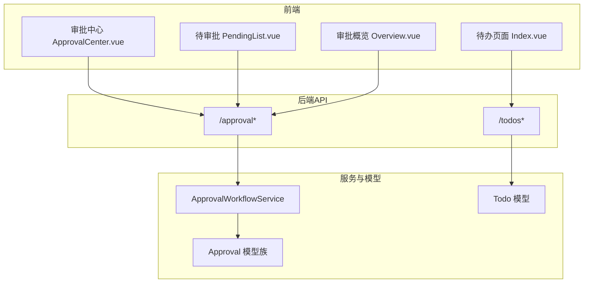
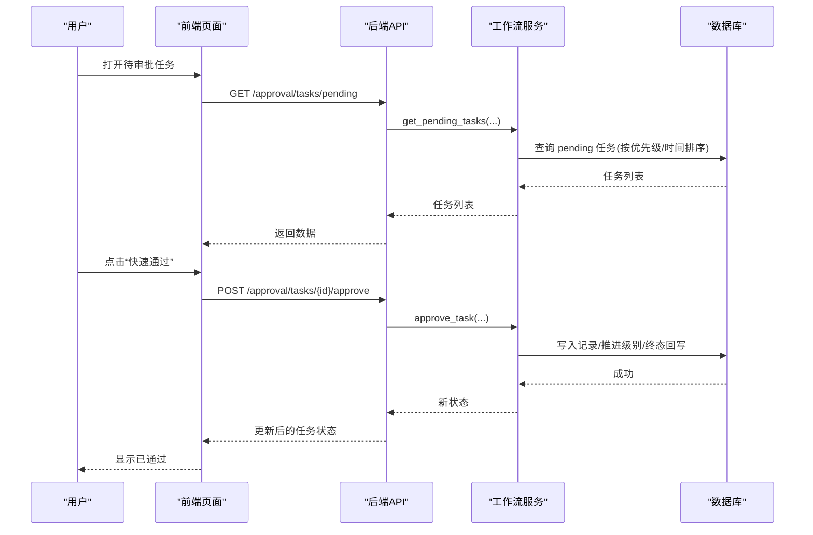
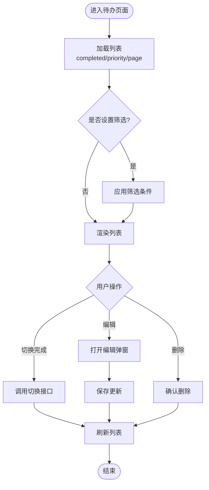
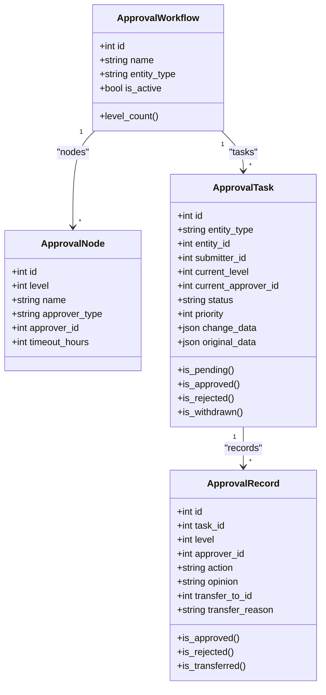
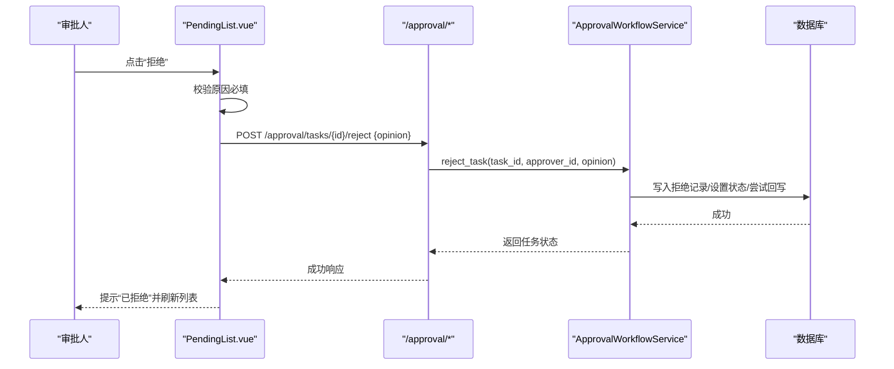
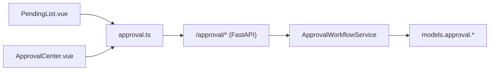

# 待办事项处理

<cite>
**本文引用的文件**
- [backend/app/models/todo.py](file://backend/app/models/todo.py)
- [backend/app/api/v1/todos.py](file://backend/app/api/v1/todos.py)
- [frontend/src/views/todos/Index.vue](file://frontend/src/views/todos/Index.vue)
- [backend/app/models/approval.py](file://backend/app/models/approval.py)
- [backend/app/api/v1/approval.py](file://backend/app/api/v1/approval.py)
- [backend/app/services/approval_workflow_service.py](file://backend/app/services/approval_workflow_service.py)
- [frontend/src/api/approval.ts](file://frontend/src/api/approval.ts)
- [frontend/src/views/approval/PendingList.vue](file://frontend/src/views/approval/PendingList.vue)
- [frontend/src/views/approval/Overview.vue](file://frontend/src/views/approval/Overview.vue)
- [frontend/src/views/approval/ApprovalCenter.vue](file://frontend/src/views/approval/ApprovalCenter.vue)
</cite>

## 目录
1. [简介](#简介)
2. [项目结构](#项目结构)
3. [核心组件](#核心组件)
4. [架构总览](#架构总览)
5. [详细组件分析](#详细组件分析)
6. [依赖关系分析](#依赖关系分析)
7. [性能与效率优化](#性能与效率优化)
8. [故障排查指南](#故障排查指南)
9. [结论](#结论)
10. [附录：常见场景操作示例](#附录常见场景操作示例)

## 简介
本指南面向“待办事项”和“审批中心”的终端用户与管理员，覆盖以下目标：
- 查看与管理个人待办事项（列表、筛选、排序、完成切换）
- 审批任务查看、筛选、排序与批量处理
- 审批操作：同意、驳回（必填原因）、转交（选择目标用户）
- 优先级与紧急通道：高优先级优先展示、单机版一键通过
- 批量审批与模板化意见输入
- 常见问题与排错建议
- 提升效率的操作技巧与快捷键建议

## 项目结构
围绕待办与审批的前后端关键文件如下：
- 待办事项
  - 数据模型：Todo（标题、描述、截止日期、优先级、完成状态、创建/更新时间）
  - API：增删改查、分页、按完成状态与优先级过滤、切换完成状态
  - 前端页面：待办列表页（添加、编辑、删除、筛选、分页）
- 审批流程
  - 数据模型：Workflow/Node/Task/Record（多级流程、节点、任务、记录）
  - API：提交审批、通过/拒绝/转交/撤回/重试回写、待办列表、历史、变更对比、批量审批、单机版快速审批
  - 服务层：工作流引擎（自动匹配流程、推进级别、回写业务实体、失败标记与重试）
  - 前端页面：审批概览、待审批任务、我的申请、历史、变更对比与轨迹

**图表来源**
- [frontend/src/views/todos/Index.vue:1-501](file://frontend/src/views/todos/Index.vue#L1-L501)
- [frontend/src/views/approval/ApprovalCenter.vue:1-290](file://frontend/src/views/approval/ApprovalCenter.vue#L1-L290)
- [frontend/src/views/approval/PendingList.vue:1-859](file://frontend/src/views/approval/PendingList.vue#L1-L859)
- [frontend/src/views/approval/Overview.vue:1-78](file://frontend/src/views/approval/Overview.vue#L1-L78)
- [backend/app/api/v1/todos.py:1-351](file://backend/app/api/v1/todos.py#L1-L351)
- [backend/app/api/v1/approval.py:1-800](file://backend/app/api/v1/approval.py#L1-L800)
- [backend/app/services/approval_workflow_service.py:1-800](file://backend/app/services/approval_workflow_service.py#L1-L800)
- [backend/app/models/todo.py:1-72](file://backend/app/models/todo.py#L1-L72)
- [backend/app/models/approval.py:1-291](file://backend/app/models/approval.py#L1-L291)

**章节来源**
- [backend/app/models/todo.py:1-72](file://backend/app/models/todo.py#L1-L72)
- [backend/app/api/v1/todos.py:1-351](file://backend/app/api/v1/todos.py#L1-L351)
- [frontend/src/views/todos/Index.vue:1-501](file://frontend/src/views/todos/Index.vue#L1-L501)
- [backend/app/models/approval.py:1-291](file://backend/app/models/approval.py#L1-L291)
- [backend/app/api/v1/approval.py:1-800](file://backend/app/api/v1/approval.py#L1-L800)
- [backend/app/services/approval_workflow_service.py:1-800](file://backend/app/services/approval_workflow_service.py#L1-L800)
- [frontend/src/api/approval.ts:1-437](file://frontend/src/api/approval.ts#L1-L437)
- [frontend/src/views/approval/PendingList.vue:1-859](file://frontend/src/views/approval/PendingList.vue#L1-L859)
- [frontend/src/views/approval/Overview.vue:1-78](file://frontend/src/views/approval/Overview.vue#L1-L78)
- [frontend/src/views/approval/ApprovalCenter.vue:1-290](file://frontend/src/views/approval/ApprovalCenter.vue#L1-L290)

## 核心组件
- 待办事项
  - 能力：创建、更新、删除、切换完成状态；支持按完成状态与优先级筛选；默认按“未完成优先 + 创建时间倒序”排序。
  - 界面：顶部新增表单、筛选栏、列表项（含逾期提示）、分页、编辑弹窗。
- 审批流程
  - 能力：多级工作流配置、自动创建任务、逐级推进、通过/拒绝/转交/撤回/重新提交、变更对比、历史追溯、批量审批、单机版快速审批。
  - 界面：概览统计、待审批任务列表（筛选类型/时间、批量操作、详情/对比/转交/拒绝/快速通过）、我的申请、历史。

**章节来源**
- [backend/app/api/v1/todos.py:107-155](file://backend/app/api/v1/todos.py#L107-L155)
- [frontend/src/views/todos/Index.vue:46-150](file://frontend/src/views/todos/Index.vue#L46-L150)
- [backend/app/api/v1/approval.py:768-800](file://backend/app/api/v1/approval.py#L768-L800)
- [frontend/src/views/approval/PendingList.vue:50-185](file://frontend/src/views/approval/PendingList.vue#L50-L185)

## 架构总览
审批从前端到后端的调用链：
- 前端发起请求（待审批列表、通过/拒绝/转交/批量等）
- 后端路由校验权限并调用服务层
- 服务层执行工作流推进、写入记录、必要时回写业务实体
- 返回结果给前端进行展示与交互

**图表来源**
- [frontend/src/views/approval/PendingList.vue:641-669](file://frontend/src/views/approval/PendingList.vue#L641-L669)
- [backend/app/api/v1/approval.py:416-450](file://backend/app/api/v1/approval.py#L416-L450)
- [backend/app/services/approval_workflow_service.py:447-504](file://backend/app/services/approval_workflow_service.py#L447-L504)
- [backend/app/models/approval.py:138-203](file://backend/app/models/approval.py#L138-L203)

## 详细组件分析

### 待办事项模块
- 数据模型
  - Todo：包含标题、描述、截止日期、优先级、完成状态、所属用户、创建/更新时间，并提供 to_dict 转换。
- API
  - 列表：支持 completed、priority 过滤，默认按 completed 升序、created_at 降序排序，分页 page/page_size。
  - 详情/更新/删除/切换完成：均限制为当前用户的数据。
- 前端
  - 筛选：完成状态（全部/未完成/已完成）、优先级（高/中/低）。
  - 列表：支持勾选完成、编辑、删除、分页；逾期日期高亮提示。
  - 新增/编辑：表单校验与保存。

**图表来源**
- [backend/app/api/v1/todos.py:107-155](file://backend/app/api/v1/todos.py#L107-L155)
- [frontend/src/views/todos/Index.vue:254-282](file://frontend/src/views/todos/Index.vue#L254-L282)

**章节来源**
- [backend/app/models/todo.py:18-72](file://backend/app/models/todo.py#L18-L72)
- [backend/app/api/v1/todos.py:75-155](file://backend/app/api/v1/todos.py#L75-L155)
- [frontend/src/views/todos/Index.vue:1-501](file://frontend/src/views/todos/Index.vue#L1-L501)

### 审批流程模块
- 数据模型
  - Workflow/Node：定义多级审批流程与节点（用户或角色），最多5级。
  - Task：审批任务，包含实体类型/ID、提交人、当前级别/审批人、状态、优先级、变更数据、时间戳。
  - Record：每次操作的留痕（通过/拒绝/转交），含意见、转交目标与原因。
- 服务层
  - 提交审批：匹配活跃流程，创建任务并推送消息（未分配审批人时跳过）。
  - 通过/拒绝：记录操作、推进级别或终止流程，终态尝试回写业务实体；失败则标记可重试状态。
  - 转交：将任务转移至其他用户，记录原因。
  - 批量/一键：批量通过、一键通过所有待审批（单机版）。
  - 历史/差异：获取任务变更对比与历史记录。
- API
  - 待审批列表：按优先级和时间排序，管理员可见全部 pending，普通用户仅见自己相关。
  - 通过/拒绝/转交/撤回/重新提交/重试回写/批量审批/历史/差异/概览/单机版快速审批。
- 前端
  - 待审批任务：筛选类型/时间、批量选择、快速通过、转交（远程搜索用户）、拒绝（必填原因）、变更对比与轨迹。
  - 审批中心：三标签（待我审批/我发起的/已完成），批量通过/驳回。
  - 概览：统计卡片与快捷入口。

**图表来源**
- [backend/app/models/approval.py:53-203](file://backend/app/models/approval.py#L53-L203)
- [backend/app/models/approval.py:225-291](file://backend/app/models/approval.py#L225-L291)

**章节来源**
- [backend/app/models/approval.py:1-291](file://backend/app/models/approval.py#L1-L291)
- [backend/app/api/v1/approval.py:1-800](file://backend/app/api/v1/approval.py#L1-L800)
- [backend/app/services/approval_workflow_service.py:1-800](file://backend/app/services/approval_workflow_service.py#L1-L800)
- [frontend/src/api/approval.ts:1-437](file://frontend/src/api/approval.ts#L1-L437)
- [frontend/src/views/approval/PendingList.vue:1-859](file://frontend/src/views/approval/PendingList.vue#L1-L859)
- [frontend/src/views/approval/ApprovalCenter.vue:1-290](file://frontend/src/views/approval/ApprovalCenter.vue#L1-L290)
- [frontend/src/views/approval/Overview.vue:1-78](file://frontend/src/views/approval/Overview.vue#L1-L78)

### 审批操作详解
- 同意（通过）
  - 步骤：在待审批列表点击“快速通过”，系统先尝试标准审批；若无权限则回退到单机版自动审批。
  - 注意：通过后可能推进到下一级或最终通过；若业务回写失败会标记可重试状态。
- 驳回（拒绝）
  - 步骤：点击“拒绝”，弹出对话框填写原因（必填），确认后提交。
  - 注意：后端强制校验原因非空；驳回后流程终止并可触发业务回写。
- 转交
  - 步骤：点击“转交”，选择目标用户（支持远程搜索），可选填写原因，确认后提交。
  - 注意：普通用户只能转交给未分配或指派给自己的任务；管理员可代为转交任意待审批任务。
- 撤回与重新提交
  - 撤回：仅提交人可对 pending 任务执行撤回。
  - 重新提交：被驳回或已撤回的任务可重新提交，可选择携带更新后的变更数据。

**图表来源**
- [frontend/src/views/approval/PendingList.vue:545-639](file://frontend/src/views/approval/PendingList.vue#L545-L639)
- [backend/app/api/v1/approval.py:453-483](file://backend/app/api/v1/approval.py#L453-L483)
- [backend/app/services/approval_workflow_service.py:506-539](file://backend/app/services/approval_workflow_service.py#L506-L539)

**章节来源**
- [frontend/src/views/approval/PendingList.vue:187-242](file://frontend/src/views/approval/PendingList.vue#L187-L242)
- [backend/app/api/v1/approval.py:416-545](file://backend/app/api/v1/approval.py#L416-L545)
- [backend/app/services/approval_workflow_service.py:447-704](file://backend/app/services/approval_workflow_service.py#L447-L704)

### 优先级与紧急通道
- 优先级
  - 待审批列表默认按 priority 降序、created_at 降序排序，高优先级优先展示。
  - 前端以标签区分高/普通优先级，便于快速识别。
- 紧急通道（单机版）
  - 快速通过单个任务：优先走标准审批，无权限时自动回退到单机版快速审批。
  - 一键全部通过：管理员可一键通过所有 pending 任务，适合测试或内部环境快速流转。

**章节来源**
- [backend/app/services/approval_workflow_service.py:318-350](file://backend/app/services/approval_workflow_service.py#L318-L350)
- [frontend/src/views/approval/PendingList.vue:641-707](file://frontend/src/views/approval/PendingList.vue#L641-L707)
- [backend/app/api/v1/approval.py:661-717](file://backend/app/api/v1/approval.py#L661-L717)

### 批量审批与模板化意见
- 批量通过
  - 前端支持多选后批量通过，可输入统一意见；后端逐条执行并通过/失败分别统计。
- 批量驳回
  - 审批中心支持批量驳回，需填写统一原因（必填校验）。
- 模板化意见
  - 可在批量操作中预设常用意见文本，减少重复输入。

**章节来源**
- [frontend/src/views/approval/PendingList.vue:709-737](file://frontend/src/views/approval/PendingList.vue#L709-L737)
- [frontend/src/views/approval/ApprovalCenter.vue:221-263](file://frontend/src/views/approval/ApprovalCenter.vue#L221-L263)
- [backend/app/services/approval_workflow_service.py:706-725](file://backend/app/services/approval_workflow_service.py#L706-L725)

## 依赖关系分析
- 前端依赖
  - PendingList.vue 依赖 approval.ts 提供的 API 封装（通过/拒绝/转交/批量/差异/历史等）。
  - ApprovalCenter.vue 直接调用通用请求方法实现批量操作。
- 后端依赖
  - approval.py 路由依赖 ApprovalWorkflowService 执行工作流逻辑。
  - Service 依赖 models.approval 中的 Workflow/Node/Task/Record 进行持久化与查询。
- 数据权限
  - 普通用户仅能查看与自己相关的任务（提交人或当前审批人）；管理员可查看全部。

**图表来源**
- [frontend/src/views/approval/PendingList.vue:293-314](file://frontend/src/views/approval/PendingList.vue#L293-L314)
- [frontend/src/api/approval.ts:139-316](file://frontend/src/api/approval.ts#L139-L316)
- [backend/app/api/v1/approval.py:1-800](file://backend/app/api/v1/approval.py#L1-L800)
- [backend/app/services/approval_workflow_service.py:1-800](file://backend/app/services/approval_workflow_service.py#L1-L800)
- [backend/app/models/approval.py:1-291](file://backend/app/models/approval.py#L1-L291)

**章节来源**
- [frontend/src/views/approval/PendingList.vue:293-314](file://frontend/src/views/approval/PendingList.vue#L293-L314)
- [frontend/src/api/approval.ts:139-316](file://frontend/src/api/approval.ts#L139-L316)
- [backend/app/api/v1/approval.py:1-800](file://backend/app/api/v1/approval.py#L1-L800)
- [backend/app/services/approval_workflow_service.py:1-800](file://backend/app/services/approval_workflow_service.py#L1-L800)
- [backend/app/models/approval.py:1-291](file://backend/app/models/approval.py#L1-L291)

## 性能与效率优化
- 列表与分页
  - 使用 skip/limit 分页，避免一次性加载大量数据。
  - 前端对空页自动回退到最后一页，提升浏览体验。
- 排序与索引
  - 后端按 priority 与 created_at 排序，模型层建立相应索引以提升查询性能。
- 批量操作
  - 批量通过采用独立事务处理，单条失败不影响其余任务。
- 缓存与消息
  - 审批消息推送失败不阻断主流程，确保稳定性。
- 快捷键建议（基于现有功能）
  - Enter：在待办新增表单中回车可直接添加。
  - 空格：在列表中勾选/取消完成状态（结合键盘导航）。
  - Tab：在表单字段间快速切换，配合 Enter 提交。
  - 说明：以上快捷键为浏览器默认行为与页面交互设计，具体以实际页面为准。

**章节来源**
- [backend/app/models/todo.py:23-27](file://backend/app/models/todo.py#L23-L27)
- [backend/app/models/approval.py:192-199](file://backend/app/models/approval.py#L192-L199)
- [frontend/src/views/todos/Index.vue:12-44](file://frontend/src/views/todos/Index.vue#L12-L44)
- [frontend/src/views/approval/PendingList.vue:450-477](file://frontend/src/views/approval/PendingList.vue#L450-L477)
- [backend/app/services/approval_workflow_service.py:727-753](file://backend/app/services/approval_workflow_service.py#L727-L753)

## 故障排查指南
- 无法看到待审批任务
  - 检查是否为管理员视角（管理员可见全部 pending）；普通用户仅能看到分配给自己或自己提交的 pending。
  - 确认是否存在对应的工作流；若无工作流，提交审批将返回空任务。
- 驳回失败
  - 后端要求驳回必须填写原因；请确保前端已做必填校验且传入非空字符串。
- 通过但业务状态未变
  - 终态回写失败会被标记为“*_apply_failed”；可使用“重试回写”接口修复不一致。
- 转交失败
  - 普通用户只能转交给未分配或指派给自己的任务；管理员可代为转交任意任务。
- 批量审批部分失败
  - 查看返回的 failed 列表，根据 reason 定位问题；必要时单独重试。

**章节来源**
- [backend/app/api/v1/approval.py:768-800](file://backend/app/api/v1/approval.py#L768-L800)
- [backend/app/api/v1/approval.py:453-483](file://backend/app/api/v1/approval.py#L453-L483)
- [backend/app/services/approval_workflow_service.py:497-504](file://backend/app/services/approval_workflow_service.py#L497-L504)
- [backend/app/services/approval_workflow_service.py:541-566](file://backend/app/services/approval_workflow_service.py#L541-L566)
- [backend/app/services/approval_workflow_service.py:672-704](file://backend/app/services/approval_workflow_service.py#L672-L704)
- [backend/app/services/approval_workflow_service.py:706-725](file://backend/app/services/approval_workflow_service.py#L706-L725)

## 结论
本系统提供了完善的待办事项管理与审批流程能力：
- 待办事项支持灵活的筛选与排序，满足日常任务管理需求。
- 审批流程具备多级工作流、完整留痕、变更对比与历史追溯，保障合规与可审计。
- 提供批量审批与单机版快速通道，显著提升处理效率。
- 通过权限控制与错误处理机制，确保数据安全与系统稳定。

## 附录：常见场景操作示例
- 场景一：快速通过高优先级经费申请
  - 在待审批列表找到高优先级经费任务，点击“快速通过”，如权限不足则自动回退到单机版快速审批。
- 场景二：驳回资料不全的申请
  - 点击“拒绝”，填写明确原因（必填），确认后流程终止并通知申请人。
- 场景三：转交临时不在岗的审批人
  - 点击“转交”，搜索并选择目标用户，填写原因，确认后任务移交。
- 场景四：批量通过同类任务
  - 多选任务，点击“批量通过”，输入统一意见，提交后查看成功/失败统计。
- 场景五：重试业务回写失败
  - 对标记为“*_apply_failed”的任务，使用“重试回写”接口恢复一致状态。

**章节来源**
- [frontend/src/views/approval/PendingList.vue:641-707](file://frontend/src/views/approval/PendingList.vue#L641-L707)
- [backend/app/api/v1/approval.py:453-545](file://backend/app/api/v1/approval.py#L453-L545)
- [backend/app/services/approval_workflow_service.py:541-566](file://backend/app/services/approval_workflow_service.py#L541-L566)
- [frontend/src/views/approval/ApprovalCenter.vue:221-263](file://frontend/src/views/approval/ApprovalCenter.vue#L221-L263)