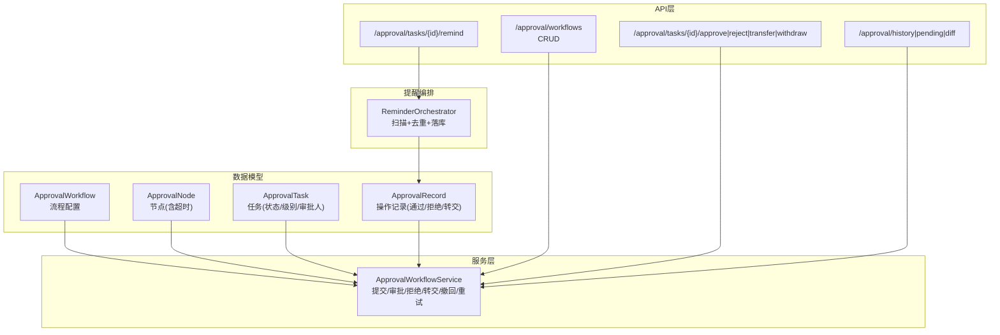
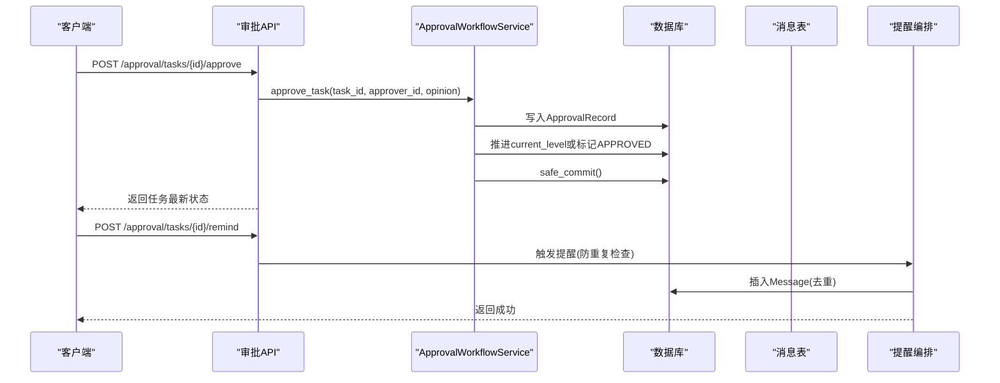
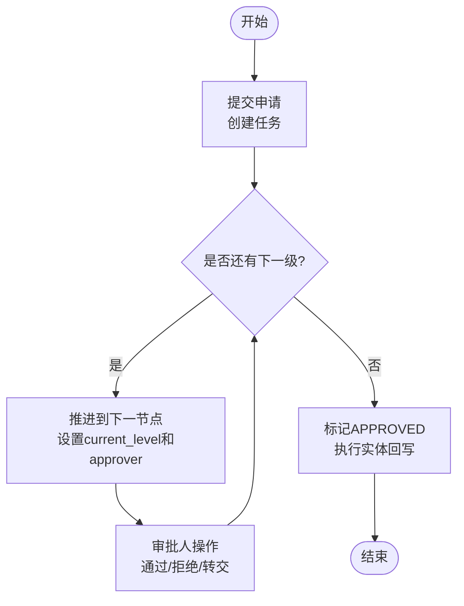
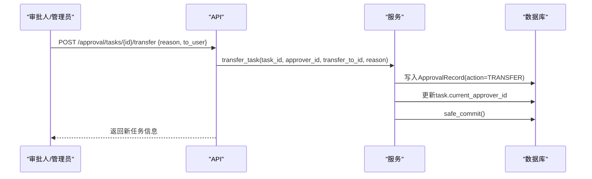
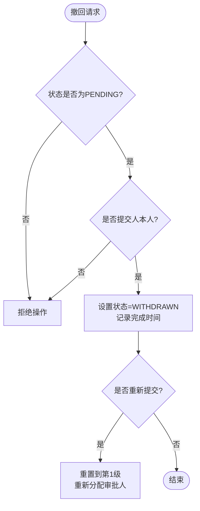
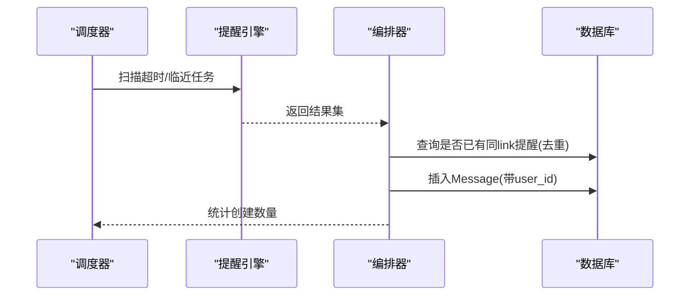
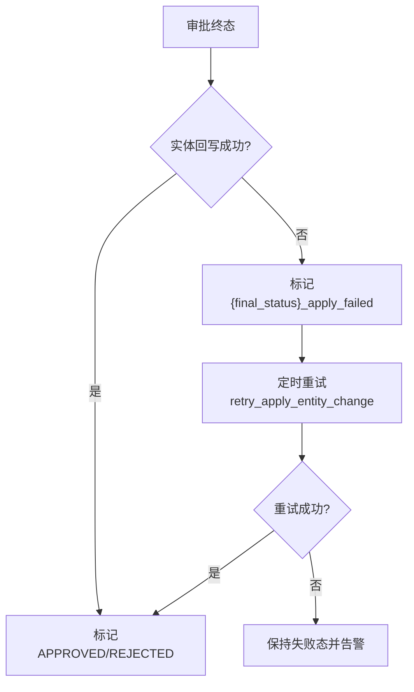
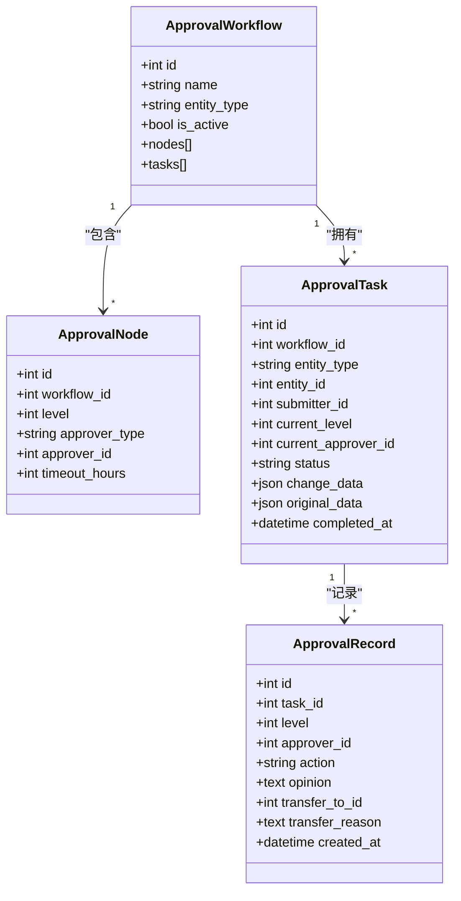

# 高级审批场景

<cite>
**本文引用的文件**
- [backend/app/models/approval.py](file://backend/app/models/approval.py)
- [backend/app/services/approval_workflow_service.py](file://backend/app/services/approval_workflow_service.py)
- [backend/app/api/v1/approval.py](file://backend/app/api/v1/approval.py)
- [backend/app/services/reminder_orchestrator.py](file://backend/app/services/reminder_orchestrator.py)
- [backend/tests/unit/test_approval_workflow_service.py](file://backend/tests/unit/test_approval_workflow_service.py)
- [backend/tests/unit/test_approval_writeback_closure.py](file://backend/tests/unit/test_approval_writeback_closure.py)
- [backend/tests/unit/test_reminder_engine.py](file://backend/tests/unit/test_reminder_engine.py)
- [backend/tests/unit/test_reminders.py](file://backend/tests/unit/test_reminders.py)
</cite>

## 目录
1. [简介](#简介)
2. [项目结构](#项目结构)
3. [核心组件](#核心组件)
4. [架构总览](#架构总览)
5. [详细组件分析](#详细组件分析)
6. [依赖关系分析](#依赖关系分析)
7. [性能与扩展性](#性能与扩展性)
8. [故障排查指南](#故障排查指南)
9. [结论](#结论)
10. [附录：API与数据模型速查](#附录api与数据模型速查)

## 简介
本指南面向“高级审批场景”的落地实现，覆盖多级审批流转（串行、并行、条件分支）、审批转交、撤回与撤销、超时处理策略（自动提醒、升级、自动通过），以及特殊场景（紧急审批、会签、投票）的处理方案。文档基于仓库中已实现的审批工作流服务、数据模型与API进行说明，并提供可操作的流程图与时序图，帮助读者快速理解并扩展系统能力。

## 项目结构
审批相关代码主要分布在以下位置：
- 数据模型：定义流程、节点、任务、记录等实体及状态枚举
- 服务层：封装审批生命周期、流转规则、回写业务实体、重试机制
- API层：暴露创建工作流、提交/审批/拒绝/转交/撤回/历史查询等接口
- 提醒编排：扫描超时与临近截止的任务，生成站内消息，支持去重与幂等

图表来源
- [backend/app/models/approval.py:53-291](file://backend/app/models/approval.py#L53-L291)
- [backend/app/services/approval_workflow_service.py:30-800](file://backend/app/services/approval_workflow_service.py#L30-L800)
- [backend/app/api/v1/approval.py:1-200](file://backend/app/api/v1/approval.py#L1-L200)
- [backend/app/services/reminder_orchestrator.py:35-64](file://backend/app/services/reminder_orchestrator.py#L35-L64)

章节来源
- [backend/app/models/approval.py:53-291](file://backend/app/models/approval.py#L53-L291)
- [backend/app/services/approval_workflow_service.py:30-800](file://backend/app/services/approval_workflow_service.py#L30-L800)
- [backend/app/api/v1/approval.py:1-200](file://backend/app/api/v1/approval.py#L1-L200)
- [backend/app/services/reminder_orchestrator.py:35-64](file://backend/app/services/reminder_orchestrator.py#L35-L64)

## 核心组件
- 流程与节点：支持最多5级审批，节点可配置审批人类型（用户/角色）与超时时间
- 任务与记录：每个变更请求生成任务，记录每次操作（通过/拒绝/转交）与意见
- 服务方法：提交、逐级审批、拒绝、转交、撤回、重新提交、批量审批、自动全部通过、实体回写与重试
- API端点：提供完整的审批管理入口，包括概览、任务列表、详情对比、历史、提醒等
- 提醒编排：定时扫描超时与临近截止任务，生成站内消息，具备去重与接收人校验

章节来源
- [backend/app/models/approval.py:29-291](file://backend/app/models/approval.py#L29-L291)
- [backend/app/services/approval_workflow_service.py:30-800](file://backend/app/services/approval_workflow_service.py#L30-L800)
- [backend/app/api/v1/approval.py:1-200](file://backend/app/api/v1/approval.py#L1-L200)
- [backend/app/services/reminder_orchestrator.py:35-64](file://backend/app/services/reminder_orchestrator.py#L35-L64)

## 架构总览
下图展示从API到服务再到数据模型的调用链，以及提醒编排如何与审批任务联动。

图表来源
- [backend/app/api/v1/approval.py:1024-1055](file://backend/app/api/v1/approval.py#L1024-L1055)
- [backend/app/services/approval_workflow_service.py:447-504](file://backend/app/services/approval_workflow_service.py#L447-L504)
- [backend/app/services/reminder_orchestrator.py:35-64](file://backend/app/services/reminder_orchestrator.py#L35-L64)

## 详细组件分析

### 多级审批流转规则（串行、并行、条件分支）
- 串行审批：默认按节点level顺序推进，当前级别通过后进入下一节点；最后一级通过后标记为已通过，并尝试回写业务实体状态
- 并行审批：可通过在同一level配置多个审批节点实现“会签/投票”，由业务侧在节点解析时选择多审批人；服务层对同级多人的聚合判定可在业务处理器中实现
- 条件分支：可在节点配置中引入条件字段，结合业务处理器在推进逻辑中决定下一节点；当前服务层以线性推进为主，条件分支建议通过注册实体回写处理器扩展

图表来源
- [backend/app/services/approval_workflow_service.py:203-278](file://backend/app/services/approval_workflow_service.py#L203-L278)
- [backend/app/services/approval_workflow_service.py:447-504](file://backend/app/services/approval_workflow_service.py#L447-L504)

章节来源
- [backend/app/services/approval_workflow_service.py:203-278](file://backend/app/services/approval_workflow_service.py#L203-L278)
- [backend/app/services/approval_workflow_service.py:447-504](file://backend/app/services/approval_workflow_service.py#L447-L504)

### 审批转交完整流程
- 权限控制：仅当前审批人或管理员可转交；未分配审批人的任务允许任何登录用户在单机模式下转交
- 原因记录：转交必须记录目标用户与原因，写入ApprovalRecord
- 任务重新分配：更新任务的current_approver_id为新审批人，保持任务仍在待审状态

图表来源
- [backend/app/services/approval_workflow_service.py:672-704](file://backend/app/services/approval_workflow_service.py#L672-L704)

章节来源
- [backend/app/services/approval_workflow_service.py:672-704](file://backend/app/services/approval_workflow_service.py#L672-L704)
- [backend/tests/unit/test_approval_workflow_service.py:711-732](file://backend/tests/unit/test_approval_workflow_service.py#L711-L732)

### 撤回与撤销机制
- 撤回条件限制：仅提交人在任务处于待审状态时可撤回
- 撤回权限控制：严格校验submitter_id
- 撤回后数据处理：将任务状态置为WITHDRAWN，记录完成时间；被拒绝或撤回后可重新提交，重置到第一级并重新分配审批人

图表来源
- [backend/app/services/approval_workflow_service.py:568-625](file://backend/app/services/approval_workflow_service.py#L568-L625)

章节来源
- [backend/app/services/approval_workflow_service.py:568-625](file://backend/app/services/approval_workflow_service.py#L568-L625)
- [backend/tests/unit/test_approval_workflow_service.py:531-537](file://backend/tests/unit/test_approval_workflow_service.py#L531-L537)

### 超时处理策略（自动提醒、自动升级、自动通过）
- 自动提醒：API提供手动提醒接口，具备1小时内同任务去重；提醒编排器可扫描超时与临近截止任务，生成站内消息
- 自动升级：当前未内置自动升级逻辑，可在提醒编排中根据elapsed_hours判断并通知上级或管理员
- 自动通过：提供“自动全部通过”能力（单机模式语义），用于批量清理待审任务；也可在服务层扩展“超时自动通过”策略

图表来源
- [backend/app/services/reminder_orchestrator.py:35-64](file://backend/app/services/reminder_orchestrator.py#L35-L64)
- [backend/app/api/v1/approval.py:1024-1055](file://backend/app/api/v1/approval.py#L1024-L1055)

章节来源
- [backend/app/api/v1/approval.py:1024-1055](file://backend/app/api/v1/approval.py#L1024-L1055)
- [backend/app/services/reminder_orchestrator.py:35-64](file://backend/app/services/reminder_orchestrator.py#L35-L64)
- [backend/tests/unit/test_reminder_engine.py:32-60](file://backend/tests/unit/test_reminder_engine.py#L32-L60)
- [backend/tests/unit/test_reminders.py:18-83](file://backend/tests/unit/test_reminders.py#L18-L83)

### 特殊审批场景处理方案
- 紧急审批：通过提高任务priority或使用“自动全部通过”快速闭环；建议在流程配置中为紧急实体类型设置更短超时
- 会签审批：在同一level配置多个审批节点，业务处理器实现“多数通过/全票通过”等策略；服务层负责推进与回写
- 投票审批：类似会签，可在节点解析时收集多人意见，最终由业务处理器汇总并推进至下一节点或终态

提示：上述特殊场景需在“实体回写处理器”中实现具体聚合逻辑，服务层保证事务一致性与重试能力。

章节来源
- [backend/app/services/approval_workflow_service.py:30-71](file://backend/app/services/approval_workflow_service.py#L30-L71)
- [backend/app/services/approval_workflow_service.py:627-670](file://backend/app/services/approval_workflow_service.py#L627-L670)

### 冲突解决与异常处理最佳实践
- 并发审批幂等：同一任务多次审批请求应保证幂等；服务层在状态机层面避免非法转换
- 实体回写失败：当业务实体状态回写失败时，任务不进入成功终态，而是标记为“*_apply_failed”，支持后续重试
- 事务边界：审批关键步骤使用safe_commit确保原子性；批量操作逐条独立事务，避免单条失败影响整体
- 提醒幂等：提醒消息具备去重键（link），防止重复发送

图表来源
- [backend/app/services/approval_workflow_service.py:497-504](file://backend/app/services/approval_workflow_service.py#L497-L504)
- [backend/app/services/approval_workflow_service.py:541-566](file://backend/app/services/approval_workflow_service.py#L541-L566)
- [backend/tests/unit/test_approval_writeback_closure.py:37-47](file://backend/tests/unit/test_approval_writeback_closure.py#L37-L47)

章节来源
- [backend/app/services/approval_workflow_service.py:497-504](file://backend/app/services/approval_workflow_service.py#L497-L504)
- [backend/app/services/approval_workflow_service.py:541-566](file://backend/app/services/approval_workflow_service.py#L541-L566)
- [backend/tests/unit/test_approval_writeback_closure.py:37-47](file://backend/tests/unit/test_approval_writeback_closure.py#L37-L47)

## 依赖关系分析
- 模型依赖：ApprovalWorkflow包含多个ApprovalNode；ApprovalTask关联Workflow、Submitter、CurrentApprover；ApprovalRecord关联Task与Approver
- 服务依赖：服务层依赖模型与数据库会话，注册实体回写处理器以实现业务模块的状态同步
- API依赖：API层依赖服务层与消息模型，提供统一入口与权限控制
- 提醒编排：编排器依赖提醒引擎与消息模型，具备去重与接收人校验

图表来源
- [backend/app/models/approval.py:53-291](file://backend/app/models/approval.py#L53-L291)

章节来源
- [backend/app/models/approval.py:53-291](file://backend/app/models/approval.py#L53-L291)

## 性能与扩展性
- 索引优化：任务与记录表针对workflow_id、entity、status、approver、created_at等建立索引，提升查询效率
- 分页与过滤：服务层提供分页与多维度过滤（实体类型、状态、提交人、日期范围），减少前端压力
- 批量操作：批量审批逐条独立事务，避免长事务阻塞；自动全部通过适合单机模式快速清理
- 可扩展点：通过注册实体回写处理器扩展不同业务模块的状态同步；在提醒编排中增加自动升级策略

章节来源
- [backend/app/models/approval.py:181-199](file://backend/app/models/approval.py#L181-L199)
- [backend/app/services/approval_workflow_service.py:368-445](file://backend/app/services/approval_workflow_service.py#L368-L445)
- [backend/app/services/approval_workflow_service.py:706-753](file://backend/app/services/approval_workflow_service.py#L706-L753)

## 故障排查指南
- 驳回必填原因：API层对空原因进行校验，防止绕过前端校验；若出现400错误，请检查opinion字段
- 提醒重复：提醒接口具备1小时去重；若收到409，表示短时间内已发送过提醒
- 实体回写失败：查看任务状态是否带有“_apply_failed”后缀；使用重试接口恢复终态
- 权限问题：确认当前用户是否为任务当前审批人或管理员；未分配审批人的任务在单机模式下允许任意登录用户操作

章节来源
- [backend/tests/unit/test_approval_reject_cov.py:9-25](file://backend/tests/unit/test_approval_reject_cov.py#L9-L25)
- [backend/app/api/v1/approval.py:1024-1055](file://backend/app/api/v1/approval.py#L1024-L1055)
- [backend/app/services/approval_workflow_service.py:541-566](file://backend/app/services/approval_workflow_service.py#L541-L566)

## 结论
本系统提供了完善的多级审批基础能力，涵盖串行流转、转交、撤回与重新提交、超时提醒与批量通过，并通过实体回写与重试机制保障数据一致性。对于并行审批、条件分支、紧急审批、会签与投票等特殊场景，建议通过“实体回写处理器”与“提醒编排”扩展实现，以保持核心服务的简洁与稳定。

## 附录：API与数据模型速查
- 流程CRUD：创建/获取/更新/删除审批流程
- 任务操作：提交、通过、拒绝、转交、撤回、重新提交
- 查询接口：待审批列表、历史、变更对比、概览统计
- 提醒接口：手动提醒（去重）、编排器扫描（超时/临近）
- 数据模型：流程、节点、任务、记录及其状态与操作枚举

章节来源
- [backend/app/api/v1/approval.py:1-200](file://backend/app/api/v1/approval.py#L1-L200)
- [backend/app/models/approval.py:29-291](file://backend/app/models/approval.py#L29-L291)