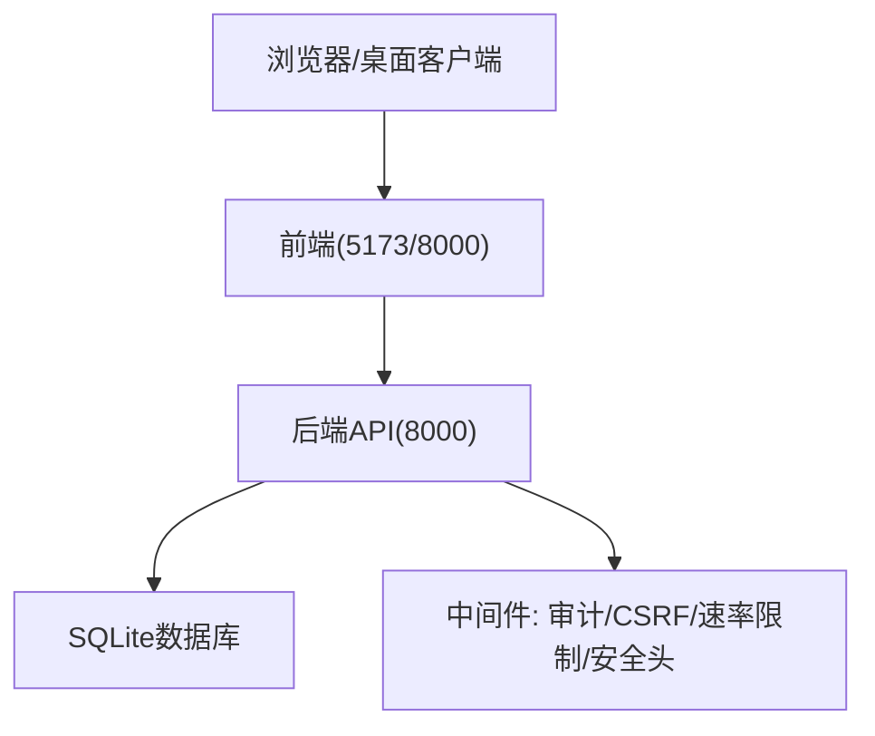
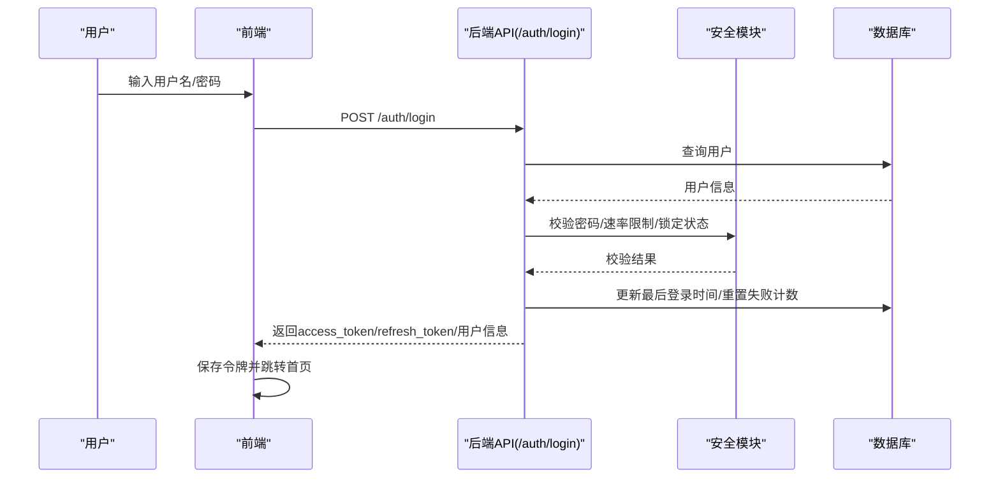
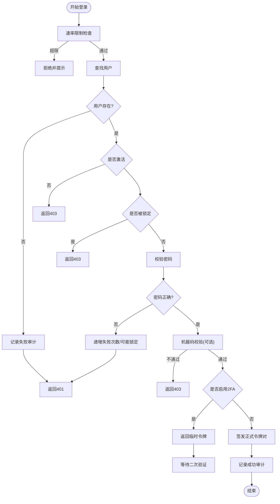
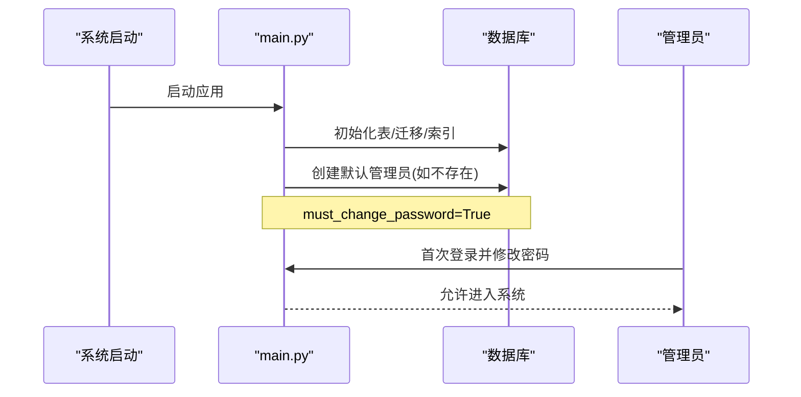
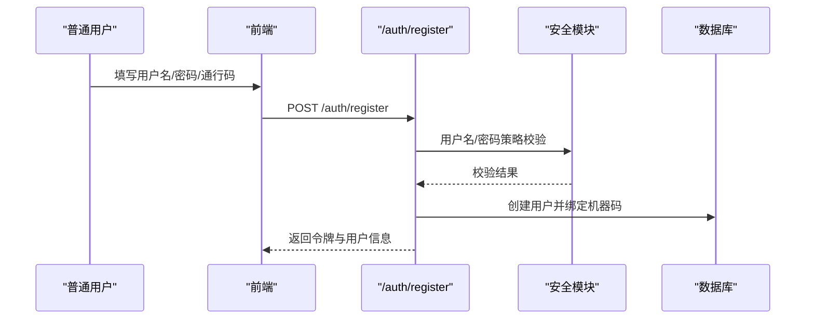
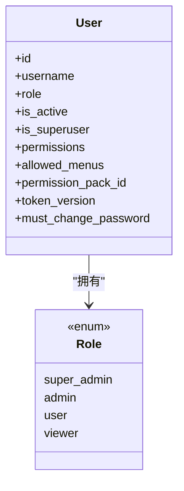
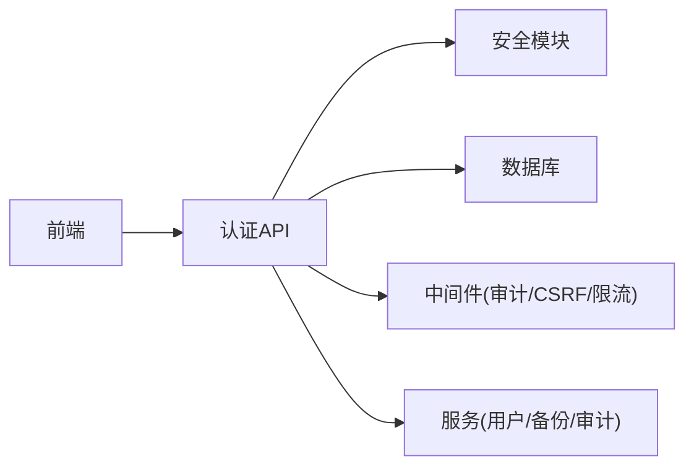

# 快速开始

<cite>
**本文引用的文件**
- [README.md](file://README.md)
- [启动指南.md](file://docs/01-快速开始/启动指南.md)
- [使用指南.md](file://docs/02-用户手册/使用指南.md)
- [后端主入口 main.py](file://backend/app/main.py)
- [认证 API auth.py](file://backend/app/api/v1/auth/auth.py)
- [安全模块 security.py](file://backend/app/core/security.py)
- [用户模型 user.py](file://backend/app/models/user.py)
</cite>

## 目录
1. [简介](#简介)
2. [项目结构（与快速上手相关）](#项目结构与快速上手相关)
3. [核心组件概览](#核心组件概览)
4. [架构总览](#架构总览)
5. [详细组件分析](#详细组件分析)
6. [依赖关系分析](#依赖关系分析)
7. [性能注意事项](#性能注意事项)
8. [故障排查指南](#故障排查指南)
9. [结论](#结论)
10. [附录：15分钟上手清单](#附录15分钟上手清单)

## 简介
本快速开始指南面向首次接触“乡村振兴帮扶管理信息系统”的用户，目标是帮助你在15分钟内完成系统安装、登录、初始设置与基础功能体验。内容涵盖：
- 一键启动与环境要求
- 管理员初始化与默认账号
- 普通用户注册与权限说明
- 界面导航与常用操作入口
- 常见问题定位方法

## 项目结构（与快速上手相关）
- 前端：Vue 3 + TypeScript + Vite，开发端口默认 5173，生产可通过后端静态资源托管访问
- 后端：FastAPI + SQLAlchemy，默认端口 8000，提供 RESTful API 与 Swagger 文档
- 桌面壳：Electron，打包为离线单机应用，开箱即用
- 数据库：SQLite，数据文件位于后端 data 目录

**图表来源**
- [后端主入口 main.py:98-179](file://backend/app/main.py#L98-L179)
- [启动指南.md:169-179](file://docs/01-快速开始/启动指南.md#L169-L179)

**章节来源**
- [README.md:30-80](file://README.md#L30-L80)
- [启动指南.md:107-179](file://docs/01-快速开始/启动指南.md#L107-L179)

## 核心组件概览
- 认证与授权：JWT 双令牌、密码策略、账户锁定、机器码绑定、可选双因素认证
- 用户与角色：内置四角色（超级管理员/管理员/普通用户/访客），支持菜单与权限包
- 系统初始化：首次启动自动创建默认管理员，支持通过接口进行系统初始化配置
- 备份与恢复：支持加密备份、定时任务、导入导出
- 监控与审计：请求日志、慢查询、审计事件、健康检查

**章节来源**
- [安全模块 security.py:92-105](file://backend/app/core/security.py#L92-L105)
- [认证 API auth.py:101-287](file://backend/app/api/v1/auth/auth.py#L101-L287)
- [后端主入口 main.py:66-96](file://backend/app/main.py#L66-L96)

## 架构总览
下图展示了从浏览器到后端的核心调用链，包括登录、鉴权、会话管理与审计。

**图表来源**
- [认证 API auth.py:101-287](file://backend/app/api/v1/auth/auth.py#L101-L287)
- [安全模块 security.py:243-336](file://backend/app/core/security.py#L243-L336)

## 详细组件分析

### 登录流程（含双因素与锁定保护）
- 登录前速率限制：同一IP每分钟最多5次尝试
- 校验用户存在性、激活状态、账户锁定状态
- 密码校验失败时记录失败次数并可能锁定账户
- 支持机器码绑定校验
- 若启用双因素认证，先返回临时令牌，再验证验证码后签发正式令牌
- 成功后生成 access_token 与 refresh_token，并记录审计日志

**图表来源**
- [认证 API auth.py:101-287](file://backend/app/api/v1/auth/auth.py#L101-L287)
- [认证 API auth.py:290-444](file://backend/app/api/v1/auth/auth.py#L290-L444)

**章节来源**
- [认证 API auth.py:101-287](file://backend/app/api/v1/auth/auth.py#L101-L287)
- [认证 API auth.py:290-444](file://backend/app/api/v1/auth/auth.py#L290-L444)

### 管理员初始化与默认账号
- 首次启动会自动创建默认管理员账户，并强制首次登录修改密码
- 支持通过环境变量注入强密码；未设置时使用出厂默认值
- 支持通过系统初始化接口完成组织信息与管理员配置（已初始化则拒绝重复初始化）
- 支持管理员重置初始化（需确认口令与管理员密码）

**图表来源**
- [后端主入口 main.py:66-96](file://backend/app/main.py#L66-L96)
- [后端主入口 main.py:666-739](file://backend/app/main.py#L666-L739)

**章节来源**
- [后端主入口 main.py:666-739](file://backend/app/main.py#L666-L739)
- [使用指南.md:94-112](file://docs/02-用户手册/使用指南.md#L94-L112)

### 普通用户注册与权限
- 普通用户通过“通行码”注册，注册成功后绑定当前机器
- 注册过程包含速率限制、用户名格式校验、密码策略校验
- 权限体系基于角色与权限包，支持菜单可见性控制

**图表来源**
- [认证 API auth.py:750-800](file://backend/app/api/v1/auth/auth.py#L750-L800)
- [安全模块 security.py:524-590](file://backend/app/core/security.py#L524-L590)

**章节来源**
- [认证 API auth.py:750-800](file://backend/app/api/v1/auth/auth.py#L750-L800)
- [安全模块 security.py:524-590](file://backend/app/core/security.py#L524-L590)

### 权限与角色模型
- 四角色：super_admin、admin、user、viewer
- 用户可绑定权限包，菜单可见性优先级：allowed_menus > 权限包 > 角色默认
- 支持 token_version 机制实现强制下线与批量失效

**图表来源**
- [用户模型 user.py:26-85](file://backend/app/models/user.py#L26-L85)
- [安全模块 security.py:92-105](file://backend/app/core/security.py#L92-L105)

**章节来源**
- [用户模型 user.py:26-85](file://backend/app/models/user.py#L26-L85)
- [安全模块 security.py:92-105](file://backend/app/core/security.py#L92-L105)

### 界面导航与常用功能入口
- 侧边栏导航：帮扶村管理、数据管理、经费管理、地图可视化、系统管理等
- 数据导入：下载模板→填写→上传→查看结果
- 数据导出：按筛选条件导出Excel或PDF
- 备份管理：创建备份、定时备份、恢复与清理

**章节来源**
- [使用指南.md:116-255](file://docs/02-用户手册/使用指南.md#L116-L255)

## 依赖关系分析
- 前端依赖后端API进行认证、数据读写与业务操作
- 后端依赖数据库、中间件（审计、CSRF、速率限制、安全头）与工具服务（备份、审计、锁出等）
- 认证链路贯穿安全模块、用户服务、令牌管理与黑名单校验

**图表来源**
- [后端主入口 main.py:111-179](file://backend/app/main.py#L111-L179)
- [认证 API auth.py:101-287](file://backend/app/api/v1/auth/auth.py#L101-L287)

**章节来源**
- [后端主入口 main.py:111-179](file://backend/app/main.py#L111-L179)
- [认证 API auth.py:101-287](file://backend/app/api/v1/auth/auth.py#L101-L287)

## 性能注意事项
- 登录与注册均有限速保护，避免暴力破解与滥用
- 静态资源采用长期缓存策略，提升加载性能
- 数据库迁移失败会暴露健康状态，便于运维监控
- 建议在生产环境关闭调试模式与文档端点

**章节来源**
- [认证 API auth.py:36-53](file://backend/app/api/v1/auth/auth.py#L36-L53)
- [后端主入口 main.py:205-223](file://backend/app/main.py#L205-L223)
- [后端主入口 main.py:235-257](file://backend/app/main.py#L235-L257)

## 故障排查指南
- 端口占用：修改后端或前端端口后重启
- 依赖缺失：重新安装后端/前端依赖
- 数据库初始化失败：删除旧数据库并重新初始化
- CORS错误：检查前后端CORS配置
- 无法连接后端：确认后端服务运行与防火墙设置
- 页面白屏：清除缓存并重启前端开发服务器
- 注册失败：检查通行码是否有效且未被使用

**章节来源**
- [启动指南.md:182-251](file://docs/01-快速开始/启动指南.md#L182-L251)
- [使用指南.md:316-368](file://docs/02-用户手册/使用指南.md#L316-L368)

## 结论
通过本指南，你可以在15分钟内完成系统启动、管理员初始化、普通用户注册与基本功能体验。后续可根据实际业务需求扩展组织、权限与数据管理。如遇问题，请参考故障排查部分或查阅更详细的用户手册。

## 附录：15分钟上手清单
- 环境与启动
  - 阅读系统要求与一键启动方式
  - 启动前后端服务并访问前端地址
- 管理员初始化
  - 首次登录默认管理员并修改密码
  - 如需自定义组织信息，调用系统初始化接口（仅首次）
- 普通用户注册
  - 获取管理员提供的通行码
  - 在前端注册页面提交用户名、密码与通行码
- 常用操作
  - 在侧边栏进入“帮扶村管理”“数据管理”“经费管理”“地图可视化”
  - 使用数据导入/导出与备份管理功能
- 排障
  - 遇到端口、依赖、数据库、CORS等问题，参考故障排查指南

**章节来源**
- [README.md:30-80](file://README.md#L30-L80)
- [启动指南.md:107-179](file://docs/01-快速开始/启动指南.md#L107-L179)
- [使用指南.md:94-255](file://docs/02-用户手册/使用指南.md#L94-L255)