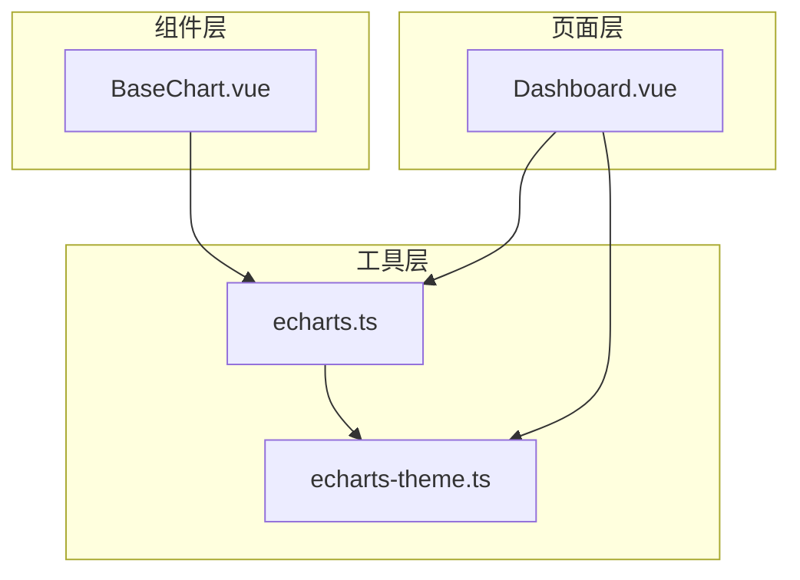
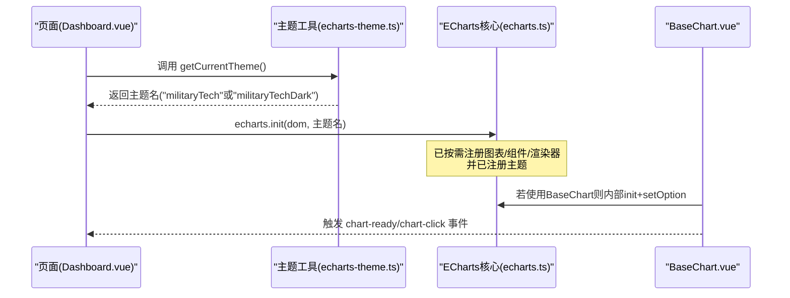
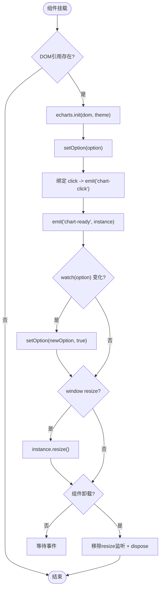
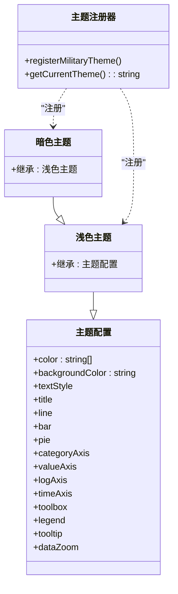
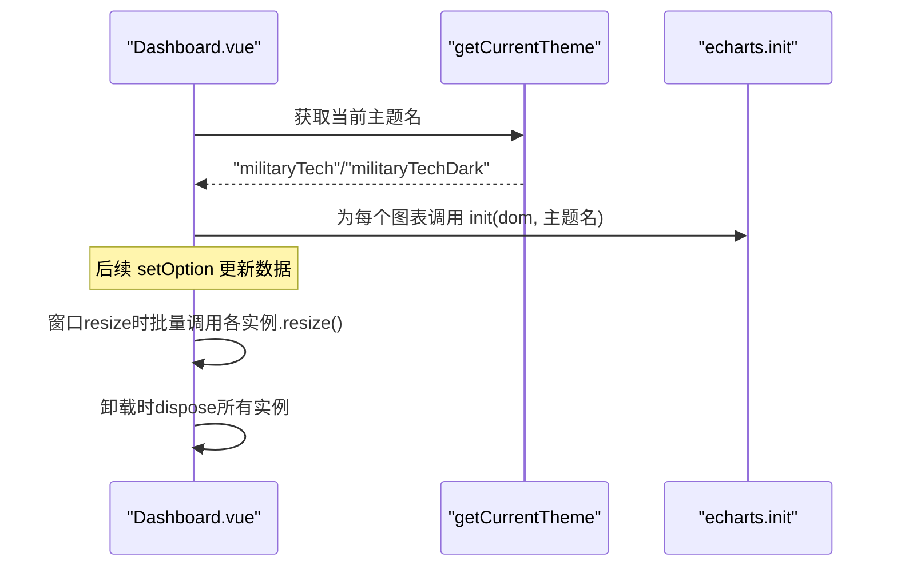
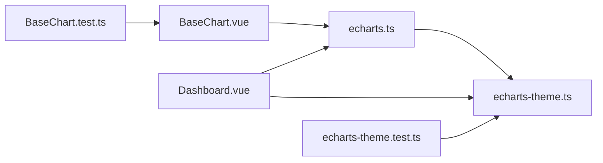

# ECharts配置与主题定制

<cite>
**本文引用的文件**
- [BaseChart.vue](file://frontend/src/components/common/BaseChart.vue)
- [echarts.ts](file://frontend/src/utils/echarts.ts)
- [echarts-theme.ts](file://frontend/src/utils/echarts-theme.ts)
- [Dashboard.vue](file://frontend/src/views/analytics/dashboard/Dashboard.vue)
- [BaseChart.test.ts](file://frontend/tests/unit/components/common/BaseChart.test.ts)
- [echarts-theme.test.ts](file://frontend/tests/unit/utils/echarts-theme.test.ts)
</cite>

## 目录
1. [简介](#简介)
2. [项目结构](#项目结构)
3. [核心组件](#核心组件)
4. [架构总览](#架构总览)
5. [详细组件分析](#详细组件分析)
6. [依赖关系分析](#依赖关系分析)
7. [性能考量](#性能考量)
8. [故障排查指南](#故障排查指南)
9. [结论](#结论)
10. [附录：配置示例与最佳实践](#附录配置示例与最佳实践)

## 简介
本技术文档聚焦于前端 ECharts 的配置与主题定制，围绕 BaseChart 通用图表组件、ECharts 按需注册机制以及“科技风”主题系统展开。文档将说明：
- BaseChart 组件的属性参数、生命周期与事件处理
- 颜色系统与主题设计原理（浅色/暗色）
- 响应式主题切换与动态更新机制
- 基础、高级与性能优化三类配置思路
- 如何扩展自定义主题（颜色变量、样式覆盖、主题注册）
- 常见问题与最佳实践

## 项目结构
本项目在 frontend 中通过统一入口对 ECharts 进行按需注册并预注册主题，业务页面通过 BaseChart 或直接在 DOM 上初始化图表实例。关键路径如下：
- 组件层：BaseChart 封装了初始化、尺寸控制、响应式 resize、事件透传等能力
- 工具层：echarts.ts 负责按需引入图表类型、组件与渲染器；echarts-theme.ts 定义并注册主题
- 页面层：Dashboard 等页面使用 getCurrentTheme 获取当前主题名，并在初始化时传入 echarts.init

图示来源
- [BaseChart.vue:1-89](file://frontend/src/components/common/BaseChart.vue#L1-L89)
- [echarts.ts:1-37](file://frontend/src/utils/echarts.ts#L1-L37)
- [echarts-theme.ts:1-474](file://frontend/src/utils/echarts-theme.ts#L1-L474)
- [Dashboard.vue:850-873](file://frontend/src/views/analytics/dashboard/Dashboard.vue#L850-L873)

章节来源
- [BaseChart.vue:1-89](file://frontend/src/components/common/BaseChart.vue#L1-L89)
- [echarts.ts:1-37](file://frontend/src/utils/echarts.ts#L1-L37)
- [echarts-theme.ts:1-474](file://frontend/src/utils/echarts-theme.ts#L1-L474)
- [Dashboard.vue:850-873](file://frontend/src/views/analytics/dashboard/Dashboard.vue#L850-L873)

## 核心组件
- BaseChart 组件
  - 作用：统一封装 ECharts 实例的创建、配置注入、事件监听、尺寸自适应与销毁
  - 关键属性：option、width、height、theme、autoResize
  - 关键行为：挂载后初始化实例、监听 option 变化并 setOption、窗口 resize 时调用 resize、卸载时 dispose
  - 暴露方法：getChart、resize
- ECharts 按需注册
  - 仅引入需要的图表类型、组件与 CanvasRenderer，避免全量打包
  - 在模块顶层调用 registerMilitaryTheme，确保主题可用
- 主题系统
  - 提供浅色与暗色两套主题，名称分别为 militaryTech 与 militaryTechDark
  - 通过 getCurrentTheme 读取 document.documentElement 的 data-theme 决定当前主题
  - 导出 COLOR_PALETTE 及品牌色常量，供外部直接使用

章节来源
- [BaseChart.vue:9-22](file://frontend/src/components/common/BaseChart.vue#L9-L22)
- [BaseChart.vue:32-76](file://frontend/src/components/common/BaseChart.vue#L32-L76)
- [echarts.ts:15-34](file://frontend/src/utils/echarts.ts#L15-L34)
- [echarts-theme.ts:166-474](file://frontend/src/utils/echarts-theme.ts#L166-L474)

## 架构总览
下图展示了从页面到组件再到主题注册的完整数据与控制流。

图示来源
- [Dashboard.vue:850-873](file://frontend/src/views/analytics/dashboard/Dashboard.vue#L850-L873)
- [echarts-theme.ts:458-464](file://frontend/src/utils/echarts-theme.ts#L458-L464)
- [echarts.ts:15-34](file://frontend/src/utils/echarts.ts#L15-L34)
- [BaseChart.vue:32-43](file://frontend/src/components/common/BaseChart.vue#L32-L43)

## 详细组件分析

### BaseChart 组件分析
- 属性与默认值
  - option：必填，ECharts 配置对象
  - width/height：字符串尺寸，默认 100%/400px
  - theme：可选的主题名，默认空串（使用默认主题）
  - autoResize：是否监听 window resize，默认 true
- 生命周期与事件
  - onMounted：nextTick 后 init 实例、setOption、绑定 click 事件、emit chart-ready
  - watch(option)：深度监听，变更时 setOption(newOption, true)
  - onUnmounted：移除 resize 监听、dispose 实例
- 对外暴露
  - getChart：获取底层 ECharts 实例
  - resize：手动触发 resize

图示来源
- [BaseChart.vue:32-76](file://frontend/src/components/common/BaseChart.vue#L32-L76)

章节来源
- [BaseChart.vue:9-22](file://frontend/src/components/common/BaseChart.vue#L9-L22)
- [BaseChart.vue:32-76](file://frontend/src/components/common/BaseChart.vue#L32-L76)
- [BaseChart.test.ts:31-119](file://frontend/tests/unit/components/common/BaseChart.test.ts#L31-L119)

### 主题系统与颜色体系
- 颜色体系
  - 16 色色板，覆盖多系列场景（柱图、饼图等）
  - 品牌主色、振兴绿、点缀金作为核心标识
- 主题定义
  - 浅色主题：干净克制，低饱和度，坐标轴/网格线/Tooltip 简洁
  - 暗色主题：在浅色基础上调整文本、轴线、网格线与提示辅助线颜色
- 主题注册与选择
  - registerMilitaryTheme：幂等注册两个主题名
  - getCurrentTheme：根据 data-theme 自动选择主题名
  - 页面初始化时传入主题名给 echarts.init

图示来源
- [echarts-theme.ts:49-160](file://frontend/src/utils/echarts-theme.ts#L49-L160)
- [echarts-theme.ts:166-427](file://frontend/src/utils/echarts-theme.ts#L166-L427)
- [echarts-theme.ts:443-464](file://frontend/src/utils/echarts-theme.ts#L443-L464)

章节来源
- [echarts-theme.ts:25-43](file://frontend/src/utils/echarts-theme.ts#L25-L43)
- [echarts-theme.ts:166-427](file://frontend/src/utils/echarts-theme.ts#L166-L427)
- [echarts-theme.ts:443-464](file://frontend/src/utils/echarts-theme.ts#L443-L464)
- [echarts-theme.test.ts:30-76](file://frontend/tests/unit/utils/echarts-theme.test.ts#L30-L76)

### 页面集成与动态主题切换
- Dashboard 页面在初始化多个图表时，统一通过 getCurrentTheme 获取主题名并传入 echarts.init
- 页面维护多个图表实例，并在窗口 resize 时批量调用 resize
- 卸载时统一 dispose 所有实例，释放资源

图示来源
- [Dashboard.vue:850-873](file://frontend/src/views/analytics/dashboard/Dashboard.vue#L850-L873)
- [Dashboard.vue:915-955](file://frontend/src/views/analytics/dashboard/Dashboard.vue#L915-L955)

章节来源
- [Dashboard.vue:850-873](file://frontend/src/views/analytics/dashboard/Dashboard.vue#L850-L873)
- [Dashboard.vue:915-955](file://frontend/src/views/analytics/dashboard/Dashboard.vue#L915-L955)

## 依赖关系分析
- BaseChart 依赖 echarts.ts 提供的按需实例化能力
- echarts.ts 依赖 echarts-theme.ts 完成主题注册
- 页面直接依赖 echarts-theme.ts 的主题选择函数
- 测试用例验证 BaseChart 的行为与主题注册的正确性

图示来源
- [BaseChart.vue:7-8](file://frontend/src/components/common/BaseChart.vue#L7-L8)
- [echarts.ts:15-34](file://frontend/src/utils/echarts.ts#L15-L34)
- [Dashboard.vue:850-873](file://frontend/src/views/analytics/dashboard/Dashboard.vue#L850-L873)
- [BaseChart.test.ts:1-121](file://frontend/tests/unit/components/common/BaseChart.test.ts#L1-L121)
- [echarts-theme.test.ts:1-78](file://frontend/tests/unit/utils/echarts-theme.test.ts#L1-L78)

章节来源
- [BaseChart.vue:7-8](file://frontend/src/components/common/BaseChart.vue#L7-L8)
- [echarts.ts:15-34](file://frontend/src/utils/echarts.ts#L15-L34)
- [Dashboard.vue:850-873](file://frontend/src/views/analytics/dashboard/Dashboard.vue#L850-L873)
- [BaseChart.test.ts:1-121](file://frontend/tests/unit/components/common/BaseChart.test.ts#L1-L121)
- [echarts-theme.test.ts:1-78](file://frontend/tests/unit/utils/echarts-theme.test.ts#L1-L78)

## 性能考量
- 按需引入：仅注册所需图表类型、组件与渲染器，减少包体积与初始化开销
- 主题注册幂等：避免重复注册带来的额外成本
- 响应式优化：BaseChart 支持 autoResize，页面级也可集中管理 resize
- 内存管理：组件卸载时主动 dispose 实例，防止内存泄漏
- 数据更新策略：通过 setOption(newOption, true) 合并更新，减少重绘

[本节为通用指导，不直接分析具体文件]

## 故障排查指南
- 图表未显示或尺寸异常
  - 检查容器是否有宽高；BaseChart 默认高度 400px，可自定义 width/height
  - 确认 mounted 后再初始化，或在 nextTick 后执行
- 主题未生效
  - 确认已在应用启动时调用 registerMilitaryTheme
  - 页面初始化时传入正确的主题名（militaryTech/militaryTechDark）
  - 检查根节点 data-theme 是否为 dark
- 事件未触发
  - BaseChart 会转发 click 事件为 chart-click；确保父组件正确监听
- 内存泄漏
  - 确保组件卸载时 dispose 实例；页面级多实例需统一清理
- 单元测试参考
  - BaseChart 行为与主题注册均有对应单测覆盖，可作为对照

章节来源
- [BaseChart.vue:59-76](file://frontend/src/components/common/BaseChart.vue#L59-L76)
- [echarts-theme.ts:443-464](file://frontend/src/utils/echarts-theme.ts#L443-L464)
- [BaseChart.test.ts:31-119](file://frontend/tests/unit/components/common/BaseChart.test.ts#L31-L119)
- [echarts-theme.test.ts:30-76](file://frontend/tests/unit/utils/echarts-theme.test.ts#L30-L76)

## 结论
本项目通过 BaseChart 统一封装图表生命周期与交互，结合按需注册与“科技风”主题系统，实现了高内聚、易扩展、可维护的可视化方案。主题系统以浅色/暗色双模式为核心，配合全局 data-theme 实现响应式切换；页面侧通过 getCurrentTheme 保证主题一致性。整体架构清晰、职责分明，便于后续扩展更多主题与图表能力。

[本节为总结性内容，不直接分析具体文件]

## 附录：配置示例与最佳实践
- 基础配置
  - 使用 BaseChart 传入 option、设置 width/height、可选 theme
  - 在页面中通过 getCurrentTheme 获取主题名并传给 echarts.init
- 高级配置
  - 在 option 中精细化配置坐标轴、图例、提示框、缩放等
  - 利用 BaseChart 的 chart-ready 事件获取实例进行高级操作
- 性能优化配置
  - 启用按需注册（已在工具层完成）
  - 合理设置 series 数据量与动画开关
  - 使用 setOption 合并更新，避免频繁重建实例
- 扩展自定义主题
  - 在 echarts-theme.ts 中新增主题配置对象
  - 通过 registerMilitaryTheme 或自行调用 echarts.registerTheme 注册新主题
  - 在页面中使用新的主题名初始化图表
- 常见注意事项
  - 保持主题色板与 UI 设计一致
  - 暗色模式下注意对比度与可读性
  - 多实例页面统一管理与清理

[本节为通用指导，不直接分析具体文件]