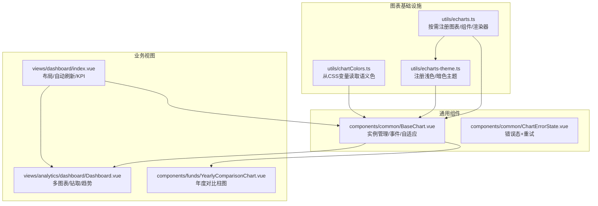
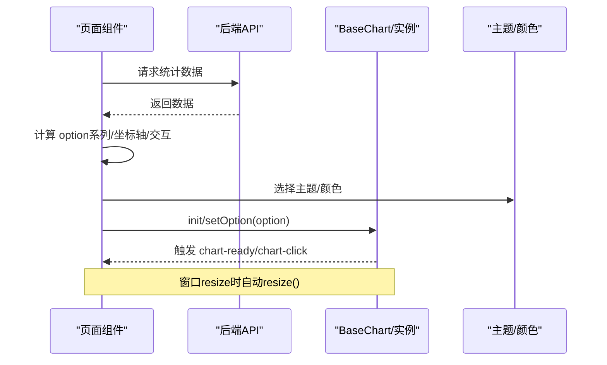
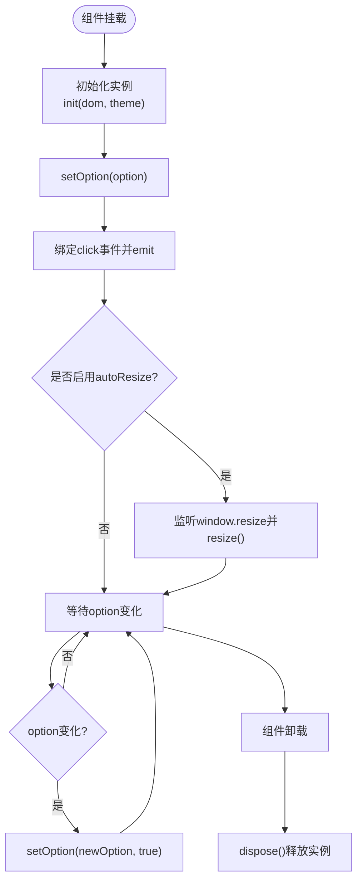
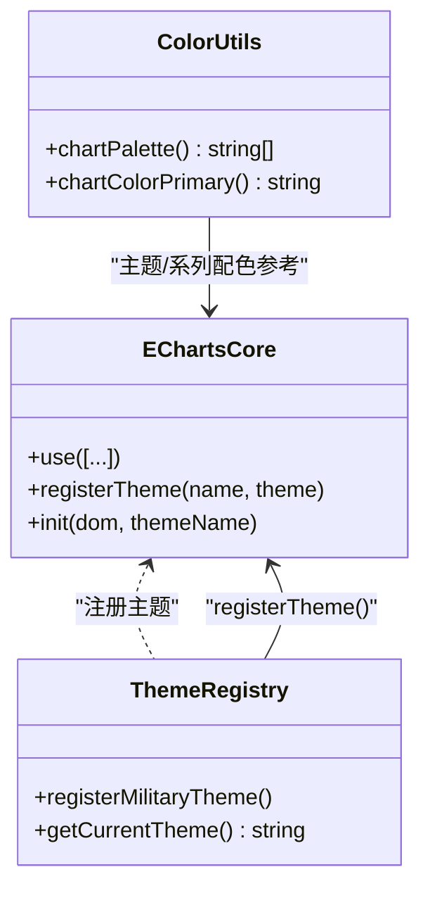
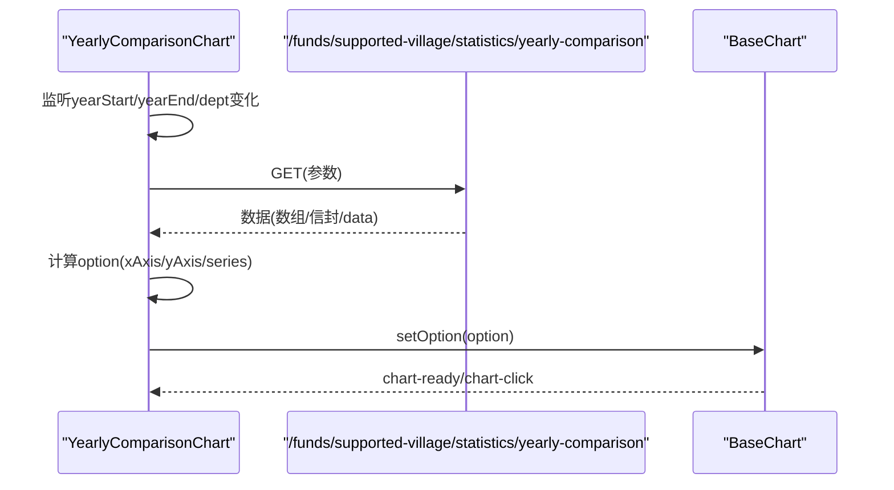
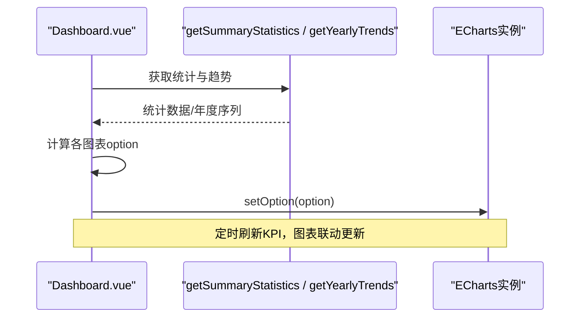
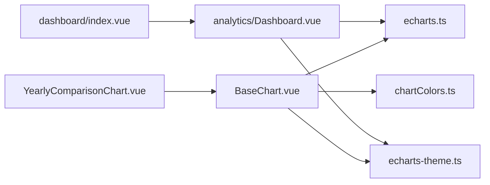

# 可视化图表定制

<cite>
**本文引用的文件**
- [BaseChart.vue](file://frontend/src/components/common/BaseChart.vue)
- [echarts.ts](file://frontend/src/utils/echarts.ts)
- [echarts-theme.ts](file://frontend/src/utils/echarts-theme.ts)
- [chartColors.ts](file://frontend/src/utils/chartColors.ts)
- [YearlyComparisonChart.vue](file://frontend/src/components/funds/YearlyComparisonChart.vue)
- [ChartErrorState.vue](file://frontend/src/components/common/ChartErrorState.vue)
- [dashboard/index.vue](file://frontend/src/views/dashboard/index.vue)
- [analytics/Dashboard.vue](file://frontend/src/views/analytics/dashboard/Dashboard.vue)
</cite>

## 目录
1. [简介](#简介)
2. [项目结构](#项目结构)
3. [核心组件](#核心组件)
4. [架构总览](#架构总览)
5. [详细组件分析](#详细组件分析)
6. [依赖关系分析](#依赖关系分析)
7. [性能考虑](#性能考虑)
8. [故障排查指南](#故障排查指南)
9. [结论](#结论)
10. [附录](#附录)

## 简介
本指南面向使用 ECharts 构建可视化图表的前端工程师与产品/设计人员，结合本项目在乡村振兴管理系统中的实际实现，系统讲解：
- ECharts 的按需引入、主题注册与颜色体系
- 通用图表容器与响应式适配
- 数据驱动的配置生成、动态更新与实时刷新
- 业务图表（年度对比、仪表盘趋势等）的实现范式与最佳实践
- 可访问性与国际化配置要点
- 大数据量渲染、内存管理与渲染性能调优策略

## 项目结构
前端采用 Vue + TypeScript 工程化方案，ECharts 通过统一入口按需注册图表类型与组件，并提供“科技风”主题。通用图表容器 BaseChart 封装了实例生命周期、事件透传与自动缩放；业务图表组件基于该容器或直连 ECharts 实例完成数据到配置的转换与渲染。

图示来源
- [echarts.ts:1-37](file://frontend/src/utils/echarts.ts#L1-L37)
- [echarts-theme.ts:16-474](file://frontend/src/utils/echarts-theme.ts#L16-L474)
- [BaseChart.vue:1-89](file://frontend/src/components/common/BaseChart.vue#L1-L89)
- [dashboard/index.vue:1-501](file://frontend/src/views/dashboard/index.vue#L1-L501)
- [analytics/Dashboard.vue:1-800](file://frontend/src/views/analytics/dashboard/Dashboard.vue#L1-L800)

章节来源
- [echarts.ts:1-37](file://frontend/src/utils/echarts.ts#L1-L37)
- [echarts-theme.ts:16-474](file://frontend/src/utils/echarts-theme.ts#L16-L474)
- [BaseChart.vue:1-89](file://frontend/src/components/common/BaseChart.vue#L1-L89)

## 核心组件
- 统一 ECharts 入口：按需注册常用图表类型与组件，避免全量引入带来的体积膨胀；同时注册品牌主题，确保全局视觉一致。
- 主题系统：提供浅色与暗色两套主题，支持根据 DOM 属性自动切换；内置品牌色板与统一的坐标轴、提示框、工具箱样式。
- 通用图表容器：封装初始化、选项监听、点击事件透传、窗口 resize 自适应与销毁释放，暴露 getChart/resize 方法供父级调用。
- 错误状态组件：以就地展示错误信息并支持重试的方式提升用户体验，避免全局弹窗打断用户操作。
- 业务图表示例：年度对比柱状图、仪表盘多图表组合（饼图、堆叠柱图、折线面积图等），演示数据到配置的映射与交互。

章节来源
- [echarts.ts:1-37](file://frontend/src/utils/echarts.ts#L1-L37)
- [echarts-theme.ts:16-474](file://frontend/src/utils/echarts-theme.ts#L16-L474)
- [BaseChart.vue:1-89](file://frontend/src/components/common/BaseChart.vue#L1-L89)
- [ChartErrorState.vue:1-54](file://frontend/src/components/common/ChartErrorState.vue#L1-L54)
- [YearlyComparisonChart.vue:1-79](file://frontend/src/components/funds/YearlyComparisonChart.vue#L1-L79)
- [analytics/Dashboard.vue:1-800](file://frontend/src/views/analytics/dashboard/Dashboard.vue#L1-L800)

## 架构总览
下图展示了从页面到图表渲染的关键路径：页面触发数据加载 → 计算 ECharts 配置 → 通过 BaseChart 或直接实例 setOption → 主题与颜色体系生效 → 事件回调与自适应更新。

图示来源
- [BaseChart.vue:32-76](file://frontend/src/components/common/BaseChart.vue#L32-L76)
- [echarts-theme.ts:443-464](file://frontend/src/utils/echarts-theme.ts#L443-L464)
- [dashboard/index.vue:217-237](file://frontend/src/views/dashboard/index.vue#L217-L237)
- [analytics/Dashboard.vue:750-800](file://frontend/src/views/analytics/dashboard/Dashboard.vue#L750-L800)

## 详细组件分析

### BaseChart 通用图表容器
- 职责：创建 ECharts 实例、设置初始配置、监听 option 变化、转发 click 事件、处理窗口 resize、组件卸载时销毁实例。
- 关键能力：
  - 支持传入 width/height/theme/autoResize 等属性
  - 通过 watch 深度监听 option 变更，调用 setOption(newOption, true) 合并更新
  - 暴露 getChart/resize 方法，便于外部控制
- 适用场景：所有需要复用实例生命周期与自适应能力的图表组件

图示来源
- [BaseChart.vue:32-76](file://frontend/src/components/common/BaseChart.vue#L32-L76)

章节来源
- [BaseChart.vue:1-89](file://frontend/src/components/common/BaseChart.vue#L1-L89)

### ECharts 按需注册与主题
- 按需注册：仅引入需要的图表类型与组件，减少打包体积，提高首屏性能。
- 主题注册：提供“科技风”浅色与暗色主题，支持按 data-theme 自动切换；主题覆盖标题、坐标轴、图例、提示框、工具栏、缩放条等默认样式。
- 颜色体系：提供品牌色板与语义色工具，保证图表颜色与全局设计令牌一致。

图示来源
- [echarts.ts:15-34](file://frontend/src/utils/echarts.ts#L15-L34)
- [echarts-theme.ts:443-464](file://frontend/src/utils/echarts-theme.ts#L443-L464)
- [chartColors.ts:8-41](file://frontend/src/utils/chartColors.ts#L8-L41)

章节来源
- [echarts.ts:1-37](file://frontend/src/utils/echarts.ts#L1-L37)
- [echarts-theme.ts:16-474](file://frontend/src/utils/echarts-theme.ts#L16-L474)
- [chartColors.ts:1-42](file://frontend/src/utils/chartColors.ts#L1-L42)

### 年度对比柱状图（YearlyComparisonChart）
- 数据流：监听 props 变化 → 发起 GET 请求 → 兼容多种响应格式 → 转换为 ECharts 配置 → 渲染柱状图。
- 交互与状态：加载中骨架屏、空数据占位、错误态内联显示并支持重试。
- 可复用点：通过 BaseChart 统一管理实例与自适应；错误态组件统一错误呈现。

图示来源
- [YearlyComparisonChart.vue:28-77](file://frontend/src/components/funds/YearlyComparisonChart.vue#L28-L77)
- [BaseChart.vue:32-76](file://frontend/src/components/common/BaseChart.vue#L32-L76)

章节来源
- [YearlyComparisonChart.vue:1-79](file://frontend/src/components/funds/YearlyComparisonChart.vue#L1-L79)
- [ChartErrorState.vue:1-54](file://frontend/src/components/common/ChartErrorState.vue#L1-L54)

### 仪表盘多图表（Analytics Dashboard）
- 功能：KPI 统计卡片、地域分布饼图、投入构成饼图、年度趋势对比（柱+线）、微型趋势 Sparkline。
- 数据源：聚合统计接口与年度趋势接口，支持年份筛选与部门/地域过滤。
- 交互：Tooltip 自定义格式化、图例定位、双 Y 轴、渐变面积、平滑曲线。
- 刷新：定时器每 60 秒刷新 KPI；图表随数据更新自动重绘。

图示来源
- [analytics/Dashboard.vue:222-800](file://frontend/src/views/analytics/dashboard/Dashboard.vue#L222-L800)
- [dashboard/index.vue:217-237](file://frontend/src/views/dashboard/index.vue#L217-L237)

章节来源
- [analytics/Dashboard.vue:1-800](file://frontend/src/views/analytics/dashboard/Dashboard.vue#L1-L800)
- [dashboard/index.vue:1-501](file://frontend/src/views/dashboard/index.vue#L1-L501)

## 依赖关系分析
- 模块耦合：
  - BaseChart 依赖 echarts 入口与主题，解耦具体业务配置
  - 业务组件依赖 BaseChart 或直连 ECharts 实例，负责数据→配置映射
  - 主题与颜色工具被多处复用，保证视觉一致性
- 外部依赖：
  - Element Plus 用于 UI 控件与图标
  - ECharts 按需引入，降低包体
- 潜在循环：
  - echarts.ts 顶层调用主题注册函数，主题模块直接引用 echarts/core，避免循环依赖

图示来源
- [BaseChart.vue:1-89](file://frontend/src/components/common/BaseChart.vue#L1-L89)
- [echarts.ts:1-37](file://frontend/src/utils/echarts.ts#L1-L37)
- [echarts-theme.ts:16-474](file://frontend/src/utils/echarts-theme.ts#L16-L474)
- [chartColors.ts:1-42](file://frontend/src/utils/chartColors.ts#L1-L42)
- [YearlyComparisonChart.vue:1-79](file://frontend/src/components/funds/YearlyComparisonChart.vue#L1-L79)
- [analytics/Dashboard.vue:1-800](file://frontend/src/views/analytics/dashboard/Dashboard.vue#L1-L800)
- [dashboard/index.vue:1-501](file://frontend/src/views/dashboard/index.vue#L1-L501)

章节来源
- [echarts.ts:1-37](file://frontend/src/utils/echarts.ts#L1-L37)
- [echarts-theme.ts:16-474](file://frontend/src/utils/echarts-theme.ts#L16-L474)
- [BaseChart.vue:1-89](file://frontend/src/components/common/BaseChart.vue#L1-L89)

## 性能考虑
- 按需引入与树摇：仅注册所需图表类型与组件，显著减小包体，缩短解析时间。
- 实例复用与正确销毁：BaseChart 在卸载时 dispose 实例，避免内存泄漏；watch option 时使用合并模式减少重绘。
- 大数据量优化建议：
  - 合理分页/采样：对超长时序或海量分类数据，前端做采样或分片展示
  - 关闭不必要动画：大数据集上禁用或缩短动画时长
  - 使用 dataZoom：对长列表进行区域缩放浏览
  - 避免重复计算：将 option 计算结果缓存，仅在数据变化时更新
- 渲染性能调优：
  - 使用 Canvas 渲染（已启用）
  - 减少复杂图形与阴影：如大面积渐变与多层阴影在大图上会拖慢渲染
  - 控制 Tooltip 与 Label 数量：大量标签时隐藏或精简
- 内存管理：
  - 及时移除事件监听（BaseChart 已在卸载时清理）
  - 避免闭包持有大对象引用
  - 图表容器尺寸稳定时减少频繁 resize

[本节为通用指导，不直接分析具体文件]

## 故障排查指南
- 图表空白或无渲染：
  - 检查容器是否有宽高（BaseChart 最小高度保障）
  - 确认 option 非空且 series 数据有效
  - 查看网络请求与错误态组件提示
- 主题未生效：
  - 确认已调用主题注册函数
  - 检查 data-theme 属性是否正确设置
- 事件不触发：
  - 确认 BaseChart 已 emit chart-click
  - 父组件需监听对应事件
- 内存增长：
  - 检查是否存在未销毁的 ECharts 实例
  - 确认 window.resize 监听已移除

章节来源
- [BaseChart.vue:59-76](file://frontend/src/components/common/BaseChart.vue#L59-L76)
- [ChartErrorState.vue:1-54](file://frontend/src/components/common/ChartErrorState.vue#L1-L54)
- [echarts-theme.ts:443-464](file://frontend/src/utils/echarts-theme.ts#L443-L464)

## 结论
本项目通过统一的 ECharts 入口、可复用的 BaseChart 容器、完善的主题与颜色体系，构建了高内聚、低耦合的图表基础设施。业务层聚焦数据到配置的映射与交互细节，既保证了视觉一致性，又提升了开发效率。配合合理的性能优化与错误处理策略，可在不同设备与数据规模下提供流畅的可视化体验。

[本节为总结性内容，不直接分析具体文件]

## 附录

### ECharts 配置选项与高级用法速查
- 图表类型选择：柱状、折线、饼图、散点、雷达、地图等，按需注册后直接使用
- 样式定制：通过主题覆盖默认样式，或使用 itemStyle/lineStyle/areaStyle 等局部配置
- 交互效果：tooltip 格式化、legend 定位、dataZoom 缩放、toolbox 导出/还原
- 响应式设计：BaseChart 自动 resize；页面级媒体查询调整布局
- 动态更新：watch option 并使用 setOption(newOption, true) 增量更新
- 实时刷新：定时器轮询或 WebSocket 推送，注意节流与去抖
- 主题与颜色：使用 getCurrentTheme 自动切换；chartColors 从 CSS 变量取值
- 可访问性与国际化：
  - tooltip 文案与单位本地化
  - 键盘可达性与屏幕阅读器友好（必要时添加 aria-*）
  - 多语言文本集中管理，避免硬编码

[本节为概念性说明，不直接分析具体文件]