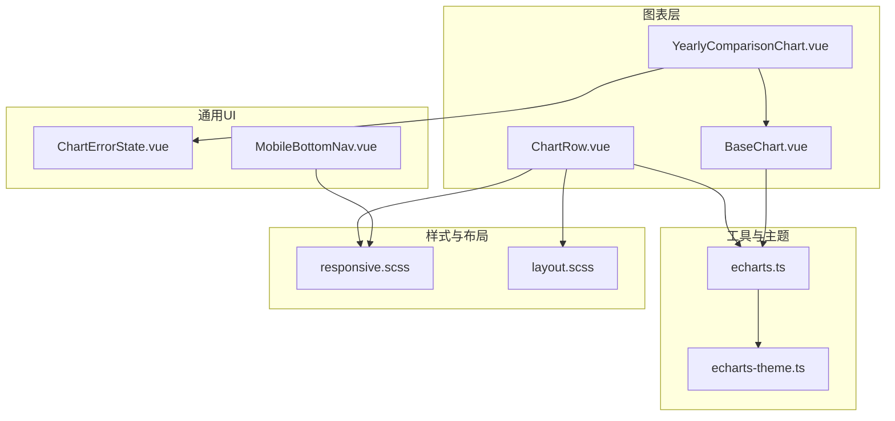
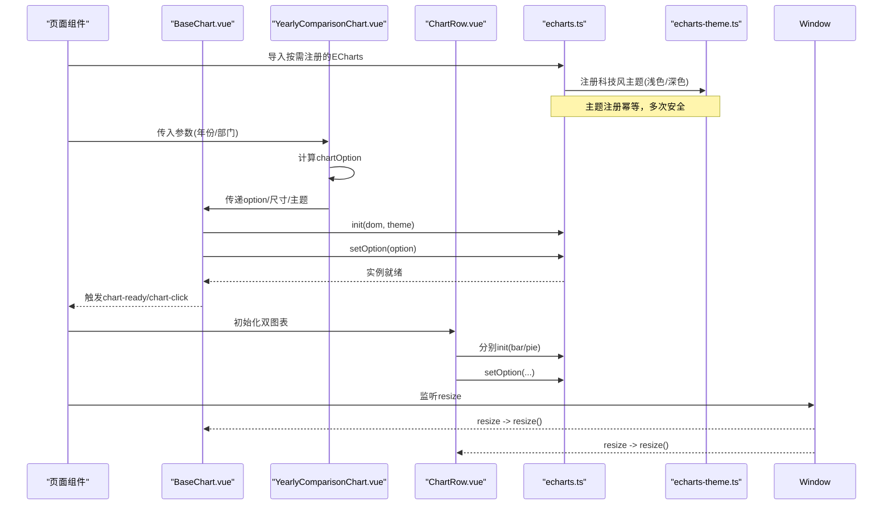
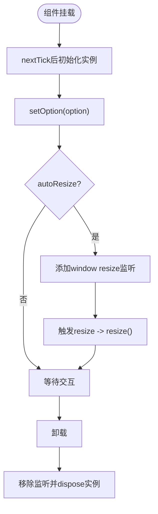
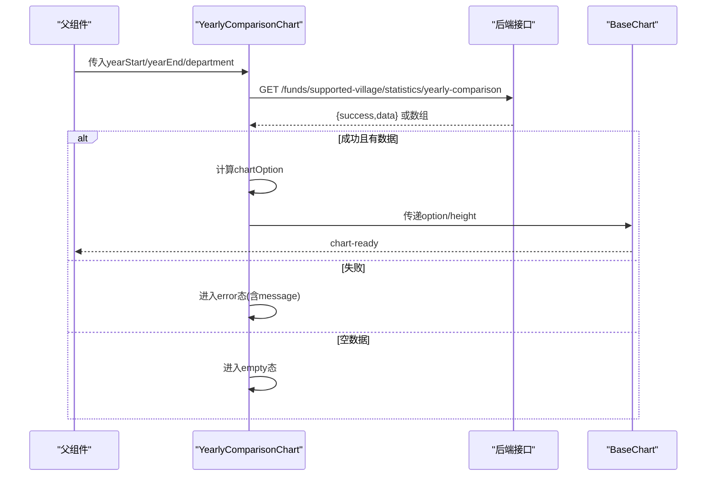
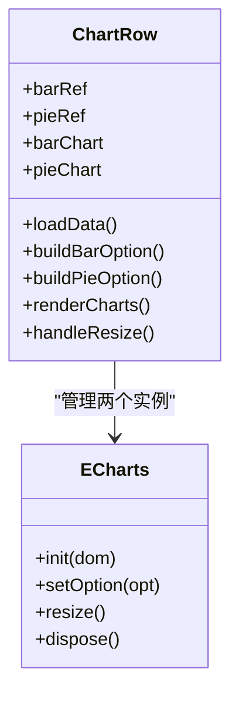
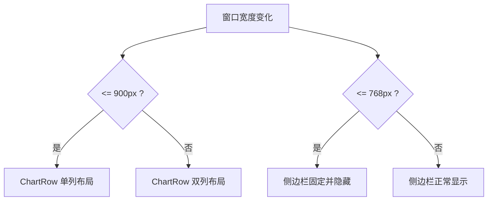
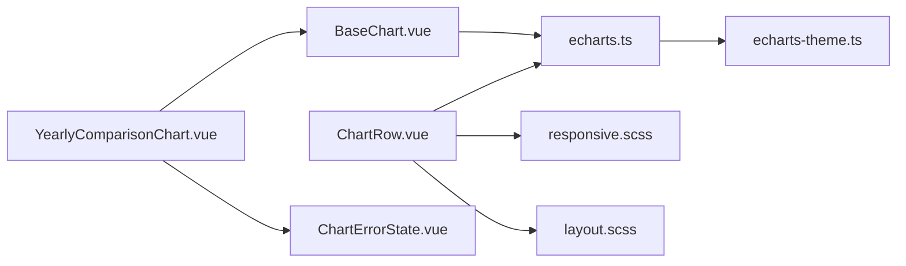

# 响应式图表设计

<cite>
**本文引用的文件**
- [BaseChart.vue](file://frontend/src/components/common/BaseChart.vue)
- [YearlyComparisonChart.vue](file://frontend/src/components/funds/YearlyComparisonChart.vue)
- [ChartRow.vue](file://frontend/src/views/dashboard/ChartRow.vue)
- [echarts.ts](file://frontend/src/utils/echarts.ts)
- [echarts-theme.ts](file://frontend/src/utils/echarts-theme.ts)
- [responsive.scss](file://frontend/src/styles/responsive.scss)
- [layout.scss](file://frontend/src/styles/components/layout.scss)
- [ChartErrorState.vue](file://frontend/src/components/common/ChartErrorState.vue)
- [MobileBottomNav.vue](file://frontend/src/components/layout/MobileBottomNav.vue)
</cite>

## 目录
1. [简介](#简介)
2. [项目结构](#项目结构)
3. [核心组件](#核心组件)
4. [架构总览](#架构总览)
5. [详细组件分析](#详细组件分析)
6. [依赖关系分析](#依赖关系分析)
7. [性能考虑](#性能考虑)
8. [故障排查指南](#故障排查指南)
9. [结论](#结论)
10. [附录](#附录)

## 简介
本指南围绕前端图表的响应式设计，系统说明 BaseChart 组件的自适应机制、窗口尺寸监听与重绘策略、不同屏幕尺寸的适配方案、数据加载与懒渲染优化、容器尺寸变化与动态布局处理、完整的配置示例与调试技巧，以及跨浏览器兼容性与性能监控方法。文档以仓库中实际实现的组件为依据，提供可落地的工程化实践。

## 项目结构
本项目在前端采用 Vue 3 + ECharts 的组合：
- 基础图表封装：BaseChart 统一负责实例化、事件绑定、自动缩放与生命周期管理。
- 业务图表：YearlyComparisonChart 演示数据获取、错误态与空态展示，并复用 BaseChart。
- 页面级图表：ChartRow 在仪表盘场景下直接管理多个图表实例，实现网格布局与响应式切换。
- 主题与按需引入：echarts.ts 进行按需注册与主题初始化；echarts-theme.ts 定义品牌主题与暗色模式。
- 响应式样式：responsive.scss 提供断点与媒体查询 mixin；layout.scss 提供移动端侧边栏等布局适配。
- 错误状态：ChartErrorState 提供内联错误提示与重试能力。
- 移动端导航：MobileBottomNav 演示基于 resize 的显示/隐藏逻辑。

图示来源
- [BaseChart.vue:1-89](file://frontend/src/components/common/BaseChart.vue#L1-L89)
- [YearlyComparisonChart.vue:1-79](file://frontend/src/components/funds/YearlyComparisonChart.vue#L1-L79)
- [ChartRow.vue:1-268](file://frontend/src/views/dashboard/ChartRow.vue#L1-L268)
- [echarts.ts:1-37](file://frontend/src/utils/echarts.ts#L1-L37)
- [echarts-theme.ts:1-473](file://frontend/src/utils/echarts-theme.ts#L1-L473)
- [responsive.scss:1-305](file://frontend/src/styles/responsive.scss#L1-L305)
- [layout.scss:672-709](file://frontend/src/styles/components/layout.scss#L672-L709)
- [ChartErrorState.vue:1-54](file://frontend/src/components/common/ChartErrorState.vue#L1-L54)
- [MobileBottomNav.vue:44-108](file://frontend/src/components/layout/MobileBottomNav.vue#L44-L108)

章节来源
- [BaseChart.vue:1-89](file://frontend/src/components/common/BaseChart.vue#L1-L89)
- [YearlyComparisonChart.vue:1-79](file://frontend/src/components/funds/YearlyComparisonChart.vue#L1-L79)
- [ChartRow.vue:1-268](file://frontend/src/views/dashboard/ChartRow.vue#L1-L268)
- [echarts.ts:1-37](file://frontend/src/utils/echarts.ts#L1-L37)
- [echarts-theme.ts:1-473](file://frontend/src/utils/echarts-theme.ts#L1-L473)
- [responsive.scss:1-305](file://frontend/src/styles/responsive.scss#L1-L305)
- [layout.scss:672-709](file://frontend/src/styles/components/layout.scss#L672-L709)
- [ChartErrorState.vue:1-54](file://frontend/src/components/common/ChartErrorState.vue#L1-L54)
- [MobileBottomNav.vue:44-108](file://frontend/src/components/layout/MobileBottomNav.vue#L44-L108)

## 核心组件
- BaseChart 组件
  - 职责：统一创建 ECharts 实例、设置主题与选项、监听点击事件、支持自动缩放、暴露实例与 resize 方法。
  - 自适应机制：通过 window resize 事件触发 resize()；watch option 深度监听，变更时 setOption(true) 合并更新。
  - 生命周期：mounted 后 nextTick 初始化；unmounted 移除监听并 dispose 实例，避免内存泄漏。
  - 默认尺寸：width 默认 100%，height 默认 400px，最小高度 200px，确保小屏可用。

- YearlyComparisonChart 组件
  - 职责：拉取年度对比数据，构建 ECharts 柱状图配置，使用 BaseChart 渲染。
  - 响应式数据：props 变化（年份区间、部门）触发重新加载；loading/error/empty 三态展示。
  - 错误处理：请求异常或 success:false 进入错误态，提供重试入口。

- ChartRow 组件
  - 职责：仪表盘双列图表（条形进度、经费饼图），独立管理两个 ECharts 实例。
  - 响应式布局：CSS Grid 两列，小于阈值时单列；resize 时调用各实例 resize()。
  - 数据加载：并行请求项目与资金统计，失败时置零并展示错误态，支持自动重试一次。

章节来源
- [BaseChart.vue:1-89](file://frontend/src/components/common/BaseChart.vue#L1-L89)
- [YearlyComparisonChart.vue:1-79](file://frontend/src/components/funds/YearlyComparisonChart.vue#L1-L79)
- [ChartRow.vue:1-268](file://frontend/src/views/dashboard/ChartRow.vue#L1-L268)

## 架构总览
下图展示了从页面到图表渲染的完整链路，包括主题注册、按需引入、响应式布局与事件流。

图示来源
- [echarts.ts:1-37](file://frontend/src/utils/echarts.ts#L1-L37)
- [echarts-theme.ts:433-464](file://frontend/src/utils/echarts-theme.ts#L433-L464)
- [BaseChart.vue:32-76](file://frontend/src/components/common/BaseChart.vue#L32-L76)
- [YearlyComparisonChart.vue:28-75](file://frontend/src/components/funds/YearlyComparisonChart.vue#L28-L75)
- [ChartRow.vue:167-203](file://frontend/src/views/dashboard/ChartRow.vue#L167-L203)

## 详细组件分析

### BaseChart 组件分析
- 自适应机制
  - 窗口大小监听：mounted 时根据 autoResize 开关添加 window resize 监听，调用 resize()。
  - 图表重绘：resize() 直接调用实例 resize()，由 ECharts 内部计算新尺寸并重绘。
  - 布局调整：组件根元素宽度为 props.width（默认 100%），高度为 props.height（默认 400px），最小高度 200px，保证在小容器中可见。
- 数据驱动
  - watch option 深度监听，变更后 setOption(newOption, true) 合并更新，避免重复初始化。
- 事件与暴露
  - 转发 click 事件至父组件；暴露 getChart 与 resize 方法供外部控制。
- 资源清理
  - unmounted 时移除 resize 监听并 dispose 实例，防止内存泄漏。

图示来源
- [BaseChart.vue:32-76](file://frontend/src/components/common/BaseChart.vue#L32-L76)

章节来源
- [BaseChart.vue:1-89](file://frontend/src/components/common/BaseChart.vue#L1-L89)

### YearlyComparisonChart 组件分析
- 数据加载与状态机
  - loading：请求期间显示骨架屏。
  - error：接口返回 success:false 或抛错时显示错误态，并提供重试按钮。
  - empty：无数据时显示空态。
  - ready：数据存在时计算 chartOption 并交由 BaseChart 渲染。
- 响应式参数
  - 监听 yearStart/yearEnd/department 变化，立即触发 load。
- 图表配置
  - 将后端数据映射为 x轴年份与 y轴金额，生成柱状图系列。

图示来源
- [YearlyComparisonChart.vue:28-75](file://frontend/src/components/funds/YearlyComparisonChart.vue#L28-L75)
- [BaseChart.vue:32-76](file://frontend/src/components/common/BaseChart.vue#L32-L76)

章节来源
- [YearlyComparisonChart.vue:1-79](file://frontend/src/components/funds/YearlyComparisonChart.vue#L1-L79)

### ChartRow 组件分析
- 多实例管理
  - 维护 barChart 与 pieChart 两个实例，renderCharts 中先 dispose 再 init，避免重复创建。
- 响应式布局
  - CSS Grid 两列，小于阈值时切换为单列；图表容器固定高度，resize 时调用实例 resize()。
- 数据加载与容错
  - 并行请求项目与资金统计；失败时置零并展示错误态，支持首次打开冷启动时的自动重试。

图示来源
- [ChartRow.vue:33-203](file://frontend/src/views/dashboard/ChartRow.vue#L33-L203)

章节来源
- [ChartRow.vue:1-268](file://frontend/src/views/dashboard/ChartRow.vue#L1-L268)

### 主题与按需引入
- 按需注册：echarts.ts 仅注册所需图表与组件，减少打包体积。
- 主题注册：echarts-theme.ts 提供浅色与深色两套主题，并通过 registerMilitaryTheme 幂等注册；getCurrentTheme 根据 data-theme 选择主题。
- 使用方式：BaseChart 支持 theme 属性传入；页面可通过 echarts.init(dom, "militaryTech"/"militaryTechDark") 使用。

章节来源
- [echarts.ts:1-37](file://frontend/src/utils/echarts.ts#L1-L37)
- [echarts-theme.ts:166-464](file://frontend/src/utils/echarts-theme.ts#L166-L464)

### 响应式布局与断点
- 断点定义：responsive.scss 定义了 xs/sm/md/lg/xl/xxl 断点及 min-width/max-width/between 等 mixin。
- 栅格与容器：提供 .container/.container-fluid 与 .row/.col-* 响应式栅格类。
- 页面适配：ChartRow 使用 CSS Grid 在 <=900px 时切换为单列；layout.scss 在 <=768px 时将侧边栏改为固定定位并隐藏。
- 移动端导航：MobileBottomNav 监听 resize 显示/隐藏底部导航，适配小屏操作。

图示来源
- [ChartRow.vue:206-214](file://frontend/src/views/dashboard/ChartRow.vue#L206-L214)
- [layout.scss:672-709](file://frontend/src/styles/components/layout.scss#L672-L709)
- [responsive.scss:14-21](file://frontend/src/styles/responsive.scss#L14-L21)

章节来源
- [responsive.scss:1-305](file://frontend/src/styles/responsive.scss#L1-L305)
- [layout.scss:672-709](file://frontend/src/styles/components/layout.scss#L672-L709)
- [MobileBottomNav.vue:44-108](file://frontend/src/components/layout/MobileBottomNav.vue#L44-L108)

## 依赖关系分析
- 组件耦合
  - YearlyComparisonChart 依赖 BaseChart 与错误态组件，解耦了数据与渲染。
  - ChartRow 直接管理 ECharts 实例，适合复杂仪表盘场景。
- 主题与渲染
  - echarts.ts 聚合按需模块并注册主题，所有图表共享同一入口，便于统一裁剪与主题切换。
- 样式依赖
  - responsive.scss 提供统一的断点与 mixin，保障全局一致的响应式行为。

图示来源
- [YearlyComparisonChart.vue:1-79](file://frontend/src/components/funds/YearlyComparisonChart.vue#L1-L79)
- [BaseChart.vue:1-89](file://frontend/src/components/common/BaseChart.vue#L1-L89)
- [echarts.ts:1-37](file://frontend/src/utils/echarts.ts#L1-L37)
- [echarts-theme.ts:1-473](file://frontend/src/utils/echarts-theme.ts#L1-L473)
- [ChartRow.vue:1-268](file://frontend/src/views/dashboard/ChartRow.vue#L1-L268)
- [responsive.scss:1-305](file://frontend/src/styles/responsive.scss#L1-L305)
- [layout.scss:672-709](file://frontend/src/styles/components/layout.scss#L672-L709)
- [ChartErrorState.vue:1-54](file://frontend/src/components/common/ChartErrorState.vue#L1-L54)

章节来源
- [echarts.ts:1-37](file://frontend/src/utils/echarts.ts#L1-L37)
- [echarts-theme.ts:1-473](file://frontend/src/utils/echarts-theme.ts#L1-L473)
- [responsive.scss:1-305](file://frontend/src/styles/responsive.scss#L1-L305)
- [layout.scss:672-709](file://frontend/src/styles/components/layout.scss#L672-L709)

## 性能考虑
- 按需引入与主题注册
  - 通过 echarts.ts 仅注册必要图表与组件，减少包体与初始化开销。
- 实例生命周期管理
  - BaseChart 与 ChartRow 均在卸载时 dispose 实例并移除事件监听，避免内存泄漏。
- 数据与渲染分离
  - YearlyComparisonChart 将数据加载与图表配置计算分离，仅在数据变化时更新，降低无效重绘。
- 容器尺寸与重绘
  - 使用 ECharts 内置 resize()，避免手动计算尺寸；配合 CSS 固定高度容器，减少布局抖动。
- 大图表优化建议
  - 对大数据集启用 DataZoom 分页或采样；在移动端减少 series 数量与标签密度；必要时采用懒加载（如滚动可视区域再初始化）。
- 主题切换成本
  - 主题注册幂等，切换时优先 setOption 覆盖而非重建实例，降低开销。

[本节为通用指导，不直接分析具体文件]

## 故障排查指南
- 图表不显示或空白
  - 检查容器是否有宽高（BaseChart 默认 width=100%, height=400px），并确保 DOM 已挂载后再 init。
  - 确认未重复 init：ChartRow 在 renderCharts 前先 dispose 旧实例。
- 窗口缩放无响应
  - 确认已添加 window resize 监听并在 unmounted 移除；BaseChart 与 ChartRow 均已实现。
- 数据加载失败
  - YearlyComparisonChart 会进入错误态并显示 message；点击重试按钮可重新发起请求。
  - ChartRow 在首次失败时会在 2 秒后自动重试一次，缓解冷启动问题。
- 主题不生效
  - 确认已通过 echarts.ts 完成主题注册；如需暗色模式，确保根节点 data-theme="dark" 并使用对应主题名。
- 内存泄漏
  - 检查是否在组件卸载时 dispose 实例并移除事件监听；BaseChart 与 ChartRow 均已在 unmounted 中处理。

章节来源
- [ChartErrorState.vue:1-54](file://frontend/src/components/common/ChartErrorState.vue#L1-L54)
- [YearlyComparisonChart.vue:28-75](file://frontend/src/components/funds/YearlyComparisonChart.vue#L28-L75)
- [ChartRow.vue:167-203](file://frontend/src/views/dashboard/ChartRow.vue#L167-L203)
- [BaseChart.vue:59-76](file://frontend/src/components/common/BaseChart.vue#L59-L76)

## 结论
本项目通过 BaseChart 统一封装 ECharts 的生命周期与响应式能力，结合 YearlyComparisonChart 的数据驱动渲染与 ChartRow 的多实例管理，形成了稳定可扩展的图表体系。配合按需引入、主题注册与响应式样式，能够良好适配移动端、平板与桌面端。建议在大数据量场景进一步引入懒加载与采样策略，并结合性能监控持续优化。

[本节为总结性内容，不直接分析具体文件]

## 附录
- 响应式配置示例要点
  - 使用 BaseChart 的 width/height/autoResize/theme 属性快速接入。
  - 在页面中使用 responsive.scss 的断点与 mixin 控制布局与间距。
  - 通过 echarts-theme.ts 的 getCurrentTheme 与主题名切换明暗主题。
- 调试技巧
  - 在 BaseChart 的 chart-ready 回调中获取实例，便于控制台调试。
  - 利用 ChartErrorState 的错误提示与重试功能快速定位数据问题。
  - 使用浏览器开发者工具的 Performance 面板记录 resize 与 setOption 耗时，评估优化效果。

[本节为补充信息，不直接分析具体文件]